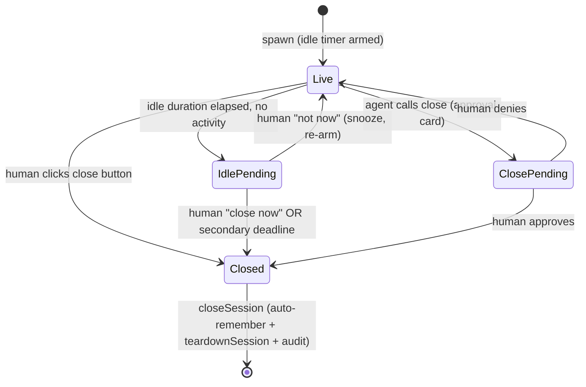

# Embedded Browser Resource Teardown (Explicit Close + Idle Reclaim) - Plan

## Goal Capsule

- Objective: Add usage-driven teardown to the embedded controlled browser so Steel/Chromium processes stop accumulating in always-on deployments. Three new close paths — agent-requested (human-confirmed), human button, and idle reclaim (prompt, then secondary-deadline auto-close) — all reuse the existing per-session teardown and auto-preserve login for the next open.
- Authority: `product_contract_source: ce-plan-bootstrap` (no upstream brainstorm). The two scope forks were resolved in-session by the user: unattended reclaim uses a secondary-deadline auto-close (not LRU); close auto-remembers a logged-in site.
- Execution profile: Standard, code. Server-first (close wrapper, MCP tool, idle timer, WS verb), then client (button, idle banner, close-confirm card), then i18n + changelog.
- Stop conditions: all three close paths work and are audited with trigger source; auto-remember preserves login across close→reopen; idle timer resets on activity, is suppressed during handoff, and never leaks on teardown/shutdown/crash; at most one "close?" prompt per session; bot sessions still receive no browser; lint clean; server/client/browser tests pass.
- Tail ownership: this plan ends at the Definition of Done. `ce-work` or `/goal` executes the units in dependency order.

---

## Product Contract

### Summary

The embedded browser today tears down only on session-delete, workspace-delete, or app-quit — events that rarely fire in always-on deployments, so each one-off browsing task leaves a full Chromium alive indefinitely. This plan adds the missing usage-driven teardown: an explicit close the agent can request (human-confirmed) and the human can trigger directly, plus an idle timer that prompts the human and auto-closes after a secondary deadline when unattended. Every close path reuses the existing per-session teardown and auto-remembers the current site's login so the next open is still signed in.

### Problem Frame

A browser is a short-lived task tool, but its destruction is coupled to the long-lived chat session's deletion. Closing the browser pane does not free the process (the pane is keep-alive by design); ending an agent turn does not free it; hitting the concurrent cap hard-refuses instead of evicting. In an always-on deployment — where the app stays up to serve bots and a human operator opens browsers across many sessions — Chromium processes accumulate at hundreds of MB each with nothing to reap them. The fix is to couple browser lifetime to browser *usage*, not to session lifetime, while keeping a human explicitly in the loop on every destruction (consistent with the existing submit/handoff confirmation discipline).

### Requirements

Explicit close:

- R1. The agent can request to close the browser through a new MCP tool; the browser is torn down only after the human confirms via an approval card.
- R2. The human can close the browser directly via a dedicated button in the browser state bar, where the click itself is the confirmation; the button is visually and functionally distinct from "collapse pane."

Idle reclaim:

- R3. A per-session idle timer starts when a browser is spawned; after a server-fixed idle duration with no browser activity, the human is prompted in-pane to confirm closing.
- R4. If the idle prompt goes unanswered past a server-fixed secondary deadline, the browser is auto-closed (the unattended bound); the auto-close is audited.
- R5. The idle timer resets on any browser activity — agent tool calls or human pane activity (the existing activity ping) — and is suppressed while a handoff is pending (the handoff timer owns that window).

Teardown and login:

- R6. All three close paths (agent-confirmed, human button, idle/timeout) reuse the existing per-session teardown — kill process, wipe profile, clear gate state, emit closed — and never touch site-auth revocation.
- R7. On any close, if the current site is logged in but not already remembered, it is auto-remembered (eTLD+1 scoped, value-only-in) so the next open re-injects the login.

Cross-cutting:

- R8. Every close action is audited with its trigger source (agent / human / idle-confirmed / idle-timeout), reusing the existing browser-audit positive-shape contract (origins and counts only — never values).
- R9. The agent's close request does not require control ownership: it asks via the approval card and the human's allow/deny is the decision; the human's button always works.
- R10. At most one "close?" prompt is in flight per session at a time (agent-close card and idle prompt do not stack); a human "not now" on the idle prompt snoozes it.

### Actors

- A1. Human (GUI session) — confirms agent-close, clicks the close button, responds to the idle prompt.
- A2. Agent (Claude, GUI session only) — requests close via the new tool.

Bot sessions are unchanged: they still never receive the browser MCP server, so they cannot request close and never spawn a browser.

### Scope Boundaries

In scope: the three close paths; the idle timer with secondary-deadline auto-close; auto-remember-on-close; source-tagged audit; the UI close button, idle banner, and close-confirm card; i18n and changelog.

Outside this feature's identity:

- LRU eviction at the concurrent-session cap (the unattended bound is handled by the secondary-deadline auto-close instead).
- Bot-session browser access.
- Changes to the site-auth revocation flow ("forget this site" stays a separate, explicit action).
- Multi-tab / multi-page support.

#### Deferred to Follow-Up Work

- Workspace-configurable idle and secondary durations (defaults are server-fixed for v1).
- A polished dedicated `BrowserCloseRenderer` (MVP renders the agent-close card through the existing fallback, matching how `requestHandoff` renders today).
- An optional REST `POST /api/browser/:sessionId/close` for non-panel callers; the human button uses the WS control-verb channel, which is the established pattern.
- Tuning the idle and secondary durations from real-world telemetry.

---

## Planning Contract

### Key Technical Decisions

- KTD1. Close paths converge on a new `closeSession(sessionId, source)` wrapper on `BrowserService`, not on raw `teardownSession`. The wrapper runs auto-remember (before the handle is nulled), then `teardownSession`, then audits with a source-tagged control verb. Session-delete, workspace-delete, and shutdown keep calling `teardownSession` directly — close *intent* is what triggers login preservation, and only the explicit close paths carry that intent.
- KTD2. Agent-close mirrors `handleRequestHandoff`'s `requestApproval` round-trip but with a single confirmation card (no two-phase takeover/handback). It does **not** call `controlGate`: asking to close is always allowed, and the approval card is the human-consent gate. Resolution cases (allow / deny / timeout / crash / approval-channel-failure) mirror handoff exactly.
- KTD3. The idle prompt and the agent-close card use different delivery channels because they have different blocking semantics. Agent-close rides the SSE `pending_approval` card because it blocks an in-flight tool handler. The idle timer fires with no handler in flight, so it cannot use `requestApproval`; it emits a new `browser_idle_prompt` event that rides the existing browser-state-channel fan-out, and the client renders it as an in-pane banner.
- KTD4. The idle timer's state lives on `RegistryEntry` in `BrowserService` (which owns the entry and teardown), not in `BrowserControlService` (which owns control-state, not resource lifecycle). It mirrors the handoff timer's `BrowserControlTimer` + arm/clear pattern with two server-fixed deadlines: the idle duration (default 15 min) and the secondary auto-close deadline (default 30 min after the prompt). It is suppressed while `handoff_pending`. Reset hooks are called *from* `BrowserControlService.recordActivity` (human ping) and *from* the agent tool-invocation path (every browser tool call) into `BrowserService.resetIdle`.
- KTD5. Auto-remember-on-close invokes the existing `rememberCurrentSite` path, which is already eTLD+1 scoped and value-only-in. The tension with U8's explicit-remember discipline is accepted (user decision); mitigations: (a) only the current page's eTLD+1 is remembered; (b) every auto-remember is audited (`logSiteAuth` action `remember`, with a detail flagging `auto-on-close`); (c) stored entries remain revocable from workspace settings; (d) every close path is human-gated, so no untrusted context auto-remembers. Typed errors (`empty_context`, `browser_no_page`) are swallowed so a no-login close still tears down cleanly.
- KTD6. The human close button uses the WS control-verb channel (`browserClose`), mirroring `browserTakeover` / `browserHandback` — not a REST route — because that is the established pattern for control verbs in `browser-pane-store`. The button is a distinct affordance from collapse-pane: collapse is a client-side hide that keeps the session alive; close is a server-side teardown.

### High-Level Technical Design

The close-decision lifecycle. The idle timer runs whenever a live browser exists and no handoff is pending; the three close paths each converge on `closeSession`, which auto-remembers then tears down.

Directional notes (not implementation spec): `Live` covers `agent_in_control` and `user_in_control` (the idle timer runs in both; it is suppressed only in `handoff_pending`). `resetIdle` is called on every agent browser tool call and every human activity ping, returning the session to the start of `Live`. The dedup rule (R10) means a `ClosePending` card suppresses the `IdlePending` transition while it is in flight.

### Assumptions

- Default durations (idle 15 min, secondary 30 min) are starting values pending real-world tuning; configurability is deferred.
- The MVP agent-close card renders through the existing `StructuredFallback` (matching `requestHandoff` today); a dedicated renderer is deferred.
- An idle "not now" snoozes for one more idle-duration interval — no growing backoff in v1.

---

## Implementation Units

### U1. closeSession wrapper, auto-remember, and source-tagged audit

- Goal: A single server entry point that every close path calls, encapsulating auto-remember-on-close + teardown + source-tagged audit.
- Requirements: R6, R7, R8.
- Dependencies: none (foundation for U2, U3, U4).
- Files:
  - `src/server/services/browser-service.ts` — add `closeSession(sessionId, source)`.
  - `src/server/services/browser-audit.ts` — no new method needed; `logControl` already accepts an arbitrary `verb`; extend the verb doc-comment to list the close verbs.
  - `src/server/services/__tests__/browser-service-close.test.ts` — new (must import `test-utils/test-env` first; use `createIsolatedStore` or `:memory:`).
- Approach: `closeSession(sessionId, source)` reads the live entry; if none, audit and return. Otherwise it (1) attempts `rememberCurrentSite` and swallows typed errors, (2) calls `teardownSession`, (3) audits `logControl` with verb `browser_closed_${source}`. The ordering is load-bearing: `rememberCurrentSite` reads `entry.handle.baseUrl` to export context, and `teardownSession` → `stopEntry` nulls the handle, so auto-remember must complete first.
- Patterns to follow: `rememberCurrentSite` (`browser-service.ts:522`); `teardownSession` (`browser-service.ts:478`); the swallow-errors precedent for remember (`websocket/server.ts:340`); the `logControl` call shape (`browser-control.ts:391`).
- Test scenarios:
  - Happy: logged-in unremembered site → `setWorkspaceSiteAuthEntry` called, teardown ran, audit verb `browser_closed_agent`.
  - Already-remembered site → entry updated (not duplicated), teardown, audit.
  - `empty_context` (no login state) swallowed → teardown still proceeds; audit records close without remember.
  - `browser_no_page` (about:blank) swallowed → teardown proceeds.
  - Ordering: `exportContext` is called against the *live* `baseUrl`, before `stopEntry` nulls the handle (assert call order).
  - No live entry → idempotent no-op + audit.
  - Each source tag (`agent` / `human` / `idle` / `timeout`) yields the matching verb.
- Verification: unit tests pass; `browser_closed` still emitted exactly once; no double teardown.
- Execution note: implement the ordering contract test-first — it is the easiest to get subtly wrong (auto-remember racing teardown).

### U2. Agent `close` MCP tool

- Goal: A seventh MCP tool `mcp__comate-browser__close` that asks the human to confirm closing.
- Requirements: R1, R9, R10.
- Dependencies: U1.
- Files:
  - `src/server/services/browser-tool-names.ts` — add `close` to `BROWSER_TOOL_NAMES`.
  - `src/server/services/browser-mcp.ts` — add the `close` tool definition + `handleClose`; add it to the returned array (`browser-mcp.ts:1362`).
  - `src/server/services/__tests__/browser-mcp.test.ts` — extend (import `test-utils/test-env` first).
- Approach: `handleClose` returns an ok-noop when there is no live session/page (nothing to close). Otherwise it issues a single `requestApproval` card (`payload: { kind: 'browser_close', reason }`) and blocks; on allow it calls `closeSession(sessionId, 'agent')`, on deny it returns a cancelled result, on approval-channel failure it returns a `toolError`. It does not call `controlGate` and does not rebuild a `session_lost` browser (if lost, there is nothing to close).
- Patterns to follow: `handleRequestHandoff` (`browser-mcp.ts:1051`) for the `requestApproval` round-trip and resolution cases; `requestApproval` (`browser-mcp.ts:471`); the `tool()` + zod builder (`browser-mcp.ts:1259`).
- Test scenarios:
  - Happy: agent close → card shown → human allows → `closeSession(source:'agent')` → tool returns ok-closed.
  - Human denies → cancelled result, no teardown.
  - Approval channel unavailable (no runtime) → `toolError`, no teardown.
  - No live browser → ok-noop without a card.
  - `closeSession` idempotency prevents double teardown if an idle close races the agent close (the prompt-level dedup is exercised in U3).
  - Bot session: the tool is absent (covered by the existing `if (!isBotSession)` injection guard at `chat-service.ts:1461`).
- Verification: tool present in GUI sessions only; teardown happens only on allow; the card carries the close payload.

### U3. Idle timer with secondary-deadline auto-close

- Goal: Per-session idle timer that prompts the human, then auto-closes when unattended, bounding memory.
- Requirements: R3, R4, R5, R10.
- Dependencies: U1 (uses `closeSession` for the timeout auto-close).
- Files:
  - `src/server/services/browser-service.ts` — idle fields on `RegistryEntry`; timer machinery (arm/clear/reset); prompt and close deadlines; `browser_idle_prompt` event emission; clear-on-teardown.
  - `src/server/services/browser-control.ts` — `recordActivity` also calls `BrowserService.resetIdle`.
  - `src/server/services/browser-mcp.ts` — the shared agent tool-invocation path calls `resetIdle` (every browser tool call).
  - `src/server/websocket/browser-state-channel.ts` — the new event rides the existing `forward` fan-out (no new subscriber machinery).
  - `src/server/services/__tests__/browser-service-idle.test.ts` — new (import `test-utils/test-env` first).
- Approach: Extend `RegistryEntry` (`browser-service.ts:145`) with `lastActivityAt`, `idlePromptAt`, `idleTimerHandle`, `idleCloseTimerHandle`, `idleSnoozed`. Extend the `BrowserServiceEvent` union (`browser-service.ts:135`) with `BrowserIdlePromptEvent`. Add server-fixed, injectable constants `DEFAULT_IDLE_PROMPT_MS` (15 min) and `DEFAULT_IDLE_CLOSE_MS` (30 min). Arm the prompt timer on spawn success (`browser-service.ts:748`); `resetIdle` clears and re-arms the prompt timer and bumps `lastActivityAt`. On prompt-timer fire, skip if any close prompt is already in flight (dedup), else set `idlePromptAt`, emit `browser_idle_prompt`, and arm the close timer. On close-timer fire, call `closeSession(sessionId, 'timeout')`. Suppress while `handoff_pending`. Clear all timers in `teardownSession`, `shutdown`, and `handleProcessExit`.
- Patterns to follow: `BrowserControlTimer` + `armTimer` / `clearTimer` / `handleTimeout` (`browser-control.ts:194`, `:559`, `:572`); `RegistryEntry` creation site (`browser-service.ts:445`); spawn-success site (`browser-service.ts:748`); teardown/crash sites (`browser-service.ts:479`, `:642`, `:825`); `emit` and the `forward` fan-out (`browser-service.ts:896`, `browser-state-channel.ts:129`).
- Test scenarios:
  - Prompt fires after the idle duration with no activity → `browser_idle_prompt` emitted, close timer armed.
  - An agent tool call resets the prompt timer (no prompt while active).
  - A human activity ping resets the prompt timer.
  - Secondary deadline fires → `closeSession(source:'timeout')`, `browser_closed` emitted.
  - Human "close now" → `closeSession(source:'idle')`.
  - Human "not now" → prompt cleared, prompt timer re-armed (snooze).
  - Dedup: an in-flight agent-close card suppresses the idle prompt (no second prompt).
  - Suppressed while `handoff_pending`.
  - Timers cleared on teardown / shutdown / crash — no fire-after-close, no leak.
  - Injectable timer + durations make tests deterministic (no real waits).
- Verification: timers deterministic in tests; no prompt or close fires after teardown; the event reaches a subscribed client via the channel.
- Execution note: build the timer with the injected `BrowserControlTimer` abstraction from the start so tests never wait on real time.

### U4. Human close WS verb and handler

- Goal: The human close button reaches the server over the WS control-verb channel.
- Requirements: R2 (server half), R8.
- Dependencies: U1.
- Files:
  - `src/server/websocket/types.ts` — add `'browserClose'` to `WsRequestType` and a `BrowserClosePayload`.
  - `src/server/websocket/server.ts` — add the dispatch case and `handleBrowserClose` mirroring `handleBrowserTakeover`, calling `browserService.closeSession(sessionId, 'human')`.
  - Relevant `websocket/server` tests — extend.
- Approach: add the `browserClose` WS request; the handler validates `sessionId`, calls `closeSession(sessionId, 'human')`, and acknowledges. Origin/host guards from the U9 sidecar hardening apply unchanged.
- Patterns to follow: `handleBrowserTakeover` (`websocket/server.ts:313`); the dispatch table (`websocket/server.ts:121`); `WsRequestType` (`websocket/types.ts`).
- Test scenarios:
  - Happy: `browserClose` → `closeSession(source:'human')` → ok.
  - No live session → ok (idempotent) or the appropriate result code.
  - Existing WS origin/host guards still gate the verb.
- Verification: the verb is wired; `closeSession` is invoked with the `human` source.

### U5. Client: close button, idle banner, close-confirm card

- Goal: The human-facing surface — the close button, the idle prompt banner, and the agent-close approval card.
- Requirements: R2 (client half), R3 (client half), R10.
- Dependencies: U2, U3, U4.
- Files:
  - `src/client/components/browser/BrowserStateBar.tsx` — add the close button after the popout button, mirroring its shape.
  - `src/client/stores/browser-pane-store.ts` — extend `BrowserPendingVerb` with `'close'`; add the `close` binding and the third `runVerb` arm; handle `browser_idle_prompt`; add confirm/snooze actions.
  - `src/client/components/browser/` — an in-pane idle banner (inline in `BrowserPane` or `BrowserStateBar`, driven by store state).
  - `src/client/components/tool-renderers/renderers/` — optional `BrowserCloseRenderer` (deferred; MVP uses the existing fallback).
  - `src/client/components/browser/__tests__/` — jsdom tests; one `*.browser.test.tsx` for the button.
- Approach: `BrowserStateBar` adds a `close` selector and renders an icon button (distinct `X` icon, `data-testid="browser-close-button"`) inside the `ml-auto` cluster, gated to live states. `browser-pane-store` adds `close: (sessionId) => runVerb(sessionId, 'close')` (third arm → `wsClient.request('browserClose', …)`), handles `browser_idle_prompt` by setting an `idlePrompt` flag, and exposes `confirmIdleClose` / `snoozeIdle` actions. The idle banner renders from `idlePrompt` and offers "Close now" / "Not now". The agent-close approval card renders its `{ kind: 'browser_close', reason }` payload via the existing fallback for v1.
- Patterns to follow: the popout button (`BrowserStateBar.tsx:220`); `runVerb` (`browser-pane-store.ts:275`); the `browser_closed` → `_applyClosed` reset (`browser-pane-store.ts:495`).
- Test scenarios:
  - Close button renders only in live states; clicking calls `runVerb('close')` → `browserClose` WS.
  - Close button is distinct from collapse (different handler, different testid, different effect).
  - `browser_idle_prompt` event sets `idlePrompt` → banner shows.
  - "Close now" → confirm WS → banner clears on `browser_closed`.
  - "Not now" → snooze WS → banner clears (re-fire tested server-side in U3).
  - `browser_closed` resets session state via the existing `_applyClosed`.
  - The agent-close approval card renders with the close payload.
- Verification: button and banner render correctly; the WS verbs fire; state resets on close. A browser test covers the button click end-to-end.

### U6. i18n and changelog

- Goal: User-facing strings in both locales and a changelog entry.
- Requirements: supports all UI in U5.
- Dependencies: U5 (strings finalized).
- Files:
  - `src/client/i18n/en/browser.json`, `src/client/i18n/zh-CN/browser.json` — keys for the close button label/tooltip, the close-confirm card title and description, and the idle banner text and buttons.
  - `CHANGELOG.md` — an `Added` entry following Keep a Changelog.
- Approach: add the keys to both locales; write a changelog entry naming explicit close, idle reclaim with secondary-deadline auto-close, and auto-remember-on-close.
- Patterns to follow: the existing `browser.json` structure; the changelog format.
- Test expectation: none — string keys and changelog prose; the existing `browser-i18n.test.ts` consistency check verifies both locales have matching keys.
- Verification: both locales have matching keys; the i18n test passes.

---

## Verification Contract

| Command | Applies to | What it proves |
|---|---|---|
| `npm run test:server` | U1, U2, U3, U4 | `browser-service-close`, `browser-service-idle`, `browser-mcp` close, the `browserClose` WS verb. Every server test imports `test-utils/test-env` first and uses `createIsolatedStore` / `:memory:`. |
| `npm run test:client` | U5 | jsdom tests for the close button, idle banner, store close/idle actions. |
| `npm run test:browser` | U5 | Playwright test for the close button end-to-end. |
| `npm run lint` | all | ESLint (`noUnusedLocals`, `noUnusedParameters`, react-hooks) clean. |
| Manual / behavioral | all | In a GUI session: open a browser, let it idle, confirm the prompt; agent `close` → card; human button → closes; verify the Chromium process is gone (`ps`); reopen → site-auth re-injects the login. |

---

## Definition of Done

Global:

- All three close paths work: agent-requested (approval card, human-confirmed), human button (WS verb), and idle reclaim (in-pane prompt + secondary-deadline auto-close).
- Auto-remember-on-close preserves login for the next open (verified by reopening and confirming the session is still signed in).
- Every close action is audited with its trigger source; audit never records values.
- The idle timer resets on agent tool calls and human activity, is suppressed during `handoff_pending`, and is cleared on teardown / shutdown / crash (no leaks, no fire-after-close).
- At most one "close?" prompt per session at a time.
- Bot sessions still receive no browser MCP server and cannot close or spawn.
- Lint clean; server, client, and browser tests pass; i18n keys present in both locales; changelog updated.

Per-unit: each unit's Verification criterion is met.

Cleanup: no dead-end or experimental code from abandoned approaches remains in the diff.
