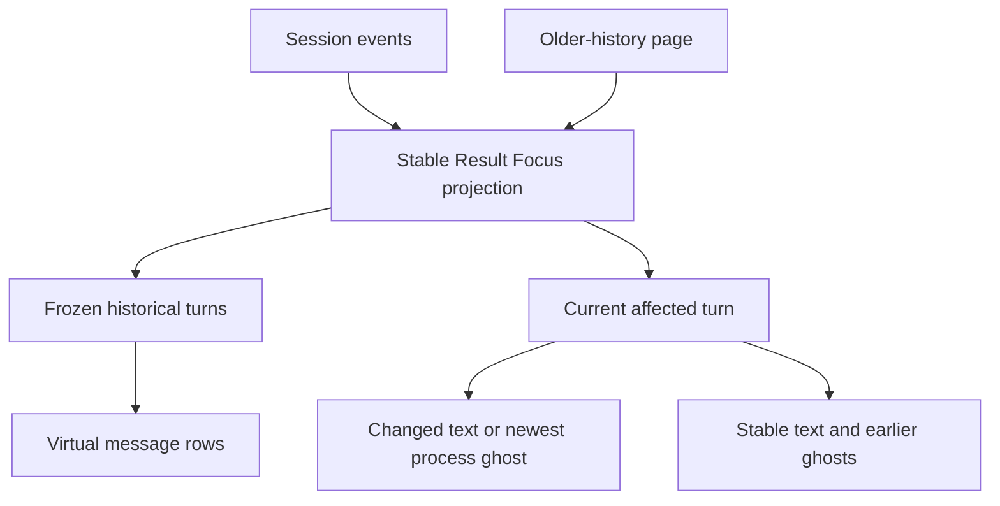
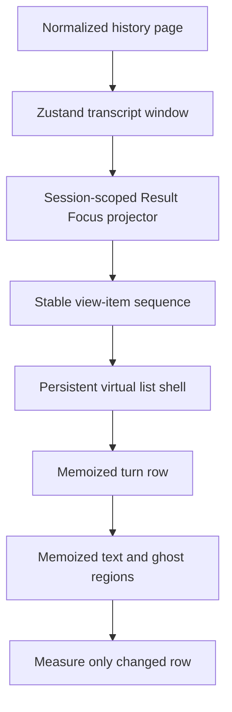
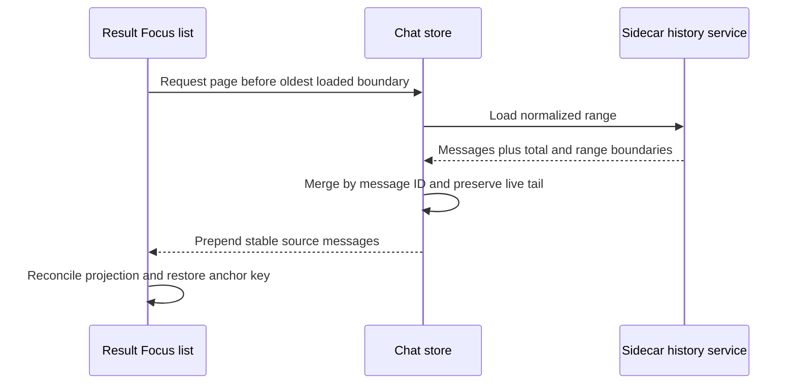

# Result Focus Incremental Message Rendering - Plan

## Goal Capsule

- **Objective:** Make Result Focus update incrementally so streaming changes cannot refresh stable message content or destabilize long-session virtualization.
- **Authority:** The Product Contract and its session-settled decisions override implementation convenience; existing Linear behavior and repository conventions govern details the contract leaves open.
- **Stop conditions:** Stop and return to planning if stable source identity cannot be recovered for historical parts, normalized history pages cannot expose deterministic boundaries, or the proposed list shell changes Linear behavior.
- **Execution profile:** Characterize the current render and scroll failures first, then implement in dependency order with focused client, server, and real-browser proof.
- **Tail ownership:** The implementing workflow owns code, tests, diagnostics cleanup, review fixes, and repo-local commits; PR creation follows the user's later handoff choice.

---

## Product Contract

### Summary

Result Focus will maintain a stable, incremental session view in which historical turns and unchanged regions preserve identity across streaming events.
Long sessions will keep a recent in-memory window with seamless access to older history, without flashing, overlap, scroll jumps, or missing messages.

### Problem Frame

Opening a long historical session in Result Focus can produce overlapping message content, repeated repainting, and continuous panel flashing. During live streaming, a new tool use appears to refresh the message list even though only the latest process ghost should change. After the list switches to virtualization, earlier content can become unreachable while only the newest process regions remain visible.

The current rendering path already attempts turn-level reference caching and component memoization, but its coverage stops short of stable regions, virtual row measurement, and concurrent history loading. User-visible instability remains the product failure regardless of whether it originates in React render work, DOM commits, virtual measurements, or scroll correction.

### Key Decisions

- **Turn-level render isolation.** The current assistant turn may render when its structure changes, but historical turns and unchanged children inside the current turn must not render. (session-settled: user-directed — chosen over leaf-only and DOM-only isolation: it delivers strict practical isolation without requiring every streaming field to become an independent subscription.)
- **Incremental Result Focus projection.** Result Focus will consume a stable per-session projection that replaces only the affected turn and regions. (session-settled: user-approved — chosen over extending the existing memo chain and separating a live tail from virtual history: it addresses identity and virtualization together without creating two list semantics.)
- **Windowed history with seamless prepend.** Long sessions will load a recent window first and fetch older content as the user scrolls upward. (session-settled: user-directed — chosen over loading all history or disabling virtualization: it preserves bounded work while keeping all history reachable.)
- **Result Focus-only scope.** Linear mode will receive regression protection but will not move to the new incremental projection in this work. (session-settled: user-directed — chosen over unifying both display modes: it limits risk to the affected experience.)
- **Heavy-session release baseline.** Verification will cover 2,000 historical messages and approximately 100 tool steps in the active turn under sustained streaming. (session-settled: user-directed — chosen over a 500-message baseline: it represents the heavy sessions where the defect damages product quality.)

### Incremental View Contract

The projection has two independent change directions: history pages prepend stable turns at the head, while streaming replaces only affected content at the tail. Neither direction may invalidate stable content produced by the other.

### Requirements

**Render isolation**

- R1. A streaming event must preserve the object identity of every unaffected historical turn in the Result Focus projection.
- R2. When the current assistant turn changes, only that turn may be replaced in the projection.
- R3. Unchanged text regions and earlier process regions inside the current turn must preserve stable identity and skip component rendering.
- R4. A new or updated tool use must render only the process ghost whose visible state changed; existing text and process ghosts must not render.
- R5. Time-based updates for a running process must remain local to its active ghost and must not cause sibling regions or message rows to render.
- R6. Result Focus must not depend on incidental array, callback, result-map, or search-state reference changes to decide whether stable message content renders.

**Virtualized history**

- R7. Long sessions must open with the recent message window and allow all older history to become reachable through upward scrolling.
- R8. Loading older history must prepend each message exactly once while preserving the user's visible anchor and existing virtual row measurements.
- R9. Streaming and older-history loading may occur concurrently without either path discarding, duplicating, reordering, or hiding content from the other.
- R10. Result Focus must keep one list implementation when its message count crosses the existing virtualization threshold.
- R11. Changes within the active turn must remeasure only virtual rows whose rendered height can have changed.
- R12. Opening a cached or previously hidden long session must restore a valid measurement state before showing its content.

**Quality and compatibility**

- R13. Result Focus must remain visually stable during initial history rendering, sustained streaming, virtualization changes, and history prepend.
- R14. Development diagnostics must distinguish component renders, DOM commits, virtual row measurements, and scroll-position changes during investigation.
- R15. Automated verification must assert render isolation and history reachability instead of relying only on snapshots or final DOM content.
- R16. Linear mode must retain its existing message rendering, search, scrolling, tool display, and streaming behavior.
- R17. Production builds must not retain noisy diagnostic logging or render-count overhead introduced for investigation.

### Key Flows

- F1. Open a long historical session
  - **Trigger:** A user opens a Result Focus session whose history exceeds the virtualization threshold.
  - **Steps:** The recent window appears; virtual rows receive stable measurements; the view settles at the intended latest position.
  - **Outcome:** The panel shows coherent content once, with no overlap, continuous redraw, or inaccessible loaded messages.
  - **Covered by:** R7, R10, R12, R13.
- F2. Receive streaming content
  - **Trigger:** Text, thinking, tool-use input, or a tool result changes the active assistant turn.
  - **Steps:** The projection replaces the affected turn; unchanged regions retain identity; only changed children render; affected row height is remeasured when necessary.
  - **Outcome:** The active content advances while historical turns and stable siblings remain untouched.
  - **Covered by:** R1-R6, R11, R13.
- F3. Load older history while streaming
  - **Trigger:** The user scrolls near the top while the active turn continues receiving events.
  - **Steps:** Older messages prepend once; the visible anchor is restored; tail updates continue through the independent streaming path.
  - **Outcome:** The user can keep navigating backward without losing history or seeing the active turn destabilize the viewport.
  - **Covered by:** R8, R9, R13.

### Acceptance Examples

- AE1. **Covers R1-R5.** Given several completed turns and an active turn with multiple text and process regions, when a new tool use arrives, then completed turns and unchanged regions retain their prior render counts while only the affected current-turn child renders.
- AE2. **Covers R5.** Given one running process ghost and several completed ghosts, when elapsed time advances, then only the running ghost updates and no message row outside its row is measured.
- AE3. **Covers R7-R9.** Given a 2,000-message session opened on its recent window, when the user repeatedly scrolls upward while streaming continues, then every requested history page remains reachable in order with no duplicates, gaps, or anchor jumps.
- AE4. **Covers R10, R13.** Given a Result Focus session whose message count crosses the existing virtualization threshold, when another message arrives, then the same list shell and existing row DOM remain mounted without overlap, blank intervals, or flashing.
- AE5. **Covers R11-R13.** Given a virtualized session at the bottom, when streaming grows only the active row, then only that row may be remeasured and the viewport remains pinned without oscillation.
- AE6. **Covers R12.** Given a cached long session was hidden while background streaming changed its tail, when it becomes visible, then valid rows appear after one measurement recovery with no collapsed or missing history.
- AE7. **Covers R16.** Given equivalent Linear mode scenarios, when this work is applied, then its rendering and navigation behavior remains unchanged.

### Success Criteria

- The heavy-session baseline of 2,000 historical messages and approximately 100 active-turn tool steps completes sustained streaming without historical-turn renders or unchanged current-region renders.
- Browser verification shows no message overlap, list flashing, repeated scroll correction, or loss of reachable history across all three key flows.
- Virtual measurement evidence shows that streaming remeasures only rows whose height may have changed and that history prepend does not trigger a full-list remeasurement cycle.
- Existing Linear mode behavior and tests remain green.

### Scope Boundaries

- Linear mode will not adopt the incremental Result Focus projection in this work.
- The app will not load an entire long-session history into memory on open.
- Result Focus virtualization will not be disabled as a workaround.
- The message panel will not be split into separate historical and live-tail lists.
- Production render logging, profiler hooks, and diagnostic counters are excluded from the shipped experience.

### Dependencies and Assumptions

- Message and part identifiers are sufficient to provide stable logical identity across streaming updates and history pages.
- Older-history retrieval can continue to return deterministic, non-overlapping pages for prepend.
- Browser-level tests can observe scroll geometry and rendered row presence; render instrumentation may be enabled only in development or tests.

### Sources and Research

- `src/client/components/MessageList.tsx` selects virtualization and derives Result Focus view items.
- `src/client/components/VirtualizedMessageList.tsx` owns virtual measurement, scroll anchoring, and older-history loading.
- `src/client/components/message-grouping.ts` contains the current merged-turn cache and Result Focus region grouping.
- `src/client/components/ChatMessageRenderer.tsx` contains the existing turn-level memo boundary.
- `src/client/components/ProcessRegionGhost.tsx` contains local elapsed-time updates for process ghosts.
- `src/client/stores/chat-store.ts` owns the recent message window, streaming mutations, and history prepend.
- `src/server/services/chat-service.ts` normalizes SDK history and currently applies pagination before normalization.
- `src/server/websocket/server.ts` carries history requests and responses between the client and sidecar.
- `docs/plans/2026-05-24-008-fix-virtualized-message-list-scroll-plan.md` records prior virtual scrolling behavior and constraints.
- `docs/plans/2026-05-28-010-feat-session-dom-caching-plan.md` records cached-session measurement risks.
- `docs/plans/2026-07-16-003-feat-process-region-duration-plan.md` records the live ghost duration behavior.
- `docs/plans/2026-07-16-005-feat-process-region-drawer-realtime-collapse-plan.md` records adjacent Result Focus streaming behavior.

---

## Planning Contract

### Key Technical Decisions

- **KTD1. Keep the incremental projection outside the chat store.** A session-scoped projector owned by the mounted Result Focus list will reconcile source messages into stable view objects and release its cache on unmount. Zustand remains the source of transcript truth, while the projection remains disposable derived state. This implements the Product Contract's incremental projection decision. (session-settled: user-approved — chosen over extending the existing memo chain or creating a separate live-tail list: the projector provides one identity authority for normal and virtual rendering.)
- **KTD2. Give turns and regions source-derived stable identities.** A turn key comes from its first source message, while text and process region keys come from their first durable source part anchor. Joined assistant-message IDs remain drawer lookup data and never serve as child render keys. This prevents a newly appended assistant message from remounting every existing child in the active turn.
- **KTD3. Reconcile changed turns with structural sharing.** When a source message changes, the projector rebuilds only its containing turn, then reuses unchanged region objects by stable key and content dependency. The current turn renderer may execute, but memoized text and ghost children receive stable objects and callbacks unless their visible state changed. This implements turn-level isolation. (session-settled: user-directed — chosen over leaf-only and DOM-only isolation: it confines work without redesigning the event store into per-part subscriptions.)
- **KTD4. Make Result Focus use one persistent virtual list shell.** Result Focus will render empty, short, and long sessions through the same virtual-list component so crossing the existing count threshold cannot replace the scroll container or message tree. Linear mode keeps its existing threshold-based path and behavior. This is the plan-time implementation of the confirmed Result Focus-only scope. (session-settled: user-directed — chosen over unifying both display modes: only the affected mode changes architecture.)
- **KTD5. Paginate normalized history with an explicit range envelope.** The sidecar will normalize and timestamp the transcript before slicing, then return the normalized total plus page start and end boundaries. Tasks, subagents, and workflows continue to derive from the complete transcript. The client will request the preceding range from its recorded oldest boundary rather than infer offsets from the mutable in-memory array length.
- **KTD6. Preserve intentionally loaded history while the session is mounted.** Initial load remains a bounded recent window, but pages the user explicitly loads are not removed by subsequent tail streaming while that session stays cached. DOM cache eviction will shrink the transcript back to its recent tail and reset range metadata because the current eviction path closes subscriptions but does not release messages. This implements seamless prepend without unbounded cross-session retention. (session-settled: user-directed — chosen over full history on open or disabling virtualization: initial work stays bounded while explored history remains stable.)
- **KTD7. Separate diagnostic proof from production behavior.** Test/dev-only observers may count renders, commits, measurements, and scroll corrections, but production code must not log per-render data or install permanent profiler overhead. Browser geometry and component counters are complementary gates.
- **KTD8. Use the heavy-session baseline as a deterministic fixture.** Tests will generate 2,000 historical messages and approximately 100 tool steps without checking in a large transcript fixture. (session-settled: user-directed — chosen over a 500-message release baseline: the heavier case represents the reported quality failure.)

### High-Level Technical Design

The Result Focus list becomes the owner of one session-scoped projection. Both source changes at the tail and history pages at the head pass through the same reconciler, which preserves stable turn and region objects before the virtualizer sees them.

History navigation uses explicit normalized boundaries. Appends can increase the total without changing the oldest loaded boundary, so an in-flight prepend remains valid while streaming continues.

### Implementation Constraints

- Do not duplicate transcript state inside the projection; cache only derived turns, regions, lookup data, and their dependency references.
- Stable region identity must survive growth of a merged assistant turn and insertion of new trailing regions.
- Process drawer behavior may continue to receive the current joined message ID and region index, but render keys and memo equality must not depend on either mutable value.
- Search changes may re-render only rows containing the previous or next active match; an empty search must retain stable shared references.
- Virtual measurement invalidation must be row-scoped during streaming and may be full-list only for explicit visibility recovery or global presentation changes such as font size.
- History merging must remain duplicate-safe under reconnect replay and concurrent streaming.
- History page slicing must not reduce task, subagent, or workflow hydration coverage from the complete transcript.
- Repeated history requests must assign the same derived timestamp to the same source message within one transcript snapshot.

### Sequencing

1. Establish projector identity and render-count characterization before changing list behavior.
2. Integrate stable regions into the renderer before replacing the Result Focus list shell.
3. Add normalized range metadata before changing older-history request logic.
4. Combine the persistent shell and range-aware prepend, then validate concurrent streaming in a real browser.
5. Remove temporary diagnostics and run the full compatibility gates.

### System-Wide Impact

- **Client state:** Transcript arrays remain authoritative; new history-range metadata and expanded pages must follow session cache and eviction lifecycles.
- **WebSocket contract:** History responses gain normalized pagination metadata used by the client store.
- **Rendering:** Result Focus short sessions move onto the virtual shell; Linear rendering remains unchanged.
- **Search and drawers:** Stable render identities must coexist with mutable search state and joined-message drawer lookups.
- **Performance:** The design reduces render and measurement fan-out while accepting that intentionally explored history can remain resident until session eviction.

### Risks and Mitigations

| Risk | Mitigation |
|---|---|
| A process region has no tool ID to anchor identity | Carry source message ID and source part index through adaptation; do not derive identity from content text. |
| Normalization drops SDK records and breaks raw offsets | Slice only after normalization and return boundaries in the normalized coordinate space. |
| Memo equality hides a real visual update | Define visible dependencies per region and test text deltas, tool input completion, results, errors, duration, search, and drawer activation separately. |
| Always-on virtualization regresses short Result Focus sessions | Cover empty, sub-threshold, threshold-crossing, and long sessions in browser tests using the same shell. |
| Prepend and streaming race loses one side | Merge against the latest store state by message ID and assert both head and tail survive an in-flight page response. |
| Expanded history grows memory across cached sessions | Shrink an evicted session to its recent tail and reset its range metadata; do not preload pages the user has not requested. |

### Deferred to Implementation

- Exact projector and diagnostic helper names may change to match local conventions.
- The smallest reliable browser assertion for paint flashing is execution-time discovery; geometry stability and DOM continuity remain mandatory even if paint events are not directly exposed by the harness.

---

## Implementation Units

### U1. Build the stable Result Focus projection

**Goal:** Introduce a pure, session-scoped projector that reconciles transcript messages into structurally shared turns, regions, and result dependencies.

**Requirements:** R1-R6, R15; F2; AE1, AE2; KTD1-KTD3, KTD7.

**Dependencies:** None.

**Files:**
- Create: `src/client/lib/result-focus-view.ts`
- Create: `src/client/lib/result-focus-view.test.ts`
- Modify: `src/client/components/message-grouping.ts`
- Modify: `src/client/components/message-grouping.test.ts`
- Modify: `src/client/components/chat-message-adapter.ts`
- Modify: `src/client/components/chat-message-adapter.test.ts`

**Approach:** Preserve source-message and source-part anchors through merge and adaptation, then reconcile view objects against the previous projection. Reuse untouched turns directly; for a changed turn, reuse every text or process region whose source anchors and visible dependencies are unchanged. Build affected tool-result/error state into the relevant projected region so a new global result map cannot invalidate unrelated rows.

**Execution note:** Start with failing referential-identity tests that reproduce joined-message ID growth and tool-result arrival before replacing the existing caches.

**Patterns to follow:** The existing immutable message updates in `src/client/stores/chat-store.ts`, the WeakMap intent in `src/client/components/message-grouping.ts`, and adapter cache tests in `src/client/components/chat-message-adapter.test.ts`.

**Test scenarios:**
- Covers AE1. Append a new assistant source message to the active turn; the turn changes while prior text and process region objects remain reference-equal.
- Stream a text delta into one part; only its text region changes and all process regions remain reference-equal.
- Start, stream input for, complete, and receive an error result for one tool; only its containing active process region changes at each visible transition.
- Advance a merged turn from one to several source messages; its turn key and all prior source-derived region keys remain stable.
- Prepend unchanged historical source messages; existing projected turns retain identity and new turns appear only at the head.
- Reconnect replay supplies a duplicate message or result; projection order and identities remain unchanged.
- Drop all references by disposing the projector; no module-level session map retains the projection.

**Verification:** Pure projector tests prove structural sharing and complete visible-state invalidation without rendering React components.

### U2. Isolate current-turn child rendering

**Goal:** Render projected regions through stable memo boundaries so current-turn updates do not render old text or ghost children.

**Requirements:** R3-R6, R14-R17; F2; AE1, AE2, AE7; KTD2, KTD3, KTD7.

**Dependencies:** U1.

**Files:**
- Modify: `src/client/components/ChatMessageRenderer.tsx`
- Modify: `src/client/components/ChatMessageRenderer.result.test.tsx`
- Modify: `src/client/components/ProcessRegionGhost.tsx`
- Modify: `src/client/components/ProcessRegionGhost.test.tsx`
- Modify: `src/client/components/MessageList.result.test.tsx`

**Approach:** Add explicit memoized result-text and process-ghost row boundaries that consume projected region objects and stable event parameters. Keep the parent turn renderer allowed to execute, but prevent fresh closures, joined IDs, region indices, unrelated result maps, and empty search arrays from invalidating stable children. Preserve drawer arguments at activation time without using them as render identity.

**Patterns to follow:** The existing custom comparator on `ChatMessageRenderer`, test-local render counters in `MessageList.result.test.tsx`, and local elapsed state in `ProcessRegionGhost`.

**Test scenarios:**
- Covers AE1. A new tool use in the active turn increments only the affected ghost counter; completed turns, prior text, and prior ghosts keep their counts.
- Covers AE2. A duration tick renders the running ghost only and completes at the final timestamp without touching siblings.
- A tool result changes the affected ghost error state without rendering ghosts for other tool IDs.
- A search match moving between two text regions renders those regions but does not render unrelated ghosts or historical turns.
- Clicking a stable ghost after the merged turn grows opens the correct current process region.
- Linear mode continues to render text, thinking, tools, results, and expansion state through its existing path.

**Verification:** Component render counters enforce Turn-level isolation, and all existing Result Focus and Linear renderer tests remain green.

### U3. Add normalized history range metadata

**Goal:** Make initial tail loading and older-page retrieval use deterministic boundaries that remain correct during concurrent streaming.

**Requirements:** R7-R9, R15; F1, F3; AE3; KTD5, KTD6.

**Dependencies:** None.

**Files:**
- Modify: `src/server/services/chat-service.ts`
- Modify: `src/server/services/chat-service.test.ts`
- Modify: `src/server/websocket/server.ts`
- Modify: `src/server/websocket/types.ts`
- Modify: `src/client/stores/chat-store.ts`
- Modify: `src/client/stores/chat-store.test.ts`

**Approach:** Normalize and assign history timestamps across the complete SDK transcript before applying tail or preceding-range slicing, and return normalized total/start/end metadata with each page. Continue deriving tasks, subagents, and workflows from the complete transcript. Track the loaded range per session in the store. Initial load requests a recent tail; older fetches use the recorded start boundary; merge responses into the latest state by ID so events received while the request was in flight survive. Extend DOM cache eviction to shrink the evicted transcript to its recent tail and reset its range metadata.

**Execution note:** Add server and store race characterization before changing pagination because the current array-length offset is the behavior being replaced.

**Patterns to follow:** Existing `loadMessagesAfter` normalization, duplicate-safe history merging in `fetchOlderMessages`, and session-keyed store maps cleared by workspace/session lifecycle actions.

**Test scenarios:**
- The sidecar normalizes a transcript containing ignored SDK records, then returns a tail page with total and boundaries in normalized coordinates.
- Requesting the page before a known start returns the immediately preceding normalized messages with no overlap.
- The same historical message requested through two page shapes receives the same derived timestamp within one transcript snapshot.
- Initial client load stores only the recent page while retaining the full normalized total.
- Covers AE3. Repeated prepend requests reconstruct all 2,000 normalized messages exactly once and in order.
- A streaming append lands while an older page is in flight; the response preserves the append, prepends the page, and leaves the next boundary correct.
- Reconnect replay overlaps a page response; ID deduplication preserves one copy and stable order.
- A cached session with expanded history retains its loaded range; eviction shrinks it to the recent tail and resets range metadata consistently.
- Tail-only initial loading still hydrates tasks, subagents, and workflows found outside the returned message page.
- A page request failure clears loading state without changing the prior range or messages and can be retried.

**Verification:** Server and store tests prove normalized boundary math, race-safe merging, cleanup, and retry behavior without relying on UI scroll state.

### U4. Move Result Focus to a persistent virtual shell

**Goal:** Render every Result Focus session through one stable virtual list and scope measurement, anchoring, and visibility recovery to the change that occurred.

**Requirements:** R7-R13, R15, R16; F1-F3; AE3-AE7; KTD4-KTD6.

**Dependencies:** U1, U2, U3.

**Files:**
- Modify: `src/client/components/MessageList.tsx`
- Modify: `src/client/components/MessageList.test.tsx`
- Modify: `src/client/components/VirtualizedMessageList.tsx`
- Modify: `src/client/components/VirtualizedMessageList.browser.test.tsx`

**Approach:** Branch by display mode before applying the legacy count threshold. Result Focus creates the projector once and passes projected items plus history-range state into a virtual list that owns empty, short, and long states. Keep stable item keys and cached measurements across appends. On prepend, capture the first visible key and its pixel offset, merge the page, and restore that exact anchor. Remeasure one row for changed content; reserve full measurement for visibility recovery or global size changes.

**Patterns to follow:** Existing `getItemKey`, prepend anchor effect, hidden-to-visible recovery, and browser geometry helpers in `VirtualizedMessageList.browser.test.tsx`.

**Test scenarios:**
- Covers AE4. Grow a Result Focus session from below to above 50 source messages; the scroll element and existing row DOM nodes remain continuous with no blank or overlapping interval.
- Empty and short Result Focus sessions render correctly through the virtual shell without changing visible styling or keyboard behavior.
- Covers AE5. Stream growth into the last row while at bottom; only that row is measured and scroll position remains pinned without oscillation.
- Stream while scrolled away from bottom; the viewport and anchor stay fixed and the scroll-to-bottom control appears.
- Covers AE3. Prepend an older page while streaming; the previous first visible row retains its pixel position and the live tail remains present.
- Covers AE6. Hide a cached virtual session, stream into its tail, then reveal it; one recovery measurement produces valid non-overlapping rows.
- Change chat font size; a deliberate full measurement occurs once and all row heights settle correctly.
- Covers AE7. Linear sessions below and above the threshold retain their existing component path, scrolling, and search behavior.

**Verification:** Browser tests assert DOM continuity, row geometry, measurement counts, anchor offsets, and complete history reachability across the three key flows.

### U5. Add heavy-session regression and remove diagnostics

**Goal:** Prove the full quality contract at release scale and ensure investigation tooling does not ship as production overhead.

**Requirements:** R13-R17; AE1-AE7; KTD7, KTD8.

**Dependencies:** U2, U3, U4.

**Files:**
- Modify: `src/client/components/MessageList.result.test.tsx`
- Modify: `src/client/components/VirtualizedMessageList.browser.test.tsx`
- Modify: `src/client/stores/chat-store.test.ts`
- Modify: `CHANGELOG.md`

**Approach:** Generate deterministic heavy-session data in tests, drive representative streaming and prepend sequences, and assert bounded render/measurement fan-out rather than wall-clock timing. Use browser geometry and DOM-node continuity as the automated visual proxy, then perform one React DevTools/paint-flashing smoke pass. Remove temporary console logging and leave only test seams with zero production work when unused.

**Patterns to follow:** Existing generated-message helper in `VirtualizedMessageList.browser.test.tsx`, render counters in `MessageList.result.test.tsx`, and changelog entries for prior Result Focus fixes.

**Test scenarios:**
- Load 2,000 historical messages with approximately 100 active-turn tool steps and sustain text, tool input, tool completion, and result events; historical render counts do not change.
- Repeatedly load older pages under the heavy fixture while streaming; every message becomes reachable once and row geometry never overlaps.
- Switch between cached heavy sessions; visibility recovery settles without continuous measurements or flashing.
- Run the same representative transcript in Linear mode; content, search, expansion, and scrolling remain unchanged.
- Build production output and inspect the affected source/bundle for temporary render logs, counters, or profiler installation.

**Verification:** The heavy fixture passes in client and Chromium browser suites, manual DevTools highlighting shows only the active turn changing, and production diagnostics cleanup is confirmed.

---

## Verification Contract

| Gate | Command | Coverage | Pass signal |
|---|---|---|---|
| Focused projection and renderer tests | `npm run test:client -- src/client/lib/result-focus-view.test.ts src/client/components/message-grouping.test.ts src/client/components/chat-message-adapter.test.ts src/client/components/ChatMessageRenderer.result.test.tsx src/client/components/ProcessRegionGhost.test.tsx src/client/components/MessageList.result.test.tsx` | U1, U2 | Stable identity and render-count assertions pass. |
| Store and history contract tests | `npm run test:client -- src/client/stores/chat-store.test.ts` | U3 | Range, merge-race, cleanup, and retry scenarios pass. |
| Server history tests | `npm run test:server` | U3 | Normalized pagination metadata, boundaries, and full-transcript metadata hydration pass. |
| Real-browser message tests | `npm run test:browser -- src/client/components/VirtualizedMessageList.browser.test.tsx` | U4, U5 | Geometry, continuity, measurement, scroll, and heavy-session scenarios pass in Chromium. |
| Full client regression | `npm run test:client` | U1-U5 | Existing Result Focus and Linear suites pass. |
| Static quality | `npm run lint` | U1-U5 | No lint warnings or errors. |
| Production build | `npm run build` | U1-U5 | TypeScript, Vite, and CLI builds complete successfully. |
| Manual visual smoke | React DevTools render highlighting plus browser paint/layout inspection on the heavy fixture | U5 | Only the active turn highlights; no flashing, overlap, repeated scroll correction, or missing history is visible. |

The optimization exit criterion is structural rather than timing-based: each streaming event may replace the active turn, but it must produce zero renders for historical turns and unchanged active-turn regions, and zero measurements for unaffected virtual rows.

---

## Definition of Done

- The artifact remains aligned with every Product Contract requirement, flow, acceptance example, success criterion, and scope boundary.
- U1 proves source-derived stable turn and region identity under append, delta, result, replay, and prepend changes.
- U2 proves Turn-level render isolation, including duration and search exceptions, without Linear regressions.
- U3 proves normalized range pagination and race-safe history merging across client and sidecar.
- U4 proves a persistent Result Focus virtual shell with stable geometry, scoped measurement, anchor preservation, and visibility recovery.
- U5 passes the 2,000-message and approximately 100-tool-step baseline and removes temporary diagnostics from production paths.
- Every gate in the Verification Contract passes, including full client, server, browser, lint, and production build checks.
- Manual React DevTools and browser inspection finds no full-list refresh, flashing, overlap, scroll oscillation, or inaccessible history.
- No abandoned experimental cache, alternate list path, debug logger, profiler hook, or unused compatibility shim remains in the final diff.
- The final diff does not refactor Linear mode beyond changes required to preserve its existing behavior and tests.
