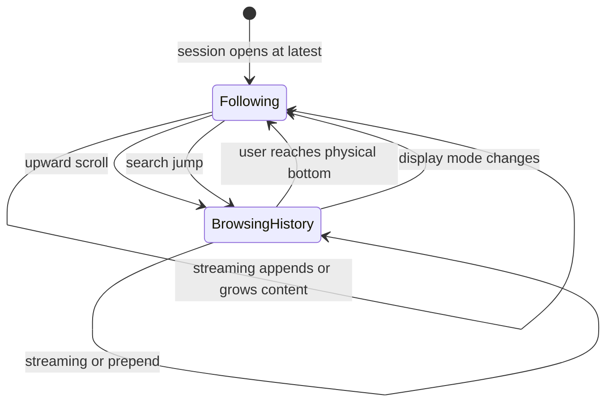
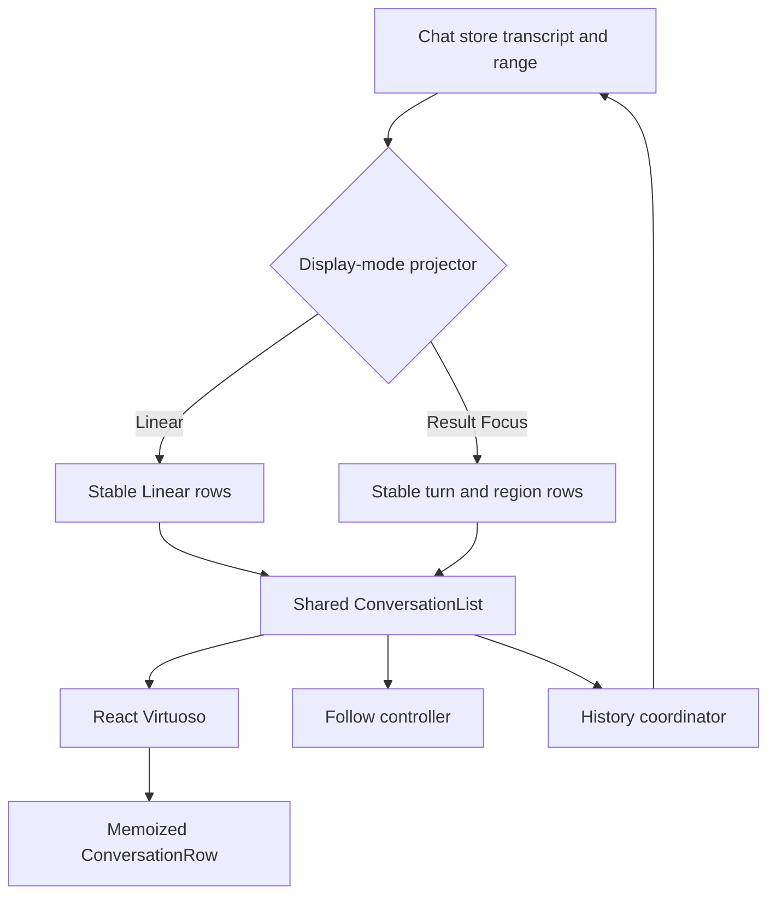
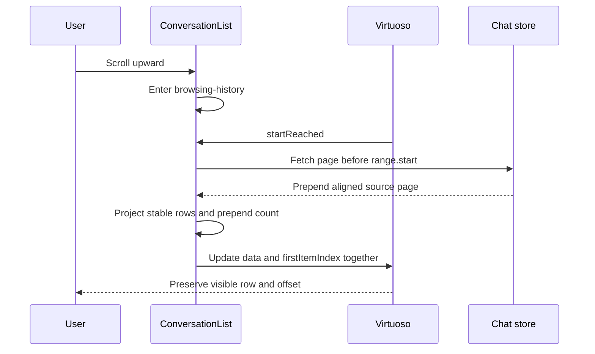

# Conversation List Rearchitecture - Plan

## Goal Capsule

- **Objective:** Replace the current client message-list chain with one reliable conversation list for Linear and Result Focus that remains stable during streaming, history navigation, session restoration, and display-mode changes.
- **Authority:** The Product Contract and its session-settled decisions define user-visible behavior; mature open-source list behavior is preferred over application-owned virtualization mechanics.
- **Open blockers:** None. Planning confirmed that the existing history response envelope is sufficient; page boundaries need server-side alignment without a wire-contract change.
- **Execution profile:** Characterize stable projection and follow behavior first, introduce the shared Virtuoso shell behind existing component boundaries, then remove legacy list mechanics after browser proof passes.
- **Tail ownership:** Implementation owns dependency updates, code and test migration, removal of superseded scroll logic, review fixes, and a repo-local commit; PR creation follows the later handoff choice.

---

## Product Contract

### Summary

The application will use one always-virtualized conversation list for Linear and Result Focus.
An MIT open-source virtual list will own dynamic measurement and viewport preservation, while the application will own stable message projections, history loading, search navigation, and explicit follow intent.

### Problem Frame

The current message panel combines message projection, virtual measurement, scroll anchoring, history loading, visibility recovery, search navigation, and streaming follow behavior in one component chain.
This has produced overlapping rows and repeated visual updates in long sessions, unnecessary list-wide refreshes during streaming, missing historical content after virtualization changes, and automatic scrolling that overrides a user reading older messages.

Local fixes have repeatedly added another effect, ref, measurement pass, or scroll correction without establishing one authority for viewport behavior.
The result is difficult to reason about and remains sensitive to render timing, dynamic row height, and browser scroll events.

### Key Decisions

- **Use the MIT React Virtuoso core as the virtualization foundation.** The application will not continue owning dynamic-height measurement and low-level scroll correction on top of a headless primitive. (session-settled: user-approved — chosen over rebuilding around TanStack Virtual or creating a custom message-list engine: mature open-source behavior removes the highest-risk custom mechanics.)
- **Rebuild the client message-list chain as one coherent unit.** Projection, virtualization, scrolling, session restoration, and client history loading may change together, while the server pagination protocol remains unchanged unless it blocks correctness. (session-settled: user-directed — chosen over replacing only `VirtualizedMessageList` or redesigning the full client-server protocol: the client boundary contains the current responsibility problem without expanding scope prematurely.)
- **Share one list shell across display modes.** Linear and Result Focus use the same scrolling, virtualization, history, restoration, and search infrastructure while keeping mode-specific row projections. (session-settled: user-approved — chosen over Result Focus-only replacement or fully unified projection semantics: common mechanics should have one owner while content meaning stays mode-specific.)
- **Always use the virtual list.** Empty, short, and long sessions use the same mounted list type with no message-count threshold or runtime implementation switch. (session-settled: user-approved — chosen over threshold-based migration: one lifecycle eliminates container replacement and duplicated behavior.)
- **Model follow behavior as explicit user intent.** Any upward user scroll or search jump exits follow mode, and only the user reaching the physical bottom restores it. Proximity thresholds and incoming content cannot restore follow mode. (session-settled: user-directed — chosen over distance-based automatic following: a user's decision to inspect history must not be overwritten by streaming.)
- **Restore sessions according to their prior follow state.** Returning to a session restores the exact reading position when follow was off and returns to the current bottom when follow was on. (session-settled: user-approved — chosen over always returning to the bottom or restoring pixels unconditionally: restoration preserves both live and historical reading intent.)
- **Reset to the bottom on display-mode changes.** Switching between Linear and Result Focus returns to the latest content and enables follow mode. (session-settled: user-directed — chosen over cross-projection anchor restoration or separate per-mode positions: a uniform reset is simpler and predictable.)
- **Gate initial content on correct positioning.** A long session does not expose message rows until its initial bottom position is ready; it reuses the existing loading presentation instead of showing content and then jumping. (session-settled: user-approved — chosen over immediate content or a new skeleton: first paint should be stable without adding new interface.)

The list behavior follows one explicit state model:

### Requirements

**Shared list and row identity**

- R1. Linear and Result Focus must render through one shared conversation-list infrastructure with mode-specific row projections.
- R2. Every session must use the same virtual list from empty state through long history, without a message-count threshold or a remount caused by empty/non-empty or short/long transitions. The explicit display-mode reset in R11 remains the only planned list-state reset.
- R3. Each logical row must have a stable source-derived identity across streaming updates, prepend, search changes, and unrelated store updates.
- R4. A streaming change must preserve the identity and render state of every unaffected row and every unchanged region within the affected Result Focus row.
- R5. Time-based updates for an active ProcessRegionGhost must remain local to that ghost and must not render completed ghosts or unrelated rows.

**Follow and navigation behavior**

- R6. The list must enter browsing-history state as soon as the user scrolls upward, regardless of distance from the bottom.
- R7. While browsing history, streaming growth and new messages must not change the visible reading position.
- R8. The list must resume following only after the user reaches the physical bottom or activates the existing scroll-to-bottom control.
- R9. A message-search jump must enter browsing-history state, and closing search must not restore follow automatically.
- R10. When follow is off, the existing downward-arrow control must remain the only new-content navigation affordance; no unread counter or additional prompt is added.
- R11. Switching between Linear and Result Focus must move to the latest content and enable follow mode.

**History and restoration**

- R12. Loading older messages must preserve the currently visible logical row and its relative viewport position without duplicates, gaps, or transient blank ranges.
- R13. History prepend and tail streaming must be able to complete concurrently without either operation discarding, reordering, or hiding the other's content.
- R14. Returning to a cached session must restore its prior logical reading position when follow was off and show the latest content when follow was on.
- R15. Initial opening of a long session must show the existing loading presentation until the latest content can appear at the correct position in one stable reveal.
- R16. Hidden or cached sessions must not perform visible scroll corrections that alter the restored position when they become active.

**Quality and observability**

- R17. Dynamic height changes must not produce overlapping rows, visible flashing, blank intervals, or viewport oscillation.
- R18. Automated tests must distinguish row rendering, region rendering, viewport movement, and long-task performance instead of relying only on final DOM content.
- R19. Test-only instrumentation must not add production logging, render counters, or permanent profiling overhead.
- R20. The new list must preserve existing message search, process drawer, compacting indicator, older-history loading indicator, empty state, and scroll-to-bottom control behavior except where this contract changes positioning.

### Key Flows

- F1. Open a long session
  - **Trigger:** The user opens a session with a large historical transcript.
  - **Steps:** The existing loading state remains visible while the virtual list establishes the latest position and measures the visible rows.
  - **Outcome:** The latest content appears once without first exposing the top, overlapping messages, or flashing.
  - **Covered by:** R2, R3, R15-R17.
- F2. Inspect history during streaming
  - **Trigger:** The user scrolls upward while the active turn continues to stream.
  - **Steps:** Follow mode turns off immediately; streaming continues below; the visible logical row and relative position remain stable.
  - **Outcome:** The user can read older content without being pulled toward the bottom.
  - **Covered by:** R4-R8, R17.
- F3. Resume live following
  - **Trigger:** The user manually reaches the physical bottom or activates the downward-arrow control.
  - **Steps:** Follow mode turns on; subsequent streaming growth remains pinned to the latest content.
  - **Outcome:** Live output remains visible until the user navigates away again.
  - **Covered by:** R8, R10.
- F4. Load older history while streaming
  - **Trigger:** The user reaches the history-loading boundary while tail content continues to change.
  - **Steps:** Older rows prepend around a stable logical anchor while tail updates remain independent.
  - **Outcome:** Both the requested history and new output remain present in order with no viewport jump.
  - **Covered by:** R3, R12, R13, R17.
- F5. Leave and return to a session
  - **Trigger:** The user switches sessions and later returns.
  - **Steps:** The list restores either the saved reading anchor or the latest position according to the session's prior follow state.
  - **Outcome:** The session resumes in the place implied by the user's prior intent.
  - **Covered by:** R14-R16.
- F6. Search or change display mode
  - **Trigger:** The user jumps to a search result or switches between Linear and Result Focus.
  - **Steps:** Search enters browsing-history state; a display-mode change instead resets to the latest content and enables follow.
  - **Outcome:** Both commands have deterministic positioning behavior.
  - **Covered by:** R9, R11.

### Acceptance Examples

- AE1. **Covers R4-R8.** Given a session following active streaming, when the user scrolls upward by 20 pixels and more content arrives, then the viewport does not move toward the bottom and unaffected render counts do not increase.
- AE2. **Covers R8.** Given follow is off, when the user scrolls near but not to the physical bottom, then follow remains off; when the user reaches the physical bottom, subsequent streaming remains pinned.
- AE3. **Covers R9.** Given the list is following, when search jumps to an older match and search is later closed, then the selected history position remains until the user reaches the bottom.
- AE4. **Covers R11.** Given either display mode at any reading position, when the user switches mode, then the target mode opens at the latest content with follow enabled.
- AE5. **Covers R12, R13.** Given an in-flight older-history request and sustained tail streaming, when the history page resolves, then head and tail content both remain ordered and the visible anchor does not shift.
- AE6. **Covers R14-R16.** Given one cached session left in follow mode and another left on an older message, when each session is reopened, then the first shows its latest content and the second restores its prior logical anchor without a visible correction.
- AE7. **Covers R3-R5, R17.** Given 2,000 historical messages and an active turn containing about 100 tool steps, when one new tool event or timer tick occurs, then only the affected row and visible region render or resize.
- AE8. **Covers R15, R17.** Given a cold long-session open, when initial positioning completes, then content appears at the bottom in one reveal with no prior top render, overlap, blank interval, or flash.

### Success Criteria

- The deterministic heavy-session fixture contains 2,000 historical messages and approximately 100 tool steps in the active turn.
- Stable historical rows and unchanged Result Focus regions record zero additional renders during a single-region streaming update.
- Browser verification detects no overlap, flashing, transient blank range, or non-user-triggered viewport movement across F1-F6.
- Sustained streaming and history navigation produce no main-thread Long Task longer than 50 milliseconds in the release test environment.
- Frame-rate sampling is recorded as a non-blocking trend metric, with regressions investigated even though machine variance prevents a fixed CI threshold.
- Existing client behavior covered by R20 remains green in both Linear and Result Focus.

### Scope Boundaries

- The commercial `@virtuoso.dev/message-list` package is not adopted.
- The application will not build a general-purpose virtual-list library or retain parallel TanStack Virtual and React Virtuoso message-list implementations.
- The server history protocol is not redesigned unless planning confirms it cannot satisfy R12 or R13.
- New unread counters, new-content banners, and replacement loading skeletons are excluded.
- Cross-mode semantic anchor restoration and separate saved positions per display mode are excluded.
- The previous Result Focus incremental-rendering plan remains historical context and does not constrain this rearchitecture.

### Dependencies and Assumptions

- React Virtuoso's MIT core continues to support variable-height rows, stable item keys, prepend position preservation, bottom-state observation, and serializable list-state restoration.
- The current client history response provides enough ordering information to merge older pages without ambiguity; planning must verify this before relying on it.
- Source messages expose durable identities from which both display modes can derive stable row keys.
- Real-browser tests can observe viewport geometry, Long Tasks, and component render instrumentation under deterministic streaming fixtures.

### Outstanding Questions

**Resolved During Planning**

- The existing history response envelope can support concurrent prepend and streaming without a wire-schema change. The server will align normalized page starts to a complete visible-turn boundary, and the client will keep the returned `start` authoritative while merging against the latest store state by message ID.
- Mounted cached sessions do not need serialized Virtuoso snapshots: the existing five-session DOM cache preserves the live list instance. A following session aligns to latest when revealed; a browsing session leaves its viewport untouched. Evicted sessions reopen from the latest bounded window and do not promise historical-position restoration.
- `MessageList` remains the store/projection boundary, `ConversationList` owns Virtuoso and viewport lifecycle, and `ConversationRow` owns memoized rendering. Mode-specific projectors emit stable rows and never receive a scroll-container API.
- Long Tasks use a blocking 50-millisecond ceiling in the deterministic Chromium fixture. Frame cadence is recorded as trend evidence only, because a fixed FPS threshold would be unstable across local and CI hardware.

**Deferred to Implementation**

- Confirm the exact React Virtuoso 4.x patch version selected by the package manager and record any API-name differences from the researched 4.18.x surface without changing the behavioral contract.

### Sources and Research

- `src/client/components/VirtualizedMessageList.tsx` currently owns virtualization, measurement, prepend anchoring, search positioning, visibility recovery, and follow behavior.
- `src/client/components/MessageList.tsx` currently maintains a separate non-virtual path and selects list behavior by display mode and message count.
- `src/client/lib/result-focus-view.ts` contains the existing Result Focus projection and structural-sharing behavior, which may be replaced rather than preserved by default.
- `src/client/stores/chat-store.ts` owns client transcript windows and older-history loading.
- `docs/plans/2026-07-21-002-refactor-result-focus-incremental-rendering-plan.md` records the superseded design and remains useful as defect history only.
- [React Virtuoso](https://github.com/petyosi/react-virtuoso) documents variable-height measurement, bidirectional loading, stable item keys, prepend through `firstItemIndex`, bottom-state observation, and state snapshots under the MIT license.
- [Stream Chat React](https://github.com/GetStream/stream-chat-react) uses React Virtuoso for its production virtualized message list and keeps follow policy, history loading, and new-message behavior in the application layer.
- `@virtuoso.dev/message-list` was reviewed for its chat-specific behavior model but excluded because it is commercially licensed.

**Product Contract preservation:** Product Contract unchanged.

---

## Planning Contract

### Key Technical Decisions

- **KTD1. Use React Virtuoso 4.x as the sole message-list virtualizer.** Add the MIT `react-virtuoso` package and remove `@tanstack/react-virtual` from the message-list path. Remove `use-stick-to-bottom` once the non-virtual list path is deleted. React Virtuoso 4.18.x supports the repository's React 18 runtime and provides variable-height measurement, stable item keys, prepend indexing, bottom-state callbacks, state snapshots, and imperative bottom alignment. (session-settled: user-approved — chosen over rebuilding around TanStack Virtual or creating a custom message-list engine: mature open-source behavior removes the highest-risk custom mechanics.)
- **KTD2. Keep a thin public `MessageList` boundary over a shared `ConversationList`.** `MessageList` selects store data and the mode-specific projection; `ConversationList` owns Virtuoso, viewport state, history triggers, initial readiness, and navigation commands; a memoized row component owns message rendering. Neither display mode may implement its own scroll container. (session-settled: user-approved — chosen over separate Linear and Result Focus shells: common mechanics should have one owner while content meaning stays mode-specific.)
- **KTD3. Make projection output the identity authority.** A session-scoped conversation projector returns stable rows, source-message lookup, a tail revision, and the number of rows prepended before the prior first row. The list shell, not the projector, owns Virtuoso's large baseline `firstItemIndex` and decrements it by that prepend count. Linear projection preserves source-message identity; Result Focus preserves turn and region identity through overlap reconciliation, including growth at either end of a merged assistant turn.
- **KTD4. Align history pages to logical turn boundaries without changing the response schema.** `loadMessages` continues returning `messages`, `total`, `start`, and `end`, but adjusts the requested start backward so a page never splits a visible Result Focus assistant turn. The client continues requesting the page before `messageRanges.start`, merging by message ID, and retaining live tail updates. This prevents prepend from mutating the prior first virtual row and lets `firstItemIndex` preserve the viewport without DOM measurement corrections.
- **KTD5. Represent follow as an explicit two-state controller.** `following` and `browsing-history` are driven by user input and a physical-bottom callback with a near-zero tolerance. The controller keeps an imperative ref for streaming decisions and React state for the arrow/fade UI. Wheel, touch, keyboard, search, and scrollbar-driven upward movement exit follow before an incoming render can scroll. (session-settled: user-directed — chosen over distance-based automatic following: a user's decision to inspect history must not be overwritten by streaming.)
- **KTD6. Let Virtuoso perform physical scroll work.** Appends use `followOutput` gated by the explicit follow controller. In-place growth of the final row calls `autoscrollToBottom` only when following. Prepend changes `data` and decreases `firstItemIndex` by the projected prefix count in the same render. Search uses row-key lookup followed by Virtuoso navigation, and no code reads `scrollHeight`, calls a virtualizer-wide `measure`, or manually corrects `scrollTop`.
- **KTD7. Preserve cached-session state in the mounted list instance.** ChatPanel's DOM cache already keeps up to five session lists mounted. A hidden list retains its follow controller and viewport; on visibility recovery it scrolls to latest only when following. Evicted sessions reopen at the latest bounded window and do not promise historical-position restoration. (session-settled: user-approved — chosen over always returning to the bottom or restoring pixels unconditionally: restoration preserves both live and historical reading intent.)
- **KTD8. Reset the list instance on display-mode change.** The shared shell remains the same component type, but its projection epoch resets and opens at the last row with follow enabled. No cross-mode snapshot or semantic anchor is carried. (session-settled: user-directed — chosen over cross-projection anchor restoration or separate per-mode positions: a uniform reset is simpler and predictable.)
- **KTD9. Hide rows until initial latest-range readiness.** A non-empty cold list uses Virtuoso's supported last-item initial locator and keeps the existing loading presentation above the row surface until Virtuoso reports a rendered range containing that row. Empty sessions render their existing empty state immediately. (session-settled: user-approved — chosen over immediate content or a new skeleton: first paint should be stable without adding new interface.)
- **KTD10. Separate correctness tests from performance evidence.** Pure projection and controller tests prove identity and transitions; Chromium component tests use real Virtuoso layout for viewport behavior; a deterministic heavy browser fixture records Long Tasks and frame cadence while render counters remain test-only. (session-settled: user-approved — chosen over render-only, visual-only, or interaction-only gates: each signal catches a different regression class.)

### High-Level Technical Design

`ConversationList` receives already-projected rows and never interprets message parts.
It exposes row rendering through stable callbacks and keys, maps `startReached` to the existing older-history action, and maps search matches to projected row keys.
The projection layer is the only place that knows whether source messages form one Result Focus turn or separate Linear rows.

### Projection Contract

Each projected row carries:

- A stable row key used by React, Virtuoso, search lookup, and prepend overlap detection.
- The source message IDs represented by the row.
- A stable render payload whose reference changes only when visible row content changes.
- Result Focus regions with stable keys and references for unchanged text and ProcessRegionGhost children.

Each projection result also carries:

- `prependedRowCount`, containing only actual projected rows inserted before the previous first row. The list shell subtracts this value from a large baseline `firstItemIndex`; the index never becomes negative during the retained session window.
- `tailRevision`, changed only when the last row's visible content changes or a new last row is appended.
- A source-message-to-row-key index for search navigation and drawer lookup.

The projector is disposable, scoped to one mounted session and one display-mode epoch, and retains no module-level session cache.

### History Boundary Contract

The response shape remains `{ messages, total, start, end }`.
The server normalizes the full transcript as it does today, computes the requested page, and moves `start` backward across tool-result-only records and consecutive assistant records until it reaches a safe visible-turn boundary.
Because the returned `start` is authoritative, the next older request remains deterministic even when the aligned page is larger than the nominal limit.
Initial recent-window loading uses the same alignment rule so every subsequent prepend adds whole projected rows.

### Lifecycle Contract

- **Cold open:** Build the mode projector, initialize Virtuoso at the last row, reveal rows only after the last range is rendered, and enter following.
- **Streaming while following:** Reuse stable rows and regions; gate append following through `followOutput`; call `autoscrollToBottom` for final-row height growth.
- **Streaming while browsing:** Update the tail data without issuing a bottom command or changing the visible anchor.
- **History prepend:** Fetch once per in-flight range, project the aligned page, update `data` and `firstItemIndex` in one render, and retain browsing state.
- **Hide and restore:** Keep the mounted instance untouched; on reveal, follow mode aligns to latest and browsing mode preserves its viewport.
- **Mode change:** Dispose the prior projector epoch, create the target projection, remount the Virtuoso state boundary at the last row, and enter following.
- **Search jump:** Enter browsing state before navigating to the matching row; once mounted, center the active match within that row without restoring follow on search close.

### Implementation Constraints

- Do not declare Virtuoso component overrides inline; stable component types and forwarded refs are required to prevent subtree remounts.
- Use padding or Virtuoso's item gap for row spacing; margins on measured item wrappers are prohibited because ResizeObserver measurements exclude them.
- `computeItemKey` must use the projected row key and never an array index.
- The controlled row array and shell-owned `firstItemIndex` must update atomically from the same projection result and its `prependedRowCount`.
- Bottom-follow decisions must read the imperative controller ref, not wait for React state to commit.
- A library at-bottom threshold may absorb subpixel rounding only; it may not define user intent.
- Search DOM lookup must be scoped to the target row after Virtuoso reports it rendered.
- Store selectors must remain narrow so unrelated session state does not rebuild the row projection.
- Existing loaded pages remain resident while a session is in the DOM cache; existing eviction behavior may prune them to the recent window.
- The current uncommitted scroll regression test is retained as behavior coverage but rewritten against the shared ConversationList; its interim production fix is superseded rather than layered into the new controller.

### System-Wide Impact

- **Dependencies:** Add `react-virtuoso`; remove `@tanstack/react-virtual` and remove `use-stick-to-bottom` if no consumers remain after migration.
- **Client rendering:** Replace the threshold split and custom absolute-positioned virtual rows with one shared list and memoized row boundary.
- **Projection:** Generalize the current Result Focus structural sharing into a mode-aware row contract while preserving source IDs used by search and drawers.
- **Client state:** Keep transcript and pagination state in Zustand; keep follow and viewport state local to each cached list instance.
- **Server history:** Preserve WebSocket payload fields while aligning page starts to visible-turn boundaries.
- **Tests:** Replace virtualizer-mocked threshold tests with projection/controller unit tests and real Chromium geometry tests.

### Alternatives Considered

- **Keep TanStack Virtual and extract a controller:** Rejected because dynamic-size correction, prepend anchoring, and streaming follow would remain application-owned.
- **Adopt `@virtuoso.dev/message-list`:** Rejected because the chat-specific package is commercially licensed.
- **Build a custom controlled message-list engine:** Rejected because it recreates a cross-browser subsystem with high carrying cost.
- **Preserve separate Linear and Result Focus list paths:** Rejected because it retains duplicated lifecycle and scroll behavior.
- **Keep arbitrary page boundaries and repair the viewport after prepend:** Rejected because it requires the DOM measurement and scroll correction this rearchitecture is intended to remove.

### Risks and Mitigations

| Risk | Mitigation |
|---|---|
| Result Focus page alignment drifts from client grouping semantics | Keep the boundary predicate server-owned over normalized roles and tool-result-only messages; use identical transcript fixtures in server pagination and client projection tests so semantic drift fails in both suites without introducing a client/server shared-module dependency. |
| Virtuoso restores stale measurements after font or width changes | Use snapshots only for same-layout remount recovery; mounted cached sessions rely on live ResizeObserver measurement, and global presentation changes invalidate snapshots. |
| Streaming height growth does not trigger core `followOutput` | Drive same-row growth through `tailRevision` and `autoscrollToBottom` while following. |
| Programmatic scrolling is mistaken for upward user intent | Mark search and mode-reset commands before navigation and test wheel, touch, keyboard, and scrollbar paths separately. |
| Scrollbar dragging has no wheel or keyboard precursor | Treat a user-originated decrease in the visible range or scroll offset as upward navigation unless a bounded programmatic-scroll token owns that movement; expire the token when the commanded range is reached or the command is interrupted. |
| A memo comparator hides a visible Result Focus change | Keep visible dependencies in projected region objects and retain state-transition tests for text, tool input, results, errors, duration, search, and drawer activation. |
| Initial readiness never resolves for an empty or filtered transcript | Empty state bypasses readiness; zero-height projected rows are filtered before Virtuoso receives data. |
| Initial positioning or history loading fails and leaves the list indefinitely hidden or locked | Preserve the existing load-error path, release only the readiness state owned by the failed operation, and verify retry does not reset a browsing viewport or duplicate an in-flight range. |
| Heavy performance tests are noisy in CI | Fail only on Long Tasks over 50 milliseconds in the named Chromium environment; record FPS as trend data without a fixed pass threshold. |

### Sequencing

1. Establish stable projected-row and history-boundary contracts with pure tests.
2. Establish the explicit follow controller with input-transition tests.
3. Introduce the shared Virtuoso shell and memoized row renderer without removing legacy tests.
4. Integrate history, search, visibility, and mode-reset lifecycle behavior in real Chromium.
5. Run the heavy fixture, remove legacy list code and dependencies, then complete compatibility verification.

---

## Implementation Units

### U1. Define stable conversation rows and aligned history pages

- **Goal:** Produce complete Linear and Result Focus row projections whose identities survive streaming and prepend, and guarantee that history pages add whole projected rows.
- **Requirements:** R1, R3-R5, R12, R13, R18, R19.
- **Flows:** F2, F4.
- **Acceptance Examples:** AE5, AE7.
- **Decisions:** KTD3, KTD4.
- **Files:**
  - Create `src/client/lib/conversation-view.ts`.
  - Create `src/client/lib/conversation-view.test.ts`.
  - Modify `src/client/lib/result-focus-view.ts` and `src/client/lib/result-focus-view.test.ts`.
  - Modify `src/client/components/message-grouping.ts` and `src/client/components/message-grouping.test.ts`.
  - Modify `src/server/services/chat-service.ts` and `src/server/services/chat-service.test.ts`.
  - Modify `src/client/stores/chat-store.test.ts` if range-merging contract coverage is absent.
- **Approach:** Introduce a session-scoped projector interface that emits stable rows, source lookup, `prependedRowCount`, and `tailRevision`. Reconcile Result Focus turns by overlapping source IDs so a turn key survives tail growth. Align normalized history page starts before slicing so prepend cannot extend the prior first projected row.
- **Patterns to follow:** Preserve the immutable-message assumptions and referential identity assertions already used by `src/client/lib/result-focus-view.ts`; retain the normalized range envelope in `src/server/services/chat-service.ts` and duplicate-safe merge in `src/client/stores/chat-store.ts`.
- **Test scenarios:**
  - A Linear streaming delta replaces only its source row payload.
  - A Result Focus text delta replaces only the containing row and text region.
  - Appending an assistant source message preserves the active turn key and all prior region references.
  - A page request whose nominal start lands inside assistant/tool-result history moves to the preceding visible-turn boundary and returns authoritative `start/end` values.
  - Server and client boundary fixtures use the same assistant, user, tool-use, and tool-result sequences so a grouping-rule drift fails before it can mutate the prior first projected row.
  - Prepending the aligned page retains every prior row key and reports the exact projected prefix count.
  - Concurrent page resolution and tail append retain both ranges with no duplicate message IDs.
- **Verification:** Pure tests demonstrate structural sharing, deterministic keys, full-turn pages, and correct projected prepend counts before any list component changes.

### U2. Implement the explicit follow controller

- **Goal:** Encode user-controlled following independently from bottom proximity and React render timing.
- **Requirements:** R6-R11, R14, R18, R19.
- **Flows:** F2, F3, F5, F6.
- **Acceptance Examples:** AE1-AE4, AE6.
- **Decisions:** KTD5, KTD7, KTD8.
- **Files:**
  - Create `src/client/hooks/use-conversation-follow.ts`.
  - Create `src/client/hooks/use-conversation-follow.test.ts`.
- **Approach:** Implement a small state machine with an imperative current-state ref and UI state. Accept explicit upward input, search jump, physical-bottom arrival, scroll-to-bottom command, visibility recovery, and mode reset events. Keep programmatic-command markers bounded to the navigation they initiate.
- **Patterns to follow:** Use instance-scoped state consistent with the existing DOM cache; keep native event listener cleanup and same-render imperative decisions testable without component layout.
- **Test scenarios:**
  - A 20-pixel upward wheel event exits follow before a streaming update can request bottom alignment.
  - Touch, keyboard, and scrollbar-driven upward navigation exit follow.
  - A programmatic search or mode-reset scroll does not masquerade as user upward navigation, and an interrupted command cannot leave suppression active for the next gesture.
  - Near-bottom geometry without physical-bottom arrival does not restore follow.
  - Physical-bottom arrival and the downward-arrow command restore follow.
  - Search jump exits follow and search close does nothing.
  - Visibility recovery preserves browsing state but allows a following session to request latest alignment.
  - Display-mode reset enters follow regardless of the prior state.
- **Verification:** State-machine tests cover every transition in the Product Contract diagram without depending on browser geometry.

### U3. Replace both list paths with the shared Virtuoso shell

- **Goal:** Render empty, short, and long Linear and Result Focus sessions through one variable-height virtual list and one memoized row boundary.
- **Requirements:** R1-R5, R10, R15-R17, R20.
- **Flows:** F1-F3.
- **Acceptance Examples:** AE1, AE7, AE8.
- **Decisions:** KTD1-KTD3, KTD6, KTD9.
- **Files:**
  - Create `src/client/components/ConversationList.tsx`.
  - Create `src/client/components/ConversationRow.tsx`.
  - Modify `src/client/components/MessageList.tsx`.
  - Modify `src/client/components/ChatMessageRenderer.tsx` only where stable projected-region props require it.
  - Modify `src/client/components/ProcessRegionGhost.tsx` only where memoized visible dependencies require it.
  - Modify `src/client/components/MessageList.test.tsx` and `src/client/components/MessageList.result.test.tsx`.
  - Modify `package.json` and `package-lock.json`.
- **Approach:** Add React Virtuoso with stable module-level component overrides, projected row keys, and padding-based spacing. Route append and final-row growth through the follow controller and Virtuoso APIs. Keep the current empty, loading, compacting, fade, and downward-arrow presentation around the shared shell. Gate a cold non-empty reveal on a rendered range containing the last row.
- **Patterns to follow:** Reuse existing `renderViewItem` behavior through `ConversationRow` rather than duplicating message-type branches; preserve the current Result Focus region memo boundaries and drawer/search props.
- **Test scenarios:**
  - Empty, one-message, 49-message, 50-message, and 2,000-message sessions render the same shell type.
  - Updating one Result Focus region leaves completed rows and sibling regions at their prior render counts.
  - Updating one Linear message leaves unrelated rows at their prior render counts.
  - Same-row streaming growth follows only in following state.
  - Cold long-session content remains hidden until the last row is rendered, then appears without a top-position frame.
  - Compacting and older-history indicators do not become measured zero-height message rows.
- **Verification:** Component tests prove shell continuity and render isolation; Chromium tests prove real variable-height layout and initial positioning.

### U4. Integrate prepend, search, cached visibility, and mode resets

- **Goal:** Complete the multi-event viewport lifecycle on the shared shell without manual DOM anchoring or virtualizer measurement calls.
- **Requirements:** R7-R16, R20.
- **Flows:** F2-F6.
- **Acceptance Examples:** AE1-AE6.
- **Decisions:** KTD4-KTD9.
- **Files:**
  - Modify `src/client/components/ConversationList.tsx`.
  - Modify `src/client/components/MessageList.tsx`.
  - Modify `src/client/components/ChatPanel.tsx` only if the current visibility signal cannot identify a mounted cached session transition.
  - Replace `src/client/components/VirtualizedMessageList.browser.test.tsx` with `src/client/components/ConversationList.browser.test.tsx`.
  - Modify `src/client/components/MessageList.test.tsx` for mode and search integration.
  - Modify `src/client/stores/chat-store.test.ts` for concurrent prepend and live-tail merge coverage.
- **Approach:** Connect `startReached` to one guarded older-history request, subtract projected `prependedRowCount` from the shell-owned `firstItemIndex` with the same row update, and use row-key search lookup plus Virtuoso navigation. Keep each cached session instance mounted; visibility recovery branches only on its follow state. Key the projection epoch by display mode so mode changes intentionally reset to latest.
- **Patterns to follow:** Preserve `ChatPanel`'s existing five-session DOM cache and `isVisible` contract; preserve the store's range-based `fetchOlderMessages` and duplicate-safe latest-state merge.
- **Test scenarios:**
  - Repeated top-boundary callbacks produce one in-flight history request.
  - A failed older-history request can retry once the in-flight guard clears without changing follow state, viewport anchor, or loaded rows.
  - A prepend preserves the first visible row and its viewport offset within browser rounding tolerance.
  - Prepend resolution during streaming retains aligned head rows and the latest tail update.
  - Search jumps to a virtualized offscreen row, centers the active match, and leaves follow off after search closes.
  - A hidden following session returns at latest after background streaming.
  - A hidden browsing session returns at the prior visible row without a correction.
  - A mode switch from either state resets to the target mode's last row and follow state.
- **Verification:** Real Chromium geometry assertions cover each lifecycle transition and confirm there are no application writes to `scrollTop`.

### U5. Add the heavy quality gate and remove superseded mechanics

- **Goal:** Prove the release baseline and leave one production list implementation with no diagnostic or dependency residue.
- **Requirements:** R2-R5, R17-R20.
- **Flows:** F1-F6.
- **Acceptance Examples:** AE1-AE8.
- **Decisions:** KTD1, KTD10.
- **Files:**
  - Extend `src/client/components/ConversationList.browser.test.tsx` with deterministic heavy fixtures and performance observers.
  - Delete `src/client/components/VirtualizedMessageList.tsx`.
  - Delete or migrate superseded tests that mock the legacy virtual shell.
  - Modify `src/client/components/ai-elements/conversation.tsx` if `use-stick-to-bottom` exports become unused.
  - Modify `package.json` and `package-lock.json` to remove unused virtualization and stick-to-bottom packages.
- **Approach:** Generate 2,000 historical messages and approximately 100 active-turn tool steps in the browser test. Count row and region renders through test-only callbacks, observe Long Tasks around sustained streaming and navigation, sample animation frames for trend output, and assert viewport geometry. Remove every legacy measurement, anchor, threshold, and auto-scroll path after the new gates pass.
- **Patterns to follow:** Keep instrumentation inside tests or development-only injection points and preserve production bundles from render counters or per-frame logging.
- **Test scenarios:**
  - Sustained single-region streaming produces zero stable-row and stable-region renders.
  - The fixture shows no overlapping row rectangles, blank visible range, or unsolicited viewport movement.
  - The measured interaction window contains no Long Task over 50 milliseconds.
  - Frame cadence is recorded without becoming a machine-sensitive pass threshold.
  - Linear and Result Focus search, drawers, compacting, empty state, and scroll-to-bottom behavior remain functional.
  - Dependency and source searches find no production use of TanStack Virtual, `use-stick-to-bottom`, manual virtual measurement, or legacy threshold switching.
- **Verification:** The targeted browser suite, client suite, typecheck, lint, and production build all pass after legacy removal.

---

## Verification Contract

| Gate | Command | Covers | Pass signal |
|---|---|---|---|
| Projection and follow unit tests | `npx vitest run --project jsdom src/client/lib/conversation-view.test.ts src/client/lib/result-focus-view.test.ts src/client/hooks/use-conversation-follow.test.ts` | U1, U2 | Stable identity, aligned page, prepend count, and follow transitions pass. |
| Message rendering compatibility | `npx vitest run --project jsdom src/client/components/MessageList.test.tsx src/client/components/MessageList.result.test.tsx src/client/components/ChatMessageRenderer.test.tsx` | U1-U4 | Linear, Result Focus, search, drawer inputs, and memo boundaries pass. |
| Store and service pagination | `npx vitest run --project jsdom src/client/stores/chat-store.test.ts` and the repository's targeted server-test command for `src/server/services/chat-service.test.ts` | U1, U4 | Aligned normalized ranges and concurrent head/tail merge pass without wire-shape changes. |
| Real browser lifecycle | `npx vitest --config vitest.browser.config.ts run src/client/components/ConversationList.browser.test.tsx` | U3-U5 | Initial bottom reveal, follow transitions, prepend, search, cache restore, mode reset, and heavy geometry pass in Chromium. |
| Static correctness | `npx tsc -b --pretty false` and `npx eslint src/client src/server/services/chat-service.ts --ext ts,tsx --report-unused-disable-directives --max-warnings 0` | U1-U5 | No type or lint errors and no unused legacy imports. |
| Production packaging | `npm run build` | U3-U5 | Client, server, and CLI production builds complete with the new dependency graph. |
| Manual visual check | Run the app with a long active Result Focus session and exercise F1-F6 | U3-U5 | No flashing, overlap, blank range, or scroll capture is visible with mouse, trackpad, keyboard, and mode switching. |

### Evidence Requirements

- Browser failures must report the active follow state, visible row keys, physical bottom state, scroll offset before and after the action, and the action that requested programmatic scrolling.
- Heavy-fixture output must report stable row renders, stable region renders, maximum Long Task duration, and observed frame cadence.
- No performance diagnostic is enabled in production by default.

---

## Definition of Done

- All R1-R20 requirements and AE1-AE8 examples are covered by passing automated or named manual verification.
- Linear and Result Focus render through one always-mounted ConversationList implementation backed by React Virtuoso.
- Upward navigation and search cannot be overridden by streaming; manual arrival at the bottom restores following.
- Cached-session restoration and display-mode reset match their distinct Product Contract behaviors.
- History prepend preserves the visible row under concurrent streaming without DOM anchor queries or manual scroll correction.
- The heavy fixture records zero stable-content renders, no visual geometry defects, and no Long Task over 50 milliseconds.
- `VirtualizedMessageList.tsx`, threshold switching, TanStack Virtual message-list usage, and obsolete stick-to-bottom code are removed.
- Typecheck, lint, targeted client/server tests, real-browser tests, production build, and manual visual verification pass.
- Product Contract remains unchanged during planning; any later behavior change returns to requirements review before implementation.
