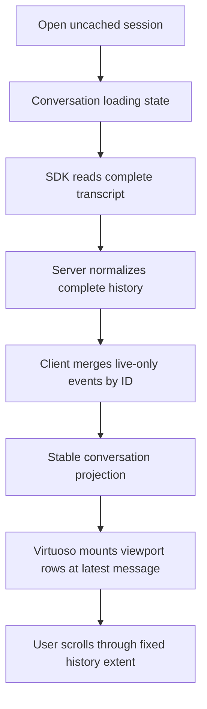
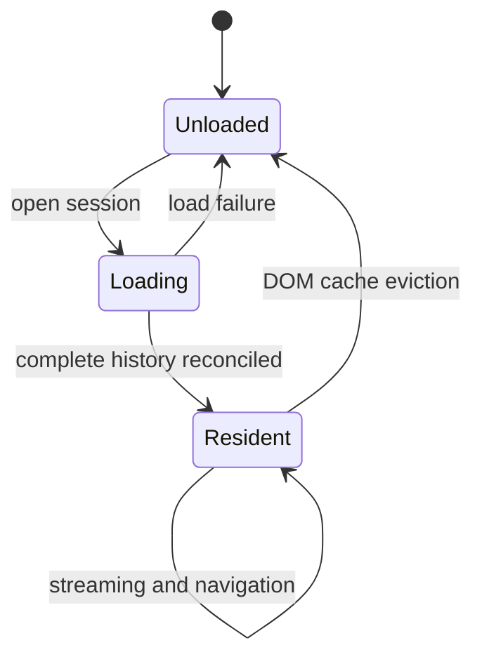

# Full-History Conversation Loading - Plan

## Goal Capsule

- **Objective:** Replace client-visible chat history pagination with one complete history load so the message viewport and scrollbar remain stable from first display onward.
- **Authority:** The Product Contract in this plan supersedes the windowed-history requirements and pagination decisions in the origin plan; its incremental rendering and follow-mode requirements remain authoritative.
- **Execution profile:** Simplify the history contract from the server outward, remove window state and pagination UI, then prove complete-history behavior in real Chromium with heavy sessions and live streaming.
- **Stop conditions:** Stop and return to planning if the SDK cannot return a complete normalized transcript for an existing supported session, or if preserving live events during the initial load requires discarding either history or the active turn.

---

## Product Contract

### Summary

Opening an existing conversation will load its complete history before displaying the message list. React Virtuoso will continue to virtualize DOM rows, so complete data availability does not mean mounting every message at once.

### Problem Frame

The current pagination path appends older history above the visible viewport. Even when individual message keys remain stable, every prepend changes the total scroll extent, makes the native scrollbar thumb change size, and can trigger virtual measurement corrections that move the content the user was reading. The result is a visibly unstable history-navigation experience.

Claude Agent SDK `0.3.217` exposes `limit` and `offset`, but the SDK still reads and reconstructs the session transcript before applying those options, and it returns no total count or stable cursor. The application already reads and normalizes the complete transcript on the server before applying its own page slice. The current pagination therefore saves response and client memory, but not the dominant SDK transcript-read work, while adding range, prepend, merge, and scroll-anchor complexity.

### Requirements

**History loading and visibility**

- R1. Opening a non-draft session must request and receive its complete normalized conversation history in one load operation for both Linear and Result Focus modes.
- R2. The message list must remain behind a localized, accessible conversation-level loading status until the complete initial history is ready; it must not display a recent tail and later replace it with full history.
- R3. Once the list becomes visible, older messages must already be present in the virtual data set, so upward scrolling cannot trigger a history request, prepend, or scroll-extent expansion.
- R4. A failed complete-history request must leave the loading state and expose the existing recoverable error behavior rather than showing an empty conversation indefinitely.

**Rendering and navigation**

- R5. React Virtuoso must remain the single DOM virtualization shell for empty, short, and long conversations in both display modes.
- R6. Initial display must settle at the latest message without overlap, flashing, or a second visible position correction.
- R7. During streaming, a user who scrolls upward must remain at the chosen reading position; bottom following resumes only after the user manually returns to the bottom or invokes the scroll-to-bottom command.
- R8. Streaming may update the active tail row without remounting or remeasuring stable historical rows.
- R9. Message search, process-region drawers, workflow state, compacting indicators, and hidden-session visibility recovery must continue to work across the complete transcript.

**State and lifecycle**

- R10. While a session remains in the DOM cache, its loaded history must not be pruned by sends, assistant starts, tool results, reconnect replay, or bot refreshes.
- R11. A history response racing with live events must merge by stable message identity and retain live-only messages exactly once in chronological order.
- R12. Evicting a session from the DOM cache must release its cached transcript completely so reopening it performs a new complete load instead of treating a truncated tail as complete history.
- R13. Pagination range state, older-history loading state, prepend bookkeeping, and the user-configurable message window size must be removed from the active product surface.

**Diagnostics and performance**

- R14. Development diagnostics must record complete-history load duration, normalized message count, and relevant server/client stages without logging message content.
- R15. A deterministic 2,000-message transcript with approximately 100 tool steps must remain fully reachable while the browser mounts only a bounded viewport-sized subset of rows.
- R16. The plan introduces no product-level transcript size cap; measured performance failures become evidence for a separate indexed-history design rather than silently re-enabling the current pagination path.
- R17. History readiness must be tracked independently from message-array length so a live event arriving before the initial response cannot suppress the complete-history request.

### Key Flows

- F1. Open a long historical session
  - **Trigger:** The user selects a non-draft session that is not cached.
  - **Steps:** The panel enters its loading state; the server reads and normalizes the complete SDK transcript; the client merges any live events received during the request; Virtuoso mounts the complete logical data set at the latest message.
  - **Outcome:** The first visible message list has its final history extent and can be scrolled continuously to the beginning.

- F2. Read history while streaming continues
  - **Trigger:** The user scrolls upward while the active turn receives text or tool updates.
  - **Steps:** Follow mode disengages; only the active tail row changes; the historical viewport remains fixed; no history request runs at the top of the list.
  - **Outcome:** The user keeps their reading position and can return to the live tail deliberately.

- F3. Reopen an evicted session
  - **Trigger:** The DOM cache evicts a session and the user later selects it again.
  - **Steps:** Eviction releases the complete transcript and closes the background subscription; reopening enters the loading state and performs a fresh complete load.
  - **Outcome:** The reopened session is complete rather than a stale or truncated tail.

### Acceptance Examples

- AE1. Given a 2,000-message session that is not cached, when the user opens it, then a loading state remains visible until all 2,000 messages are available and the first rendered frame is positioned at the latest message.
- AE2. Given a fully loaded long session, when the user scrolls from the latest message to the beginning, then no additional history request occurs, the scrollbar does not change extent because of data insertion, and every message remains reachable in order.
- AE3. Given the user is reading an older message while streaming updates the tail, when new text and tool activity arrive, then the visible historical message and its viewport offset remain stable and only the active tail region updates.
- AE4. Given a complete session is evicted from the DOM cache, when it is reopened, then the app performs one new complete load and does not display the previously retained tail as if it were complete.
- AE5. Given a complete-history request overlaps a live assistant event, when the response is merged, then the historical transcript and the live event each appear exactly once and the active turn remains streamable.

### Success Criteria

- Long-session history navigation has no pagination-triggered jump, overlap, scrollbar resizing, or loss of reading position.
- Complete history is available before the message list first becomes visible.
- Heavy-session browser verification proves full reachability with bounded mounted rows in Linear and Result Focus modes.
- Streaming render isolation and follow-mode behavior remain unchanged from the origin plan.
- Pagination and message-window configuration have no remaining production references.

### Scope Boundaries

- Keep `loadMessagesAfter` for bot-session refresh and incremental external-channel synchronization; it is append synchronization, not upward history pagination.
- Keep SDK transcript parsing and normalization as the source of truth; do not read JSONL directly or create a parallel transcript parser.
- Do not add byte-offset indexes, stable cursor storage, estimated unloaded-row placeholders, or a server-side normalized transcript cache in this change.
- Do not disable React Virtuoso or render the entire transcript into the DOM.
- Do not change Linear or Result Focus projection semantics, drawer content, search behavior, or tool rendering except where pagination-only inputs are removed.
- Do not introduce a hard maximum message count or automatic fallback to the removed pagination behavior.

### Sources and Research

- `package.json` pins Claude Agent SDK `0.3.217` and React Virtuoso `4.18.11`.
- `src/server/services/chat-service.ts` currently obtains the complete SDK message array, normalizes it, and only then calculates a page.
- `src/client/stores/chat-store.ts` currently applies the message window to initial load, streaming mutations, optimistic sends, and cache eviction.
- `src/client/components/ConversationList.tsx` owns the Virtuoso shell, upward pagination trigger, initial reveal, and follow-mode integration.
- `src/client/components/ChatPanel.tsx` already owns the initial conversation-level loading surface.
- `docs/plans/2026-07-21-002-refactor-result-focus-incremental-rendering-plan.md` remains the source for incremental projection, render isolation, and streaming-follow behavior; this plan supersedes only its windowed-history decisions.
- Product Contract preservation: changed R7-R9 and the history-loading scope from the origin plan because the user rejected the implemented pagination experience; incremental rendering and follow-mode behavior are unchanged.

---

## Planning Contract

### Key Technical Decisions

- KTD1. Load complete history before revealing the list. The initial `loadMessages` request will omit pagination inputs and the client will not construct a partial recent window. (session-settled: user-directed — chosen over retaining pagination with further anchor fixes: SDK pagination does not avoid complete transcript reconstruction and cannot prevent scroll extent changes when older rows are inserted.)
- KTD2. Retain data virtualization but remove history virtualization. Virtuoso will continue to mount only viewport-adjacent rows, while its `data` input contains the complete loaded projection from the first visible frame.
- KTD3. Simplify the history contract end to end. The load request no longer carries `offset` or `limit`, and the response no longer needs `start` or `end`; an optional total count may remain only if another existing consumer needs it, not as range state.
- KTD4. Preserve live-tail reconciliation during initial load. The store will continue merging response messages with messages already received by the active subscription, deduplicating by stable message ID and retaining live-only tail events.
- KTD5. Remove window pruning from every mutation path. Complete history remains authoritative while cached; state transitions update or append messages without calling a cap-based pruning helper.
- KTD6. Make DOM-cache eviction a full release boundary. Eviction removes the session transcript and derived full-scan state, allowing the existing empty-cache load guard to request complete history on reopen.
- KTD7. Reuse the existing panel loading state. Pagination-specific top-of-list loading UI and translations disappear; the existing full-panel loader remains visible until the complete response has been reconciled and the virtual list is ready.
- KTD8. Keep diagnostics structured and content-free. Client and server timing logs report stage durations and counts under a history-load label, while per-render diagnostics remain development/test-only as required by the origin plan.
- KTD9. Track explicit per-session history load state. `unloaded`, `loading`, and `loaded` state distinguishes a complete cached transcript from live-only messages, coalesces duplicate initial requests, drives the panel loader, and resets on failure or eviction.

### High-Level Technical Design

The complete-history path removes the preceding-range loop and gives the virtual list a stable logical extent before it becomes visible.

Cache eviction becomes the only intentional transition from complete resident history back to an unloaded session.

### Implementation Constraints

- Do not remove duplicate-safe initial-load reconciliation; subscriptions may deliver events while the SDK transcript request is in flight.
- Do not infer history completeness from message-array presence; a subscription may create live-only messages before history loading starts.
- Do not keep a truncated message array or a loaded marker after cache eviction.
- Derived task, subagent, workflow, browser-tool, search, and projection state must be recomputed or cleared consistently when the full transcript is replaced or released.
- Retain stable row keys and Result Focus region identity from the origin plan; complete loading must not regress render isolation.
- Avoid response-size logging that serializes the message payload a second time on the UI thread; counts and measured transport duration are sufficient unless the WebSocket layer already exposes byte length cheaply.
- Loading failure must clear `isLoadingMessages` in all paths so the panel cannot remain permanently blocked.

### Sequencing

1. Simplify the server and WebSocket history contract and establish complete-response tests.
2. Remove client range/window state and update all message mutation and cache-eviction paths.
3. Remove pagination behavior from the virtual list and settings UI while reusing the existing initial loader.
4. Replace prepend-focused tests with complete-history, eviction, race, and heavy-browser coverage.
5. Remove obsolete translations and diagnostics, then run full compatibility verification.

### System-Wide Impact

- **Server:** The SDK read and normalization workload is substantially unchanged; the response now carries the full normalized transcript instead of its recent tail.
- **WebSocket:** Initial history responses become larger and the request/response range fields disappear.
- **Client memory:** Each DOM-cached session retains its complete transcript until eviction, increasing resident data compared with the windowed design.
- **Client rendering:** DOM work remains bounded by Virtuoso; eliminating prepend removes a major source of measurement and scroll correction.
- **Settings:** The message-window-size control and its unsaved-change snapshot fields are removed because they no longer affect product behavior.
- **Bot integrations:** Incremental `loadMessagesAfter` refresh remains unchanged and must continue deduplicating appended messages.
- **Developers:** History diagnostics shift from page ranges to complete-load counts and timing stages.

### Risks and Mitigations

| Risk | Mitigation |
|---|---|
| Very large transcripts increase WebSocket payload and client memory | Keep DOM virtualization, release full transcripts at the existing bounded DOM-cache eviction point, and log counts/durations for real-session evidence. |
| Initial loading takes longer than the recent-tail request | Reuse the full-panel loading state and avoid rendering a partial list that would later change extent. |
| A live event arrives while full history is loading | Preserve the existing merge-by-ID reconciliation and add a focused race regression. |
| Removing pruning leaves derived browser-tool state stale | Recompute derived full-scan state after history replacement and explicitly clear it on eviction. |
| Removing range fields breaks tests or secondary consumers | Search all request, store, component, settings, and test references before deleting the shared types. |
| Full history exposes latent projection or search costs | Exercise both display modes and search against the deterministic heavy fixture; treat measured failures as implementation blockers, not reasons to restore pagination silently. |

### Deferred to Implementation

- Measure the actual duration split between SDK read, normalization, WebSocket response, client sanitization, projection, and first virtual render using development diagnostics. These measurements may justify later caching but do not change this plan's loading semantics.
- Confirm whether `totalMessageCount` has non-pagination consumers before simplifying it; preserve it if it still supports usage or UI behavior.

---

## Implementation Units

### U1. Simplify complete-history server contract

- **Goal:** Return the complete normalized session history through one range-free load contract.
- **Requirements:** R1, R3, R8, R14; KTD1, KTD3, KTD8.
- **Dependencies:** None.
- **Files:**
  - Modify: `src/server/services/chat-service.ts`
  - Modify: `src/server/services/chat-service.test.ts`
  - Modify: `src/server/websocket/server.ts`
  - Modify: `src/server/websocket/types.ts`
- **Approach:** Remove page alignment and slice behavior from the initial history load. Keep complete-transcript normalization plus task, subagent, and workflow hydration. Narrow the WebSocket payload to session identity and return the complete message set with content-free stage diagnostics.
- **Execution note:** Update the existing pagination regression first so it fails until `loadMessages` returns the complete transcript without range inputs.
- **Patterns to follow:** Existing `loadMessagesAfter` full normalization, `diagLog` timing statements in `ChatService`, and typed WebSocket payload interfaces.
- **Test scenarios:**
  - Covers AE1. Given six normalized SDK messages, a load request with only workspace and session IDs returns all six in chronological order.
  - Given assistant/tool-result chains, complete loading returns every normalized message without page-boundary alignment or duplication.
  - Given tasks, subagents, and workflows in the transcript, complete loading hydrates the same derived state as before pagination removal.
  - Given an SDK load failure, the server returns the existing request error and does not emit a partial success envelope.
- **Verification:** Server history and WebSocket contract tests prove one complete response and no remaining range calculation in the initial load path.

### U2. Make complete history authoritative in client state

- **Goal:** Retain complete session history through streaming and release it only at explicit lifecycle boundaries.
- **Requirements:** R4, R10-R14, R17; KTD4-KTD6, KTD8, KTD9.
- **Dependencies:** U1.
- **Files:**
  - Modify: `src/client/stores/chat-store.ts`
  - Modify: `src/client/stores/chat-store.test.ts`
  - Modify: `src/client/components/ChatPanel.tsx`
  - Modify: `src/client/components/ChatPanel.test.tsx`
- **Approach:** Remove `windowCap`, message ranges, older-history loading, the older-fetch action, and the pruning helper. Add explicit per-session history load state rather than using message-array length as readiness. Initial load requests complete history, coalesces concurrent calls, and merges live-only messages by ID. Message mutation paths retain full arrays. DOM-cache eviction clears the transcript, readiness marker, and dependent full-scan state so reopening reloads completely. Preserve `loadMessagesAfter` for bot refresh.
- **Execution note:** Add characterization for initial-load/live-event reconciliation and cache eviction before removing the shared window logic.
- **Patterns to follow:** Existing duplicate-safe `loadMessages` reconciliation, session-keyed cleanup in `clearMessages`, and `recomputeInFlightBrowserTools` after wholesale message replacement.
- **Test scenarios:**
  - Covers AE5. Given one live assistant message arrives before the historical response resolves, reconciliation retains all historical messages and the live message exactly once.
  - Given a live assistant message exists before `ChatPanel` runs its load effect, history remains `unloaded` and one complete request still starts.
  - Given two callers request the same unloaded session concurrently, only one complete request is in flight and both observe the same loaded state.
  - Given more than the former window cap of messages, optimistic send, assistant start, and tool result mutations retain the oldest history.
  - Covers AE4. Given a cached session is evicted, its transcript and dependent derived state are cleared; invoking load again performs a complete request.
  - Given a cached complete session remains resident, repeated `loadMessages` calls do not issue duplicate requests.
  - Given a bot refresh returns messages after the latest ID, only new messages append and no upward-pagination state is recreated.
  - Given complete loading fails, readiness returns to `unloaded`, the loading status clears, and a later explicit retry can issue a new request.
- **Verification:** Store tests prove complete retention, race-safe merging, cache release/reload, bot refresh compatibility, and failure cleanup without window or range state.

### U3. Remove pagination and window controls from the UI

- **Goal:** Present one stable virtual list after complete loading and remove controls that imply a partial message window.
- **Requirements:** R2-R9, R13; KTD2, KTD7.
- **Dependencies:** U2.
- **Files:**
  - Modify: `src/client/components/ConversationList.tsx`
  - Modify: `src/client/components/MessageList.test.tsx`
  - Modify: `src/client/components/MessageList.result.test.tsx`
  - Modify: `src/client/components/ConversationList.browser.test.tsx`
  - Modify: `src/client/components/SettingsPanel.tsx`
  - Modify: `src/client/components/SettingsPanel.test.tsx`
  - Modify: `src/client/components/SettingsPanel.workspace.test.tsx`
  - Modify: `src/client/components/SettingsPanel.bots.test.tsx`
  - Modify: `src/client/i18n/en/chat.json`
  - Modify: `src/client/i18n/zh-CN/chat.json`
- **Approach:** Remove Virtuoso's upward load trigger, dynamic first-item offset, prepend bookkeeping, and pagination loading overlay. Keep the existing initial-reveal guard, stable item keys, bottom initialization, follow controller, and visibility recovery. Replace the existing dot-only panel loader with a localized `role="status"` history-loading message driven by explicit readiness. Remove the window-size setting plus its snapshot, dirty-check, validation, and test fixtures. Replace the older-history translation with the complete-history loading copy.
- **Execution note:** Replace pagination-specific component assertions with absence-of-request and stable-initial-extent assertions before simplifying the component.
- **Patterns to follow:** Existing full-panel loading branch in `ChatPanel`, current `ConversationList` follow integration, and settings snapshot tests that verify apply/cancel behavior.
- **Test scenarios:**
  - Covers AE2. Scrolling to the beginning of a complete list never calls a history-loading action and does not insert rows.
  - Given a complete short or long conversation, Virtuoso starts at the latest message and reveals the list only after its initial range is ready.
  - Given complete history is loading, the panel exposes localized status text to assistive technology and does not mount the message list.
  - Covers AE3. Given the user scrolls away from the bottom, tail streaming preserves the historical viewport and shows the scroll-to-bottom command.
  - Given the user returns to the bottom, subsequent streaming resumes bottom following.
  - Given Settings opens for any workspace type, no message-window-size control or obsolete snapshot field remains.
- **Verification:** Component tests prove pagination behavior is absent while loading, search, follow mode, and both display projections remain intact.

### U4. Prove heavy-session stability in Chromium

- **Goal:** Verify complete-history loading solves the reported visual instability without sacrificing virtualization or streaming isolation.
- **Requirements:** R5-R9, R15-R16; KTD1, KTD2.
- **Dependencies:** U1-U3.
- **Files:**
  - Modify: `src/client/components/ConversationList.browser.test.tsx`
  - Modify: `src/client/components/MessageList.result.test.tsx`
- **Approach:** Reuse the deterministic heavy transcript generator and browser geometry helpers. Replace prepend scenarios with complete-first-render scenarios in both display modes. Observe scroll extent, mounted-row bounds, row geometry, reading-position stability during tail updates, and render isolation for stable Result Focus regions.
- **Execution note:** Treat real-browser geometry as authoritative for the reported UX; mocked component tests alone cannot prove scrollbar or viewport stability.
- **Patterns to follow:** Existing 2,000-message fixture, mounted-row count assertion, overlap geometry checks, and Result Focus render counters.
- **Test scenarios:**
  - Covers AE1. A 2,000-message transcript first reveals at the latest message with no overlapping rows and a bounded mounted-row count.
  - Covers AE2. After initial reveal, continuous upward scrolling reaches the first message without changing the logical item count or triggering a request.
  - Covers AE3. While positioned in older history, a tail text update and a new tool region preserve the visible anchor and do not re-render stable regions.
  - Run the complete-history fixture in Linear and Result Focus modes and verify identical reachability and follow-mode behavior.
  - Hide and restore a cached heavy session; valid rows recover without a full-history reload or collapsed virtual range.
- **Verification:** Chromium tests show stable scroll extent after first reveal, complete reachability, bounded DOM rows, no overlap, and preserved reading position during streaming.

### U5. Remove obsolete history-window surface and verify compatibility

- **Goal:** Finish the migration with no dormant pagination paths or stale documentation-facing strings.
- **Requirements:** R9, R13-R16; KTD3, KTD8.
- **Dependencies:** U1-U4.
- **Files:**
  - Modify: `CHANGELOG.md`
- **Approach:** Search the files owned by U1-U4 for obsolete pagination/window symbols, remove or update every active reference, and document the user-facing replacement. Preserve unrelated `offset`/`limit` usage outside chat history.
- **Test scenarios:**
  - Static search finds no production chat-history pagination state, actions, range types, loading strings, or window-size controls.
  - Full client, server, and browser suites pass with bot refresh, search, settings, drawers, workflow display, compacting, and streaming behavior unchanged.
  - Production build and lint complete without unused pagination imports or unreachable branches.
- **Verification:** The repository contains one complete-history initial-load path, one separate append-refresh path for bots, and no dormant route back to upward pagination.

---

## Verification Contract

| Verification surface | Repository command | Units | Required outcome |
|---|---|---|---|
| Focused store and component tests | `npm run test:client -- src/client/stores/chat-store.test.ts src/client/components/MessageList.test.tsx src/client/components/MessageList.result.test.tsx` | U2, U3 | Complete retention, reconciliation, eviction, UI loading, and follow behavior pass. |
| Server history contract | `npm run test:server` | U1 | Complete normalized history and derived hydration pass without range pagination. |
| Real-browser message behavior | `npm run test:browser -- src/client/components/ConversationList.browser.test.tsx` | U3, U4 | Heavy-session geometry, reachability, bounded DOM, scroll stability, and streaming isolation pass in Chromium. |
| Settings compatibility | `npm run test:client -- src/client/components/SettingsPanel.test.tsx src/client/components/SettingsPanel.workspace.test.tsx src/client/components/SettingsPanel.bots.test.tsx` | U3 | Window-size controls are absent and apply/cancel behavior for remaining settings passes. |
| Full client regression | `npm run test:client` | U2-U5 | All client tests pass. |
| Full browser regression | `npm run test:browser` | U3-U5 | All browser tests pass with no new message-list failures. |
| Static quality | `npm run lint` | U1-U5 | No lint errors or stale imports. |
| Production build | `npm run build` | U1-U5 | TypeScript, Vite, and CLI builds complete. |
| Manual visual smoke | Development build with a real long transcript | U4, U5 | The list appears once at the latest message; upward scrolling is continuous; scrollbar extent stays fixed after reveal; streaming does not move an older reading position. |

---

## Definition of Done

- U1 returns one complete normalized history response and removes chat-history range inputs and outputs.
- U2 retains complete history through all live mutation paths and fully releases evicted transcripts.
- U3 removes upward pagination, pagination loading, and the message-window setting while preserving the existing initial loader and follow behavior.
- U4 proves the reported UX in real Chromium with a deterministic 2,000-message transcript across both display modes.
- U5 removes obsolete symbols, updates the changelog, and passes the full compatibility gates.
- No implementation silently restores pagination, introduces a transcript-size cap, or mounts the complete transcript into the DOM.
- Diagnostics provide stage timing and counts without message content or permanent per-render overhead.
