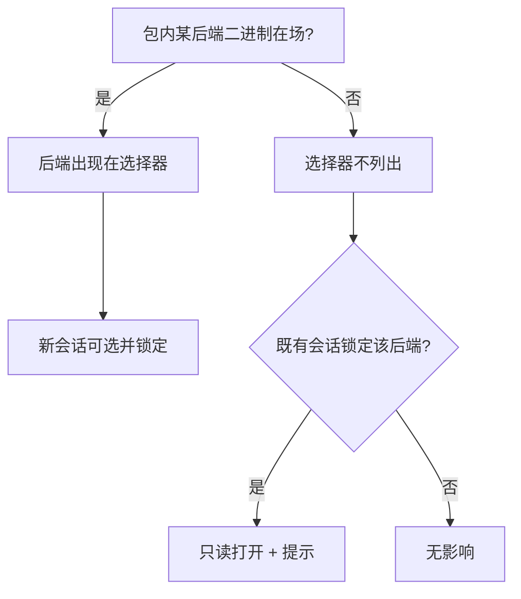
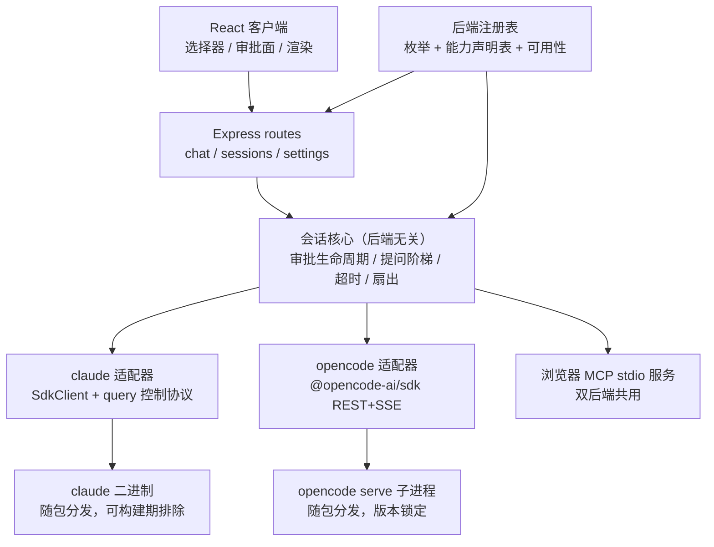
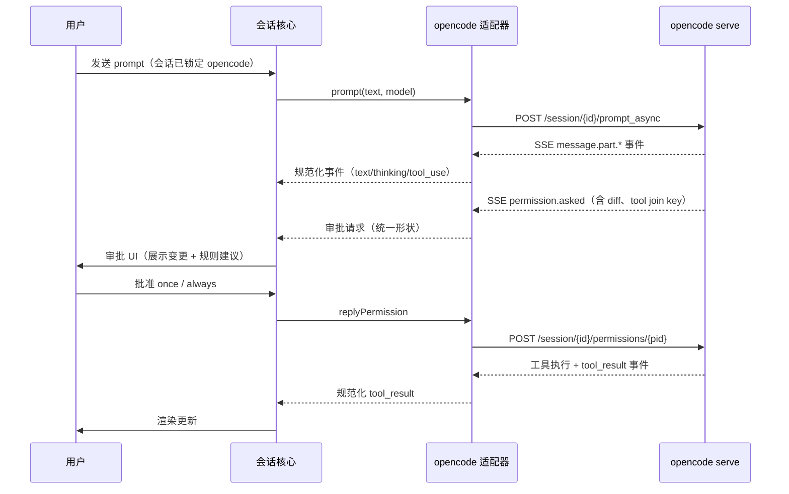

# Pluggable Agent Backend - Plan

## Goal Capsule

- **Objective:** 让禁用 Claude Code 的企业能部署 Comate 并获得完整可用的 GUI 会话体验——agent 运行时成为用户可选能力（claude / opencode 双后端），并提供不含 claude 二进制的分发形态。
- **Product authority:** 本计划只拥有"可替换 agent 后端（GUI 会话范围）"。WeCom bot 的 opencode 支持、kimi-code 接入、模型层改动均不是活动范围。
- **Open blockers:** 无；Open Questions 均为 Deferred（不阻断实施）。
- **Execution profile:** Deep，8 个单元 / 3 个阶段（地基 → opencode 后端上线 → 对等验收）。
- **Stop conditions:** question 通道在锁定二进制上实测失败；hooks 存在无法对齐的事件且触及"全量对等"门槛；官方 SDK 打包适配与 spike 回退均不可行。任一触发即停下来回给用户，不静默降级。
- **Tail ownership:** standalone ce-work，用户在关键节点在场评审。

---

## Product Contract

Product Contract unchanged（产品范围与 R/A/F/AE 未改；Deferred-to-Planning 的七个问题中六个已由 Planning Contract 回答，question 应答通道的实测排为 U4 首个交付，与另两项未知一并列入 Open Questions）。

### Summary

Comate 的 agent 运行时成为用户可选能力：以固定枚举 + 静态能力声明表支持 claude / opencode 双后端，全局默认 + 会话级下拉切换，会话首发后锁定后端。发布两种形态——默认双后端包，以及不含 claude 二进制的形态服务安全扫描型企业。opencode 后端在全部具名能力对等后才上线。

### Problem Frame

部分企业的合规或安全策略禁止使用 Claude Code。今天 Comate 的 agent 运行时完全绑定 `@anthropic-ai/claude-agent-sdk`（约 24 个文件消费其类型/API），这些企业无法使用 Comate——模型层已经可以换（Provider 模型支持任意 Anthropic 兼容端点），但只要运行时仍是 Claude Code，产品就进不了门。

首个目标客户就是提出本需求的企业自身：其内部已在用腾讯云端点，且该企业"内部不让用 Claude Code，相关下载已禁"。对企业的开发者而言，不交付本能力的代价是明确的——无法使用 Comate，或转向别的工具。

### Key Decisions

- **opencode 为首个备选运行时。** spike 实测通过审批回环、事件流保真、平台二进制分发、非 Anthropic 链路四项验证。(session-settled: user-approved — chosen over kimi-code: kimi 原生 SDK 未发布（private: true），其已发布集成面（ACP）会回退 fork/子代理面板功能；若 Moonshot 发布 SDK 可重估)
- **后端即固定枚举 + 静态能力声明表。** 两个后端由代码内枚举表示，各附一份能力声明表作为降级 UI 的单一数据源；第三后端未来若接入，成本是一个枚举值加一个适配器。(session-settled: user-directed — chosen over 后端注册表与 BYO-claude 默认包: 两个枚举值不值注册表机制；BYO 回退主流用户的零配置体验且与版本锁定冲突)
- **用户级自由切换，合规执行留在企业侧。** 不建企业锁定/管理面机制。(session-settled: user-directed — chosen over 单包双后端+部署锁与双包构建变体: 企业对 Claude Code 的禁用已在产品之外执行，目标企业需要的是一个可用的不含 claude 的形态，而非开关管控)
- **两种分发形态都要。** 默认双后端包 + 不含 claude 二进制的形态。(session-settled: user-directed — chosen over 仅兼容"禁使用"企业: 目标企业可能按二进制存在做安全扫描拦截，形态未定前两类都要覆盖)
- **开关粒度 = 全局默认 + 会话级下拉。** 沿用 Provider 选择的产品模式（应用级默认、草稿期可改），用户零学习成本。(session-settled: user-approved — chosen over workspace 级设置与三级并存: 复用已验证模式)
- **会话首发锁后端，原后端缺失时只读。** 后端 transcript 不可跨运行时恢复；历史展示走 Comate 自有存储，与后端无关。(session-settled: user-approved — chosen over 可切换但重启上下文与不可用即隐藏: 锁定保连续性，只读保可见性)
- **v1 不含 WeCom bot。** bot 会话留在 claude 后端，opencode 的 bot 隔离门等价实现后续单独评估。(session-settled: user-approved — chosen over bot 全量对等交付与受限可用: 无人值守通道的权限门风险最高，不在首期赌)
- **全量对等门槛。** AskUserQuestion 等价流、Subagent 面板、内置浏览器、Hooks + slash 命令全部对等后才允许 opencode 后端上线。(session-settled: user-directed — chosen over 降级上线: 换切换后端对用户无感，代价是发布周期拉长)
- **降级呈现 = 禁用 + 说明。** 不可用能力呈禁用态并附原因，不隐藏。(session-settled: user-approved — chosen over 直接隐藏与不允许降级: 保留功能可发现性；不可信通道沿用不暴露实现细节的安全约定)

### Actors

- A1. 企业开发者：在禁用 Claude Code 的环境中使用 Comate 完成编码会话的 GUI 用户。
- A2. 企业 IT/部署方：决定安装哪种分发形态、配置企业模型端点；合规执行（禁用 Claude Code）发生在产品之外。
- A3. 系统（Comate）：解析后端可用性、锁定会话后端、按能力声明表呈现降级。

### Requirements

**后端选择与切换**

- R1. 用户可为新会话选择 agent 后端（claude 或 opencode），选择器沿用聊天输入框的 Provider 下拉位置与交互。
- R2. 应用级默认后端可在设置中修改；新会话的后端选择器预选该默认值。
- R3. 后端选择器仅列出运行时可用的后端；可用性跟随对应运行时二进制的在场。
- R4. 会话在发送首条消息时锁定后端；锁定后该会话的后端不可更改。

**会话亲和与历史**

- R5. 继续既有会话始终使用该会话锁定的后端。
- R6. 历史消息展示与后端无关，走 Comate 自有存储。
- R7. 当会话锁定的后端不可用时会话以只读打开，显示明确提示并禁止发送新消息。

**能力对等与降级呈现**

- R8. opencode 后端上线前，以下能力达到用户可见对等：流式对话与思考展示、工具调用渲染、审批流（含"总是允许"规则持久化）、AskUserQuestion 问题阶梯、Subagent 面板、内置浏览器、workspace hooks、slash 命令、任务（todo）面板、会话管理（列表/重命名/fork/恢复）、模型切换。
- R9. 系统维护一份按后端声明的能力表，作为降级呈现与对等验收的单一数据源。
- R10. 任一后端不支持的能力在 GUI 呈现为禁用态并附原因说明，而非隐藏。

**分发形态**

- R11. 默认发布形态包含两个后端的运行时二进制。
- R12. 提供不含 claude 运行时二进制的形态；该形态中 claude 后端按 R3 自动不可用。
- R13. opencode 运行时二进制随 Comate 版本锁定分发，不依赖用户机器上的既有安装。

**Bot 边界**

- R14. WeCom bot 创建的会话使用 claude 后端且不暴露后端切换。

后端可用性与会话行为的判定结构（R3、R7、R12 的联合逻辑）：

### Key Flows

- F1. 新会话后端选择
  - **Trigger:** A1 新建会话或打开草稿会话。
  - **Actors:** A1, A3
  - **Steps:** 选择器预选应用级默认后端；A1 在草稿期可切换；发送首条消息后后端锁定。
  - **Outcome:** 会话以其锁定的后端运行。
  - **Covered by:** R1, R2, R3, R4

- F2. 无 claude 形态的企业部署
  - **Trigger:** A2 在安全扫描型企业环境中安装 R12 形态。
  - **Actors:** A1, A2, A3
  - **Steps:** 安装形态中不含 claude 二进制；A2 配置企业模型端点（Provider）；A1 的新会话仅见 opencode 后端；完成包含工具审批的完整会话。
  - **Outcome:** 企业获得不引入 Claude Code 的完整 GUI 会话能力。
  - **Covered by:** R3, R8, R11, R12, R13

- F3. 跨时代会话打开
  - **Trigger:** A1 打开一个锁定后端在当前安装中不可用的历史会话。
  - **Actors:** A1, A3
  - **Steps:** 会话以只读打开；历史完整展示；显示后端不可用提示；发送入口禁用。
  - **Outcome:** 历史不丢失，行为无歧义。
  - **Covered by:** R6, R7

### Acceptance Examples

- AE1. **Covers R3, R8, R11, R12, R13.** 安全扫描环境安装无 claude 形态 → 安装结果无任何 claude 二进制；新建会话仅见 opencode 后端；用企业自有端点完成一次包含工具审批的完整会话。
- AE2. **Covers R6, R7.** 在无 claude 形态中打开 claude 时代的历史会话 → 只读展示并带提示，发送被阻止。
- AE3. **Covers R1, R4.** 草稿会话切换后端到 opencode 并发送首条消息 → 后端锁定，选择器此后对该会话呈锁定态。
- AE4. **Covers R8.** opencode 会话中触发需审批的写操作 → 审批 UI 展示变更内容，批准后工具执行；选择"总是允许"后同类操作不再询问。
- AE5. **Covers R8.** opencode 会话中 agent 发起提问 → 问题阶梯 UI 完整工作，答案回传后对话继续。依赖问题应答通道的窄验证结论（见 Open Questions 的 question 应答通道验证项）。

### Success Criteria

- 企业部署验收：在按二进制存在拦截 Claude Code 的环境中，AE1 全流程通过。
- 对等验收：R8 所列能力逐项双后端对照通过，验收清单由 R9 的能力表生成。
- 切换无感：同一工作流在双后端下的 UI 差异仅为能力表声明的禁用项。

### Scope Boundaries

**Deferred for later**

- WeCom bot 的 opencode 支持（含权限隔离门的等价实现）——风险最高的无人值守通道，单独评估。
- kimi-code 后端——其原生 SDK 发布后重估。
- ACP 通用适配层——当前 ACP 稳定面会回退 fork/子代理面板，不作为集成路径。

**Outside this product's identity**

- 企业锁定与管理面（MDM、强制策略、审计日志）——合规执行留在企业侧。
- 模型层任何改动——Provider 模型已覆盖企业端点（含气隙自带端点）。
- 自研 agent 运行时。

### Dependencies / Assumptions

- 依赖：opencode 运行时二进制经 npm 平台 optionalDependencies 分发（`opencode-ai`，MIT，已核实 12 个平台包）——R13 的打包路径与现有 claude 二进制机制同构。
- 依赖：AskUserQuestion 等价通道（opencode v2 API 的 question 应答面）——spike 未实测，须在实施早期窄验证（见 Open Questions 的 question 应答通道验证项）。
- 假设：目标企业允许自带模型端点；首个目标企业的端点已在 Provider 配置中使用。
- 假设：双后端包体增大被默认接受；无 claude 形态不受影响。
- 假设：opencode 事件协议存在版本间漂移（实测 1.14 与 1.18 源码间 permission 事件改名），R13 的版本锁定是硬约束。

### Open Questions

均为 Deferred（不阻断实施；在实施指定节点回答）：

- `@opencode-ai/sdk` 在 pkg sidecar 中的打包适配——U4 实施时第一时间验证；失败则回退 spike 手写骨架（已实测可用）。
- question 应答通道在锁定的 opencode 二进制上的实测——U4 的首个交付；失败属 Stop condition。
- hooks 事件映射覆盖度——U7 实施中确认；出现无法对齐的事件且触及全量对等门槛时，按冲突通道回给用户。

### Sources / Research

- Spike 验证记录（审批回环/事件保真/二进制打包/非 Anthropic 链路实测结论与缺口清单）：docs/plans/2026-07-23-001-spike-opencode-runtime-validation-record.md
- Spike 产物（分支 `spike/opencode-runtime-validation`）：src/server/services/opencode-client.ts（REST+SSE 客户端骨架）、scripts/spike-opencode.ts（活验证驱动）
- 现任 SDK 消费面：src/server/services/sdk-client.ts、src/server/services/chat-service.ts、src/server/utils/resolve-sdk-binary.ts
- Provider 选择模式先例（全局注册表 + 会话级下拉 + 草稿期可改）：docs/brainstorms/2026-05-30-llm-provider-management-requirements.md
- 能力 flag 先例：src/server/models/provider.ts（`supportsFastMode`，默认 true）
- opencode 上游：github.com/anomalyco/opencode（MIT）；npm `opencode-ai` 平台 optionalDependencies；REST/SSE 面见 spike 记录

---

## Planning Contract

### Key Technical Decisions

- **KTD-1. 适配层接缝 = 抽取会话运行时的后端无关核心，双后端各为适配器。** 把 SessionRuntime 中后端无关的逻辑（审批请求生命周期、提问阶梯、超时、事件扇出、只读/锁定态）抽为共享核心；claude 成为首个适配器（包裹现有 SdkClient/query 路径），opencode 为第二适配器。规范化目标是现有内部消息模型（SseEvent/ChatMessage），客户端与渲染层零改动。这是本计划最大技术风险——改动久经考验的 claude 路径——以"零行为变化"为验收、特征化测试先行（见 U2 的 Execution note）。回答了 OQ2/OQ3。
- **KTD-2. opencode 客户端用官方 `@opencode-ai/sdk`，与打包二进制版本对齐锁定。** 上游 OpenAPI 生成类型消除整类协议漂移 bug（spike 手写客户端一个下午踩了三个：空响应体、事件名版本漂移、directory 作用域），版本对齐复用 claude SDK↔CLI 的同款锁定约定。spike 手写骨架保留两个角色：part→MessagePart 映射器的种子；官方 SDK 打包适配失败时的回退。(session-settled: user-directed — chosen over spike 手写骨架: 上游维护的类型层消除协议 bug 类，且保住"opencode 有受支持客户端"这一选型优势)
- **KTD-3. 二进制分发沿用平台 optionalDependencies + 构建期拷贝；无 claude 形态 = 构建期变体开关。** opencode 平台包（`opencode-{platform}-{arch}`）以锁定版本加入 optionalDependencies，build-sidecar 拷贝进 Tauri resources，与 claude 二进制同款链路。变体开关（环境变量驱动）在构建时排除 claude 二进制与对应 optional dep，产出双 flavor 单发布线。后端可用性复用现有 resolve 回退：二进制缺失即不可用，而非错误。资源拷贝遵守 cpsync 符号链接教训（docs/solutions/build-errors/cpsync-rewrites-relative-symlinks-dangling-tauri-resources.md）。回答了 OQ5。(session-settled: user-directed — 实例化 brainstorm 的"两种分发形态"决策: chosen over 安装期选项与双发布线: Tauri 打包应用无安装器组件框架，构建期排除最简单且审计面最小)
- **KTD-4. 能力声明表 = 服务端静态注册模块，经初始化 API 下发。** 每个后端枚举值附一份能力映射（full / degraded / unavailable + 说明文案 i18n key）；服务端注册模块是唯一数据源，客户端经初始化/设置接口获取并驱动"禁用 + 说明"呈现；对等验收清单由同一份表生成。回答了 OQ4。(session-settled: user-directed — 实例化 brainstorm 的"固定枚举 + 静态能力声明表"决策)
- **KTD-5. 会话实体携带后端标识，首发消息时锁定；默认后端不可用时回退并提示。** 会话记录其创建时的后端；继续会话永远使用锁定后端；锁定后端不可用 → 只读 + 提示。应用级默认后端指向不可用后端时，静默回退到可用后端并在选择器处提示（brainstorm 未覆盖的边缘行为，经综述确认）。回答了亲和边界。
- **KTD-6. 浏览器 MCP 独立化为 stdio MCP 服务，双后端共用。** 承载层从 claude SDK 的进程内 `createSdkMcpServer` 换成标准 MCP stdio 服务（`@modelcontextprotocol/sdk`）；BrowserToolContext、工具定义、浏览器审批门原样保留，仅换承载。两个后端都以 stdio MCP server 配置接入。回答了 OQ6。
- **KTD-7. hooks 对等 = shim 插件在映射事件上调用同一批脚本。** Comate 的 workspace Hook 模型是 `{name, scriptPath}`；为 opencode 后端生成一个 shim 插件，在语义对应的 opencode 插件事件上调用同一批脚本。无法对齐的事件在能力表标 degraded 并触发与用户的冲突通道（Stop condition），不静默降级。回答了 hooks 部分（OQ 七项之一）。
- **KTD-8. 类型解耦 = 本地 `PermissionSuggestion` 结构类型替换 SDK 的 `PermissionUpdate`。** 两个字节一致的 message.ts（src/client 与 src/server，CI 有 diff 检查）同步修改；claude 适配器把 PermissionUpdate 映射进来，opencode 适配器从 permission 载荷的 always/patterns 构造。回答了 OQ7。

- **KTD-9. 会话后端标识落库，存量会话默认 claude。** sessions 表新增 backend 列，沿用既有 `PRAGMA table_info` + 条件 `ALTER TABLE ADD COLUMN` 增量迁移模式（approval_mode、provider_id 同源先例）；存量行默认 `claude`，与 WeCom 隔离策略的 grandfathered 惯例一致。
- **KTD-10. analytics 上线口径：opencode 会话暂不计入，声明式降级。** analytics-service 的会话枚举走 claude SDK 的 transcript 列表，opencode 会话的 transcript 位于 opencode 自有存储，上线时不纳入用量/费用统计；该差异写入能力声明表并在分析页面给出说明（R10 机制）；后续经适配器会话枚举补齐，列入 Deferred。

### High-Level Technical Design

适配层拓扑（KTD-1/KTD-2/KTD-6 的联合结构）：

opencode 后端一次带审批的 prompt 生命周期（对应 AE4）：

### Sequencing

三个阶段，阶段内单元可按依赖并行，阶段间有硬顺序：Phase A 地基（U1–U3）不改动任何用户可见行为；Phase B（U4–U5）让 opencode 后端在核心链路上跑通；Phase C（U6–U8）补齐对等项并验收。U4 的 question 通道验证是整个计划最早的 go/no-go 点。

### Risks & Dependencies

- **会话核心重构回归风险（高）**：缓解 = U2 特征化测试先行 + 零行为变化验收 + 现有 session-runtime.test.ts 基础。
- **question 通道未实测（高，最早的 go/no-go）**：缓解 = U4 首个交付即验证；失败即 Stop condition 回给用户。
- **hooks 语义覆盖不足（中）**：缓解 = U7 实施中确认映射矩阵；partial 触发冲突通道而非静默降级。
- **官方 SDK 打包适配（低-中）**：pkg 对 TS 源码形式发布的依赖可能有适配成本；缓解 = spike 骨架回退（已实测）。
- **opencode 版本升级漂移（中）**：事件协议已观察到版本间改名；缓解 = KTD-2/KTD-3 的双重版本锁定（SDK 与二进制对齐、随 Comate 发布升级）。
- **会话表结构变更（低）**：新增 backend 列沿用既有增量迁移模式（PRAGMA + 条件 ALTER），存量默认 claude，无回填与停机面。

---

## System-Wide Impact

- **会话存储**：sessions 表新增 backend 列（KTD-9）是所有会话读取路径的共享面；存量行默认 `claude` 保证旧行为不变，新列只读于后端解析与锁定逻辑。
- **analytics 口径**：analytics-service 经 claude SDK 枚举 transcript；opencode 会话上线时不纳入统计（KTD-10），分析页面对此有说明，能力声明表是声明源。
- **能力表下发**：初始化/设置接口新增能力表与后端可用性字段为纯增量；旧客户端忽略未知 JSON 键，无兼容破坏面。
- **bot 边界**：WeCom bot 会话创建路径强制 claude 后端（R14），隔离门与审批流不经过任何 opencode 代码路径。
- **发布面**：CI release 增加一个 flavor 维度（默认 / 无 claude），两条产物线共用一套代码与一份能力表；无 claude 形态的 claude 后端不可用性由 resolve 回退自然产生（R3），无需条件编译。

---

## Implementation Units

### Phase A：地基（无用户可见行为变化）

### U1. 类型解耦与后端注册表骨架

- **Goal:** 移除内部消息模型对 claude SDK 的类型依赖；建立后端枚举、能力声明表与可用性解析的单一数据源。
- **Requirements:** R3, R9, R10；KTD-4, KTD-8
- **Dependencies:** 无
- **Files:** src/server/types/message.ts、src/client/types/message.ts（同步，CI 字节一致检查）、src/server/services/sse-emitter.ts、src/client/stores/chat-store.ts、src/client/components/ApprovalSurface.tsx、新增 src/server/services/agent-backends.ts、新增 src/server/services/agent-backends.test.ts
- **Approach:** 定义本地 `PermissionSuggestion` 结构类型替换全部 `PermissionUpdate` import（claude 侧在使用点做映射）。`agent-backends` 模块导出：BackendId 枚举、Capability 类型与两后端的静态能力表（含 analytics 口径条目，KTD-10）、可用性解析（复用 resolve 策略族，二进制缺失 → unavailable 而非错误）、默认后端解析（含不可用回退规则，KTD-5）。
- **Patterns to follow:** src/server/models/provider.ts 的 `supportsFastMode` 能力 flag 先例；两个 message.ts 的同步方式（文件头注释说明了字节一致约束）。
- **Test scenarios:**
  - Happy path：claude PermissionUpdate 载荷映射为 PermissionSuggestion 后，审批建议照常渲染
  - Happy path：能力表查询返回每后端各能力的 full/degraded/unavailable + 说明 key
  - Edge：默认后端指向不可用后端 → 回退到可用后端并产生提示标记
  - Edge：能力表中未声明的能力名 → 默认 full（与现有默认 allow-all 惯例一致）
  - Error：两个 message.ts 不同步时 CI diff 检查失败（验证检查仍生效）
- **Verification:** 全部既有测试绿；新类型在所有原 PermissionUpdate 使用点编译通过；agent-backends 单测覆盖上述场景。

### U2. 会话核心抽取（claude 成为首个适配器）

- **Goal:** 把 SessionRuntime 的后端无关逻辑抽为共享核心，claude 路径改为经适配器驱动，用户可见行为零变化。
- **Requirements:** R5, R8（核心链）；KTD-1
- **Dependencies:** U1
- **Files:** src/server/services/session-runtime.ts（重构）、新增 src/server/services/session-core.ts（或等价命名的共享核心）、src/server/services/claude-adapter.ts、src/server/services/chat-service.ts（接线）、src/server/storage/sqlite-store.ts（sessions 表 backend 列迁移）、src/server/services/session-runtime.test.ts（先行强化）
- **Approach:** 共享核心持有审批请求生命周期（pending/resolve/timeout）、提问阶梯状态、事件扇出（bot/web 订阅）、只读与锁定态，以及会话后端标识的读写与首发锁定判定（KTD-5/KTD-9）；claude 适配器实现后端接口（prompt/interrupt/事件流/控制面）包裹现有 query 路径。sse-emitter 与 message-normalizer 保持在核心侧不变。
- **Execution note:** 特征化测试先行——重构前先把 session-runtime.test.ts 对审批流、提问流、超时、中断的现有行为覆盖补强并观察全绿；重构后同一套件必须无修改通过。
- **Patterns to follow:** 现有 session-runtime.ts 的事件扇出与 bot/web 双通道结构；sdk-client.ts 的薄封装风格。
- **Test scenarios:**
  - Happy path：claude 会话全流程（prompt → 流式 → 审批 → 完成）在重构后行为一致
  - Edge：审批超时路径（timeoutDeny）与取消路径行为一致
  - Edge：存量会话（无 backend 列值）按 claude 后端处理；新会话首发时后端标识写入并锁定（KTD-9）
  - Edge：提问阶梯多问题流程与答案注入行为一致
  - Error：SDK 流中断/错误时的事件序列与现有一致
  - Integration：chat-service 建会话 → 核心扇出 → SSE 到客户端的链路无回归
- **Verification:** 特征化套件重构前后无修改通过；npm run test:server 与 test:client 全绿；无源文件行为注释被删改。

### U3. opencode 二进制打包与分发变体

- **Goal:** opencode 运行时二进制随包锁定分发；构建期变体开关产出无 claude 形态。
- **Requirements:** R11, R12, R13；KTD-3
- **Dependencies:** U1
- **Files:** package.json（optionalDependencies 增加锁定的 opencode 平台包）、scripts/build-sidecar.ts、src/server/utils/resolve-sdk-binary.ts（泛化为按后端解析或新增并行解析器）、src-tauri/tauri.conf.json（如需）、CI release workflow
- **Approach:** 版本锁定 opencode 平台包并在构建时拷贝进 resources（与 claude 同款）；变体环境变量控制是否排除 claude 二进制与其 optional dep；resolve 逻辑按后端解析，缺失返回 unavailable。拷贝实现避开 cpsync 相对符号链接改写问题。
- **Execution note:** 本单元以打包/配置为主，优先构建与运行 smoke 验证，而非单元覆盖。
- **Patterns to follow:** build-sidecar.ts 现有的 claude 二进制拷贝段；resolve-sdk-binary.ts 的四策略回退。
- **Test scenarios:**
  - Happy path：默认构建产物同时含两个后端二进制，且各自可被 resolve 解析
  - Happy path：变体构建产物不含任何 claude 二进制（含 node_modules 闭包检查）
  - Edge：opencode 二进制缺失时 resolve 返回 unavailable 而非抛错
  - Integration：打包产物中 spawn opencode serve 成功（spike 脚本可复用为 smoke 驱动）
- **Verification:** 两种 flavor 构建成功；产物内容与解析行为符合上述场景。

### Phase B：opencode 后端上线

### U4. opencode 适配器（含 question 通道窄验证）

- **Goal:** 基于官方 SDK 实现 opencode 后端适配器，跑通核心会话链路与审批回环；question 应答通道在本单元最早验证。
- **Requirements:** R1, R4, R5, R8（核心链、审批、提问）；AE3, AE4, AE5；KTD-1, KTD-2
- **Dependencies:** U2, U3
- **Files:** 新增 src/server/services/opencode-adapter.ts、src/server/services/opencode-adapter.test.ts、src/server/services/opencode-client.ts（自 spike 分支引入，降级为回退与参考）、scripts/spike-opencode.ts（改造为适配器 smoke 驱动）
- **Approach:** 首个交付是 question 通道窄验证：在 U3 锁定的二进制上验证 question.asked → reply → 会话继续（v2 应答面），失败即触发 Stop condition。随后实现适配器：spawn serve（就绪解析）、prompt_async、SSE 订阅（directory 作用域）、permission/question 应答、abort、setModel、fork/children/todos 会话操作；事件经映射器（spike 的 mapOpencodePart 为种子）进入共享核心。
- **Execution note:** proof-first——question 验证先于适配器主体；适配器集成测试以真实 serve 进程驱动（沿用 spike 的隔离数据目录方式），不以 mock 代替。
- **Patterns to follow:** spike 的 opencode-client.ts 与 scripts/spike-opencode.ts（就绪解析、事件订阅、报告结构）；U2 的 claude 适配器形状。
- **Test scenarios:**
  - Covers AE4. 触发需审批的写操作 → 审批请求带 diff 到达核心 → 批准 once → 工具执行、结果渲染；再次触发选 always → 不再询问
  - Covers AE5. agent 发起提问 → 问题阶梯完整呈现并回传答案，会话继续
  - Happy path：流式 text/thinking/tool_use/tool_result 事件映射进入核心的形状与 claude 侧一致
  - Edge：空响应体端点（prompt_async 类）不抛 JSON 解析错
  - Edge：SSE 订阅未带 directory 时的行为被显式处理（不允许静默无事件）
  - Error：serve 进程启动失败/中途退出 → 适配器向核心报出可读错误并清理
  - Integration：fork 与 children 返回的会话结构可供 subagent 面板消费
- **Verification:** question 验证结论记录在案；适配器集成测试全绿；AE4/AE5 在 opencode 后端通过。

### U5. 后端选择器与降级呈现

- **Goal:** 落地全局默认 + 会话级下拉、锁定态、只读提示与能力驱动的禁用+说明。
- **Requirements:** R1, R2, R3, R4, R7, R10, R14；F1, F3；AE2, AE3；KTD-4, KTD-5
- **Dependencies:** U1
- **Files:** 聊天输入框选择器组件、设置页默认后端项、会话锁定/只读提示组件、src/client/stores/chat-store.ts、服务端初始化/设置路由（下发能力表与可用性）、bot 会话创建路径（固定 claude 且不暴露切换）、新增选择器组件测试与 chat-store 测试
- **Approach:** 选择器复用 Provider 下拉的交互与位置；草稿期可改、首发锁定；锁定后端不可用时会话只读并提示；能力表驱动各功能入口的禁用态与说明；bot 创建的会话强制 claude 后端且不显示选择器。
- **Patterns to follow:** Provider 选择器（2026-05-30 需求文档描述的模式与现有实现）；ApprovalSurface 的禁用/说明展示约定。
- **Test scenarios:**
  - Covers AE3. 草稿切换后端并首发 → 锁定，选择器此后对该会话禁用
  - Covers AE2. 打开锁定后端不可用的会话 → 只读 + 提示，发送被阻止
  - Happy path：能力表标 unavailable 的功能入口呈禁用 + 说明
  - Happy path：分析页面对"opencode 会话暂不计入统计"的口径说明可见（KTD-10）
  - Edge：默认后端不可用时选择器预选回退后端并显示提示（KTD-5）
  - Edge：bot 会话不渲染后端选择器且后端为 claude
  - Integration：初始化接口下发的能力表与注册表一致
- **Verification:** 组件与 store 测试绿；AE2/AE3 走查通过。

### Phase C：对等补齐与验收

### U6. 浏览器 MCP 独立化为 stdio 服务

- **Goal:** 内置浏览器能力脱离 claude SDK 进程内 MCP，成为双后端共用的 stdio MCP 服务。
- **Requirements:** R8（内置浏览器）；KTD-6
- **Dependencies:** U2
- **Files:** src/server/services/browser-mcp.ts（承载层替换）、新增浏览器 MCP stdio 服务入口、src/server/services/chat-service.ts（MCP 配置接线）、浏览器审批门相关文件、src/server/services/__tests__/browser-mcp.test.ts
- **Approach:** 工具定义、BrowserToolContext 与审批门原样保留；以 `@modelcontextprotocol/sdk` 提供 stdio 服务；两个后端各自以 stdio MCP server 配置接入；claude 路径同步切换到该服务（避免两套浏览器实现并存）。
- **Patterns to follow:** 现有 browser-mcp.ts 的工具定义结构；workspace MCP 配置在 chat-service 的装配方式。
- **Test scenarios:**
  - Happy path：浏览器工具经 stdio 服务在 claude 后端照常可用（无行为回归）
  - Happy path：同一服务在 opencode 后端可用
  - Edge：浏览器审批门在新承载下仍走统一审批流
  - Error：MCP 服务启动失败时两个后端的降级行为可读
  - Integration：open → snapshot → 交互的工具链在双后端各自跑通
- **Verification:** 双后端浏览器工具链测试绿；claude 路径无回归。

### U7. hooks 桥接、slash 命令与 subagent 面板对等

- **Goal:** opencode 后端达到 workspace hooks、slash 命令、subagent 面板的用户可见对等。
- **Requirements:** R8（hooks、slash、subagent）；KTD-7
- **Dependencies:** U4, U6
- **Files:** opencode 适配器（hooks shim 生成与注入）、src/server/services/commands-service.ts、src/server/services/subagent-loader.ts、src/server/services/subagent-loader.test.ts、analytics 相关读取、workspace hooks 接线
- **Approach:** 为 opencode 后端生成 shim 插件，在语义映射事件上调用 workspace 的同一批脚本（Comate Hook = name + scriptPath）；slash 命令经 opencode 的命令面接入命令选择器；subagent 面板改从 children 会话结构读取。实施中先确认 hooks 事件映射矩阵，出现无法对齐的事件按 Stop condition 回给用户。
- **Patterns to follow:** commands-service 现有的命令发现流；subagent-loader 的读取面；opencode 插件事件模型（上游 packages/opencode/src/plugin）。
- **Test scenarios:**
  - Happy path：workspace 脚本 hook 在 opencode 会话的对应事件上被调用（顺序与参数符合映射矩阵）
  - Happy path：slash 命令在 opencode 会话中可发现、可执行、可渲染
  - Happy path：含子代理的 opencode 会话在面板中展示子代理轨迹
  - Edge：脚本 hook 失败/超时的行为与 claude 侧一致
  - Error：某 hook 事件无对应 opencode 事件 → 能力表标 degraded 且 UI 有说明（若触及全量门槛则升级为 Stop condition）
- **Verification:** 映射矩阵与测试绿；三项能力在 opencode 后端走查通过。

### U8. 能力表验收矩阵与全量 AE 走查

- **Goal:** 以能力声明表生成验收清单，完成 AE1–AE5 全量走查（含无 claude 形态产物）。
- **Requirements:** R8, R9, R10；AE1–AE5；F2
- **Dependencies:** U4, U5, U6, U7
- **Files:** 验收清单文档（docs/ 下）、U3 的构建产物
- **Approach:** 从能力表生成双后端对照清单；逐项走查 R8 能力；在两种 flavor 产物上分别走查 AE 场景（AE1/AE2 必须在无 claude 形态产物上执行）。
- **Execution note:** 本单元以运行走查为主，验收证据是走查记录而非新单元测试。
- **Test scenarios:**
  - Covers AE1. 无 claude 形态：无 claude 二进制、仅 opencode 可选、企业端点完成含审批会话
  - Covers AE2. 无 claude 形态中老 claude 会话只读 + 提示
  - Covers AE3/AE4/AE5. 选择锁定、审批流、提问阶梯在 opencode 后端全通过
  - Integration：R8 全部能力双后端对照无未声明差异
- **Verification:** 走查记录归档；Success Criteria 三条全部满足。

---

## Verification Contract

- `npm run lint`——全仓 ESLint（max-warnings 0），每次提交前。
- `npm run test:server`——node:test 服务端测试（测试文件首行 import test-utils/test-env，禁直连生产 data.db）。
- `npm run test:client`——vitest jsdom 组件/hooks 测试。
- `npx tsc --noEmit -p tsconfig.server.json`——服务端类型检查。
- `npm run release` 双 flavor 构建 smoke——发布闸（非每提交）：默认形态与无 claude 形态各自构建成功且二进制内容符合 U3 场景。
- 行为验收——AE1–AE5 按 U8 走查记录归档；R8 能力以能力表生成的对照清单逐项验收。
- claude 后端回归闸——U2 特征化套件与既有测试全程无修改通过。

---

## Definition of Done

全局完成标准：

- 全部 Implementation Units 落地，Verification Contract 各项全绿。
- AE1–AE5 走查通过并归档；Success Criteria 三条满足。
- claude 后端用户可见行为零回归（U2 特征化套件 + 全量既有测试）。
- 无遗留实验性代码：官方 SDK 打包适配若失败且启用 spike 回退，须在 diff 中保留最小回退并注释说明；未用的探索性代码一律移除。
- 计划文档与 brainstorm 文档随功能分支代码一并提交（仓库约定，见 docs/solutions/conventions/commit-plan-and-brainstorm-files-with-code-changes.md）。

单元完成标准：以各单元的 **Verification** 字段为其完成信号；特征化/先行测试的观察记录（重构前红/绿基线）随单元提交保留。
