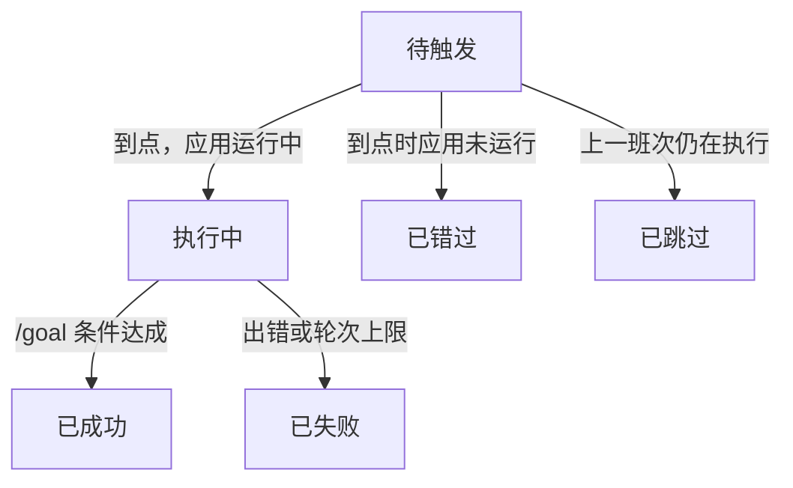
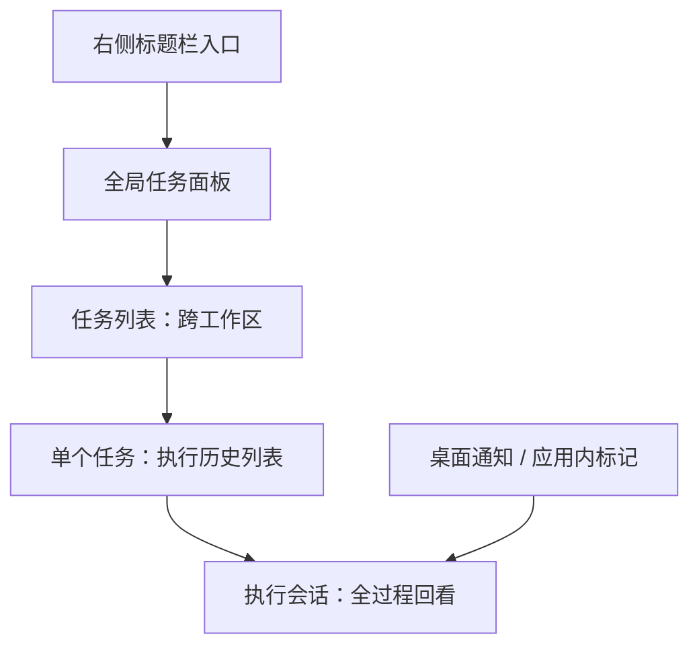
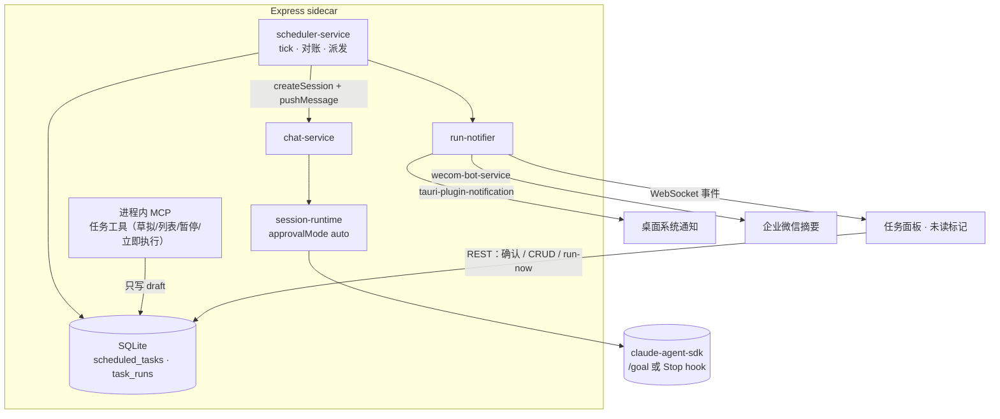
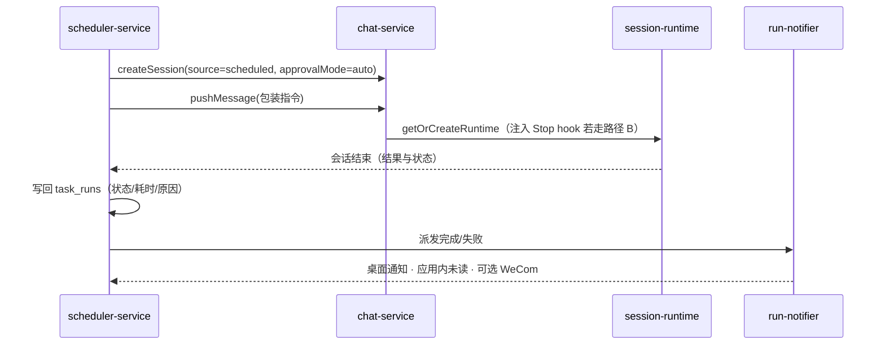
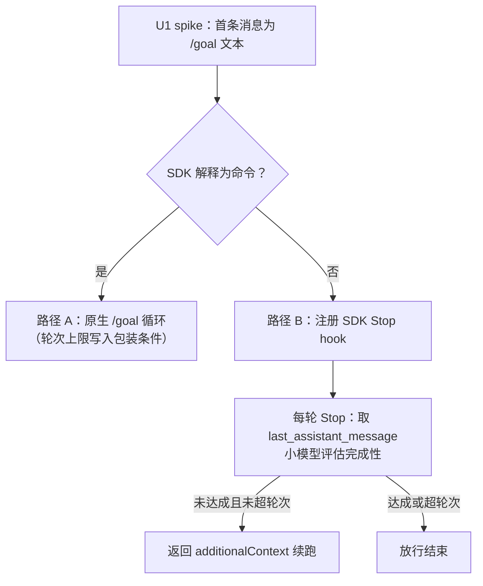

# Scheduled Tasks - Plan

## Goal Capsule

- **Objective:** 让 Comate 用户配置的定时/延迟任务在无人值守下自动执行——每次执行是一个可回看的独立会话，执行结果主动触达用户。今天等价的动作靠人到点手动触发。
- **Product authority:** 本计划只拥有"Comate 内置定时任务（本地、应用运行期间触发）"。云端定时执行、系统级后台守护、任务自调度不是活动范围。
- **Open blockers:** 无。/goal 程序化可用性由 U1 实测裁决（双路径已设计），不阻断启动。
- **Execution profile:** Deep，8 个单元 / 3 个阶段（地基 → API 与集成 → UI）。
- **Stop conditions:** U1 实测发现 /goal 文本不被 SDK 解释 **且** Stop hook 路径在 Comate 的运行参数下无法驱动续跑；引入 Tauri 通知插件破坏打包或签名。任一触发即停下来回给用户，不静默改道。
- **Tail ownership:** ce-work 顺序执行；U1 的路径结论（原生 /goal 或 Stop hook 等价实现）需用户知情后继续。

---

## Product Contract

Product Contract changed: Success Criteria 增加一条结果导向标准（评审中用户确认）；其余 R/A/F/AE 与 Key Decisions 未改。原 Outstanding Questions 五项全部为 Deferred to Planning，已由 Planning Contract 回答——/goal 实测排为 U1、确认形态定为面板待确认区、会话标记用 source、WeCom 摘要复用现有结果提取、包装模板见 KTD-3——故该小节随充实移除，执行期未知移入计划级 Open Questions。

### Summary

Comate 内置定时任务：任务绑定工作区，支持一次性延迟与周期调度，可在 UI 配置，也可在聊天中由 AI 草拟、用户确认后创建。每次触发以免审批模式启动一个全新会话，首条消息为系统包装的 /goal（指令 + 完成标准 + 轮次上限）。结果经桌面通知、应用内标记与可选 WeCom 摘要触达；UI 入口在右侧标题栏，全局任务面板内可查看每个任务的执行历史并跳进对应会话。

### Problem Frame

今天的替代方案是人到点手动触发：想两小时后部署、想每天早上看一眼仓库动态，都得自己记住并坐在电脑前。成本不是缺工具，而是人必须在场。

Claude Code 生态已把定时执行做成一等能力（/loop、桌面端 Routines、云端 Routines），Comate 用户没有任何等价物。而 Comate 的基础设施已经齐备：程序化创建会话并推送首条消息有先例（todos 路由、WeCom 机器人），审批模式有 auto 档可自审批，WeCom 推送通道现成。缺的是调度器、任务存储和任务 UI 这三块。

### Key Decisions

- **每次执行一个全新会话。** 重复任务的各次执行互不污染上下文，历史回看粒度就是"这一次跑了什么"。(session-settled: user-directed — chosen over 一个任务一个持续会话: 全新会话隔离失败与上下文膨胀)
- **错过即跳过，不补跑。** 触发时刻应用未运行则该次标记"已错过"，启动后不补跑。(session-settled: user-directed — chosen over 启动补跑与一次性补跑/周期跳过: 语义最简单；代价是关机期间的日报类任务不补，CC Desktop 补跑最近一次的做法留作后续重估)
- **执行一律免审批（auto 审批模式）。** 无人值守是设计前提，任务会话不存在"等人点确认"。(session-settled: user-directed — chosen over 跟随工作区白名单、任务级权限档位与遇审批暂停: 接受风险换取真正的无人值守，安全闸门移到创建环节)
- **创建环节是唯一安全闸门。** 聊天中 AI 只能草拟任务卡片（时间、自包含指令、工作区），用户在 UI 确认才生效；WeCom 等远程入口的创建请求一律需确认。(session-settled: user-directed — chosen over 本地直接生效与全部直接生效: 免审批执行下创建端必须把关)
- **系统包装 /goal 作为执行机制。** 用户只写一句指令；触发时系统包装为 /goal 完成条件（指令 + 可验证完成标准 + 轮次上限），由独立小模型评估完成性。(session-settled: user-directed — chosen over 用户手写完成条件与纯 prompt 直跑: 一句话配置最轻，统一包装保证条件质量下限并内置失控上限；显式条件留作后续高级选项)
- **结果触达三层：桌面通知 + 应用内标记 + 可选 WeCom 摘要推送。** 提醒/延迟类任务的价值依赖"跑完能找到人"。(session-settled: user-directed — chosen over 仅应用内标记与仅系统通知: 用户明确要 WeCom 通道)
- **全局任务面板，入口在右侧标题栏。** 与使用统计、设置并列；面板聚合跨工作区任务，任务本身绑定单个工作区执行。(session-settled: user-directed — chosen over 侧边栏 tab 与工作区内页面: 用户明确指定)

### Actors

- A1. Comate 用户（开发者）：配置与管理任务，接收结果触达，回看执行会话。
- A2. 系统（Comate 调度器）：在应用运行期间按调度触发任务、创建执行会话、标记错过与跳过、发送触达。
- A3. 聊天中的 AI 助手：理解自然语言请求，把当前上下文整理为自包含指令，草拟任务卡片。
- A4. 远程入口用户（如 WeCom 联系人）：可请求创建任务，但其任务必须经 A1 在 UI 确认才生效。

### Requirements

**任务配置与调度**

- R1. 用户可创建绑定到某个工作区的定时任务，任务包含名称、执行指令（一段自包含提示词）、调度规则与通知配置。
- R2. 调度支持一次性（指定日期时间）与周期两类；周期提供常用预设（每小时/每天/工作日/每周）并支持自定义 cron，时间按本地时区解释。
- R3. 任务可暂停/恢复、编辑、删除、立即执行。
- R4. 一次性任务在触发执行后自动停用。

**聊天创建**

- R5. 用户在聊天中可用自然语言请求创建、查看、暂停任务；AI 通过专用工具草拟任务，产出含时间、指令、工作区的确认卡片。
- R6. 任务在用户于 UI 确认卡片前不生效；来自 WeCom 等远程入口的创建请求一律需要确认。
- R7. 聊天创建的任务指令由 AI 写成自包含提示词；执行会话是全新上下文，不继承当前聊天的未落盘状态。

**执行**

- R8. 触发时系统在任务所属工作区创建一个全新会话，以 auto 审批模式启动，首条消息为系统包装的 /goal：指令 + 完成标准 + 轮次上限。
- R9. 执行过程作为普通会话完整留痕（工具调用、自动审批记录、最终结果），用户可在会话中查看全过程。
- R10. 非 claude 后端的任务执行退化为纯 prompt 启动（无 /goal 评估器）；能力声明表将该能力标记为 degraded。

**错过与并发**

- R11. 触发时刻应用未运行或系统睡眠的，该次执行标记为"已错过"，不补跑。
- R12. 上一班次仍在执行时到达下一触发点，本次跳过并标记原因。

**结果与历史**

- R13. 右侧标题栏新增入口（与使用统计、设置并列），打开全局任务面板：跨工作区任务列表，展示下次触发时间与最近执行状态。
- R14. 单个任务可查看执行历史列表：每次执行一条记录（状态、触发时间、耗时、失败/跳过原因），点击记录打开对应执行会话。
- R15. 任务执行完成或失败时发送桌面系统通知并在应用内产生未读标记；点击通知跳转到执行会话。
- R16. 任务可配置"完成后推送结果摘要到企业微信"，摘要取自执行会话的最终结果。

### Key Flows

- F1. UI 配置任务
  - **Trigger:** 用户点击标题栏定时任务入口。
  - **Actors:** A1, A2
  - **Steps:** 打开全局任务面板 → 新建任务 → 选工作区、写指令、选调度、配通知 → 保存生效。
  - **Covered by:** R1, R2, R3, R13
- F2. 聊天创建任务
  - **Trigger:** 用户在会话中说"两小时后帮我把这个部署了"。
  - **Actors:** A1, A3
  - **Steps:** AI 将当前上下文整理为自包含指令并草拟任务卡片 → 用户在 UI 确认 → 任务生效。
  - **Covered by:** R5, R6, R7
- F3. 到点执行与触达
  - **Trigger:** 调度器发现任务到期。
  - **Actors:** A2, A1
  - **Steps:** 创建全新会话 → 以 /goal 包装指令 + auto 审批启动 → 执行至条件达成或轮次上限 → 会话结束 → 桌面通知 + 应用内标记（+ 可选 WeCom 摘要）。
  - **Covered by:** R8, R9, R15, R16
- F4. 错过对账
  - **Trigger:** 应用启动后调度器对账。
  - **Actors:** A2
  - **Steps:** 发现触发点已过且未执行 → 该次标记"已错过" → 历史列表可见，不补跑。
  - **Covered by:** R11

### Acceptance Examples

- AE1. **Covers R4, R8.** 一次性任务"18:00 部署"到点执行完毕后，任务呈停用状态不再触发，历史列表保留该次记录。
- AE2. **Covers R11.** 每日 9:00 的任务，应用在 8:50–9:10 未运行；10:00 启动后历史列表出现一条 9:00 的"已错过"记录，不发起补跑。
- AE3. **Covers R12.** 每小时任务上一次执行 55 分钟仍未结束，下一整点到达时跳过该次并标记"上一班次仍在执行"。
- AE4. **Covers R6.** WeCom 联系人请机器人"明早 9 点跑一次测试"，任务不直接生效；用户在 UI 看到待确认卡片，确认后才进入调度。
- AE5. **Covers R8.** 执行会话需要写文件或跑 bash 时不出现审批等待，auto 模式直接放行，会话不因等待人工而停滞。
- AE6. **Covers R10.** 工作区后端为 opencode 时任务以纯 prompt 启动（无完成性校验），功能可用，能力声明表标记 degraded。

### Success Criteria

- 用户 1 分钟内可配置一个一次性延迟任务；到点无人干预跑完，用户收到桌面通知并能一键进入执行会话。
- 重复任务连续一周按调度执行，历史列表完整呈现成功/失败/已错过/已跳过各状态。
- U1 完成 /goal 程序化可用性实测，结论（可用或退化路径生效）被明确记录并回填本计划。
- 创建的任务在首周内被成功执行且被所有者打开查看过执行会话的比例可被观测——验证功能替代了"人到点手动触发"，而不只是机制可运行。

### Scope Boundaries

**Deferred for later**

- 任务运行中自改调度或指令（自调度，类比 CC Desktop 的 update_scheduled_task）。
- 用户手写 /goal 完成条件与轮次上限（高级选项）。
- 错过补跑策略（若"跳过"在实践中损失过大，参照 CC Desktop 补跑最近一次重估）。

**Outside this product's identity**

- 云端/远程定时执行（Anthropic 托管基础设施）与系统级后台守护（login item、防睡眠）——任务只在 Comate 运行期间触发。
- 跨设备任务同步。

### Dependencies / Assumptions

- 依赖既有能力：程序化创建会话与推送首条消息（`src/server/services/chat-service.ts`，先例见 `src/server/routes/todos.ts` 与 `src/server/services/wecom-bot-service.ts`）；审批模式 auto 档自审批（`src/server/models/session.ts`、`src/server/services/session-runtime.ts`）；WeCom 推送通道（`src/server/services/wecom-bot-service.ts`）。
- 假设：/goal 在 agent SDK 程序化会话中可被解释执行（官方文档确认 `claude -p "/goal ..."` 无头模式支持）；若实测不成立，执行退化为纯 prompt，提示词内写明完成标准与轮次上限。
- 假设：调度器生命周期跟随应用进程，应用关闭即不触发——与"错过即跳过"决策一致。

### Sources / Research

- 官方 /goal 文档（https://code.claude.com/docs/en/goal）：完成条件循环 + 小模型评估器；官方建议与 auto 模式搭配实现无人值守。
- 官方调度文档（https://code.claude.com/docs/en/scheduled-tasks、https://code.claude.com/docs/en/desktop-scheduled-tasks）：形态参照——预设调度、每任务权限模式、通知、含跳过原因的历史、自调度工具。
- 仓库断言经独立核对全部成立（附证据）：无既有调度器（package.json 无 cron 依赖）；`createSession`（src/server/services/chat-service.ts:359）与 `pushMessage`（:1430）可程序化驱动会话；`ApprovalMode` 三档（src/server/models/session.ts:1）且 auto 自审批（src/server/services/session-runtime.ts:438）；路由挂载集中于 src/server/server-main.ts:128-149；客户端无 react-router，导航为 src/client/components/Sidebar.tsx:18 的 tab union 加 src/client/App.tsx:347-357 的条件面板；i18n 为 5 个 namespace（src/client/i18n/en、src/client/i18n/zh-CN）；WeCom 推送见 src/server/services/wecom-bot-service.ts 的 sendMessage 调用；仓库与内置插件内无 /goal 命令。

---

## Planning Contract

### Key Technical Decisions

- **KTD-1. 调度器是服务端常驻服务，沿用 queue-worker 生命周期模式。** 分钟级 tick 扫描到期任务 + 启动时对账；在 `src/server/server-main.ts` 与 `wecomQueueWorker.initialize()` 同一区块初始化并随进程关闭。tick 只执行触发点落在当前 tick 窗口内的班次，其余过期班次一律走 missed 路径——R11 对"系统睡眠"的承诺由此可达，也杜绝"睡到 21:30 补跑 18:00 的部署"这类迟到执行。模式锚点：`src/server/services/wecom-queue-worker.ts:22-49`（initialize/shutdown/unref）。
- **KTD-2. 存储为两张新表，沿用 SQLite 演进惯例。** `scheduled_tasks`（任务定义 + status: draft/active/paused/disabled + deleted_at 软删除标记）与 `task_runs`（每次执行记录：状态、触发时间、耗时、原因、指令快照、会话 id）。建表走 `CREATE TABLE IF NOT EXISTS` + 后续 ALTER 的既有模式（`src/server/storage/sqlite-store.ts:245-290`）。任务删除为软删除：列表与调度只读未删除行，执行历史经保留的任务定义始终可溯源；执行会话是普通会话，独立存活。
- **KTD-3. /goal 双路径：原生优先，Stop hook 兜底。** 路径 A：首条消息直接为 `/goal <包装条件>`（U1 实测 SDK 是否解释）。路径 B：Comate 通过 SDK `hooks` 选项为执行会话注册 Stop hook——每轮取 `last_assistant_message`，用小模型评估包装条件，未达成则返回 `additionalContext` 驱动续跑，达成或超轮次则放行。SDK 类型已证实两条原语都在：`hooks?: Partial<Record<HookEvent, ...>>` 含 `Stop` 事件、`StopHookInput.last_assistant_message`、`StopHookSpecificOutput.additionalContext`（node_modules/@anthropic-ai/claude-agent-sdk/sdk.d.ts）。包装模板（两条路径共用）：指令 + "完成标准：指令描述的可验证结果已达成，并输出结果摘要" + "最多 N 轮（默认 20），超限停止并汇报现状"。(session-settled: user-directed — chosen over 仅手写条件与仅纯 prompt: 继承 Product Contract 的"系统包装 /goal"决策，双路径是其工程落地)
- **KTD-4. 执行会话就是常规会话，查看路径零新建。** 创建时 `source: 'scheduled'`、`approvalMode: 'auto'`（沿用 `chat-service.ts:1167` 的会话种子逻辑），backend 随工作区默认、首条消息锁定。历史列表点击 = 打开普通会话视图，直接继承 SSE 学习三件套（重放/心跳/订阅竞态防护，docs/solutions/integration-issues/）；不建任何专用运行视图或流式端点。跨工作区跳转助手（历史记录点击与通知点击共用）：目标工作区未打开则 openWorkspace → 置为活动工作区 → setActiveSession → 关闭任务面板。
- **KTD-5. 任务管理工具经 SDK 进程内 MCP server 暴露，确认闸门只在 UI。** 动作对等分类——agent 可用（NOW）：草拟创建（一律落 draft）、列表、暂停/恢复、立即执行；human-only（NOW）：编辑、删除、确认草稿（**不提供 confirm 工具**，确认只能走 REST 路由由 UI 发起，WeCom 入口同此闸门）；LATER：任务自改调度（见 Scope Boundaries）。MCP server 挂到 claude 后端会话的运行参数上；opencode 会话不挂，能力声明表记 unavailable。工具挂载按会话来源分级：本地交互会话挂完整工具集；bot 会话（wecom/feishu）只挂草拟工具，并以 canUseTool 兜底拒绝其余任务工具（沿用 browser MCP 的注入先例）；定时执行会话（source 'scheduled'）不挂载——自调度已 Deferred，执行会话无需任务工具，同时消除注入内容跨任务干涉的面。确认时将工作区标识与执行能力范围（folderPath、后端、审批模式）快照进任务；触发前校验当前工作区与快照一致，漂移则该次执行拒绝、记录原因并通知用户重新确认。草稿在任务面板"待确认"区确认（支持编辑后确认），替代聊天内卡片。(session-settled: user-directed — chosen over 聊天内卡片与 AI 可自确认: 继承"创建环节是唯一安全闸门"，确认形态经用户确认定为面板待确认区)
- **KTD-6. 桌面通知新增 tauri-plugin-notification。** 当前工程无任何通知插件（Cargo.toml/capabilities 均无）。引入插件 + capability 声明 + 客户端桥接模块。通知点击的跳转机制在 U6 内先行验证：以插件 action（registerActionTypes + onAction，如"查看会话"按钮）驱动 KTD-4 的跳转助手——WebSocket 是 server→client 通道，承载不了 OS 通知点击，"经现有 WebSocket 跳转"不作为机制；若目标平台上 action 也不可达，降级为"通知聚焦应用 + 应用内未读标记引导"，并据实修订实现注记。应用内未读标记复用 WebSocket 推送与现有未读模式。
- **KTD-7. WeCom 摘要复用现有推送与结果提取。** 推送走 `wecom-bot-service` 的 sendMessage 通道，摘要提取复用 WeCom 主代理结果投递的既有实现（docs/plans/2026-07-11-001-fix-wecom-main-agent-result-delivery-plan.md 建立的提取路径）。默认关闭，按任务开启；接收人为任务通知配置中的指定用户，默认工作区管理员。v1 只发纯文本摘要，不做交互卡片（规避模板卡片 5 秒窗口问题）。
- **KTD-8. cron 求值自实现标准 5 字段子集，不新增依赖。** 支持通配、单值、步进、区间、列表（与 Claude Code 文档同一子集；不支持 L/W/? 与别名），预设（每小时/每天/工作日/每周）直接映射。每次触发后按本地时区重算下次触发点，不设绝对定时器。DST 转换行为与错过语义一致：本地不存在的班次（春季拨快）按 missed 记录并跳过；重复的班次（秋季拨回）只在第一次触发。
- **KTD-9. 错过对账：每任务只记最近一个错过班次，游标推进到首个未来班次。** 启动对账与 tick 共用同一条 missed 判定（KTD-1 的窗口规则）。对账时每个任务在 24h 窗口内只补记最近一个错过班次为"已错过"——24h 限的是时间不限条数，高频自定义 cron（如每分钟）在长时间宕机后按班次各记一条会产生上千条历史，故以最近一条保留审计信号；随后把下次触发游标原子推进到首个未来班次，对账幂等，重复启动不重复标记。一次性任务不受 24h 窗口限制：触发点已过即记一条"已错过"并转 disabled（构造上不可能洪水，且避免其永远停留在 active）。启动对账同时清扫残留的 running 记录为 failed（原因"应用退出中断"，沿用 wecom-queue-worker 的 reconcileStaleDelivering 先例）；R12 的并发判定只看在内存中的在途执行。
- **KTD-10. 触发时快照指令与包装条件进 task_runs。** 在途执行不受任务编辑影响；历史记录展示的是"当时跑了什么"，与任务当前定义解耦。
- **KTD-11. 任务数据按工作区敏感数据处理，最小生命周期策略。** 指令与快照不写入诊断日志全文（日志只记 id 与状态）；WeCom 推送默认关闭，开启后仅发送结果摘要（KTD-7）；软删除的任务数据与历史随既有日志清理周期物理清除。

### High-Level Technical Design

组件拓扑（新增件：调度服务、两张表、通知派发、MCP 工具、任务面板）：

触发时序（一次到期执行）：

/goal 落地路径决策：

### Assumptions

- /goal 文本经 SDK 流式输入（`query({ prompt: AsyncIterable<SDKUserMessage> })`，`src/server/services/sdk-client.ts:52`）是否被解释为斜杠命令未证实——这是 U1 的裁决对象；路径 B 不依赖该行为。
- 路径 B 的小模型评估复用现有 Provider 层即可，不需要新供应商配置。
- Tauri 通知在 macOS 需要系统授权；未授权时静默降级为仅应用内标记。

---

## Implementation Units

阶段划分：地基（U1–U4）→ API 与集成（U5–U7）→ UI（U8）。

### U1. /goal 程序化可用性实测（spike）

**Goal:** 用最小实验证明 /goal 能否经 Comate 的 SDK 会话路径生效，裁决 KTD-3 走路径 A 还是路径 B。

**Requirements:** R8（的机制前提）、Success Criteria 第 3 条

**Dependencies:** 无（首个交付）

**Files:**
- `scripts/spike-goal-sdk.ts`（新建，一次性实测脚本）
- `docs/plans/` 新增一份 spike 记录文件（沿用 `2026-07-23-001-spike-opencode-runtime-validation-record.md` 的记录形态）

**Approach:** 验证矩阵覆盖两条路径，不只"是否解释"一个布尔。路径 A：经 chat-service 同款路径创建会话并推送首条消息 `/goal 输出 "done" 后停止`（auto 审批，隔离测试工作区），观察是否进入目标循环并以"条件达成"结束，并记录原生 /goal 是否硬性执行包装内的轮次上限条款。路径 B：注册 Stop hook 的会话验证 `last_assistant_message` 内容、`additionalContext` 是否驱动续跑、完成检测与轮次上限终止是否如预期。记录 SDK 版本（0.3.217）、bundled CLI 版本（2.1.217）、原始事件序列与结论。

**Execution note:** 这是验证型 spike，先跑实测再定 U4 的实现路径；spike 脚本标记为一次性，不进构建。

**Patterns to follow:** `docs/plans/2026-07-23-001-spike-opencode-runtime-validation-record.md`（spike 记录形态）；`src/server/routes/todos.ts:116`（程序化建会话先例）。

**Test scenarios:**
- Test expectation: none — spike 的产出是实测记录与路径结论，不是常驻测试。

**Verification:** 记录文件给出明确结论（路径 A 可用 / 必须用路径 B），含可复现的观察证据；结论已回填到本计划（U4 的 Approach 按结论更新）。

### U2. 任务与执行记录存储层

**Goal:** 新增 `scheduled_tasks` 与 `task_runs` 两张表及其 store 方法与领域类型。

**Requirements:** R1, R2, R3, R4, R11, R12, R14

**Dependencies:** 无

**Files:**
- `src/server/models/scheduled-task.ts`（新建：ScheduledTask、TaskRun、状态枚举）
- `src/server/storage/sqlite-store.ts`（建表 + CRUD 方法）
- `src/server/storage/sqlite-store.test.ts` 或同名新测试文件（按既有测试布局）

**Approach:** `scheduled_tasks` 含 id、workspace_id、name、instruction、schedule 类型（once/recurring）、调度参数（ISO 时间或 cron 表达式）、notify 配置（desktop/inApp/weCom + 接收人）、status（draft/active/paused/disabled）、deleted_at（软删除，KTD-2）、confirmed_snapshot（确认时的工作区标识与能力范围快照，KTD-5）、下次触发时间、时间戳。`task_runs` 含 id、task_id、session_id、status（running/succeeded/failed/missed/skipped）、触发时间、开始/结束时间、失败或跳过原因、指令与包装条件快照（KTD-10）。建表沿用 CREATE IF NOT EXISTS + ALTER 模式。

**Patterns to follow:** `src/server/storage/sqlite-store.ts:245-290`（表演进）；`src/server/models/wecom-proactive-message.ts:1-17`（队列状态模型形态）。

**Test scenarios:**
- Happy path：创建任务 → 读取 → 列表按 workspace 过滤 → 更新状态（draft→active、active↔paused、once 触发后→disabled）→ 软删除（deleted_at 置位）后列表与调度不再返回该任务，执行记录仍可经任务定义查询。
- Happy path：写入 run 记录（running→succeeded/failed/missed/skipped），按任务查询历史按时间倒序。
- Edge：重复建表/迁移幂等（二次 initialize 不报错）；一次性任务禁用后不再返回下次触发时间。
- Error：引用不存在 workspace 的任务创建按既有约定处理（400/外键）。
- Integration：schema 变更后经 `createIsolatedStore()` 的全新库与既有库迁移均可用。

**Verification:** `npm run test:server` 相关测试全绿；测试首行导入 `test-utils/test-env`（docs/solutions/conventions/use-isolated-test-database-for-comate.md 的强制约定）。

### U3. 调度服务（tick、触发、对账、并发控制）

**Goal:** 常驻调度服务：分钟级扫描到期任务并触发执行，处理错过对账与并发跳过。

**Requirements:** R4, R8, R9, R11, R12；F3 的执行段，F4；Covers AE1, AE2, AE3

**Dependencies:** U2；U4 的包装产物（U4 落地前以纯 prompt 占位联调，U4 落地后切换到包装执行）

**Files:**
- `src/server/services/scheduler-service.ts`（新建）
- `src/server/services/cron-schedule.ts`（新建：5 字段子集求值与下次触发计算，KTD-8）
- `src/server/server-main.ts`（初始化与关闭接线）
- 对应 node:test 测试文件

**Approach:** initialize/shutdown 与 unref 沿用 wecomQueueWorker 模式。tick 只执行触发点落在当前窗口内的班次（KTD-1），过期班次走 missed 路径。触发前校验工作区与确认快照一致（KTD-5），漂移则该次记 failed（原因"工作区已变更，需重新确认"）并通知，不创建会话。触发时写 task_runs（running）→ createSession（source 'scheduled', approvalMode 'auto'）→ pushMessage（U4 的包装产物或占位）。**完成信号**：经 pushMessage 既有的 botEventHandler 参数挂入本次执行的事件处理器（保持 isBotSession=false，沿用 wecom-bot-service 的 result.handler 先例），以 SDK result 事件作为会话结束信号写回 task_runs 状态/耗时——error 子类映射 failed 及原因；路径 B 叠加目标评估结论（达成/轮次上限），路径 A 以原生 /goal 结果为准——随后调用 run-notifier（U6）。上一班次 running（内存中在途）时新班次记 skipped（原因"上一班次仍在执行"）。启动对账按 KTD-9 做三件事：标记 missed 并推进游标、一次性任务豁免窗口、清扫残留 running 为 failed。一次性任务触发后置 disabled（KTD-2 状态机）。

**Patterns to follow:** `src/server/services/wecom-queue-worker.ts:22-60`（生命周期）；`src/server/services/chat-service.ts:359,1430`（建会话与推送）。

**Test scenarios:**
- Happy path（Covers AE1）：一次性任务到点触发 → run 记录 succeeded → 任务 disabled。
- Happy path：周期任务按 cron 连续触发，下次触发时间逐班推进。
- Edge（Covers AE2）：构造过去 2h 的班次，启动对账标记 missed 且不补跑；同一任务 24h 窗口内多个错过班次只记最近一条；25h 前的班次不标记（KTD-9）。
- Edge：应用运行中注入 5 分钟前未触发的班次 → tick 不迟到执行，按 missed 路径记录（KTD-1 窗口语义，R11 的系统睡眠分支）。
- Edge（Covers AE3）：注入 running 班次时到点 → 新班次 skipped 带原因；该判定只读内存在途状态。
- Edge：一次性任务触发点已过 25h（宕机超窗）→ 仍记一条 missed 并转 disabled（KTD-9 豁免）；高频 cron（每分钟）宕机 24h → 对账只产生一条 missed 且游标推进，二次启动不重复标记。
- Edge：启动时存在 status=running 的残留记录（应用上次退出中断）→ 标记 failed（原因"应用退出中断"）。
- Edge：paused 任务不触发；draft 任务不触发；disabled 任务不触发。
- Edge：工作区在确认后发生漂移（folderPath/后端变更）→ 该次执行拒绝并记 failed（原因"需重新确认"），不创建会话（KTD-5 快照校验）。
- Edge（Covers R9）：触发生成的执行会话以 source 'scheduled' 持久化为普通会话，经既有会话列表/详情路径可读到完整消息、工具调用与自动审批记录。
- Error：chat-service 创建会话失败 → run 记 failed 带错误原因，不影响后续 tick。
- Integration：cron 求值对预设（每小时/每天/工作日/每周）与自定义表达式给出正确下次触发点（本地时区）；DST 转换按 KTD-8：不存在的班次记 missed、重复的班次只触发一次。

**Verification:** 服务测试全绿（fake clock 驱动 tick）；server-main 接线后可手动观察一次真实触发。

### U4. /goal 包装与完成性评估（按 U1 结论二选一）

**Goal:** 产出触发时的首条消息（包装指令），并实现完成性控制：路径 A 直接用原生 /goal，路径 B 注册 SDK Stop hook 评估循环。

**Requirements:** R8, R10；Covers AE5, AE6

**Dependencies:** U1（路径结论）

**Files:**
- `src/server/services/goal-runner.ts`（新建：包装模板 + 路径 B 的 Stop hook 评估器）
- `src/server/services/session-runtime.ts`（为执行会话注册 hooks 的接入点）
- `src/server/services/chat-service.ts`（执行会话创建时传入 hooks/标记）
- 能力声明表文件（R10 的 degraded 登记，沿用可插拔后端计划建立的表）
- 对应测试文件

**Approach:** 包装模板按 KTD-3（指令 + 完成标准 + 轮次上限，默认 20 轮）。路径 A：首条消息即 `/goal <包装条件>`。路径 B：Stop hook 每轮取 `last_assistant_message`，经 Provider 层小模型评估包装条件，未达成返回 `additionalContext`（含评估理由与下一步指引），达成或到轮次上限放行。opencode 后端：退化为纯 prompt（包装条件作为普通指令文本），能力声明表登记 degraded。

**Patterns to follow:** `src/server/services/session-runtime.ts:241-247`（hooks 注入点）；`src/server/services/chat-service.ts:1167`（按会话种子运行参数）。

**Test scenarios:**
- Happy path：包装模板对"两小时后部署 X"产出包含完成标准与轮次上限的文本。
- Happy path（路径 B）：评估器对"条件已达成"的会话内容放行结束；对"未达成"返回续跑指引；到达轮次上限强制放行并标注。
- Edge（Covers AE5）：auto 模式下包装执行不出现审批等待（沿用既有 auto 自审批，回归验证）。
- Edge（Covers AE6）：opencode 后端任务以纯 prompt 启动，无评估器参与。
- Error（路径 B）：评估器调用失败（Provider 异常）时按"未达成"处理并计一轮，不 crash 会话。

**Verification:** 模板与评估器单测全绿；按 U1 结论端到端真实触发一次任务——路径 A 观察原生 /goal 循环至达成，路径 B 观察多轮续跑直至达成。

### U5. 任务管理 API 路由

**Goal:** 任务与草稿的 REST API：全局列表、按工作区 CRUD、确认草稿、run-now、执行历史。

**Requirements:** R1, R3, R5, R6, R13, R14

**Dependencies:** U2

**Files:**
- `src/server/routes/scheduled-tasks.ts`（新建）
- `src/server/server-main.ts`（挂载）
- 对应路由测试文件

**Approach:** 端点：全局列表 `GET /api/scheduled-tasks`（聚合跨工作区，含下次触发与最近 run 状态）；工作区作用域 `POST/GET/PUT/DELETE /api/workspaces/:id/scheduled-tasks[/:taskId]`；`POST .../:taskId/run-now`；`GET .../:taskId/runs`；`POST .../:taskId/confirm`（draft→active）。沿用 `{ error }` 错误形状与 400/404/500 约定；confirm 是 UI 唯一确认通道（KTD-5）。创建路径的状态语义：UI 直接创建落 active；聊天/远程工具创建一律落 draft。run-now 的状态闸门在服务层共享（REST 与 MCP 工具同一条路径）：draft 与 disabled 拒绝，active 与 paused 放行。一次性任务的触发时间在过去时 POST/PUT 返回 400（拒绝而非立即触发或静默错过）。

**Patterns to follow:** `src/server/routes/todos.ts`（mergeParams、校验、错误形状、挂载方式）。

**Test scenarios:**
- Happy path：创建→列表（全局与工作区）→编辑→暂停→确认草稿→run-now→删除全链路。
- Edge：run-now 撞见 running 班次时返回 409 与可读错误文案（手动触发的语义与调度器分开；skipped 记录只用于调度器自动班次，见 AE3）；run-now 对 draft/disabled 拒绝（服务层共享闸门），对 paused 放行。
- Error：缺字段 400、不存在 404、跨工作区访问他人任务 404；一次性任务触发时间在过去 → 400。
- Integration：confirm 后任务进入调度（active 且下次触发时间已计算），同时写入确认时的工作区能力范围快照（KTD-5）。

**Verification:** 路由测试全绿。

### U6. 结果通知派发（桌面 + 应用内 + WeCom）

**Goal:** 执行完成/失败时的三层触达：桌面系统通知、应用内未读标记、可选 WeCom 摘要。

**Requirements:** R15, R16；F3 的触达段

**Dependencies:** U3（触发源）、U2

**Files:**
- `src/server/services/run-notifier.ts`（新建）
- `src/server/websocket/`（新增 run 状态变更事件类型：开始/终态）
- `src-tauri/Cargo.toml` + `src-tauri/capabilities/default.json`（tauri-plugin-notification）
- `src/client/lib/desktop-notify.ts`（新建：插件桥接 + 授权请求 + 点击跳转）
- 对应测试文件

**Approach:** run-notifier 订阅调度服务的开始/终态事件：写 WebSocket 事件（面板刷新 + 未读计数）；经客户端桥接触发 Tauri 桌面通知（未授权则跳过，Assumptions）；任务开启 weCom 时按 KTD-7 提取摘要推送。未读计数同时覆盖草稿创建（U7 的草拟工具与 U5 的远程草稿落库时发出同一未读事件）——远程草稿不沉默地躺在关闭的面板里。通知点击的跳转以插件 action 驱动 KTD-4 的跳转助手；**本单元先验证 onAction 在 macOS 上可达（前台/后台/冷启动），再让 U8 依赖跳转**；不可达则按 KTD-6 降级为聚焦应用 + 未读引导。

**Patterns to follow:** `src/server/services/wecom-bot-service.ts`（sendMessage 调用点）；docs/plans/2026-07-11-001-fix-wecom-main-agent-result-delivery-plan.md（结果提取）。

**Test scenarios:**
- Happy path：run succeeded → 三个通道按任务配置各自派发（mock Tauri 与 WeCom）。
- Edge：任务未开 WeCom → 只发桌面 + 应用内；桌面未授权 → 仅应用内（Assumptions 的降级）。
- Error：WeCom 推送失败 → 记日志不影响其他通道与 run 状态。
- Integration：WebSocket 事件到达客户端后未读计数与面板列表更新（store 层测试）。

**Verification:** 单测全绿；手动触发一次真实任务收到桌面通知。

### U7. 聊天任务管理工具（进程内 MCP）与确认闸门

**Goal:** 让聊天中的 AI 能草拟/查看/暂停任务，且任何入口都无法绕过 UI 确认。

**Requirements:** R5, R6, R7；Covers AE4

**Dependencies:** U5（confirm 路由）、U2

**Files:**
- `src/server/services/scheduled-task-mcp.ts`（新建：SDK 进程内 MCP server，工具：草拟创建/列表/暂停/恢复/run-now）
- `src/server/services/chat-service.ts`（为 claude 后端会话挂 MCP server）
- 能力声明表文件（opencode 记 unavailable）
- 对应测试文件

**Approach:** 草拟工具把指令整理为自包含提示词（工具描述里明确要求：不含"这个/如上"等指代，写清工作区相对路径与完成标准），一律落 draft；确认无对应工具（KTD-5）。WeCom 会话同样只落 draft，机器人回复引导主人在 App 确认（AE4）。工具结果包含面板入口提示文案。

**Patterns to follow:** SDK 进程内 MCP（`config.type: 'sdk'`，sdk.d.ts）；`src/server/services/chat-service.ts:1852`（按会话类型定制运行参数的先例）。

**Test scenarios:**
- Happy path：草拟 → draft 出现 → UI confirm → active；列表/暂停/恢复/run-now 工具行为正确。
- Happy path（Covers AE4）：WeCom 会话草拟 → draft + 引导文案，任务不生效直至 UI 确认。
- Edge：工具清单不包含编辑/删除/确认类入口（human-only 动作的静态断言）；直接调 run-now 对 draft 任务拒绝。
- Edge：bot 会话（wecom/feishu）仅见草拟工具，其余任务工具被 canUseTool 兜底拒绝；定时执行会话（source 'scheduled'）不挂载任务工具（KTD-5 的分级）。
- Edge：opencode 会话不挂载该 MCP server（能力声明表断言）。
- Error：草拟缺调度参数时工具返回可纠正的错误文案而非创建半成品。

**Verification:** 工具层测试全绿；真实会话中说一句"两小时后提醒我 X"，`GET /api/scheduled-tasks` 返回该任务且 status 为 draft。面板待确认区的可视化观察归 U8。

### U8. 任务面板 UI（入口、列表、编辑、历史、待确认）

**Goal:** 右侧标题栏入口 + 全局任务面板：任务列表、新建/编辑表单、执行历史列表、待确认草稿区、会话跳转、双语文案。

**Requirements:** R1, R2, R3, R13, R14；F1, F2

**Dependencies:** U5, U6（U7 只是 draft 的生产者之一；待确认区消费的是 store 数据，经 U5 的 REST 即可种子化测试）

**Files:**
- `src/client/components/ScheduledTasksPanel.tsx`（新建，可拆子组件）
- `src/client/components/SessionListItem.tsx`（source 'scheduled' 的来源标记，沿用 wecom/feishu 条件分支先例）
- `src/client/components/HeaderToolbar`（入口按钮）
- `src/client/App.tsx`（面板开关状态）
- `src/client/stores/scheduled-task-store.ts`（新建）
- `src/client/i18n/en/scheduledTasks.json`、`src/client/i18n/zh-CN/scheduledTasks.json` + `src/client/i18n/index.ts` 注册
- 对应 store/组件测试文件

**Approach:** 面板形态沿用 SettingsPanel/AnalyticsPanel（App.tsx 布尔开关 + 覆盖层），信息架构为分节式：待确认区固定置顶（动作优先），其下任务列表；点任务行在覆盖层内切换为该任务的执行历史视图并提供返回控件。标题栏任务入口按钮显示未读计数徽标（执行完成/失败 + 新草稿计入，打开面板清除）；列表行内 per-task 未读点。列表行：名称、工作区、调度摘要、下次触发、最近 run 状态徽标、暂停/编辑/删除/run-now 操作。详情历史记录点击经 KTD-4 的跳转助手进会话。待确认区列 draft，支持编辑后确认。表单：一次性（日期时间，min 为当前时间）/周期预设/自定义 cron 输入，通知配置（桌面/应用内/WeCom 接收人）。任务后端非 claude 时，表单、待确认卡片、任务详情与历史均显示"纯 prompt 执行，无完成性校验"的降级说明（沿用能力声明表的降级呈现惯例）。

**Patterns to follow:** `src/client/App.tsx:55-57,347-357`（面板开关）；`src/client/stores/todo-store.ts`（领域 store 形态）；`src/client/components/Sidebar.tsx:76-89`（tab 定义形态，仅供参考不新增 tab）。

**Test scenarios:**
- Happy path：打开面板 → 列表渲染（含跨工作区）→ 新建任务表单提交 → 详情历史列表 → 点击 run 经跳转助手进会话（store 层断言 openWorkspace/setActiveSession 调用序列）。
- Happy path：待确认区确认草稿 → 列表状态翻转为 active；source='scheduled' 会话在会话列表显示来源标记。
- Happy path：执行完成与新草稿均使标题栏入口按钮未读计数 +1，打开面板后清除（store 层断言）。
- Edge：空列表空态；长指令截断；cron 非法输入表单报错；非 claude 后端的任务在表单/详情/历史显示降级说明。
- Edge：运行中 run 行显示"执行中"实时状态（WebSocket 事件驱动 store 更新）。
- Error：API 失败时表单与列表的错误提示。
- Integration：i18n 双命名空间键完整（en 与 zh-CN 键集合一致）。

**Verification:** 组件与 store 测试全绿（`npm run test:client`）；手动走通 F1、F2 两条流程。

---

## Verification Contract

- `npm run lint`——全量通过。
- `npm run test:server`——全绿；新增存储/调度/评估器/路由/工具测试遵循隔离库约定（首行 `test-utils/test-env`，`createIsolatedStore()`）。
- `npm run test:client`——全绿；新增 store 与面板组件测试。
- 打包门禁：引入 tauri-plugin-notification 后，`npm run release` 至少成功构建一次（Cargo 依赖与 capabilities 变更的回归面）。
- 行为验收（手动 smoke，对照 Success Criteria）：配置一次性延迟任务 → 到点无人值守执行完成 → 收到桌面通知 → 点击进执行会话；周期任务历史列表呈现成功/已错过/已跳过各状态。
- U1 spike 记录是本计划的验收件之一：/goal 路径结论必须落盘并回填 U4。

## Definition of Done

- 全部 8 个单元落地，R1–R16 均有对应实现与测试覆盖；AE1–AE6 的对应场景在单元测试中显式存在。
- Verification Contract 全项通过。
- 路径结论（A 或 B）已回填计划且 U4 按结论实现；spike 一次性脚本不进构建产物。
- 无废弃尝试代码残留：未采用路径的实验代码、调试脚本从 diff 中移除。
- `CHANGELOG.md` 按 Keep a Changelog 记录本特性；提交信息遵循 Conventional Commits。
- i18n 双语言键完整；能力声明表含定时任务相关条目（/goal 包装 degraded、任务工具 unavailable）。

---

## Open Questions

- Deferred to implementation: 待确认区草稿卡片的具体样式，以及确认前编辑的交互细节（建议支持编辑）。
- Deferred to implementation: WeCom 接收人选择 UX——v1 默认工作区管理员，多接收人选择后续。
- Deferred to implementation: 路径 B 评估器使用哪个小模型（Provider 层现有配置中选取）。
- Deferred to implementation: 任务列表规模预期 <100，不做分页；超出后再议。
- Deferred to implementation: 工作区删除时其名下任务的级联策略（随工作区删除还是停用保留），实现时参照 workspaces 路由既有级联处理。
- Deferred to implementation: run-now 是否设配额/限流（每次 run-now 都是一个消耗 token 的免审批会话）。

## System-Wide Impact

- **会话系统：** `ChatSession.source` 新增 `'scheduled'` 取值，会话列表/详情对该来源的标记沿用 wecom/feishu 先例；执行会话参与现有后台会话流式与历史加载，不新增通道。
- **能力声明表：** /goal 包装在 opencode 后端登记 degraded（R10，可用但无完成性校验），任务 MCP 工具登记 unavailable（KTD-5，不挂载），沿用可插拔后端计划的声明与呈现机制。
- **桌面壳：** 新增 tauri-plugin-notification 依赖与 capability；macOS 需系统授权，未授权降级为应用内标记。
- **数据：** SQLite 新增两表，迁移幂等；用户数据只增不改。
- **i18n：** 新增 `scheduledTasks` 命名空间（第 6 个），en 与 zh-CN 同步。

## Risks & Dependencies

- **/goal 文本直发未必被 SDK 解释**（最高风险）：U1 首先实测；路径 B（SDK Stop hook，类型层面已证实）为既定兜底，两条路径都不可行时触发 Goal Capsule 的停止条件。
- **免审批执行的滥用面**：闸门在创建环节（KTD-5：AI 无 confirm 工具、WeCom 一律草稿、UI 唯一确认通道）；执行会话的 auto 审批留痕在会话内可审计（R9）。
- **Tauri 通知插件的打包/签名回归**：Verification Contract 含 `npm run release` 构建门禁。
- **宕机后历史洪水**：KTD-9 的 24h 对账窗口已限流。
- **既有学习复用**：SSE 三件套（订阅竞态/心跳/断线重放，docs/solutions/integration-issues/）经 KTD-4 直接继承；测试隔离约定（docs/solutions/conventions/）覆盖全部新服务端测试；WeCom 模板卡片 5 秒窗口问题经"v1 只做纯文本摘要"规避。
