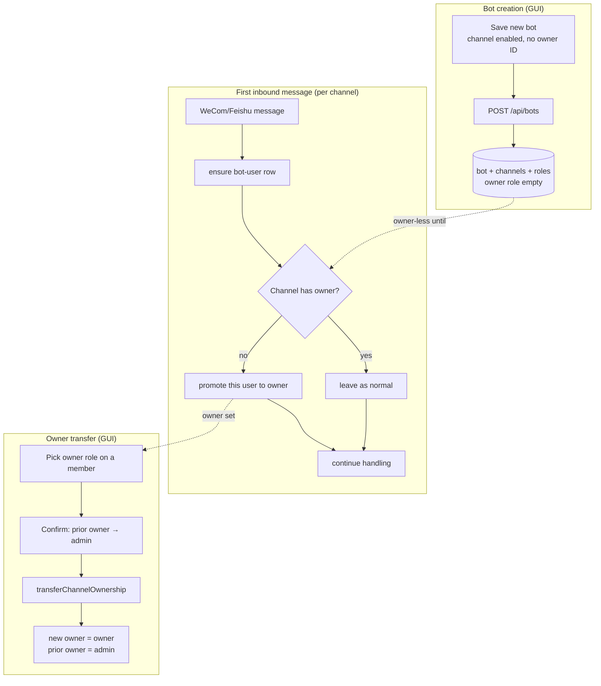

# Bot Owner Auto-Assignment and Transfer

## Goal Capsule

- **Objective:** Stop requiring an unknowable owner ID at bot creation, auto-promote each channel's first sender to that channel's owner, and let operators reassign a channel's owner to any existing member from the GUI.
- **Authority:** Product request from the bot-ownership stream; the per-channel ownership model, role/permission semantics, and storage schema stay unchanged.
- **Stop conditions:** A bot saves with channels enabled and no owner; the first sender on an owner-less channel becomes its owner; an operator can transfer a channel's owner to another member; all server/client tests pass.
- **Tail ownership:** Server service and ingestion layers own auto-assignment and transfer; the client owns the creation-form removal and the transfer UI.

---

## Product Contract

### Summary

Bot creation today demands an "initial owner user ID" per enabled channel — an encrypted Feishu/WeCom ID that is unknowable until the first inbound message. This plan removes that requirement, auto-promotes the first sender on each owner-less channel to that channel's owner, and adds an in-GUI owner transfer so an operator can reassign a channel's owner to any existing member (currently impossible: the owner is effectively immutable). The change is additive to the existing per-channel ownership model and needs no data migration.

### Problem Frame

The encrypted channel user ID (WeCom `open_userid`, Feishu `open_id`) is only observable inside the inbound message handlers, where the per-bot connection surfaces it. At bot-creation time the GUI has no way to know it, so the required "Initial owner user ID" field cannot be filled with a valid value. The fallback today is to leave the field blank and fail validation, or to enter a guessed ID that never resolves. Separately, once an owner is set it cannot be changed: the service enforces "no second owner per channel" on promotion and "cannot remove the last owner" on demotion, and the members UI disables the owner option entirely once a channel has one. The first-sender ID is already known to the system at first contact (the auto-add path creates the user as `normal`), so the owner role can be filled automatically at that moment instead of demanded prematurely.

### Actors

- A1. **GUI operator** — the trusted desktop user (system actor) who creates bots and manages members.
- A2. **Channel owner** — the member with role `owner` for a specific `(bot, channel)`; existing per-channel semantics unchanged.
- A3. **First sender** — the WeCom/Feishu user whose first inbound message to an owner-less channel triggers auto-owner promotion.

### Requirements

**Bot creation — remove the premature owner requirement**

- R1. A bot can be created and saved with one or both channels enabled and no owner assigned to any channel.
- R2. The bot creation form no longer collects or requires an owner user ID for any channel; the field and its validation are removed.
- R3. Saving a new bot no longer issues any owner-assignment request; enabled channels begin owner-less until a first sender or a GUI transfer sets an owner.

**Auto-owner on first contact**

- R4. When an inbound WeCom or Feishu message creates the first bot user for a channel that currently has no owner, that user is promoted to owner of that channel.
- R5. Auto-owner promotion is per-channel: the first sender on each channel becomes that channel's owner independently.
- R6. Auto-owner promotion fires only when the channel has no owner; it never displaces an existing owner and never blocks message handling.

**Owner transfer in the GUI**

- R7. From the bot members UI, an operator can reassign a channel's owner to any other existing member of that channel.
- R8. Transfer is atomic: the selected member becomes owner and the previous owner is demoted to admin in one operation, preserving exactly one owner per channel.
- R9. The existing owner-presence guards (reject a second owner, reject removing/demoting the last owner) remain in force for all non-transfer operations.

### Key Flows

- F1. **Create a bot without an owner**
  - **Trigger:** GUI operator saves a new bot with a channel enabled.
  - **Actors:** A1
  - **Steps:** The bot and its default channels/roles are created; no owner-assignment request is issued; the channel is owner-less.
  - **Covered by:** R1, R2, R3.
- F2. **Auto-owner on first inbound message**
  - **Trigger:** A WeCom/Feishu user sends the first message to a channel that has no owner.
  - **Actors:** A3, ingestion service
  - **Steps:** The user's bot-user row is ensured; the service detects the channel has no owner and promotes this user to owner; message handling continues uninterrupted.
  - **Covered by:** R4, R5, R6.
- F3. **Transfer channel ownership**
  - **Trigger:** GUI operator selects the owner role for a non-owner member of a channel.
  - **Actors:** A1
  - **Steps:** A confirm dialog states the current owner will be demoted; on confirm, the selected member becomes owner and the previous owner becomes admin atomically; the member list refreshes with exactly one owner.
  - **Covered by:** R7, R8, R9.

### Acceptance Examples

- AE1. **Covers R1–R3.** A new bot is saved with WeCom enabled and no owner ID entered; the bot is created and the WeCom channel has no owner.
- AE2. **Covers R4–R6.** The first WeCom sender becomes the WeCom owner; the first Feishu sender becomes the Feishu owner; a second WeCom sender remains `normal`. An owner-less channel that already received its first sender is not re-promoted by later senders.
- AE3. **Covers R7–R9.** An operator transfers WeCom ownership from member A to member B; afterward B is the only WeCom owner and A is an admin. A non-transfer attempt to add a second owner or demote the only owner is still rejected.

### Scope Boundaries

**In scope**

- Removing the creation-time owner ID requirement (form, validation, post-create assignment, i18n).
- Auto-promoting the first sender of an owner-less channel to owner, for both WeCom and Feishu.
- Atomic per-channel owner transfer from the members UI.

**Deferred to follow-up work**

- Authentication/authorization hardening on the bot member routes (they currently run unauthenticated with the system actor; this plan preserves that convention).
- Backfilling owners for existing owner-less channels beyond their next first-message or a GUI transfer.
- An opt-out toggle to disable auto-owner promotion per channel.

**Outside this product's identity**

- Changing the per-channel ownership model (e.g., to a single per-bot owner).
- Changing what the owner/admin permission bypass covers.
- Changing the bot/channel/role storage schema.

---

## Planning Contract

### Key Technical Decisions

- **KTD1. Auto-owner promotion is per-channel and fires only for owner-less channels at first inbound message.** (session-settled: user-approved — chosen over a single per-bot first-user owner: it matches the existing per-channel ownership model and keeps each channel independently administered.) The promotion reuses the existing first-contact user-ensuring path; it adds an "if no owner exists, set this user's role to owner" step, not a new ingestion concept.
- **KTD2. Remove the creation-time owner input entirely rather than keep it optional.** (session-settled: user-approved — chosen over an optional plaintext/encrypted field: the encrypted channel ID is unknowable before first contact, so an optional field carries no valid value and reintroduces the confusion.) Channels are designed to start owner-less — the migration that introduced per-channel ownership already supports owner-less channels.
- **KTD3. Owner reassignment is an atomic per-channel transfer invoked from the existing member role selector; the previous owner is demoted to admin.** (session-settled: user-approved — chosen over a dedicated "Transfer ownership" button: smallest change to the existing members UI and matches "assign owner to a specific user." Demote-to-admin preserves the prior owner's trusted status; an operator can later lower it to `normal`.)
- **KTD4. Transfer is a dedicated `transferChannelOwnership` service method that performs both role updates directly, not a relaxation of the existing `setMemberRole` owner-guards.** Keeping `ensureNoExistingChannelOwner` and `ensureAnotherChannelOwnerExists` intact for all other callers (including future channel-owner actors) preserves the one-owner invariant where it already protects normal flows; the transfer method owns its invariant by construction because it demotes the current owner in the same operation that promotes the new one.

### High-Level Technical Design

Three independent paths converge on the same per-channel owner role. Creation no longer writes an owner; the first sender fills an owner-less channel; the GUI can move the owner to another member.

### Assumptions / Constraints

- **No data migration.** Existing bots keep whatever owners they have; auto-owner only fills channels that are owner-less at first contact, and transfer only runs on operator action. Migrated bots that are owner-less today will receive an owner on their next first-message or via GUI transfer — no backfill is shipped with this plan.
- The auto-add paths for both channels already create the bot-user row before message handling proceeds; auto-owner promotion is layered onto that existing point and remains non-blocking (wrapped so a promotion failure never breaks the conversation).
- `better-sqlite3` operations are synchronous, so the two role updates inside `transferChannelOwnership` execute without an interleaving window; the one-owner invariant holds across the pair.
- The bot member routes continue to use the system actor for GUI-driven mutations, consistent with the existing convention.

### Sequencing

Server foundation first (transfer + auto-owner service methods), then the transfer route, then ingestion wiring for both channels, then the two client changes (creation-form removal, transfer UI). The client creation-form removal is independent of the server work and may land in parallel.

### System-Wide Impact

- **Ownership lifecycle.** Owner assignment moves from creation-time (manual, often invalid) to first-contact (automatic, correct) with a GUI override. The runtime meaning of owner — tool/skill/bash bypass and `/workspace` command authorization — is unchanged, so the first sender now also gains `/workspace` authority on their channel.
- **Permission boundaries.** Transfer runs as the system actor (GUI), matching existing member-management routes. The owner-presence guards are untouched for non-transfer paths, so the one-owner-per-channel invariant is preserved everywhere except the deliberately-atomic transfer.
- **Audit trail.** Auto-promotion and transfer both emit audit-log entries (`user_role_changed` / a transfer event), so the owner lifecycle remains auditable.

### Risks & Dependencies

| Risk | Severity | Mitigation |
|------|----------|------------|
| Auto-promotion races two simultaneous first-senders on an owner-less channel and assigns two owners. | Medium | The promotion checks for an existing owner and uses synchronous store updates; document that the check-then-set is not wrapped in a transaction and accept the narrow race, or wrap both in one transaction if the store exposes it. |
| Transfer demotes the wrong user if the current owner changed between UI render and confirm. | Low | The transfer method resolves the current owner at call time by `(bot, channel)`, not from the client-supplied previous owner; it always demotes whoever is owner when it runs. |
| Removing the creation owner field breaks a test or flow that depended on creation-time owner assignment. | Medium | Update `BotManagementPage` creation tests explicitly in the client unit; grep for `OwnerUserId` across client and i18n to catch stragglers. |
| A relayed/auto-forwarded message triggers auto-owner for an unintended first sender. | Low | Accepted; the operator can transfer ownership afterward. Out of scope to gate on sender trust. |
| WeCom ingestion has multiple user-ensuring call sites (bot service and resolver); promotion could be wired inconsistently. | Medium | Put the promotion in one bot-service method called from the message handlers, and verify both WeCom and Feishu handler paths invoke it. |

---

## Implementation Units

### U1. Add owner-transfer and auto-owner service methods

- **Goal:** Give `BotService` the two new capabilities every other unit depends on: atomic per-channel owner transfer, and idempotent auto-promotion of a channel's first user.
- **Requirements:** R4, R5, R6, R8, R9.
- **Dependencies:** None.
- **Files:**
  - `src/server/services/bot-service.ts`
  - `src/server/services/bot-service.test.ts`
- **Approach:**
  - Add `transferChannelOwnership(botId, channelKey, newOwnerChannelUserId, actor = systemActor())`: validate the bot and target member exist in the channel; resolve the channel's current owner (if any); if the target is already the owner, no-op; otherwise update the target's role to `owner` and the current owner's role to `admin` directly via the store, in the synchronous update pair; emit an audit-log entry naming both the promoted and demoted user. Do not call `setMemberRole` for the individual updates — that path enforces the guards this method intentionally bypasses (KTD4). The method preserves the one-owner invariant by construction.
  - Add `autoAssignOwnerIfAbsent(botId, channelKey, channelUserId)`: look up the channel's members; if any has `roleKey === 'owner'`, return; otherwise promote `channelUserId` to owner (resolve the user, set role to `owner` via the store or via `setMemberRole(..., systemActor())` which passes `ensureNoExistingChannelOwner` because none exists). Idempotent and safe to call on every message.
  - Keep `ensureNoExistingChannelOwner` and `ensureAnotherChannelOwnerExists` unchanged; they continue to guard `addMember`, `setMemberRole`, and `removeMember`.
- **Patterns to follow:** Existing member methods (`addMember`, `setMemberRole`) for bot/channel resolution, `systemActor()` default, and `auditLogger.log` calls; `BotValidationError` / `BotUserNotFoundError` for failure cases.
- **Test scenarios:**
  - Happy path: `transferChannelOwnership` on a channel with owner A and member B makes B owner and A admin; exactly one owner remains. Covers AE3.
  - Edge case: transferring to the current owner is a no-op (no role change, no audit entry or a benign one).
  - Edge case: transferring on an owner-less channel promotes the target to owner and demotes no one.
  - Error path: transferring to a user who is not a member of that channel throws `BotUserNotFoundError`.
  - Error path: transferring on an unknown channel or bot throws the existing not-found errors.
  - Happy path: `autoAssignOwnerIfAbsent` on an owner-less channel promotes the given user to owner. Covers AE2.
  - Idempotency: `autoAssignOwnerIfAbsent` on a channel that already has an owner leaves roles unchanged (a second sender stays `normal`).
  - Integration scenario: after auto-promotion, `getMemberRole` returns `owner` for the first sender and `normal` for a later sender.
- **Verification:** `npm run test:server -- src/server/services/bot-service.test.ts`; every server test imports `test-utils/test-env` first and uses an isolated store.

### U2. Expose the owner-transfer API route

- **Goal:** Give the client a transfer endpoint that calls the new service method.
- **Requirements:** R7, R8.
- **Dependencies:** U1.
- **Files:**
  - `src/server/routes/bots.ts`
  - `src/server/routes/bots.test.ts`
- **Approach:**
  - Add `POST /api/bots/:id/members/:channelUserId/transfer-ownership?channel=<wecom|feishu>`, matching the existing member-route shape. The path `:channelUserId` identifies the new owner.
  - Validate `channel` is `wecom` or `feishu` (400 otherwise), the bot exists (404), and the target member exists in that channel (404 with `BotUserNotFoundError`). Call `botService.transferChannelOwnership(botId, channel, channelUserId, systemActor())` and respond `{ members: botService.listMembers(botId) }` (or the shape the existing role-update route returns) so the client can refresh in one round trip.
  - Keep the existing `PUT /api/bots/:id/members/:channelUserId/role` route unchanged; it still rejects promote-to-owner-when-owner-exists for non-transfer callers.
- **Patterns to follow:** Existing `POST /api/bots/:id/members` and `PUT .../role` handlers for validation, `systemActor()` usage, and response shapes; `.js` extension imports.
- **Test scenarios:**
  - Happy path: a transfer request returns 200 and the refreshed member list with the new owner and demoted prior owner.
  - Error path: invalid `channel` query returns 400.
  - Error path: unknown bot returns 404.
  - Error path: target user not in the channel returns 404.
  - Integration scenario: after a transfer, a follow-up `PUT .../role` attempting to add a second owner is still rejected (guards intact). Covers R9.
- **Verification:** `npm run test:server -- src/server/routes/bots.test.ts`.

### U3. Wire auto-owner promotion into both ingestion paths

- **Goal:** Make the first sender of an owner-less channel its owner, for WeCom and Feishu, without blocking message handling.
- **Requirements:** R4, R5, R6.
- **Dependencies:** U1.
- **Files:**
  - `src/server/services/wecom-bot-service.ts`
  - `src/server/services/feishu-bot-service.ts`
  - `src/server/services/wecom-bot-service.test.ts`
  - `src/server/services/feishu-bot-service.test.ts`
- **Approach:**
  - In `wecom-bot-service.ts`, after the existing `ensureBotUser`/user-tracking calls in both `handleTextMessage` and `handleMediaMessage`, call `botService.autoAssignOwnerIfAbsent(botId, 'wecom', wecomUserId)` wrapped in a try/catch that logs via `diagLog` on failure (mirroring the fire-and-forget pattern already used by the resolver calls). Resolve `botId` with the existing `getBotIdForWorkspace` helper.
  - In `feishu-bot-service.ts`, make the same call in `createDispatchHandler` after `ensureBotUser(connection.botId, 'feishu', feishuUserId)`, using `connection.botId` and the same non-blocking wrapper.
  - Because `autoAssignOwnerIfAbsent` is idempotent and no-ops once an owner exists, calling it on every message is safe; promotion happens exactly once per owner-less channel.
- **Patterns to follow:** Existing `ensureBotUser` private methods and `.catch(() => {})` / try-catch wrapping for non-critical post-processing in the message handlers.
- **Test scenarios:**
  - Happy path: a WeCom text message from a new user to an owner-less channel promotes that user to owner. Covers AE2.
  - Happy path: the same for a Feishu DM to an owner-less channel.
  - Idempotency: a second WeCom message from a different user leaves the first user as owner and the second as `normal`.
  - Non-blocking: if `autoAssignOwnerIfAbsent` throws, the message is still handled and a reply is sent (simulate by forcing the store to reject and asserting the handler completes).
  - Edge case: a channel that already has an owner (e.g., set via GUI) is unchanged by inbound messages.
  - Edge case: if no bot is bound to the workspace, message handling continues without error (existing guard).
- **Verification:** `npm run test:server -- src/server/services/wecom-bot-service.test.ts src/server/services/feishu-bot-service.test.ts`.

### U4. Remove the creation-time owner requirement from the GUI

- **Goal:** Let a bot be created with channels enabled and no owner, by removing the owner-ID field, its validation, the post-create assignment, and the now-unused strings.
- **Requirements:** R1, R2, R3.
- **Dependencies:** None (independent of U1–U3).
- **Files:**
  - `src/client/components/bot-form-utils.ts`
  - `src/client/components/BotChannelsSection.tsx`
  - `src/client/components/BotManagementPage.tsx`
  - `src/client/i18n/en/settings.json`
  - `src/client/i18n/zh-CN/settings.json`
  - `src/client/components/BotManagementPage.test.tsx`
  - `src/client/components/bot-form-utils.test.ts` (if present)
- **Approach:**
  - In `bot-form-utils.ts`: remove `wecomOwnerUserId` and `feishuOwnerUserId` from `BotFormData`, `emptyForm`, and `botToForm`; remove the two `!isEditing && !…OwnerUserId.trim()` checks from `validateBotForm`. `buildCreateBotInput` already omits owner, so no change there.
  - In `BotChannelsSection.tsx`: remove the two `{!originalBot && (…)}` owner-input blocks (WeCom and Feishu) and any `wecomOwnerUserId`/`feishuOwnerUserId` prop usage.
  - In `BotManagementPage.tsx` `handleSaveBasic`: remove both post-`createBot` `addMember(..., role: 'owner')` blocks (the `if (draft.wecomEnabled && draft.wecomOwnerUserId.trim())` and Feishu counterpart). `addMember` may become unused in this handler — keep it in the store destructure only if still used elsewhere (e.g., the transfer UI in U5 does not use `addMember`), otherwise remove it to satisfy `noUnusedLocals`.
  - Remove now-unused i18n keys from both locales: `bots.wecomOwnerUserId`, `bots.feishuOwnerUserId`, `bots.ownerUserIdHint`, `bots.wecomOwnerUserIdPlaceholder`, `bots.wecomOwnerUserIdRequired`, `bots.feishuOwnerUserId`, `bots.feishuOwnerUserIdPlaceholder`, `bots.feishuOwnerUserIdRequired` (verify exact keys with a grep before deleting).
- **Patterns to follow:** Functional `setState`, `useTranslation('settings')`, `cn()` Tailwind composition, and the existing form-section component structure.
- **Test scenarios:**
  - Happy path: a new bot with WeCom enabled saves successfully with no owner ID entered (the old "creates a bot and adds initial channel owners" test is updated to assert no owner-assignment request is made). Covers AE1.
  - Happy path: `validateBotForm` returns `null` for a creation form with channels enabled and no owner ID.
  - Edge case: editing an existing bot still validates credential requirements and ignores the removed fields.
  - Error path: existing credential-required validations (e.g., `wecomBotIdRequired`) still fire.
- **Execution note:** This is the "stop the bleeding" change; prefer confirming the creation flow end-to-end (create bot → send first message → owner auto-assigned) once U3 also lands.
- **Verification:** `npm run test:client -- BotManagementPage bot-form-utils BotChannelsSection` and `npm run lint`.

### U5. Add owner transfer to the members UI

- **Goal:** Let an operator reassign a channel's owner to any other member from the bot members tab.
- **Requirements:** R7, R8, R9.
- **Dependencies:** U2 (transfer endpoint), U1.
- **Files:**
  - `src/client/stores/bot-store.ts`
  - `src/client/components/BotUserList.tsx`
  - `src/client/i18n/en/settings.json`
  - `src/client/i18n/zh-CN/settings.json`
  - `src/client/components/BotUserList.test.tsx`
- **Approach:**
  - In `bot-store.ts`: add a `transferOwnership(botId, channel, newOwnerChannelUserId)` action that `POST`s to the transfer endpoint, then refreshes members (the endpoint returns the refreshed list, so prefer using its response over a second fetch).
  - In `BotUserList.tsx`: for non-owner members, enable the `owner` `SelectItem` even when `channelHasOwner(member.channelKey)` is true (remove the `disabled={channelHasOwner(...)}` on that item). When the operator selects `owner` for a non-owner member in a channel that already has an owner, show a confirmation dialog stating the current owner will be demoted to admin; on confirm, call `transferOwnership`. Selecting `owner` when the channel is owner-less can go through the existing role-update path (no demotion). The owner row continues to render the static Crown badge; the owner cannot demote themselves to nothing (the existing last-owner guard still applies on the server, and the client should offer only `admin`/`normal`+transfer affordances on the owner row consistent with prior behavior).
  - Add i18n keys for the confirm dialog title, body (referencing the prior owner becoming admin), and confirm/cancel buttons, in both locales.
  - Keep `channelHasOwner`/`channelOwnerCount` helpers; they still drive the owner-assigned/ownerless badges and the last-owner removal confirmation.
- **Patterns to follow:** Existing role `<Select>` and `handleRemove` confirm-dialog patterns in `BotUserList`; Zustand store actions mirroring `setMemberRole`/`removeMember`.
- **Test scenarios:**
  - Happy path: selecting `owner` on a non-owner member in a channel with an owner opens the confirm dialog; confirming calls `transferOwnership` and refreshes the list. Covers AE3.
  - Happy path: selecting `owner` on a member in an owner-less channel assigns owner without a demotion dialog.
  - Edge case: the owner row still shows the Crown badge and does not expose a self-demotion-to-nothing option.
  - Error path: a failed transfer surfaces the store error inline and leaves roles unchanged.
  - Integration scenario: after transfer, the list shows exactly one owner with the Crown badge and the prior owner as admin.
- **Verification:** `npm run test:client -- BotUserList` and `npm run lint`.

---

## Verification Contract

| Gate | Command | When required |
|------|---------|---------------|
| Lint | `npm run lint` | After every unit; before merge. |
| Server tests | `npm run test:server` | After U1, U2, U3. Must include `bot-service`, `bots` route, and both ingestion service tests. Every server test imports `test-utils/test-env` first and uses an isolated store. |
| Client tests | `npm run test:client` | After U4 and U5. Must include `BotManagementPage`, `BotUserList`, and form-util tests. |
| Browser tests | `npm run test:browser` | After U4 and U5 if existing bot-settings browser tests cover the flows. |
| Smoke | `npm run tauri:dev` (or dev client + server) | Before declaring done: create a bot with no owner, send a first WeCom/Feishu message, confirm the sender auto-becomes owner, then transfer ownership to another member in the UI. |

**Behavioral evaluation:** The critical new gates are the auto-owner idempotency test (U3 — second sender stays `normal`) and the transfer atomicity test (U1/U2 — exactly one owner after transfer, guards still reject a second owner on the normal path).

---

## Definition of Done

### Global

- A bot saves with channels enabled and no owner (R1–R3); the first sender of an owner-less channel becomes its owner (R4–R6); an operator can transfer a channel's owner to another member (R7–R9).
- The owner-presence guards still reject a second owner and the removal of the last owner on every non-transfer path.
- `npm run lint`, `npm run test:server`, `npm run test:client`, and `npm run test:browser` (where applicable) pass.
- `CHANGELOG.md` has an entry under `Unreleased` → `Changed` (and `Fixed` if framed as correcting the broken creation flow) describing the new owner lifecycle.
- No `OwnerUserId` references remain in client form code or i18n; the creation-time owner strings are removed from both locales.
- Any dead code or abandoned-attempt code introduced during implementation is removed from the diff.

### Per-unit

- U1: `transferChannelOwnership` and `autoAssignOwnerIfAbsent` exist, are tested, and preserve the one-owner invariant.
- U2: `POST /api/bots/:id/members/:channelUserId/transfer-ownership` works and the existing role-update route still rejects second-owner promotion.
- U3: WeCom and Feishu first-message handlers auto-promote the first sender of an owner-less channel without blocking message handling.
- U4: The creation form has no owner field, validation passes without one, and no owner-assignment request fires on save.
- U5: The members UI transfers ownership atomically with a confirm step; the list always shows exactly one owner per channel after transfer.
