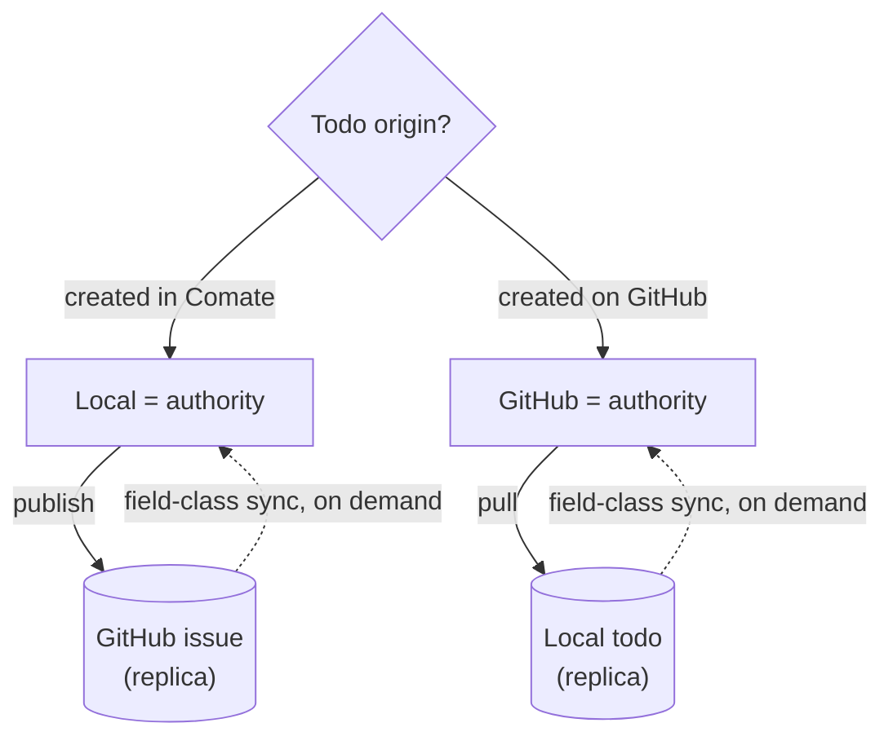
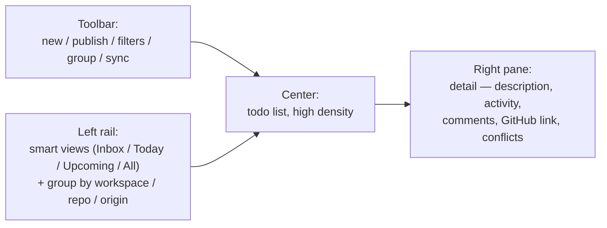
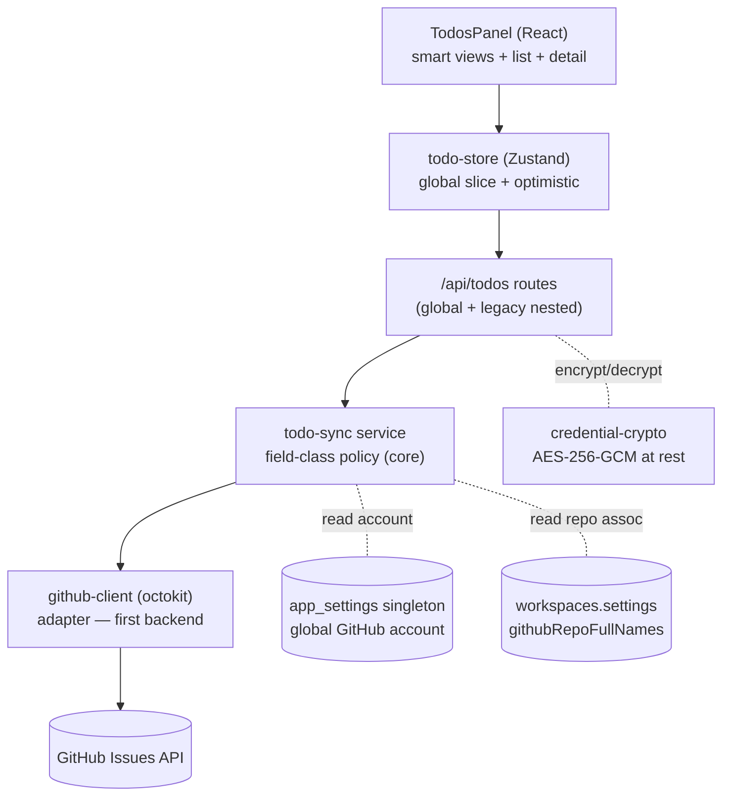
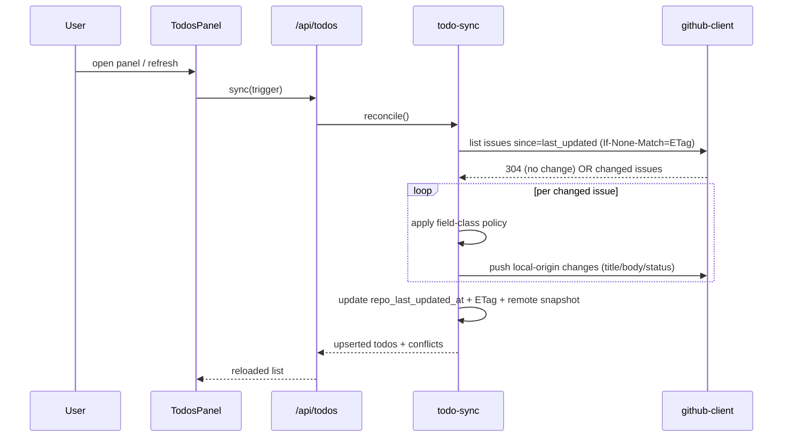
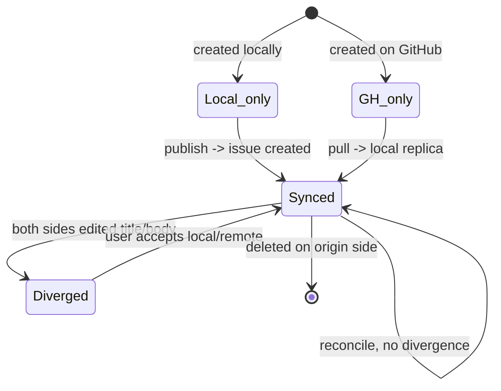

# Top-Level Todos Panel & GitHub Issues Sync - Plan

## Goal Capsule

- **Objective:** Elevate Todos from a cramped workspace-sidebar list into a first-class, top-level, complete task-manager panel; make todos global, shareable entities that sync with GitHub Issues for team collaboration.
- **Product authority:** Owns the top-level Todos panel and GitHub Issues sync as one coherent unit. No surrounding work is active scope.
- **Execution:** `code` — consume with `ce-work` or `/goal`; work the U-ID units in dependency order against the Verification Contract and Definition of Done.
- **Stop conditions:** All R1–R18 implemented and traced; AE1–AE6 green; migration non-lossy; no token logged or returned in any response; field-class sync non-lossy; legacy workspace routes still work.
- **Open blockers:** None. GitHub auth method resolved (KTD1); remaining items are deferred-to-implementation details.

---

## Product Contract

> Product Contract unchanged — this enrichment adds HOW (planning, units, verification) without altering the WHAT. R/A/F/AE IDs preserved.

### Summary

A first-class, top-level Todos panel that replaces the cramped workspace-sidebar list with a complete task-manager experience — smart views (Inbox / Today / Upcoming) plus groupings by workspace, repository, and origin. Todos become global, shareable entities that sync to GitHub Issues for team collaboration: origin-anchored so the creating side stays authoritative, with field-level sync (comments merge, status accepts the remote, structural fields surface conflicts) over a pluggable backend seam that later backends can reuse.

### Problem Frame

Todos today are a minor, hidden feature. `TodoList` (`src/client/components/TodoList.tsx`) is mounted as a tab inside the workspace Sidebar (`src/client/components/Sidebar.tsx`), strictly scoped to one workspace: the data model has `workspace_id NOT NULL` (`src/server/storage/sqlite-store.ts`), the store is keyed `todosByWorkspace` (`src/client/stores/todo-store.ts`), and routes nest under `/api/workspaces/:id/todos` (`src/server/routes/todos.ts`). There is no global or cross-workspace view, and the feature deliberately lacks due dates, labels, priorities, or tags.

Two pains drive this work. First, the surface shows too little — a sidebar widget cannot carry the information density of a real task manager, and todos are buried one workspace deep with no way to see everything at once. Second, todos are isolated: there is no way to share a todo with a team or let collaborators act on it. No GitHub integration exists anywhere in app-authored code (the only `github` references are plugin-marketplace source descriptors; a vendored third-party module under `src/server/vendor/vercel-skills/` reads `GITHUB_TOKEN` for unrelated skill-fetch rate-limiting). The cost is a personal, siloed list that neither rises to first-class status nor participates in team work.

### Key Decisions

- **Origin-anchored ownership.** Each todo's creating side is its source of truth; sync flows origin → replica. A locally-created todo is locally authoritative and publishes to a GitHub issue; a GitHub-created issue is GitHub-authoritative and pulls to a local todo. (session-settled: user-directed — chosen over full two-way sync and over one-way publish/pull: avoids conflict complexity while keeping collaboration real.)
- **Field-class sync policy.** Sync behavior is partitioned by field class, not one global rule — comments merge append-only both ways; status/labels/assignee accept the remote and mirror locally; title/body are origin-wins with remote divergence surfaced for review. This is how Linear and Unito actually behave. (session-settled: user-directed — chosen over pure origin-wins and over full three-way merge: the pragmatic middle that makes collaboration real without clobbering edits or over-engineering.)
- **Global todos with soft workspace link.** Todos are global first-class entities; workspace (and session) become optional soft references used for grouping and filtering, not ownership. This unifies local and GitHub-origin todos under one model. (session-settled: user-directed — chosen over keeping per-workspace data with a top-level aggregation layer: avoids a split model where GitHub-origin todos are a special case.)
- **Global GitHub account + workspace-linked repositories.** One app-wide GitHub account; each workspace associates one or more of its repositories; a todo created in a workspace defaults its publish target to that workspace's linked repository (overridable). (session-settled: user-directed — chosen over a flat all-repos list and per-todo repo selection: matches the workspace ≈ project ≈ repository intuition.)
- **On-demand sync (panel-open + manual refresh).** No background polling or inbound-webhook relay in v1. Comate is a desktop app with no public endpoint to receive webhooks; on-demand sync is zero-infrastructure and accepts minute-level latency. (session-settled: user-directed — chosen over background polling and a webhook relay: zero infra for v1.)
- **Smart-views task-manager layout.** Left rail of smart views (Inbox / Today / Upcoming / All) plus groupings by workspace, repository, and origin; center list; right detail pane. (session-settled: user-directed — chosen over a master-detail list, a kanban board, and a list⇄board toggle: the most complete task-application feel and the richest information density.)
- **First-class top-level placement.** "Top-level Todos" means a navigation entry that occupies the main view — a first-class surface like a workspace, not a dismissable overlay like Settings. (session-settled: user-approved — proposed with the tradeoff surfaced; confirmed in scope review.)

### Requirements

**Top-level panel & navigation**

- R1. A top-level "Todos" entry in app navigation opens a full main-view Todos panel; the current workspace-sidebar Todos tab is removed (the panel replaces it, not duplicates it).

**Global todo model & migration**

- R2. Todos are global entities, not bound to a single workspace; a todo may optionally reference one or more workspaces and/or a session as soft context for grouping and filtering.
- R3. Existing per-workspace todos migrate to the global model on upgrade; the former workspace binding becomes a soft workspace reference. Migration is one-way and non-lossy.
- R4. The "start a chat session from a todo" capability is preserved; for a todo with no workspace reference, the user selects a target workspace at spawn time.

**Task-manager experience**

- R5. The panel offers smart views — Inbox (default landing for new and unprocessed todos), Today, Upcoming, All — driven by a due-date field newly added to todos.
- R6. The panel supports grouping and filtering by workspace, by linked repository, and by origin (local vs each connected server backend).
- R7. Each todo row shows high information density (status, origin, workspace/repo tags, assignee, due date, sync state); selecting a todo opens a detail view with description, collaborator activity, comments, the GitHub link, and any conflict notices.

**GitHub Issues sync**

- R8. A single global GitHub account connection is configured app-wide; each workspace may associate one or more repositories; a todo created in a workspace defaults its publish target to the linked repository (overridable).
- R9. Sync follows origin-anchored ownership: a locally-created todo is locally authoritative and can be published to a GitHub issue; a GitHub-origin issue is GitHub-authoritative and can be synced to a local todo.
- R10. For each linked todo, field-class sync applies: comments merge append-only both ways; status, labels, and assignee accept the remote change and mirror locally; title and body are origin-wins.
- R11. Structural-field conflicts are non-lossy: when both origin and remote edited a title or body since the last seen snapshot, the panel surfaces an accept-local / accept-remote choice rather than auto-resolving.
- R12. Sync is on-demand: it runs when the Todos panel opens and on manual refresh; v1 has no background polling and no inbound-webhook relay.
- R13. GitHub connection secrets (access **and refresh** tokens) are stored encrypted at rest via `credential-crypto`, held only in a single in-process holder cleared on shutdown/disconnect/refresh, never logged, and never returned in any response shape; device flow runs direct-to-GitHub over HTTPS with the verification URI echoed verbatim. Issue operations are scoped to the configured account's accessible repositories.

**Pluggable backend seam**

- R14. The GitHub adapter is the first instance of a pluggable backend seam; the sync logic is backend-agnostic so additional server backends can be added later through the same adapter contract. No second backend is implemented in v1.

**Migration & security guarantees**

- R15. Deleting a workspace clears the soft workspace link on its todos (sets `workspace_id = NULL`); it never destroys global todos that only soft-reference it.
- R16. GitHub issue content (body, comments, assignee names, labels) rendered in the panel is sanitized; no render path for synced content bypasses sanitization.
- R17. Todos synced from private repositories are not surfaced in cross-workspace/global aggregations without an explicit per-todo affordance; private repo names are hidden by default in the association UI.
- R18. The connection exposes token type and expiry; Disconnect always clears local state and best-effort revokes at GitHub (App token via the applications API; PAT via a deep link for manual revocation).

#### Field-class sync policy

| Field class | Fields | Sync behavior |
|---|---|---|
| Discussion | comments | Append-only, both directions; never conflicts |
| Collaborative state | status (open/closed), labels, assignee | Accept remote, mirror locally (newest wins) |
| Structural | title, body | Origin-wins; remote divergence surfaced for review (R11) |

#### Panel layout

### Actors

- A1. The Comate user (todo owner / local actor) — creates, edits, and publishes todos; the local origin authority for locally-created todos.
- A2. GitHub collaborators — teammates who act on synced GitHub issues (close, comment, reassign, edit title/body); their changes flow back to the owner's Comate via field-class sync.
- A3. GitHub (server backend) — source of truth for GitHub-origin issues; receives published local-origin todos; serves changes through its Issues API on each on-demand sync.

### Key Flows

- F1. Publish a local todo to GitHub
  - **Trigger:** User publishes a locally-owned todo.
  - **Actors:** A1, A3
  - **Steps:** Validate a target repository (default to the workspace's linked repo, else user-selected); create a GitHub issue from the todo; record the repo/issue number and a last-seen remote snapshot on the todo; mark origin = local.
  - **Outcome:** The todo is linked to a GitHub issue; local stays authoritative. **Covers R8, R9.**
- F2. Pull a GitHub issue into Comate
  - **Trigger:** User pulls an issue from a configured repository (or it appears on sync).
  - **Actors:** A1, A3
  - **Steps:** Create a local todo from the issue; record origin = GitHub and the last-seen remote snapshot; soft-link a workspace if the repository is workspace-associated.
  - **Outcome:** A local replica todo exists; GitHub stays authoritative. **Covers R9, R14.**
- F3. On-demand reconcile (panel open / manual refresh)
  - **Trigger:** User opens the Todos panel or clicks refresh.
  - **Actors:** A1, A2, A3
  - **Steps:** For each linked todo, fetch remote changes since the last-seen snapshot; apply field-class policy (comments append, status/labels/assignee mirror, structural fields compare against baseline); push local-origin changes outward; update the last-seen snapshot.
  - **Outcome:** Both directions reconciled without background work. **Covers R10, R12.**
- F4. Structural-field conflict review
  - **Trigger:** Both origin and remote edited title or body since the last sync.
  - **Actors:** A1, A2
  - **Steps:** Surface the divergence in the detail view; present accept-local / accept-remote; on choice, update the field and reset the baseline.
  - **Outcome:** No silent data loss; the user decides. **Covers R11.**

### Acceptance Examples

- AE1. **Covers R10.** Given a locally-owned todo published as issue #88, when a teammate closes #88 on GitHub, then on next on-demand sync the local todo status mirrors to done (with an activity entry naming the teammate).
- AE2. **Covers R10.** Given the same linked todo, when the owner adds a local comment and a teammate adds a GitHub comment, then on sync both comments appear on both sides; neither is lost.
- AE3. **Covers R11.** Given a locally-owned todo whose title the owner edited locally and a teammate also edited on GitHub, then on sync the panel surfaces an accept-local / accept-remote choice instead of overwriting either side.
- AE4. **Covers R8, R9.** Given a todo created in the `webapp` workspace (repo `myorg/webapp` linked), when the user publishes it, then an issue is created in `myorg/webapp`, the link and a remote snapshot are recorded, and origin = local.
- AE5. **Covers R12.** Given a teammate closed an issue while Comate was closed, when the owner opens the Todos panel, then panel-open sync pulls the change with no manual step beyond opening the panel.
- AE6. **Covers R3.** Given a pre-existing todo bound to the `core` workspace before upgrade, after migration it appears in the global panel tagged `core`, with status and text intact.

### Success Criteria

- The Todos panel reads as a complete task manager (smart views + groupings + rich detail), resolving the "too little information visible" pain.
- A locally-owned todo published to GitHub reflects teammate activity (closes, comments) back in Comate without manual export/import.
- No silent data loss: structural-field divergences are surfaced, never auto-clobbered.
- Existing todos survive the global-model migration intact.
- Adding a second server backend later requires no change to core sync logic — only a new adapter.

### Scope Boundaries

**Deferred for later (v2+)**

- Background polling and an inbound-webhook relay server (real-time push).
- A second server-backend implementation — only the adapter seam ships now (e.g., GitLab or Jira later).
- GitHub PRs, Projects, milestones, and releases (Issues only).
- Multiple GitHub accounts (one global account).
- Notifications and reminders — smart views are not reminders.
- OS keychain credential storage — reuse `credential-crypto` now (KTD3); keychain is the only control that materially raises the bar and remains a future hardening option (the file-based AES key is colocated with `data.db`, transparent to directory-level access and to Windows hosts).

**Outside this product's identity**

- Real-time collaborative co-editing of a todo's body (CRDT). Sync is asynchronous; co-editing is a different problem.

**Deferred to follow-up work (not this plan)**

- Remediating the repo's existing plaintext secret inconsistency (e.g. `providers.auth_token`, plaintext workspace secrets). This plan encrypts only the new GitHub token (KTD3); widening encryption is a separate, repo-wide security pass.

### Dependencies / Assumptions

- Net-new capability: no app-authored GitHub integration exists today. The only `github` references in the repo are plugin-marketplace source descriptors; vendored third-party code under `src/server/vendor/vercel-skills/` reads `GITHUB_TOKEN` for unrelated skill-fetch rate-limiting and is not an issues integration.
- Assumption: GitHub rate limits accommodate on-demand sync at panel-open frequency using authenticated REST with incremental (`updated_at` / `since`) fetches and ETag short-circuits.
- Assumption: the existing four-status local model (pending / done / discard / did-but-need-verify) is retained; GitHub open/closed maps onto it, and did-but-need-verify remains a local-only state.
- Operational dependency: the author registers a GitHub App (Client ID, Device Flow enabled) and ships the Client ID with the app; end-users install the app on their repositories (KTD1).

### Outstanding Questions

- GitHub auth method → **Resolved**: OAuth Device Flow + GitHub App (primary), PAT paste (fallback). See KTD1.
- i18n namespace → **Resolved**: dedicated `todos` namespace. See KTD7.
- Data-migration approach → **Resolved**: rebuild pattern (RENAME→CREATE→INSERT→DROP), schema version 7. See KTD4.
- Sync pagination / rate-limit strategy → **Resolved**: `since` + ETag + paginate, octokit throttling. See KTD8 and U5.
- Exact field mapping (status ↔ state/labels, assignee/label granularity) → **Deferred to implementation** (U5): the field-class policy is fixed; per-field mapping is settled against the live API during implementation.

### Sources / Research

**Code (current state)**

- `src/client/components/TodoList.tsx`, `src/client/components/Sidebar.tsx` — refactor target, workspace-sidebar tab.
- `src/client/components/TaskPanel.tsx` — distinct ephemeral SDK task tracker; do not confuse with the refactor target.
- `src/client/stores/todo-store.ts`, `src/server/models/todo.ts`, `src/server/storage/sqlite-store.ts`, `src/server/routes/todos.ts` — per-workspace data model and nested routes.
- `src/client/App.tsx`, `src/client/components/HeaderToolbar.tsx`, `src/client/components/ScheduledTasksPanel.tsx` — existing top-level overlay-panel pattern and the global-route precedent.
- `src/server/utils/credential-crypto.ts`, `src/server/utils/bot-channel-crypto.ts` — existing AES-256-GCM encryption-at-rest precedent (reused by KTD3).
- `src/server/routes/scheduled-tasks.ts`, `src/server/routes/scheduled-tasks.test.ts` — double-mount + `id?` detection pattern and mock-handler route-test template.

**Prior plans**

- `docs/plans/2026-05-29-008-feat-workspace-todos-plan.md` — original workspace-scoped TodoList (now being elevated).
- `docs/plans/2026-05-19-005-feat-task-todo-panel-plan.md` — the ephemeral TaskPanel (different surface).

**Institutional learnings (`docs/solutions/`)**

- `docs/solutions/conventions/use-isolated-test-database-for-comate.md` — load-bearing test-isolation convention (U1, all server tests).
- `docs/solutions/integration-issues/wecom-update-template-card-5s-window.md` — methodology: assert on payload structure + ordering, not just call occurrence (U4, U5).

**External research**

- Linear — GitHub Issues Sync (bidirectional, field-class): `https://linear.app/changelog/2023-12-14-github-issues-sync`
- Unito — per-field directionality guide: `https://guide.unito.io/a-guide-to-unitos-github-integration`
- `mitsuhiko/gh-issue-sync` — three-way merge, skip-on-conflict: `https://github.com/mitsuhiko/gh-issue-sync`
- GitHub webhook events (`changes.from`/`to`) and Issues REST API (`updated_at`, `since`, ETag/`If-None-Match`, `X-RateLimit-*`): `https://docs.github.com/en/webhooks/webhook-events-and-payloads`, `https://docs.github.com/rest/issues/issues`, `https://docs.github.com/rest/guides/best-practices-for-using-the-rest-api`
- OAuth Device Flow + GitHub Apps (permissions, token refresh): `https://docs.github.com/en/apps/creating-github-apps/authenticating-with-a-github-app/generating-a-user-access-token-for-a-github-app`
- `@octokit/rest`, `@octokit/auth-oauth-device`, `@octokit/plugin-throttling`, `@octokit/plugin-retry`: `https://github.com/octokit/octokit.js/blob/main/README.md`

---

## Planning Contract

### Key Technical Decisions

- **KTD1. GitHub auth — OAuth Device Flow + GitHub App (primary), fine-grained PAT paste (fallback).** Device Flow needs no client secret and no redirect URL, fitting a Tauri desktop app with no inbound endpoint; a GitHub App grants the granular Issues Read & Write permission (vs an OAuth App's blunt `repo` scope). PAT paste covers users whose org blocks the app install. The GitHub App's **refresh token** is a co-equal, longer-lived secret and gets the same encryption, redaction, and no-log guarantees as the access token (R13). (session-settled: user-directed — chosen over PAT-first/v1-only: refreshable short-lived tokens and the best team UX while still fitting the no-public-endpoint desktop constraint.)
- **KTD2. HTTP client — `@octokit/rest` + `@octokit/auth-oauth-device` + `@octokit/plugin-throttling` + `@octokit/plugin-retry` in the Node sidecar.** Pagination (`Link` header), secondary-rate-limit handling, transient-5xx retry, device-flow polling, and expiring-token refresh are the bulk of the sync risk surface; reimplementing them in raw `fetch` is where bugs concentrate. The dependency runs in the Node sidecar — not the Vite client bundle — so it does not inflate the shipped UI; the sidecar already vendors `@anthropic-ai/claude-agent-sdk` and `better-sqlite3`. (session-settled: user-approved — proposed over native fetch with the dep-introduction tradeoff surfaced; user assented in scope review.)
- **KTD3. Credential storage — reuse `credential-crypto` (AES-256-GCM) at rest; redact in every response; bound the in-memory lifetime.** Honest threat model: the AES key lives in `getStorageDir()/credential.key` (mode 0600), colocated with `data.db`, so this defends only against DB-row-only exfiltration (a DB-only backup, a SQLite-inspection tool that does not also read the key file). It does **not** stop any attacker with storage-directory read access (user-level malware, full-disk access, directory-level backup), and the 0600 mode is a no-op on Windows. OS keychain is the only control that materially raises the bar and remains deferred (Scope Boundaries). The decrypted token lives in a single module-level holder in `github-client`, zeroed on shutdown, disconnect, and refresh (wired into the `server-main.ts` shutdown hook), and is never written to disk outside the encrypted `app_settings` row. Every GitHub error is sanitized through a `redactGithubError` helper before it reaches any logger or response. (session-settled: user-approved — proposed over an OS-keychain Tauri plugin to match the existing bot-secret encryption precedent; user assented.)
- **KTD4. Data-model migration — rebuild pattern to make `workspace_id` nullable, following `migrateToUnifiedSchema` (not `migrateTodoDetailColumn`).** SQLite cannot relax a `NOT NULL` constraint in place, so the migration uses a RENAME→CREATE→INSERT→DROP rebuild. The safe precedent is `migrateToUnifiedSchema` (`sqlite-store.ts:812-1403`): file backup, the whole rebuild wrapped in an explicit `transaction()`, the version bump to 7 **inside** the transaction, row-count verification, and re-throw on failure so construction aborts. The bare-`exec` `migrateTodoDetailColumn` shape is explicitly **not** the model — it is ungated, unbacked, and swallows errors. Additional steps: the version-7 gate keys on **table shape** (`PRAGMA table_info`: `workspace_id.notnull = 0` and the new columns present), never on row count, so fresh/empty DBs still get the new shape; the INSERT SELECT names columns explicitly (never `SELECT *`); indexes are re-created from `PRAGMA index_list` at run time; and the migration runs **last** in the constructor (after `migrateBrowserAuditSchema`). New columns (`origin`, `due_date`, `repo_full_name`, `issue_number`, `remote_snapshot_json`, `remote_updated_at`, `last_synced_at`, `assignee`, `labels_json`) are defined inline in the rebuilt CREATE; existing `workspace_id` values carry over as soft links (R3).
- **KTD5. Global account storage — new singleton-row `app_settings` table; per-workspace repo association on `WorkspaceSettings`.** No app-global settings store exists today. A singleton-row table (`id = 1`) mirrors the `bot_migration_state` / `feishu_bot_binding` precedent and holds the encrypted GitHub connection + device-flow token. Per-workspace repo association extends `WorkspaceSettings` with `githubRepoFullNames: string[]` on the existing `workspaces.settings` JSON blob.
- **KTD6. Route strategy — double-mount the todo router at `/api/todos` (global) and `/api/workspaces/:id/todos` (legacy).** `scheduledTasksRoutes` already mounts both ways using `mergeParams: true` and optional `(req.params.id?)` detection; the new global `todoRoutes` follows the same shape so the existing `todo-store.ts` fetch URLs keep working through and after migration.
- **KTD7. i18n — dedicated `todos` namespace.** Exact `scheduledTasks` precedent: add `src/client/i18n/{en,zh-CN}/todos.json`, register both locales in `src/client/i18n/index.ts`, select with `useTranslation('todos')`.
- **KTD8. Pluggable backend seam — field-class policy in core, GitHub as the first adapter.** The sync engine (`todo-sync` service) owns the field-class policy table and the origin-anchored reconcile loop; `github-client` is the first adapter behind a backend-agnostic contract (`listChanged`, `create`, `update`, `fetchComments`, `addComment`). A later backend implements the same contract with no core change. (session-settled: user-directed — instantiates the brainstorm's origin-anchored ownership and pluggable-backend Key Decisions; the field-class policy stays in core so a second backend needs no core changes.)

### High-Level Technical Design

**Component topology** — the panel and store talk to global routes; the sync service owns policy; the GitHub client is the lone adapter.

**On-demand reconcile (F3)** — ETag short-circuits the no-change case; per-issue field-class policy drives the upsert/push.

**Todo sync lifecycle** — origin is set at creation; divergence is surfaced, never auto-clobbered.

### System-Wide Impact

- **Data lifecycle:** a one-way schema migration converts workspace-bound todos to global entities (KTD4). Risk is data loss; mitigated by the rebuild-and-copy pattern + a dedicated migration test (U1).
- **Auth boundary:** a new external credential (GitHub token) enters the app. It is encrypted at rest and held in sidecar memory only — never reaches the React client (KTD3).
- **Dependency surface:** introduces `@octokit/*` packages to a deliberately lean repo (KTD2). Scope is the Node sidecar only.
- **Navigation:** a new top-level Todos entry joins the header; the workspace Sidebar loses its Todos tab. Existing per-workspace todo URLs keep working via the double-mount (KTD6).

### Risks & Dependencies

- **Migration data loss** — highest-severity risk. Mitigation: extend `migration.test.ts` with an old-schema fixture; assert post-migration nullable `workspace_id`, new columns, and backfilled soft links (Covers AE6).
- **Token leakage** — never log the token; redact in every response shape; encrypt at rest. Add a test asserting no response includes the raw token and no diagLog call receives it.
- **GitHub rate limits / secondary limits** — octokit throttling handles 403/429 backoff; ETag short-circuits avoid burning the 5000/hr budget on no-change refreshes.
- **Concurrent edits during sync** — structural-field divergence is detected via the stored baseline and surfaced (R11), not auto-resolved.
- **GitHub App installation friction** — orgs need admin approval to install; the PAT-paste fallback (KTD1) keeps individuals unblocked.
- **Rendered synced-content XSS** — depends on Streamdown's default `rehype-sanitize` schema; any future change that widens that schema, enables `allowDangerousHtml`, or adds a raw-HTML render path for synced content is a mandatory security-review gate (R16).

### Assumptions

- Device Flow + GitHub App is non-deprecated in 2026 (verified); fine-grained PATs are the recommended PAT type.
- `GET /repos/{owner}/{repo}/issues?since=` mutates `updated_at` on any change, so a single incremental list returns everything field-class sync needs (with client-side dedupe by issue number).
- `chatService.createSession` remains workspace-required; the global spawn endpoint takes `workspaceId` in the body when the todo has none (R4, U7).

---

## Implementation Units

### U1. Global todo data model + migration

- **Goal:** Make todos global (`workspace_id` nullable soft link) and add the columns the panel and sync need; migrate existing rows non-lossy.
- **Requirements:** R2, R3, R15 (also underpins R5, R9–R11).
- **Dependencies:** none (foundational).
- **Cites:** KTD4.
- **Files:** `src/server/storage/sqlite-store.ts` (schema-v7 rebuild migration + global CRUD queries + change the workspace `delete()` cascade at ~1565 from `DELETE FROM todos WHERE workspace_id=?` to nulling the soft link per R15), `src/server/storage/migration.test.ts` (extend), `src/server/models/todo.ts` (expand `Todo`, `CreateTodoInput`, `UpdateTodoInput` — `workspaceId` optional, add `origin`, `dueDate`, `repoFullName`, `issueNumber`, `remoteSnapshot`, `remoteUpdatedAt`, `lastSyncedAt`, `assignee`, `labels`).
- **Approach:** Rebuild the `todos` table via the `migrateToUnifiedSchema` pattern (file backup → explicit transaction → RENAME→CREATE→INSERT→DROP with columns named explicitly → count verification → version bump to 7 **inside** the transaction → re-throw). Gate on **table shape** (`PRAGMA table_info`: `workspace_id.notnull = 0` + new columns), not row count, so fresh/empty DBs still migrate. Re-create indexes from `PRAGMA index_list` at run time. Run this migration **last** in the constructor. Change the workspace `delete()` cascade to null the soft link (R15). CRUD gains global variants (no `workspace_id` required; optional filter by workspace set). Also update the base `CREATE TABLE todos` (`sqlite-store.ts:330`) to the new shape so fresh DBs don't trigger a redundant rebuild. Add a UNIQUE(`repo_full_name`, `issue_number`) index on linked-issue rows for pull dedupe (F2). Create a `repo_sync_state` table (`repo_full_name` PK, `repo_last_updated_at`, `etag`) for per-repo sync markers.
- **Patterns to follow:** `migrateToUnifiedSchema` rebuild (transaction-wrapped, version-gated, backup, count-verified, re-throwing) — **not** the bare-`exec` `migrateTodoDetailColumn`. Test precedents: `migration.test.ts` idempotency (~427-445) and abort-on-count-mismatch (~549-577); the `triggerMigration` helper closes the seeding connection before construction.
- **Test scenarios:** old-schema fixture → after migration `workspace_id` nullable, all new columns present, row COUNT before == after, no legacy row has `workspace_id IS NULL`, and ≥3 varied rows (with/without `session_id`, multi-byte text) survive byte-for-byte (Covers AE6); INSERT SELECT names columns explicitly (never `SELECT *`); **partial failure** — force INSERT to throw → constructor throws, `todos` COUNT unchanged, version < 7, no `todos_old` lingers; **fresh/empty DB** — version null + empty todos → post-construction `workspace_id` nullable + new columns + a global INSERT with `workspace_id = NULL` succeeds; **index parity** — `PRAGMA index_list(todos)` before == after; **idempotency** — migrate, insert a new global todo, construct a second `SqliteStore`, the new todo survives and version is still exactly 7; **workspace deletion** — deleting a workspace nulls `workspace_id` on its todos and preserves every row (Covers R15); resetData wipes everything (isolated-store convention).
- **Verification:** `npm run test:server` green on `migration.test.ts` and the model; opening the store against a seeded old DB upgrades without losing rows and without leaving `todos_old`.

### U2. Global todo routes + store + top-level panel shell + nav

- **Goal:** Expose todos globally; add the top-level Todos entry and full main-view panel; remove the sidebar tab; add the `todos` i18n namespace.
- **Requirements:** R1, R2.
- **Dependencies:** U1.
- **Cites:** KTD6 (routes), KTD7 (i18n).
- **Files:** `src/server/routes/todos.ts` (make `id?`-aware), `src/server/server-main.ts` (mount at `/api/todos` and keep `/api/workspaces/:id/todos`), `src/server/routes/todos.test.ts` (new, mock-handler shape), `src/client/stores/todo-store.ts` (global slice + selectors, keep optimistic+rollback), `src/client/components/TodosPanel.tsx` (new — full main view), `src/client/App.tsx` (`showTodos` state + mount), `src/client/components/HeaderToolbar.tsx` (Todos button), `src/client/components/Sidebar.tsx` (remove Todos tab), `src/client/i18n/{en,zh-CN}/todos.json`, `src/client/i18n/index.ts`.
- **Approach:** Copy the `scheduledTasksRoutes` double-mount + `mergeParams` + optional-`id?` detection. The panel shell renders the rail/list/detail skeleton (U3 fills the experience); the store adds an `allTodos` slice with the existing optimistic pattern. Strings move to the new `todos` namespace.
- **Patterns to follow:** `scheduledTasksRoutes` double-mount; **workspace main-view mount** (`App.tsx` ~314-340 absolute inset-0 visibility toggle inside `<main>`) — TodosPanel replaces the active workspace view when active, NOT a `fixed inset-0 z-50` dismissable overlay (per Key Decision #7); `scheduledTasks` i18n namespace registration; `scheduled-tasks.test.ts` mock-handler extraction (`extractHandlers`/`createMockRes`/`call`).
- **Test scenarios:** global `GET /api/todos` returns all; legacy nested `GET /api/workspaces/:id/todos` still returns that workspace's todos (back-compat); create/update/delete via global route; every test file's first import is `test-utils/test-env.js` and `beforeEach` calls `resetData()`; jsdom — panel mounts and renders the global list; sidebar no longer shows a Todos tab.
- **Verification:** `npm run test:server` + `npm run test:client` green; clicking the header Todos button opens the full main-view panel.

### U3. Task-manager UX — smart views, groupings, detail

- **Goal:** Deliver the complete task-manager experience: smart views driven by due date, group/filter by workspace/repo/origin, high-density rows, rich detail pane.
- **Requirements:** R5, R6, R7.
- **Dependencies:** U2.
- **Files:** `src/client/components/todos/TodosRail.tsx`, `TodosList.tsx`, `TodoDetail.tsx` (new subdir), `src/client/stores/todo-store.ts` (selectors for smart views + groupings), `src/client/i18n/{en,zh-CN}/todos.json`.
- **Approach:** Rail lists Inbox (no due date or unprocessed), Today (due ≤ today), Upcoming (due > today), All, plus group nodes by workspace / repo / origin. List rows show status, origin icon, workspace/repo tags, assignee, due date, sync state. Detail pane shows description, activity feed, comments, GitHub link, and conflict notices (U6 wires the conflict affordance).
- **Patterns to follow:** existing `components/ui/` primitives + `cn()`; Zustand slice selection (select only needed fields).
- **Test scenarios:** jsdom — Inbox/Today/Upcoming/All filter correctly by `dueDate`; grouping by workspace/repo/origin renders correct buckets; selecting a todo populates the detail pane (origin, sync state, GitHub link); a diverged todo shows a conflict notice placeholder; empty states render; **synced-content sanitization** — a synced issue body containing ``, `<script>`, and `javascript:` URIs renders with no `on*` attribute, no `<script>`, and no `javascript:` URI in the DOM (Covers R16); **private-repo aggregation** — a private-repo todo's title does not appear in the global "All" aggregation (Covers R17).
- **Verification:** `npm run test:client` green; the panel reads as a complete task manager across smart views and groupings.

### U4. GitHub connection — account, repo association, auth, client

- **Goal:** Stand up the global GitHub account connection (Device Flow + PAT fallback), per-workspace repo association, the encrypted credential store, and the octokit client adapter.
- **Requirements:** R8, R13, R14.
- **Dependencies:** U1, U2.
- **Cites:** KTD1 (auth), KTD2 (octokit), KTD3 (credential), KTD5 (storage), KTD8 (adapter contract).
- **Files:** `src/server/services/github-client.ts` (new — octokit singleton + adapter contract: `listChanged`, `create`, `update`, `fetchComments`, `addComment`), `src/server/services/github-auth.ts` (new — Device Flow polling + token refresh + PAT path), `src/server/storage/sqlite-store.ts` (`app_settings` singleton + `WorkspaceSettings.githubRepoFullNames`), `src/server/models/workspace.ts` (extend `WorkspaceSettings`), `src/server/routes/github.ts` (new — connection status, device-flow endpoints, list accessible repos, repo association), `src/server/server-main.ts` (mount `/api/github`), `src/server/routes/github.test.ts` (new), `src/server/utils/credential-crypto.ts` (reuse), `src/client/components/todos/GitHubConnect.tsx` + workspace-settings repo-association UI.
- **Approach:** `app_settings` (id=1) holds the encrypted token + device-flow state; `github-auth` runs the device-code polling loop and expiring-token refresh; `github-client` is the first adapter behind KTD8's contract, built on octokit with throttling/retry plugins. The token lives in sidecar memory for the sync session; the React client never sees the raw token (connection status + accessible-repo list only). Redact tokens in every response shape.
- **Patterns to follow:** singleton service (`chatService`); `credential-crypto` + `bot-channel-crypto` encrypt/redact; `providers.ts:runHealthCheck` `AbortController` discipline where a raw call is still needed.
- **Test scenarios:** device-flow sequence asserts the request payloads and polling ordering (Covers the WeCom discipline — assert structure + ordering, not just calls); stored token is encrypted at rest (not plaintext in the DB file); every HTTP response redacts the token; PAT path stores and redacts the same way; repo association CRUD on `WorkspaceSettings`; list-accessible-repos returns repo full names; token-refresh path on expiry; **log sanitization** — inject a mocked octokit error whose `request.headers.authorization = 'Bearer SENTINEL'` into every catch site, run under `COMATE_SIDECAR=1`, and assert the rotated `sse-diag.log` file contains no `SENTINEL` and no `refresh_token` (Covers R13); **response-shape leakage** — inject the sentinel-bearing error into each `/api/github/*` route and assert the sentinel is absent from every response body across 200/4xx/5xx; device-flow `verification_uri` is echoed verbatim; `GET /api/github/connection` returns `tokenType` (`pat`|`device-flow`) and `expiresAt` and no token field (Covers R18); **in-memory lifetime** — `shutdown()` and Disconnect invoke `clearCachedToken()` and delete the encrypted row; **private flag** — `GET /api/github/repos` preserves per-repo `private: boolean` (Covers R17); **revocation** — Disconnect best-effort calls the App revocation endpoint (PAT surfaces a manual-revoke deep link) and does not block local deletion on failure.
- **Verification:** `npm run test:server` green; connecting via Device Flow yields a stored, encrypted credential and a populated repo list without the token appearing in any response or log.

### U5. Publish/pull + on-demand sync engine (origin-anchored, field-class)

- **Goal:** Implement publish (local→issue), pull (issue→local), and the on-demand reconcile with the field-class policy.
- **Requirements:** R9, R10, R12.
- **Dependencies:** U4.
- **Cites:** KTD8 (field-class policy in core).
- **Files:** `src/server/services/todo-sync.ts` (new — reconcile loop + field-class policy), `src/server/routes/todos.ts` (sync + publish + pull endpoints), `src/server/storage/sqlite-store.ts` (per-repo `repo_last_updated_at` + ETag persistence in a `repo_sync_state` table, snapshot read/write), `src/client/stores/todo-store.ts` (trigger sync on panel open + manual refresh; reload after sync).
- **Approach:** Reconcile lists changed issues per repo via `since=last_updated_at` with `If-None-Match` ETag short-circuit and octokit pagination; for each change, apply the field-class table (comments append; status/labels/assignee accept-remote-and-mirror; title/body compare against the stored baseline). Persist `max(updated_at) − ~1s` as the next `since` and dedupe by issue number. Reload the store after sync (scheduled-tasks reload-after-mutation pattern). No background work — sync runs only on panel-open and manual refresh. Reconcile runs under an in-process single-flight guard so overlapping triggers (panel-open + manual refresh) share one loop instead of double-appending comments. Origin-side deletion is detected (404 on the per-issue fetch, or absence from the `since` response for GitHub-origin todos) and marked with an `origin_deleted` flag on the local replica — never auto-deleted — so local-only appended comments survive and the user confirms removal in the detail pane.
- **Patterns to follow:** singleton service; `scheduled-task-store` reload-after-mutation; WeCom integration test discipline (assert payload structure + reconcile ordering).
- **Test scenarios:** publish creates the issue and records repo/issue number + baseline snapshot (Covers AE4, F1); pull creates a local replica with origin=GitHub (F2); reconcile with a remote close mirrors local status done + activity entry (Covers AE1); comments merge both ways, neither lost (Covers AE2); reconcile with ETag 304 short-circuits without burning budget; panel-open triggers sync with no prior manual step (Covers AE5); both-sides-edited title is detected as divergence and routed to conflict review (Covers AE3 → U6); push-then-pull vs pull-then-push ordering preserves the baseline correctly; **sync error redaction** — per-issue octokit failures attached to the sync response pass through `redactGithubError` so no token/request header reaches the response (Covers R13); **repo scoping** — sync touches only repos in `githubRepoFullNames` plus linked todos, never other accessible repos (Covers R17); **concurrent triggers** — a second reconcile while one is in flight awaits and returns the in-progress result, and a teammate comment is appended exactly once; **origin-side deletion** — a GitHub-origin issue deleted remotely is detected, marked `origin_deleted`, and not auto-deleted, with local comments preserved (covers the state-diagram deletion transition); **pull dedupe** — re-pulling an already-linked issue returns the existing local todo instead of creating a duplicate.
- **Verification:** `npm run test:server` green; opening the panel syncs and the field-class policy holds across all three classes.

### U6. Structural-field conflict review

- **Goal:** Detect title/body divergence and surface an accept-local / accept-remote choice; never auto-clobber.
- **Requirements:** R11.
- **Dependencies:** U5.
- **Files:** `src/server/services/todo-sync.ts` (divergence detection against baseline), `src/server/routes/todos.ts` (resolve endpoint), `src/client/components/todos/ConflictReview.tsx` (accept-local / accept-remote UI in the detail pane).
- **Approach:** During reconcile, when both the local and remote title/body differ from the stored baseline, write a conflict record and leave the field unchanged. The detail pane shows both versions and the two actions; resolving updates the field and resets the baseline.
- **Patterns to follow:** `todo-store` optimistic update + rollback for the resolve action.
- **Test scenarios:** both-sides-edited title → conflict surfaced, field not overwritten (Covers AE3); accept-local keeps local and resets baseline; accept-remote takes remote and resets baseline; only-one-side-edited → no conflict, field mirrors/updates directly.
- **Verification:** `npm run test:server` + `npm run test:client` green; no structural-field change is ever silently lost.

### U7. Preserve "start session from todo" globally

- **Goal:** Keep the spawn-session-from-todo capability working for global todos that may have no workspace.
- **Requirements:** R4.
- **Dependencies:** U2, U3.
- **Files:** `src/server/routes/todos.ts` (global spawn endpoint), `src/server/models/session.ts` (extend `source` enum if needed), `src/client/components/todos/TodoDetail.tsx` (spawn action; workspace picker when the todo has none).
- **Approach:** `chatService.createSession` requires a `workspaceId`; the global spawn endpoint takes `workspaceId` in the request body when the todo lacks one, and 400s if it is missing. Reuse `source: 'gui'` unless a `'todo'` source adds value (decide at implementation). Guard: only `pending` todos with no existing session may spawn (existing rule).
- **Patterns to follow:** existing `POST /api/workspaces/:id/todos/:todoId/session` guard logic.
- **Test scenarios:** spawn with a workspace present succeeds and links the session; spawn without a workspace but with a body `workspaceId` succeeds; spawn without any `workspaceId` returns 400; spawn on a non-pending todo is rejected; spawn on a todo that already has a session is rejected.
- **Verification:** `npm run test:server` green; a workspace-less todo can spawn a session after the user picks a target workspace.

---

## Verification Contract

| Command | Scope | What it proves |
|---|---|---|
| `npm run test:server` | `node:test` server tests (excludes `src/server/vendor/`) | Migration non-lossy (U1); global + legacy route handlers (U2); GitHub connection, auth, redaction (U4); field-class sync + conflict detection (U5, U6); global spawn (U7). Every server test imports `test-utils/test-env.js` first and resets via `store.resetData()`. |
| `npm run test:client` | jsdom / vitest client tests | Panel shell + nav (U2); smart views, groupings, detail (U3); conflict-review UI states (U6). |
| `npm run test:browser` | Playwright (where panel flows warrant) | Panel-open triggers sync; publish/pull UX end-to-end. |
| `npm run lint` | ESLint on `.ts`/`.tsx` | Convention adherence; isolated-test-db lint rule passes. |

Extended target: `src/server/storage/migration.test.ts` carries an old-schema → new-schema fixture proving the `workspace_id` nullable + new-column migration is non-lossy (row-count parity, byte-for-byte column survival, partial-failure atomicity, fresh/empty-DB shape, second-construction idempotency).

**Security verification (U4/U5):** tests inject a sentinel-bearing octokit error into every catch site and every `/api/github/*` + `/api/todos/*` route, run under `COMATE_SIDECAR=1`, and assert the sentinel is absent from the rotated `sse-diag.log` and from every response body (200/4xx/5xx) — the concrete enforcement of R13's no-log/no-response guarantee.

---

## Definition of Done

**Global**

- R1–R18 implemented and each traced to a U-ID; AE1–AE6 covered by passing tests.
- The schema migration is one-way and non-lossy: existing todos survive, tagged with their former workspace as a soft link.
- No GitHub access or refresh token appears in any log file or response — asserted by tests that inject a token-bearing octokit error into every catch site and read the rotated log under `COMATE_SIDECAR=1` (R13). It is encrypted at rest and held only in the bounded in-process holder.
- Field-class sync is non-lossy: structural-field divergences are surfaced for user decision, never auto-clobbered.
- Legacy `/api/workspaces/:id/todos` routes still work (back-compat via the double-mount).
- Abandoned-attempt and experimental code from approaches that did not pan out is removed from the final diff.

**Per-unit**

- Each U-ID's Verification outcome is met and its test scenarios pass.
