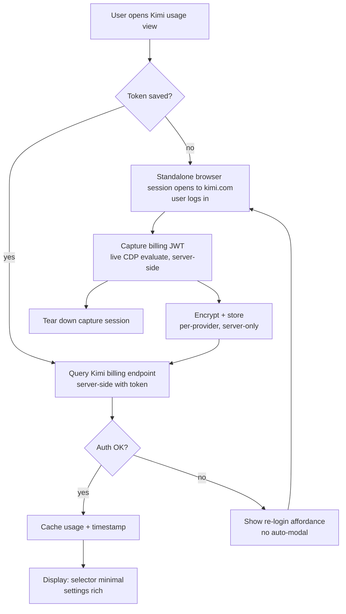
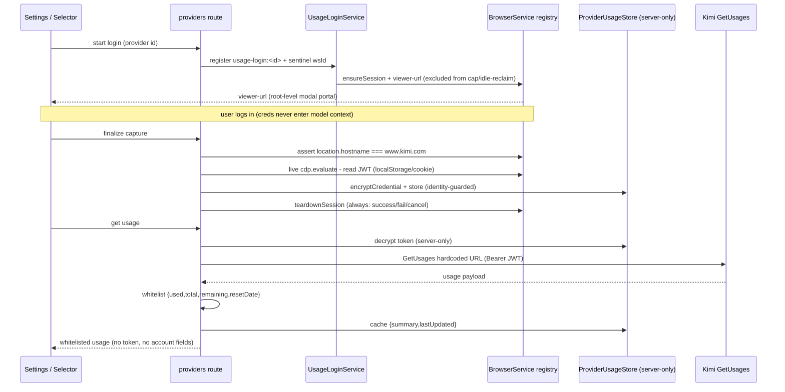
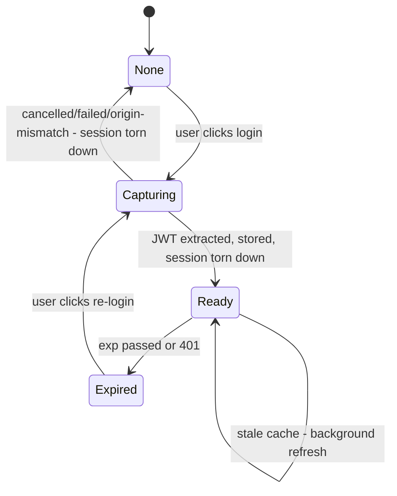

## Goal Capsule

- **Objective:** Show Kimi coding-plan usage inside Comate by capturing a web-login token via the embedded browser, storing it encrypted per-provider, querying Kimi's billing endpoint, and surfacing the number in the provider/model selector and Provider settings.
- **Product authority:** This plan owns Kimi usage query + display only. Usage for other providers and any generic provider-usage framework are not active scope.
- **Execution:** code.
- **Stop conditions:** R1–R14 satisfied; the captured session is always torn down; the usage token and account-identifying fields never reach the client or logs; Kimi usage renders in both surfaces; non-coding-plan providers (incl. `api.moonshot.cn` API-key-only) show no usage UI; `npm run lint`, `npm run test:server`, `npm run test:client`, `npm run test:browser` pass; the live login-capture smoke passes against kimi.com.
- **Tail ownership:** the implementing agent owns build, tests, and the manual login smoke; cleanup of experimental code is required before done.

---

## Product Contract

Product Contract changed from the requirements-only artifact per ce-doc-review findings (all within confirmed scope): R7 detection tightened to the kimi.com coding-plan context; R12–R14 added (session teardown, origin + hardcoded-URL security, response whitelist).

### Summary

In-app Kimi coding-plan usage, queried through Kimi's billing endpoint using a web-login token captured via Comate's embedded browser. The token is a separate per-provider credential (not the coding API key), encrypted at rest and never sent to the client; usage shows as a minimal remaining-quota line in the provider/model selector and a rich panel in Provider settings, refreshing on view when stale. Built for Kimi now, with a light extension seam for future providers.

### Problem Frame

Some providers sell a "coding plan" subscription whose usage is only viewable on the provider's website, not through the API key used for coding. Users running Kimi through Comate must leave the app and open kimi.com to check remaining quota. Kimi exposes an internal billing endpoint that returns coding-plan usage, but it requires a web-session JWT obtained by logging in — a credential Comate does not currently hold. The embedded browser already lets users log in to sites and capture session state, so the pieces to bring this number in-app already exist. This plan wires them together for Kimi.

### Key Decisions

- **Kimi first, no generic framework.** Build Kimi concretely; providers differ enough in API and auth that a config-driven adapter registry is speculative now. Leave a clearly named extension seam so a second provider can mirror it later. (session-settled: user-directed — chosen over a generic provider-usage framework: providers differ in API and auth method.)
- **Usage is per-provider.** The captured web-login token and the usage display belong to the provider entry, not the workspace-level site-auth store, so the selector maps each provider to its usage directly.
- **Encrypt the usage token at rest.** The Kimi token is a full-account-access web JWT, broader than an API key. Store it encrypted via the existing AES-256-GCM credential utility, value-only on the server: never returned to the client, never accepted from client input, never logged. (session-settled: user-approved — proposed with the tradeoff surfaced; the user assented.)
- **Capture via the embedded browser.** The JWT is captured through the existing Steel+CDP machinery (in-page evaluate), via a standalone browser session opened for login.
- **Non-intrusive re-login on expiry.** When the saved token is missing, expired, or the usage call fails authentication, show a "re-login to refresh" affordance and open the browser-login modal only on explicit click — never auto-pop the modal because the user opened the selector. (session-settled: user-approved — proposed with the tradeoff surfaced; the user assented.)

### Requirements

**Token capture & lifecycle**

- R1. A Kimi provider can trigger a browser-login capture flow that opens the embedded browser to kimi.com, lets the user log in, and extracts the web-session JWT used for billing.
- R2. The captured token is associated with that provider entry (per-provider) and is distinct from the provider's coding API key.
- R3. When the saved token is missing, expired, or the usage call fails authentication, the UI surfaces a "re-login to refresh" affordance rather than automatically opening the login modal.

**Capture-session & credential security**

- R12. The standalone capture session is destroyed immediately after the JWT is extracted, and on failure or cancel, so no live full-account kimi.com session remains reachable.
- R13. Capture finalizes only when the page origin is exactly `www.kimi.com` over https; the Kimi login URL and the GetUsages endpoint are compile-time constants, never derived from `provider.baseUrl` or any client-supplied field.
- R14. The billing response is reduced to a fixed whitelist shape (used, total, remaining, reset date); account-identifying fields are never forwarded to the client or logs.

**Token storage & security**

- R4. The usage token is encrypted at rest using the existing AES-256-GCM credential utility.
- R5. The token is value-only on the server: never returned to the client in any API response, never accepted from client-supplied input on write, and never written to logs or diagnostics.

**Usage query**

- R6. Comate queries Kimi's coding-plan usage by calling Kimi's billing endpoint server-side, authenticated with the captured web-login token (scope: coding).
- R7. Usage query and display run only for providers that carry a kimi.com coding-plan context (the captured web login) — not for `api.moonshot.cn` API-key-only providers whose account may differ; if the logged-in account has no coding plan, the UI shows a distinct "no coding plan found" state (not a relogin/expiry state).

**Refresh & staleness**

- R8. Usage is fetched on-demand when the user views it, and is auto-refreshed in the background only when the cached value is older than a staleness threshold; a manual refresh action is available in settings.

**Display**

- R9. The provider/model selector shows a minimal usage indicator (remaining quota) for Kimi coding-plan providers, glanceable inline with the provider entry.
- R10. The Provider settings panel shows a rich usage view for Kimi coding-plan providers: used vs total, renewal/reset date, a manual refresh action, and a last-updated timestamp.

**Extensibility**

- R11. The Kimi usage implementation exposes a clearly named extension seam so a future provider can add its own usage query without restructuring Kimi's; no config-driven framework or multi-provider abstraction is built now.

### Key Flows

- F1. First-time usage setup
  - **Trigger:** A user opens a Kimi provider's usage view and no usage token is saved yet.
  - **Actors:** User, Comate server, embedded browser, Kimi website.
  - **Steps:** Comate shows a "log in to see usage" affordance; on click, a standalone browser session opens to kimi.com; the user logs in; Comate verifies the page origin, extracts the billing JWT in-page, encrypts and stores it per-provider server-side, tears down the capture session, then fetches and displays usage.
  - **Covered by:** R1, R2, R4, R5, R6, R12, R13.
- F2. Usage refresh on view
  - **Trigger:** A user views a Kimi provider's usage and the cached value is stale or absent.
  - **Actors:** Comate server, Kimi billing endpoint.
  - **Steps:** Comate calls the billing endpoint server-side with the stored token; on success it whitelists the response into the cached summary and renders it; on auth failure it surfaces the re-login affordance.
  - **Covered by:** R3, R6, R8, R9, R10, R14.
- F3. Token expiry / re-login
  - **Trigger:** A usage call returns an authentication failure or the token is known expired.
  - **Actors:** User, Comate server, embedded browser.
  - **Steps:** The UI shows a "re-login to refresh" state with no auto-modal; on explicit click the standalone browser session reopens for login; a fresh token is captured, encrypted, stored, and the capture session torn down; the next usage fetch succeeds.
  - **Covered by:** R3, R4, R5, R12.

### Acceptance Examples

- AE1. No token yet
  - **Covers R1, R3, R9.**
  - **Given** a Kimi provider with no saved usage token,
  - **When** the user opens the provider/model selector,
  - **Then** the selector shows a "log in to see usage" affordance for that provider and does not automatically open the login modal.
- AE2. Fresh vs stale refresh
  - **Covers R8, R9, R10.**
  - **Given** cached usage for a Kimi provider last updated within the staleness threshold,
  - **When** the user opens the selector,
  - **Then** the cached remaining-quota is shown without a background fetch.
  - **Given** the same provider with cache last updated beyond the threshold,
  - **When** the user opens the settings panel,
  - **Then** a background refresh fetches new usage and updates the rich view and last-updated timestamp.
- AE3. Token expired
  - **Covers R3, R6.**
  - **Given** the stored Kimi token has expired,
  - **When** a usage fetch is attempted,
  - **Then** the UI shows a "re-login to refresh" affordance and does not auto-open the browser; after the user clicks it and re-logs in, the next fetch succeeds.
- AE4. Non-coding-plan provider unaffected
  - **Covers R7.**
  - **Given** an `api.moonshot.cn` API-key-only provider or any non-Kimi provider,
  - **When** the user opens its selector entry or settings,
  - **Then** no usage indicator or login affordance appears.
- AE5. Capture session torn down; origin enforced
  - **Covers R12, R13.**
  - **Given** a capture in progress,
  - **When** the JWT is extracted (or the capture fails or is cancelled),
  - **Then** the standalone browser session is closed and no live kimi.com session remains; and if the page is not on `www.kimi.com` at finalize, extraction is aborted with no token written.
- AE6. Wrong account / no coding plan
  - **Covers R7, R14.**
  - **Given** a logged-in kimi.com account that has no coding plan,
  - **When** usage is fetched,
  - **Then** the UI shows "no coding plan found" (distinct from relogin); and the response the client receives carries only used/total/remaining/reset, never email/user_id/payment fields.

### Scope Boundaries

Deferred for later:

- Usage query and display for non-Kimi providers — add when a second provider is real.
- A config-driven provider-usage adapter framework, a typed `ProviderUsageAdapter` interface, or multi-provider abstraction — speculative until a second provider exists; the seam stays a naming/mirrorable-shape convention until then.
- A Fetch-domain CDP interception path (`Fetch.enable`/`Network.requestPaused`) for header-only JWTs — only needed if OQ1 resolves that the Kimi JWT is never persisted client-side; sized as separate work then.

Outside this feature:

- Changing the existing coding API-key auth flow — the usage token is additive and separate.
- Estimating cost from local message accounting — Comate already has analytics for that, separate from provider billing.

### Dependencies / Assumptions

- The Kimi billing JWT is assumed to be browser-accessible via in-page storage (localStorage or cookie) while the page is on kimi.com, readable by a live `cdp.evaluate`. If it is header-only (never persisted client-side), capture needs the deferred Fetch-domain work (see Scope Boundaries); the primary mechanism is storage-based.
- The billing response fields are assumed to map to the whitelist shape (used, total, remaining, reset date). The parser reads named fields only; exact names are confirmed at implementation time.
- The embedded Steel+CDP browser, the `BrowserService` registry + viewer-url route + loopback proxy, and the AES-256-GCM credential utility already exist (verified).

### Outstanding Questions

- OQ1. Exact Kimi JWT storage location in the browser (localStorage key vs cookie vs header-only) — **deferred to implementation**; the capture unit probes the live session and uses the matching read branch; if header-only, the Fetch-domain work is unblocked as a follow-up.
- OQ2. Exact billing response field names — **deferred to implementation**; the parser is whitelist-shaped and reads named fields only.
- OQ3. The staleness threshold value — **resolved: 24h default** (see KTD3).

### Sources & Research

- Kimi billing endpoint (from the originating request): `POST https://www.kimi.com/apiv2/kimi.gateway.billing.v1.BillingService/GetUsages`, header `Authorization: Bearer <JWT>`, body `{"scope":["FEATURE_CODING"]}`. Requires a web-login session. (Used as a compile-time constant per R13.)
- Embedded browser capture machinery: `src/server/services/browser-service.ts` (`ensureSession` requires `{ sessionId, workspaceId }`; the registry + `getViewerUrl`; `exportSteelContext` whose storage extraction silently degrades to `{}` because the LevelDB reader is stubbed), `src/server/routes/browser.ts` (viewer-url resolves only registry sessions), `src/server/services/browser-proxy.ts` (proxy authenticates only via `findSessionByViewerToken`), `src/server/services/browser-cdp.ts` (`evaluate`, `navigate`, `setCookies`, `evaluateOnNewDocument`; no Fetch-domain surface today), `src/client/stores/browser-pane-store.ts` (viewer-url is server-constructed and shape-locked — no open-at-URL primitive).
- Provider model and selector: `src/server/models/provider.ts` (Provider is global — no workspace_id), `src/server/storage/sqlite-store.ts` (`providers` table; `options_json` rebuilt on every save; `app_settings` is a singleton `id=1` row with a dedicated `github_connection_json` column — not provider-keyed), `src/client/components/ProviderSelector.tsx`, `src/client/components/ProviderSection.tsx` (`ProviderListItem` health-check button/result block).
- Encryption precedent: `src/server/utils/credential-crypto.ts` (AES-256-GCM; `decryptCredential` throws on tamper), `src/server/services/github-auth.ts` (`persistConnection`/`loadConnection` — singleton pattern, value-only status surface).
- Health-check route template: `src/server/routes/providers.ts` (`runHealthCheck` helper + `POST /:id/health`).
- Kimi detection: `src/server/services/kimi-loop-detector.ts` (`isKimiProvider` — loose substring match incl. `api.moonshot.cn`; too broad for usage gating, see R7/KTD7).
- Institutional learnings: `docs/solutions/build-errors/cpsync-rewrites-relative-symlinks-dangling-tauri-resources.md` (vendored Steel build gates), `docs/solutions/integration-issues/sse-heartbeat-read-timeout-recovery-2026-05-24.md` (proactive liveness + cause classification), `docs/solutions/integration-issues/sse-subscription-race-condition-2026-05-21.md` (identity-guarded writes).

---

## Planning Contract

### Key Technical Decisions

- **KTD1. Standalone capture session registered under a synthetic id.** (session-settled: user-approved — chosen over reusing the chat-bound browser pane: the browser is chat-session-bound and the login is settings-triggered.) The capture session is registered in the existing `BrowserService` registry under a synthetic id (`usage-login:<providerId>`) with a sentinel workspaceId, so it reuses `ensureSession`, the viewer-url route, and the loopback viewer proxy as-is — it is NOT a separate viewer-delivery path (the proxy authenticates only via the registry, and `ensureSession` requires a workspaceId the global Provider lacks, so a truly "outside the registry" session has no viewer path). It is explicitly excluded from the `maxSessions` cap and the idle-reclaim timers, and torn down on capture-complete/cancel (R12). This is the largest new surface in the plan.
- **KTD2. Encrypted per-provider token in a dedicated table.** (session-settled: user-approved — chosen over storing alongside the plaintext API key: the web JWT is a full-account credential and the providers table has no encrypted column. Instantiates "Encrypt the usage token at rest.") Store the ciphertext in a new `provider_usage_tokens` table keyed by `provider_id` (NOT the singleton `app_settings` row github-auth uses — that holds one global connection, not N provider tokens), via `credential-crypto` AES-256-GCM. The decrypted value lives only in an in-memory holder; never in GET responses or logs. Schema change: new table + migration.
- **KTD3. Server-side in-memory usage cache with a 24h staleness threshold.** Cache `{ summary, lastUpdated }` per provider id in memory, not persisted. On-demand fetch when viewed; background refresh when older than 24h; manual refresh in settings. In-memory avoids the `options_json` rebuild-on-save clobber and needs no extra schema. The cache is cold after a sidecar restart, so the first view per provider re-fetches — acceptable given on-demand refresh. Resolves OQ3.
- **KTD4. Capture via live in-page evaluation while on kimi.com; origin-verified.** Reuse `cdp.evaluate` / `navigate`, but NOT `exportSteelContext` — its storage extraction silently degrades to `{}` because the LevelDB reader is stubbed. Capture is a live `cdp.evaluate('localStorage.getItem(...)')` plus a scoped cookie read while the standalone page is mounted on kimi.com. Before any read, assert `location.hostname === 'www.kimi.com'` (https) and abort to relogin on mismatch (R13). If OQ1 resolves the JWT as header-only, a Fetch-domain interception is required — that CDP surface does not exist today and is sized as separate deferred work (Scope Boundaries); the storage-based path is primary.
- **KTD5. Proactive expiry probe + cause-classified, non-intrusive re-login.** (Refines the brainstorm "Non-intrusive re-login" decision via the SSE-timeout learning.) Before each billing query, check the JWT `exp`; on 401/expiry classify the cause and surface a "re-login to refresh" affordance — never auto-pop the modal on a mere selector open. Avoids retry storms. The exp probe reads ONLY the `exp` claim and discards the rest of the decoded payload; cause-classification logs use static strings (`token-expired` / `token-missing`), never decoded claims.
- **KTD6. Identity-guarded token writes.** (From the subscription-race learning.) Re-capture/re-login writes to the encrypted token slot are identity-guarded so a late browser close/abort cannot clobber a freshly captured JWT. The capture-start is also guarded so two concurrent logins for the same provider resolve deterministically (the second overwrites only after the first completes or is cancelled).
- **KTD7. Kimi-first with a light extension seam; no framework; tightened gate.** (session-settled: user-directed — instantiates the brainstorm decision.) A per-provider usage seam whose shape (detect / capture / fetch / parse) a future provider mirrors by copying clearly named exports — NOT a typed `ProviderUsageAdapter` interface or registry (extracted when a second provider is real). The usage feature gates on whether the provider carries a kimi.com coding-plan context (the captured web login), NOT the loose `isKimiProvider` substring that also matches `api.moonshot.cn` API-key providers.
- **KTD8. Capture/credential security invariants (R12–R14).** The Kimi login URL and GetUsages endpoint are compile-time constants, never read from `provider.baseUrl` or client input (bounds the `isKimiProvider` substring blast radius). The capture session is torn down after extraction/failure/cancel. The billing response is reduced to a fixed whitelist shape by named-field reads, never by spreading/cloning the response.

### High-Level Technical Design

The capture-and-query flow crosses four server components behind a hard trust boundary (the JWT never leaves the server; account fields never leave the server), plus two client surfaces. The capture session lives in the existing registry under a synthetic id.

The usage token moves through a small lifecycle. Staleness is an overlay on `Ready` (a stale cache triggers a background refresh, not a state change). Every exit from `Capturing` tears the session down.

### Assumptions

- The Kimi JWT is browser-accessible (localStorage/cookie) while on kimi.com; if header-only, the deferred Fetch-domain path applies (KTD4).
- The `GetUsages` response carries used/total/remaining/reset fields that map to the whitelist; the parser reads named fields, confirmed at implementation (OQ2).
- The synthetic-id capture session can reuse `ensureSession` + the viewer-url route + proxy with a sentinel workspaceId, with explicit exclusion from the session cap and idle-reclaim.

### Sequencing

U1 (store) is foundational. U2 (query) and U3 (capture) both depend on U1 and can proceed in parallel. U4 (client store + modal) depends on the U2/U3 routes. U5 (selector) and U6 (settings) depend on U4 and can proceed in parallel. The live login smoke (U3) is the integration proof that unit and component tests cannot cover; the standalone-session registration (KTD1) is the riskiest piece and should be spiked first within U3.

---

## Implementation Units

### U1. Encrypted per-provider usage-token store + value-only access

- **Goal:** Persist the captured Kimi JWT encrypted at rest keyed by provider, with a server-side in-memory usage cache, and guarantee the token never reaches the client.
- **Requirements:** R2, R4, R5.
- **Dependencies:** none (foundational).
- **Files:** `src/server/storage/sqlite-store.ts` (new `provider_usage_tokens` table keyed by `provider_id` + migration version; `getProviderUsageToken`/`setProviderUsageToken`/`clearProviderUsageToken`), `src/server/utils/credential-crypto.ts` (reuse `encryptCredential`/`decryptCredential`), new `src/server/services/provider-usage-store.ts` (encrypted-token CRUD + in-memory usage cache + identity-guarded writes), `src/server/routes/providers.ts` (audit the GET serialization path so no token leaks). Test: `src/server/services/provider-usage-store.test.ts`.
- **Approach:** Mirror the github-auth encrypt/decrypt discipline but in a provider-keyed table (github-auth is a singleton row, not provider-keyed). Encrypted ciphertext in `provider_usage_tokens`; decrypted value held in-memory only. In-memory cache `{ summary, lastUpdated }` per provider. Token writes are identity-guarded (KTD6). Audit `GET /api/providers` and any provider serialization so the response shape carries no token field.
- **Patterns to follow:** `src/server/services/github-auth.ts` (`persistConnection`/`loadConnection`, try/catch redact on decrypt, status surface without the token); `src/server/services/browser-site-auth.ts` (`stripSiteAuthValues` value-only precedent).
- **Test scenarios:**
  - Happy: encrypt → store → decrypt returns the original JWT.
  - Tampered ciphertext → decrypt returns null and logs a redacted error (no raw token in the log).
  - `GET /api/providers` response contains no token field.
  - Identity guard: a write with an older capture id does not overwrite a token stored by a newer capture id.
  - Cache set/get and TTL expiry (entry older than 24h reports stale).
  - Test expectation uses isolated SQLite: import `test-utils/test-env` first; use `createIsolatedStore()` or `:memory:`.
- **Verification:** `npm run test:server` passes; a grep over the GET response builder confirms no token field is serialized.

### U2. Kimi usage query service + route

- **Goal:** Query Kimi's `GetUsages` endpoint server-side with the decrypted token and return a whitelist-normalized usage summary, a no-plan signal, or an auth-needed signal.
- **Requirements:** R6, R7, R8, R11, R14.
- **Dependencies:** U1.
- **Files:** new `src/server/services/kimi-usage-service.ts`, `src/server/routes/providers.ts` (add `POST /api/providers/:id/usage`, clone the health-check template), `src/server/services/kimi-loop-detector.ts` (reference only — do not gate usage on the loose `isKimiProvider`). Test: `src/server/services/kimi-usage-service.test.ts`.
- **Approach:** Clone `runHealthCheck`: a `runUsageCheck(provider)` helper. Gate on whether the provider has a captured kimi.com usage token (the coding-plan context), not on `isKimiProvider` — an `api.moonshot.cn` API-key-only provider with no captured token returns `{ status: 'unsupported' }`. Probe the JWT `exp` (KTD5) before calling; post to the hardcoded `GetUsages` constant with `{ scope: ['FEATURE_CODING'] }` and the decrypted bearer; map 401/403 → `{ status: 'relogin' }`; map a response indicating no coding plan → `{ status: 'no-plan' }`; on success build ONLY the whitelist object `{ used, total, remaining, resetDate, lastUpdated }` by reading named fields (never spread the response) and cache it. The route response never includes the token or account fields.
- **Patterns to follow:** `src/server/routes/providers.ts` `runHealthCheck` helper + `POST /:id/health` route; `src/client/stores/provider-store.ts` `runHealthCheck` action.
- **Test scenarios:**
  - Happy path (mocked fetch → 200) returns the whitelist summary and caches it.
  - 401/403 → `{ status: 'relogin' }` without retry storms.
  - JWT `exp` in the past → `{ status: 'relogin' }` without calling the endpoint.
  - `api.moonshot.cn` provider with no captured token → `{ status: 'unsupported' }`. Covers AE4.
  - Response indicating no coding plan → `{ status: 'no-plan' }`. Covers AE6.
  - Whitelist: a mocked response containing `email`/`user_id`/`payment` fields yields a summary containing none of them. Covers AE6, R14.
  - Network error / timeout → `{ status: 'error' }`.
  - The fetch URL is the hardcoded constant even when the provider's baseUrl is an attacker string. Covers R13.
  - Test expectation uses isolated SQLite per repo convention.
- **Verification:** `npm run test:server` passes; a manual `curl POST /api/providers/:id/usage` against a Kimi coding-plan provider returns the whitelist shape.

### U3. Standalone login-capture session + JWT extraction

- **Goal:** Register a standalone Steel session for the Kimi login, let the user log in, verify origin, extract the billing JWT, encrypt+store it per-provider, and tear the session down.
- **Requirements:** R1, R2, R3, R11, R12, R13.
- **Dependencies:** U1.
- **Files:** new `src/server/services/provider-usage-login-service.ts` (registers a `usage-login:<providerId>` session via `ensureSession` with a sentinel workspaceId; exclude from cap/idle-reclaim; teardown), `src/server/services/browser-cdp.ts` (reuse `evaluate`/`navigate`; do NOT use `exportSteelContext`), `src/server/services/browser-service.ts` (registry/viewer-url reuse + teardown hook), `src/server/routes/` (new `POST /api/providers/:id/usage-login` start and finalize endpoints). Test: `src/server/services/provider-usage-login-service.test.ts`.
- **Approach:** Register the capture session in the `BrowserService` registry under `usage-login:<providerId>` with a sentinel workspaceId so it reuses `ensureSession` + the viewer-url route + the loopback proxy (KTD1); explicitly exclude it from `maxSessions` contention and idle-reclaim. Navigate to the hardcoded Kimi login URL. The client mounts a root-level portal modal hosting the viewer-url. On finalize: assert `location.hostname === 'www.kimi.com'` (https); if mismatch, abort to `{ status: 'relogin', reason: 'wrong-origin' }` with no write. Then read the JWT via live `cdp.evaluate('localStorage.getItem(...)')`, falling back to a scoped cookie read (NOT `exportSteelContext`). Encrypt+store through U1 with an identity guard (KTD6). Finally tear down the session unconditionally (success, failure, cancel). No token value appears in responses or logs.
- **Constraints:** The capture path adds no native dependencies or symlinks to the vendored Steel bundle — it must stay pure-JS to clear the build gates.
- **Patterns to follow:** `src/server/services/browser-service.ts` `ensureSession`/`getViewerUrl`/`teardownSession`; `src/server/services/browser-cdp.ts` `evaluate`; `src/server/services/browser-site-auth.ts` `filterContextToScope` (cookie case only).
- **Execution note:** Spike the synthetic-id registry registration first (KTD1 is the riskiest piece) — confirm the sentinel-workspaceId session reuses the viewer-url route/proxy and that cap/idle-reclaim exclusion works before building the rest of the unit. Then probe the live kimi.com session to confirm where the billing JWT is stored (OQ1).
- **Test scenarios:**
  - Extraction from a localStorage key returns the raw string (mock `cdp.evaluate`).
  - Extraction when the key is absent but a scoped cookie is present returns the cookie value.
  - Origin mismatch (mocked hostname ≠ www.kimi.com) → aborts, no extraction, no write.
  - Extracted value is passed to the store encrypted (assert `encryptCredential` invoked, plaintext not logged).
  - Concurrent re-capture does not clobber a newer token (identity guard).
  - Teardown: after a successful capture the session handle is null; after a failed/cancelled capture it is also null.
  - Route responses contain no token value.
  - The navigated login URL is the hardcoded constant even when baseUrl is an attacker string.
  - Live login is a manual smoke step, not a unit test.
  - Test expectation uses isolated SQLite per repo convention.
- **Verification:** `npm run test:server` passes; manual smoke — trigger login from settings, authenticate on kimi.com, confirm token captured, session closed, and a subsequent usage fetch succeeds.

### U4. Frontend usage store + login modal

- **Goal:** Fetch and refresh usage per provider and drive the standalone login-capture modal with explicit UI states.
- **Requirements:** R8; supports R9, R10.
- **Dependencies:** U2, U3.
- **Files:** `src/client/stores/provider-store.ts` (add a usage slice and `fetchUsage`/`refreshUsage`/`startUsageLogin` actions) or a new `src/client/stores/provider-usage-store.ts`; a new root-level portal modal host component (NOT mounted inside `ProviderSection`, so it is reachable from both the selector and settings). Test: `src/client/stores/provider-usage-store.test.tsx` (jsdom).
- **Approach:** A zustand slice `usageByProvider: Record<id, { summary?, status, lastUpdated? }>` with `status` in `{ idle, fetching, ready, relogin, no-plan, unsupported, error }`. `fetchUsage` does on-demand + 24h stale-check; `refreshUsage` forces; `startUsageLogin` opens the modal. The modal has explicit states — connecting (session spawning/navigating), ready-for-input (iframe + primary "I've logged in — capture" action), capturing (action disabled + spinner), success (brief beat, then close + refetch), failed (error + Try again/Cancel), cancelled (X/Esc tears down the session, no token written). Triggering the modal from the selector closes the selector popover first so only one overlay shows. Mirror the `runHealthCheck` action shape.
- **Patterns to follow:** `src/client/stores/provider-store.ts` (`fetchProviders`, `runHealthCheck`); `src/client/stores/browser-pane-store.ts` (open/visibility primitives).
- **Test scenarios:**
  - `fetchUsage` stores summary + lastUpdated on success.
  - Cache within 24h skips the network fetch; older than 24h triggers a background refresh. Covers AE2.
  - `relogin`, `no-plan`, `unsupported`, and `error` statuses surface to the UI.
  - `startUsageLogin` walks the modal state machine; capture-complete triggers teardown + refetch; cancel tears down with no token.
- **Verification:** `npm run test:client` passes.

### U5. Provider selector minimal usage display

- **Goal:** Show a minimal remaining-quota line and a login affordance inline in the selector for Kimi coding-plan providers, with fetching/error states.
- **Requirements:** R9, R3, R7.
- **Dependencies:** U4.
- **Files:** `src/client/components/ProviderSelector.tsx`. Test: `src/client/components/ProviderSelector.browser.test.tsx`.
- **Approach:** On selector open for a Kimi coding-plan provider, call `fetchUsage` (on-demand, 24h stale-check); while the first fetch is in flight show a fetching placeholder (not the login affordance); render the remaining-quota via a shared formatter (`{remaining} left`, unit suffix TBD from OQ2) when `ready`; render a login affordance only when status is `idle`-with-no-token or `relogin` (distinct first-time "Connect Kimi account" vs expired "Reconnect to refresh" copy); suppress the line on `error`; open the modal (closing the popover) on click. Non-coding-plan providers render no extra UI. Opening the selector never auto-opens the modal.
- **Patterns to follow:** `src/client/components/ProviderSelector.tsx` list-item layout.
- **Test scenarios:**
  - Kimi provider with cached usage → remaining-quota line shown.
  - Kimi provider, token saved, no cache → fetching placeholder, then quota (never the login affordance). Covers AE2.
  - Kimi provider with no token → login affordance shown; opening the selector does not auto-open the modal. Covers AE1.
  - Non-coding-plan / non-Kimi provider → no usage UI. Covers AE4.
  - Error status → line suppressed.
- **Verification:** `npm run test:browser` passes.

### U6. Provider settings rich usage panel

- **Goal:** Show a rich usage panel (used/total, reset date, manual refresh, last-updated) and a login affordance in Provider settings, with fetching/error/partial-field states.
- **Requirements:** R10, R3, R8.
- **Dependencies:** U4.
- **Files:** `src/client/components/ProviderSection.tsx` (`ProviderListItem`). Test: `src/client/components/ProviderSection.browser.test.tsx`.
- **Approach:** Clone the existing health-check button/result block in `ProviderListItem`: render the rich fields via the shared formatter (`{used} / {total} used · {remaining} left · resets {date}`), a manual refresh button, and a last-updated timestamp when `ready`; show a fetching state on the refresh button during in-flight refresh (stale fields stay visible); an error row with Retry on `error`; a neutral placeholder (e.g. `—`) per absent field (never `0` for "used"); a single "Usage unavailable" row if the payload is fully unmappable; a login affordance when `relogin`/idle (first-time vs expired copy); a "no coding plan found" row on `no-plan`; show nothing for non-coding-plan providers.
- **Patterns to follow:** `src/client/components/ProviderSection.tsx` `ProviderListItem` health-check button/result (`handleHealthCheck` local-state pattern).
- **Test scenarios:**
  - Kimi provider ready → rich fields, refresh button, last-updated shown.
  - Clicking refresh triggers a forced refetch (fetching state on the button). Covers AE2.
  - Partial payload (reset date missing) → placeholder for that field, no `0`. Covers AE6.
  - Error → error row + Retry.
  - Expired token → re-login affordance; clicking opens the modal and the next fetch succeeds. Covers AE3.
  - No coding plan → "no coding plan found" row. Covers AE6.
  - Non-coding-plan provider → no panel.
- **Verification:** `npm run test:browser` passes.

---

## Verification Contract

| Gate | Command | Applies to |
|---|---|---|
| Server unit tests | `npm run test:server` | U1, U2, U3 (node:test; must import `test-utils/test-env` first; isolated SQLite) |
| Client store tests | `npm run test:client` | U4 (jsdom) |
| Browser component tests | `npm run test:browser` | U5, U6 (Playwright) |
| Lint | `npm run lint` | all changed `.ts`/`.tsx` |
| Live login smoke | manual | U3 — trigger login from settings, authenticate on kimi.com, confirm capture + teardown + usage fetch |

The live kimi.com login cannot be automated in CI; U3 unit tests cover extraction/origin/teardown/storage with mocked CDP, and the manual smoke is the integration proof. Critical security assertions that must be green: no token in any GET response; no account-identifying field in any usage response; capture session handle is null after every capture outcome; the navigated/fetched URL is the hardcoded constant under an attacker baseUrl. Behavioral skill evaluation is not required for this feature.

---

## Definition of Done

- Global: R1–R14 satisfied; the capture session is always torn down (success/failure/cancel); page origin is verified before extraction; login and billing URLs are hardcoded constants; the billing response is whitelist-shaped; the usage token and account-identifying fields are never present in any client-facing response or log (verified by test + grep); Kimi usage renders in both the selector (minimal) and settings (rich); `api.moonshot.cn` API-key-only and non-Kimi providers show no usage UI; `npm run lint`, `npm run test:server`, `npm run test:client`, and `npm run test:browser` all pass; the live login-capture smoke passes.
- U1: encrypted store round-trips; GET responses carry no token; identity guard holds.
- U2: query returns whitelist usage for a coding-plan provider, `unsupported` for `api.moonshot.cn`-only, `no-plan` for an account without one, `relogin` on expiry.
- U3: synthetic-id session reuses the viewer path; extraction + encrypt+store + teardown work end-to-end in the live smoke; origin mismatch aborts.
- U4–U6: store/modal state machine and both surfaces behave per AE1–AE6.
- Cleanup: abandoned-attempt and experimental code from the capture path is removed before done; no dead branches left in the diff.
