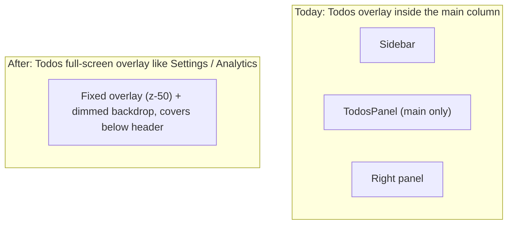

# Todos Full-Screen Overlay - Plan

## Goal Capsule

- **Objective:** Make the top-level Todos panel open as a full-screen dismissable overlay, consistent with Settings and Analytics, instead of the current main-column overlay.
- **Product authority:** This plan owns the Todos overlay-mount change. Making Todos a tab, generalizing the tab system, the per-session TaskPanel, and other overlay panels are not active scope.
- **Open blockers:** None — scope confirmed.

---

## Product Contract

### Summary

Make the top-level Todos panel a full-screen dismissable overlay — the same pattern Settings and Analytics use — instead of the current overlay that sits inside the main column alongside the sidebar. The header Todos button opens it; the panel's close control, backdrop click, or Esc dismisses it.

### Problem Frame

The top-level Todos panel was made a "first-class main-view surface" by `docs/plans/2026-07-27-001-feat-top-level-todos-github-sync-plan.md`, but it mounts inside the main column, so the sidebar and right panel stay visible alongside it. Todos reads as a cramped panel wedged into the message area, inconsistent with how the other top-level panels (Settings, Analytics) open as proper full-screen overlays. The fix is consistency: open Todos the same way Settings and Analytics open.

### Key Decisions

- **Full-screen dismissable overlay, exactly like Settings/Analytics.** Todos reuses the established top-level panel pattern (`fixed` panel below the header with a dimmed backdrop) rather than living in the main column. Chosen over the earlier "tab" idea and the "full-canvas content row + button toggle/highlight" idea — the Settings pattern is the existing convention, maximizes consistency, and is the smallest change. This reverses the original "no popup" framing: a proper full-screen overlay like Settings is acceptable; the cramped main-column placement was the real problem.
- **Placement only; TodosPanel functionality unchanged.** What Todos shows and does (GitHub sync, etc.) is untouched — only how it mounts and dismisses changes.

### Requirements

- R1. Todos opens as a full-screen dismissable overlay matching the Settings/Analytics pattern: a fixed panel covering the area below the header with a dimmed backdrop.
- R2. The header Todos button opens Todos; the panel's close control, a backdrop click, and Esc dismiss it (same interactions as Settings).
- R3. The tab system is unchanged and TodosPanel's content and functionality are unchanged; only the mount/dismiss behavior changes.

### Key Flows

- F1. Open Todos
  - **Trigger:** User clicks the header Todos button.
  - **Steps:** TodosPanel mounts as a fixed full-screen overlay with a dimmed backdrop (matching Settings/Analytics); the workspace behind is dimmed.
  - **Outcome:** Todos is a proper full-screen panel, not a cramped main-column overlay.
- F2. Close Todos
  - **Trigger:** User clicks the panel's close control, clicks the backdrop, or presses Esc.
  - **Steps:** `onClose` fires; the overlay unmounts; the workspace view is restored.
  - **Outcome:** Todos dismisses like Settings/Analytics.

### Acceptance Examples

- AE1.
  - **Covers R1, R2.**
  - **Given** a workspace is active and Todos is closed,
  - **When** the user clicks the header Todos button,
  - **Then** TodosPanel renders as a fixed full-screen overlay with a dimmed backdrop, matching Settings.
- AE2.
  - **Covers R2, R3.**
  - **Given** Todos is open,
  - **When** the user clicks the backdrop (or the close control, or presses Esc),
  - **Then** the overlay dismisses and the workspace view is restored with no Todos data lost.

### Scope Boundaries

- **Out of scope:** Making Todos a real tab and generalizing the workspace-only tab model — rejected; the Settings-style overlay meets the need more simply. Also out: header-button toggle, active-button highlight, and close-on-workspace-switch — Todos follows the plain Settings pattern instead.
- **Not touched:** The per-session TaskPanel floating widget (live SDK task progress) is a separate feature.
- **Not changed:** TodosPanel's own functionality (GitHub sync, filtering, etc.); other overlay panels (Settings, Analytics, ScheduledTasks).

### Dependencies and Assumptions

- This plan revises the Todos mounting from `docs/plans/2026-07-27-001-feat-top-level-todos-github-sync-plan.md` (main-column overlay) to the Settings/Analytics full-screen overlay pattern. It keeps that plan's "first-class surface" intent.
- Assumption: Todos data lives in a store independent of the panel mount, so closing and reopening loses nothing. Todos open/closed state resets to closed on app restart, matching Settings.

### Outstanding Questions

None.

### Sources

- TodosPanel as button-toggled overlay inside the main column: `src/client/App.tsx` (`showTodos` state, mount, header wiring), `src/client/components/HeaderToolbar.tsx` (Todos button).
- Settings/Analytics full-screen overlay pattern (the pattern to copy): `src/client/components/SettingsPanel.tsx`, `src/client/components/AnalyticsPanel.tsx` (root `fixed top-11 inset-x-0 bottom-0 z-50` shell + dimmed backdrop + Esc).
- Per-session TaskPanel (distinct, not touched): `src/client/components/TaskPanel.tsx`, `src/client/components/ChatPanel.tsx`.
- Prior plan: `docs/plans/2026-07-27-001-feat-top-level-todos-github-sync-plan.md`.

---

## Planning Contract

Product Contract changed per user direction mid-planning: Todos is now a Settings/Analytics-style full-screen overlay (R1–R3), replacing the earlier "full-canvas content row + button toggle/highlight" requirements. Recorded as a user-directed scope change, not an agent inference.

### Key Technical Decisions

- **KTD1. Reuse the Settings/Analytics overlay pattern verbatim.** `SettingsPanel` and `AnalyticsPanel` self-contain a `fixed top-11 inset-x-0 bottom-0 z-50` shell with a `bg-overlay/60 backdrop-blur-sm` backdrop (click-to-close) plus an Esc keydown handler, and are mounted bare in the top-level overlay group in `App.tsx`. `TodosPanel` currently relies on an App-side `absolute inset-0 z-10` wrapper inside `<main>`. The change makes `TodosPanel` self-contained the same way and moves it to the overlay group, so it mounts and dismisses identically to Settings. Chosen over restyling the existing wrapper — self-containment matches the convention and keeps `App.tsx`'s overlay group uniform.
- **KTD2. Drop the in-`<main>` wrapper and remove the `&& !showTodos` clause.** Once Todos is a fixed overlay above the workspace, the old `<main>`-internal wrapper is removed. The `&& !showTodos` clause in the workspace visibility toggle (`src/client/App.tsx`) MUST also be removed — keeping it would set the active workspace to `invisible`, so behind the dimmed backdrop the user would see empty space instead of the dimmed workspace, breaking parity with Settings/Analytics (R1). Removing it is required, not optional.

### Assumptions

- Todos open/closed state resets to closed on app restart (matches Settings; no persistence requirement was stated).

---

## Implementation Units

### U1. Make Todos a Settings-style full-screen overlay

- **Goal:** TodosPanel opens as a full-screen dismissable overlay identical in pattern to Settings/Analytics.
- **Requirements:** R1, R2; preserves R3.
- **Dependencies:** none.
- **Files:** `src/client/components/TodosPanel.tsx` (modify — add the full-screen shell + backdrop + Esc); `src/client/App.tsx` (modify — move TodosPanel to the top-level overlay group, mounted bare); `src/client/components/TodosPanel.test.tsx` (test).
- **Approach:** Copy the full overlay structure from `SettingsPanel`/`AnalyticsPanel`, not just the outer shell. They layer: outer shell (`fixed top-11 inset-x-0 bottom-0 z-50 flex flex-col`) → a modal-area centerer (`flex-1 flex items-center justify-center p-2 sm:p-4 relative`) → the backdrop (`absolute inset-0 bg-overlay/60 backdrop-blur-sm`, `onClick={onClose}`) → a positioned card (`relative ... bg-surface border border-border rounded-xl shadow-2xl flex flex-col overflow-hidden`) that hosts TodosPanel's existing content, plus an Esc-to-close keydown handler mirroring Settings. The card's `relative` (and its DOM order after the backdrop) is load-bearing: without a positioned content layer, the absolute backdrop paints on top and covers the panel. In `App.tsx`, replace the in-`<main>` mount (`{showTodos && (
<TodosPanel onClose={...} />
)}`) with a bare mount in the top-level overlay group next to Settings/Analytics: `{showTodos && (<TodosPanel onClose={() => setShowTodos(false)} />)}`, and remove the `&& !showTodos` clause from the workspace visibility toggle so the workspace stays rendered and dimmed behind the backdrop. The header Todos button keeps `onOpenTodos={() => setShowTodos(true)}` (open-only, like Settings). Note: TodosPanel's existing three-pane layout (TodosRail + list + TodoDetail) may need internal height/width tuning inside the card's `overflow-hidden`; settle sizing during implementation.
- **Patterns to follow:** `src/client/components/SettingsPanel.tsx` full overlay structure (outer shell → centerer → backdrop → `relative` card → Esc); `src/client/components/AnalyticsPanel.tsx` confirms it is the shared convention. The `relative` card plus DOM-order-after-backdrop is what prevents the backdrop from covering the content.
- **Test scenarios:**
  - Covers AE1. Clicking open renders TodosPanel with the fixed `z-50` shell and a dimmed backdrop (workspace behind dimmed).
  - Covers AE1 (paint order). With Todos open, the panel content renders above the backdrop and is interactable — clicking inside the panel does not close Todos (only the backdrop, Esc, or close control do).
  - Covers AE2. Clicking the backdrop calls `onClose`; pressing Esc calls `onClose`; the overlay dismisses.
  - Edge: Todos open while a workspace tab is active — workspace behind is dimmed, not interactable; closing Todos restores it; no Todos data lost.
- **Verification:** Open Todos → full-screen overlay with backdrop appears (matching Settings); close via close control / backdrop / Esc → dismissed; workspace tabs and TodosPanel functionality unchanged.

---

## Verification Contract

- **Overlay pattern (R1):** `src/client/components/TodosPanel.test.tsx` — renders the `fixed top-11 inset-x-0 bottom-0 z-50` shell with a dimmed backdrop, matching Settings.
- **Open/close interactions (R2):** `src/client/components/TodosPanel.test.tsx` — open via header button; close via close control, backdrop click, and Esc.
- **No regressions (R3):** existing `src/client/components/TodosPanel.test.tsx` behavior stays green; workspace tab open/close/switch unaffected (`src/client/components/WorkspaceTabs.test.tsx`).
- **Suite gates:** `npm run lint`, `npm run test:client`.

---

## Definition of Done

- R1–R3 satisfied; AE1–AE2 pass as tests.
- Todos opens as a fixed full-screen overlay with a dimmed backdrop, matching Settings/Analytics.
- Todos dismisses via close control, backdrop click, or Esc.
- Tab system unchanged; TodosPanel functionality unchanged; existing tests green.
- `npm run lint` and `npm run test:client` pass.
