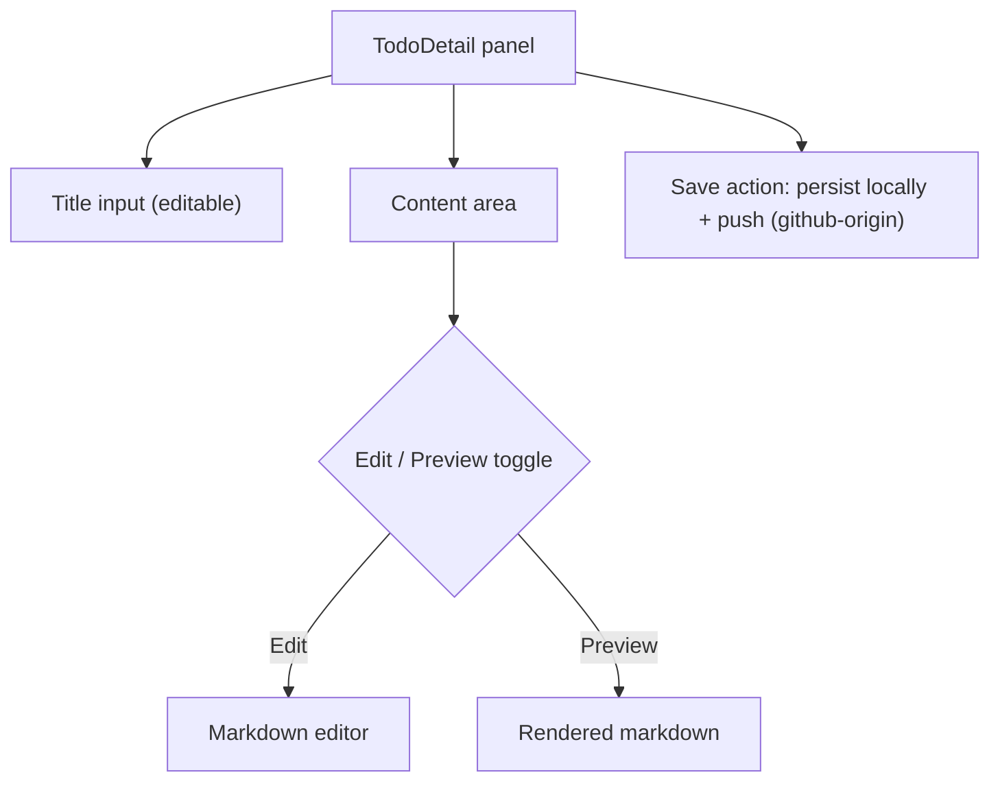
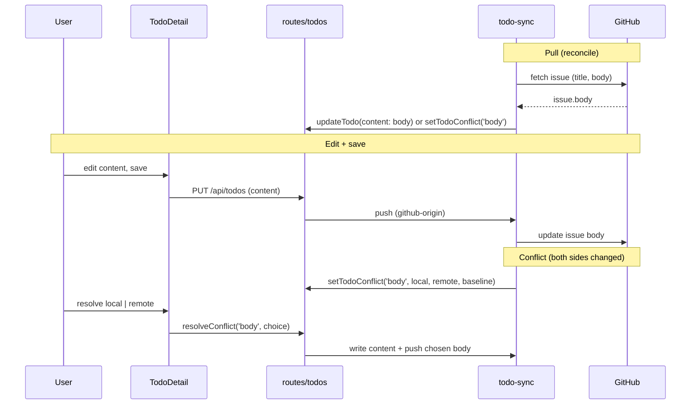
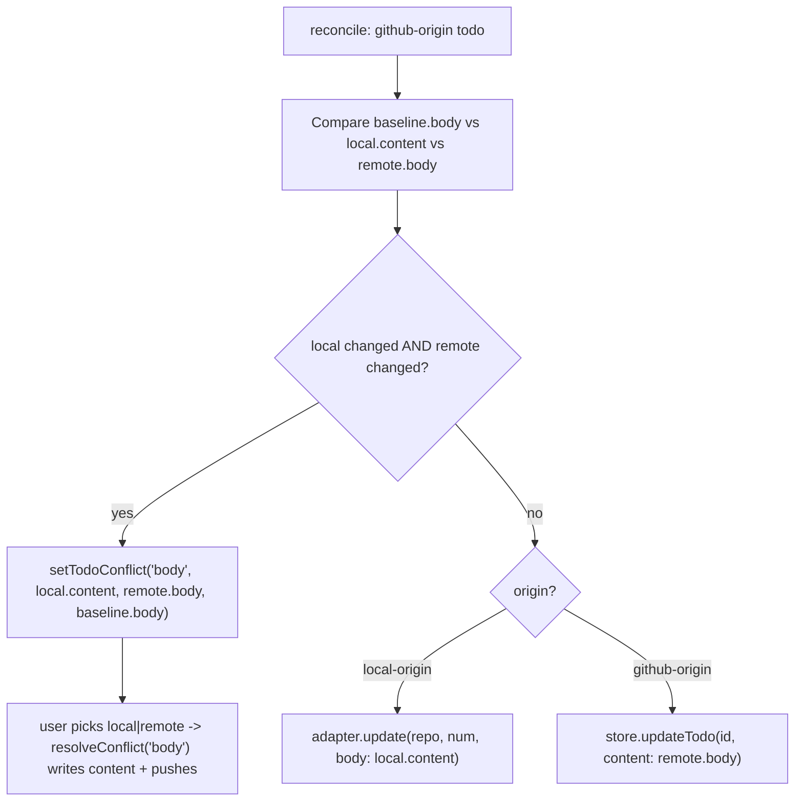

## Goal Capsule

- **Objective:** Add an optional markdown `content` detail field to todos. The existing single text field becomes a short title; title and content are both editable in the TodoDetail side panel; for github-origin todos, content mirrors the GitHub issue body bidirectionally with conflict handling.
- **Product authority:** Owns the todo title/content model, its in-panel editing, and GitHub issue-body sync. Comments sync, labels/status/assignee sync, and WeCom integration are not active scope.
- **Open blockers:** None. A phased-delivery alternative (content + editing first, body sync later) was offered and full scope was confirmed.
- **Execution profile:** Backend data layer first (foundation); client editing UI and sync engine proceed in parallel off it; conflict UX last.
- **Stop conditions:** All R1–R10 and AE1–AE4 satisfied; `test:server`, `test:client`, and `lint` green; no title-sync or session-naming regression; `content` column present on fresh and migrated DBs.

---

## Product Contract

**Product Contract preservation:** R/A/F/AE IDs and Requirements are unchanged from the brainstorm. Dependencies/Assumptions were firmed and Outstanding Questions resolved per codebase research — see Planning Contract.

### Summary

Give each todo an optional markdown `content` field for detailed description, and reframe the existing single text field as a short title. Title and content are editable together in the TodoDetail side panel. For github-origin todos, content is the local mirror of the GitHub issue body — pulled on sync, pushed on save — with conflicts surfaced through the existing flow.

### Problem Frame

A todo today has one text field that doubles as both a short identifier and the full description. Putting detailed context into it bloats that field, so list rows get hard to scan and the content hard to read, with nowhere to put longer formatted detail. There is also no way to edit a todo's text at all today — only create, toggle, and delete. Separating a short title from an optional markdown body lets a todo carry rich detail without wrecking the list view, and makes the title editable in the process.

### Key Decisions

- **content mirrors the GitHub issue body, bidirectionally** (session-settled: user-directed — chosen over local-only content: the user wants github-origin todos to reflect and edit the issue body). content pulls from and pushes to the issue body for github-origin todos; local-origin todos have local-only content.
- **Both title and content are editable** (session-settled: user-directed — chosen over content-only editing: editing the title is part of making titles short and moving detail into content). Title editing is net-new today and title edits push to GitHub for github-origin todos.
- **Editing happens in the TodoDetail side panel** (session-settled: user-directed — chosen over inline-list or modal editing: fits the existing list-plus-detail structure with lowest disruption).
- **Existing data is not destructively migrated.** Current text stays as the title; content starts empty and is backfilled from the issue body for github-origin todos on the next pull. Auto-splitting long text into title + content is rejected as unreliable.
- **Edits persist on an explicit save action, not per keystroke.** The save persists locally and, for github-origin todos, triggers the push. This avoids GitHub API churn from live editing.

### Requirements

**Data model**

- R1. Each todo has a required short title — the existing text field, reframed as a concise identifier — and an optional `content` field for longer, markdown-formatted detail.
- R2. Content is rendered as formatted markdown wherever it is displayed, never as raw markdown text.

**Editing**

- R3. Title and content are both editable in the TodoDetail side panel; content offers an edit/preview toggle for its markdown.

- R4. Edits persist on an explicit save action, not on each keystroke.

**GitHub sync**

- R5. For github-origin todos, content mirrors the GitHub issue body bidirectionally — populated on pull and pushed on save.
- R6. For local-origin todos, content is local-only and has no GitHub counterpart.
- R7. When local content and the remote issue body both change since the last sync, a body conflict is detected and surfaced through the existing conflict-resolution flow (user picks local or remote), mirroring current title-conflict behavior.
- R8. Title edits for github-origin todos push back to the GitHub issue title, consistent with existing title sync.

**Migration and compatibility**

- R9. Existing todos are not destructively migrated: current text stays the title; content is empty until added, or backfilled from the issue body on the next pull for github-origin todos.
- R10. The change is additive and backward-compatible with existing todo data and sync behavior.

### Actors

- A1. App user — creates and edits todos, including their title and content, and resolves conflicts.
- A2. GitHub — the remote source of truth for issue title and body on github-origin todos.

### Key Flows

- F1. Edit and sync a github-origin todo
  - **Trigger:** User edits content or title of a github-origin todo in TodoDetail and saves.
  - **Actors:** A1, A2
  - **Steps:** User edits → explicit save persists locally → save pushes content and/or title to the GitHub issue → on the next reconcile, if the remote also changed, a conflict is detected and surfaced for resolution.
  - **Covered by:** R3, R4, R5, R7, R8
- F2. Pull the issue body into content
  - **Trigger:** Sync pulls a github-origin todo whose content is empty or stale.
  - **Actors:** A2
  - **Steps:** Pull fetches the issue body and writes it into content, respecting conflict detection against any local change → the detail view shows the rendered body.
  - **Covered by:** R5, R7, R9

### Acceptance Examples

- AE1. Local todo edit stays local
  - **Covers R6.**
  - **Given** a local-origin todo not linked to GitHub
  - **When** the user edits its content and saves
  - **Then** content is persisted locally only; no GitHub push occurs and no conflict can arise.
- AE2. GitHub-origin edit pushes
  - **Covers R5, R8.**
  - **Given** a github-origin todo with a synced body
  - **When** the user edits content (or title) and saves
  - **Then** the save persists locally and pushes the new body (or title) to the GitHub issue.
- AE3. Body conflict when both sides changed
  - **Covers R7.**
  - **Given** a github-origin todo where local content and the remote issue body both changed since the last sync
  - **When** reconcile runs
  - **Then** a body conflict is surfaced rather than silently overwritten, and the user resolves it by choosing local or remote.
- AE4. Backfill on pull
  - **Covers R9.**
  - **Given** an existing github-origin todo whose content is empty
  - **When** the next pull runs
  - **Then** content is populated from the issue body.

### Scope Boundaries

- Auto-splitting existing long text into title + content — destructive and unreliable; existing text stays the title.
- Content sync for local-origin todos — no GitHub target exists.
- Comments sync and labels/status/assignee sync — unchanged; they are separate field classes in the sync engine.
- A full WYSIWYG rich-text editor — markdown edit/preview toggle only.
- Replacing the markdown stack — reuse the app's existing markdown rendering and editing facilities.
- Renaming the `text` column or searching full content — out of scope (see KTD1).

### Dependencies / Assumptions

- The detail field is `content`, mapped to the GitHub `body` concept; the existing `text` field is kept (not renamed) and shown as the title in the UI (KTD1). The conflict vocabulary already carries a `body` field, so resolution naming is consistent.
- The existing sync engine's push path — currently used for title — is extended to body; `resolveConflict` already accepts a `body` field, so body-conflict detection is the net-new piece (KTD5).
- Markdown rendering (Streamdown) and editing (CodeMirror) facilities already exist in the app and are reused for the detail panel (KTD3).
- GitHub write access for pushing issue bodies and titles is already required by current title and comments sync.

### Outstanding Questions

- Resolve Before Planning: none.
- Deferred questions from the brainstorm (field naming, content cap, save trigger, list affordance, editor assembly) are all resolved during planning — see Planning Contract > Key Technical Decisions (KTD1–KTD7).

### Sources / Research

Code locations that orient planning (repo-relative):

- `src/server/models/todo.ts` — `Todo` interface, `CreateTodoInput`, `UpdateTodoInput`; `TodoConflict.field` already `'title' | 'body'`.
- `src/client/stores/todo-store.ts` — duplicate `Todo` type, `MAX_TODO_TEXT_LENGTH = 2000`, `updateTodo` sends patch verbatim, search filters on `t.text`.
- `src/server/storage/sqlite-store.ts` — `todos` CREATE TABLE (`:584-602`); additive ADD COLUMN pattern (`:98-100`, `:287-312`); version helpers `getMigrationVersion`/`setMigrationState` (latest version 7); `createTodo` (`:2151-2204`), `updateTodo` (`:2393-2427`), `RawTodoRow`/`parseTodoRow` (`:3749-3789`); rebuild precedents `migrateTodosGlobalSchema` (`:531-645`) and `migrateTodoDetailColumn` (`:671-696`).
- `src/server/routes/todos.ts` — `validateTodoText` (`:20-24`, ≤2000), POST/PUT handlers; session spawn uses `todo.text` as session name (`:245`); resolve route already accepts `field: 'title' | 'body'` (`:185`).
- `src/server/services/todo-sync.ts` — field-class engine; title-only `Baseline`/`parseSnapshot`/`snapshotJson` (`:49-66`); `publish` hard-codes `body: null` (`:122-127`); pull reads only title (`:171`, `:200`); `applyRemoteIssue` title conflict + push (`:320-384`); `resolveConflict` accepts `'body'` but body branch only rewrites snapshot (`:212-235`).
- `src/server/services/github-types.ts` — `RemoteIssue.body`, `CreateIssueInput.body`, `UpdateIssueInput.body`, `adapter.create/update` already carry body end-to-end.
- `src/client/components/todos/TodoDetail.tsx` — read-only title `<h2>` (`:63-65`), narrow `w-72` aside (`:61`), `ConflictReview` mounted (`:77`).
- `src/client/components/TodosPanel.tsx` — title-only create input and list row (`:248`).
- `src/client/components/CodeMirrorEditor.tsx` — existing editor wrapper (`@uiw/react-codemirror`); `@codemirror/lang-markdown` already a dependency.
- `src/client/components/MarkdownPreview.tsx` — Streamdown renderer to reuse as the preview pane.
- `src/client/components/todos/ConflictReview.tsx` — conflict-resolution UI to verify/extend for body conflicts.
- `docs/solutions/conventions/use-isolated-test-database-for-comate.md` — mandatory test-isolation convention for every storage/route/sync test.

---

## Planning Contract

### Key Technical Decisions

- **KTD1. Keep the `text` field name; relabel it "title" in the UI.** `text` is the session name (`src/server/routes/todos.ts:245`) and the search key (`src/client/stores/todo-store.ts:227`). Renaming the column is pure churn that would touch session spawning and search for no product gain. The new detail field is `content`; the title is a UI label over the existing `text`. (Instantiates the brainstorm Key Decision that content is a distinct optional field.)
- **KTD2. `content` gets its own larger length cap; title stays 2000.** Keep `MAX_TODO_TEXT_LENGTH = 2000`; add `MAX_TODO_CONTENT_LENGTH` (default 50,000) validated via a sibling `validateTodoContent` (optional, nullable). 50,000 sits safely under GitHub's issue-body limit. (Resolves a brainstorm Deferred Question.)
- **KTD3. Reuse the existing CodeMirror editor + Streamdown preview; widen the detail pane.** `CodeMirrorEditor` (`@uiw/react-codemirror` + `@codemirror/lang-markdown`) and `MarkdownPreview` (Streamdown/R16 sanitize) are reused through an edit/preview toggle; no new editor component is built. The narrow `w-72` TodoDetail aside is widened to fit the editor. (Resolves a brainstorm Deferred Question and supersedes the brainstorm assumption that an editor must be assembled.)
- **KTD4. Additive `ADD COLUMN` migration; no version bump required.** Add nullable `content TEXT` to `todos` via the `PRAGMA table_info` → `ALTER TABLE ... ADD COLUMN` pattern (`src/server/storage/sqlite-store.ts:98-100`, `:287-312`), and declare it in every `CREATE TABLE todos` path (base `:351-369` and the rebuilds at `:584`/`:678`) so table-rebuild migrations don't drop it; fresh DBs then have it from creation. Idempotent on column existence. The column is additive and nullable, so the `migrateTodoDetailColumn` rebuild mechanism is not needed to introduce it.
- **KTD5. Bidirectional body sync by mirroring the title logic at five hook points.** The GitHub adapter already carries `body` end-to-end (`RemoteIssue.body`, `CreateIssueInput.body`, `UpdateIssueInput.body`, `adapter.create/update` in `src/server/services/github-types.ts`). The gap is in `src/server/services/todo-sync.ts`, where body is hard-discarded today (`body: null` at `:124`; pull reads only title at `:171`; baseline is title-only at `:49-66`). Mirror the title logic at: (1) `Baseline`/`parseSnapshot`/`snapshotJson` carry body; (2) pull sets content from `issue.body`; (3) publish pushes `todo.content` as body; (4) `applyRemoteIssue` adds a body conflict block parallel to the title block; (5) the `resolveConflict` body branch writes content and pushes outward. `TodoConflict.field` and the resolve route already accept `'body'`. (session-settled: user-directed — chosen over local-only content: the user wants github-origin todos to reflect and edit the issue body.)
- **KTD6. List stays title-only; all editing in TodoDetail.** The list row renders only `todo.text` (`src/client/components/TodosPanel.tsx:248`); no content affordance in the list. Editing (title input + content editor + preview) lives in TodoDetail. (session-settled: user-directed — chosen over inline-list or modal editing, and over content-only editing: fits the existing list-plus-detail structure.)
- **KTD7. Explicit save persists locally and triggers push; no per-keystroke push.** Title and content edits save on an explicit action (Save button or field blur); the save persists locally and, for github-origin todos, queues the body/title push. Avoids GitHub API churn from live editing.

### High-Level Technical Design

The load-bearing work is the bidirectional body sync. The field flows through five layers (`models/todo.ts` → `sqlite-store.ts` → `routes/todos.ts` → `todo-sync.ts` → `TodoDetail.tsx`), but the only non-mechanical logic is in the sync engine, where body pull/push/conflict must mirror the existing title path. Two views of that path:

The conflict decision inside `applyRemoteIssue` mirrors the title block exactly:

### Assumptions

- `ConflictReview.tsx` either renders body conflicts generically or is title/plain-text-specific; U4 verifies this and adds a markdown preview for body values if needed.
- The 50,000-char content cap is a safe default under GitHub's issue-body limit; tune if UX or limits suggest otherwise.
- Body conflict resolution reuses the existing `resolveConflict('body', ...)` path and route, which already accept the `body` field.

### Sequencing

U1 (backend data layer) is the foundation. U2 (client editing UI) and U3 (sync engine) both depend only on U1 and can proceed in parallel. U4 (conflict UX + integration) depends on U3.

---

## Implementation Units

### U1. Backend data layer: add `content` field

- **Goal:** Add the optional `content` field to the todo model and SQLite schema, wired through storage CRUD and route validation.
- **Requirements:** R1, R2 (data side), R9, R10.
- **Dependencies:** none (foundation).
- **Files:** `src/server/models/todo.ts` (add `content` to `Todo`, `CreateTodoInput`, `UpdateTodoInput`); `src/server/storage/sqlite-store.ts` (base `CREATE TABLE todos` + additive `ADD COLUMN content TEXT` migration gated on `PRAGMA table_info(todos)`; `createTodo` INSERT/bind; `updateTodo` SET branch; `RawTodoRow` + `parseTodoRow`); `src/server/routes/todos.ts` (`validateTodoContent`, POST + PUT); `src/client/stores/todo-store.ts` (`Todo` type + `MAX_TODO_CONTENT_LENGTH`). Tests: `src/server/storage/todo-store.test.ts`, `src/server/storage/migration.test.ts`, `src/server/routes/todos.test.ts`.
- **Approach:** Mirror the additive ADD COLUMN pattern (`:98-100`, `:287-312`); keep `text` unchanged (KTD1); content optional/nullable with a 50,000 cap (KTD2). Keep `text` as the session-name source (`:245`).
- **Patterns to follow:** existing `createTodo`/`updateTodo` field wiring; `validateTodoText` for the sibling validator; isolated-test convention (`test-utils/test-env` first import, `createIsolatedStore`, `resetData`).
- **Test scenarios:**
  - Happy path: create with content → round-trips through `getTodoById` with content preserved; create without content → content null.
  - Happy path: `updateTodo` sets and clears content; title still works.
  - Edge: content at the 50,000 cap accepted; over cap rejected by the route with 400.
  - Edge: null/empty content accepted (optional field). Covers R1.
  - Integration: fresh DB has the `content` column; a legacy-seeded DB gains it via migration (`PRAGMA table_info` assertion). Covers R10.
  - Integration: POST/PUT accept/reject content per validation; session name still derives from `text`. Covers R1, R9.
- **Verification:** server tests green; `content` column present on fresh and migrated DBs; routes accept and persist content.

### U2. Client editing UI in TodoDetail

- **Goal:** Editable title and content (markdown, edit/preview toggle) in TodoDetail, persisted on an explicit save action.
- **Requirements:** R2, R3, R4, R6, AE1.
- **Dependencies:** U1.
- **Files:** `src/client/components/todos/TodoDetail.tsx` (replace the read-only title `<h2>` with a controlled input; add a content section with edit/preview toggle using `CodeMirrorEditor` + `MarkdownPreview`; widen the `w-72` aside); `src/client/stores/todo-store.ts` (`updateTodo` already sends the patch verbatim — confirm content flows; keep the title length guard). Tests: `src/client/components/todos/TodoDetail.test.tsx`.
- **Approach:** Reuse `CodeMirrorEditor` (markdown language) and `MarkdownPreview` via an edit/preview toggle (KTD3); save on an explicit action calling `updateTodo` (KTD7). Local-origin todos save locally only; the GitHub push is owned by U3's sync and fires for github-origin todos.
- **Patterns to follow:** existing `CodeMirrorEditor`/`MarkdownPreview` usage; controlled-input pattern from the TodosPanel draft input.
- **Test scenarios:**
  - Happy path: editing title and content and saving persists both via `updateTodo`. Covers R3, R4, AE1.
  - Happy path: the edit/preview toggle renders formatted markdown in preview. Covers R2.
  - Edge: empty/optional content saves as null/empty without error.
  - Edge: content over the client cap is validated/blocked before save.
  - Integration: a local-origin todo save does not attempt a GitHub push. Covers R6, AE1.
- **Verification:** client tests green; manual edit of title + content, toggle preview, save persists.

### U3. Bidirectional GitHub body sync

- **Goal:** content mirrors the GitHub issue body — pull populates content, publish pushes content, reconcile detects body conflicts, and `resolveConflict` resolves them.
- **Requirements:** R5, R7, R8, R9 (backfill), AE2, AE3, AE4.
- **Dependencies:** U1.
- **Files:** `src/server/services/todo-sync.ts` (extend `Baseline`/`parseSnapshot`/`snapshotJson` to carry body; pull sets content from `issue.body` and includes body in `remoteSnapshot`; publish pushes `todo.content` as body instead of `body: null`; `applyRemoteIssue` adds a body conflict block parallel to title; the `resolveConflict` body branch writes content and pushes outward). Tests: `src/server/services/todo-sync.test.ts`.
- **Approach:** Mirror the title logic at the five hook points (KTD5); the adapter already carries body, so no adapter change. Body conflict detection compares baseline.body vs local.content vs remote.body; both-sides-edited → `setTodoConflict('body', ...)`.
- **Patterns to follow:** the title blocks in `applyRemoteIssue` (`:336-357`) and `resolveConflict` (`:212-235`); the fake-adapter test harness (`makeIssue` with `body`, assertions on `calls.update`/`calls.create` and `store.getTodoConflicts`).
- **Test scenarios:**
  - Happy path: pull writes `issue.body` into content; publish pushes content as body. Covers R5, AE2, AE4.
  - Happy path: local content edit → reconcile pushes body outward (origin-wins for local-origin). Covers R5, R8, AE2.
  - Conflict: both local content and remote body changed → body conflict surfaced, not overwritten. Covers R7, AE3.
  - Resolve: `resolveConflict('body','local')` writes local content and pushes; `('remote')` writes the remote body. Covers R7.
  - Edge: title push still works alongside body (no regression). Covers R8.
  - Edge: null body / null content handled without crashing (empty string vs null).
  - Integration: backfill — an existing github-origin todo with empty content receives the body on the next pull. Covers R9, AE4.
- **Verification:** sync tests green with the fake adapter asserting body on create/update and conflict rows; no title-sync regression.

### U4. Body conflict UX + end-to-end verification

- **Goal:** Body conflicts render readably in ConflictReview, and the full pull/push/conflict/backfill loop is verified.
- **Requirements:** R2, R7 (UX side).
- **Dependencies:** U3.
- **Files:** `src/client/components/todos/ConflictReview.tsx` (verify it handles `field: 'body'`; if it renders title as plain text, add a `MarkdownPreview` for body values). Tests: `src/client/components/todos/ConflictReview.test.tsx`.
- **Approach:** Confirm ConflictReview is field-generic; if not, extend the body case to preview markdown. This is the UX surface for AE3.
- **Patterns to follow:** existing ConflictReview field rendering; `MarkdownPreview` for markdown bodies.
- **Test scenarios:**
  - Happy path: a body conflict renders both local and remote values; choosing local/remote calls `resolveConflict('body', choice)`. Covers R7.
  - Edge: a markdown body renders as formatted markdown in the conflict view. Covers R2.
  - Edge: a long body is scrollable/clipped without breaking layout.
- **Verification:** client tests green; manual drift of remote + local to trigger a body conflict, then resolve and confirm content updates and pushes.

---

## Verification Contract

- `npm run test:server` — `todo-store.test.ts`, `migration.test.ts`, `routes/todos.test.ts`, `todo-sync.test.ts` (each imports `test-utils/test-env` first; isolated DB).
- `npm run test:client` — `TodoDetail.test.tsx`, `ConflictReview.test.tsx`, todo-store tests (jsdom).
- `npm run lint` — ESLint on changed `.ts`/`.tsx` (strict; `noUnusedLocals`/`noUnusedParameters`).
- i18n — any new user-facing strings added to both `en` and `zh-CN` namespaces under `src/client/i18n/`.
- Manual smoke — create a todo with markdown content; edit title + content in TodoDetail; for a github-origin todo verify pull populates content from the issue body, an edit pushes the body, and a both-sides drift surfaces a body conflict resolvable in ConflictReview.

---

## Definition of Done

- All R1–R10 satisfied; AE1–AE4 pass.
- `test:server`, `test:client`, and `lint` green; no regression in title sync or session naming.
- `content` column present on fresh and migrated DBs; migration backward-compatible (existing todos unaffected).
- Body conflicts detect, surface, and resolve correctly; backfill populates content for existing github-origin todos on pull.
- No abandoned or experimental code left in the diff.
- i18n keys present in both locales.
