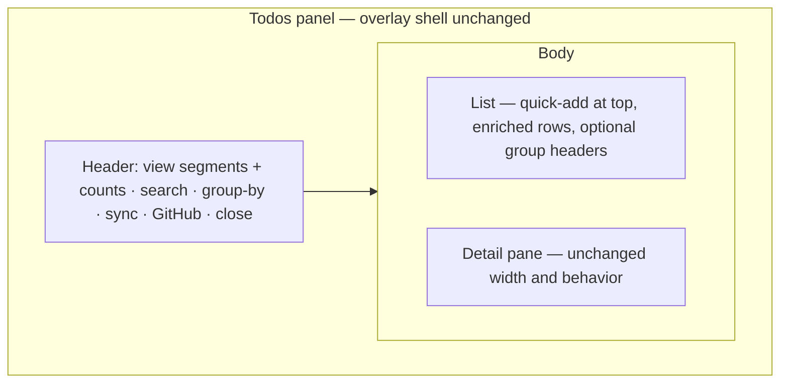
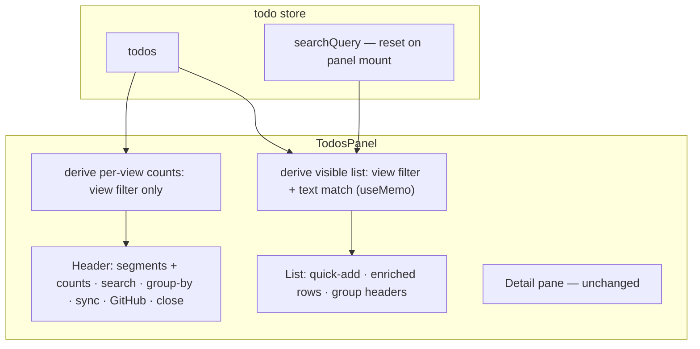

# Todos Panel Top-Bar Layout - Plan

## Goal Capsule

- **Objective:** Restructure the todos panel from a three-column desktop-style layout into a top-bar modern task list — remove the left view rail, move smart views into a header segmented control with counts, give the list full width with information-rich rows, wire header search, and keep the detail pane docked on the right.
- **Product authority:** This Product Contract is the authority for the panel's layout and product behavior; implementation decisions live in the Planning Contract.
- **Execution:** code, four implementation units (U1 → U2/U3 → U4).
- **Stop conditions:** stop and surface if a change would touch the overlay shell, other panels, the detail pane's editing behavior, or any server code — those are explicit scope boundaries.
- **Open blockers:** None.

---

## Product Contract

### Summary

Rebuild the todos panel as a top-bar layout: the left rail is removed, smart views become a segmented control in the header, the list goes full width with rows that surface due dates, labels, and origin, and the detail pane stays on the right. Implementation composes existing primitives — a hand-rolled segmented control modeled on the repo's pill tablist, `ui/badge` for row badges, the SessionList search-input pattern — with no new dependencies. The visual language moves toward the modern list aesthetic of Todoist/Linear: restrained borders, no box-in-box nesting, clear hierarchy.

### Problem Frame

The panel became a first-class task manager in the 2026-07-27/28 plans, but its presentation still reads like legacy desktop software. The left rail occupies 176px of permanent width yet carries only four view buttons and one group-by select — the worst information-per-pixel ratio in the panel. List rows show only a checkbox, the title, and a GH badge, so due dates, labels, and sync origin are invisible without opening the detail pane. The user's verdict: the rail eats space with very low information value, and the whole layout feels dated rather than modern.

Two structural facts sharpen the picture. The store already implements text search (`searchQuery`/`getFilteredTodos`) but no component consumes it, so search is a finished capability missing only its UI. And `dueDate` has no setter anywhere in the client — the detail pane renders it display-only — which means the Today and Upcoming smart views are effectively always empty today.

Planning-time flow analysis surfaced three pre-existing frictions this work also addresses. The panel's global Escape listener closes the panel even when the user is typing in an input. The store's general `error` field is rendered nowhere, so a failed fetch presents as an empty list. And every sync swaps the whole list for a spinner, losing scroll position.

### Key Decisions

- **Top-bar layout over slim icon rail and single-column immersion** (session-settled: user-directed — chosen over a 56px icon rail with view counts and a Things-style immersive single column: maximizes list width and space efficiency). The user picked the top-bar form from three wireframe directions.
- **Row enrichment is display-only** (session-settled: user-approved — rows surface existing data; no new setters: keeps this a layout change rather than a feature expansion). Due dates and labels render when present; nothing adds editing entry points for them.
- **Search scopes to the active view** (session-settled: user-approved — proposed default, confirmed: keeps search semantics aligned with the view the user is looking at). A global-across-views search remains possible later without reworking this.
- **View counts ride on the segmented control** (session-settled: user-approved — the one element carried over from the icon-rail option: near-zero cost, restores the at-a-glance view sizes the rail used to imply). Counts are full-view totals and do not change under search filtering.
- **Overlay shell unchanged** — the full-screen overlay card form and mount/dismiss behavior settled by `docs/plans/2026-07-28-001-feat-todos-full-canvas-plan.md` stay; this work changes only the panel's interior.
- **Search interaction rules** (user-approved — confirmed at planning: flow analysis found the brainstorm silent on these). Escape inside the search input clears then blurs and never closes the panel; the query resets on panel open and persists across in-session view switches; quick-add clears a search that would hide the new todo.
- **State honesty fixes are in scope** (user-approved — confirmed at planning). The empty state splits into view-empty / no-results / load-failure, and refetch no longer blanks the list.

### Requirements

**Layout structure**

- R1. Remove the left view rail; the panel body becomes two regions — the full-width list and the right detail pane, which keeps its current width and behavior.
- R2. Smart views (Inbox / Today / Upcoming / All) move to a segmented control in the panel header; each segment shows that view's todo count as a full-view total unaffected by search filtering.
- R3. The header retains all current capabilities — sync (with in-flight spinner), GitHub connect, close — plus the segmented view control, a search input, and the group-by dropdown.
- R4. Group-by (none / workspace / repo / origin) moves from the rail into a header dropdown; grouped section headers continue to render inside the list.

**List rows**

- R5. Rows render, when present: a done checkbox, the title, a due-date badge, label chips, and an origin badge for GitHub todos, plus the hover-revealed delete action; all badges are display-only with no inline editors.
- R6. The checkbox adopts a modern circular style; done rows keep the struck-through, de-emphasized title treatment.
- R7. The quick-add input lives at the top of the list (Enter to create), visually integrated with the list rather than reading as a separate bar.

**Search**

- R8. A search input in the header filters the list by title text within the currently active view, wired to the store's existing `searchQuery`/`getFilteredTodos`.
- R12. Escape pressed inside the search input clears the query first and blurs second; it never closes the panel, and the panel-level Escape handler ignores events originating in text inputs.
- R13. The search query resets when the panel opens and persists across view switches within a panel session.
- R14. When quick-add creates a todo that the active search would hide, the search clears so the new todo is visible.

**Visual language and states**

- R9. The panel's visual language is modernized toward the Todoist/Linear list aesthetic: restrained borders and dividers, no box-in-box nesting, and a clear typographic hierarchy.
- R10. The sync-error strip, loading state, and empty state are retained and restyled to the new visual language.
- R11. All new user-facing strings (search placeholder and clear affordance, no-search-results copy, load-failure copy, view-count accessibility text) are added to both the `en` and `zh-CN` todos namespaces.
- R15. The empty state splits into three: view genuinely empty, no results for the active search (echoing the query with a clear action), and load/sync failure (rendering the store's `error` field).
- R16. Refetching while todos are already loaded (panel-open auto-sync, manual sync) keeps the list rendered; the syncing indication lives in the header, and a full-list spinner appears only on initial load.

Behavioral paths (add, toggle, select, edit, sync, conflict resolution, spawn session) are unchanged from the current panel; the only new interaction is header search, specified by R8/R12–R14 — so no Key Flows section.

### Acceptance Examples

- AE1.
  - **Covers R5.** Given a GitHub-origin todo due tomorrow with two labels, when the row renders, then it shows the due badge, both label chips, and the origin badge; a local todo with no due date or labels shows no badges and no empty placeholders.
- AE2.
  - **Covers R2.** Given no todos carry due dates, when the panel renders, then the Today and Upcoming segments still appear with a count of 0 and remain selectable.
- AE3.
  - **Covers R4, R8.** Given grouping by workspace and an active search text, when results render, then section headers group only the matching todos.
- AE4.
  - **Covers R12.** Given the search input has focus and contains text, when the user presses Escape, then the query clears and the panel stays open; given the query is already empty, Escape blurs the input; Escape outside text inputs closes the panel as today.
- AE5.
  - **Covers R13.** Given the user searched for "bug" and closed the panel, when the panel reopens, then the search is empty and the list unfiltered; switching views within a session keeps the query.
- AE6.
  - **Covers R14.** Given an active search for "xyz", when the user quick-adds a todo titled "fix bug", then the search clears and the new todo is visible in the list.

### Success Criteria

- The list is the visual protagonist: no persistent left rail, and the space it occupied belongs to the list.
- A user can tell a todo's origin, due date, and labels from the row without opening the detail pane.
- Every capability the panel has today — views, grouping, add, sync, GitHub connect, detail editing including conflict review and spawn session, Escape/backdrop dismiss — still works after the restructure.
- Search never silently filters: reopening the panel always starts unfiltered, and load failures are visible as failures.

### Scope Boundaries

- No UI for publish / pull / comments — the server routes exist, but surfacing them is feature work, not a layout adjustment.
- No due-date or label setters anywhere; rows and the detail pane stay display-only for these fields.
- The overlay shell, mount/dismiss behavior, and visual consistency with the Settings/Analytics overlays are out of scope.
- Detail pane editing behavior (explicit save, markdown editor, conflict review, spawn session) is unchanged.
- No backend changes: sync engine, routes, and data model stay as they are.

#### Deferred to Follow-Up Work

- A minimal due-date setter (e.g., in the detail pane) — Today/Upcoming stay near-empty until one exists.
- Surfacing `originDeleted` on rows for GitHub todos whose issue was deleted upstream.
- Remembering the last active view/group-by across panel opens.
- Visual treatment for `discard`-status rows (they currently render like pending).
- Relative date phrasing ("Today"/"Tomorrow") on the due badge.

### Dependencies / Assumptions

- Search builds on the store's existing `searchQuery`/`getFilteredTodos` (title-text match), currently present but unconsumed by any component — verified in `src/client/stores/todo-store.ts`.
- Labels and assignee arrive only via GitHub sync (collaborative state, accept-remote); local todos have no labels today, so label chips will appear mainly on GitHub-origin todos.
- `dueDate` exists in the model and drives the smart views, but has no client setter anywhere (display-only in the detail pane) — verified.

### Sources / Research

- Current implementation: `src/client/components/TodosPanel.tsx` (panel, rows, grouping, smart-view filter), `src/client/components/todos/TodosRail.tsx` (176px rail, zero external consumers), `src/client/components/todos/TodoDetail.tsx` (detail pane), `src/client/stores/todo-store.ts` (store incl. unused search).
- Patterns to follow: `src/client/components/RightPanelContent.tsx` (pill tablist with roving tabindex — model for the segmented control), `src/client/components/SessionList.tsx` (header search input and Escape clear-then-blur behavior), `src/client/components/SettingsPanel.tsx` / `src/client/components/AnalyticsPanel.tsx` (sibling overlay header pattern), `src/client/components/ui/badge.tsx` (row badges), `src/client/components/ui/select.tsx` (group-by dropdown), `src/client/components/FileExplorer.tsx` (no-results copy echoing the query).
- Prior plans this one builds on: `docs/plans/2026-07-27-001-feat-top-level-todos-github-sync-plan.md` (first-class panel, smart views), `docs/plans/2026-07-28-001-feat-todos-full-canvas-plan.md` (overlay shell), `docs/plans/2026-07-29-001-feat-todos-content-field-plan.md` (detail editing).
- Visual-language references: Todoist, Linear (segmented navigation, list density, restrained chrome); Things 3 was considered and set aside with the immersive single-column direction.
- Verified code facts: search capability unconsumed in the client; publish/pull/comments routes have zero client callers; due dates are display-only in the client; `getFilteredTodos` is a non-reactive getter matching only the title; `searchQuery` is store-global with no reset; the store's `error` field has no consumers.
- Repo conventions: `docs/solutions/conventions/commit-plan-and-brainstorm-files-with-code-changes.md` (this plan file ships in the same commit or an adjacent docs commit as the implementation).

---

## Planning Contract

Product Contract preservation: changed — R11's string list extended; R12–R16 and AE4–AE6 added for flow-analysis interaction gaps (confirmed with the user during planning); the narrow-width Outstanding Question is resolved by KTD4 and the section removed. R1–R10 and all Key Decisions are unchanged.

### Key Technical Decisions

- **KTD1. Hand-rolled segmented control modeled on the repo's pill tablist** (session-settled: user-directed — chosen over a slim icon rail and an immersive single column: maximizes list width; instantiates the Product Contract's top-bar decision). `src/client/components/RightPanelContent.tsx` provides the closest pattern — `role="tablist"` tabs with `aria-selected` and arrow-key roving tabindex — composed with `cn()` and theme tokens; no new Radix dependency.
- **KTD2. Counts mirror the existing view-filter semantics exactly.** A segment's count equals the rows that view shows today (done and discarded included, per `filterByView`), so the number never disagrees with the list; the alternative — excluding discarded todos from counts and views — was rejected as a filtering-semantics change disguised as a layout tweak.
- **KTD3. Search derives in the component, not the store getter.** `getFilteredTodos` is a non-reactive plain getter, so the panel subscribes to `todos` and `searchQuery` and composes text match with the view filter in a `useMemo`; the panel resets the store-global query on mount (R13) because nothing else clears it.
- **KTD4. Header aligns to the sibling overlay pattern; narrow widths wrap, never an overflow menu.** The header adopts the Settings/Analytics metrics (`h-14 px-6 border-b border-border/50`), drops the redundant "Todos" title, and on narrow widths wraps secondary controls to a second row with the search input full-width — resolving the brainstorm's deferred narrow-width question.
- **KTD5. Modernization uses existing theme tokens only.** Restrained `border-border/50` dividers and recessed `bg-surface/30` panes replace box-in-box containers; no new tokens, and other overlays are untouched.
- **KTD6. Row badges reuse `ui/badge`; chips cap at two with a "+n" overflow.** The due badge renders the calendar-date portion only; relative phrasing is deferred polish.

### High-Level Technical Design

The panel's data flow makes one structural point: the visible list composes view filter and text match, while segment counts use the view filter alone.

---

## Implementation Units

### U1. Header restructure and rail removal

**Goal:** Replace the left rail with the header top-bar — segmented view control with counts, group-by dropdown, search input, quick-add integrated at the list top — and align the header to the sibling overlay pattern.

**Requirements:** R1, R2, R3, R4, R7; covers AE2; implements KTD1, KTD2, KTD4

**Dependencies:** none

**Files:**
- `src/client/components/TodosPanel.tsx` — restructure; host the moved `SmartView`/`GroupBy` types (or a small sibling types module)
- `src/client/components/todos/TodosRail.tsx` — delete (zero external consumers, verified)
- `src/client/components/TodosPanel.test.tsx` — update
- `src/client/i18n/en/todos.json`, `src/client/i18n/zh-CN/todos.json` — segment count accessibility text, search placeholder

**Approach:** The segmented control renders the four existing view-label i18n keys with counts derived from the view filter over `todos`, independent of search (KTD2). Group-by adopts the Radix `ui/select` wrapper (jsdom pointer-capture polyfills already exist in `vitest.setup.ts`). The search input follows the SessionList markup (leading icon, conditional clear button); wiring lands in U2. Quick-add moves from the standalone bar into the list region's top row. Header drops the "Todos" title and takes the sibling metrics; on narrow widths secondary controls wrap to a second row with search full-width (KTD4).

**Patterns to follow:** `RightPanelContent.tsx` pill tablist (roles, aria, roving tabindex); `SettingsPanel.tsx`/`AnalyticsPanel.tsx` header; `SessionList.tsx` search input; `ScheduledTaskForm.tsx` Select usage.

**Test scenarios:**
- Renders four segments with counts; clicking a segment switches the list (happy path).
- Covers AE2. With no due dates set, Today and Upcoming show count 0 and remain selectable (edge).
- Counts equal the rows each view shows, including done and discarded todos (KTD2 semantics).
- Group-by dropdown switches grouping and section headers render as before (regression).
- The rail is absent; sync, GitHub connect, and close buttons still work (regression).

**Verification:** Component tests pass; the rail file is gone; views and grouping work through the header exactly as they did through the rail.

### U2. Search behavior and lifecycle

**Goal:** Wire header search end-to-end with the confirmed interaction rules — view-scoped filtering, safe Escape, mount reset, in-session persistence, and quick-add visibility.

**Requirements:** R8, R12, R13, R14; covers AE4, AE5, AE6; implements KTD3

**Dependencies:** U1

**Files:**
- `src/client/components/TodosPanel.tsx` — derivation, Escape handling, mount reset, quick-add interplay
- `src/client/components/TodosPanel.test.tsx` — update

**Approach:** Subscribe to `todos` and `searchQuery`; compose the text match with the active view filter in a `useMemo` (KTD3). On panel mount, reset the query (R13); do not reset on view switch. The panel-level Escape listener ignores events originating in text inputs; the search input's own Escape clears the query, then blurs on a second press (SessionList behavior, R12). On successful quick-add, clear the query only when the new todo's title does not match it (R14). If a dedicated store test file is added for the composition semantics, register it explicitly in `vitest.jsdom.config.ts` — store tests are enumerated by filename, not globbed.

**Patterns to follow:** `SessionList.tsx` Escape clear-then-blur and reset-on-open behavior.

**Test scenarios:**
- Typing filters the list within the active view; in the All view it behaves as a global title match (happy path).
- Covers AE4. Escape with text clears and keeps the panel open; Escape with an empty query blurs; Escape outside inputs still closes the panel (edge + regression).
- Covers AE5. Query persists across view switches, and a close/reopen cycle starts unfiltered (edge).
- Covers AE6. Quick-add whose title misses the active query clears it and shows the new todo; a matching add keeps the query (happy path + edge).

**Verification:** Component tests pass; manual smoke of the four search flows.

### U3. Enriched todo rows

**Goal:** Rows surface due date, labels, and origin at a glance, with the modern circular checkbox.

**Requirements:** R5, R6; covers AE1; implements KTD6

**Dependencies:** U1

**Files:**
- `src/client/components/TodosPanel.tsx` — `TodoRow` rework (extract to `src/client/components/todos/TodoRow.tsx` if the panel file grows unwieldy)
- `src/client/components/TodosPanel.test.tsx` — update

**Approach:** Badges compose `ui/badge` variants: due date (calendar-date portion only), label chips (cap two, then "+n"), and the origin badge replacing the current text "GH" marker. The checkbox becomes circular with an accent fill when done; the struck-through de-emphasized done title and hover-revealed delete stay. All badges render conditionally — no empty placeholders (R5).

**Patterns to follow:** `ui/badge.tsx` variants; existing row interactions in `TodosPanel.tsx`.

**Test scenarios:**
- Covers AE1. A GitHub todo with a due date and two labels renders all three badge kinds; a bare local todo renders none (happy path + edge).
- A todo with four labels renders two chips plus "+2" (edge).
- Done rows keep strikethrough and the circular checkbox shows filled; toggling still flips status (regression).

**Verification:** Component tests pass; rows read correctly in both light and dark themes.

### U4. States, chrome modernization, and i18n finish

**Goal:** Split the empty state into three honest states, stop refetch from blanking the list, and complete the token-level visual modernization of the panel chrome.

**Requirements:** R9, R10, R11, R15, R16; covers AE3; implements KTD5

**Dependencies:** U1, U2, U3

**Files:**
- `src/client/components/TodosPanel.tsx` — states, chrome, loading behavior
- `src/client/components/todos/TodoDetail.tsx` — chrome harmonization only (divider/background; no behavior change)
- `src/client/i18n/en/todos.json`, `src/client/i18n/zh-CN/todos.json` — no-results and load-failure copy
- `src/client/components/TodosPanel.test.tsx` — update

**Approach:** Empty states: view-empty reuses the existing `empty` string; no-results follows the FileExplorer pattern (echo the query, offer a clear action); load/sync failure renders the store's `error` field with new copy (R15). The full-list spinner shows only when no todos are loaded yet; once the list has content, syncing indication stays in the header (R16). Chrome: replace boxed inner containers with `border-border/50` dividers and recessed `bg-surface/30` surfaces (KTD5); the sync-error strip is retained and restyled (R10). Group headers render only for groups with matching rows under an active search (AE3 — already the behavior; pin it with a test).

**Patterns to follow:** `FileExplorer.tsx` no-results copy; existing sync-error strip dismissal.

**Test scenarios:**
- View with zero todos shows the view-empty state; an active search with zero matches shows the no-results state with the query echoed and a clear action (happy path for R15).
- A fetch failure renders the load-failure state from the store's `error` field (error path).
- Covers AE3. Under grouping plus search, section headers appear only for groups with matches (integration).
- With todos loaded, triggering sync keeps the list rendered and shows only the header indication; with none loaded, the spinner shows (R16, edge).
- New keys exist in both locales with exact parity (i18n regression).

**Verification:** Component tests and lint pass; manual smoke of all three states and the sync flow.

---

## Verification Contract

- `npm run lint` — clean.
- `npm run test:client` — jsdom suite green, including the updated `TodosPanel.test.tsx` and todos component tests. If a `todo-store` test file is added, it must be registered in `vitest.jsdom.config.ts`'s explicit include list first.
- Manual smoke (no automated coverage): open/close via header button, Escape, and backdrop; switch views and check counts; all four search flows (filter, Escape, reopen reset, quick-add visibility); grouping with and without search; quick-add; toggle and delete; sync with GitHub connected (list stays rendered); sync-error strip dismissal; detail editing regression (title/content save, conflict review, spawn session); narrow-window header wrap; dark theme spot-check.

## Definition of Done

- All four units landed; Verification Contract green.
- Existing panel tests updated where behavior intentionally changed (Escape-from-inputs, loading-on-refetch); no other regressions.
- New i18n keys present with exact en/zh-CN parity.
- Manual smoke checklist completed, including dark theme.
- Abandoned-approach code (unused components, dead styles from the rail era) removed from the diff.
- This plan file is committed alongside the implementation (or in an adjacent docs commit), per `docs/solutions/conventions/commit-plan-and-brainstorm-files-with-code-changes.md`.
