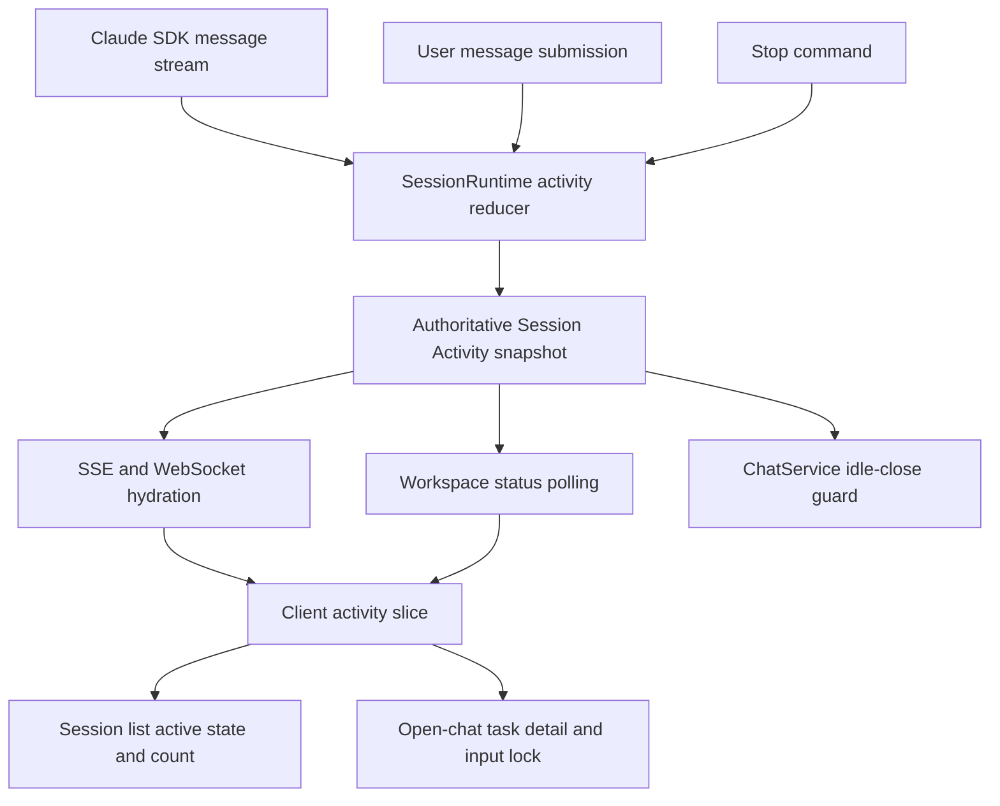
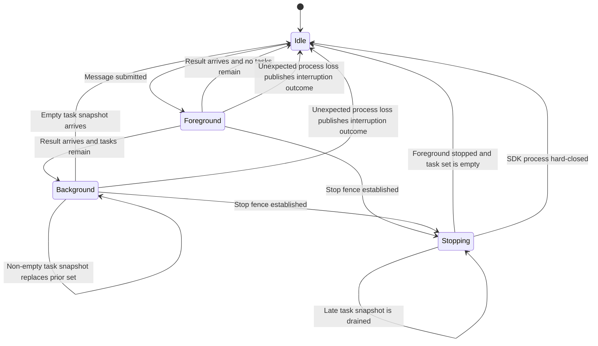
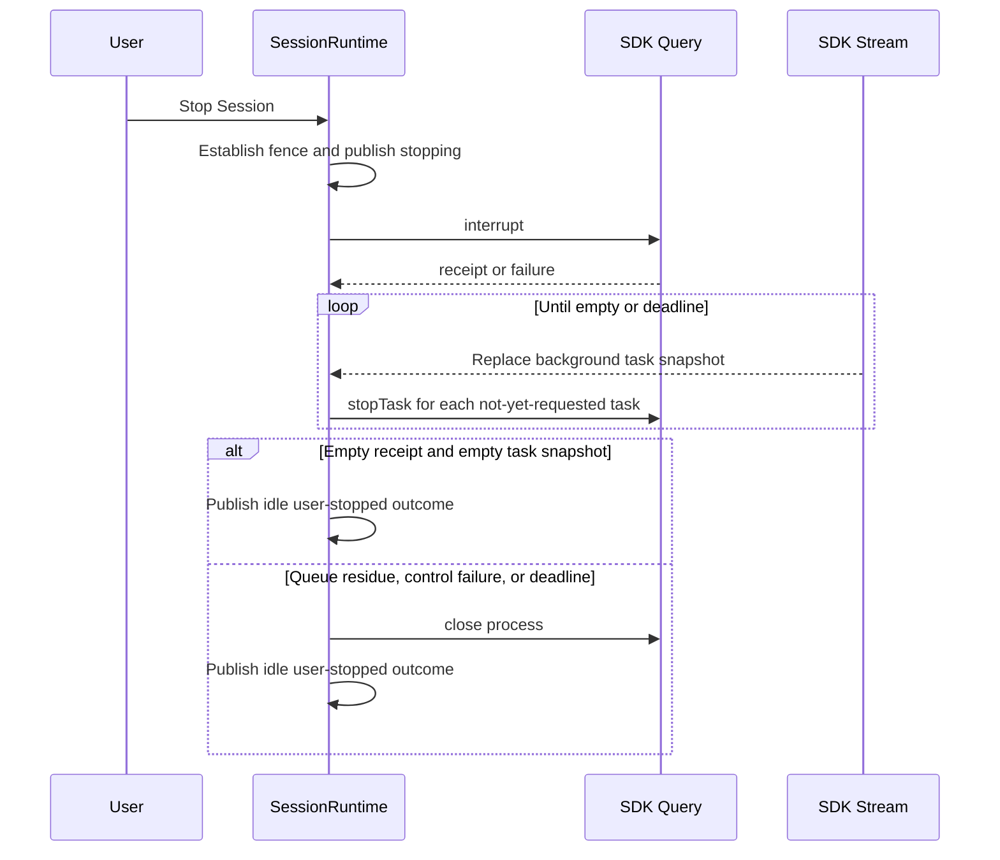

# Claude SDK Session Activity - Plan

## Goal Capsule

- **Objective:** Make Session activity represent all work owned by the Claude Code Agent SDK process, including foreground turns and every SDK background task, so status, Stop behavior, and runtime retention remain truthful.
- **Product authority:** The Product Contract below, confirmed in the 2026-07-30 brainstorm.
- **Execution profile:** Replace the edge-derived processing boolean with one server-owned activity snapshot, then project it through retention, transport, client state, and UI.
- **Stop conditions:** Do not ship if a main-agent result can hide live SDK tasks, Stop can leave queued or late work alive, reconnect can hydrate stale activity, or idle close can interrupt active work.
- **Tail ownership:** The implementation owns focused server and client regressions, full type/build checks, and removal of superseded activity-tracking code. Release packaging is unchanged.

---

## Product Contract

### Summary

Introduce one server-owned Session Activity model whose foreground state begins at message submission and whose background state mirrors the Claude Agent SDK's complete background-task snapshot.
The same model drives active presentation, input locking, task summaries, Stop behavior, reconnect hydration, and idle-close eligibility.

### Problem Frame

The current Session lifecycle is inferred from events that arrive after work has already begun.
A foreground turn does not become active until `assistant_start`, so Stop can miss the interval between message submission and the first SDK response.
The main agent's `result` ends the foreground turn even when async sub-agents or other SDK background tasks remain alive.

Background membership is also reconstructed from `task_started`, tool-result confirmations, task updates, terminal events, and ordering guards.
If that reconstruction misses or misorders an edge, the UI can look idle and the idle reaper can close the SDK process while work is still running.
The user then sees neither the continuing work nor a clear explanation that closing the runtime interrupted it.

### Actors

- A1. **User** submits work, observes foreground and background progress, and can stop the whole Session.
- A2. **Session runtime** owns the unified activity verdict and prevents runtime close while work exists.
- A3. **Claude Code Agent SDK process** owns the authoritative set of live background tasks and emits foreground results and process failures.

### Key Decisions

- **Use a unified Session Activity model.** (session-settled: user-directed - chosen over a patched processing boolean and a generic activity-lease system: explicit phases keep foreground, background, stopping, and interruption consistent.) Governs R1-R10.
- **Every SDK background task keeps the Session active.** (session-settled: user-directed - chosen over tracking only async sub-agents or a known-type allowlist: unknown future task types must not make active work look idle.) Governs R4-R8, R16.
- **Keep input locked while background work remains.** (session-settled: user-directed - chosen over starting or queuing another foreground turn: the Session preserves one serialized active timeline.) Governs R6, R9.
- **Show count in the Session list and live task details in the open chat.** (session-settled: user-directed - chosen over a generic Generating label, count-only presentation everywhere, and detailed rows in the Session list: users get scannable navigation plus enough detail where they are working.) Governs R7-R8.
- **Stop drains the entire Session to zero.** (session-settled: user-directed - chosen over foreground-only, selective, or point-in-time snapshot stopping: no submitted turn or newly appearing background task may survive the command.) Governs R11-R15.
- **Runtime failure is visible interruption.** (session-settled: user-directed - chosen over silent idle or automatic recovery: users must know that unfinished background work was terminated.) Governs R16.
- **Background completion restarts the full idle grace period.** (session-settled: user-directed - chosen over immediate close or a shortened grace period: users retain the normal reconnection window after final output.) Governs R17.

### Requirements

**Activity authority and lifecycle**

- R1. The Session runtime must publish one authoritative activity snapshot that identifies the current phase, whether the Session is active, and the live background-task collection.
- R2. Submitting a user message must make the foreground phase active before any response event arrives from the SDK.
- R3. A foreground `result` ends only the foreground phase and must not clear Session activity while another activity source remains.
- R4. Each SDK `background_tasks_changed` message must replace the runtime's complete background-task collection rather than merge with locally paired start and terminal edges.
- R5. The background collection must reset to empty whenever a new Claude CLI process starts because the SDK level signal is process-scoped and emits no startup snapshot.
- R6. The Session remains active while a foreground turn, pending interaction, stopping operation, or any SDK background task exists; it becomes idle only when all are absent.

**Presentation and hydration**

- R7. During background-only activity, the Session list must show active state and task count, while the open chat shows each live task's SDK type and description.
- R8. Unknown SDK task types must use a generic background-task label while still appearing in the live detail and active count.
- R9. User input remains locked for every active phase and unlocks only after the Session becomes idle or records an interrupted outcome.
- R10. A newly connected or reconnected client must receive the current activity snapshot without reconstructing it from transcript replay.

**Immediate whole-Session Stop**

- R11. Clicking Stop must immediately enter the stopping phase, block further submissions, and begin cancelling submitted foreground work even when no SDK response event has arrived.
- R12. Stop must interrupt the foreground turn and stop every task in the latest SDK background collection.
- R13. While stopping, each background task that appears in a later SDK snapshot must also be stopped.
- R14. Stopping completes only after foreground work cannot run and the SDK background collection is empty.
- R15. If graceful SDK controls cannot guarantee that queued or background work has stopped, the runtime must terminate the affected SDK process so no work survives the Stop command.

**Failure and retention**

- R16. If the SDK message loop or CLI process exits unexpectedly while the Session is active, the Session must become inactive with a visible interrupted outcome that identifies unfinished background work as interrupted.
- R17. Idle close must never close an active or stopping Session; when the final activity source clears without subscribers, a new full idle grace period begins from that transition.

### Key Flows

- F1. Foreground result with background work
  - **Trigger:** The main agent emits a result while the SDK background snapshot is non-empty.
  - **Actors:** A2, A3.
  - **Steps:** The foreground phase ends; the background snapshot remains authoritative; the Session stays active and input stays locked; later SDK snapshots replace the task summary until an empty snapshot arrives.
  - **Outcome:** The Session becomes idle only after all SDK work settles.
  - **Covers:** R3-R10.
- F2. Stop before the first SDK event
  - **Trigger:** The user clicks Stop after message submission but before `assistant_start` or another response event.
  - **Actors:** A1, A2, A3.
  - **Steps:** The Session enters stopping immediately; the submitted work is interrupted; queued-work receipts and live task snapshots are checked; the process is terminated if graceful controls cannot prove zero work.
  - **Outcome:** No queued turn or background task survives and the Session records a user stop.
  - **Covers:** R2, R11-R15.
- F3. Runtime failure during background work
  - **Trigger:** The SDK process or message loop exits while the background snapshot is non-empty.
  - **Actors:** A2, A3.
  - **Steps:** The runtime captures the unfinished work before resetting process-local state; clients receive an interrupted outcome instead of a normal idle transition.
  - **Outcome:** The user can see that background work did not complete.
  - **Covers:** R5, R10, R16.
- F4. Last background task finishes off-screen
  - **Trigger:** The final background task completes while no client is subscribed.
  - **Actors:** A2, A3.
  - **Steps:** The empty SDK snapshot ends Session activity; the complete idle grace period starts at that transition; reconnecting during the grace period hydrates the idle snapshot and completed transcript.
  - **Outcome:** Final events remain available without retaining the runtime indefinitely.
  - **Covers:** R4, R10, R17.

### Acceptance Examples

- AE1. Main result does not end the Session
  - **Given:** A foreground turn and two live SDK background tasks.
  - **When:** The main result arrives.
  - **Then:** Foreground activity ends but the Session remains active with two task summaries and locked input.
  - **Covers:** R3, R6-R9.
- AE2. Level snapshots replace task membership
  - **Given:** A local snapshot containing tasks A and B.
  - **When:** The SDK sends a snapshot containing only B.
  - **Then:** The runtime replaces its collection with B without waiting for a terminal edge for A.
  - **Covers:** R4.
- AE3. Unknown task type remains active
  - **Given:** A snapshot containing an unrecognized task type.
  - **When:** It is displayed.
  - **Then:** The Session remains active and the task appears with a generic type label and its SDK description.
  - **Covers:** R6-R8.
- AE4. Stop works before first response
  - **Given:** A submitted message and no SDK response yet.
  - **When:** The user clicks Stop.
  - **Then:** Stopping begins immediately and that message cannot proceed to an active model turn after Stop completes.
  - **Covers:** R2, R11, R15.
- AE5. New task cannot escape Stop
  - **Given:** Stopping is in progress.
  - **When:** A later SDK snapshot introduces task C.
  - **Then:** Task C is stopped and the Session does not leave stopping until the snapshot is empty or the process is terminated.
  - **Covers:** R12-R15.
- AE6. Runtime loss is not normal completion
  - **Given:** A non-empty background snapshot.
  - **When:** The SDK process exits unexpectedly.
  - **Then:** Active clears and the UI records that the unfinished tasks were interrupted.
  - **Covers:** R5, R16.
- AE7. Final task resets idle grace
  - **Given:** No client is subscribed and the previous grace interval elapsed while background work kept the Session active.
  - **When:** The final task settles.
  - **Then:** A new full grace interval begins and the runtime is not closed immediately.
  - **Covers:** R17.
- AE8. Reconnect during background-only activity
  - **Given:** The main result already arrived and background tasks remain.
  - **When:** A client reconnects.
  - **Then:** One current snapshot restores active state, locked input, task count, and task summaries without relying on replayed start events.
  - **Covers:** R7-R10.

### Scope Boundaries

- Claude Code Agent SDK is the active scope; foreground behavior remains compatible with other backends, but OpenCode background-task parity is not included.
- Selective task stop, foreground-only stop, and allowing another user turn during background activity are excluded.
- Historical completed-task browsing is unchanged; this plan adds a live summary only for work that currently keeps the Session active.
- SDK task edge events may remain for transcript and task-history presentation, but they are not retained as a second authority for Session activity.

#### Deferred to Follow-Up Work

- Provider-neutral activity leases and OpenCode background-task discovery remain separate design work.

### Dependencies / Assumptions

- The repository is pinned to `@anthropic-ai/claude-agent-sdk` `0.3.217`, whose `background_tasks_changed` contract provides replace semantics for the full process-local task set.
- The SDK exposes task IDs through the level snapshot and `stopTask(taskId)` for graceful task termination.
- UUID-stamped user messages are visible in `interrupt_receipt_v1` receipts when queued; an absent receipt or non-empty `still_queued` list cannot prove that all submitted work stopped.
- The public SDK exposes `interrupt()`, `stopTask()`, and `close()`. The internal `cancelAsyncMessage` implementation is not a supported integration surface.
- Closing the SDK query terminates its CLI process and pending work; a later user message may recreate the runtime under the existing Session identity.

### Sources / Research

- SDK task-level signal and process-reset contract: `node_modules/@anthropic-ai/claude-agent-sdk/sdk.d.ts` (`SDKBackgroundTasksChangedMessage`).
- SDK interrupt receipt, task stop, and query close contracts: `node_modules/@anthropic-ai/claude-agent-sdk/sdk.d.ts` (`Query`, `SDKControlInterruptResponse`).
- Current foreground marker, edge-derived task registry, and Stop path: `src/server/services/session-runtime.ts`.
- Current runtime retention: `src/server/services/chat-service.ts`.
- Current client processing projection and reconnect handling: `src/client/stores/chat-store.ts`.
- Reconnect state must be identity-guarded and followed by authoritative hydration: `docs/solutions/integration-issues/sse-subscription-race-condition-2026-05-21.md` and `docs/solutions/integration-issues/sse-stream-resume-on-reconnect-2026-05-18.md`.

---

## Planning Contract

### Key Technical Decisions

- KTD1. **Own one immutable activity snapshot in `SessionRuntime`.** Derive phase with `stopping > foreground > background > idle` precedence and treat pending approval or question state as foreground activity. This gives every consumer the same verdict and implements R1-R6.
- KTD2. **Ingest the SDK level signal directly in the runtime message loop.** Replace the task map on every `background_tasks_changed` message and reset it at process start or exit. Keep task edge parsing only for transcript/history features. This implements R4-R5 without timing correlation.
- KTD3. **Establish foreground ownership synchronously at submission.** Stamp each SDK user message with a UUID, mark foreground active before pushing it to the SDK input, and clear that ownership only on result, deliberate interruption, or process failure. This implements R2-R3 and makes pre-response Stop observable.
- KTD4. **Publish `session_activity` as a level snapshot.** Replace `session_processing` with a transport event carrying phase, active verdict, complete live task summaries, and optional terminal interruption context. Emit only when the snapshot changes during normal flow, then force-emit the current snapshot after replay on every SSE or WebSocket subscription. This implements R7-R10 and R16.
- KTD5. **Use a fenced, idempotent whole-Session Stop.** (session-settled: user-directed - chosen over a point-in-time task snapshot: tasks that appear after Stop begins must not escape.) Set the stopping fence before any SDK await, reject new submissions, interrupt unconditionally, and stop every task observed while the fence is active. This implements R11-R14.
- KTD6. **Bound graceful Stop by one two-second wall-clock deadline.** Hard-close immediately when interrupt lacks a trustworthy empty receipt, reports queued work, throws, or any task stop fails; otherwise hard-close if the authoritative task set has not reached zero by the deadline. Late snapshots share the original deadline and cannot extend it. This implements R13-R15 and favors prompt termination over preserving the current process.
- KTD7. **Classify process loss before clearing process-local state.** Capture the current foreground and task summaries, distinguish deliberate Stop/close from unexpected loop loss, and publish one inactive interrupted outcome for unexpected loss. This implements R5 and R16 without misreporting normal completion.
- KTD8. **Drive runtime retention from activity and subscriber transitions.** Cancel idle close while activity is active or any client remains subscribed. Schedule a fresh full grace period when the runtime is both inactive and unsubscribed, whether activity settled before unsubscribe or unsubscribe happened after settlement. The timer callback still rechecks both facts before closing. This implements R17 without periodic grace erosion or subscriber-dependent leaks.
- KTD9. **Project the server snapshot into one client slice.** Store phase, task summaries, and interruption outcome together, and derive legacy `isStreaming`, list status, composer lock, and unread completion behavior from that slice. Polling for unsubscribed Sessions returns the same snapshot shape as live subscription events.
- KTD10. **Keep navigation compact and put detail at the work surface.** Pass task count to `SessionListItem`; render type and description in a compact open-chat status region near the composer. Map known task types to localized labels and use a generic label for unknown values. This implements R7-R9.

### High-Level Technical Design

#### Activity authority and projections

The runtime reducer is the only owner of activity membership. Transport, retention, and UI are projections and must not infer missing task edges.

#### Runtime activity state machine

Phase precedence prevents result or task events from overriding an active Stop fence. Interruption is a terminal outcome attached to an inactive snapshot, not another source of live work.

#### Stop protocol

The fence is established before the first SDK control request. A repeated Stop call joins the existing operation rather than starting a second drain.

### Sequencing

1. Establish the shared activity contract and runtime reducer before changing retention or UI consumers.
2. Add the Stop fence on top of the reducer so stopping has a stable phase and task source.
3. Update polling, retention, and client state to consume the same snapshot.
4. Add UI projections only after reconnect and off-screen hydration are covered.
5. Remove the old activity authority after all consumers have moved, while preserving transcript task events.

### System-Wide Impact

- **Runtime lifecycle:** Activity transitions now control process retention, so unexpected loop exit and deliberate close must be classified consistently.
- **Wire compatibility:** Server and client ship together, but replay can contain stale `session_processing` frames. The client must ignore the retired event once `session_activity` is authoritative, and forced post-replay hydration must win.
- **Backend compatibility:** Non-Claude backends keep foreground and pending-interaction semantics. They publish an empty background-task set unless their driver later gains an equivalent level signal.
- **Bot Sessions:** Existing turn-scoped bot Stop gates remain separate from the GUI whole-Session Stop unless their route already calls `stopAll()`.
- **Dirty-worktree coordination:** `src/client/stores/chat-store.ts`, `src/client/stores/chat-store.test.ts`, `src/client/components/SessionList.tsx`, and `src/client/components/SessionList.test.tsx` already contain unrelated edits. Implementation must preserve and integrate with them rather than replace them wholesale.

### Risks & Dependencies

- A CLI without `interrupt_receipt_v1` cannot prove queue emptiness. KTD6 intentionally chooses process termination in that case.
- Task snapshots and task edge events have unspecified relative ordering. Only the snapshot may mutate activity membership.
- A hard close ends the current query and requires lazy runtime recreation on the next user action. The close path must not emit an unexpected-failure outcome for this deliberate termination.
- Status polling is slower than live subscription. The Session list may update on the next poll for an unsubscribed Session, but the runtime remains protected immediately on the server.
- A stalled Stop must not leak timers, unresolved promises, or a stopping phase. Fake-timer coverage is required for the deadline and repeated Stop calls.

---

## Implementation Units

### U1. Authoritative server activity model

- **Goal:** Replace edge-derived processing state with a runtime-owned snapshot driven by synchronous foreground ownership and SDK background-task replace events.
- **Requirements:** R1-R6, R10, R16; F1, F3; AE1, AE2, AE6, AE8; KTD1-KTD4, KTD7.
- **Dependencies:** None.
- **Files:** `src/server/types/message.ts`, `src/server/services/session-runtime.ts`, `src/server/services/sse-emitter.ts`, `src/server/services/session-runtime.test.ts`, `src/server/services/sse-emitter.test.ts`.
- **Approach:**
  1. Define shared activity phase, task summary, and interrupted-outcome types plus the `session_activity` event.
  2. Add a single runtime reducer/snapshot comparison path and expose the current snapshot through status inspection.
  3. Mark foreground active before SDK input push, add a UUID to every submitted user message, and clear foreground ownership on result or interruption.
  4. Handle `background_tasks_changed` in `SessionRuntime` with replace semantics and process-local reset.
  5. Remove activity membership updates from candidate, confirmation, tombstone, and terminal-edge correlation. Preserve task transcript events that other UI features consume.
  6. Capture active work before unexpected message-loop exit and emit an inactive interrupted outcome.
- **Execution note:** Add characterization coverage for current foreground, reconnect, and transcript task behavior before removing the edge-derived registry.
- **Patterns to follow:** Centralized event emission and forced post-replay hydration in `SessionRuntime`; identity-safe reconnect behavior from `docs/solutions/integration-issues/sse-subscription-race-condition-2026-05-21.md`.
- **Test scenarios:**
  1. Foreground becomes active synchronously when `pushMessage` runs before the generator yields any SDK message.
  2. Covers AE1: a result with two live background tasks changes phase from foreground to background and keeps the active verdict true.
  3. Covers AE2: snapshots `[A, B]` then `[B]` replace membership without a terminal edge for A.
  4. A process restart begins with an empty task set and does not reuse the prior process's snapshot.
  5. A stale task terminal or start edge cannot change activity membership after snapshot authority is established.
  6. Covers AE8: replay followed by forced hydration ends with the current background-only snapshot for both SSE and WebSocket subscribers.
  7. Covers AE6: unexpected loop failure with foreground and tasks captures their summaries, clears active, and emits one interrupted outcome.
  8. Deliberate close does not produce an unexpected interrupted outcome.
  9. Non-Claude foreground result behavior remains active-to-idle with an empty task set.
- **Verification:** Server event consumers can obtain one current snapshot; no remaining processing verdict depends on correlating task edges.

### U2. Immediate fenced whole-Session Stop

- **Goal:** Make Stop observable immediately and guarantee that foreground, queued, existing background, and late background work cannot survive.
- **Requirements:** R11-R15; F2; AE4-AE5; KTD3, KTD5-KTD7.
- **Dependencies:** U1.
- **Files:** `src/server/services/session-runtime.ts`, `src/server/services/session-runtime.test.ts`, `src/server/routes/chat.ts`, `src/server/routes/chat.test.ts`.
- **Approach:**
  1. Establish an idempotent stopping operation and publish the stopping snapshot before awaiting SDK controls.
  2. Reject message submissions while the fence is active and invoke `interrupt()` even when no response event has arrived.
  3. Evaluate the interrupt receipt using the UUID-stamped submitted message and treat missing capability, queued UUIDs, or interrupt failure as unproven termination.
  4. Stop every task in each authoritative snapshot, including tasks introduced after Stop begins, with per-task request deduplication.
  5. Use one two-second deadline for the whole drain. Hard-close the query on unproven termination, task-stop failure, or deadline expiry.
  6. Resolve pending approvals, settle the operation once, and classify the resulting process exit as deliberate.
- **Execution note:** Implement the Stop state machine test-first with a controllable SDK query and fake timers; the existing late-task escape test must be reversed.
- **Patterns to follow:** Failure-isolated SDK control calls in the existing `stopAll()` tests; idempotent cleanup in `SessionRuntime.close()`.
- **Test scenarios:**
  1. Covers AE4: Stop before the first SDK event publishes stopping immediately, calls interrupt unconditionally, and prevents the queued UUID from running afterward.
  2. A trustworthy empty interrupt receipt plus no tasks settles gracefully without closing the process.
  3. A missing receipt, non-empty `still_queued`, or interrupt rejection hard-closes the process.
  4. Existing tasks are each stopped once even when equivalent snapshots repeat.
  5. Covers AE5: a task introduced after Stop begins receives `stopTask` and cannot escape the fence.
  6. A task introduced near the deadline does not extend the deadline; a non-empty snapshot at expiry hard-closes the process.
  7. A rejected `stopTask` hard-closes the process and the public Stop request still settles without an unhandled rejection.
  8. Repeated Stop calls join one operation, do not issue duplicate interrupts, and end in the same idle outcome.
  9. A submission attempted while stopping is rejected before entering the SDK input queue.
  10. Stop resolves pending approvals and leaves no active timers or task-stop bookkeeping.
- **Verification:** The HTTP Stop endpoint returns only after the Session is proven empty or its SDK process is closed, while subscribed clients see stopping before that completion.

### U3. Activity-driven retention and off-screen status

- **Goal:** Keep runtimes alive for every active phase and restart the complete idle grace period when final background work settles.
- **Requirements:** R1, R6-R7, R10, R17; F4; AE7-AE8; KTD8-KTD9.
- **Dependencies:** U1, U2.
- **Files:** `src/server/services/chat-service.ts`, `src/server/services/chat-service.test.ts`, `src/server/websocket/types.ts`, `src/server/websocket/server.ts`, `src/server/websocket/server.test.ts`.
- **Approach:**
  1. Replace generic per-event timer resets with explicit activity-transition and subscriber-transition callbacks.
  2. Track whether SSE or WebSocket subscribers retain the runtime, including replacement and stale-unsubscribe cases.
  3. Cancel idle timers while active or subscribed; schedule a new full grace period whenever the combined state first becomes inactive and unsubscribed.
  4. Keep the timer callback's final activity-and-subscriber guard to protect against races.
  5. Return the same activity snapshot from workspace status polling so unsubscribed Session rows receive task count and phase.
  6. Ensure hard-closed runtimes are removed or lazily replaced through the existing runtime creation path.
- **Patterns to follow:** Existing `idleTimeouts` ownership and runtime identity checks in `ChatService`; WebSocket status request/response tests.
- **Test scenarios:**
  1. Active foreground, background, and stopping snapshots each cancel or defer idle close.
  2. Covers AE7: the final empty task snapshot schedules a new full grace interval from that transition rather than reusing elapsed time.
  3. A final idle transition while a client remains subscribed does not schedule close; unsubscribing afterward starts a full grace interval.
  4. Unsubscribing while work remains active does not schedule close; the later final idle transition starts a full grace interval.
  5. A stale SSE or WebSocket unsubscribe cannot mark a replacement subscriber absent or start an idle timer.
  6. A final idle transition followed immediately by new foreground work cancels the newly scheduled timer.
  7. A timer firing against an active or subscribed runtime cannot close it.
  8. Repeated identical activity snapshots do not churn idle timers.
  9. Workspace status returns phase and task summaries for an unsubscribed background-only Session.
  10. A deliberate Stop hard-close leaves the Session eligible for clean runtime recreation on the next message.
  11. An interrupted outcome schedules normal idle retention without appearing active.
- **Verification:** Runtime lifetime follows snapshot transitions, and off-screen status exposes the same activity facts as live subscription.

### U4. Authoritative client activity state

- **Goal:** Hydrate one client activity slice from live and polled snapshots and derive streaming, input locking, unread completion, and interruption behavior from it.
- **Requirements:** R7-R10, R16; F1, F3-F4; AE1, AE3, AE6-AE8; KTD4, KTD9.
- **Dependencies:** U1, U3.
- **Files:** `src/client/stores/chat-store.ts`, `src/client/stores/chat-store.test.ts`.
- **Approach:**
  1. Replace separate processing and task-count maps with a typed per-Session activity snapshot map.
  2. Handle `session_activity` identically through SSE and WebSocket event paths, with structural no-op checks for forced hydration.
  3. Merge workspace polling snapshots only for unsubscribed Sessions and clear stale status when the runtime disappears.
  4. Derive `isStreaming` compatibility and composer lock from the active verdict rather than foreground result edges.
  5. Mark an inactive background Session unread only on its active-to-idle or active-to-interrupted transition.
  6. Retire `session_processing` handling so stale replay frames cannot overwrite the forced current snapshot.
- **Execution note:** Preserve the unrelated changes already present in both files and add focused reducer tests before updating UI selectors.
- **Patterns to follow:** Existing `handleSseEvent` and `handleWsEvent` shared routing; current no-op guards and background polling ownership.
- **Test scenarios:**
  1. A foreground snapshot sets active, locks input, and preserves existing start-time behavior.
  2. Covers AE1: a background snapshot after result keeps `isStreaming` true and does not set unread completion.
  3. Covers AE8: forced background hydration reconstructs phase, task summaries, count, and lock state with no prior transcript event.
  4. Replaying a stale retired processing event cannot override the current activity snapshot.
  5. An identical forced snapshot performs no state writes.
  6. Polling updates an unsubscribed Session but does not race with the active live subscription.
  7. Active-to-idle off-screen sets unread once; idle hydration without prior activity does not set unread.
  8. Covers AE6: an interrupted outcome clears active, records visible interruption context, and marks an off-screen Session unread once.
  9. Removing a runtime status clears stale activity and compatibility state.
- **Verification:** Every client behavior that means “Session is working” reads from one snapshot, and reconnect/polling converge on the same state.

### U5. Session count and open-chat task detail

- **Goal:** Show background activity where users scan and work, while keeping the composer locked and Stop available for the whole Session.
- **Requirements:** R7-R9, R11, R16; AE1, AE3, AE6, AE8; KTD10.
- **Dependencies:** U4.
- **Files:** `src/client/components/SessionList.tsx`, `src/client/components/SessionListItem.tsx`, `src/client/components/SessionList.test.tsx`, `src/client/components/SessionListItem.test.tsx`, `src/client/components/PromptInput.tsx`, `src/client/components/PromptInput.browser.test.tsx`, `src/client/i18n/en/chat.json`, `src/client/i18n/zh-CN/chat.json`.
- **Approach:**
  1. Pass activity phase and task count through the Session list and render a compact count beside the active indicator without expanding task descriptions there.
  2. Add a stable open-chat status region near the composer for phase and live tasks. Show localized known-type labels, SDK descriptions, and a generic unknown-type fallback.
  3. Keep input and configuration controls disabled for foreground, background, and stopping phases; keep the whole-Session Stop control available until stopping begins.
  4. Render interrupted context as a visible terminal status or system notice, then allow input after the inactive snapshot arrives.
  5. Preserve compact layouts and existing unrelated Session list changes.
- **Patterns to follow:** Existing `StatusIndicator`, `PromptInput` Stop popover, Lucide icons, and i18n namespaces.
- **Test scenarios:**
  1. A background-only Session row shows active state and the correct task count without task descriptions.
  2. A foreground-only Session row remains active without rendering a zero-task badge.
  3. Covers AE8: an open chat hydrated with two tasks renders both type/description details and keeps the composer locked.
  4. Covers AE3: an unknown task type renders a generic localized label, keeps its SDK description, and remains counted.
  5. A long task description truncates or wraps within the status region without overlapping composer controls at desktop and mobile widths.
  6. Stopping replaces actionable Stop state with immediate progress feedback and prevents duplicate Stop clicks.
  7. Covers AE6: an interrupted outcome is visible, names unfinished work when available, and unlocks input.
  8. Returning to idle removes the live task region and count without shifting the fixed composer action area.
- **Verification:** The Session list stays scannable, the open chat explains why it is active, and all active phases prevent conflicting input.

---

## Verification Contract

| Gate | Scope | Command | Done signal |
|---|---|---|---|
| Server activity and Stop regressions | U1-U2 | `npx tsx --test-isolation=process --test-concurrency=1 -r ./src/server/test-utils/test-env.ts --test --test-force-exit src/server/services/session-runtime.test.ts src/server/services/sse-emitter.test.ts src/server/routes/chat.test.ts` | Foreground ownership, replace snapshots, reconnect hydration, Stop fence, late tasks, receipts, failures, and deadline cases pass. |
| Retention and status integration | U3 | `npx tsx --test-isolation=process --test-concurrency=1 -r ./src/server/test-utils/test-env.ts --test --test-force-exit src/server/services/chat-service.test.ts src/server/websocket/server.test.ts` | Full grace reset, active close guard, off-screen snapshots, and runtime recreation pass. |
| Client state and Session list | U4-U5 | `npx vitest run --project jsdom src/client/stores/chat-store.test.ts src/client/components/SessionList.test.tsx src/client/components/SessionListItem.test.tsx` | Live and polled snapshots converge; unread, count, and interrupted UI behavior pass. |
| Composer browser behavior | U5 | `npx vitest run --project browser src/client/components/PromptInput.browser.test.tsx` | Background detail, locked controls, Stop feedback, and responsive containment pass in a real browser project. |
| Static integration | U1-U5 | `npm run build` | Shared event types, server, client, and CLI compile with no contract drift. |
| Repository quality | U1-U5 | `npm run lint` | No new lint failures or stale activity fields remain. |

Manual verification must exercise one Claude SDK Session in which the main result arrives before an async sub-agent finishes, one Stop immediately after Send, one late task during Stop, and one reconnect during background-only activity. Inspect server logs to confirm idle close is cancelled while active and re-armed for a full grace period only after the final task settles.

---

## Definition of Done

- R1-R17 and AE1-AE8 are covered by the implementation units and their listed regression scenarios.
- `SessionRuntime` is the sole authority for foreground, background, stopping, and interrupted Session activity.
- The SDK background snapshot uses replace semantics and resets on every CLI process start or exit.
- Foreground activity begins before SDK input dispatch, and a UUID-stamped queued message cannot survive completed Stop.
- Stop establishes its fence before SDK calls, drains late tasks, and hard-closes when graceful termination is not proven within two seconds.
- Main-agent result cannot unlock input, clear list activity, or permit idle close while any SDK background task exists.
- Reconnect and off-screen polling hydrate the current phase, task count, task details, and interruption outcome without task-edge reconstruction.
- The Session list shows active state plus count; the open chat shows task type and description with a generic unknown-type fallback.
- Unexpected SDK loss produces a visible inactive interrupted outcome instead of normal idle completion.
- Final background completion starts a new full idle grace period, including when no client is subscribed.
- Non-Claude foreground behavior and transcript task/history presentation remain regression-safe.
- Focused server, client, browser, build, and lint gates in the Verification Contract pass.
- Superseded processing fields, candidate/confirmation activity bookkeeping, dead timers, and abandoned experimental code are removed from the final diff.
- Existing unrelated worktree changes are preserved and integrated without rollback.
