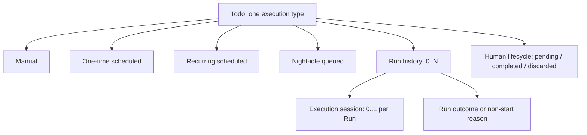
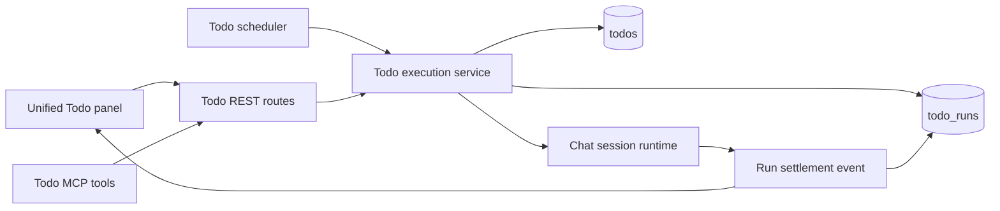
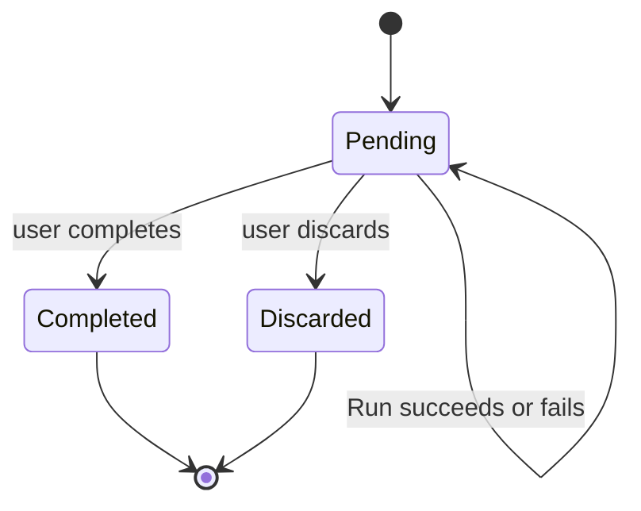

# Unified Todos and Scheduled Tasks - Plan

## Goal Capsule

- **Objective:** Replace the separate Todo and Scheduled Task concepts with one Todo experience that supports manual, one-time, recurring, and night-idle execution while retaining every execution and session history.
- **Product authority:** This plan owns the unified Todo product contract, its execution semantics, UI consolidation, and migration of the existing Todo and Scheduled Task data. It does not choose the database schema, API shape, or scheduler implementation.
- **Open blockers:** None.
- **Execution profile:** Deep cross-cutting refactor. Land the persistence migration and server contracts before moving the UI so every visible path has one source of truth.
- **Tail ownership:** `ce-work` executes units in dependency order, validates migration fixtures before removing the old surfaces, and stops for a user decision if a legacy state cannot be mapped without data loss.

---

## Product Contract

### Summary

Comate will expose one Todo experience. Every Todo has one explicit execution type and may have zero or more Runs; a Run captures one execution attempt and its session. Scheduling is therefore a capability of a Todo, not a separate product.

### Problem Frame

Todos and Scheduled Tasks currently split one user concept across separate entry points and storage models. A normal Todo can link to one session, while a Scheduled Task already needs separate definition and per-run history. That split makes a one-time task awkward after its first execution and leaves users to decide whether an item belongs in a Todo list or a task scheduler.

The unified model must preserve the useful distinction: a Todo expresses work that a person can ultimately complete or discard, while each Run reports what an execution attempt did. This permits repeated execution without treating a successful background attempt as a human decision to close the underlying work.

### Key Decisions

- **Four explicit, mutually exclusive Todo types.** A Todo is manual, one-time scheduled, recurring scheduled, or night-idle queued. This prevents incompatible execution rules from being combined. (session-settled: user-approved — chosen over inferred, combinable execution policies: each Todo has one understandable execution rule.) Governs R1–R4.
- **Human lifecycle is separate from Run result.** A Todo stays pending until a person marks it completed or discarded; Runs communicate operational progress and outcome. (session-settled: user-approved — chosen over a shared status that also controls scheduling: repeating work remains eligible after a successful or failed run.) Governs R5–R8.
- **One Todo can have many Runs.** Manual Todos normally have zero or one Run, while all types retain repeated attempts when the user starts them again. (session-settled: user-approved — chosen over a one-session-only model for manual Todos: retries and re-execution use the same history concept.) Governs R6, R9–R12.
- **Retries are user initiated in v1.** Failures remain visible and a person chooses whether to start a new Run; no automatic retry policy is added. (session-settled: user-approved — chosen over fixed or per-Todo automatic retries: preserve correct history without introducing retry-policy complexity.) Governs R8, R12.
- **Migration is lossless.** Existing Todos, Scheduled Tasks, TaskRuns, and linked sessions remain available after the unification. (session-settled: user-approved — chosen over clearing scheduling history: users retain their work and audit trail.) Governs R18–R19.
- **GitHub-backed Todos can execute locally.** GitHub remains authoritative for synced content and human status, while Comate stores local execution settings and Runs; an automatic Run never closes or mutates the remote issue. (session-settled: user-approved — chosen over restricting automation to local Todos: synced issues may also drive local work.) Governs R16–R17.

### Actors

- **A1. Comate user:** creates and manages Todos, starts manual work, configures automation, reviews Runs, and manually completes or discards the underlying work.
- **A2. Todo scheduler:** starts eligible one-time and recurring Todos, and manages the night-idle queue.
- **A3. Todo execution runtime:** creates the execution session, records one Run, and reports its result without closing the Todo.
- **A4. GitHub:** remains the external authority for synced Todo content and human issue status.

### Requirements

**Unified Todo and lifecycle**

- R1. The application shall provide one Todo entry point and one Todo detail experience for all four execution types.
- R2. A Todo shall have exactly one execution type: manual, one-time scheduled, recurring scheduled, or night-idle queued.
- R3. A manual Todo shall allow the user to start a session on demand and shall remain valid with no Run or session.
- R4. A one-time scheduled Todo shall automatically start at its configured time and shall allow the user to edit it, start it immediately, or set another one-time schedule after an earlier Run.
- R5. A recurring scheduled Todo shall automatically start according to its recurrence rule while it remains pending.
- R6. A Todo shall have a human-managed lifecycle of pending, completed, or discarded.
- R7. Marking a Todo completed or discarded shall prevent future automatic execution without deleting its Run history.
- R8. A Run result shall not automatically complete, discard, or otherwise close its Todo.

**Runs, execution, and queueing**

- R9. Each user-requested or scheduled execution occurrence shall create one Run that records its timing, outcome, reason when it did not start or finish, and its execution session when one exists.
- R10. The Todo detail shall show its Run history and let the user open each associated execution session.
- R11. A user shall be able to start a new Run manually for an eligible Todo, including after a failed Run.
- R12. The system shall not automatically retry a failed Run in this release.
- R13. A night-idle queued Todo shall become eligible only within the user-configured night window and when the application has no executing session.
- R14. When multiple night-idle Todos are eligible, the system shall execute them serially by due date and then creation time; a newly started interactive session shall stop the queue from starting another Todo after the current Run ends.
- R15. A failed night-idle Run shall not be retried automatically.

**GitHub and migration**

- R16. A GitHub-backed Todo shall support all four execution types and retain GitHub as the authority for synced content and human status.
- R17. Automatic execution results shall remain local and shall not automatically change the linked GitHub Issue.
- R18. Migration shall preserve all existing Todo records, Scheduled Task definitions, TaskRun records, and session links in the unified experience.
- R19. Migrated history shall remain visible from its corresponding Todo and continue to open its preserved execution sessions.

### Key Flows

- **F1. Start a manual Todo**
  - **Trigger:** A1 chooses Start on a manual Todo.
  - **Steps:** The system creates a Run and session → A1 works through the session → the Run records its result → A1 later completes or discards the Todo if appropriate.
  - **Covered by:** R3, R6, R8–R11.
- **F2. Reuse a one-time Todo**
  - **Trigger:** A1 reviews a completed or failed Run for a one-time Todo.
  - **Steps:** A1 edits the Todo if needed → starts it immediately or chooses another time → the system records a new Run without losing earlier history → A1 manually closes the Todo when the underlying work is finished.
  - **Covered by:** R4, R6, R8–R12.
- **F3. Run recurring work**
  - **Trigger:** A recurring Todo reaches its scheduled time while pending.
  - **Steps:** The scheduler starts a new Run and session → records its result → keeps the Todo eligible for the next recurrence until A1 completes or discards it.
  - **Covered by:** R5–R10.
- **F4. Process the night-idle queue**
  - **Trigger:** The configured night window is active, at least one queued Todo is pending, and no session is executing.
  - **Steps:** The scheduler selects the highest-priority eligible Todo → runs it → waits for completion → starts the next only if the application remains idle; user interaction pauses further queue starts.
  - **Covered by:** R13–R15.
- **F5. Preserve a GitHub Todo through execution**
  - **Trigger:** A1 enables automatic execution for a GitHub-backed Todo.
  - **Steps:** Comate stores the local execution setting → a Run executes and is shown in the Todo detail → GitHub content and issue status stay unchanged unless A1 changes them through the existing human workflow.
  - **Covered by:** R16–R17.

### Acceptance Examples

- AE1. **Covers R3, R9–R11.** A user creates a manual Todo and never starts it; it has no Runs. After starting it once and later starting it again, the Todo shows two Runs and both sessions remain accessible.
- AE2. **Covers R4, R6, R8–R12.** A one-time Todo fails at 18:00. It remains pending, displays the failed Run, and can be edited and immediately run again; neither result closes the Todo until the user manually completes or discards it.
- AE3. **Covers R5–R8.** A daily Todo succeeds at 09:00. Its latest Run reports success, while the pending Todo remains scheduled for tomorrow; completing it manually stops future daily Runs.
- AE4. **Covers R13–R15.** During a configured 00:00–08:00 window, two idle Todos are eligible. The earlier due item runs first; while it runs the user starts an interactive session, so the current Run finishes but the second Todo does not start until a later eligible idle period.
- AE5. **Covers R16–R17.** A synced GitHub Issue is configured as a recurring Todo. Its Run succeeds, the local history records success, and the GitHub Issue remains open until the user explicitly changes its status.
- AE6. **Covers R18–R19.** An existing Scheduled Task with three TaskRuns migrates into one Todo with three visible Runs; every preserved Run still opens the original session.

### Success Criteria

- Users can manage manual and automated work from one Todo entry point without deciding between a Todo panel and a Scheduled Tasks panel.
- Every run of one-time, recurring, and night-idle Todo work is visible alongside the underlying Todo and opens the corresponding session when one exists.
- A migrated installation retains all prior Todo and Scheduled Task records, including execution history and linked sessions.
- Night-idle Todos never run concurrently and never start a new queued Run after interactive work resumes.

### Scope Boundaries

**Deferred for later**

- Automatic retry policies, including retry limits, delays, backoff, and per-Todo configuration.
- Combining multiple execution types or policies on one Todo.
- Automatic changes to GitHub Issue status from a Run outcome.

**Outside this product's identity**

- Replacing GitHub as the authority for GitHub-backed Todo content or human issue status.
- Deleting historical Runs or execution sessions as part of the unification.

### Dependencies / Assumptions

- Existing programmatic session creation remains available to all execution types.
- The application continues to own local scheduling while it is running; this plan does not add cloud or system-level background scheduling.
- The existing Todo and Scheduled Task records are readable enough to map into the unified product without dropping data; the implementation plan must verify every legacy state and migration edge case.

### Sources / Research

- `src/server/models/todo.ts` — current Todo lifecycle, single session link, due date, and GitHub-sync fields.
- `src/server/models/scheduled-task.ts` — current scheduled definition and per-run model.
- `src/server/storage/sqlite-store.ts` — existing `todos`, `scheduled_tasks`, and `task_runs` storage.
- `src/server/routes/todos.ts` and `src/server/routes/scheduled-tasks.ts` — current user-facing API split.
- `docs/plans/2026-07-24-001-feat-scheduled-tasks-plan.md` — existing scheduled-task product contract and isolated execution-session history.

---

## Planning Contract

### Key Technical Decisions

- KTD1. **Extend the Todo record and introduce `todo_runs`.** Keep GitHub-sync fields and the user-facing Todo identity in `todos`; add local execution configuration there and make each execution occurrence a `todo_runs` row. This is the narrowest migration path from both existing tables. (session-settled: user-approved — chosen over retaining two parent tables behind a shared abstraction: one Todo must own all execution history.) Governs R1–R19.
- KTD2. **Migrate incrementally and retain legacy source tables for one compatibility release.** The migration copies and validates records before all reads move to the unified store. This permits inspection and recovery without a destructive rewrite. (session-settled: user-approved — chosen over a destructive table replacement: existing Todo, Scheduled Task, Run, and session data must survive.) Governs R18–R19.
- KTD3. **Centralize every execution path in one Todo execution service.** REST, MCP, scheduler ticks, and manual Start reserve a Run and create a session through the same service. This preserves overlap protection and result settlement. Governs R3–R15.
- KTD4. **Store night-window settings at app scope and detect idleness from server runtimes.** A browser tab or active-session selection is not evidence that work is idle. The service must query active runtime state before dispatching the next queued Todo. (session-settled: user-approved — chosen over client-side or implicit idle detection: the configured window and absence of executing sessions define eligibility.) Governs R13–R15.
- KTD5. **Require an execution workspace before creating a Run.** A global Todo stays trackable, but Start and all automated modes reject or prompt for a workspace rather than borrowing the most recent one. (session-settled: user-approved — chosen over silently selecting the recent workspace: execution must have an explicit workspace boundary.) Governs R3–R5, R13, R16.
- KTD6. **Migrate `did-but-need-verify` to pending.** The new parent lifecycle has no automatic completion state; the existing value still requires a human decision. Governs R6–R8.

### High-Level Technical Design

The execution service owns Run reservation, workspace validation, session creation, and terminal settlement. Scheduler logic only selects eligible Todos and delegates; it does not create a competing execution record shape.

Run state is separate from the parent lifecycle. A scheduled Todo remains pending after a terminal Run and becomes ineligible only when its parent is completed or discarded.

### System-Wide Impact

- Persistence changes affect existing local databases, migration fixtures, workspace deletion, and retention cleanup.
- API, MCP, WebSocket, and React state must expose the same Todo/Run vocabulary so agents and humans can take equivalent actions.
- Existing GitHub synchronization must ignore local execution settings and Run outcomes while preserving human status changes.
- Desktop and in-app notifications move from Scheduled Task events to unified Todo Run events without losing deep links to sessions.

### Risks & Dependencies

- Legacy `scheduled_tasks` contains confirmation snapshots and notification settings that must survive as local automation configuration.
- The server must provide a reliable runtime-activity seam before night-idle dispatch is enabled; do not infer idleness from client state.
- Existing scheduled Run retention must move with the data model so the unified table does not grow without bound.
- The migration must tolerate partially upgraded databases and preserve existing IDs used by session links and WebSocket clients.

---

## Implementation Units

### U1. Define unified Todo execution types and migration

**Goal:** Add the domain types, storage columns, `todo_runs` table, and idempotent data migration that preserve legacy records.

**Requirements:** R2, R6–R9, R16–R19.

**Dependencies:** None.

**Files:** `src/server/models/todo.ts`, `src/server/models/todo-run.ts` (new), `src/server/storage/sqlite-store.ts`, `src/server/storage/migration.test.ts`, `src/server/storage/todo-store.test.ts`, `src/server/storage/scheduled-task-store.test.ts`.

**Approach:**

1. Add execution configuration and explicit type fields to the Todo model while retaining existing GitHub fields.
2. Add `todo_runs` with the existing run identifiers, session links, timing, result, and reason fields.
3. Write an idempotent migration that copies Scheduled Tasks and TaskRuns, maps legacy Todo sessions to manual Runs, maps `did-but-need-verify` per KTD6, and records a migration marker only after row-count and linkage checks pass.
4. Keep legacy rows readable during the compatibility period; do not drop source tables in this unit.

**Patterns to follow:** Existing additive/rebuild migrations and transactional count checks in `src/server/storage/sqlite-store.ts`; migration fixtures in `src/server/storage/migration.test.ts`.

**Test scenarios:**

- A pre-unification database containing local, GitHub, global, and workspace Todos migrates without changing IDs or GitHub metadata.
- A Scheduled Task with succeeded, failed, missed, and skipped TaskRuns becomes one Todo with equivalent ordered `todo_runs` and preserved session links.
- A legacy Todo with `session_id` becomes a manual Todo with one accessible Run; a Todo without a session has none.
- Reopening an already migrated database does not duplicate Todos or Runs.
- A migration error rolls back the new writes and leaves the source records intact.

**Verification:** Migration tests prove counts, IDs, statuses, and session links are preserved across first and repeated startup.

### U2. Replace split store access with unified Todo and Run APIs

**Goal:** Make storage and REST APIs expose type-aware Todos, Run history, execution workspace validation, and local automation settings.

**Requirements:** R1–R4, R9–R12, R16–R19.

**Dependencies:** U1.

**Files:** `src/server/storage/sqlite-store.ts`, `src/server/routes/todos.ts`, `src/server/routes/todos.test.ts`, `src/server/routes/scheduled-tasks.ts` (remove or compatibility redirect), `src/server/routes/scheduled-tasks.test.ts` (migrate coverage), `src/server/server-main.ts`.

**Approach:**

1. Extend Todo queries and mutation validation to read/write execution type and local configuration without sending execution outcomes to GitHub sync.
2. Add Todo-scoped Run history and manual-execution endpoints under the Todo route family.
3. Reject Start and automation configuration when a Todo has no workspace; return an actionable validation error rather than selecting a workspace.
4. Route old scheduled endpoints through an explicit compatibility policy or remove them only after all client and MCP consumers use the new contract.

**Patterns to follow:** Global/workspace-aware Todo route handling in `src/server/routes/todos.ts`; scheduled route ownership checks in `src/server/routes/scheduled-tasks.ts`.

**Test scenarios:**

- A local Todo can be created and updated with each of the four execution types.
- A global Todo cannot start or enable automation until a workspace is assigned.
- A GitHub-backed Todo accepts local execution configuration without modifying its remote snapshot or issue status.
- Run-history and manual-execution endpoints reject another workspace's Todo.
- Legacy scheduled endpoint behavior either redirects with the same ownership checks or returns the documented retirement response.

**Verification:** Route tests cover type validation, workspace ownership, GitHub isolation, and all success/error response contracts.

### U3. Generalize execution and scheduler behavior

**Goal:** Move session dispatch and Run settlement behind one Todo execution service, then add one-time, recurring, immediate, and night-idle selection.

**Requirements:** R3–R5, R8–R15.

**Dependencies:** U1, U2.

**Files:** `src/server/services/todo-execution-service.ts` (new), `src/server/services/scheduler-service.ts`, `src/server/services/scheduled-tasks-service.ts` (replace), `src/server/services/cron-schedule.ts`, `src/server/services/session-runtime.ts`, `src/server/storage/app-settings-store.ts`, `src/server/routes/settings.ts`, `src/server/routes/settings.test.ts`, `src/server/services/scheduler-service.test.ts`, `src/server/services/todo-execution-service.test.ts` (new), `src/server/models/session.ts`.

**Approach:**

1. Extract Run reservation, overlap checks, workspace validation, session creation, event settlement, and retention into the execution service.
2. Have schedule ticks and explicit Run-now requests select a Todo then call that service.
3. Add app-level night-window configuration and a server-side activity provider that reports executing runtimes.
4. Select idle Todos only during the configured window, sort by due date then creation time, run one at a time, and re-check activity before each next dispatch.
5. Preserve missed, skipped, watchdog, and process-restart settlement as Run reasons; do not add automatic retry.

**Execution note:** Add characterization coverage for current scheduled overlap, missed-run, and watchdog behavior before redirecting it through the shared service.

**Patterns to follow:** Reservation and terminal-event handling in `src/server/services/scheduler-service.ts`; existing chat session creation and push flow.

**Test scenarios:**

- Covers AE1/AE2. Manual Start creates a Run and session, and a later Start produces another Run without closing the Todo.
- Covers AE3. A successful recurring Run leaves the parent pending and schedules only the next occurrence.
- Covers AE4. Idle selection respects the configured window, no-running-runtime gate, due-date ordering, serial execution, and pause-after-user-interaction behavior.
- A failed Run stays terminal and does not enqueue an automatic retry for any type.
- Concurrent immediate and scheduled triggers produce one running Run and a recorded/rejected overlap according to the public contract.
- Process restart, stale runtime, workspace drift, and missed time each settle the Run with a reason and never create an orphaned session.

**Verification:** Service tests prove every dispatch path shares reservation/settlement behavior and idle queue tests use deterministic time and runtime fixtures.

### U4. Preserve agent and event parity

**Goal:** Replace Scheduled Task MCP and WebSocket contracts with unified Todo actions and Run events so agents and clients observe the same state.

**Requirements:** R1, R4–R5, R9–R12, R16–R17.

**Dependencies:** U2, U3.

**Files:** `src/server/services/scheduled-tasks-mcp.ts`, `src/server/services/scheduled-tasks-mcp.test.ts`, `src/server/websocket/server.ts`, `src/client/lib/scheduled-task-events.ts`, `src/client/stores/chat-store.ts`, `src/server/server-main.ts`.

**Approach:**

1. Rename or replace scheduled-task tools with Todo create/list/update/pause-or-complete/start/run-history actions, preserving source-specific permission rules.
2. Publish Todo Run lifecycle events with Todo and Run identifiers, session links, result text, and reasons.
3. Update server registration and client relay to remove the old Scheduled Task event namespace after all consumers migrate.

**Patterns to follow:** Current per-source MCP tool filtering in `src/server/services/scheduled-tasks-mcp.ts`; WebSocket relay in `src/server/websocket/server.ts`.

**Test scenarios:**

- Local and bot agent surfaces expose only the Todo actions permitted for their source.
- An agent-created one-time or recurring Todo appears through the same list and Run history as a UI-created Todo.
- A completed, failed, missed, and skipped Run emits a client event with the correct Todo, Run, and optional session identifiers.
- No agent action can automatically complete a GitHub Issue from a Run result.

**Verification:** MCP and WebSocket tests prove action parity and event payload compatibility for each terminal Run state.

### U5. Merge client state and the Todo interface

**Goal:** Replace separate Todo and Scheduled Task stores, toolbar buttons, panels, forms, and history views with one type-aware Todo experience.

**Requirements:** R1–R5, R7, R10–R11, R13–R14, R16–R19.

**Dependencies:** U2, U3, U4.

**Files:** `src/client/stores/todo-store.ts`, `src/client/stores/scheduled-task-store.ts` (remove), `src/client/components/TodosPanel.tsx`, `src/client/components/todos/TodoDetail.tsx`, `src/client/components/ScheduledTasksPanel.tsx` (remove), `src/client/components/ScheduledTaskForm.tsx` (remove), `src/client/components/HeaderToolbar.tsx`, `src/client/App.tsx`, `src/client/components/TodosPanel.test.tsx`, `src/client/components/todos/TodoDetail.test.tsx`, `src/client/stores/todo-store.test.ts` (new).

**Approach:**

1. Expand the Todo store to fetch type-aware Todos, Runs, Run-now results, and unified lifecycle events.
2. Make Todo detail select one execution type, render only its relevant configuration, require an execution workspace where applicable, and show Run history with session deep links.
3. Fold Scheduled Task list, detail, form, unread state, and notification navigation into the Todo panel.
4. Remove the Scheduled Tasks toolbar entry and dedicated panel state only after deep links and Run events use the unified path.

**Patterns to follow:** Existing Todo panel list/detail composition; Scheduled Task form and history components for type-specific controls.

**Test scenarios:**

- The header exposes one Todo entry and no Scheduled Tasks entry.
- A manual Todo can remain unscheduled with no Runs, then show Start and history after execution.
- A one-time Todo can be edited after a Run and offered immediate-run or reschedule actions.
- A recurring or idle Todo shows its latest Run without appearing completed after success.
- An idle Todo displays queue eligibility and order derived from due date and creation time.
- A migrated legacy scheduled Todo renders its preserved history and opens each associated session.

**Verification:** Component and store tests prove all four forms, lifecycle controls, history navigation, and event-driven refresh behavior.

### U6. Update localization, notifications, cleanup, and regression coverage

**Goal:** Remove Scheduled Task vocabulary from supported UI paths, retain result notifications, and protect the migration and unified flow with focused regression coverage.

**Requirements:** R1, R9–R19.

**Dependencies:** U4, U5.

**Files:** `src/client/i18n/en/todos.json`, `src/client/i18n/zh-CN/todos.json`, `src/client/i18n/en/scheduledTasks.json` (retire or migrate), `src/client/i18n/zh-CN/scheduledTasks.json` (retire or migrate), `src/client/i18n/index.ts`, `src/client/lib/notifications.ts`, `src/client/lib/notifications.test.ts`, `src/server/storage/sqlite-store.test.ts`, `src/server/services/scheduler-service.test.ts`.

**Approach:**

1. Move retained scheduling, Run, queue, validation, and notification copy into the Todo namespace.
2. Make notification actions use unified Todo/Run deep links.
3. Remove unused scheduled client modules and compatibility code only after the U1 migration and U4/U5 regressions pass.

**Patterns to follow:** Existing scheduled Run notification helper and Todo i18n namespace registration.

**Test scenarios:**

- English and Chinese render labels for all execution types, Run outcomes, workspace-required validation, and idle queue state.
- A Run-completion notification opens the migrated unified Todo session target.
- No live client import references the retired Scheduled Task store, panel, route, or i18n namespace.
- Regression fixtures retain 90-day Run cleanup semantics after the table transition.

**Verification:** Typecheck and focused client/server tests pass with no remaining supported Scheduled Task UI entry point.

---

## Verification Contract

- Run migration tests for fresh, legacy, repeated-upgrade, and rollback database fixtures.
- Run focused server tests for Todo routes, unified execution, scheduler selection, MCP tools, and WebSocket events.
- Run focused client tests for the Todo store, Todo panel, detail form, notification deep links, and both locale bundles.
- Run `npm run test:server` for server and migration coverage, `npm run test:client` for the unified client paths, and `npm run build` for typecheck and production build coverage before removing compatibility modules.
- Perform a manual smoke pass against an upgraded local database: inspect migrated history, start each Todo type, exercise the night queue with an interactive interruption, and open a preserved Run session.

---

## Definition of Done

- U1–U6 meet their listed verification outcomes and all Product Contract requirements R1–R19 remain traceable to implementation and tests.
- An upgraded database retains every legacy Todo, Scheduled Task, TaskRun, and linked session in the unified Todo UI.
- Manual, one-time, recurring, and night-idle Todo execution all create visible Runs without automatically completing the parent Todo or closing a GitHub Issue.
- Night-idle dispatch is serial, honors the configured window and runtime-idle gate, and pauses after interactive work resumes.
- Agent, REST, WebSocket, and UI paths use the same Todo/Run vocabulary and permission boundaries.
- The final diff contains no abandoned compatibility experiments or unsupported Scheduled Task UI surface.

