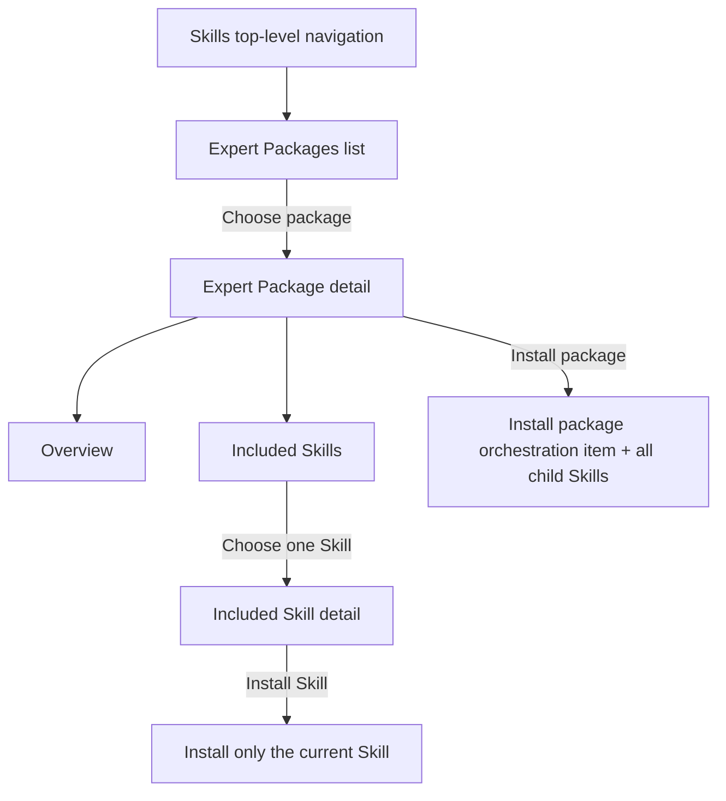
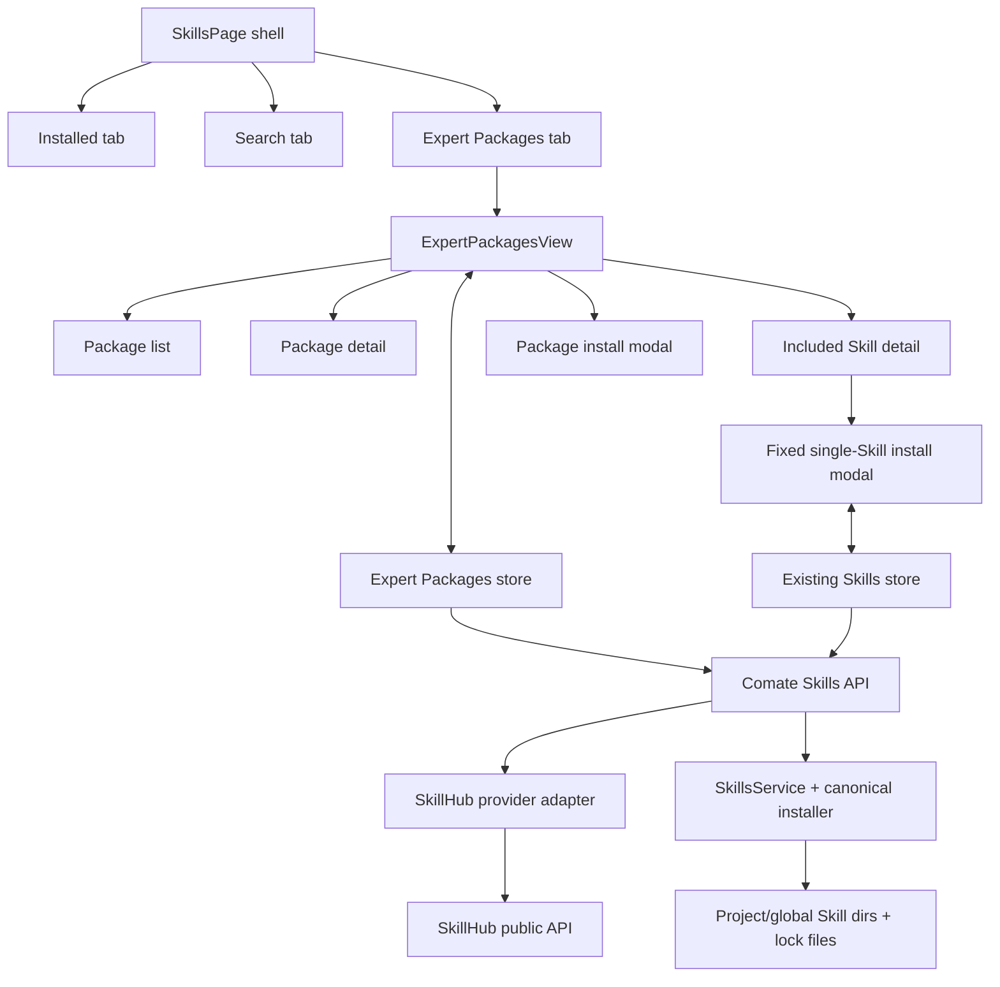
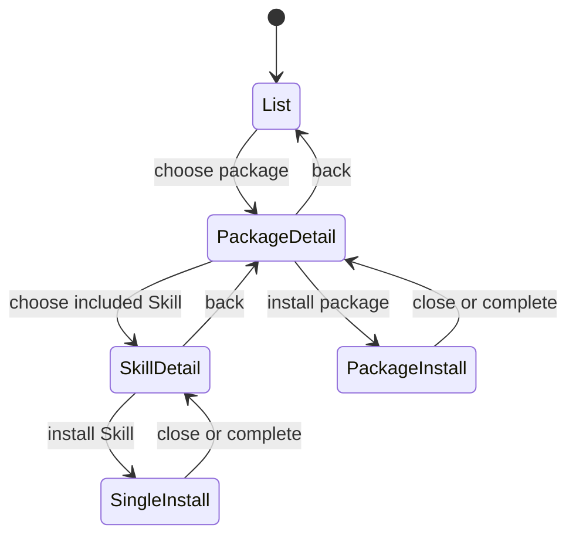
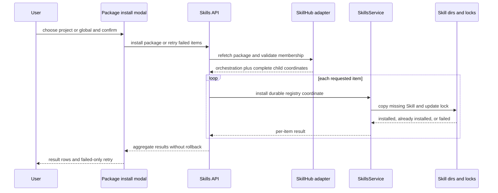
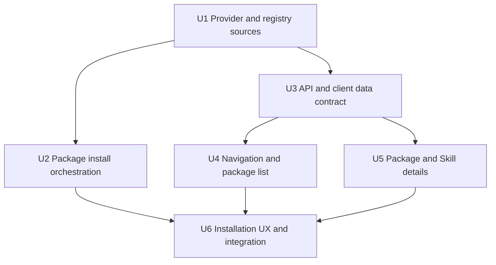

# Expert Packages - Plan

## Goal Capsule

- **Objective:** Add Expert Packages to the top-level Skills navigation so users can discover packaged workflows, inspect their included Skills, and install either the complete package or one included Skill inside the app.
- **Authority order:** The Product Contract defines behavior and scope. The Planning Contract defines implementation choices. Existing Skills install and lock-file invariants remain authoritative where this plan does not override them.
- **Execution profile:** Implement the units in dependency order, preserve the user's current federated-search changes, and keep external SkillHub responses behind Comate-owned adapters.
- **Stop conditions:** Stop for a SkillHub contract change that makes package completeness unknowable, a required change to the confirmed in-app-only behavior, or a conflict with the existing project/global lock-file contract.
- **Tail ownership:** Completion includes server, client, i18n, automated tests, a live external-catalog smoke check, and removal of abandoned implementation attempts.
- **Open blockers:** None.

---

## Product Contract

### Summary

Add an Expert Packages area to Skills with three connected surfaces modeled on SkillHub: a searchable and filterable package list, a package detail page, and an included Skill detail page. Installation stays inside the app: a package installs its package-specific orchestration item and every child Skill, while an individual Skill action installs only that Skill. The orchestration item is runtime-compatible with the shared Skill loader but is not presented as a standard catalog or industry Skill.

### Problem Frame

The current Skills surface supports installed-skill management and federated search, but it treats Skills as independent units. SkillHub also publishes Expert Packages that combine several Skills with an orchestration definition for a complete workflow. Without an equivalent surface, users cannot discover these workflow-level combinations or install them as a coherent capability from the app.

### Key Decisions

- **Deliver Expert Packages before Enterprise Zone.** (session-settled: user-directed — chosen over delivering both referenced SkillHub areas together: Expert Packages are the current priority and Enterprise Zone will be handled later.) Governs R1 and R14.
- **Follow SkillHub's three-surface product structure.** (session-settled: user-approved — chosen over a single flat discovery page: separate list, package detail, and included Skill detail surfaces preserve the reference browsing path.) Governs R2–R5 and R9–R11.
- **Use in-app installation only.** (session-settled: user-directed — chosen over retaining ZIP download or prompt-based installation: a download-only action has no value inside this desktop app.) Governs R6–R8 and R12–R13.
- **A complete package includes a package-specific orchestration item, not a standard industry Skill.** (session-settled: user-directed — chosen over either omitting orchestration or presenting it as an ordinary Skill: it remains a runtime-loadable `SKILL.md` in the shared scope, carries a durable Expert Package discriminator, and receives dedicated Installed presentation.) Governs R6 and R7.

<!-- ce-section: work-relationships -->
### How This Work Fits Together

This plan owns Expert Packages as one deliverable. The broader Skills expansion is the current understanding rather than a committed roadmap.

- **Expert Packages:** Active scope; extends the current Skills surface with workflow-level discovery and installation.
  - **Enterprise Zone:** Deferred for later and can be planned independently, while sharing the same top-level Skills navigation pattern.

### Actors

- A1. **Skills user:** Browses Expert Packages and installs a complete package or an individual included Skill into a project or globally.
- A2. **SkillHub catalog:** Supplies package metadata, orchestration content, included Skill coordinates, Skill details, and availability signals.
- A3. **Comate installer:** Resolves the selected content, applies the chosen scope, and reports an outcome for every requested Skill.

### Surface Flow



### Requirements

**Discovery and navigation**

- R1. Skills exposes Expert Packages as a top-level peer of Installed and Search, with Enterprise Zone absent from this release.
- R2. The Expert Packages list presents the package title, explanatory subtitle, total result count, supported scene filters, keyword search, and list/card view controls.
- R3. Each package result shows its identity, expert role, summary, included Skill count, and source, and opens the selected package detail.
- R4. Filtering and search can be combined, can be cleared without leaving the page, and produce a specific empty-result state when no package matches.
- R5. The list provides distinct loading, load-failure with retry, empty-result, and completed-result states without replacing the surrounding Skills navigation.

**Expert Package detail and installation**

- R6. Installing an Expert Package installs one package-specific orchestration item plus every currently available child Skill into the user-selected project or global scope; the orchestration item remains runtime-loadable but is not classified as a standard catalog or industry Skill.
- R7. Package installation runs inside the app, skips items already installed in the selected scope, and does not expose ZIP download or prompt-based installation. The Installed surface labels the orchestration item as Expert Package orchestration instead of presenting it as an ordinary Skill.
- R8. Package installation reports installed, already-installed, and failed outcomes per item, preserves successful installations after a partial failure, and lets the user retry only failed items.
- R9. The package detail shows breadcrumb context, package identity, expert role, source, security status, summary, scene, included Skill count, and separate Overview and Included Skills tabs.
- R10. Overview renders the package's workflow definition as readable content, while Included Skills shows each child Skill's name and summary with navigation to its detail.
- R11. A package that has no child Skills or references an unavailable child Skill is shown as unavailable and cannot start installation until the package becomes complete again.

**Included Skill detail and installation**

- R12. An included Skill detail shows its package context, identity, owner, category, summary, version, usage signals, documentation, and available security information.
- R13. Installing from an included Skill detail installs only the current Skill into the selected project or global scope and follows the existing already-installed or reinstall handling.

**Scope boundary**

- R14. Enterprise Zone, Expert Package publishing or editing, custom package creation, and package composition management are excluded from this release.

### Key Flows

- F1. Discover an Expert Package
  - **Trigger:** A1 opens Expert Packages from the Skills top-level navigation.
  - **Actors:** A1, A2.
  - **Steps:** The list loads; A1 filters by scene or searches by keyword; A1 may switch list/card view; A1 selects a result.
  - **Outcome:** The selected package detail opens with the list context preserved.
  - **Covers:** R1–R5.
- F2. Install a complete Expert Package
  - **Trigger:** A1 chooses the install action on a package detail.
  - **Actors:** A1, A2, A3.
  - **Steps:** A1 selects project or global scope; the app presents the package orchestration item separately from the child Skill set; A1 confirms; A3 installs missing items and records each result.
  - **Outcome:** All successful items are available in the chosen scope, and any failures remain actionable without rolling back successful items.
  - **Covers:** R6–R8, R11.
- F3. Inspect and install one included Skill
  - **Trigger:** A1 opens Included Skills and selects one child Skill.
  - **Actors:** A1, A2, A3.
  - **Steps:** The Skill detail loads with package context; A1 reviews its documentation and security information; A1 selects a scope and confirms installation.
  - **Outcome:** Only the selected Skill is installed or routed through existing reinstall handling.
  - **Covers:** R9, R10, R12, R13.
- F4. Recover from catalog or install failure
  - **Trigger:** Package data fails to load or one or more requested items fail to install.
  - **Actors:** A1, A2, A3.
  - **Steps:** The page keeps the current navigation context; it identifies the failed operation; A1 retries the failed load or failed install items.
  - **Outcome:** Recovery does not repeat successful installs or discard the user's list/detail context.
  - **Covers:** R5, R8, R11.

### Acceptance Examples

- AE1.
  - **Covers R1–R5.**
  - **Given** Skills is open,
  - **When** the user selects Expert Packages, applies the Technology scene, and searches for "test",
  - **Then** only matching packages remain and clearing the search restores the scene-filtered results.
- AE2.
  - **Covers R6–R8.**
  - **Given** a package contains one package orchestration item and six child Skills, two child Skills are already installed, and one new child Skill fails,
  - **When** the user installs the package into the current project,
  - **Then** the two existing items are skipped, the package orchestration item and other successful child Skills remain installed, the orchestration item is visibly identified as package-specific in Installed, and the failed child Skill is offered for retry.
- AE3.
  - **Covers R9, R10, R12, R13.**
  - **Given** the user is viewing a package's Included Skills tab,
  - **When** the user opens one Skill and installs it globally,
  - **Then** only that Skill is installed globally and neither the package orchestration item nor sibling Skills are installed.
- AE4.
  - **Covers R7, R13.**
  - **Given** a package or Skill detail is installable,
  - **When** the user reviews its actions,
  - **Then** installation is performed within the app and no ZIP download or prompt-install action is offered.
- AE5.
  - **Covers R11.**
  - **Given** a package references an unpublished or unavailable child Skill,
  - **When** its detail is opened,
  - **Then** the page explains that the package is temporarily unavailable, hides or disables installation, and retains a route back to the package list.
- AE6.
  - **Covers R5, R8.**
  - **Given** a list request or installation fails,
  - **When** the user retries,
  - **Then** only the failed operation is repeated and successful work remains intact.

### Scope Boundaries

- **Deferred for later:** Enterprise Zone and its enterprise discovery or profile pages.
- **Not included:** Expert Package publishing, editing, ownership administration, custom package creation, and changing a package's child Skills.
- **Not included:** ZIP downloads, prompt-based installation, external CLI setup, or mirroring SkillHub's account and publishing flows.
- **Preserved:** Installed and Search behavior remains available as-is outside the navigation addition and shared detail/install patterns needed by Expert Packages.
- **Deferred to follow-up work:** Registry ZIP redesign or hardening beyond the shared bounded extraction path required by this release, deep-link routing for the Skills overlay, and a general-purpose package framework for non-SkillHub providers.

### Dependencies and Assumptions

- The public SkillHub catalog remains the product authority for Expert Package definitions, included Skill coordinates, Skill metadata, and availability.
- The current installer remains the authority for project/global scope selection, already-installed detection, reinstall behavior, and persistent installed-skill records.
- Package installation is non-transactional by design: successful items remain installed when another item fails, per R8.
- The reference design is adapted to the existing full-screen Skills surface rather than importing SkillHub's global website header, footer, login, publishing, or CLI conventions.

### Outstanding Questions

None.

### Sources

- Expert Packages reference list: `https://skillhub.cn/skillspackage`.
- Reference package detail shape: `https://skillhub.cn/skillspackage/tech-test-automation`.
- Reference included Skill detail shape: `https://skillhub.cn/skills/axelhu/superpowers-tdd`.
- SkillHub package list API: `https://api.skillhub.cn/api/v1/skillsets?page=1&pageSize=200`.
- SkillHub package detail API: `https://api.skillhub.cn/api/v1/skillsets/tech-test-automation`.
- SkillHub Skill detail API: `https://api.skillhub.cn/api/v1/skills/superpowers-tdd?namespace=axelhu`.
- Current Skills navigation, search results, and install entry points: `src/client/components/SkillsPage.tsx`.
- Current project/global selection and install phase behavior: `src/client/components/SkillInstallModal.tsx`.
- Current client install result contract: `src/client/stores/skills-store.ts`.
- Current batch install and per-item result behavior: `src/server/routes/skills.ts` and `src/server/services/skills-service.ts`.

---

## Planning Contract

### Product Contract Preservation

Product Contract changed: R6–R7 now distinguish the runtime-compatible package orchestration item from standard catalog or industry Skills, following the user's clarification. Package completeness and in-app installation scope remain unchanged.

### Key Technical Decisions

- KTD1. **Keep SkillHub behind a Comate-owned provider adapter.** The client calls only `/api/skills/*`; the server validates and normalizes SkillHub package, Skill, version, security, and documentation data. This prevents external field names, oversized package workflow content, and provider error shapes from leaking into UI components. Governs R2–R5 and R9–R12.
- KTD2. **Model Expert Packages as a nested view state inside the existing Skills overlay.** The top-level tab is a peer of Installed and Search, while list, package, and included-Skill views form a local navigation stack. The list query, filters, scroll context, and selected presentation mode survive detail navigation. Governs R1, R4, R5, F1, and F4.
- KTD3. **Hydrate package completeness on the server and revalidate it at install time.** Package detail resolves every child coordinate with independent availability, and installation refetches the canonical package rather than trusting client-provided membership. A missing orchestration definition, empty child set, or unavailable child makes the package unavailable. Governs R6, R9–R11, and F2.
- KTD4. **Extend the registry-source adapter with a package-specific orchestration coordinate and kind.** Child Skills retain `skillhub-cn:<namespace>/<slug>` sources. The orchestration item uses a durable `skillhub-package:<slug>` source that materializes the catalog's workflow definition as a runtime-compatible `SKILL.md`. The source prefix is also the durable discriminator from which `listInstalled` derives `kind: expert-package-orchestrator`; it is never normalized as a standard catalog Skill. Existing copy, update, remove, and lock-file behavior remains reusable. Governs R6–R8.
- KTD5. **Use a dedicated Expert Package installation contract over the canonical installer primitives.** A package request expands to stable item identities and item kinds, installs each missing item through the shared copy and lock-entry path, and returns per-item outcomes without erasing the orchestration-versus-child distinction. A keyed in-process coordinator serializes each scope's complete copy-plus-lock mutation across package, single-Skill, update, and remove requests; atomic file replacement alone does not prevent concurrent read-modify-write loss. Retry requests may name only failed item identities, which the server validates against the current package. Governs R6–R8, AE2, and AE6.
- KTD6. **Keep package installation non-transactional and scope-specific.** The route returns all installed, already-installed, and failed outcomes; successful items remain installed, already-installed items are never force-overwritten, and an all-already-installed result is a completed no-op rather than a reinstall prompt. Governs R7, R8, and F2.
- KTD7. **Reuse the current single-Skill modal in fixed-selection mode.** An included Skill opens the existing resolver and project/global scope flow with the sole registry Skill preselected and sibling selection unavailable. Existing already-installed and force-reinstall behavior stays intact. Governs R12, R13, AE3, and AE4.
- KTD8. **Isolate Expert Package remote state from the current Skills search store.** A dedicated store owns package list queries, package and Skill detail caches, request cancellation or request IDs, and package install outcomes. The existing store remains the authority for installed Skills and single-Skill installation. Governs R4, R5, R8, and F4.
- KTD9. **Mirror the reference information architecture, not its website shell.** Reuse Comate tokens, `ModalPanel`, `MarkdownPreview`, existing external-link handling, and accessible button/tab patterns. Persist list/card preference locally, but do not import SkillHub login, publishing, CLI, download, header, or footer actions. Governs R2, R3, R5, R7, R9–R14.
- KTD10. **Agent capability becomes available through the existing shared Skill directories without changing product classification.** No new MCP tool or agent-only package API is required; both UI paths write runtime-compatible files and lock records that agent sessions already consume. Verification must prove child Skills appear normally through `listInstalled`, while the orchestration entry appears with `kind: expert-package-orchestrator` and dedicated presentation. Governs R6, R7, R13, and A3.
- KTD11. **Bound and validate every externally supplied package artifact.** Package and child counts, response bodies, orchestration markdown, archive entry counts, and expanded archive size receive explicit limits. Archive entries must remain inside the temporary extraction root, and orchestration frontmatter must identify the package slug before installation. Provider security reports remain advisory, matching the existing arbitrary-source Skill trust model; the UI surfaces them but does not silently convert them into an install gate. Governs R7, R9, R11, and R12.

### External Contract Boundary

The provider adapter may call these public SkillHub endpoints, observed on 2026-08-02. All responses require runtime validation and normalization before leaving the server layer.

| Purpose | Upstream contract | Comate responsibility |
|---|---|---|
| Package list | `/api/v1/skillsets` with page, page size, keyword, and scene | Forward supported filters; strip workflow content from list rows; return normalized count and summaries |
| Package detail | `/api/v1/skillsets/:slug` | Validate orchestration content and child coordinates; hydrate child availability |
| Skill metadata | `/api/v1/skills/:slug?namespace=:namespace` | Normalize owner, category, version, usage, and security reports |
| Skill versions | `/api/v1/skills/:slug/versions?namespace=:namespace` | Normalize version history only when detail needs it |
| Skill archive | `/api/v1/download?slug=:slug&namespace=:namespace` | Reuse the registry materialization path for documentation and installation |

### High-Level Technical Design

#### Component topology



#### Expert Packages navigation state



#### Package install sequence



### Output Structure

```text
src/server/services/skills/
  registry-source.ts
  registry-source.test.ts
  install-coordinator.ts
  install-coordinator.test.ts
  expert-packages.ts
  expert-packages.test.ts
src/client/components/skills/
  ExpertPackagesView.tsx
  ExpertPackageList.tsx
  ExpertPackageDetail.tsx
  ExpertPackageSkillDetail.tsx
  ExpertPackageInstallModal.tsx
  ExpertPackagesView.test.tsx
  ExpertPackageInstallModal.test.tsx
src/client/stores/
  expert-packages-store.ts
  expert-packages-store.test.ts
```

### Implementation Constraints

- Preserve all current uncommitted federated-search work in the Skills files; integrate with it instead of reverting or reconstructing it.
- Do not modify `src/server/vendor/vercel-skills/`; Comate-owned adapters remain the integration boundary.
- Do not call SkillHub directly from React. Server normalization and timeout/error policy are mandatory.
- Treat provider strings, URLs, markdown, and archive contents as untrusted input. Use existing sanitization, bounded archive inspection, `MarkdownPreview`, and `openUrlInBrowser` boundaries.
- Serialize each scope's complete install/remove/update mutation across concurrent requests; sequential processing inside only one package request is insufficient.
- Do not add a database table, persistent catalog mirror, feature flag, or new dependency for this release.

### Sequencing



### System-Wide Impact

- **External reliability:** The UI gains a live dependency on SkillHub for package browsing. Failure stays confined to the Expert Packages tab and does not hide Installed or Search.
- **Filesystem and lock state:** Package installation writes multiple independent Skills into an existing scope. Per-scope mutation serialization prevents concurrent lost updates, while per-item results make partial completion visible.
- **Update lifecycle:** The durable orchestration source coordinate lets the existing Installed tab update or remove the package orchestration item while retaining its dedicated label and kind. Child Skills retain their existing registry update path.
- **Agent context:** Installed package contents land in the same directories already loaded by agent sessions. No separate package registry or prompt injection path is introduced.
- **UI complexity:** The existing large `SkillsPage.tsx` remains the shell. New three-surface content is isolated in a `components/skills/` subtree to avoid adding another full page implementation to that file.

### Risks and Mitigations

| Risk | Mitigation |
|---|---|
| SkillHub fields or endpoints drift | Runtime-normalize every upstream response in one adapter; return a stable Comate error; cover malformed and missing fields in adapter tests |
| Package list payload includes large workflow content | Strip `content` and `contentEn` before returning list rows; request only the page needed by the UI |
| A child disappears between detail and install | Revalidate the package and every requested retry item on the server; return package-unavailable without starting new mutations |
| One child download or install fails | Catch at the item boundary, continue remaining items, preserve successful writes, and return failed item identities for retry |
| Multiple requests race on the same Skill directory or lock file | Serialize the complete mutation by scope across install, update, and remove; retain atomic lock replacement; disable duplicate modal submission |
| Stale list/detail responses overwrite newer navigation | Abort superseded list requests and key detail state by package and Skill identity |
| Package orchestration loses its dedicated identity or cannot update later | Persist `skillhub-package:<slug>` in the lock record, derive the orchestration kind from that source, and test labeled update/remove through the existing Installed flow |
| Reference UI conflicts with Comate conventions | Copy information hierarchy and states while reusing Comate layout, tokens, accessibility, markdown, and external-link patterns |

The lock-race mitigation applies across requests: atomic rename prevents corrupt JSON but cannot prevent two readers from overwriting each other's entries. The install coordinator must cover the filesystem copy/removal and lock read-modify-write as one keyed critical section.

### Operational Notes

- This release adds no database migration or persistent catalog cache. Rollback removes the additive UI/routes and leaves already installed Skills manageable through the existing Installed tab.
- Provider diagnostics may log endpoint class, status, timeout, package slug, item identity, and aggregate counts. They must not log orchestration markdown, raw provider bodies, signed security-report URLs, or archive contents.
- Package-detail child hydration may use bounded parallel reads, but filesystem and lock mutations remain serialized per scope.
- Live SkillHub smoke checks are release evidence. Deterministic provider fixtures remain the CI authority.

### Institutional Learnings

No directly applicable Expert Package or registry-catalog learning exists under `docs/solutions/`. The prior Skills implementation plan remains the closest repository precedent: `docs/plans/2026-06-12-004-feat-skills-page-vercel-vendoring-plan.md`.

---

## Implementation Units

### U1. SkillHub provider and durable registry sources

- **Goal:** Create the normalized external-data boundary for package list, package detail, included Skill detail, documentation, and durable orchestration sources.
- **Requirements:** R2–R5, R9–R12; KTD1, KTD3, KTD4, KTD11.
- **Dependencies:** None.
- **Files:**
  - Create `src/server/services/skills/registry-source.ts`.
  - Create `src/server/services/skills/registry-source.test.ts`.
  - Create `src/server/services/skills/expert-packages.ts`.
  - Create `src/server/services/skills/expert-packages.test.ts`.
  - Modify `src/server/services/skills/types.ts`.
  - Modify `src/server/services/skills/index.ts`.
  - Modify `src/server/services/skills-service.ts`.
  - Modify `src/server/services/skills-service.test.ts`.
- **Approach:**
  1. Move the current registry-coordinate parsing, timeout-bound download, bounded archive inspection/materialization, and cleanup behavior behind a reusable Comate-owned adapter without changing the existing `xfyun:` or `skillhub-cn:` source contracts.
  2. Add the durable package orchestration coordinate from KTD4. Materialize validated package content as one runtime-compatible directory with `SKILL.md`, while preserving its package-specific kind instead of converting it into a standard catalog Skill.
  3. Add normalized Expert Package, package item kind, Installed orchestration kind, and included Skill types. Keep external field aliases and optionality inside the provider module.
  4. Implement list filtering and pagination passthrough, package detail hydration with per-child availability, and included Skill metadata/documentation loading.
- **Patterns to follow:** `src/server/services/skills/search.ts` for provider isolation and timeout behavior; `src/server/services/skills/source-resolver.ts` for source validation; `src/server/services/skills/skills-discovery.ts` for `SKILL.md` discovery; `src/server/services/skills-service.ts` for temporary-directory cleanup.
- **Test scenarios:**
  - Covers F1 / AE1. A package list request with keyword `test` and scene `tech` forwards both filters and returns normalized rows plus the upstream total without workflow content.
  - A list response containing `content`, `contentEn`, and unknown fields does not expose them in the normalized summary.
  - A timeout, non-JSON response, non-success status, or missing `skillSets` array returns a typed provider failure rather than partial malformed data.
  - Covers AE5. Package detail with one unresolved child marks that child unavailable and the package incomplete while preserving the other child summaries.
  - Package detail with missing orchestration content or zero children is incomplete.
  - Included Skill detail merges owner, category, latest version, usage statistics, security reports, and raw `SKILL.md` documentation from the same registry coordinate.
  - `skillhub-package:tech-test-automation` materializes exactly one runtime-discoverable orchestration item whose source coordinate survives lock serialization and later resolution and whose installed kind is `expert-package-orchestrator`.
  - A package orchestration document whose frontmatter name does not equal the package slug is rejected before it can create a differently named install directory.
  - An archive containing an absolute path, parent traversal, symbolic-link escape, excessive entry count, excessive response size, or excessive expanded size is rejected and leaves no extracted or installed files.
  - Existing `xfyun:` and `skillhub-cn:` resolve/install fixtures still behave unchanged after the registry-source extraction.
- **Verification:** The provider module returns only Comate-owned types, all temporary directories are cleaned on success and failure, and existing registry source tests remain green.

### U2. Partial-success package installation orchestration

- **Goal:** Install a complete Expert Package through the existing project/global copy and lock-file invariants while preserving per-item partial success.
- **Requirements:** R6–R8, R11, F2, F4, AE2, AE5, AE6; KTD3–KTD6, KTD10, KTD11.
- **Dependencies:** U1.
- **Files:**
  - Modify `src/server/services/skills-service.ts`.
  - Modify `src/server/services/skills-service.test.ts`.
  - Modify `src/server/services/skills/types.ts`.
  - Create `src/server/services/skills/install-coordinator.ts`.
  - Create `src/server/services/skills/install-coordinator.test.ts`.
- **Approach:**
  1. Extract the source-materialization and per-Skill copy/lock operation currently embedded in `install` so normal installs, registry installs, and package items share one mutation path.
  2. Add package installation that refetches canonical package membership, expands either the full item set or a validated retry subset, and installs each item with a stable result identity.
  3. Add a keyed coordinator around the complete scope mutation, including copy/remove and lock read-modify-write. Use the project lock path or global lock path as the serialization identity so independent project scopes do not block each other.
  4. Process package items sequentially inside that scope boundary. Catch failures per item and continue without rollback.
  5. Keep already-installed package items as skipped outcomes. Preserve force reinstall only for the existing explicit single-Skill path.
- **Patterns to follow:** `SkillsService.install` for per-Skill results; `copySkillToScope` for install safety; `writeLockEntry` for scope-specific persistence; existing `update` for durable source re-resolution.
- **Execution note:** Start with service-level integration tests that prove the result contract and on-disk state before adding the route or UI.
- **Test scenarios:**
  - Covers AE2. A package with one package orchestration item and six children installs the missing items in project scope, skips two preinstalled children, records one failed child, and leaves every successful item listed and present on disk with the orchestration kind preserved.
  - The same complete package installs to global scope and writes all successful entries to the global lock only.
  - Covers AE6. A retry containing the prior failed item identity does not redownload or reinstall successful siblings.
  - A retry identity not owned by the current package is rejected before any filesystem mutation.
  - Covers AE5. A package that becomes incomplete after the detail page loaded is rejected before the orchestration or any child is installed.
  - A child archive download failure produces one error result and does not stop later child installs.
  - An orchestration install failure does not erase successful child installs and remains retryable by its stable package item identity.
  - An all-already-installed package returns completed no-op results without force-overwriting files or timestamps.
  - Two concurrent package/single install requests targeting the same project scope preserve both lock entries and never leave a half-copied directory; different project scopes may proceed independently.
  - A concurrent uninstall or update of the same scope cannot interleave between a Skill copy and its lock-entry write.
  - Updating an installed orchestration item resolves its `skillhub-package:` source, refreshes the existing directory and lock entry, and retains the dedicated orchestration kind.
  - `listInstalled` after a partial package install exposes child Skills normally and exposes the successful orchestration item with `kind: expert-package-orchestrator` to the same agent-visible inventory.
- **Verification:** Project and global fixtures prove directory contents, lock entries, retry isolation, source durability, and no rollback of successful items.

### U3. Stable Expert Packages HTTP and client data contract

- **Goal:** Expose normalized package browsing and installation APIs and a dedicated client store that prevents stale remote state.
- **Requirements:** R2–R5, R8–R13, F1–F4; KTD1, KTD3, KTD5, KTD8.
- **Dependencies:** U1 and U2 for the installation handler; catalog endpoints can be built after U1.
- **Files:**
  - Modify `src/server/routes/skills.ts`.
  - Modify `src/server/routes/skills.test.ts`.
  - Create `src/client/stores/expert-packages-store.ts`.
  - Create `src/client/stores/expert-packages-store.test.ts`.
  - Modify `vitest.jsdom.config.ts`.
- **Approach:**
  1. Add package list, package detail, nested included-Skill detail, and package install endpoints under the existing Skills route group.
  2. Validate slugs, namespaces, pagination, filters, scope, workspace resolution, and retry item membership at the route/service boundary.
  3. Preserve partial-success bodies when at least one item succeeds. Reserve error responses for invalid input, unavailable package state, and all-item failure.
  4. Implement store actions with separate list/detail/install errors, request identity guards, keyed detail caches, and explicit reset behavior when the Skills overlay closes.
- **Patterns to follow:** `src/server/routes/skills.ts` for scope and workspace validation; `src/client/stores/skills-store.ts` for Zustand error handling and stale-search cancellation; `src/client/stores/skills-store.test.ts` for mocked fetch contracts.
- **Test scenarios:**
  - Package list serializes keyword, scene, page, and page size and returns `{ packages, total }` in the Comate contract.
  - Invalid scene, slug, namespace, scope, retry item, or project workspace returns a validation/not-found response without calling installation.
  - Package detail distinguishes not found, provider unavailable, and incomplete package states.
  - Covers AE2. A mixed install response preserves every per-item result and is treated as a completed request with retryable failures.
  - An all-failed install returns the result array with an actionable top-level error.
  - Covers AE1. A superseded list request cannot overwrite the newer combined-filter results.
  - Navigating between two package or Skill details caches each identity separately and does not flash the previous detail into the next view.
  - A retry action submits only the failed stable item identities returned by the previous attempt.
- **Verification:** Route tests prove validation and service delegation; store tests prove request serialization, race handling, caching, and retry payload isolation.

### U4. Top-level navigation and Expert Package list

- **Goal:** Add the Expert Packages peer navigation and reference-shaped list experience without regressing Installed or Search.
- **Requirements:** R1–R5, R14, F1, F4, AE1, AE6; KTD2, KTD8, KTD9.
- **Dependencies:** U3.
- **Files:**
  - Modify `src/client/components/SkillsPage.tsx`.
  - Create `src/client/components/skills/ExpertPackagesView.tsx`.
  - Create `src/client/components/skills/ExpertPackageList.tsx`.
  - Create `src/client/components/skills/ExpertPackagesView.test.tsx`.
  - Modify `src/client/i18n/en/settings.json`.
  - Modify `src/client/i18n/zh-CN/settings.json`.
- **Approach:**
  1. Add Expert Packages to the existing top tab model and render the new view inside the current `ModalPanel` content region.
  2. Extend the existing Installed row model to derive and render an Expert Package orchestration badge from `kind: expert-package-orchestrator`; keep its update/remove actions but do not present it as an ordinary catalog Skill.
  3. Keep search text, scene, pagination, list/card choice, and navigation stack owned by the Expert Packages view. Persist only the presentation choice to local storage.
  4. Implement reference-shaped title, explanation, total, scene controls, search, clear behavior, list/card toggle, and package result summaries with Comate tokens and focus states.
  5. Keep the tab shell visible through loading, provider failure, retry, zero-catalog, no-match, and completed states.
- **Patterns to follow:** current Installed/Search tab shell in `src/client/components/SkillsPage.tsx`; search cancellation in `src/client/stores/skills-store.ts`; local-storage fallback in `src/client/components/AnalyticsPanel.tsx`; component testing patterns in `src/client/components/GitChangesPanel.test.tsx`.
- **Test scenarios:**
  - Covers AE1. Selecting Expert Packages, applying Technology, and searching `test` renders only the returned matches; clearing search preserves the scene filter.
  - Installed and Search remain selectable and retain their existing content after the new tab is added.
  - Installed renders a package orchestration entry with a dedicated Expert Package orchestration badge and working update/remove actions, while ordinary child Skills retain their existing row presentation.
  - List and card controls render the same normalized packages, expose an accessible pressed state, and restore the saved preference after remount.
  - Loading skeletons, provider failure with retry, empty catalog, no matching result, and completed count are visually distinct and keep the top navigation available.
  - Selecting a package opens its detail; returning restores the search, scene, view mode, and list position/context.
  - Enterprise Zone, publishing, CLI, prompt-install, and ZIP download actions are absent.
- **Verification:** jsdom interaction tests cover navigation and states; browser rendering confirms both presentation modes remain usable at narrow and wide panel sizes.

### U5. Package and included Skill details

- **Goal:** Implement the two reference-shaped detail surfaces with package context, readable workflow/documentation, security data, and resilient back navigation.
- **Requirements:** R3, R9–R13, F1, F3, F4, AE3, AE5; KTD2, KTD3, KTD9.
- **Dependencies:** U3 and U4.
- **Files:**
  - Create `src/client/components/skills/ExpertPackageDetail.tsx`.
  - Create `src/client/components/skills/ExpertPackageSkillDetail.tsx`.
  - Modify `src/client/components/skills/ExpertPackagesView.tsx`.
  - Modify `src/client/components/skills/ExpertPackagesView.test.tsx`.
  - Modify `src/client/i18n/en/settings.json`.
  - Modify `src/client/i18n/zh-CN/settings.json`.
- **Approach:**
  1. Build package breadcrumb/header metadata, security/source badges, Overview and Included Skills tabs, readable orchestration markdown, and a persistent install summary/action region.
  2. Render every child with normalized identity, owner, summary, and availability. Available rows navigate to the nested Skill detail; unavailable rows explain why they cannot be resolved.
  3. Build the included Skill breadcrumb/header, category/version/usage metadata, security reports, and `SKILL.md` documentation with existing markdown and external-link components.
  4. Preserve package and list state when moving back from the Skill detail. Keep provider and documentation retry states local to the affected view.
- **Patterns to follow:** `src/client/components/MarkdownPreview.tsx` for untrusted markdown rendering; `src/client/lib/open-url.ts` for external security reports; accessible tab/button patterns already used in `SkillsPage.tsx`.
- **Test scenarios:**
  - Package detail renders identity, role, source, security state, summary, scene, child count, and both tabs from normalized data.
  - Switching tabs preserves package header and installation context; Overview renders orchestration markdown and Included Skills renders child summaries.
  - Covers AE5. Any unavailable child produces a package-unavailable explanation and disables package installation while available child detail navigation remains usable.
  - Selecting an available child opens a detail whose breadcrumb returns first to the package and then to the preserved list.
  - Included Skill detail renders owner, category, version, downloads/installs, documentation, and each available security report.
  - A documentation fetch failure preserves metadata and offers a scoped retry rather than blanking the entire detail.
  - Security report actions call the existing safe external-browser helper; unsafe URL schemes are not opened.
- **Verification:** Component tests cover both tabs, incomplete state, nested navigation, markdown content, external links, and isolated retry behavior.

### U6. Package and fixed single-Skill installation UX

- **Goal:** Complete both in-app installation paths with scope selection, per-item outcomes, failed-only retry, and no download-only escape hatch.
- **Requirements:** R6–R8, R11–R13, F2–F4, AE2–AE6; KTD5–KTD7, KTD10.
- **Dependencies:** U2–U5.
- **Files:**
  - Create `src/client/components/skills/ExpertPackageInstallModal.tsx`.
  - Create `src/client/components/skills/ExpertPackageInstallModal.test.tsx`.
  - Modify `src/client/components/skills/ExpertPackageDetail.tsx`.
  - Modify `src/client/components/SkillInstallModal.tsx`.
  - Create `src/client/components/SkillInstallModal.test.tsx`.
  - Modify `src/client/components/skills/ExpertPackageSkillDetail.tsx`.
  - Modify `src/client/stores/skills-store.ts` only if fixed-selection result detail needs a type-safe existing-store extension.
  - Modify `src/client/stores/skills-store.test.ts` when its public install contract changes.
  - Create `src/client/components/SkillsPage.browser.test.tsx`.
  - Modify `src/client/i18n/en/settings.json`.
  - Modify `src/client/i18n/zh-CN/settings.json`.
- **Approach:**
  1. Add a dedicated package modal with package contents, project/global scope, confirmation, in-progress lockout, result rows, explicit completion, and failed-only retry.
  2. Keep the package modal open after results so partial outcomes remain readable. Refresh the installed inventory after each completed attempt without discarding package detail state.
  3. Extend the existing single-Skill modal with an optional fixed-selection mode. Resolve the package child coordinate, preselect its sole Skill, hide multi-select behavior, and retain existing reinstall handling.
  4. Verify both paths through the rendered Skills overlay, including the absence of ZIP/prompt actions and the exact install request boundaries.
- **Patterns to follow:** phase handling and scope cards in `src/client/components/SkillInstallModal.tsx`; modal accessibility in `src/client/components/DetailDrawer.test.tsx`; browser interaction setup in `src/client/components/GitChangesPanel.browser.test.tsx`.
- **Execution note:** Implement modal state transitions test-first because partial success, retry subsets, close behavior, and reinstall are the highest-risk UX branches.
- **Test scenarios:**
  - Covers AE2. Package install shows the package-specific orchestration item separately from standard child Skills before confirmation, sends the selected project scope, and renders installed, skipped, and failed rows from one response.
  - Covers AE6. Retry is enabled only when failures remain and sends only failed stable item identities; successful and already-installed rows are not repeated.
  - All-success and all-already-installed outcomes show explicit completion without force reinstall; partial and all-failed outcomes remain open for review.
  - The install action is disabled for an incomplete package, missing project workspace, no selected scope, or an in-flight request.
  - Covers AE3. Included Skill installation sends only the current `skillhub-cn:` source and never includes the orchestration or sibling coordinates.
  - The fixed single-Skill flow preselects the resolved Skill, supports project/global scope, and preserves the current already-installed Reinstall/Cancel choice.
  - Covers AE4. Neither detail nor modal renders a ZIP download, prompt-install, or CLI action.
  - Escape/backdrop cannot close either modal during filesystem mutation; cancel and explicit completion close safely otherwise.
  - Browser flow traverses Expert Packages list → package detail → included Skill detail and opens the correct install modal at each level.
- **Verification:** jsdom tests prove modal state machines and request boundaries; Chromium browser tests prove the complete three-surface navigation and both install entry points.

---

## Verification Contract

| Gate | Applies to | Required outcome |
|---|---|---|
| `npm run test:server` | U1–U3 | Provider normalization, source materialization, package installation, lock state, retry isolation, and route contracts pass |
| `npm run test:client` | U3–U6 | Store races, list/detail states, navigation, modal state machines, and i18n-rendered interactions pass |
| `npm run test:browser` | U4–U6 | Chromium traverses the three surfaces and opens the correct package/single install flows in both responsive layouts |
| `npm run lint` | All units | No lint errors or suppressed new warnings |
| `npm run build` | All units | TypeScript, Vite client, server imports, and CLI workspace build successfully |
| Live SkillHub smoke | U1, U3–U6 | The current public package list, `tech-test-automation` package detail, and `axelhu/superpowers-tdd` detail render through Comate normalization |
| Offline/provider-failure smoke | U3–U6 | Expert Packages shows scoped retry states while Installed and Search remain usable |
| Filesystem smoke | U2, U4, U6 | One temporary project-scope package install exposes child Skills normally and the orchestration item with its dedicated Installed kind and badge; cleanup removes test artifacts through normal uninstall paths |

The live smoke is an integration check, not a substitute for mocked contract fixtures. Provider tests must remain deterministic when SkillHub is unavailable.

---

## Definition of Done

- Every requirement R1–R14 is implemented or preserved by an unchanged existing path, and every acceptance example AE1–AE6 has automated or explicit live-smoke evidence.
- Skills top navigation shows Installed, Search, and Expert Packages as peers; Enterprise Zone is absent.
- Package list search, scenes, clear behavior, total, list/card choice, loading, retry, empty, and completed states work without losing surrounding navigation.
- Package and included Skill details render the confirmed information architecture and preserve back-navigation context.
- Complete package installation writes the package-specific orchestration item and all available child Skills into the chosen project/global scope through canonical lock-file behavior.
- The orchestration item remains runtime-loadable but is classified and displayed as Expert Package orchestration, never as a standard catalog or industry Skill; update and remove retain that identity.
- Partial failure preserves successful files and lock entries, exposes every result, and retries only failed item identities.
- Included Skill installation installs only the current Skill and retains existing already-installed/reinstall behavior.
- No Expert Packages surface exposes ZIP download, prompt installation, CLI setup, publishing, editing, custom composition, or Enterprise Zone actions.
- External SkillHub fields remain isolated behind runtime-normalized server types; malformed or unavailable upstream responses cannot corrupt existing Skills state.
- Installed package Skills are visible through the existing installed inventory and therefore available to agent sessions without a parallel capability store.
- Server, client, browser, lint, build, live-provider, offline-provider, and filesystem gates in the Verification Contract pass.
- The final diff preserves unrelated user changes, contains no abandoned experiments or dead code, and updates English and Chinese copy together.
