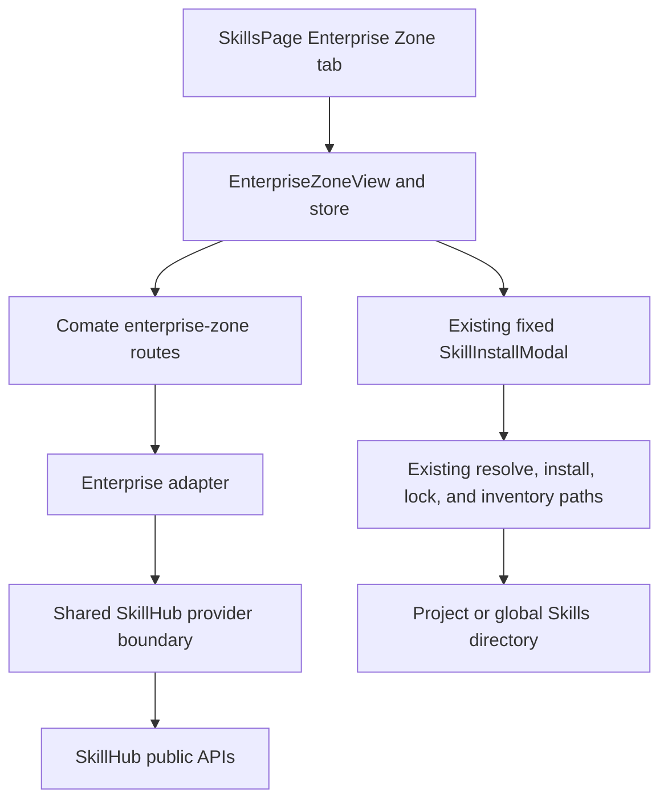
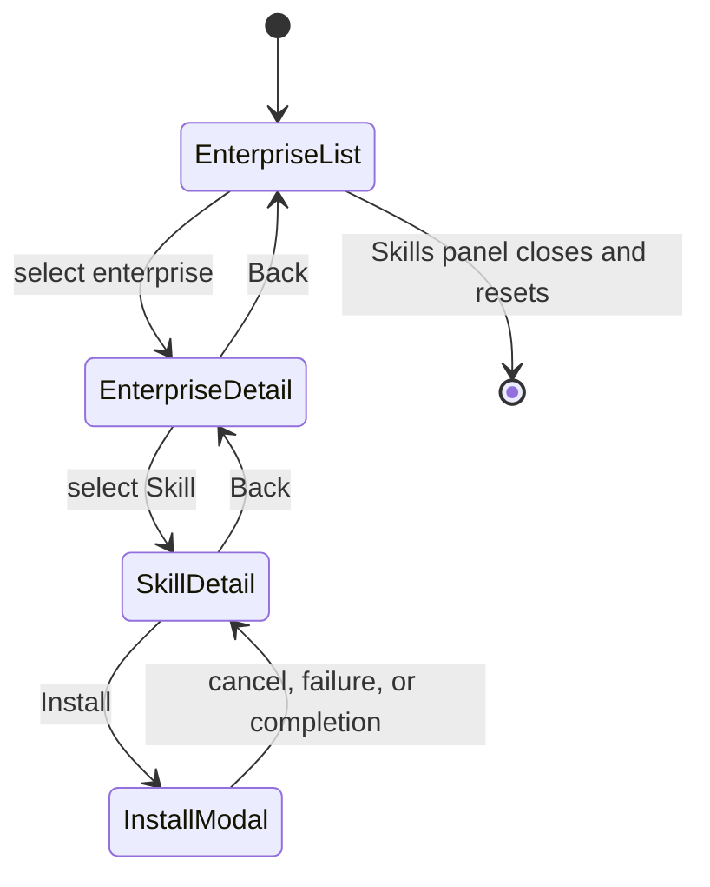
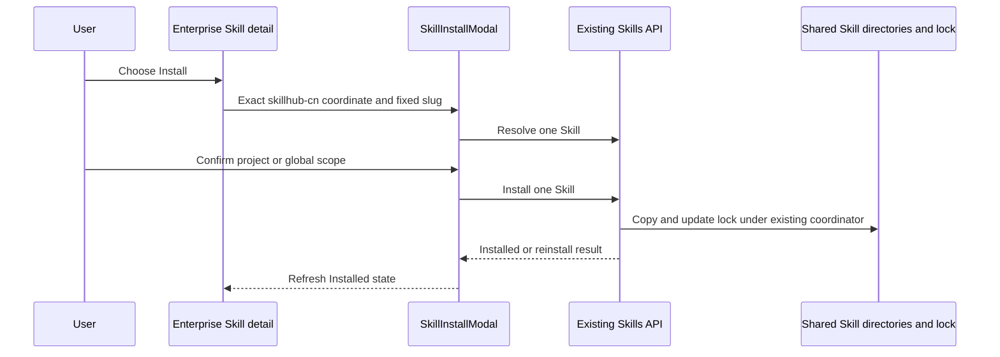

# feat: Integrate SkillHub Enterprise Zone

## Goal Capsule

- **Objective:** Add SkillHub Enterprise Zone to the Skills surface so users can find an enterprise, browse its Skills, inspect one Skill, and install that Skill into the selected project or global scope.
- **Authority order:** This Product Contract owns Enterprise Zone behavior. The existing standard Skill install and lock-file contracts remain authoritative. Expert Package behavior must remain unchanged.
- **Execution profile:** Extend the existing SkillHub provider boundary and Expert Package navigation patterns, but keep Enterprise Skills as ordinary `skillhub-cn:` Skills.
- **Stop conditions:** Stop if the upstream API no longer exposes a stable enterprise identity plus namespace/slug Skill coordinate, or if implementation would require enterprise-wide installation.
- **Tail ownership:** Completion includes server normalization, client navigation, localization, automated coverage, and a live catalog smoke check.
- **Open blockers:** None.

---

## Product Contract

### Summary

Add Enterprise Zone as a peer tab in Skills. The tab contains a searchable, industry-filtered enterprise catalog, an enterprise profile with a searchable and sortable Skill list, and a Skill detail surface. Installation is available only from the Skill detail and installs only that Skill through the existing project/global flow.

### Problem Frame

The app can discover individual Skills and Expert Packages, but it cannot browse Skills by verified enterprise publisher. SkillHub's Enterprise Zone supplies enterprise identities, industry groupings, and enterprise-scoped Skill catalogs. Without this integration, users must leave the app to discover enterprise-published Skills and then return through a separate install path.

### Key Decisions

- **Enterprise Zone is a peer of Expert Packages in the Skills navigation.** (session-settled: user-approved — chosen over nesting Enterprise Zone inside Expert Packages: separate navigation keeps catalog and installation semantics distinct.) Governs R1.
- **An enterprise is a discovery context, not an installable package.** Installing from Enterprise Zone installs one ordinary Skill and never creates an enterprise orchestration item. Governs R8–R10.
- **Mirror the requested three-surface flow, not the complete SkillHub website.** Featured/latest/hot panels, following, publishing, publisher-team filtering, and enterprise administration are outside this integration. Governs R2–R7 and R11.

### Actors

- A1. **Skills user:** Discovers enterprises and installs one selected Skill.
- A2. **SkillHub catalog:** Supplies enterprise, industry, Skill summary, Skill detail, documentation, and security metadata.
- A3. **Comate installer:** Resolves a standard SkillHub coordinate and writes one Skill to the selected scope.

### Requirements

**Enterprise discovery**

- R1. Skills exposes Enterprise Zone as a top-level peer of Installed, Search, and Expert Packages.
- R2. The enterprise catalog supports combined keyword search and dynamic industry filtering, and a change to either control restarts pagination from page 1.
- R3. The enterprise catalog shows identity, verified name, description, industry tags, published Skill count, and download count with distinct initial-loading, refresh-loading, failure, catalog-empty, filtered-empty, and completed states.
- R4. Enterprise pagination uses the upstream total rather than assuming all enterprises fit in one response, and Back restores the prior query, page, and scroll position.
- R5. Industry tags load independently; a tag failure leaves the catalog usable with All industries and a retryable filter error.

**Enterprise Skill browsing**

- R6. An enterprise detail shows its identity, description, industries, and catalog totals, followed by a paginated Skill list with keyword search and downloads, stars, and latest sort choices.
- R7. The enterprise Skill list distinguishes an enterprise with no Skills from a filtered query with no matches, preserves its query, page, and scroll position through Skill detail navigation, and exposes scoped Retry and Back actions when data disappears or fails.

**Skill detail and installation**

- R8. A selected Skill shows enterprise context, publisher and owner metadata, summary, category, version, usage signals, documentation, and available security reports.
- R9. Installing from Enterprise Zone installs exactly the selected `skillhub-cn:<namespace>/<slug>` Skill through the existing project/global confirmation and reinstall flow.
- R10. Enterprise Skills remain ordinary installed Skills with `kind: skill`; no enterprise source kind, package metadata, bulk endpoint, row quick-install, or orchestration item is introduced.

**Compatibility and resilience**

- R11. Switching Skills tabs preserves the current Enterprise Zone navigation state while the Skills panel is open; closing the panel resets it.
- R12. Malformed coordinates, unsafe URLs, oversized or invalid upstream responses, publisher-enterprise mismatches, timeouts, and not-found responses are rejected at the server boundary and produce recoverable UI states.
- R13. Expert Package list, detail, package install, package uninstall, and child-Skill install semantics remain unchanged.
- R14. A successful Enterprise Zone install refreshes Installed state and makes the Skill available through the same shared Skill lifecycle used by an equivalent Search install.

### Key Flows

- F1. **Find an enterprise**
  - **Trigger:** A1 opens Enterprise Zone.
  - **Actors:** A1, A2.
  - **Steps:** The catalog loads; A1 searches and/or selects an industry; A1 changes page and selects an enterprise.
  - **Outcome:** The enterprise profile opens and the catalog context remains restorable.
  - **Covers:** R1–R5.
- F2. **Browse an enterprise's Skills**
  - **Trigger:** A1 opens an enterprise profile.
  - **Actors:** A1, A2.
  - **Steps:** The enterprise Skill list loads; A1 searches, sorts, or changes page; A1 selects one Skill.
  - **Outcome:** The Skill detail opens with the enterprise and Skill-list contexts preserved.
  - **Covers:** R6, R7, R11.
- F3. **Install one enterprise Skill**
  - **Trigger:** A1 chooses Install on a Skill detail.
  - **Actors:** A1, A2, A3.
  - **Steps:** The app resolves the canonical coordinate; A1 selects project or global scope; A3 installs or routes through existing reinstall handling.
  - **Outcome:** Only the selected Skill is installed and Installed state refreshes.
  - **Covers:** R8–R10, R14.
- F4. **Recover from remote drift or failure**
  - **Trigger:** A request fails, returns malformed data, or a selected enterprise or Skill disappears.
  - **Actors:** A1, A2.
  - **Steps:** The active surface disables stale actions and presents Retry plus the appropriate Back path; a later-page failure retains the last valid visible page.
  - **Outcome:** A1 can retry or leave without losing unrelated navigation state.
  - **Covers:** R3, R5, R7, R12.

### Acceptance Examples

- AE1. **Combined enterprise filtering**
  - **Covers R2–R5.**
  - **Given** the user is on page 3 with an industry selected,
  - **When** the user enters a keyword,
  - **Then** the request combines the keyword and industry at page 1, stale page-3 responses cannot replace it, and clearing only the keyword retains the industry.
- AE2. **Independent tag failure**
  - **Covers R3, R5.**
  - **Given** the industry-tag request fails while the enterprise-list request succeeds,
  - **When** Enterprise Zone renders,
  - **Then** enterprises remain browsable under All industries and the filter area offers its own retry.
- AE3. **Two-level context restoration**
  - **Covers R4, R7, R11.**
  - **Given** enterprise and Skill filters, pages, and scroll positions are set,
  - **When** the user opens a Skill and navigates back twice,
  - **Then** each level restores its own controls, page, and scroll; switching tabs preserves them until the Skills panel closes.
- AE4. **Single-Skill installation**
  - **Covers R8–R10, R14.**
  - **Given** an enterprise Skill has namespace `tencent-adm` and slug `tencent-docs`,
  - **When** the user installs it globally,
  - **Then** the request resolves `skillhub-cn:tencent-adm/tencent-docs`, submits only `tencent-docs`, and Installed reports an ordinary global Skill with no enterprise or package metadata.
- AE5. **Catalog drift**
  - **Covers R7, R12.**
  - **Given** a selected Skill no longer belongs to the enterprise or no longer exists,
  - **When** its detail request completes,
  - **Then** no stale Install action remains enabled and the user sees Retry and Back actions.
- AE6. **Expert Package isolation**
  - **Covers R10, R13.**
  - **Given** Enterprise Zone is installed,
  - **When** a user browses or installs an Enterprise Skill,
  - **Then** no Expert Package install endpoint is called and existing Expert Package package-level actions still behave as before.

### Scope Boundaries

- **Included:** Enterprise list, dynamic industries, enterprise profile, enterprise Skill list, Skill detail, individual project/global installation, installed-state refresh, and error recovery.
- **Not included:** Enterprise-wide installation, multi-select, row quick-install, enterprise orchestration, follow/unfollow, publishing, enterprise login, administration, business-unit filtering, and SkillHub featured/latest/hot landing sections.
- **Not included:** A new MCP tool or agent-triggered silent installation. Installation remains a human-confirmed capability change.
- **Preserved:** Existing Search, Installed, and Expert Package behavior outside the minimum shared SkillHub detail extraction.
- **Deferred to Follow-Up Work:** Provider-neutral marketplace automation tools and deep-link routing for nested Skills overlay views.

### Dependencies and Assumptions

- SkillHub continues to return `namespace.handle` plus `slug` for enterprise Skill summaries and `publisher.orgId` for Skill details.
- Skill sort defaults to downloads descending. The supported choices are downloads, stars, and latest.
- Both lists use page-based navigation with page size 20, Previous/Next controls, and a page indicator.
- Remote logo and icon URLs are display-only and are never persisted as installation identity.

### Sources & Research

- Enterprise Zone reference: `https://skillhub.cn/enterprise-zone`.
- Enterprise profile reference: `https://skillhub.cn/enterprise/org-bv6b8qcb`.
- Enterprise list and industry contracts: `https://api.skillhub.cn/api/v1/enterprises` and `https://api.skillhub.cn/api/v1/enterprises/industry-tags`.
- Enterprise detail and Skill-list contracts: `https://api.skillhub.cn/api/v1/enterprises/:orgId` and `https://api.skillhub.cn/api/v1/enterprises/:orgId/skills`.
- Standard Skill detail contract: `https://api.skillhub.cn/api/v1/skills/:slug?namespace=:namespace`.
- Existing Expert Package plan and boundaries: `docs/plans/2026-08-02-001-feat-expert-packages-plan.md`.
- Existing nested navigation and install patterns: `src/client/components/skills/ExpertPackagesView.tsx`, `src/client/components/skills/ExpertPackageSkillDetail.tsx`, and `src/client/components/SkillInstallModal.tsx`.
- Existing SkillHub provider and registry boundaries: `src/server/services/skills/expert-packages.ts` and `src/server/services/skills/registry-source.ts`.

---

## Planning Contract

### Key Technical Decisions

- KTD1. **Extract a one-way provider-neutral SkillHub boundary before adding enterprise reads.** Move bounded JSON fetching, timeout/error mapping, coordinate validation, metadata sanitization, purpose-specific HTTPS URL validation, security normalization, and standard Skill metadata normalization out of the Expert Package-specific module. The shared provider imports neither registry materialization nor service orchestration; Expert Packages and Enterprise Zone depend on it through compatibility-preserving exports. Governs R8, R12, and R13.
- KTD2. **Expose Enterprise Zone only through normalized Comate routes.** The client calls `/api/skills/enterprise-zone/*`; the server forwards supported upstream queries and returns stable Comate types. React never calls SkillHub directly. Governs R2–R8 and R12.
- KTD3. **Use dynamic industries and a fixed server-backed page bound.** Industry keys come from the upstream tag endpoint and are validated by safe shape rather than a release-bound allowlist. Both catalogs request exactly 20 items, retain upstream totals, reject invalid totals or overfull pages, and never prefetch the whole enterprise or Skill catalog. Governs R2–R7.
- KTD4. **Validate Skill membership before archive hydration.** Enterprise Skill detail first fetches normalized JSON metadata and requires the canonical namespace/slug plus `publisher.orgId` to match the request. Only a match may enter the existing documentation materialization path. The validated response coordinate is the sole client install identity; the flow never derives a namespace from `orgId` or scans Skill pages. Governs R8, R9, and R12.
- KTD5. **Keep remote state bounded and resource-scoped.** The Enterprise Zone store owns fetched data, loading/error state, and independent request generations for industries, enterprise page/detail, Skill page, and Skill detail. Commits require the current resource generation and org/coordinate/query identity. Retained data is limited to the enterprise-list snapshot plus the active enterprise and Skill navigation chain. Governs R2–R7, R11, and R12.
- KTD6. **Make the view the sole navigation-query owner.** `EnterpriseZoneView` owns `list → enterprise → skill` location plus the query, page, sort, and scroll snapshots for both list levels. The store never owns competing navigation snapshots. Tab switches preserve the view; closing Skills resets the view and invalidates store requests. Governs R4, R7, and R11.
- KTD7. **Reuse the sanitized standard Skill detail body and fixed-selection installer.** Extract provider-neutral detail presentation from the Expert Package child surface while each parent supplies its own breadcrumbs. Documentation remains untrusted and renders through the existing sanitized Markdown boundary with unsafe active content and link schemes blocked. Enterprise install opens `SkillInstallModal` only from the current validated detail coordinate; the standard resolver must still discover exactly the fixed Skill before scope confirmation or write. Governs R8–R10, R12–R14.
- KTD8. **Keep industry failure and catalog failure separate.** The filter area can degrade to All industries with retry while the enterprise catalog remains interactive. First-load catalog failure uses the full scoped error state; refresh failures retain the last valid data. Governs R3, R5, R7, and R12.
- KTD9. **No new agent surface is required.** Enterprise Skills land in the same shared project/global directories and lock records that agent sessions already consume. Verification proves parity with Search installation; agent-triggered marketplace management remains deferred. Governs R10 and R14.

### High-Level Technical Design

#### Component and data flow

#### Navigation state

#### Individual install sequence

### System-Wide Impact

- **External API boundary:** New read traffic inherits current timeout, bounded-response, structural-count, string-length, safe-URL, and sanitized-error protections. A stable internal shape prevents upstream field drift from leaking into client components.
- **Installed inventory:** Enterprise installs are indistinguishable from the same `skillhub-cn:` Skill installed through Search. No schema, lock, or installed-kind change is required.
- **Expert Packages:** Shared provider extraction touches package code, so regression coverage must prove package discovery, child detail, package install, update, and uninstall still work.
- **Agent context:** Newly created or reloaded sessions see installed Enterprise Skills through the existing shared Skill lifecycle. The plan does not promise hot-loading into an already-running session.
- **Performance:** Fixed 20-item pages, no eager page traversal, resource-scoped cancellation, and active-chain retention bound network, render, and memory cost for catalogs with hundreds of enterprises or thousands of Skills.

### Risks & Mitigations

- **Upstream contract drift:** Validate every response and map provider failures to stable 400/404/502 behavior. Keep live smoke verification outside deterministic unit tests.
- **Stale async responses:** Require resource generation plus org/coordinate/query identity before commit. A late response after navigation, reset, or reopen cannot repopulate state or enable Install.
- **Membership spoofing:** Compare canonical coordinate and normalized `publisher.orgId` before documentation hydration. The client can install only from that validated detail response.
- **Untrusted remote content:** Keep documentation behind sanitized Markdown rendering, restrict actionable links to validated HTTPS destinations, treat unknown security metadata as advisory text, and render image/identity fallbacks when a URL is rejected or expires.
- **Structural amplification:** Reject overfull arrays, duplicate stable identities, oversized identity/display fields, and non-finite, negative, or implausible page totals even when the raw body fits its byte limit.
- **Diagnostic leakage:** Map upstream failures to stable public messages and sanitize bounded log context so response fragments, control characters, archive paths, and signed URL queries do not reach the UI or logs.
- **Accidental bulk semantics:** Omit enterprise install routes and modals entirely. Assert that UI flows never call Expert Package package-install routes.

### Sequencing

1. Establish the one-way shared SkillHub provider boundary and compatibility façade before adding Enterprise types and routes.
2. Land normalized enterprise metadata APIs and membership-before-hydration orchestration before client state or UI.
3. Build store and navigation surfaces before wiring installation.
4. Integrate the top-level tab and localization after nested flows are covered.
5. Finish with cross-surface regression and live external-contract smoke verification.

---

## Implementation Units

### U1. Extract shared SkillHub provider primitives

- **Goal:** Create a provider-neutral boundary used by both Expert Packages and Enterprise Zone.
- **Requirements:** R8, R12, R13; KTD1.
- **Dependencies:** None.
- **Files:** `src/server/services/skills/skillhub.ts`, `src/server/services/skills/skillhub.test.ts`, `src/server/services/skills/expert-packages.ts`, `src/server/services/skills/expert-packages.test.ts`, `src/server/services/skills/types.ts`, `src/server/services/skills/index.ts`.
- **Approach:** Extract the current bounded fetch, timeout, stable error, coordinate, metadata, purpose-specific HTTPS URL, security-report, and standard Skill metadata logic without changing Expert Package outputs. Preserve publisher enterprise identity for membership checks. Keep archive hydration in `SkillsService` and preserve existing exports through aliases or re-exports so the new provider layer has no reverse dependency.
- **Patterns to follow:** `src/server/services/skills/expert-packages.ts`, `src/server/services/skills/bounded-response.ts`, and `src/server/services/skills/registry-source.ts`.
- **Test scenarios:**
  1. A valid SkillHub Skill normalizes namespace, slug, owner, publisher org, version, usage, recognized security metadata, and canonical `skillhub-cn:` source.
  2. Invalid coordinates, oversized identity/display fields, malformed JSON, oversized bodies, timeouts, unsafe URL destinations, and unsanitized diagnostics return stable provider errors.
  3. Unknown security providers or invalid report destinations remain untrusted text and cannot open an external URL.
  4. Existing Expert Package list, package detail, child hydration, package install/retry/update, uninstall, and child install retain their source, kind, lock metadata, and route-status behavior after extraction.
- **Verification:** Provider tests pass and the Expert Package public types and sources remain unchanged.

### U2. Add normalized Enterprise Zone read APIs

- **Goal:** Expose dynamic industries, enterprise pages, enterprise details, enterprise Skill pages, and enterprise-bound Skill details through the existing Skills route group.
- **Requirements:** R2–R8, R12, R13; KTD2–KTD4.
- **Dependencies:** U1.
- **Files:** `src/server/services/skills/enterprise-zone.ts`, `src/server/services/skills/enterprise-zone.test.ts`, `src/server/services/skills/types.ts`, `src/server/services/skills/index.ts`, `src/server/services/skills-service.ts`, `src/server/services/skills-service.test.ts`, `src/server/routes/skills.ts`, `src/server/routes/skills.test.ts`.
- **Approach:** Normalize the observed upstream endpoints under `/api/skills/enterprise-zone/*`. Fix the server page size at 20. Validate safe industry shape, sort values, page bounds, org IDs, coordinates, array counts, unique identities, and totals. For Skill detail, compare canonical metadata and publisher org before the existing service layer materializes documentation.
- **Patterns to follow:** Expert Package provider error mapping and route validation in `src/server/routes/skills.ts`; documentation hydration and temporary cleanup in `src/server/services/skills-service.ts`.
- **Test scenarios:**
  1. Enterprise list forwards combined keyword, industry, downloads sort, page, and page size and returns normalized total/page metadata.
  2. Industry tags remain dynamic and sort by the upstream order; a newly introduced safe key works without a release while malformed keys fail locally.
  3. Enterprise Skill list forwards keyword plus each supported sort and maps `namespace.handle` plus slug into a canonical source.
  4. Invalid industry, sort, pagination, org ID, or coordinate returns 400 without an upstream call.
  5. Missing resources return 404; timeouts or invalid upstream responses map to the existing provider failure status.
  6. Skill detail returns documentation only when the returned canonical coordinate and `publisher.orgId` match the request; mismatch is rejected before archive download.
  7. An overfull 21-item page, duplicate identities, or invalid total/page metadata returns an invalid-response error rather than partial normalized output.
  8. Provider errors expose stable public messages and bounded sanitized logs without raw response fragments, archive paths, control characters, or signed URL queries.
  9. No Enterprise Zone route supports install, uninstall, multi-select, or package orchestration.
- **Verification:** Route and service tests prove the complete normalized read contract while existing Expert Package routes retain their responses.

### U3. Build Enterprise Zone client state

- **Goal:** Own the two paginated catalogs and keyed details without coupling them to Search or Expert Package state.
- **Requirements:** R2–R7, R11, R12; KTD3, KTD5, KTD8.
- **Dependencies:** U2.
- **Files:** `src/client/stores/enterprise-zone-store.ts`, `src/client/stores/enterprise-zone-store.test.ts`.
- **Approach:** Store industries, fetched pages, active enterprise detail, and active Skill detail while the view owns navigation queries. Key Skill detail by org ID plus coordinate. Use independent resource generations/controllers; every commit checks its current identity. Retain only the active navigation chain. Preserve the last valid page during same-query refresh failure without relabeling it as a failed target page. Reset invalidates pending work before clearing state.
- **Patterns to follow:** `src/client/stores/expert-packages-store.ts` request cancellation, keyed caching, error state, and reset contract.
- **Test scenarios:**
  1. Rapid enterprise keyword and industry changes commit only the latest response and request page 1.
  2. Rapid Skill keyword and sort changes commit only the latest response and request page 1.
  3. A later-page failure retains the last valid visible items and exposes a retryable error.
  4. Industry failure remains isolated from a successful enterprise page and retry replaces only the filter error.
  5. A slow enterprise or Skill A response cannot overwrite B, and the same coordinate under two enterprise contexts cannot reuse membership authorization.
  6. Visiting many enterprises and Skills keeps retained details within the active-chain bound.
  7. A pre-reset response completing after close/reopen cannot repopulate the new panel state.
- **Verification:** Store tests prove query serialization, latest-response wins, page reset, partial degradation, cache isolation, and reset behavior.

### U4. Implement enterprise catalog and profile navigation

- **Goal:** Deliver the enterprise list and enterprise profile with its paginated Skill list.
- **Requirements:** R1–R7, R11, R12; KTD3, KTD5, KTD6, KTD8.
- **Dependencies:** U2, U3.
- **Files:** `src/client/components/skills/EnterpriseZoneView.tsx`, `src/client/components/skills/EnterpriseList.tsx`, `src/client/components/skills/EnterpriseDetail.tsx`, `src/client/components/skills/EnterpriseZoneView.test.tsx`.
- **Approach:** Mirror the Expert Package composition for the enterprise list and enterprise profile. The view owns separate enterprise-list and Skill-list query/page/scroll snapshots. Render one 20-row page with dynamic industries and bounded navigation. U4 stops at selecting a Skill; U5 adds the Skill-detail location and second-level return path.
- **Patterns to follow:** `src/client/components/skills/ExpertPackagesView.tsx`, `src/client/components/skills/ExpertPackageList.tsx`, and `src/client/components/skills/ExpertPackageDetail.tsx`.
- **Test scenarios:**
  1. Enterprise keyword and industry combine, page changes use upstream totals, and clearing keyword keeps industry.
  2. Industry failure still renders enterprises under All industries with a scoped retry control.
  3. Catalog-empty and filtered-empty states have distinct copy and clear actions.
  4. Enterprise detail renders identity and totals; its Skill search, downloads/stars/latest sort, and pagination combine correctly.
  5. Enterprise-with-no-Skills and filtered-no-Skills states are distinct, and clearing Skill keyword retains sort.
  6. Back from enterprise detail restores enterprise query/page/scroll.
  7. Enterprise or Skill-list 404/failure shows Retry and Back instead of a blank surface.
  8. Fixtures with totals of 881 enterprises and more than 1,000 Skills render only the requested 20-item page and trigger no eager page traversal.
- **Verification:** Component tests cover both list levels, responsive controls, accessible names, state restoration, and all loading/error/empty states.

### U5. Reuse Skill detail and individual installation

- **Goal:** Show a complete enterprise Skill detail and install only that Skill through the canonical installer.
- **Requirements:** R7–R10, R12–R14; KTD4, KTD7, KTD9.
- **Dependencies:** U1–U4.
- **Files:** `src/client/components/skills/SkillHubSkillDetail.tsx`, `src/client/components/skills/ExpertPackageSkillDetail.tsx`, `src/client/components/skills/EnterpriseSkillDetail.tsx`, `src/client/components/skills/EnterpriseZoneView.tsx`, `src/client/components/skills/EnterpriseZoneView.test.tsx`, `src/client/components/SkillInstallModal.tsx`, `src/client/components/SkillInstallModal.test.tsx`.
- **Approach:** Add the `skill` navigation location and its second-level Back restoration. Extract the common metadata, sanitized documentation, advisory security, and install-button body from the Expert Package child detail. Keep parent-specific breadcrumbs in thin wrappers. Build the fixed-selection modal handoff only from the current server-validated detail coordinate and selection identity. In fixed-selection mode, continue to scope confirmation only when resolution returns exactly one Skill whose name equals `fixedSkillName`; zero, multiple, or differently named results enter the recoverable resolve-error state without enabling confirmation or installation. Refresh Installed on success; cancel or failure leaves the detail intact.
- **Patterns to follow:** `src/client/components/skills/ExpertPackageSkillDetail.tsx`, `src/client/components/SkillInstallModal.tsx`, and `src/client/stores/skills-store.ts`.
- **Test scenarios:**
  1. Enterprise breadcrumb, publisher/owner metadata, version, usage, documentation, and safe security links render from normalized detail.
  2. Missing documentation shows the existing empty message and missing security reports omit the section.
  3. Install opens with one fixed Skill, hides siblings, and submits the exact source/slug for project and global scope.
  4. Returned coordinate mismatch, publisher mismatch, tampered list metadata, stale A-after-B detail response, or resolve-time zero/multiple/differently named Skills prevents installation and performs no write.
  5. Cancel and install failure retain the detail; success refreshes Installed and disables Install for an exact-source match in either scope.
  6. The flow never renders enterprise bulk, multi-select, row quick-install, or Expert Package install actions.
  7. Raw HTML, event-handler markup, encoded unsafe links, and unsupported URL schemes in documentation do not execute or open.
  8. Back from Skill detail restores the enterprise Skill query, sort, page, and scroll snapshot.
  9. Expert Package child detail retains its breadcrumbs, shared body, and individual-install behavior after extraction.
- **Verification:** Shared detail tests and fixed-selection modal tests prove identical standard installation behavior from Enterprise Zone and Expert Packages.

### U6. Integrate the tab, localization, and cross-surface regressions

- **Goal:** Add Enterprise Zone to the complete Skills overlay without exposing unrelated actions or changing existing tabs.
- **Requirements:** R1, R10–R14; KTD6, KTD7, KTD9.
- **Dependencies:** U4, U5.
- **Files:** `src/client/components/SkillsPage.tsx`, `src/client/components/SkillsPage.browser.test.tsx`, `src/client/i18n/en/settings.json`, `src/client/i18n/zh-CN/settings.json`.
- **Approach:** Add the fourth tab, mount the nested view, refresh Installed after a successful install, and reset the Enterprise store only when the panel closes. Restrict Add from URL to Installed and Search instead of using the current Expert Package-only exclusion.
- **Patterns to follow:** Existing tab definitions and Expert Package mount/reset handling in `src/client/components/SkillsPage.tsx`.
- **Test scenarios:**
  1. The Enterprise Zone tab is keyboard-accessible and opens the enterprise list.
  2. List → enterprise → Skill navigation works within the overlay and state survives switching to another tab.
  3. Closing and reopening Skills resets Enterprise Zone to its initial catalog state.
  4. Add from URL is absent on Enterprise Zone and Expert Packages but remains available on Installed and Search.
  5. A completed Enterprise install refreshes Installed and shows the Skill as ordinary `kind: skill` with no package grouping.
  6. Existing Expert Package navigation, package actions, and child-Skill installation retain their browser coverage.
- **Verification:** Browser tests demonstrate the full three-surface journey, correct action visibility, reset boundary, and Expert Package isolation in English and Chinese resources.

---

## Verification Contract

| Gate | Applies to | Required outcome |
|---|---|---|
| `npm run test:server` | U1, U2 | Shared provider extraction and every normalized enterprise route pass, including canonical identity, structural bounds, URL policy, sanitized diagnostics, membership-before-hydration, archive single-Skill, and Expert Package lifecycle regressions. |
| `npm run test:client` | U3–U6 | Store, component, sanitized-document, membership-scoped cache, stale-install invalidation, localization-backed, and fixed single-Skill install scenarios pass. |
| `npm run test:browser` | U6 | The Skills overlay completes list → enterprise → Skill navigation and preserves other tab behavior. |
| `npm run lint` | All units | New types, hooks, async effects, and accessibility attributes satisfy repository rules with no warnings. |
| `npm run build` | All units | Client, server, and existing CLI workspaces compile without contract drift. |
| Deterministic scale fixture | U2–U4 | Totals of 881 enterprises and more than 1,000 Skills still return/render one 20-item page; rapid query churn cannot commit stale data; retained details stay within the active-chain bound. |
| Live SkillHub smoke | U2, U4, U5 | One real industry filter, one enterprise with multiple Skill pages, all three sorts, and one Skill detail resolve through one request per settled action; no eager traversal occurs and no deterministic test depends on live data. |
| Agent lifecycle smoke | U5, U6 | A Skill installed from Enterprise Zone appears through Installed and is discoverable by a newly created or reloaded agent session exactly like the same Search install. |

---

## Definition of Done

- Enterprise Zone is a fourth Skills tab with the confirmed three-surface journey.
- Enterprise and enterprise-Skill catalogs support combined controls, bounded pagination, latest-request-wins state, context restoration, and distinct loading/error/empty states.
- Industry-tag failure degrades only the filter surface.
- Skill detail is hydrated and membership-validated through the shared SkillHub provider boundary.
- No untrusted Enterprise Zone field becomes executable markup, an automatic install identity, or a trusted security assertion without its purpose-specific validation.
- Installation uses the existing fixed single-Skill modal and produces an ordinary `skillhub-cn:` installed Skill in the selected scope.
- No enterprise bulk install, enterprise installed kind, package metadata, orchestration item, follow, publishing, or administration behavior is present.
- Expert Package and Search behavior passes regression coverage after shared-detail/provider extraction.
- Server, client, browser, lint, build, live-catalog, and agent-lifecycle verification gates pass.
- English and Simplified Chinese copy covers every new control, state, and error surface.
- Abandoned experiments, duplicate provider helpers, unused enterprise install paths, and stale test fixtures are removed from the final diff.
