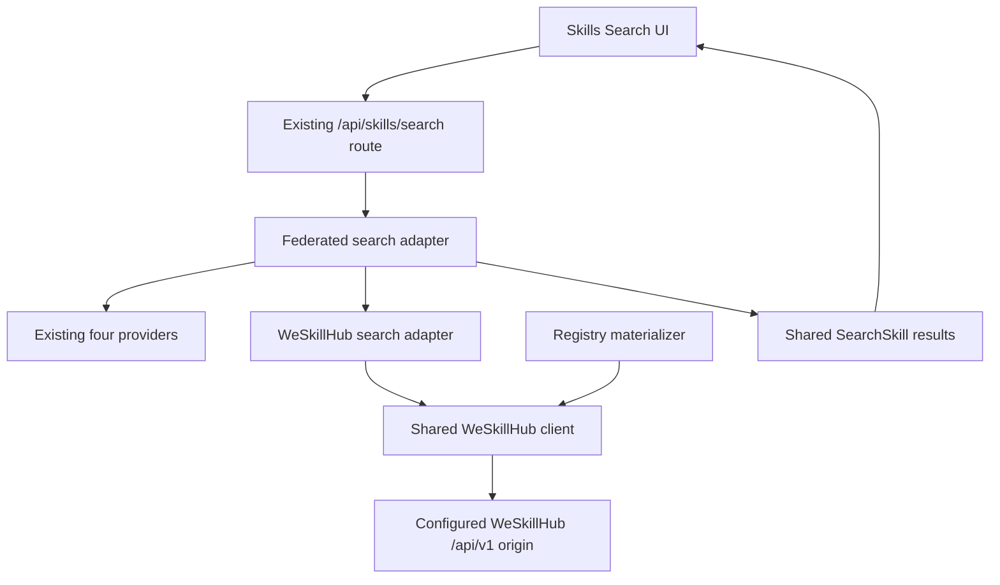
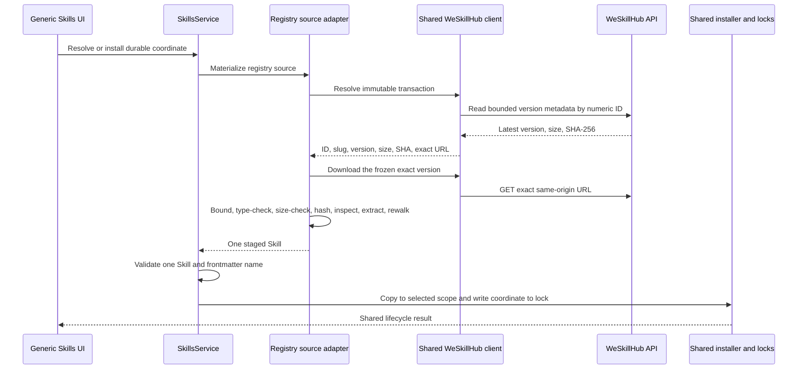

# WeSkillHub Federated Skill Provider - Plan

## Goal Capsule

- **Objective:** Add WeSkillHub as a fifth provider in Comate's federated Skills search and support the standard project/global install, discovery, update, and removal lifecycle.
- **Authority order:** This Product Contract owns WeSkillHub behavior. Existing federated-search, registry archive, lock-file, Expert Package, and Enterprise Zone contracts remain authoritative outside the new provider.
- **Execution profile:** Extend the Comate-owned search and registry adapters. Keep the generic Skills UI and installer lifecycle.
- **Stop conditions:** Stop if WeSkillHub no longer exposes a stable numeric Skill ID, slug, version record, size, SHA-256, and downloadable ZIP, or if the integration requires credentials over plain HTTP.
- **Tail ownership:** Completion includes server normalization, verified archive materialization, lifecycle coverage, client copy/type updates, and a live internal-network smoke check.
- **Open blockers:** None.

---

## Product Contract

### Summary

Add WeSkillHub results to the existing Search tab. A result installs through the same scope picker and project/global lifecycle as other catalog Skills. WeSkillHub-specific API fields, transport behavior, and download verification remain behind the server boundary.

### Problem Frame

Comate federates four external Skill sources but does not search the internal WeSkillHub catalog at `weskillhub.weoa.com`. Users must leave Comate to discover those Skills and install ZIP files manually. The catalog uses a distinct API envelope, a numeric ID plus slug identity, and a name that can differ from its download slug, so it cannot be safely added as a URL alias for an existing provider.

### Key Decisions

- **WeSkillHub joins federated Search and the standard install lifecycle.** (session-settled: user-directed — chosen over search-only results or a separate WeSkillHub tab: the user selected full federated search and in-app installation.) Governs R1-R3 and R8-R11.
- **Individual Skills are the only WeSkillHub product surface in scope.** Skill groups, recommendation, publishing, CLI marketplace, favorites, and administration remain outside this integration. Governs R1 and R12.
- **The internal HTTP service is a trusted-network dependency, not a credential channel.** Comate sends no credentials and does not describe same-channel SHA-256 verification as protection from an on-path attacker. Governs R4-R7 and R13.

### Actors

- A1. **Skills user:** Searches for a capability and manages one WeSkillHub Skill in project or global scope.
- A2. **WeSkillHub catalog:** Supplies search metadata, version metadata, and ZIP archives.
- A3. **Comate Skills lifecycle:** Verifies, installs, discovers, updates, and removes Skills through shared directories and lock files.
- A4. **Agent runtime:** Loads the resulting project/global Skill through the existing session lifecycle.

### Requirements

**Discovery and federation**

- R1. A non-empty Search query includes WeSkillHub alongside `skills.sh`, SkillsHub, iFlytek SkillHub, and Tencent SkillHub without adding a new tab or route.
- R2. WeSkillHub results normalize numeric ID, name, slug, description, downloads, and update date into the shared `SearchSkill` contract while preserving a durable provider coordinate.
- R3. WeSkillHub maps only its supported keyword and sort inputs; scene, Chinese preference, and no-API-key filters are omitted rather than translated into invented provider semantics.
- R4. An empty query makes no WeSkillHub request, and any WeSkillHub timeout, oversized response, non-2xx response, non-`"0"` application code, malformed envelope, or invalid record contributes no results without hiding healthy providers.

**Verified source materialization**

- R5. A WeSkillHub install coordinate carries the stable numeric Skill ID and download slug needed to resolve one version record and one archive.
- R6. Each resolve, install, or update selects exactly one provider-marked latest version and freezes its ID, slug, version, advertised byte size, SHA-256, and exact same-origin download URL in one immutable materialization transaction before downloading that exact version.
- R7. Comate byte-bounds search and version JSON as well as archive bodies; rejects redirects, unexpected content types, oversized or truncated bodies, size mismatches, checksum mismatches, unsafe ZIP entries, symlinks, special files, and expansion-limit violations; revalidates the extracted staging tree; and removes staging artifacts before any installed directory or lock entry changes.

**Shared lifecycle and agent parity**

- R8. A valid archive contains exactly one discoverable Skill, but its `SKILL.md` name may differ from the WeSkillHub slug; the frontmatter name owns the installed directory and user-visible installed identity.
- R9. Project and global installs persist the durable WeSkillHub coordinate with `sourceType: registry`, retain existing source-collision protection, and appear through standard Installed discovery.
- R10. Update resolves the current provider-marked latest version from the persisted coordinate, verifies it before replacement, and remove uses the existing filesystem and lock cleanup behavior.
- R11. A successfully installed Skill becomes available to A4 under the same session refresh or restart behavior as an equivalent Skill from another provider; no WeSkillHub-only runtime loader or hot-reload promise is introduced.

**Compatibility and trust boundary**

- R12. Existing providers, Expert Packages, Enterprise Zone, direct source installation, and installed kinds keep their current behavior and source coordinates.
- R13. The default API origin is configurable for deployment and tests, but configuration rejects userinfo, query, and fragment components; endpoint construction stays on the normalized configured HTTP(S) origin, sends no provider credentials, and rejects every redirect.
- R14. English and Simplified Chinese Search guidance names WeSkillHub, and existing generic cards and install modal display and install its results without provider-specific UI state.

### Key Flows

- F1. **Search and install a WeSkillHub Skill**
  - **Trigger:** A1 enters a non-empty query in the Search tab.
  - **Actors:** A1, A2, A3.
  - **Steps:**
    1. Federation queries all providers and WeSkillHub returns a normalized result.
    2. A1 opens the standard install modal and selects project or global scope.
    3. A3 resolves and verifies the exact latest archive.
    4. A3 installs the Skill and records the source coordinate.
  - **Outcome:** The Skill appears in Installed and follows the shared runtime lifecycle.
  - **Covered by:** R1-R9, R11, R13, R14.
- F2. **Update or remove a WeSkillHub Skill**
  - **Trigger:** A1 uses an Installed action on a WeSkillHub-origin Skill.
  - **Actors:** A1, A2, A3.
  - **Steps:** Update reuses the persisted coordinate to verify the latest archive before replacement. Remove uses the shared directory and lock cleanup path.
  - **Outcome:** Installed state and the lock file agree after either action.
  - **Covered by:** R7, R9, R10, R12.
- F3. **Continue when WeSkillHub is unavailable or unsafe**
  - **Trigger:** Search or materialization encounters a timeout, protocol error, invalid metadata, or invalid archive.
  - **Actors:** A1, A2, A3.
  - **Steps:**
    1. Search drops only WeSkillHub results.
    2. Resolve, install, or update returns a provider-scoped failure before mutation.
    3. Other providers and other update-all items continue.
  - **Outcome:** Healthy results and the prior installed state remain available.
  - **Covered by:** R4, R6, R7, R10, R12, R13.

### Acceptance Examples

- AE1. **Covers F1 / R2, R5, R8, R9.** Given the API returns numeric ID `116`, slug `weoa-todo`, and name `todo`, when A1 installs the result at project scope, then Comate resolves `weskillhub:116/weoa-todo`, verifies one archive, installs directory `todo`, and stores that provider coordinate in the project lock.
- AE2. **Covers F3 / R4, R12.** Given WeSkillHub times out while two other providers return results, when federation completes, then the two healthy results render and the Search tab does not show a page-wide provider failure.
- AE3. **Covers F3 / R6, R7, R10.** Given an installed WeSkillHub Skill and a latest-version response whose ZIP bytes do not match the advertised size or SHA-256, when A1 updates, then the update fails before replacement and the existing directory and lock entry remain unchanged.
- AE4. **Covers F2 / R5, R6, R9, R10.** Given a global WeSkillHub Skill installed from version `1.0.0`, when the provider marks `1.1.0` as latest, then Update downloads `1.1.0` explicitly, verifies its metadata, replaces the Skill through the shared path, and retains the same durable provider coordinate for future updates.
- AE5. **Covers F3 / R4, R6, R7.** Given search or version metadata has a declared or streamed body larger than the 1 MiB provider JSON limit, including a falsely small `Content-Length`, when Comate reads it, then only the WeSkillHub operation fails and no raw body or installed state is exposed or changed.
- AE6. **Covers F3 / R7.** Given a ZIP attempts traversal, a symlink or special file, an entry-count or expanded-byte overrun, or leaves a hostile object after extraction, when Comate stages it, then post-extraction validation fails, the private staging directory is removed, and the prior install and lock are unchanged.
- AE7. **Covers F3 / R7, R9, R10, R13.** Given an update targets a name owned by a different source, changes the installed frontmatter name, redirects, or returns a provider error containing internal paths or payload text, then Comate rejects the operation before force-copy and returns only a stable sanitized provider error.

### Scope Boundaries

**Included**

- Federated keyword search, supported sort mapping, result normalization, and provider failure isolation.
- Bounded metadata reads and exact-version ZIP download with byte-size, SHA-256, content-type, redirect, staging cleanup, and pre/post-extraction archive-safety checks.
- Standard project/global resolve, install, installed discovery, update, remove, and agent-runtime visibility.
- Minimal client type, copy, and browser coverage for the generic result flow.

**Not included**

- A dedicated WeSkillHub tab, Skill detail page, groups, publishing, recommendations, favorites, ratings, CLI marketplace, or administration.
- WeSkillHub account login, tokens, cookies, private API access, or transmission of Comate credentials.
- New scene/category mappings or inferred equivalents for unsupported search filters.
- Changes to Expert Package or Enterprise Zone models and installed kinds.

### Deferred to Follow-Up Work

- Enable authenticated transport after WeSkillHub publishes a working HTTPS endpoint or signed metadata/package contract. Same-channel SHA-256 over HTTP is integrity evidence, not origin authentication.
- Make forced reinstall/update replacement atomic across every provider. This plan keeps WeSkillHub network, metadata, and archive failures before the existing copy mutation, but the generic installer can still lose a prior directory on a later copy, hash, or lock-write failure.
- Persist provider version, advertised archive size, and archive SHA-256 in lock files for historical audit or installed-version UI. The active contract keeps these values transaction-scoped and persists the durable coordinate plus the existing computed installed-folder hash.

### Dependencies and Assumptions

- The observed `/api/v1` contract remains active but undocumented; deterministic fixtures are the CI authority.
- Numeric Skill IDs and slugs are stable provider identities, and exactly one version entry is marked `is_latest: true`.
- The app runs where the internal `weskillhub.weoa.com` origin is reachable. Lack of reachability behaves as provider-local unavailability.
- The existing agent runtime session refresh/restart contract applies after installation and update.

---

## Planning Contract

### Key Technical Decisions

- KTD1. **Extend the Comate-owned adapters, not vendored Skills code.** Add WeSkillHub to `src/server/services/skills/search.ts`, `src/server/services/skills/registry-source.ts`, and shared Comate types. Keep `src/server/vendor/vercel-skills/` untouched. Governs R1-R4 and R12.
- KTD2. **Use `weskillhub:<numeric-id>/<slug>` as the durable coordinate.** The ID resolves version metadata and the slug resolves the archive. The same coordinate serves as result identity, install source, and lock source, so update does not search by mutable display metadata. Governs R2, R5, R9, and R10.
- KTD3. **Resolve and verify one exact version per materialization.** Require one valid `is_latest` record and construct one immutable transaction value containing ID, slug, selected version, advertised byte size, SHA-256, and exact download URL. The same value drives download and verification, so `latest` is never re-resolved mid-transaction. Bound search and version JSON at 1 MiB each, bound the archive with the existing 20 MiB compressed limit, validate ZIP content type and advertised size, and compute SHA-256 over the bounded bytes before writing or extracting. These values stay transaction-scoped; the existing lock schema remains unchanged. Governs R4, R6, R7, R10, and R13.
- KTD4. **Treat the configured API base as a trusted operator boundary.** Parse and normalize it once with WHATWG `URL`; allow only HTTP(S); reject credentials, query, and fragment components; encode path/query values; and reassert same-origin construction for every request. Use fresh timeout signals, set redirects to error, send no authorization or cookie headers, and return stable sanitized errors without response bodies, provider URLs, redirect targets, archive entry names, or temporary paths. The default remains the user-named internal HTTP origin until WeSkillHub supports HTTPS. Governs R4, R7, and R13.
- KTD5. **Separate catalog coordinate from installed Skill name and validate ownership before mutation.** For WeSkillHub, require exactly one discovered Skill and let its validated frontmatter name satisfy the initial install request. Preserve slug-equals-name validation for current registry providers. Before any forced copy, compare the destination lock's stored coordinate with the requested coordinate and reject a different owner; on update, also reject a changed frontmatter name or canonical destination. Governs R5, R7-R10, and R12.
- KTD6. **Reuse the generic client and runtime lifecycle.** Extend the `sourceKind` union and guidance copy only. Search cards, the install modal, lock discovery, and agent availability use existing shared paths. Governs R1, R9, R11, R12, and R14.
- KTD7. **Centralize the provider protocol.** Add one shared WeSkillHub client/helper that owns base-origin validation, same-origin endpoint construction, deadlines, redirect policy, bounded JSON reads, envelope/DTO validation, exact-version transaction construction, and public error categories. Search and registry materialization consume this boundary rather than duplicating transport logic. Governs R2-R7, R10, R12, and R13.

### High-Level Technical Design

#### Provider topology

#### Verified lifecycle sequence

### Sequencing

1. Establish the provider search contract and durable coordinate before materialization work.
2. Add exact-version verification and archive handling before connecting the coordinate to install/update.
3. Tighten provider-specific name validation and prove the full lifecycle after materialization is stable.
4. Finish with generic client types, guidance copy, and browser-level flow coverage.

### System-Wide Impact

- **External dependency:** Search gains a fifth live request. The existing 1.5-second provider deadline and `Promise.allSettled` isolation remain the latency and availability boundary.
- **Filesystem and lock state:** WeSkillHub uses existing project/global directories and `sourceType: registry`; no migration or new installed kind is introduced.
- **Security:** The provider is HTTP-only today. Exact-host construction, no credentials, redirect rejection, bounded archives, and checksum validation reduce accidental and server-side failures but do not authenticate the HTTP response.
- **Agent parity:** UI installs land in the same durable Skill directories consumed by agent sessions. No UI-only cache or provider-specific runtime state is introduced.
- **Compatibility:** Shared unions gain one source kind. Existing exhaustive fixtures and federated request-count assertions must be updated without changing provider order or semantics.

### Risks and Mitigations

| Risk | Mitigation |
|---|---|
| Undocumented API envelope or field drift | Centralize runtime validation in one provider client, reject non-`"0"` codes, keep deterministic contract fixtures, and include a live smoke check |
| Plain HTTP permits metadata and archive replacement together | Send no credentials, reject redirects, constrain endpoints to the configured origin, state the residual risk, and keep HTTPS/signed metadata as follow-up |
| Oversized or deceptive JSON exhausts memory | Use the bounded response helper with a 1 MiB cap for both metadata endpoints and test declared, streamed, false-length, exact-limit, and limit-plus-one bodies |
| Provider adds multiple or missing latest markers | Fail materialization before download or mutation; do not guess by version sorting |
| Name differs from slug | Persist ID/slug coordinate but install exactly one validated frontmatter name; test `todo` from `weoa-todo` |
| JSON or an error page arrives from the download endpoint | Require a ZIP-compatible content type before archive inspection and report a provider-scoped error |
| Archive behavior changes during or after extraction | Use a private staging directory, validate entries before extraction, rewalk with `lstat` afterward, enforce actual counts/sizes/types, and clean staging on every outcome |
| A fifth provider slows or breaks Search | Reuse the per-request deadline and settled-result isolation; test WeSkillHub timeout with healthy peers |
| Force update overwrites a directory owned by another source | Check lock ownership, stable frontmatter name, and canonical destination inside the scope mutation coordinator before force-copy |
| Forced copy or lock persistence fails after provider verification | Keep all WeSkillHub-specific failures before copy; defer a shared atomic replacement refactor and retain this residual generic-installer risk |
| Provider failures expose internal data | Map failures to bounded stable categories and keep raw bodies, URLs, entry names, and temporary paths out of client errors and routine logs |

---

## Implementation Units

### U1. Shared WeSkillHub client and federated search adapter

- **Goal:** Return installable WeSkillHub results through the existing federated Search contract.
- **Requirements:** R1-R5, R12-R14; KTD1-KTD4, KTD7.
- **Dependencies:** None.
- **Files:**
  - Add `src/server/services/skills/weskillhub.ts`
  - Add `src/server/services/skills/weskillhub.test.ts`
  - Modify `src/server/services/skills/search.ts`
  - Modify `src/server/services/skills/types.ts`
  - Modify `src/server/services/skills/search.test.ts`
  - Modify `src/server/services/skills/bounded-response.test.ts`
- **Approach:**
  1. Add a shared provider client that validates and normalizes the configurable base once, constructs encoded same-origin endpoints, creates a fresh deadline per request, rejects redirects, sends no credentials, reads JSON through `readBoundedResponse` with a 1 MiB limit, validates the string-code envelope, and maps failures to sanitized categories.
  2. Add a search adapter over that client using page 1, the existing per-provider limit, the raw keyword, and confirmed sort mappings; validate required fields, sanitize metadata, parse update dates consistently, and normalize the durable ID/slug coordinate.
  3. Add the adapter to the current provider list without changing federation, deduplication, ordering, or failure-isolation rules.
- **Execution note:** Start with failing contract and federation tests because the external envelope is undocumented.
- **Patterns to follow:** `searchSkillhubCnSkills`, `fetchWithDeadline`, `sanitizeMetadata`, and `searchFederatedSkills` in `src/server/services/skills/search.ts`.
- **Test scenarios:**
  - A non-empty query and `score`, `downloads`, or `newest` sort produces `search`, `page_size=10`, and `hot`, `downloads`, or `update_date` parameters respectively.
  - A valid string-code `"0"` response normalizes numeric ID, distinct name and slug, description, downloads, UTC update timestamp, `sourceKind: weskillhub`, and `installSource: weskillhub:<id>/<slug>`.
  - Records with missing or non-numeric ID, unsafe or empty slug, empty name, or malformed update/download metadata are dropped or defaulted according to the shared contract without leaking raw control characters.
  - Empty input makes no request; non-2xx, timeout, invalid JSON, non-`"0"` code, and malformed/missing `data.data` return an empty provider result.
  - A declared oversize body, a chunked body without `Content-Length`, a falsely small declared length, exactly 1 MiB, and 1 MiB plus one byte exercise the shared bounded-reader contract; over-limit failures remain provider-local.
  - Configured bases with a non-HTTP(S) scheme, credentials, query, or fragment are rejected; generated paths encode segments and queries, remain exact-origin, reject every redirect, and omit authorization and cookie headers.
  - Public failures contain a stable category without raw response text, configured URLs, redirect targets, or control characters.
  - Federated Search issues five concurrent requests, retains healthy peer results when WeSkillHub fails, and applies shared downloads/newest sorting across all returned providers.
  - Scene, Chinese preference, and no-API-key filters do not add unsupported WeSkillHub query parameters or natural-language suffixes.
- **Verification:** Focused search tests prove the provider contract and the unchanged federation behavior.

### U2. Exact-version registry materialization

- **Goal:** Convert a WeSkillHub coordinate into one verified, safely extracted Skill archive.
- **Requirements:** R5-R7, R10, R12, R13; KTD2-KTD4, KTD7.
- **Dependencies:** U1.
- **Files:**
  - Modify `src/server/services/skills/registry-source.ts`
  - Modify `src/server/services/skills/index.ts`
  - Modify `src/server/services/skills/registry-source.test.ts`
  - Reuse `src/server/services/skills/weskillhub.ts` and its tests from U1
- **Approach:**
  1. Parse `weskillhub:<numeric-id>/<slug>` into a standard registry Skill source and reject malformed, traversal-like, or partial coordinates.
  2. Ask the shared provider client to resolve exactly one valid latest version by numeric ID, validate advertised size and SHA-256, and return one immutable transaction value containing the durable coordinate fields and exact same-origin download URL.
  3. Consume that same transaction value for a fresh-deadline, no-credentials, redirect-rejecting download; use the existing bounded response path, then validate content type, byte size, and SHA-256 before writing the ZIP.
  4. Inspect and extract into a fresh private staging directory. Reuse current pre-extraction ZIP entry, traversal, symlink, per-file, and expansion checks, then rewalk the extracted tree with `lstat` to allow only in-root regular files/directories and enforce actual entry/size limits. Clean staging on success and every failure; preserve existing provider behavior.
- **Execution note:** Prove invalid metadata and checksum/size failures leave no extracted Skill before adding the success path.
- **Patterns to follow:** `parseRegistrySource`, `registrySourceUrl`, `readBoundedResponse`, `validateArchiveEntries`, and `validateZipInfo` in `src/server/services/skills/registry-source.ts`.
- **Test scenarios:**
  - Valid numeric ID and safe slug parse to a standard registry Skill with the correct label and version-metadata/download endpoints.
  - Empty ID/slug, non-numeric ID, extra segments, dot segments, encoded separators, absolute forms, and traversal-like coordinates are rejected.
  - Exactly one valid `is_latest` record yields an explicit version download; missing, duplicate, or malformed latest records fail before download.
  - Version JSON exercises declared and streamed 1 MiB bounds, including false `Content-Length`, exact-limit, and limit-plus-one cases; an over-limit response fails before archive download.
  - The version selected for the immutable transaction is the version downloaded and verified even if a later mocked provider response would mark a different latest version.
  - Advertised size above the compressed limit, negative/non-integer size, or malformed SHA-256 fails before archive allocation or extraction.
  - Redirect, non-2xx, timeout, non-ZIP content type, truncated body, actual-size mismatch, and digest mismatch fail with provider-scoped errors and no extracted files.
  - Traversal, absolute paths, Windows-drive paths, symlinks, special files, too many entries, per-file/expanded-byte overruns, and hostile post-extraction objects fail with full staging cleanup and no leaked entry names or temporary paths.
  - A valid fixture whose actual bytes match the advertised size and SHA passes both pre-extraction and post-extraction checks and extracts once.
  - Existing `xfyun:`, `skillhub-cn:`, and `skillhub-package:` coordinates and URLs remain unchanged.
- **Verification:** Registry-source tests prove coordinate safety, exact-version integrity checks, and unchanged current-provider fixtures.

### U3. Name-safe project/global lifecycle

- **Goal:** Carry a verified WeSkillHub Skill through standard resolve, install, update, discovery, and removal when its name differs from its slug.
- **Requirements:** R7-R12; KTD2, KTD3, KTD5, KTD6.
- **Dependencies:** U2.
- **Files:**
  - Modify `src/server/services/skills-service.ts`
  - Modify `src/server/services/skills-service.test.ts`
- **Approach:**
  1. Keep the exact-one-Skill rule, but make expected-name validation provider-aware so WeSkillHub uses validated frontmatter name while current registry sources retain their existing slug/package-name invariant.
  2. Route the discovered name through the existing install coordinator, sanitized canonical destination, collision check, `sourceType: registry` lock write, and Installed discovery.
  3. Inside the scope mutation coordinator and before force-copy, require any existing lock owner to carry the same WeSkillHub coordinate; for update, also require the staged frontmatter name and canonical destination to match the installed record.
  4. Prove Update reuses the persisted ID/slug coordinate and that all provider metadata/archive/name/ownership failures occur before the existing force-copy mutation.
  5. Preserve standard removal and update-all isolation without adding a WeSkillHub installed kind or lock migration.
- **Execution note:** Use isolated stores and temporary project/global directories; import `src/server/test-utils/test-env.ts` before storage modules.
- **Patterns to follow:** Registry branches in `SkillsService.resolveSource`, `SkillsService.install`, `SkillsService.update`, `SkillsService.listInstalled`, and the install coordinator.
- **Test scenarios:**
  - Covers AE1. An archive with slug `weoa-todo` and frontmatter name `todo` resolves exactly one entry, installs directory `todo`, and writes `weskillhub:116/weoa-todo` with `sourceType: registry` at project scope.
  - The equivalent global install uses the standard global directory and lock schema, retains the provider coordinate, and appears as ordinary `kind: skill` in Installed.
  - A zero-Skill or multi-Skill archive, invalid frontmatter name, or requested name not present returns an error without destination or lock mutation.
  - Installing a WeSkillHub Skill whose name is already owned by another source returns the current source-collision error and does not overwrite it.
  - A forced reinstall whose destination lock belongs to a different coordinate is rejected inside the mutation coordinator before copy; the existing directory and lock remain byte-for-byte unchanged.
  - An update archive that changes the validated frontmatter name or canonical destination is rejected before copy, even when the persisted coordinate is unchanged.
  - Covers AE4. Update reuses the stored coordinate, verifies the new latest version before force-copy, refreshes the installed hash, and retains the coordinate for the next update.
  - Covers AE3. Metadata, content-type, size, checksum, or archive failure during Update leaves the prior directory and lock entry byte-for-byte unchanged.
  - Remove deletes the ordinary project/global Skill and lock entry; update-all reports a failed WeSkillHub item without preventing later items from running.
  - Existing iFlytek, Tencent SkillHub, and Expert Package lifecycle fixtures keep their slug/name and installed-kind behavior.
- **Verification:** Hermetic service tests prove both scopes, durable provenance, failure-before-mutation, and compatibility.

### U4. Generic client exposure and localized guidance

- **Goal:** Expose WeSkillHub results through the current Search cards and install modal with accurate guidance.
- **Requirements:** R1, R9, R11, R12, R14; KTD6.
- **Dependencies:** U1, U3.
- **Files:**
  - Modify `src/client/stores/skills-store.ts`
  - Modify `src/client/i18n/en/settings.json`
  - Modify `src/client/i18n/zh-CN/settings.json`
  - Modify `src/client/components/SkillsPage.browser.test.tsx`
  - Update `src/client/stores/skills-store.test.ts` and `src/server/routes/skills.test.ts` only if exhaustive fixtures require the new union member
- **Approach:**
  1. Add `weskillhub` to the mirrored client `sourceKind` union and name the provider in both Search hints.
  2. Keep generic result rendering and pass the durable `installSource` to the current install modal; add no provider-specific component or state.
  3. Cover the existing modal scope flow and Installed refresh with a WeSkillHub fixture.
- **Patterns to follow:** Search result cards in `src/client/components/SkillsPage.tsx`, `openInstallFromSearch`, and existing SkillHub browser fixtures.
- **Test scenarios:**
  - A WeSkillHub result renders its name, description, source, downloads, and provider badge in the existing Search grid.
  - Clicking Install passes `weskillhub:<id>/<slug>` to the ordinary modal and offers the existing project/global scope choices.
  - Successful installation refreshes Installed state and disables the matching result under the current name-collision rule.
  - WeSkillHub failure does not hide already returned cards or change Expert Packages and Enterprise Zone navigation.
  - English and Simplified Chinese guidance includes WeSkillHub without removing the four current providers.
- **Verification:** Browser and store coverage prove the generic client path requires no provider-only state or navigation.

---

## Verification Contract

| Gate | Applies to | Done signal |
|---|---|---|
| Focused server contract tests | U1-U3 | Provider client, bounded transport, search, coordinate, integrity, extraction, lifecycle, and compatibility scenarios pass with isolated test state |
| `npm run test:server` | U1-U3 | The complete server suite passes without production database or real user Skill-directory access |
| `npm run test:client` | U4 | Client store and jsdom coverage passes with the expanded source union |
| `npm run test:browser` | U4 | The WeSkillHub search-to-install modal flow and existing Skills browser flows pass |
| `npm run lint` | U1-U4 | No lint errors or unused suppressions |
| `npm run build` | U1-U4 | TypeScript, Vite, and CLI builds complete with mirrored types aligned |
| Live internal smoke | U1-U3 | A keyword query normalizes current WeSkillHub data, one sampled version's downloaded ZIP matches advertised size/SHA, and a disposable-scope install is discoverable without changing real user state |

The live smoke is release evidence, not a CI dependency. It must use a disposable workspace or temporary scope and must not modify a developer's real global Skills directory.

---

## Definition of Done

- WeSkillHub is the fifth federated provider and cannot fail the Search tab or hide healthy provider results.
- Every WeSkillHub result carries a safe numeric-ID/slug coordinate and installs through the existing project/global modal.
- Search and version metadata are byte-bounded, endpoints stay on one validated credential-free origin, and public errors do not expose raw provider or staging data.
- Resolve, install, and update freeze one exact latest-version transaction and reject invalid metadata, redirect, content type, size, checksum, unsafe archive structure, or unsafe extracted state before installed-state mutation.
- Name/slug divergence installs one validated frontmatter name while pre-copy ownership, stable-name, canonical-destination, and collision checks preserve the prior directory and provider provenance.
- Project/global Installed, update, remove, update-all, and agent-session visibility match the existing standard Skill lifecycle.
- Existing providers, Expert Packages, Enterprise Zone, direct source installs, and installed kinds pass regression coverage unchanged.
- English and Simplified Chinese guidance accurately lists WeSkillHub.
- All Verification Contract gates pass, and no abandoned experimental adapter, lock-schema, client state, or installer-refactor code remains in the diff.
- The HTTP default is documented and accepted only as an operator-designated trusted-network dependency; no claim treats same-channel SHA-256 as authenticated integrity.

---

## Sources and Research

- WeSkillHub catalog UI: `http://weskillhub.weoa.com/weskillhub/skills`.
- Observed list/search contract: `http://weskillhub.weoa.com/api/v1/skills` on 2026-08-03.
- Observed version contract: `http://weskillhub.weoa.com/api/v1/skills/21/versions` on 2026-08-03.
- Observed exact-version download shape: `http://weskillhub.weoa.com/api/v1/skills/weskillhub-publish/download?version=3.0.8`; sampled ZIP matched advertised `file_size` and SHA-256 on 2026-08-03.
- Existing provider and package patterns: `src/server/services/skills/search.ts`, `src/server/services/skills/registry-source.ts`, `src/server/services/skills-service.ts`, and `docs/plans/2026-08-02-001-feat-expert-packages-plan.md`.
- Institutional test isolation convention: `docs/solutions/conventions/use-isolated-test-database-for-comate.md`.
- Node URL, crypto, and globals documentation: `https://nodejs.org/api/url.html`, `https://nodejs.org/api/crypto.html`, and `https://nodejs.org/api/globals.html`.
- OWASP TLS and SSRF guidance: `https://cheatsheetseries.owasp.org/cheatsheets/Transport_Layer_Security_Cheat_Sheet.html` and `https://cheatsheetseries.owasp.org/cheatsheets/Server_Side_Request_Forgery_Prevention_Cheat_Sheet.html`.
