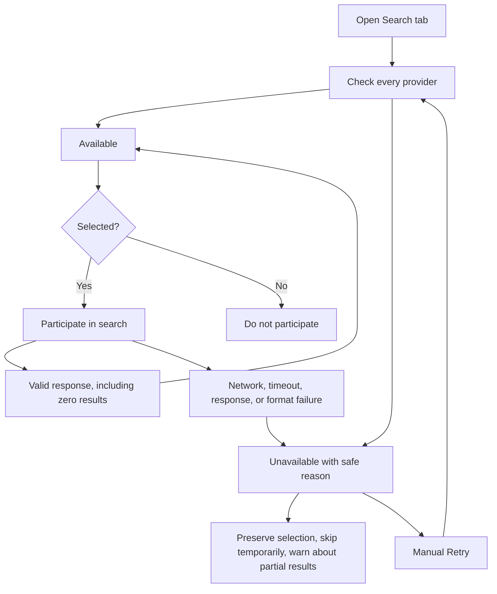
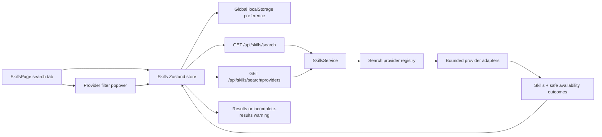
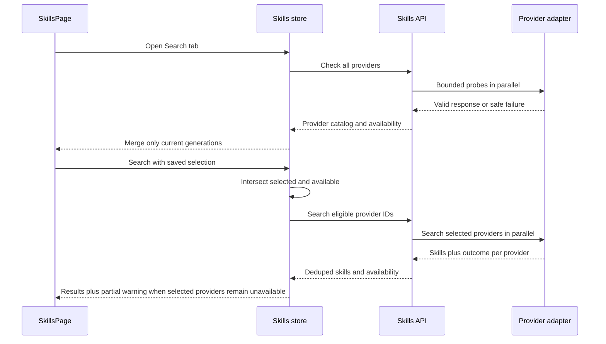

# Skill Search Provider Filter - Plan

## Goal Capsule

- **Objective:** Let Skill Search users control which catalog providers participate while making provider failures visible instead of presenting silently incomplete results.
- **Product authority:** This contract owns provider selection and availability behavior in the Skill Search page. Existing provider-specific search and installation contracts remain authoritative outside that surface.
- **Execution profile:** Server adapter/route contract, client Zustand state and persistence, and Skill Search filter UI; no database migration or new dependency.
- **Stop conditions:** Provider selection persists globally, availability is visible and race-safe, partial searches are explicit, recovery works without reselection, and focused server/client/browser verification passes.
- **Open blockers:** None.

---

## Product Contract

*Product Contract preserved from the requirements-only brainstorm (R/F/AE IDs and settled behavior remain authoritative). This pass clarifies the two confirmed UI defaults and adds the implementation contract.*

### Summary

Implement the full provider-checklist and availability scope across the existing federated search service, client store, and Skill Search filter area. Extend the current partial-failure behavior rather than replacing the federation model, and keep general provider monitoring and unrelated search refactors out of scope.

### Problem Frame

Federated Skill Search currently isolates provider failures so one network problem does not fail the whole search. That resilience hides an important fact from the user: when a provider fails, its results disappear without explanation, leaving the user unable to tell whether the query was poor or the result set was incomplete.

Repeated network failures make this especially confusing. The user has no visible diagnosis or provider control and only sees results that do not match expectations.

### Key Decisions

- **Use a selected-sources checklist.** (session-settled: user-directed — chosen over tri-state and include/exclude modes: it is the smallest interaction model that gives users direct control.) Governs R1-R3.
- **Preserve partial search during provider failure.** (session-settled: user-directed — chosen over automatic deselection or blocking the search: healthy providers should remain useful while failure is made visible.) Governs R6-R11.
- **Refresh availability from meaningful user activity.** (session-settled: user-directed — chosen over background polling or search-only checks: opening the Search tab gives an initial status without continuous traffic.) Governs R4, R8-R10.
- **Remember one app-wide selection.** (session-settled: user-directed — chosen over workspace-specific preferences: provider choice should remain consistent across workspaces.) Governs R2, R9, R11.
- **Expose a short safe failure reason.** (session-settled: user-directed — chosen over a generic unavailable label or full technical errors: users need actionable context without raw diagnostics.) Governs R7.
- **Reset provider selection with the other search filters.** (session-settled: user-confirmed planning default — chosen over preserving provider selection when Clear filters is used.) Governs R2-R3.
- **Keep the new-provider marker for the discovery session.** (session-settled: user-confirmed planning default — chosen over clearing it when the popover opens or persisting it indefinitely.) Governs R5.

### Requirements

**Provider selection**

- R1. The Search filter area lists every registered Skill search provider with a checkbox and current availability state.
- R2. On first use, every provider is selected; later visits restore the user's last selection across all workspaces.
- R3. A search queries only checked providers that are currently available, while unchecked providers do not participate.
- R4. Opening the Search tab starts an availability check for every registered provider.
- R5. A newly introduced provider is selected automatically and marked as new for the usage session in which it is first discovered.

**Availability and partial results**

- R6. A provider is unavailable when it fails to return a valid search response because of a network error, timeout, non-success response, or malformed response; a valid response with zero results remains available.
- R7. An unavailable provider stays visible with a short safe reason such as network error or timeout and offers Retry without exposing raw technical details.
- R8. Each search attempt refreshes the availability state of participating providers from that attempt's outcome.
- R9. If a selected provider becomes unavailable, Comate preserves its selection while skipping it temporarily.
- R10. A search affected by R9 returns healthy-provider results with a warning that identifies the unavailable selected providers and says the result set is incomplete.
- R11. A preserved selection resumes participating automatically after a later health check or search attempt confirms that the provider is available again.
- R12. If no available provider is selected, the page does not run a search and explains that the user must select an available provider.

The provider state flow is:

### Key Flows

- F1. First use
  - **Trigger:** A user opens Skill Search without a saved provider preference.
  - **Steps:** Comate selects every provider, checks availability, and shows each provider's state in the filter list.
  - **Outcome:** The first search preserves current all-provider coverage while making unavailable sources visible.
  - **Covered by:** R1, R2, R4, R6, R7.

- F2. Filtered search
  - **Trigger:** A user changes the provider checkboxes and searches.
  - **Steps:** Comate saves the selection, queries only available checked providers, and updates their availability from the search outcomes.
  - **Outcome:** Results reflect the user's chosen sources and the same selection appears in other workspaces.
  - **Covered by:** R2, R3, R8.

- F3. Failure and recovery
  - **Trigger:** A checked provider fails an availability check or search attempt.
  - **Steps:** Comate marks it unavailable with a safe reason, retains the selection, skips it, returns healthy-provider results with a partial-result warning, and allows Retry.
  - **Outcome:** A later successful check clears the unavailable state and automatically restores the provider to searches.
  - **Covered by:** R6-R11.

### Acceptance Examples

- AE1. **Covers R1, R2, R4.** Given no saved provider preference, when the user first opens Skill Search, then every registered provider is checked and receives an availability state.
- AE2. **Covers R2, R3.** Given the user unchecks two providers, when they search and later open Skill Search in another workspace, then only the remaining checked providers are queried and the same selection is restored.
- AE3. **Covers R5.** Given the user already has a saved selection, when a new provider becomes part of Comate, then that provider is checked automatically and marked as new.
- AE4. **Covers R6-R10.** Given three checked providers and one times out, when the search completes, then results from the two healthy providers remain visible and the page warns that the timed-out provider made the results incomplete.
- AE5. **Covers R6.** Given a checked provider returns a valid response with no matching Skills, when the search completes, then the provider remains available and contributes zero results.
- AE6. **Covers R7, R9, R11.** Given a selected provider is unavailable because of a network error, when the user retries after connectivity returns, then the provider becomes available and resumes participating without needing to be reselected.
- AE7. **Covers R12.** Given every selected provider is unavailable or all available providers are unchecked, when the user attempts a search, then no provider request runs and the page asks the user to select an available provider.

### Scope Boundaries

- Availability is refreshed when Skill Search opens, through search outcomes, and through manual Retry; periodic background polling is not included.
- The provider list shows short safe failure categories, not raw response bodies, internal endpoints, stack traces, or full diagnostics.
- Provider selection is global to the app user rather than configurable per workspace.
- This work does not change provider-specific ranking, result normalization, installation, update, or removal behavior.
- This work does not add administration controls for enabling or disabling providers globally.
- This work does not add periodic health monitoring, a provider-status history, or shared availability infrastructure for non-Skill integrations.

### Dependencies and Assumptions

- Each registered search provider has a bounded operation that can distinguish a valid response from network, timeout, non-success, and malformed-response failures.
- Provider identities remain stable enough to restore saved selections and recognize newly introduced providers.
- A selected unavailable provider may be skipped without invalidating healthy-provider results.

### Sources and Research

- `src/server/services/skills/search.ts` currently queries the provider adapters concurrently and isolates failed providers without returning their status to the caller.
- `src/server/routes/skills.ts` currently returns normalized Skill results without provider availability metadata.
- `src/client/stores/skills-store.ts` currently carries scene, language, API-key, and sort filters but no provider selection or availability state.
- `src/client/components/SkillsPage.tsx` already has a shared filter area and displays each result's provider identity.
- `docs/plans/2026-08-03-002-feat-weskillhub-provider-plan.md` establishes WeSkillHub as a federated provider and treats reachability failures as provider-local unavailability.

---

## Planning Contract

### Key Technical Decisions

- **KTD1. Make the provider registry the single source of truth.** Replace the anonymous search-function array in `src/server/services/skills/search.ts` with descriptors containing a stable provider ID, display label, search adapter, and bounded probe. Derive provider validation and catalog responses from that registry so adding a provider cannot require separate route and client allowlist edits. The stable ID remains the existing `SearchSkill.sourceKind` value, preserving result/install contracts.
- **KTD2. Return structured provider outcomes instead of catch-and-return-empty results.** Each adapter must distinguish a valid response (including an empty result array) from timeout, network, non-success HTTP, and invalid-response failures. Normalize failures to safe reason codes at the adapter boundary; keep raw causes only in server diagnostics. `Promise.allSettled` remains the final unexpected-exception barrier, not the primary failure contract.
- **KTD3. Use the provider's real response contract for health checks.** A descriptor's probe performs a minimal bounded request through the same fetch/parsing path as search rather than issuing a generic `HEAD`. This verifies that the provider can return a valid Skill-search response, which is the availability definition in R6. Opening the Search tab checks all providers; Retry checks one provider; no polling or cache-backed monitoring is introduced.
- **KTD4. Keep selection client-owned and availability request-scoped.** The search route accepts an optional provider-ID list and returns both normalized results and outcomes for the providers it attempted. Omission means all registered providers for backward compatibility. The client sends only selected providers currently considered available; unavailable selections remain stored and recover through the opening check or Retry.
- **KTD5. Reconcile persisted selection against the live provider catalog.** Store a versioned global preference containing `selectedProviderIds` and `knownProviderIds`. On first use or corrupt storage, select all. On later loads, prune removed IDs, retain existing choices, and auto-select IDs absent from `knownProviderIds`. Newly discovered IDs enter a session-only `newProviderIds` set and are written to `knownProviderIds` immediately, so the marker is visible for that usage session and gone on the next app usage.
- **KTD6. Merge availability with per-provider request generations.** Opening checks, searches, and single-provider retries may overlap. Assign a monotonically increasing generation to every provider included in a request, and apply an outcome only if it still owns that provider's current generation. This lets a Retry update one row without replacing unrelated states and prevents a slow opening check from overwriting a newer search result.
- **KTD7. Extend the existing filter-popover and unavailable-status patterns.** Build a focused provider filter using the repository's Radix Popover conventions and checkbox semantics. Keep unavailable providers selectable, show a localized safe reason and Retry on their rows, show the selected count on the trigger, and render one partial-results warning near the result region when any selected provider is unavailable.
- **KTD8. Make no-eligible-provider a client-side guarded state.** Disable or short-circuit search when the intersection of selected and available providers is empty, retain current results until the user changes selection or recovers a provider, and render the R12 explanation. The server still handles an explicitly empty provider list defensively without contacting a provider.

### High-Level Technical Design

The server owns provider identity, supported-provider validation, remote-response validation, and safe failure classification. The client owns the user's selection, global persistence, session-only new markers, and the latest visible availability per provider. Search responses are self-describing for attempted providers; skipped unavailable providers retain their prior unavailable state in the client.

### API and State Contracts

- Add shared server types for `SkillSearchProviderId`, `SkillProviderFailureReason`, `SkillProviderAvailability`, and the federated result envelope. Provider IDs use the existing five `sourceKind` values; safe reasons are a closed set such as `network`, `timeout`, `http`, and `invalid-response`.
- Extend `SkillSearchQuery` with an optional `providers` list. Normalize and validate it without silently accepting unknown IDs. Missing providers means all registered providers; an explicit empty list means return no results/outcomes without remote calls.
- Change `searchFederatedSkills` and `SkillsService.search` to return `{ skills, providers }`, where `providers` contains outcomes only for attempted providers. Preserve current deduplication and global sort behavior.
- Add `GET /api/skills/search/providers` for the opening check and Retry. With no provider parameter it returns the full catalog and current check outcomes; with one validated provider ID it checks only that provider. Mark the response non-cacheable so Retry reflects current reachability.
- Extend `GET /api/skills/search` with repeated or comma-normalized provider IDs, rejecting unknown values before any remote call. Its response becomes `{ skills, providers }`; current callers that only read `skills` remain compatible.
- Add client models for the provider catalog/status, `selectedProviderIds`, and `newProviderIds`, plus `checkSearchProviders`, `retrySearchProvider`, and `setSearchProviderSelected` actions. Keep request-generation bookkeeping outside serializable Zustand state where practical.
- Persist the selection under a versioned key such as `comate.skills.search-providers.v1`; storage reads/writes use the repository's guarded parsing pattern and never turn a storage exception into a page error.

### Sequencing

U1 establishes provider identity and structured outcomes. U2 exposes those contracts through the service and routes. U3 consumes the stable API in the client store and implements persistence/race handling. U4 renders the filter and warnings on top of U3. Recommended order: U1 → U2 → U3 → U4.

### System Impact and Failure Modes

- **Remote traffic:** Opening the Search tab adds one bounded probe per provider. Probes run only on tab entry and Retry; no interval or background refresh is allowed.
- **Compatibility:** Search defaults to all registered providers when the provider query is absent. The response retains `skills`, adding provider metadata rather than renaming the existing field.
- **Failure privacy:** Client responses contain only provider ID, status, and safe reason code. Raw URLs, bodies, exception messages, and stack traces must not cross the route boundary.
- **Concurrency:** Slow checks and aborted searches must not overwrite newer per-provider states. Tests must cover stale all-provider checks, overlapping Retry, and search outcome precedence.
- **Persistence drift:** Removed providers are pruned; new providers are auto-selected; malformed or inaccessible storage falls back to all selected. An intentionally empty saved selection remains empty rather than being mistaken for first use.
- **Search semantics:** Valid zero-result responses mark a provider available. Provider-local failures do not reject the federated request, and healthy results retain the existing dedupe/sort semantics.

---

## Implementation Units

### U1. Introduce the provider registry and explicit outcomes

- **Goal:** Give every remote adapter a stable identity and a result contract that distinguishes zero matches from unavailability.
- **Requirements:** R1, R3, R6, R8
- **Dependencies:** None
- **Files:**
  - `src/server/services/skills/search.ts` (modify)
  - `src/server/services/skills/search-query.ts` (modify)
  - `src/server/services/skills/types.ts` (modify)
  - `src/server/services/skills/index.ts` (modify exports)
  - `src/server/services/skills/search.test.ts` (modify)
- **Approach:**
  - Define the closed provider ID and safe availability types alongside the existing search types.
  - Replace `SearchProvider` and `searchProviders` with exported descriptors whose search/probe functions return structured success or failure outcomes.
  - Refactor each provider's fetch/parse path so non-success responses and invalid JSON shapes produce classified failures rather than `[]`; a valid empty array remains a successful outcome.
  - Detect the deadline abort separately from generic network failures and map all other provider-specific errors to a safe closed reason. Log raw diagnostic detail server-side only.
  - Let federation accept an optional provider subset, execute only matching descriptors, preserve `Promise.allSettled` for unexpected throws, and return deduped/sorted skills plus attempted-provider availability.
- **Patterns to follow:** Existing `fetchWithDeadline`, normalization/sanitization, provider-local isolation, and dedupe/sort logic in `search.ts`; existing stable `sourceKind` values in `types.ts`.
- **Test scenarios:**
  - Every registered descriptor has a unique stable ID and label.
  - Each adapter distinguishes valid-empty, timeout, network, non-success, malformed shape, and success with results.
  - A provider subset calls only those providers; an explicit empty subset calls none.
  - Mixed success/failure returns healthy deduped results and one availability outcome per attempted provider.
  - Downloads/newest/default sorting remains unchanged.
- **Verification:** `npx tsx --test src/server/services/skills/search.test.ts`.

### U2. Expose provider catalog, health checks, and filtered search through the API

- **Goal:** Give the client one validated API contract for provider discovery, health checks, Retry, and selected-provider search.
- **Requirements:** R1, R3, R4, R6-R8, R10, R12
- **Dependencies:** U1
- **Files:**
  - `src/server/services/skills-service.ts` (modify)
  - `src/server/routes/skills.ts` (modify)
  - `src/server/routes/skills.test.ts` (modify)
- **Approach:**
  - Update `SkillsService.search` to return the federated envelope and add a method that checks all or one provider through the registry descriptors.
  - Add the provider catalog/check route before unrelated catalog routes, returning stable IDs, labels, status, and optional safe reason; set `Cache-Control: no-store`.
  - Parse provider IDs for search and Retry consistently, reject unknown/duplicate-invalid input before service calls, and preserve omitted-as-all versus explicit-empty semantics.
  - Return the enriched search envelope while retaining the top-level `skills` property.
  - Keep the route-level 500 response for unexpected internal failures; expected provider failures remain successful partial responses with unavailable outcomes.
- **Patterns to follow:** Existing query validation and route tests in `routes/skills.ts`; service delegation style in `skills-service.ts`.
- **Test scenarios:**
  - Search without provider IDs calls all providers; valid IDs are forwarded; unknown IDs return 400 without provider calls.
  - Provider check returns the whole registered catalog; single Retry checks only the requested provider.
  - Provider-local failures return safe status metadata without raw exception details.
  - Explicit no-provider search performs no remote work and returns an empty successful envelope.
  - Existing scene and sort validation remains intact.
- **Verification:** `npx tsx --test src/server/routes/skills.test.ts`.

### U3. Add persisted provider selection and race-safe availability to the Skills store

- **Goal:** Own global selection, provider discovery, current availability, recovery, and request ordering in one client state boundary.
- **Requirements:** R2-R5, R7-R12
- **Dependencies:** U2
- **Files:**
  - `src/client/stores/skills-store.ts` (modify)
  - `src/client/stores/skills-store.test.ts` (modify)
- **Approach:**
  - Add mirrored provider/status types and state for catalog entries, selected IDs, new IDs, check loading, and the selected-unavailable set used by warning/no-provider states.
  - Hydrate the versioned global preference when the live provider catalog first arrives. Distinguish absent/corrupt storage from a deliberately saved empty selection; reconcile added and removed provider IDs exactly as KTD5 specifies.
  - Persist every checkbox change and the Clear filters reset. Do not persist availability or session-only new markers.
  - Add all-provider check and one-provider Retry actions. Assign request generations per affected provider and merge only current outcomes so unrelated and newer states survive.
  - Extend search serialization with the selected-and-available provider IDs and merge returned statuses through the same generation guard. Preserve the existing AbortController/request-ID behavior for result races.
  - Short-circuit before `fetch` when no available provider is selected and expose a dedicated reason to the page instead of using the generic search error banner.
- **Patterns to follow:** Guarded `localStorage` parsing in `use-workspace-pins.ts`/`use-app-settings.ts`; existing abort/request-ID logic in `skills-store.ts`.
- **Test scenarios:**
  - First use selects all; a saved subset restores globally; a deliberately saved empty set remains empty.
  - A newly discovered ID is selected and marked new for the current session, then is known on the next hydration; removed IDs are pruned.
  - Corrupt JSON, invalid shapes, and storage exceptions fall back safely to all selected.
  - Search sends only selected available IDs and merges returned availability; no-eligible-provider sends no request.
  - A slow opening check cannot overwrite a newer search outcome; overlapping Retry updates only its provider; stale aborted searches do not update results or statuses.
  - Unavailable selected providers remain selected and automatically become eligible after a successful Retry.
- **Verification:** `npm run test:client -- src/client/stores/skills-store.test.ts`.

### U4. Render the provider filter, availability, and incomplete-result states

- **Goal:** Make source control and provider failures understandable and operable from the existing Skill Search filter area.
- **Requirements:** R1-R12
- **Dependencies:** U3
- **Files:**
  - `src/client/components/skills/SkillProviderFilter.tsx` (create)
  - `src/client/components/SkillsPage.tsx` (modify)
  - `src/client/i18n/en/settings.json` (modify)
  - `src/client/i18n/zh-CN/settings.json` (modify)
  - `src/client/components/SkillsPage.browser.test.tsx` (modify)
- **Approach:**
  - Add a compact Popover trigger to the existing search filter row, showing selected/total count and an unavailable visual state when relevant.
  - Render each registered provider as an accessible checkbox row with name, available/unavailable state, localized safe reason, optional session-only New badge, and Retry for unavailable providers. Retry must not toggle selection or close the popover.
  - On entering the Search tab, invoke the all-provider check once for that entry. Keep checks tied to tab activity rather than component-wide rerenders.
  - Include provider selection in `hasActiveFilters`; Clear filters resets all providers and persists that preference before re-running the current query.
  - Render a partial-results warning whenever selected providers are unavailable, including provider names and the incomplete-results explanation. If none are eligible, show the dedicated selection/recovery guidance and do not show a generic request error.
  - Keep the filter usable at current desktop and narrow responsive widths, with keyboard focus, checkbox labels, and live status text available to assistive technology.
- **Patterns to follow:** `SessionStatusFilterControl.tsx` and `src/client/components/ui/popover.tsx` for Popover accessibility; existing unavailable reason/status presentation in backend settings; current filter chip/button styling in `SkillsPage.tsx`.
- **Test scenarios:**
  - First Search-tab entry starts a provider check and displays all providers selected.
  - Checkbox changes alter the next search request and survive remount/workspace changes.
  - Unavailable rows retain their checkboxes, show safe localized reasons, and recover through Retry without reselection.
  - Healthy results remain visible with a named partial-results warning when another selected provider fails.
  - No eligible provider blocks the search request and shows recovery guidance.
  - Clear filters selects all providers and saves that choice; a new-provider badge appears only in its discovery session.
  - Keyboard navigation, labels, focus behavior, and narrow-layout behavior remain usable.
- **Verification:** `npm run test:browser -- src/client/components/SkillsPage.browser.test.tsx`.

---

## Verification Contract

- `npx tsx --test src/server/services/skills/search.test.ts src/server/routes/skills.test.ts` — focused adapter, federation, validation, health, privacy, and route-contract coverage.
- `npm run test:client -- src/client/stores/skills-store.test.ts` — persistence reconciliation, no-eligible-provider guard, and request-race coverage.
- `npm run test:browser -- src/client/components/SkillsPage.browser.test.tsx` — provider filter, warning, Retry, accessibility, and responsive user flows.
- `npm run test:server` — full server regression suite after the focused tests pass.
- `npm run lint` — lint and static conventions for all touched TypeScript/React code.
- `npm run build` — client and sidecar type/bundle integration.
- Manual check in the running app:
  - Open Search with clean storage and verify all providers are selected and checked.
  - Deselect providers, switch workspace or remount the page, and verify the global choice remains.
  - Simulate one provider timeout and verify healthy results plus the incomplete-results warning.
  - Retry the failed provider and verify it becomes eligible without reselection.
  - Verify a valid zero-result provider remains available and no raw diagnostic detail appears.

---

## Definition of Done

- Every registered search provider appears from the server-owned registry with a stable ID and user-facing label.
- First use selects all providers; later use restores the global selection; added and removed providers reconcile correctly.
- Only selected available providers participate, and a no-eligible-provider state makes no remote search request.
- Valid empty responses remain available; timeout, network, non-success, and malformed responses become safe unavailable states.
- A selected failed provider remains selected, healthy results remain visible, and the UI explicitly identifies incomplete coverage.
- Opening checks, searches, and Retry cannot overwrite newer provider states; successful recovery resumes participation automatically.
- Clear filters selects all providers and saves that preference; New markers last only for their discovery session.
- English and Simplified Chinese copy covers provider selection, statuses, reasons, Retry, partial results, and no-provider guidance.
- Focused and full verification commands pass, manual failure/recovery checks pass, and no unrelated provider/search refactor or new dependency enters the diff.
- `CHANGELOG.md` is updated with the user-visible provider filtering and failure-visibility behavior.
