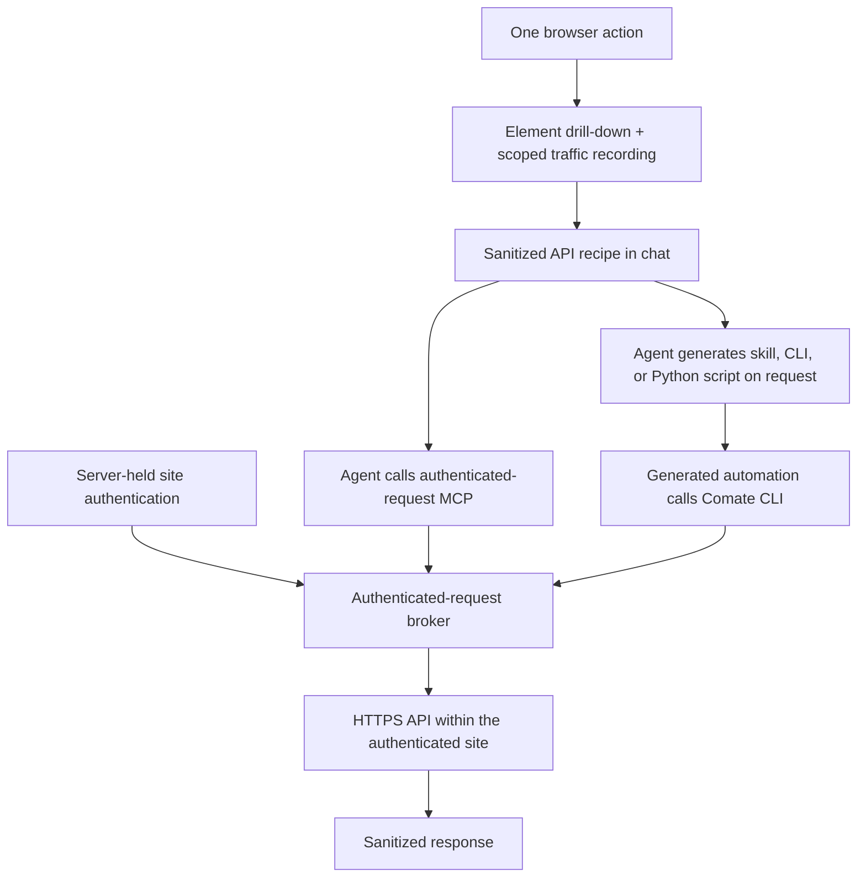
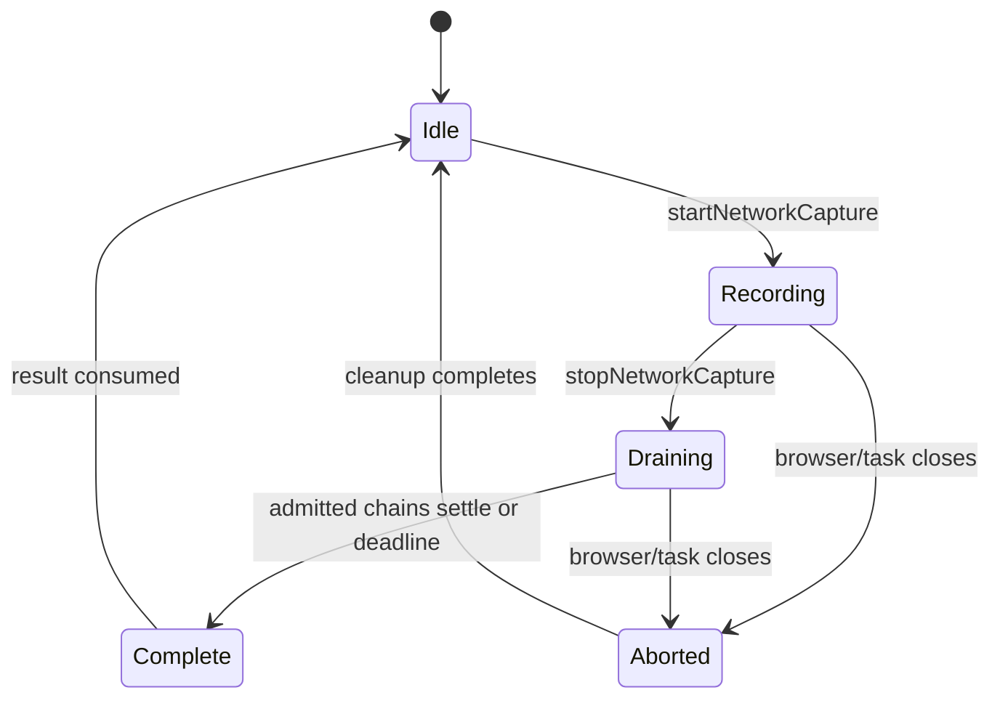
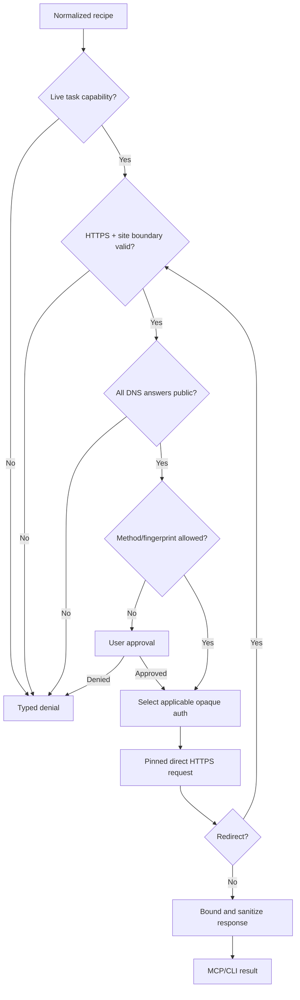
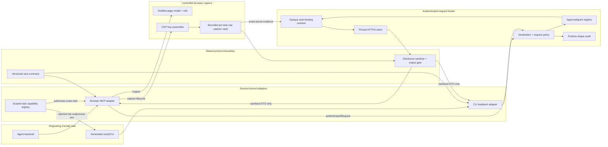

# Browser API Discovery Workbench - Plan

## Goal Capsule

- **Objective:** Let a Comate agent inspect one meaningful browser action, derive and validate a sanitized HTTP API recipe, then generate a skill, CLI, or Python script that can reuse Comate-held authentication without reopening the page.
- **Product authority:** The Product Contract below reflects the scope confirmed on 2026-08-03. General-purpose browser developer tools and persistent API-recipe management are not active scope.
- **Execution profile:** Deep feature work across the embedded browser, credential boundary, agent tools, local CLI, approvals, and audit behavior.
- **Open blockers:** None at the product level.

---

## Product Contract

### Summary

Extend Comate's controlled browser into an agent-led API discovery workbench. The agent can drill into one page element, record the HTTP traffic caused by one action, preserve a sanitized request recipe in chat, and reuse saved site authentication through a trusted MCP and CLI broker.

### Problem Frame

Comate can already drive a page and preserve browser login state, but discovering a web application's backend API remains manual. A user must open developer tools, locate the relevant request among unrelated traffic, understand its authentication and payload, then repeat that work or hand-build automation.

Kimi quota is the reference case: the user currently opens the website and checks usage manually. Comate already proves that a captured Kimi login can support a server-side usage request without exposing its bearer token, but that path is provider-specific rather than an agent-usable discovery and replay capability.

### Key Decisions

- **Use an agent-led workbench.** (session-settled: user-directed — chosen over automatic recipe compilation and task-local dynamic tools: agent reasoning keeps the first version flexible across different web applications.) Governs R1-R7.
- **Keep inspection narrow and explicit.** (session-settled: user-directed — chosen over raw DOM snapshots and continuous traffic logging: selected-element drill-down plus one-action recording limits noise and unnecessary exposure.) Governs R1-R5.
- **Keep the recipe in the originating chat.** (session-settled: user-directed — chosen over a persistent workspace recipe library: same-task generation is sufficient for the first version.) Governs R15-R16.
- **Broker authenticated requests instead of revealing credentials.** (session-settled: user-directed — chosen over a token-returning MCP: stored cookies and bearer tokens must not enter model context, chat, generated files, or terminal output.) Governs R5, R8-R12, R18-R20.
- **Expose the broker through MCP and the Comate CLI.** (session-settled: user-directed — chosen over MCP-only and a local HTTP integration surface: skills and local scripts need one credential-safe path without expanding the public surface.) Governs R8, R17, R19.
- **Allow exploration across the authenticated registrable domain.** (session-settled: user-directed — chosen over exact captured-request replay and exact-origin restriction: the agent must be able to explore paths, methods, bodies, and subdomains within the site.) Governs R10-R12.
- **Confirm likely mutations, not every request.** (session-settled: user-directed — chosen over trusting the agent's classification or confirming all calls: read workflows should stay fluid while side effects retain a human gate.) Governs R13.



### Actors

- A1. **Comate user** — starts or observes inspection, approves risky calls, reauthenticates when needed, and asks for a reusable artifact.
- A2. **Comate agent** — chooses the relevant page element and action, interprets recorded traffic, validates requests, and generates the requested artifact.
- A3. **Comate credential broker** — applies server-held site authentication, enforces the site and approval boundaries, performs requests, sanitizes results, and records safe audit metadata.

### Requirements

**Element and traffic inspection**

- R1. The agent can inspect a selected page element or existing element reference and receive its tag, safe attributes, nearby subtree, form relationship, and action clues without receiving the full raw DOM.
- R2. The agent can start an explicit recording around one browser action and stop it after the action completes.
- R3. The recording returns the HTTP requests and responses attributable to that action while separating likely application API calls from unrelated traffic.
- R4. Each candidate includes the method, HTTPS URL, safe headers, request body, response status, and a bounded response sample needed to understand the API.
- R5. Credential values and detected secrets are replaced with typed placeholders before inspection data enters a tool result, model context, chat history, logs, or audit records.
- R6. The agent can turn a candidate into a normalized recipe that identifies variable inputs, authentication placeholders, expected response fields, and the evidence linking it to the page action.
- R7. The agent can validate a recipe against the live site before presenting it as reusable.

**Authenticated request broker**

- R8. Comate exposes a generic authenticated-request MCP that performs a request with saved site authentication without returning that authentication to the caller.
- R9. The broker can use applicable server-held cookies, web-storage authentication, or bearer credentials already captured through Comate's browser login flows.
- R10. A caller may vary the path, method, query, headers, and body within the authenticated registrable domain and its subdomains rather than being limited to exact replay.
- R11. Brokered requests require HTTPS and must not forward saved authentication across the registrable-domain boundary, including through redirects.
- R12. The broker returns a bounded, sanitized response suitable for reasoning and artifact generation while withholding credential material and unrelated sensitive account data.
- R13. Brokered requests require explicit user confirmation unless they use GET or HEAD or the current task has validated the captured recipe as backing a non-mutating page action.
- R14. Broker activity is audited with request class, destination site, method, outcome, and approval state, never with credential values or unredacted bodies.

**Chat history and generated automation**

- R15. The sanitized recipe remains in the originating chat history and is not automatically persisted into a workspace recipe library.
- R16. On explicit user request in that task, the agent can generate a Comate skill, CLI, or Python script from the validated recipe.
- R17. Generated Comate skills call the authenticated-request MCP, while generated CLIs and scripts call the Comate CLI wrapper over the same broker.
- R18. Generated artifacts contain no stored credential values and never read Comate's SQLite database directly.
- R19. The Comate CLI wrapper requires a running Comate instance and fails clearly when the broker is unavailable rather than falling back to credential export or direct database access.
- R20. Expired or missing authentication returns a reauthentication-needed result that lets the agent reopen the controlled browser login flow without disclosing stale credential material.

### Key Flows

- F1. **Discover and validate an API request**
  - **Trigger:** A1 asks A2 to extract the backend API behind a visible web application behavior.
  - **Actors:** A1, A2, A3
  - **Steps:** A2 opens the page, drills into the relevant element, starts recording, performs one action, stops recording, selects a candidate, constructs a sanitized recipe, and validates it through A3.
  - **Outcome:** The originating chat contains a validated recipe and sanitized response evidence.
  - **Covered by:** R1-R14
- F2. **Reuse the API without reopening the page**
  - **Trigger:** A2 or a generated artifact needs the same site data after the browser is closed.
  - **Actors:** A2, A3
  - **Steps:** The caller submits a request through MCP or the Comate CLI, A3 applies saved authentication, enforces the site and approval boundaries, performs the request, and returns a sanitized response.
  - **Outcome:** The requested data is available without launching the web page and without exposing credentials.
  - **Covered by:** R8-R14, R17-R20
- F3. **Generate reusable automation**
  - **Trigger:** A1 asks for a skill, CLI, or Python script in the same task that performed inspection.
  - **Actors:** A1, A2, A3
  - **Steps:** A2 reads the recipe from chat, generates the requested artifact against the appropriate broker surface, and verifies it while Comate is running.
  - **Outcome:** The artifact reproduces the validated API behavior without embedding credentials.
  - **Covered by:** R15-R19
- F4. **Recover from expired authentication**
  - **Trigger:** A3 cannot authenticate a brokered request with the saved site context.
  - **Actors:** A1, A2, A3
  - **Steps:** A3 returns a reauthentication-needed result, A2 explains the interruption, A1 completes login in the controlled browser, and A2 retries the recipe.
  - **Outcome:** Authentication is refreshed through the browser boundary rather than exposed to the caller.
  - **Covered by:** R9, R20

### Acceptance Examples

- AE1. **Covers R1-R7.** Given a logged-in Kimi usage page, when the agent records the action that loads quota data, then the chat receives a candidate for the billing request with its bearer token replaced by an authentication placeholder and enough response structure to identify the quota fields.
- AE2. **Covers R8-R14.** Given that validated Kimi recipe and a closed browser, when the agent calls the authenticated-request MCP, then Comate applies the saved login server-side and returns the sanitized quota result without returning the token.
- AE3. **Covers R10-R12.** Given saved authentication for `kimi.com`, when the agent calls another HTTPS API on a `kimi.com` subdomain, then the broker may apply that site authentication; when the request or redirect leaves `kimi.com`, the broker withholds it and stops or rejects the authenticated continuation.
- AE4. **Covers R13.** Given an unclassified POST request, when the agent attempts it through the broker, then the user must approve it; given a POST recipe validated in the current task as a read-only quota query, subsequent calls in that task can run without repeated approval.
- AE5. **Covers R15-R19.** Given a generated Python script from the originating task, when it runs while Comate is active, then it receives the quota through the Comate CLI without reading or printing credentials; when Comate is stopped, it fails with a clear broker-unavailable result.
- AE6. **Covers R15-R16.** Given a new task with no copied recipe, when the user asks to regenerate the prior automation, then Comate does not claim to possess a persistent recipe and asks the user to return to or supply the originating chat context.
- AE7. **Covers R5, R12, R14, R18.** Given captured cookies, bearer headers, sensitive form values, or secret-looking response fields, when inspection, replay, audit, and artifact generation complete, then none of those credential values appear in model-visible output, chat, logs, audit rows, terminal output, or generated files.

### Scope Boundaries

In scope:

- Selected-element drill-down, action-scoped HTTP request/response recording, candidate correlation, sanitized recipes, and validation.
- A generic authenticated-request broker exposed through MCP and a Comate CLI wrapper.
- Explicit same-task generation of skills, CLIs, and Python scripts from the chat recipe.
- REST-style and GraphQL HTTP APIs that can be represented as bounded requests and responses.

Deferred for later:

- A persistent workspace recipe library, cross-task recipe discovery, versioning, scheduled execution, and change monitoring.
- Automatic request selection or recipe compilation, task-local dynamic MCP tools, and generated typed SDKs.
- WebSocket, Server-Sent Events, streaming-body, service-worker, and IndexedDB-dependent API discovery.
- A general-purpose DevTools interface with full DOM, console, source, performance, or continuous network panels.

Outside this feature's identity:

- Returning raw stored tokens, cookies, or browser storage to an agent, user-facing client, generated artifact, or local process.
- Offline generated automation that reads Comate's credential database or works without a running Comate broker.
- Cloud browser capture or a remote credential-broker service.

<!-- ce-section: work-relationships -->
### How This Work Fits Together

This plan owns API discovery, authenticated replay, and same-task artifact generation as one end-to-end work unit. The surrounding areas below are context, not a committed roadmap.

- **Depends on:** the embedded controlled browser, its distilled page model and CDP connection, and server-held site authentication from `docs/plans/2026-07-18-001-feat-embedded-controlled-browser-plan.md`.
- **Extends:** the credential-safe server-side request precedent established for Kimi usage in `docs/plans/2026-07-28-001-feat-kimi-coding-plan-usage-plan.md`.
- **Can proceed independently of:** a general-purpose browser developer-tools interface.
- **Enables:** a later persistent recipe library, automatic recipe compiler, dynamic task-local tools, and scheduled API automations without committing this plan to those products.

### Dependencies and Assumptions

- A target site has reusable authentication that Comate can capture as cookies, web storage, or a bearer credential; sites whose usable state exists only in unsupported browser storage may require reauthentication or later capture support.
- The action of interest produces observable HTTP traffic within a bounded recording window.
- Comate can distinguish its trusted local CLI caller from unrelated local processes without exposing the stored credential; the authorization mechanism is a planning decision, but the trust boundary in R18-R19 is fixed.
- Sanitization can preserve the request and response structure needed for automation while removing credential-class values; when that cannot be guaranteed, the result fails closed rather than returning raw traffic.

### Sources and Research

- `src/server/services/browser-mcp.ts` — current seven-tool browser MCP surface and distilled page interactions.
- `src/server/services/browser-page-model.ts` — selected page structure, stable references, and sensitive-field handling.
- `src/server/services/browser-cdp.ts` — existing raw CDP connection and limited Network-domain use without traffic event capture.
- `src/server/services/browser-site-auth.ts` and `src/server/models/workspace.ts` — value-only-in site-auth storage for cookies, web storage, and optional bearer tokens.
- `src/server/services/provider-usage-login-service.ts` and `src/server/services/kimi-usage-service.ts` — Kimi token capture and server-side authenticated-request precedent.
- `docs/plans/2026-07-18-001-feat-embedded-controlled-browser-plan.md` — controlled-browser product and security contract.
- `docs/plans/2026-07-28-001-feat-kimi-coding-plan-usage-plan.md` — Kimi usage workflow and credential boundary.

---

## Planning Contract

### Product Contract Preservation

The Product Contract above is preserved without semantic changes from the confirmed brainstorm. This Planning Contract specifies how to implement it. The session-scoped CLI restriction is a planning clarification of R16-R19: generated artifacts may use the broker only while the originating Comate task and its short-lived capability remain live.

### Confirmed Implementation Surface

The browser MCP gains four tools; the existing `act` tool remains the action executor between capture start and stop.

| Tool | Responsibility | Model-visible result |
|---|---|---|
| `getElementDetails` | Resolve one current element ref and return its bounded local context, form association, and action clues. | Positive-shape element details with sensitive values omitted. |
| `startNetworkCapture` | Open one action-scoped network admission window for the current browser task. | Opaque capture ID and lifecycle state. |
| `stopNetworkCapture` | Close admission, drain admitted request chains to a deadline, rank likely API calls, and sanitize them. | Versioned candidate recipes, bounded samples, and explicit omission/truncation reasons. |
| `authenticatedRequest` | Validate or execute one normalized recipe through server-held site authentication. | Bounded sanitized response, approval state, audit ID, and typed recovery information. |

The new `packages/comate-cli` package exposes one command:

```text
comate api request --recipe <path>
comate api request --stdin --json
```

It is a thin JSON adapter over one enrolled loopback route. It receives `COMATE_SESSION_TOKEN` only inside the originating live task, never reads SQLite, and never accepts or prints a downstream credential. Skills call `authenticatedRequest` directly; generated shell/Python/CLI artifacts call `comate api request`. There is no per-site tool generation, credential-query command, DOM/network CLI, or persistent recipe store.

### Key Technical Decisions

#### KTD-1: One versioned recipe/result contract serves capture, MCP, CLI, and generated artifacts

Define the wire-only Zod schemas in a small workspace package consumed by the server and `packages/comate-cli`; keep server-only raw CDP/auth types outside that package. (session-settled: user-approved — accepted during confidence deepening over duplicating or weakening validation between the server and independently compiled CLI.) MCP and CLI remain adapters over the same positive-shape recipes and broker results. A recipe contains the normalized method and HTTPS target, caller-safe headers/body, an opaque authentication binding, provenance, completeness flags, and a canonical operation fingerprint. It cannot represent raw cookies, authorization headers, proxy configuration, arbitrary transport headers, or unbounded bodies. Contract versions let later schema changes fail explicitly instead of being misinterpreted by an older generated artifact, and shared fixtures prove both consumers accept and reject the same payloads.

#### KTD-2: Selected-element inspection extends the existing page-model ref discipline

`getElementDetails` accepts only a ref from the latest distilled page model and resolves it within the current document. The result is a bounded positive shape: tag, role/name, safe attributes, nearby text and descendants, owning form summary, and candidate actions. It does not search for elements, accept arbitrary selectors, or return `outerHTML`, scripts, hidden credential fields, or the full document. `findElements` refreshes the accessibility-based page model and returns fresh refs filtered by text, regular expression, and role.

#### KTD-3: Network capture is passive, action-scoped, session-aware, and hop-oriented

Use passive CDP `Network` events rather than `Fetch` interception so inspection cannot pause or modify page traffic. Preserve flattened target `sessionId` in event delivery, key identity by `(sessionId, requestId)`, and model redirects as ordered hops because CDP reuses request IDs across redirects. Auto-attach related iframe and worker targets recursively, enable Network once per target session with explicit buffers, and keep cache/service-worker behavior natural.

A request chain belongs to a capture when its first `requestWillBeSent` arrives while admission is open. `stopNetworkCapture` closes admission, continues collecting redirects and terminal events for admitted chains, reads eligible bodies immediately after `loadingFinished`, and finishes after network quiet or a hard deadline. Optional extra-info events may arrive before, after, or without their base events; missing or evicted bodies become explicit metadata, never capture-wide failure. Only one capture may be open per browser task.



#### KTD-4: Sanitization is shared and fail-closed before serialization

Raw CDP events and downstream responses may contain cookies, authorization values, CSRF tokens, account data, and secret-bearing URLs. A single sanitizer runs before tool-result construction, logging, audit persistence, CLI output, or generated-file input. It combines a credential/transport-header allowlist, structural key redaction for JSON/GraphQL/form/query data, exact-value redaction using the selected server-side credential set, token-pattern detection, and bounded traversal.

Text/JSON is disclosed only when its content type, encoding, size, structure, and redaction result are understood. Binary, multipart file content, unknown encodings, excessive nesting, and ambiguous free-form content return metadata with an explicit withheld reason. Sanitization failures are terminal for disclosure; there is no raw-output escape hatch in v1.

#### KTD-5: Authentication bindings transition explicitly from ephemeral capture state to remembered auth

Capture first creates an opaque ephemeral binding to a bounded, in-memory per-task capture vault. (session-settled: user-approved — accepted during confidence deepening over treating all captured auth as already persisted or silently adding it to earlier remembered state.) This supports live inspection and recipe validation before persistence consent without encoding secret material into the binding. Choosing “Remember this site” explicitly upgrades or rebinds eligible cookies, web-storage evidence, and the exact captured bearer material into a remembered-auth generation. Neither pre-existing remembered state nor a remember action that predates capture silently absorbs a newly observed bearer. Reuse after browser close requires a successful rebind; otherwise the broker returns `remember_site_required` or `auth_binding_stale`.

Browser close zeroizes the raw capture vault and invalidates ephemeral bindings. A task-runtime grant may survive browser close only when it has been rebound to the same unchanged remembered-auth generation. Task close, runtime replacement, saved-auth rotation/removal, decryption failure, or unusable authentication invalidates the binding and grant and returns `auth_binding_stale` or `reauthentication_needed` without exposing credential diagnostics.

Permission to target a registrable domain is distinct from credential applicability. The broker may explore HTTPS endpoints across the confirmed registrable domain and subdomains, but it injects only cookies whose native domain/path/secure rules match and only captured web-storage/bearer bindings whose server-side evidence applies to that destination. It never broadens an exact-origin bearer credential merely because two hosts share a registrable domain.

#### KTD-6: The broker is a direct, bounded, SSRF-resistant HTTPS client

For the initial target and every redirect, parse and normalize once; reject non-HTTPS schemes, userinfo, fragments, IP literals, unsafe/unexpected ports, and destinations outside the binding's registrable domain. Compute the site boundary with `tldts` including private suffixes. Resolve all A/AAAA records, reject the destination if any address is non-public or reserved, and pin a validated address into the connection while preserving the original hostname for SNI and certificate verification. Do not honor ambient proxy variables.

Redirects are manual, bounded, loop-detected, and fully re-authorized per hop. Broker-managed authentication is stripped before each redirect and reselected only after the next destination passes site, DNS, TLS, and native credential-applicability checks. Caller headers are duplicate-free and explicitly validated; credential, proxy, forwarding, framing, hop-by-hop, and control-character-bearing headers are rejected. `CONNECT` and `TRACE` are unsupported. Request size, response wire/decoded size, concurrency, redirects, and connect/header/inactivity/total time are independently bounded. Prefer identity encoding; any supported decompression is streamed under decoded-size and ratio limits.



#### KTD-7: Non-mutating POST reuse is an exact, runtime-epoch grant

GET and HEAD execute without repeated confirmation. Every other method requires the existing user-approval round trip unless the current task validates the exact captured operation as non-mutating. Successful validation creates an in-memory grant bound to session/task ID, auth-binding generation, normalized site key, method, normalized URL, caller-safe header digest, body digest, redirect policy, and runtime epoch. Any material change, auth rotation, runtime replacement, task close, or expiry invalidates the grant. Browser close invalidates grants still tied to ephemeral capture state but preserves grants already rebound to the unchanged remembered-auth generation. Validation approval is not a general “allow POST to this site” permission.

Mutation classification never trusts a caller-supplied label alone. The approval card shows the sanitized method, destination, and body summary; denial, timeout, disconnect, cancellation, or stale runtime prevents dispatch. Existing SSE/session approval machinery owns delivery and reconnection behavior.

#### KTD-8: MCP and CLI authorization are session-bound capabilities, not credential access

Replace the browser MCP's high-privilege reliance on a single sidecar-wide bearer with independently revocable task capabilities. (session-settled: user-approved — accepted during confidence deepening over reusing the repository's single broad session token.) Extend capability records to support multiple live capabilities per session with explicit audience, route scopes, workspace/session binding, runtime generation, and expiry. Mint a task capability scoped only to `browser-mcp` and `api-broker`; do not enroll it into WeCom or unrelated loopback routes. Inject it into backend MCP configuration and the generated-process environment, never into prompts or model-visible context, and revoke all task capabilities on runtime replacement/close. The MCP router also validates Host/Origin and remains loopback-only.

Enroll exactly one session-token route for the CLI, deriving workspace and session solely from the token rather than request fields. The CLI reuses the proxy-aware loopback transport pattern required by the agent sandbox, but the server broker deliberately ignores ambient proxies for downstream authenticated HTTPS. Arbitrary local terminals and scheduled/cron processes receive no enrollment flow in v1.

#### KTD-9: Audit intent is durable before dispatch and terminal outcome is positive-shape

Preserve the repository's append-only audit architecture with two correlated positive-shape events: a durable `broker_intent` before dispatch and a `broker_terminal` afterward, sharing a random audit/correlation ID and explicit phase. (session-settled: user-approved — accepted during confidence deepening over mutating an audit row or keeping broker audit best-effort.) Fields cover site, method, request class, approval/grant state, terminal outcome, surface, and timestamps—never raw URLs with queries, headers, bodies, auth bindings, DNS addresses, or credentials. The broker uses a strict audit-write path distinct from the existing best-effort browser-action logger. Failed intent persistence prevents dispatch. Failed terminal persistence withholds the response, leaves the intent visibly uncertain, and trips an in-memory audit-health circuit; a successful strict probe/write clears the circuit before later dispatch.

#### KTD-10: Browser/body compatibility is best-effort against the shipped Chromium, not CDP tip-of-tree

Tests target the repository's pinned Chrome for Testing version and smoke-test required commands/events against its runtime protocol. Do not depend on deprecated request interception, deprecated header-text fields, or experimental durable-message APIs for correctness. Cross-process navigation, eviction, target detach, multipart file omission, streaming protocols, and unsupported bodies degrade to explicit incomplete metadata. WebSocket/SSE payload discovery remains out of product scope even when their handshake is observed.

#### KTD-11: Remembered site authentication is encrypted at rest before the generic broker ships

The current site-auth persistence is not encrypted. A generic broker materially increases the value and breadth of that store, so use the existing credential-encryption facility to encrypt remembered workspace/global site-auth blobs before persisting them. (session-settled: user-approved — accepted during confidence deepening over shipping the generic broker on the existing plaintext-at-rest dependency.) Migrate legacy plaintext entries on read/write with versioned envelopes and a recoverable rollout; never keep both plaintext and ciphertext after successful migration. Key absence, authentication-tag failure, or corrupt legacy data returns reauthentication-needed and never falls back to plaintext logging. Decrypted credentials exist only in bounded server memory for applicability checks and request injection.

### High-Level Technical Design



The browser MCP handlers coordinate inspection and capture state but do not own sanitization or authenticated transport. Raw CDP envelopes exist only inside the bounded capture vault and are never serialized through tool infrastructure. The protocol-neutral contracts and disclosure sanitizer are consumed by both capture and broker paths. The loopback route and MCP tool translate the same versioned contract into `BrowserAuthenticatedRequestService`, which resolves caller capability, destination policy, grant, applicable auth binding, strict audit intent, transport, terminal audit, and sanitized result in that order.

Browser close unregisters capture listeners, zeroizes the vault, and removes ephemeral bindings. Explicitly remembered encrypted auth and grants rebound to that unchanged auth generation can remain usable until the originating task/runtime ends. Task/runtime teardown revokes capabilities and grants as well as all remaining capture state.

```mermaid
sequenceDiagram
  participant A as Agent
  participant M as Browser MCP
  participant C as Capture manager
  participant B as Browser page
  participant R as Request broker
  participant D as Strict audit
  participant U as User approval
  participant API as Site API

  A->>M: startNetworkCapture
  M->>C: open task capture
  A->>M: act(existing ref)
  M->>B: perform one action
  B-->>C: Network events across targets
  A->>M: stopNetworkCapture
  C-->>A: sanitized ranked candidates + opaque binding
  A->>M: authenticatedRequest(validation)
  M->>R: normalized recipe + task identity
  opt first non-GET validation
    R->>U: sanitized approval request
    U-->>R: approval outcome
  end
  alt denied, timed out, cancelled, or stale
    R-->>A: typed denial; no audit intent or dispatch
  else GET/HEAD, exact live grant, or approved validation
    R->>D: append broker_intent
    D-->>R: durable
    R->>API: bounded request after durable intent
    API-->>R: bounded response
    R->>D: append broker_terminal
    alt terminal audit durable
      D-->>R: durable
      R-->>A: sanitized result + audit ID
    else terminal audit failed
      D-->>R: circuit open
      R-->>A: audit_unavailable; response withheld
    end
  end
```

### Error and Recovery Contract

All surfaces return stable typed codes with safe metadata. At minimum: `capture_already_active`, `capture_not_active`, `capture_aborted`, `capture_incomplete`, `remember_site_required`, `unsupported_auth_source`, `auth_not_applicable`, `auth_binding_stale`, `reauthentication_needed`, `authorization_required`, `authorization_denied`, `authorization_expired`, `destination_not_allowed`, `destination_unsafe`, `request_limit_exceeded`, `response_withheld`, `broker_unavailable`, and `audit_unavailable`.

MCP results include a short agent recovery instruction. CLI JSON mode preserves the same code and exits nonzero for failures; human mode prints a credential-free explanation to stderr. Cancellation propagates from MCP/CLI through approval and transport abort signals. Browser teardown settles capture drains and approval promises, revokes ephemeral bindings and grants still tied to ephemeral state, and leaves no listener or timer running. Task/runtime teardown additionally revokes all grants and capabilities.

---

## Implementation Units

### U1. Versioned contracts and fail-closed sanitizer

**Outcome:** All later units consume one positive-shape recipe/result vocabulary, and no raw capture/broker DTO can accidentally cross a model, log, audit, or CLI boundary.

**Trace:** R4-R6, R12, R18; AE1 and AE7.

**Primary files:**

- Add a small workspace package under `packages/comate-api-contracts/` containing only wire schemas, types, versions, and shared fixtures.
- Add `src/server/services/browser-api-sanitizer.ts`.
- Add `src/server/services/__tests__/browser-api-sanitizer.test.ts`.
- Add server/CLI fixture-parity tests that import the shared package through its public entrypoint.

**Implementation notes:**

- Define wire schemas and TypeScript types for capture IDs/states, sanitized candidates, recipes, opaque auth bindings, broker inputs/results, disclosure receipts, and typed errors. Keep raw request chains/hops, CDP DTOs, credential selections, and canonical-fingerprint internals server-only; construct every exported object field-by-field.
- Implement header/query/body/response sanitization with depth, member, string, and decoded-byte limits; combine structural, exact-secret, and token-pattern redaction.
- Treat JSON, GraphQL variables, form data, text, binary, multipart, unknown encodings, and truncation as explicit disclosure classes.

**Tests:** sentinel secrets under familiar and unfamiliar names; nested JSON/GraphQL/query/form fields; URLs; headers; free text; binary/multipart; invalid encoding; excessive depth/members; truncation; serialization/log-safe snapshots; schema-version rejection.

**Dependencies:** None. This unit is the containment prerequisite for all model-visible capture and broker work.

### U2. Session-aware CDP transport and action-scoped capture manager

**Outcome:** One browser action produces a bounded, correctly assembled set of HTTP request chains across page, OOPIF, and worker targets without changing page behavior.

**Trace:** R2-R5; F1; AE1 and AE7.

**Primary files:**

- Modify `src/server/services/browser-cdp.ts`.
- Add `src/server/services/browser-network-capture.ts`.
- Extend `src/server/services/__tests__/browser-cdp.test.ts`.
- Add `src/server/services/__tests__/browser-network-capture.test.ts`.
- Add a gated Steel + bundled-Chromium integration suite and deterministic local fixture server under the server test structure.

**Implementation notes:**

- Preserve `sessionId` in CDP event envelopes and make listener teardown explicit.
- Recursively auto-attach related targets, enable Network per flattened session with explicit buffers, and resume debugger-paused targets only after listeners/network setup.
- Assemble base/extra-info events in any order, queue them per redirect hop, prefer authoritative extra-info status where present, and read eligible response bodies immediately at `loadingFinished`.
- Enforce the recording/draining membership rule and a hard terminal deadline; represent body eviction, CORS failure, target detach, multipart omission, and long-lived traffic as incomplete metadata.
- Keep event assembly injectable behind a capture-facing interface so unit tests and existing FakePage implementations do not need to emulate the complete CDP transport. Update affected fakes in `browser-mcp.test.ts`, `browser-control.test.ts`, and `browser-site-auth.test.ts` when the browser-session interface changes.

**Tests:** fake-connection unit coverage for identical request IDs across sessions; redirect hop ordering and 301/302/303/307/308 semantics; extra-info permutations/absence; cached 304; CORS/loading failure; body eviction; capture admission and drain; navigation/detach; concurrent starts; disconnect cleanup. A gated real Steel/bundled-Chromium suite covers worker/OOPIF traffic, SSE/WebSocket deadlines, and runtime protocol compatibility, with an explicit local-development skip and release/CI failure policy when packaged browser artifacts are required but absent. Service-worker-originated requests may be retained as incomplete metadata but are not a v1 discovery guarantee.

**Dependencies:** U1.

### U3. Element inspection and capture MCP tools

**Outcome:** The agent can inspect one current ref, bracket an existing browser action with capture, and receive ranked sanitized candidates.

**Trace:** R1-R7; F1; AE1.

**Primary files:**

- Modify `src/server/services/browser-page-model.ts`.
- Modify `src/server/services/browser-mcp.ts`.
- Modify `src/server/services/browser-tool-names.ts`.
- Extend `src/server/services/__tests__/browser-page-model.test.ts`.
- Extend `src/server/services/__tests__/browser-mcp.test.ts`.
- Extend `src/server/services/mcp-tool-classification.test.ts`.

**Implementation notes:**

- Add bounded local element drill-down through the existing RefTable and page epoch; keep arbitrary selectors and raw HTML out of the contract.
- Register `findElements`, `getElementDetails`, `startNetworkCapture`, and `stopNetworkCapture` with honest read/open-world annotations and stable recovery guidance.
- Associate capture state with the Comate session, not the transient MCP transport; abort it through existing browser close/service teardown hooks.
- Rank likely REST/GraphQL API calls using positive metadata such as resource type, content type, initiator, URL shape, and bounded structured responses; retain lower-ranked candidates without claiming certainty.

**Tests:** valid/stale/forged refs; sensitive attributes and form fields; subtree bounds; capture lifecycle; existing `act` between start/stop; unrelated post-stop traffic; ranking; sanitizer invocation before tool-result creation; browser close and service teardown.

**Dependencies:** U1-U2.

### U4. Destination policy and bounded direct HTTPS transport

**Outcome:** Unauthenticated test recipes can be transported only to safe, authorized destinations, establishing the broker's SSRF and request-smuggling boundary before saved credentials are attached.

**Trace:** R10-R12; F2; AE3 and AE7.

**Primary files:**

- Add `src/server/services/browser-request-policy.ts`.
- Add `src/server/services/browser-direct-http-client.ts`.
- Add `src/server/services/__tests__/browser-request-policy.test.ts`.
- Add `src/server/services/__tests__/browser-direct-http-client.test.ts`.

**Implementation notes:**

- Normalize registrable-domain boundaries with `tldts` private domains enabled; validate scheme, host, port, URL shape, methods, and caller headers.
- Resolve every A/AAAA answer, reject all non-public/reserved classes including IPv4-mapped IPv6, and pin a validated address while retaining hostname-based TLS verification.
- Disable ambient proxy use and automatic redirects. Re-run authorization/DNS/pinning on every manually followed hop; preserve approved method/body semantics deliberately.
- Stream request/response bodies under concurrency, byte, timeout, redirect, decompression, and JSON-complexity limits.

**Tests:** public/private mixed DNS; rebinding; IPv4/IPv6 unsafe ranges; private-suffix tenants; IDN/case/trailing dot; off-domain/unsafe redirects and loops; method-preserving redirects; proxy env isolation; CR/LF/NUL and duplicate/framing/hop-by-hop headers; slow/oversized/endless/compressed responses; TLS/abort behavior.

**Dependencies:** U1.

### U5. Opaque auth bindings, authenticated broker, grants, and audit

**Outcome:** The same task can validate a live recipe through an ephemeral binding and, after explicit Remember-this-site consent, replay it through applicable remembered credentials while mutation approval and credential secrecy remain server-owned.

**Trace:** R7-R14, R18, R20; F1, F2, and F4; AE2-AE4 and AE7.

**Primary files:**

- Add `src/server/services/browser-auth-binding.ts`.
- Add `src/server/services/browser-authenticated-request.ts`.
- Modify `src/server/services/browser-site-auth.ts`.
- Modify `src/server/services/browser-service.ts` for explicit ephemeral-to-remembered bearer rebinding.
- Modify `src/server/services/browser-site-key.ts`.
- Modify `src/server/services/browser-audit.ts`.
- Modify the existing credential-crypto integration and workspace/global site-auth serialization paths.
- Modify `src/server/storage/sqlite-store.ts` and its migration/schema tests only as required for broker audit state.
- Add focused tests for each new service under `src/server/services/__tests__/`.

**Implementation notes:**

- Create ephemeral bindings during capture and explicitly rebind eligible material, including the exact captured bearer, only when Remember-this-site consent occurs. Cover remember-before-capture and capture-before-remember orderings without silently broadening previously saved state.
- Encrypt remembered workspace/global site-auth blobs using versioned credential envelopes and migrate legacy plaintext safely; decryption/key failure takes the reauthentication path.
- Apply native cookie matching and evidence-bound bearer/web-storage injection after every destination check. Never persist response `Set-Cookie` into browser auth in v1.
- Implement canonical fingerprints and in-memory read-only grants scoped to task/runtime/auth generation, with exact invalidation and bounded expiry.
- Reuse `BrowserApprovalRequester` and session-runtime pending approvals for first non-GET validation; propagate cancellation, timeout, disconnect, and stale-close outcomes.
- Append strict correlated audit intent before dispatch and terminal outcome afterward; withhold responses and gate new dispatches when audit health is uncertain while leaving existing best-effort browser-action logging unchanged.

**Tests:** cookie domain/path/secure applicability; exact-origin bearer restrictions; remember-before-capture and capture-before-remember; browser-close rebound success; auth rotation/removal/staleness; encryption migration/corruption/key failure; database-dump sentinel absence; GET/HEAD bypass; first POST approval and exact reuse; fingerprint changes; runtime/browser/task close; denial/timeout/cancel/reconnect; cross-domain redirect credential absence; `Set-Cookie` discard; strict audit failure before/after dispatch; credential sentinels absent from DB/log/results.

**Dependencies:** U1 and U4. Integrates with U2 capture provenance.

### U9. Scoped task capabilities and runtime approval policy

**Outcome:** GUI tasks receive independently revocable broker-scoped authority before either agent backend or generated subprocess can reach the new adapters, while bot tasks retain separately scoped WeCom authority.

**Trace:** R8, R13, R17-R19; F2 and F3; AE4 and AE5.

**Primary files:**

- Modify `src/server/services/session-capability-service.ts` and its tests for multiple audience/scope/runtime-bound capabilities per session.
- Modify `src/server/services/chat-service.ts` so GUI Claude and OpenCode tasks mint, rotate, inject, and revoke the same capability class.
- Modify `src/server/services/opencode-adapter.ts` and the Claude backend MCP configuration path.
- Modify `src/server/services/session-runtime.ts`, `src/server/services/browser-gate-state.ts`, and tool-classification tests so broker method/grant approval is handler-owned and not duplicated by the generic MCP gate.

**Implementation notes:**

- Mint a capability scoped only to `browser-mcp` and `api-broker`; preserve existing separately scoped bot/WeCom capabilities.
- Inject credentials into backend configuration and subprocess environment only, with no prompt or tool-result exposure.
- Bind rotation and revocation to runtime generation, replacement, close, and session deletion.
- Ensure tool annotations/classification do not create a second generic confirmation around the broker's request-specific approval gate.

**Tests:** simultaneous scoped capabilities for one session; route/audience isolation; GUI Claude/OpenCode environment and MCP-header parity; rotation/revocation; cross-session/workspace denial; global-token rejection; one approval for first non-GET validation, zero duplicate approvals for GET or an exact validated grant.

**Dependencies:** U1. Must land before U6 and U7 adapters.

### U6. Session-bound MCP broker surface

**Outcome:** `authenticatedRequest` is available to both supported agent backends only for the originating Comate session and cannot be used as a cross-session confused deputy.

**Trace:** R8-R14 and R20; F2 and F4; AE2-AE4.

**Primary files:**

- Modify `src/server/services/browser-mcp.ts` and `src/server/services/browser-mcp-http.ts`.
- Modify `src/server/services/mcp-http-router.ts` if needed to resolve session-bound credentials and validate Host/Origin.
- Extend `src/server/services/browser-mcp-http.test.ts`, `src/server/services/chat-service.test.ts`, and backend parity tests.

**Implementation notes:**

- Register `authenticatedRequest` against the same shared broker contract used by the CLI.
- Resolve caller identity from the presented capability and require exact agreement with route session/workspace; do not authorize this tool with the existing sidecar-global browser token.
- Consume the scoped capability lifecycle established by U9 and preserve backend parity across Claude and OpenCode.
- Reject invalid Origin/Host, missing/expired/revoked/wrong-audience credentials, and cross-session/workspace paths before resolving broker dependencies.

**Tests:** MCP schema/tool registration; both backend configurations; missing/invalid/expired/revoked token; session/workspace mismatch; global-token misuse; Host/Origin attacks; runtime replacement and task close; approval cancellation and typed broker errors.

**Dependencies:** U3, U5, and U9.

### U7. Comate CLI and enrolled loopback broker route

**Outcome:** A generated local artifact can invoke the same broker from the originating live task without opening the browser or accessing stored credentials.

**Trace:** R15-R20; F2-F4; AE2, AE5, and AE6.

**Primary files:**

- Add `packages/comate-cli/package.json`, `tsconfig.json`, `src/index.ts`, `src/commands/api/request.ts`, `src/lib/context.ts`, `src/lib/http.ts`, and CLI tests.
- Add a Comate CLI resolver alongside the existing WeCom resolver and inject a `COMATE_CLI_PATH`/PATH entry into both GUI backend environments.
- Add a broker route under `src/server/routes/` and mount it from `src/server/server-main.ts`.
- Modify `src/server/services/security/loopback-auth.ts` to enroll exactly that route.
- Modify root `package.json`, `scripts/build-sidecar.ts`, packaged-resource assertions, and release scripts to include a self-contained Comate CLI runtime rather than copying only its entrypoint.
- Extend `src/server/services/loopback-auth-contract.test.ts` and capability tests.

**Implementation notes:**

- Support recipe-file and stdin JSON input plus stable machine-readable output; reject credential/header fields outside the shared recipe schema before sending.
- Reuse/generalize the existing proxy-aware loopback transport so sandboxed task processes reach Comate even when loopback is otherwise blocked.
- Derive session/workspace from `COMATE_SESSION_TOKEN`; omit self-asserted identities from the request body and never accept a desktop/global MCP credential on this route.
- Propagate aborts and broker typed errors; when Comate or the task capability is unavailable, fail clearly without fallback to SQLite, exported cookies, or direct target-site requests.
- Resolve and execute the packaged CLI through the same production resource path used by generated artifacts, not a workspace-only `dist` assumption.

**Tests:** CLI file/stdin/human/JSON modes; shared-fixture schema parity; malformed/version-mismatched recipe; missing session token; broker unavailable; proxy-required loopback path; route enrollment and identity mismatch; cancellation; approval wait; redaction in stdout/stderr; both backend PATH injection; packaged-resource resolver and self-contained runtime smoke test.

**Dependencies:** U1, U5, and U9. The route can land before U6, but both must use the identical broker contract.

### U8. End-to-end Kimi discovery, generation, and shutdown recovery

**Outcome:** The reference workflow proves that the feature discovers a real request shape, validates it safely, and drives generated automation after browser close while preserving all lifecycle boundaries.

**Trace:** R1-R20; F1-F4; AE1-AE7.

**Primary files:**

- Add deterministic browser/broker integration fixtures under the existing server test structure.
- Extend `src/server/services/kimi-usage-service.test.ts` only where needed to compare the generic broker with the provider-specific precedent.
- Add fixture artifacts for a generated skill and Python/CLI script; do not add a persistent production recipe.
- Update relevant developer documentation and `CONCEPTS.md` if implementation changes terminology.

**Implementation notes:**

- Exercise selected-element inspection, action capture, candidate sanitization, validation approval, exact-grant reuse, explicit Remember-this-site behavior, browser close, MCP replay, CLI replay, and reauthentication recovery.
- Verify a generated skill calls MCP and a generated Python/shell artifact calls `comate api request`, with no embedded credential or SQLite access.
- Include teardown and restart cases so captures, grants, approvals, task capabilities, target listeners, and timers settle deterministically.

**Tests:** Kimi-shaped quota GET/POST fixture; closed-browser remembered-auth success; not-remembered failure; expired auth and reauthentication; browser/task close during recording/approval/request; backend parity; sanitized chat/terminal/generated-file snapshots; Comate-stopped CLI failure.

**Dependencies:** U1-U7 and U9.

---

## Verification Contract

### Per-Unit Gates

- Each service unit lands with focused Node tests and typechecks before integration into an agent-facing surface.
- Security policies use table-driven adversarial tests, including negative assertions that credential sentinels never appear in serialized results, logs, audit rows, CLI streams, or fixtures.
- MCP and CLI adapters are contract-tested against the same recipe/result fixtures to prevent behavior drift.
- CDP integration tests run against the bundled Chrome for Testing version and tolerate documented body unavailability only when an explicit receipt is returned.

### Repository Gates

Run the focused suites during development, then before handoff run:

- `npm run lint`
- `npm run build`
- `npm run test:server`
- `npm run test:browser`
- A new root `test:browser-cdp` gate for the real Steel + bundled-Chromium network fixture; `test:browser` remains the client Vitest browser project and is not evidence for CDP compatibility.
- The new `packages/comate-cli` test/build scripts through the root package scripts.

Run `npm run test:client` only if implementation changes browser controls, approval presentation, Remember-this-site copy, or other client behavior. All commands must pass from a clean process with no leaked browser/Steel/HTTP servers.

### Acceptance Verification

- **Discovery:** An action-associated Kimi-shaped request is ranked and represented as a versioned recipe with auth placeholders and useful bounded response structure.
- **Replay:** The browser can close and the originating live task can replay using explicitly remembered auth through MCP and CLI without observing credentials.
- **Boundary:** Off-site redirects, unsafe DNS, invalid headers, stale capabilities, inapplicable auth, and unsanitizable bodies fail closed.
- **Approval:** The first non-GET validation asks once; only the exact live fingerprint reuses the grant; mutation-like changes ask again.
- **Lifecycle:** Task/browser close, runtime replacement, cancellation, disconnect, and reauthentication resolve every pending capture/approval/request and revoke ephemeral authority.
- **Artifact safety:** Generated skill and script fixtures contain only sanitized recipe data and invoke the intended broker surface.

---

## Definition of Done

### Global

- The four MCP tools and `comate api request` are available with documented, versioned schemas and backend parity.
- No raw credential or unsanitized capture/response data can reach model context, chat, logs, audit storage, terminal output, or generated artifacts through supported paths.
- Broker destination, DNS, redirect, request-smuggling, resource-limit, credential-applicability, approval, capability, audit, and teardown policies are covered by adversarial tests.
- The Kimi reference workflow succeeds end-to-end with the browser closed after explicit remembered-site capture.
- The complete repository verification contract passes.

### Per Unit

- New contracts and public functions have focused tests for success, typed failure, cancellation, and bounds.
- New listeners, timers, transports, grants, and capabilities have deterministic ownership and teardown tests.
- Every adapter delegates policy to the shared broker/sanitizer rather than duplicating security decisions.
- Comments document security invariants and protocol ordering where the code alone cannot make them obvious.

### Cleanup and Tail Ownership

- Remove no existing Kimi provider-specific usage path until the generic broker has shipped and parity has been demonstrated; migration/removal is separate follow-up work.
- Update build/release packaging so the Comate CLI cannot be omitted from distributable artifacts.
- Verify audit retention handles broker rows and unresolved pending outcomes.
- Document unsupported auth sources, body types, streaming protocols, task-only CLI scope, Remember-this-site prerequisite, and reauthentication recovery.

---

## System-Wide Impact

- **Browser lifecycle:** CDP event delivery becomes session-aware and captures span related targets; teardown must now own capture listeners, raw-vault zeroization, bindings, and drain promises.
- **Authentication:** remembered site auth gains opaque applicability bindings and encrypted-at-rest versioned envelopes. Auth migration, rotation, corruption, or key loss invalidates dependent grants/bindings and may require reauthentication.
- **Agent runtimes:** every live originating task needs independently revocable, route/audience-scoped capabilities for its MCP configuration and generated subprocess environment, without replacing its separately scoped WeCom capability.
- **Loopback security:** the closed session-route set grows by one broker endpoint; MCP Host/Origin and audience validation become stricter.
- **Storage:** only encrypted remembered auth and append-only positive-shape broker intent/terminal events are persisted. Recipes remain in chat; grants, ephemeral bindings, and raw capture state remain in memory.
- **Packaging:** a new self-contained `comate` binary, resolver, and backend PATH injection join the root build/test/release graph.
- **Operations:** direct authenticated HTTPS bypasses ambient proxies intentionally; diagnostics must distinguish unsafe destination, auth recovery, audit health, and ordinary upstream failures without logging secrets.

## Risks and Mitigations

| Risk | Mitigation |
|---|---|
| Generic authenticated replay becomes an SSRF or credential-forwarding primitive. | Direct pinned HTTPS transport, private-suffix-aware site boundary, all-address rejection, manual per-hop authorization, native credential applicability, and adversarial tests. |
| CDP races produce misleading or cross-target recipes. | Session-aware identities, hop-oriented assembly, optional-event handling, bounded drain, explicit incompleteness receipts, and exact-browser fixtures. |
| Sanitization removes too little or so much that recipes are unusable. | Fail-closed positive shapes, exact-secret matching, structured redaction receipts, bounded samples, and representative REST/GraphQL fixtures. |
| A task capability is replayed outside its intended task. | Session/workspace/audience/runtime binding, closed route enrollment, rotation/revocation, no arbitrary-terminal enrollment, and cross-session tests. |
| Reusing the existing single session token over-authorizes broker callers or breaks simultaneous CLI surfaces. | Multiple independently revocable scoped capabilities; broker/browser audiences never authorize WeCom routes, and backend parity tests cover concurrent capabilities. |
| Read-only POST approval is overgeneralized. | Exact canonical fingerprint with short runtime-bound lifetime; every material change or restart re-approves. |
| Saved credentials no longer work after browser close. | Require explicit remembered-site state, type auth-binding failures, and route recovery through controlled-browser reauthentication. |
| Legacy plaintext remembered auth remains exposed or migration makes existing logins unusable. | Versioned encrypted envelopes, safe legacy migration, no dual plaintext retention, rollback-aware release verification, and reauthentication on decryption failure. |
| Audit failure leaves an untracked external request. | Append strict intent before dispatch; on terminal-write failure withhold the result, leave a correlated uncertain intent, open the audit-health circuit, and require a successful probe before recovery. |
| Development tests pass while packaged Chromium or CLI resources are broken. | Separate real-CDP gate plus packaged-resource resolver/runtime smoke tests in the release path. |
| Scope expands into full DevTools or API-client product. | Preserve selected refs, one-action capture, chat-only recipes, one generic broker command, and explicit streaming/persistence exclusions. |

## Alternatives Considered

- **Return captured credentials to the agent or CLI:** rejected because it permanently expands disclosure and artifact leakage risk.
- **Replay only exact captured requests:** rejected by the confirmed need to explore paths and subdomains within the authenticated site.
- **Automatic recipe compiler or dynamic per-endpoint MCP tools:** deferred; agent reasoning over sanitized candidates is sufficient for v1.
- **Continuous network log or full raw DOM:** rejected in favor of explicit, bounded inspection.
- **Use CDP Fetch interception for response bodies:** rejected because it pauses/modifies page traffic and is unnecessary for passive sampling.
- **Let any local terminal enroll with Comate:** deferred; v1 deliberately inherits only the originating task's short-lived capability.
- **Persist recipes in SQLite:** deferred; the originating chat is the product-authorized source in v1.
- **Extend the WeCom CLI:** rejected because this is a Comate runtime capability unrelated to WeCom APIs; use a dedicated `comate` package.

## Documentation and Operational Notes

- Document the exact MCP tool and CLI schemas, lifecycle diagrams, typed recovery codes, limits, and examples using placeholders only.
- Explain that “across a registrable domain” governs request permission, not automatic credential forwarding; native auth applicability remains narrower.
- Explain why browser-closed reuse requires explicit Remember-this-site and why task close ends CLI authority even when remembered auth remains stored.
- Add troubleshooting for missing capability, Comate stopped, audit unavailable, capture incomplete, response withheld, and reauthentication needed.
- Record the bundled Chromium version and protocol smoke-test expectation so upgrades revisit CDP event/body assumptions.

## External References

- [Chrome DevTools Protocol versioning](https://chromedevtools.github.io/devtools-protocol/)
- [CDP Network domain](https://chromedevtools.github.io/devtools-protocol/tot/Network/)
- [CDP Target domain](https://chromedevtools.github.io/devtools-protocol/tot/Target/)
- [MCP Streamable HTTP transport security](https://modelcontextprotocol.io/specification/draft/basic/transports)
- [MCP security best practices](https://modelcontextprotocol.io/docs/tutorials/security/security_best_practices)
- [OWASP SSRF Prevention Cheat Sheet](https://cheatsheetseries.owasp.org/cheatsheets/Server_Side_Request_Forgery_Prevention_Cheat_Sheet.html)
- [OWASP Logging Cheat Sheet](https://cheatsheetseries.owasp.org/cheatsheets/Logging_Cheat_Sheet.html)
- [RFC 9112 HTTP/1.1 message framing](https://www.rfc-editor.org/rfc/rfc9112.html#section-6.3)
- [Public Suffix List purpose](https://publicsuffix.org/learn/)
