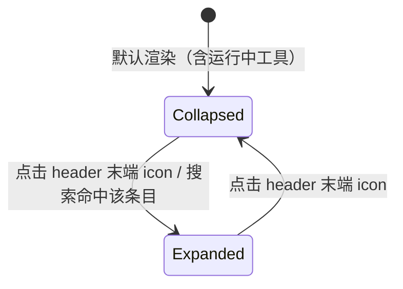

# Collapsible Detail Cards - Plan

## Goal Capsule

- **Objective:** 将工具卡片与 thinking 块的展示统一重构为"默认只显示 header、icon 展开、内容限高滚动"，覆盖主聊天 linear 模式、result focus 过程段详情侧边栏、子代理下钻视图。
- **Product authority:** 2026-08-06 与用户逐条确认（适用范围、运行中工具处理、展开互斥性、限高取值、触发方式、搜索行为）；plan 级 scoping synthesis 同日确认。
- **Execution profile:** 两个相互独立的实现单元，可任意顺序落地；单分支提交。
- **Stop conditions:** 任何需要改变 Product Contract 行为或范围的实现发现，停下来回到用户确认，不自行扩scope。
- **Open blockers:** 无。

---

## Product Contract

> Product Contract 保留说明：planning 未改动产品范围（原 Outstanding Questions 的 OQ1 已由 Planning Contract 的 KTD-3 解决）。doc review 修订：R5/AE2 表述收窄对齐到已确认范围；「展开/收起触发方式」经用户改为工具卡与 thinking 块统一末端 icon 触发（原决定为 thinking 保留整行触发），Key Decision 标注已同步更新。

### Summary

统一重构工具卡片和 thinking 块在所有视图的展示——主聊天 linear 模式、过程段详情侧边栏、子代理下钻视图，一律默认只显示 header，通过 header 末端的展开/收起 icon 控制开合（各条目独立开关、可同时展开多个）；展开的内容限高约 40vh，超出部分内部纵向滚动，彻底取代现在的 192px 预览 + show more/show less。

### Problem Frame

当前同一个条目（工具卡）在三个视图里有三种展示：主聊天 linear 模式与子代理下钻视图中完全展开；过程段侧边栏中显示 192px 预览加 show more/show less 按钮。192px 预览既不足以阅读内容，又让"先看哪条"取决于内容长度而非用户意图；show more/less 按钮在长列表中反复出现，操作与视觉噪音都高。用户在浏览以结果为导向的对话时，真实动线是先扫一遍"做了什么"（header 层面），再有选择地深入某一条的细节——现有展示方式不支撑这条动线。

### Key Decisions

- **三个视图统一适用。** (session-settled: user-directed — chosen over 仅改过程段侧边栏: 用户明确多选了主聊天 linear、过程段详情、子代理下钻全部三个范围，接受主聊天体验随之改变。)
- **运行中工具一律默认收起。** (session-settled: user-directed — chosen over 运行时自动展开、完成后收起: 用户选择最统一简洁的方案，接受实时进度只靠 header 状态徽章、看进度需多点一下。)
- **各条目独立开关、可同时展开多个。** (session-settled: user-directed — chosen over 手风琴互斥（仅一个展开）: 保留多条目对比能力。)
- **限高约 40vh、视口相对。** (session-settled: user-directed — chosen over 固定 320px 或保持 192px: 随窗口大小自适应，大屏看更多、小窗不被单条目占满。)
- **展开/收起统一由末端 icon 触发（工具卡与 thinking 块一致）。** (session-settled: user-directed — chosen over thinking 块保留整行触发: 用户在文档评审中改为统一两个折叠面的触发 UX，推翻此前"thinking 保留整行触发行"的决定；header/触发行其余区域保持静态展示，不与摘要/徽章的既有交互冲突。)
- **纯文本消息不参与折叠。** (session-settled: user-approved — 提议"无 header 的 assistant markdown 正文保持完整展示"，用户在范围确认时同意。)
- **搜索命中自动展开收起条目。** (session-settled: user-approved — 代码核实发现工具卡目前无搜索强制展开机制（仅 thinking 块有），提议与 thinking 块对齐扩展，用户在范围确认时同意。)

### Requirements

**折叠交互**

- R1. 工具卡片与 thinking 块在所有渲染它们的视图中默认收起，只显示 header（工具卡）或触发行（thinking 块）。适用视图：主聊天 linear 模式、result focus 过程段详情侧边栏、子代理下钻视图。
- R2. 工具卡与 thinking 块的展开/收起均由 header/触发行末端的专用 icon 触发，icon 形态随开合状态切换；其余区域维持现有静态展示，不可整行点击。
- R3. 各条目的展开状态相互独立，可同时展开多个条目。

**展开内容展示**

- R4. 展开的详情内容限高约 40vh（视口相对），超出部分在条目内部纵向滚动。
- R5. 工具卡、thinking 块与流式参数预览中不再出现 show more/show less（显示详情/隐藏详情）切换按钮，其 192px 预览态随之移除；子代理摘要卡的 CompactableContainer 保留现状（见 Deferred to Follow-Up Work）。
- R6. 纯文本消息（assistant markdown 正文）保持完整展示，不参与折叠。

**条件状态**

- R7. 运行中/流式中的工具卡同样默认收起，header 上的状态徽章（Running/Completed/Error）是收起态下唯一的进度指示。
- R8. 当搜索命中位于收起的条目内时，该条目自动展开以展示命中内容（thinking 块现有行为，扩展到工具卡）。

Key Flows 从略：本变更的交互为单步状态切换，Requirements 与 Acceptance Examples 已完整覆盖。

### Acceptance Examples

- AE1.
  - **Covers R1, R2, R3.**
  - **Given** 主聊天 linear 模式中一条 assistant 消息含多个已完成工具调用。
  - **When** 用户浏览该消息，然后点击其中一个工具卡 header 末端的 icon。
  - **Then** 初始时所有工具卡只显示 header；点击后仅该卡展开，再次点击收起，其他卡状态不变。
- AE2.
  - **Covers R4, R5.**
  - **Given** 某工具卡的结果内容高度超过 40vh。
  - **When** 用户展开该卡。
  - **Then** 内容区限高约 40vh 并出现内部纵向滚动，且该工具卡内不存在 show more/show less 按钮。
- AE3.
  - **Covers R7.**
  - **Given** 主聊天中一个工具正在流式接收参数。
  - **When** 渲染该工具卡。
  - **Then** 卡片保持收起，header 显示 Running 徽章，不展示流式输入预览。
- AE4.
  - **Covers R8.**
  - **Given** 所有条目默认收起。
  - **When** 用户通过会话内搜索跳转到一个位于收起工具卡内的命中。
  - **Then** 该工具卡自动展开并定位高亮命中内容。
- AE5.
  - **Covers R1, R4.**
  - **Given** result focus 模式下用户点击过程段幽灵行打开侧边栏。
  - **When** 侧边栏渲染该过程段详情。
  - **Then** 其中工具卡与 thinking 块默认收起、展开后限高滚动；子代理下钻视图行为相同。

### Scope Boundaries

- result focus 模式的 region 划分与幽灵行（ProcessRegionGhost）展示不变。
- 侧边栏（DetailDrawer）的宽度拖拽与导航栈（进入/返回/关闭）不变。
- StructuredReport 结构化报告的检测与展示不变。
- 工具卡 header 的现有内容（标题、摘要、状态徽章、auto-approved 标记）不变——只新增末端 icon。
- 搜索的高亮描边样式不变，只新增"命中收起条目时自动展开"。
- 子代理摘要卡（SubagentBriefStatus）与工作流卡（WorkflowToolCard）的卡片 UI 与交互不变——它们是自有卡片实现，不经过工具卡渲染路径。

#### Deferred to Follow-Up Work

- 子代理摘要卡内 CompactableContainer 的 show more/less 迁移与其硬编码英文 label 的 i18n 化——本次保留不动，后续单独立项。

### Dependencies / Assumptions

- 展开状态为会话内 UI 状态，刷新或重开会话后回到默认收起；若后续需要记忆展开偏好，另立需求。
- 实现需保持现有 memo 化渲染的性能特征（长会话中大量收起卡片不应引入额外重渲染）。

### Sources / Research

- `src/client/components/ai-elements/compactable-container.tsx` — 现有 192px 预览 + show more/less 的实现位置（`COMPACTABLE_MAX_HEIGHT_PX = 192`）。
- `src/client/components/ai-elements/tool.tsx` — ToolHeader 目前为静态、无折叠交互；ToolContent 经 CompactableContainer 渲染。
- `src/client/components/DetailDrawer.tsx` — 过程段视图以 `defaultToolExpanded={false}` 渲染，是 192px 预览态的来源。
- `src/client/components/SubagentConversation.tsx` — 子代理视图未传 `defaultToolExpanded`（默认 true），工具卡完全展开、无限高。
- `src/client/components/ai-elements/reasoning.tsx` — thinking 块已是默认收起 + 点击展开，`forceOpen` 支持搜索命中自动展开；展开内容无限高。
- `src/client/components/ChatMessageRenderer.tsx` — 目前未向 ToolContent 传递 `forceExpanded`，搜索命中工具卡仅显示高亮描边、不展开（R8 要补的缺口）。

---

## Planning Contract

### Key Technical Decisions

- **KTD-1. 折叠机制复用 `ui/collapsible`（Radix）原语。** 与 Reasoning 同一套 Collapsible/CollapsibleTrigger/CollapsibleContent + `useControllableState`，不引入新依赖；该原语已有 4 处使用（reasoning、muted-system-note、ApprovalSurface、AskUserQuestionRenderer）。
- **KTD-2. 工具卡与 thinking 块的 trigger 均为末端独立 icon 按钮。** `CollapsibleTrigger asChild` 包裹小 icon 按钮，带 `aria-expanded` 与 aria-label；icon 用旋转的单 ChevronDown（聊天区惯例，见 reasoning、muted-system-note），不用成对切换图标；thinking 块据此从整行可点改为同一形态。先例：`src/client/components/ApprovalSurface.tsx` 的折叠面板触发器。(session-settled: user-directed — chosen over thinking 块保留整行触发: 继承 Product Contract「展开/收起统一由末端 icon 触发」。）
- **KTD-3. 展开 body 统一 `max-h-[40vh] overflow-y-auto`，每张卡只保留一个滚动容器。** 仓库既有惯用法（`src/client/components/SkillInstallModal.tsx`）；原 OQ1 就此关闭：取 40vh，主聊天与窄侧栏共用，不设额外像素边界。(session-settled: user-directed — chosen over 固定 320px 或保持 192px: 继承 Product Contract「限高约 40vh、视口相对」。)
- **KTD-4. CompactableContainer 保留、ToolContent 停用。** 子代理摘要卡仍依赖 CompactableContainer（含其硬编码英文 label，列入 Deferred to Follow-Up Work），组件本体与其测试保留；ToolContent 改为 Collapsible 实现，`showDetails`/`hideDetails` 两个 i18n 键随停用从 en 与 zh-CN 的 chat.json 一并删除。
- **KTD-5. 移除 `defaultToolExpanded` 属性链。** ChatMessageRenderer 的 prop、memo 比较，以及唯一生产者 DetailDrawer 的传参一并删除——默认行为全局反转为收起后该属性没有意义。(session-settled: user-directed — chosen over 仅改侧边栏: 继承 Product Contract「三个视图统一适用」。)
- **KTD-6. 搜索命中经 `forceExpanded` 单向强制展开工具卡。** 镜像 Reasoning 的 `forceOpen` 语义：只在命中时强制开，绝不强制关；ChatMessageRenderer 把搜索命中状态接入工具卡，补上当前只有高亮描边的缺口。(session-settled: user-approved — 继承 Product Contract「搜索命中自动展开收起条目」。)
- **KTD-7. 流式参数预览（StreamingToolInputPreview）去除自身 192px 上限与 show more/less，流式钉底跟随重定向到外层容器。** 它渲染在 ToolContent 内，外层 40vh 滚动容器统一接管高度；消除卡片体内嵌套的第二套展开交互（KTD-3 的单滚动容器原则）。去除自身上限后预览的 pre 元素不再溢出，钉底自动跟随（scrollTop = scrollHeight）改为作用于外层 40vh 容器；用户手动上翻后暂停强制跟随，回到底部附近恢复。
- **KTD-8. 展开状态保存在组件本地，随重挂载回到默认收起。** 消息列表的 React key 为 `message.id + part 序号`，流式期间服务端按稳定 message id 原地修补，组件本地态不丢；会话切换重挂载后默认收起，与 Product Contract 的假设一致。

### Assumptions

- 过程段（process region）经 `message-grouping.ts` 验证只含非文本 part，因此侧边栏详情视图不存在"文本是否折叠"的分支；R6 只对主聊天与子代理视图有意义。
- 自定义 tool-renderers 均无内部滚动/展开行为，40vh 上限不会与它们冲突（AskUserQuestionRenderer 自带的 Collapsible 默认展开，属于正交互）。

### Sequencing

U1 与 U2 相互独立，可任意顺序落地；各自成 commit 或合并为一次提交均可。无先后依赖。

---

## Implementation Units

### U1. 工具卡折叠重构与调用点接线

- **Goal:** 工具卡在所有视图默认收起、header 末端 icon 开关、展开 body 限高 40vh 内部滚动、搜索命中强制展开；移除 show more/less 与 `defaultToolExpanded` 属性链。
- **Requirements:** R1, R2, R3, R4, R5, R7, R8；KTD-1, KTD-2, KTD-3, KTD-4, KTD-5, KTD-6, KTD-7, KTD-8
- **Dependencies:** 无
- **Files:**
  - `src/client/components/ai-elements/tool.tsx`（Tool 改为 Collapsible root；ToolHeader 加末端 icon trigger；ToolContent 改为 CollapsibleContent + `max-h-[40vh] overflow-y-auto`，支持 `forceExpanded`，不再使用 CompactableContainer）
  - `src/client/components/StreamingToolInputPreview.tsx`（去除自身 192px 上限与 show more/less；流式钉底跟随重定向到外层 40vh 滚动容器，用户上翻后暂停强制跟随）
  - `src/client/components/ChatMessageRenderer.tsx`（删除 `defaultToolExpanded` prop 与 memo 比较；工具卡接入搜索命中的 `forceExpanded`）
  - `src/client/components/DetailDrawer.tsx`（删除 `defaultToolExpanded={false}` 传参）
  - `src/client/i18n/en/chat.json`、`src/client/i18n/zh-CN/chat.json`（删除 `showDetails`/`hideDetails` 键；新增 icon 按钮的 aria-label 键，双语）
  - `src/client/components/ai-elements/tool.test.tsx`（重写 ToolContent 套件）
  - `src/client/components/ChatMessageRenderer.test.tsx`、`src/client/components/ChatMessageRenderer.result.test.tsx`（重写展开相关断言）
  - `src/client/components/DetailDrawer.test.tsx`（重写 default collapse state 套件，以及 process region real-time updates 套件中的流式断言——后者需先点击展开）
- **Approach:** Tool 的 Collapsible 以非控态管理开合（KTD-8），`forceExpanded` 单向置开（KTD-6）。header 布局不变，仅在右端追加 icon 按钮；摘要截断、状态徽章、auto-approved 标记保持原样。搜索描边类从被移除的 CompactableContainer 移到 Tool 的 Collapsible 根节点（与 reasoning.tsx 一致，收起态下命中描边仍可见）。`forceExpanded` 触发时标记当前命中元素，并在卡片 40vh 滚动容器内对其 scrollIntoView，保证长结果深处的命中展开后落在可视区。收起时 body 不渲染内容（CollapsibleContent 默认行为），大量工具卡的长会话不产生离屏 DOM 成本。
- **Patterns to follow:** trigger 形态参照 `src/client/components/ApprovalSurface.tsx` 的末端 icon 折叠按钮；旋转 ChevronDown 参照 `src/client/components/ai-elements/reasoning.tsx`；非控态 + forceOpen 语义参照 reasoning 的 `useControllableState` 用法；限高写法参照 `src/client/components/SkillInstallModal.tsx` 的 `max-h-[40vh] overflow-y-auto`。
- **Test scenarios:**
  - 默认渲染工具卡只显示 header（标题、摘要、状态徽章），body 内容（Parameters/Result）不可见。
  - Covers AE1. 点击 header 末端 icon 后 body 展开、icon 呈现展开态、`aria-expanded` 为 true；再次点击收起；同消息内多张工具卡互不影响。
  - Covers AE2. 展开 body 容器带 `max-h-[40vh] overflow-y-auto`；任何状态下查无 show more/show less 文案按钮。
  - Covers AE3. 流式（input-streaming）工具卡默认收起，header 显示 Running 徽章，流式参数预览不可见；展开后预览可见且自身无嵌套 show more/less，外层 40vh 容器随流式输出钉底滚动（用户上翻后暂停强制跟随）。
  - Covers AE4. 渲染带当前搜索命中的工具卡时初始即展开、保留高亮描边，并对命中元素 scrollIntoView 使其落在 40vh 容器可视区内；命中消失后不自动收回（单向语义）。
  - 带非当前搜索命中的收起工具卡仍在 Collapsible 根节点渲染描边（不展开、描边不丢）。
  - 已完成且无结果的工具卡展开后只显示 Parameters 区；错误结果（isError）展开后 Error 区展示与现状一致。
  - Covers AE5. DetailDrawer 过程段视图渲染的工具卡默认收起、icon 展开、限高滚动（含 `defaultToolExpanded` 传参已移除的编译/断言更新）。
  - 回归：SubagentBriefStatus 的 CompactableContainer 行为不变（既有 `SubagentBriefStatus.test.tsx` 与 `compactable-container.test.tsx` 不改动地通过）。
- **Verification:** 上述场景对应的 jsdom 测试全部通过；`npm run lint` 无新增告警；手动冒烟主聊天与过程段抽屉各一次（见 Verification Contract）。

### U2. thinking 块展开内容限高

- **Goal:** thinking 块改为与工具卡一致的末端 icon 触发（不再整行可点），保持默认收起行为，展开内容增加 40vh 限高与内部纵向滚动。
- **Requirements:** R2, R4；KTD-2, KTD-3
- **Dependencies:** 无
- **Files:**
  - `src/client/components/ai-elements/reasoning.tsx`（ReasoningTrigger 改为末端 icon 按钮触发；ReasoningContent 增加 `max-h-[40vh] overflow-y-auto`）
  - `src/client/components/ai-elements/reasoning.test.tsx`（新建，聚焦末端 icon 触发、限高与既有折叠行为回归）
- **Approach:** ReasoningTrigger 从整行可点改为末端 icon 按钮触发（与工具卡同一形态，见 KTD-2），触发行其余区域不再响应点击；ReasoningContent 增加限高样式类；`forceOpen`（搜索命中）强制展开时同样对命中元素 scrollIntoView。不触碰 `disableAutoBehavior`、自动关闭等既有逻辑。
- **Patterns to follow:** 限高写法同 U1（`max-h-[40vh] overflow-y-auto`）；trigger 形态同 KTD-2（ApprovalSurface 先例）。
- **Test scenarios:**
  - thinking 默认收起，点击触发行末端 icon 展开、再次点击收起；点击触发行其余区域不触发开合。
  - 展开后内容容器带 `max-h-[40vh] overflow-y-auto`。
  - `forceOpen`（搜索命中）时自动展开、内容限高，并对命中元素 scrollIntoView。
  - `disableAutoBehavior` 下流式结束后不自动关闭（既有行为回归）。
- **Verification:** 新建测试通过；`npm run lint` 无新增告警。

---

## Verification Contract

- **质量门:** `npm run lint` 通过；`npm run test:client` 全绿（重点回归：`tool.test.tsx`、`reasoning.test.tsx`、`ChatMessageRenderer.test.tsx`、`ChatMessageRenderer.result.test.tsx`、`DetailDrawer.test.tsx`、`SubagentBriefStatus.test.tsx`、`compactable-container.test.tsx`）。
- **行为证明:** U1、U2 的 test scenarios 即行为证明；AE1–AE5 均有对应测试场景（各场景中标注 Covers）。
- **手动冒烟:** `npm run dev:client` 起 dev，目检三个视图——主聊天 linear（工具卡默认收起、icon 展开、长结果 40vh 滚动）、result focus 过程段抽屉（同行为）、子代理下钻视图（同行为）；搜索跳转到收起工具卡内的命中时自动展开。
- 本计划无 server 侧改动，`npm run test:server` 不在验证范围。

---

## Definition of Done

**全局:**

- R1–R8 全部满足，AE1–AE5 可按场景演示。
- 工具卡与流式参数预览内不存在任何 show more/show less 交互；CompactableContainer 仅被子代理摘要卡引用。
- `npm run lint` 与 `npm run test:client` 全绿。
- 按仓库约定，本 plan 文件与代码改动在同一分支一并提交。
- 无探索期残留的废弃代码（如被替换的 CompactableContainer 调用、遗留 prop 注释）。

**U1:** test scenarios 全部通过；三个视图中的工具卡行为一致（默认收起、icon 开关、40vh 滚动、搜索强制展开）。

**U2:** test scenarios 全部通过；thinking 块既有折叠/搜索/流式行为无回归。
