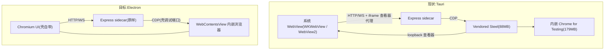
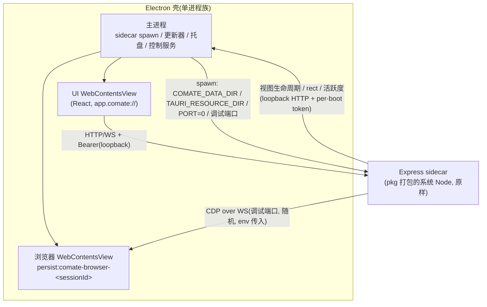
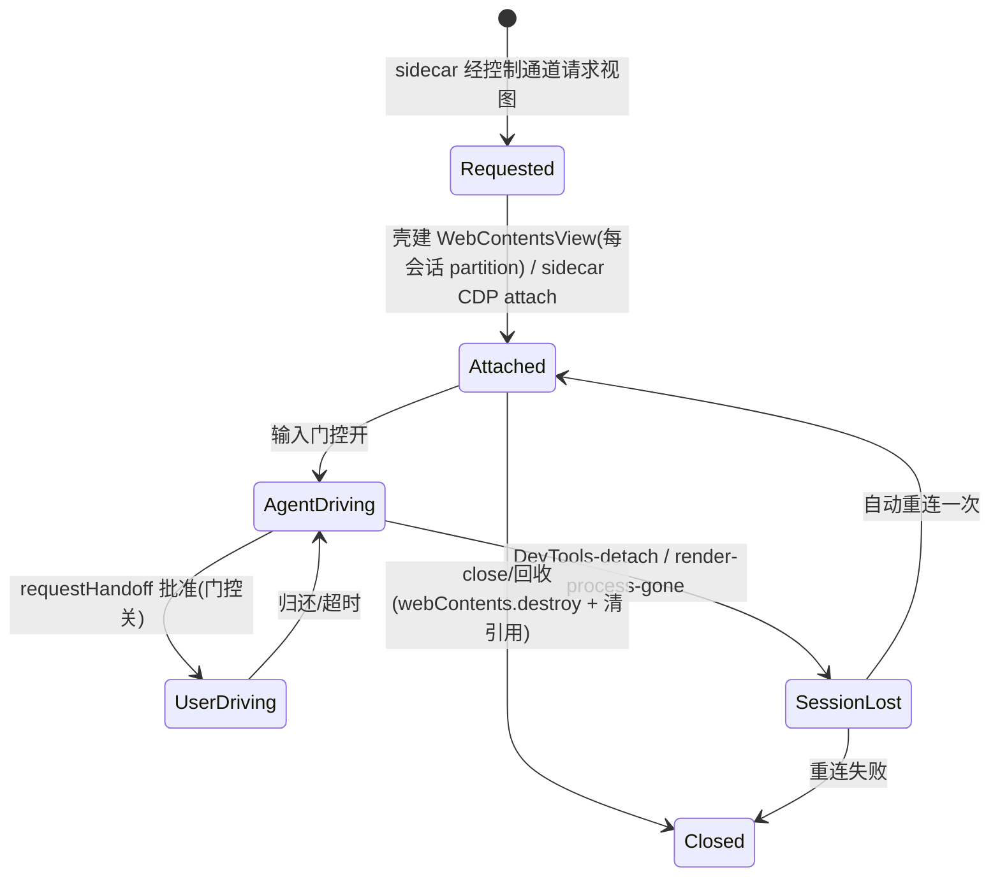

# Tauri to Electron Migration - Plan

## Goal Capsule

- **Objective:** 将 Comate 桌面壳从 Tauri v2 迁移到 Electron；壳内 Chromium 同时承担 UI 渲染与内嵌浏览器，原生取代 Vendored Steel + 内嵌 Chrome for Testing;Express sidecar 原样保留。单次切换发布，桥接版本带走存量用户，平台从 macOS/Windows 扩展到 Linux。
- **Product authority:** 本文件的 Product Contract 是范围与成功标准的权威来源。
- **Execution profile:** code;Deep；四个阶段（壳骨架与打包 → 浏览器原生栈与清理 → 更新连续与桥接 → Linux)。
- **Stop conditions:** 桥接演练（macOS + Windows 两存量系统 e2e）失败且回退方案也不可行时停止并上报，不得带病发布；sidecar 的进程模型、打包形态与壳间契约（ready JSON、PORT=0、/shutdown、环境变量集）被证明无法在 Electron 壳下保持时停止——chat/SQLite/SDK/WeCom/wecom-cli 为冻结面，浏览器子系统按 U7/U8 重平台化属计划内修改。
- **Tail ownership:** 发布与回滚值守由执行者承担，直到桥接版本发布后一个更新周期确认无大面积失败。
- **Open blockers:** 无（以签名资产已存在或 T0 启动采购为前提，见 Risks & Dependencies)。Open Questions 均为实施期可解的非阻塞项。

---

## Product Contract

### Summary

把桌面壳从 Tauri v2 迁到 Electron：壳内同一个 Chromium 既渲染 React UI 又承载内嵌浏览器（WebContentsView + CDP)，从而删除约 267MB 的捆绑浏览器栈（Chrome for Testing 179MB + Vendored Steel 88MB）及其查看器代理层。sidecar 不动，能力对齐是唯一成功门禁；单次切换 + 桥接更新，并新增 Linux 平台。

### Problem Frame

内嵌浏览器需求是在 Tauri 选型（`docs/brainstorms/claude-code-gui-workspace-manager-requirements.md:125`，明确用户偏好）之后落地的。Tauri 的系统 webview 在 macOS WKWebView / Linux WebKitGTK 上不暴露 CDP，这是结构性约束（`docs/plans/2026-07-18-001-feat-embedded-controlled-browser-plan.md:35`)，团队当时的解法是绕过它：vendored Steel 引擎 + 内嵌 Chrome for Testing + iframe 查看器代理。

这套绕行架构的代价已记录在案：浏览器面板黑屏事故簇（CHANGELOG L160-164)、vendored Steel 打包破坏与 PR #99 热修（L166-168)、Windows WebView2 CSP 阻断全部 IPC(L224)、release 构建 webview 阻断 sidecar WebSocket(L316)、WiX 非 ASCII 路径失败。同时 Tauri 的体积优势已经花完——浏览器引擎本来就随包分发，四平台都带 Chromium zip(`src/server/utils/cft-spec.ts:39-67`)。

注意一个被否证的动机：WebKit 性能不是本次迁移的理由。仓库内无任何 WebKit 性能投诉，且 Windows 上 Tauri 本来就渲染在 Chromium(WebView2）之上；WKWebView 已知短板不涉及 React 聊天界面这类负载。

### Key Decisions

- **迁移到 Electron。** 壳只有 657 行 Rust、6 个 command、4 个非测试 `invoke` 调用点、12 处非测试 `@tauri-apps/*` 导入——替换面小，真正的成本在打包/更新/签名管线。(session-settled: user-directed — chosen over 维持 Tauri 或先做验证 spike: 方向已定，Steel/CDP 对等风险转为计划内假设，由能力对齐清单兜底。)
- **原生取代 Steel + Chrome for Testing。** 内嵌浏览器改由壳内 Chromium 承载，Steel 当年省掉的"帧流 + 输入回传"两条自研管线在 Electron 里天然免费。(session-settled: user-approved — chosen over 保留 Steel 为 sidecar 服务、或先壳后浏览器两期走： 只有原生取代能同时兑现体积与架构简化收益。)
- **浏览器 UX 只做能力对齐。** 迁移期不新增地址栏/多标签等一等浏览器面板功能；原生视图顺带消除黑屏/缩放/交互迟滞问题。(session-settled: user-approved — chosen over 借机升级浏览器面板： 迁移与功能演进解耦。)
- **单次切换 + 桥接更新。** 一个版本直接换壳，最后一个 Tauri 版本把存量用户带过来；安全阀是浏览器 CDP 目标可配置回退 + 保留最后一版 Tauri 安装包。(session-settled: user-approved — chosen over 双壳过渡或分平台切换： 避免双倍打包/签名/CI 成本，而那恰是痛点所在。)
- **平台扩展到 Linux。** 首个 Linux 版本即 Electron 版本，无存量桥接负担。(session-settled: user-directed — chosen over 保持 macOS+Windows: 借 Electron 成熟的 Linux 支持一次覆盖三平台，接受其打包变体与 QA 矩阵成本。)
- **sidecar 原样保留。** Express/Node sidecar 不经修改地跑在 Electron 壳下，better-sqlite3 留在 sidecar 的系统 Node 进程，规避 Electron ABI 重编译；wecom-cli 只连 sidecar loopback，不受壳替换影响。(session-settled: user-approved — chosen over 借迁移重做服务端： 保留全部服务端投资，迁移面最小化。)
- **成功标准以能力对齐清单为唯一门禁。** 体积收益出数但不设门禁，桥接连续性是底线约束，稳定性不回退是基线预期。(session-settled: user-directed — chosen over 将体积/更新成功率/稳定性并列为门禁标准： 用户明示仅对齐清单作为成功标准。)

### Requirements

**壳与打包**

- R1. Electron 壳对等现有六项壳能力：API 端口/令牌获取、更新器重启准备、dock 徽章、文件管理器揭示、外链打开、单实例，以及通知与对话框行为。
- R2. 壳负责拉起 Express sidecar 并在退出时完成清理，行为与现状一致。
- R3. 打包覆盖 macOS(dmg+zip)、Windows(NSIS 主产物；MSI 仅作企业附加产物，无自动更新)、Linux(AppImage 主、deb 辅），并保留企业版无-claude 形态的资源变体门。
- R4. 自动更新连续：最后一个 Tauri 版本作为桥接版本把存量用户更新到首个 Electron 版本，更新失败可回滚到最后一版 Tauri 安装包。

**内嵌浏览器**

- R5. 内嵌浏览器由壳内 Chromium 承载，不再捆绑 Chrome for Testing 与 Vendored Steel;11 个 comate-browser 工具（open、snapshot、inspectElement、startNetworkCapture、stopNetworkCapture、authenticatedRequest、act、submit、extract、requestHandoff、close）能力对齐。
- R6. 浏览器登录态（cookies、token、storage）持久化语义保持，authenticated-request broker 与 sanitized API recipe 链路在原生栈上不断。
- R7. 观看与接管体验对齐：原生浏览器视图取代 iframe 查看器与 loopback 代理，requestHandoff 接管流程保持。
- R8. 浏览器 CDP 目标可配置（壳内 Chromium 或外部回退路径），发布后不重发版即可回退。

**兼容与连续**

- R9. sidecar 全部能力（chat、SQLite、SDK、WeCom、wecom-cli）在 Electron 壳下不经修改运行。

### Architecture Before and After



### Key Flows

- F1. 存量用户桥接更新
  - **Trigger:** 运行最后一个 Tauri 版本的用户检查更新。
  - **Steps:** 桥接版本提供首个 Electron 安装包；安装后工作区、会话、SQLite 数据原地保留；Electron 版启动并接管后续更新。
  - **Outcome:** 用户无感迁入 Electron 线，失败可回滚到最后一版 Tauri 安装包。
  - **Covered by:** R4, R9
- F2. 浏览器后端回退
  - **Trigger:** 发布后发现某浏览器能力在原生栈上未对齐。
  - **Steps:** 将浏览器 CDP 目标切换到外部回退路径；11 个工具经回退路径继续服务。
  - **Outcome:** 能力恢复，无需重发客户端。
  - **Covered by:** R5, R8

### Acceptance Examples

- AE1. **Covers R4, R9.** Given 用户运行最后一版 Tauri 且已有工作区与会话数据，When 执行自动更新，Then 迁入首个 Electron 版本且全部数据可用；浏览器站点登录经 remember-site 存储自动重登（CfT profile 的 cookie/storage 不迁移——产品既有的登录持久化语义本就由 site-auth 存储承载，见 `src/server/routes/chat.ts:122-124`)。
- AE2. **Covers R5, R8.** Given 线上 Electron 版某浏览器工具行为未对齐，When 将 CDP 目标切到回退路径，Then 11 个工具恢复对齐行为且无需重发客户端。
- AE3. **Covers R6.** Given 用户已在嵌入浏览器中登录某站点，When agent 调用 authenticatedRequest,Then 请求复用已保存的登录态且凭据不进入模型上下文。

### Success Criteria

- **门禁（唯一）:** 能力对齐清单全过——R1-R9 逐条验证，含 6 项壳能力、11 个浏览器工具、登录态持久化与 broker 链路。
- **底线约束：** 桥接更新连续性（R4）不可牺牲。
- **预期结果（出数但不设门禁）:** 三平台安装包体积对比（预期移除约 267MB 浏览器栈资源）；稳定性不低于现状；浏览器黑屏类事故归零。

### Scope Boundaries

- 浏览器新交互（地址栏、多标签、一等用户浏览器面板）不在本次范围——迁移只做能力对齐。
- sidecar 内部演进（Express、SQLite、SDK、WeCom）不在本次范围。
- 双壳过渡与分平台切换不采用。
- WebKit 性能不作为本迁移的论据（已否证）。
- Vendored Steel 的构建质量门（pure-JS 审计、体积预算）随 Steel 删除而退役；通用审计门（符号链接/非 ASCII 路径）re-home 到存续管线，不随删（见 KTD-13)。

#### Deferred to Follow-Up Work

- token 免入渲染层的加固（主进程经 `onBeforeSendHeaders` 注入 Authorization）——需先验证 WS 升级拦截，迁移期保持现状 parity。
- 浏览器面板的渐进式 rollout(`stagingPercentage`）与企业版分阶段发布策略。

### Dependencies / Assumptions

- Steel 的反检测现状已查实：vendored Steel 默认对每个页面注入合成桌面 Chrome 指纹 + UA（我们从未显式配置）——按对等原则在原生栈复刻（KTD-12)，不再是假设。
- Electron 单 Chromium 同时承载 UI 与内嵌浏览器视图是成熟官方能力（WebContentsView 稳定；`<webview>` 标签已被官方劝退）。
- better-sqlite3 以预编译 `.node` 随 sidecar 分发，壳替换不触发 ABI 重编译。
- 企业版无-claude 形态（`COMATE_BUNDLE_BACKENDS` 变体门）在 Electron 打包中以函数式 config 等价实现。
- 桥接机制假设：tauri 更新器对下载产物内容不透明（mac 换 `.app.tar.gz`、Windows 执行 NSIS setup.exe)，因此桥接不需要再发一个 Tauri 构建——该假设由 U6 的两存量系统演练硬门禁验证，失败则回退为定制 Tauri 桥接构建。

### Outstanding Questions

原四项 Deferred to Planning 已全部在规划期解决：CDP 接入路径（KTD-6，壳调试端口直连）、Linux 打包形态（R3,AppImage 主 + deb 辅）、Steel 反检测使用情况（默认开启，KTD-12 复刻）、企业变体门等价实现（KTD-13，函数式 electron-builder config)。无遗留阻塞项。

### Sources / Research

- `docs/plans/2026-07-18-001-feat-embedded-controlled-browser-plan.md` — 内嵌浏览器现状架构与"webview 不暴露 CDP"的约束记录。
- `docs/brainstorms/claude-code-gui-workspace-manager-requirements.md:125` — Tauri 选型的原始记录（本次由同一决策人带着新事实重开）。
- `CHANGELOG.md` L152-L168、L224、L316 — 捆绑浏览器栈与 Tauri 打包/webview 痛点记录；PR #99 热修。
- `docs/solutions/workflow-issues/tauri-v2-signed-auto-updater-ci-release.md` — 现有 minisign 签名自动更新管线；其结构性保障（CI 清单校验、草稿先发布再测端点、签名配置条件化）在 U4/U6 中平移。
- `docs/solutions/build-errors/cpsync-rewrites-relative-symlinks-dangling-tauri-resources.md` — npm 树拷贝的符号链接陷阱；审计门 re-home 的依据。
- `CONCEPTS.md` — Vendored Steel、Production closure、authenticated-request broker、sanitized API recipe、桥接版本的术语定义。
- 外部依据：Electron 官方文档（WebContentsView、debugger、app 生命周期、security tutorial);electron-builder v26 / electron-updater v6 文档（auto-update、targets、NSIS/MSI、签名公证、fuses);tauri-plugin-updater 源码（桥接清单格式与安装执行参数）;Fluxzy Electron→Tauri 迁移报告（更新器桥接与 Windows 两道签名）;AFFiNE Tauri→Electron 先例（理由为二手来源）。

---

## Planning Contract

Product Contract preservation: changed: R3 — Windows 主安装包由 MSI 改为 NSIS(electron-updater 不支持 MSI 自动更新；MSI 转为企业附加产物）;AE1 — 登录态表述对齐产品既有的 site-auth 重登语义(CfT profile 不可迁入 Electron 分区);Outstanding Questions 与 Dependencies/Assumptions 按规划结果就地消解；其余不变。

### Key Technical Decisions

- **KTD-1. 迁移到 Electron,sidecar 原样保留。** sidecar 契约（stdout ready JSON、`PORT=0`、`/shutdown`、环境变量集）与壳无关，Electron 主进程逐项复刻即可。(session-settled: user-directed/user-approved — chosen over 维持 Tauri / 重做服务端： 方向已定且迁移面最小化； 对应 Product Contract Key Decisions 第一、六条。)
- **KTD-2. 原生取代 Steel + Chrome for Testing。** 内嵌浏览器由壳内 WebContentsView 承载；Steel 的会话语义在原生栈重建。(session-settled: user-approved — chosen over 保留 Steel: 兑现体积与架构收益。)
- **KTD-3. 单次切换 + 桥接更新。** 同一 GitHub release 同时携带 tauri 格式 `latest.json`（指向 Electron 产物）与 electron-updater 的 `latest*.yml` 两个清单家族，无需再发 Tauri 构建；自桥接 release 起，每个后续 release 继续携带 latest.json（指向最新 Electron 安装包），直到遥测确认 Tauri 存量归零，CI 守卫缺 latest.json 即构建失败。(session-settled: user-approved — chosen over 双壳过渡/分平台切换： 避免双倍打包签名成本。)
- **KTD-4. 能力对齐清单为唯一成功门禁。** 体积、稳定性出数不设门禁；桥接连续性是底线。(session-settled: user-directed — chosen over 多指标并列为门禁。)
- **KTD-5. 平台加 Linux。** AppImage 主产物（自动更新可用）,deb 为辅（更新需提权，文档明示）。(session-settled: user-directed — chosen over 保持 macOS+Windows。)
- **KTD-6. CDP 传输：壳开随机本地调试端口，sidecar 直连；弃用 `webContents.debugger` 中继。** 对 brainstorm 机制名的证据修正：`webContents.debugger` 一个 webContents 仅允许一个 debugger 且开 DevTools 即断连，中继会传染这种脆弱性；调试端口路径保留服务端现有 `CdpConnection`(WebSocket 传输）与全部 23 个 browser 模块，即 Playwright 驱动 Electron 的标准路径。锁死：不设 `--remote-allow-origins=*`，随机端口经 spawn env 传给 sidecar，只绑 127.0.0.1。
- **KTD-7. 数据目录与 appId 钉死。** 主进程显式计算并传入 Tauri 时代路径（`~/Library/Application Support/com.comate.app`、`%APPDATA%\com.comate.app`、`~/.local/share/com.comate.app`)，同时 `app.setPath('userData')` 钉到同一根下；electron-builder `appId: com.comate.app` 不变。违约后果：桥接用户数据静默分叉（AE1 失败）。
- **KTD-8. Windows 主产物 NSIS(oneClick、per-user),MSI 转企业附加。** electron-updater 无 MSI 自动更新路径；NSIS 默认安装目录与 Tauri 不同，桥接安装包用 `nsis.include` 探测旧 Tauri 安装并以带界面 `msiexec /x` 卸载（存量为 per-machine MSI，接受一次 UAC 提示）；用户拒绝或卸载失败则容忍残留，中和旧入口（移除旧快捷方式与更新入口）并给一次性清理提示。(session-settled: user-approved — chosen over 保持 MSI: 自动更新连续性是底线。)
- **KTD-9. 签名与公证进入 CI。** macOS 签名 + notarize(App Store Connect API key)+ Hardened Runtime entitlements（自动更新与 Electron 42+ 通知的硬前提）;Windows Authenticode 走云签名（Azure Trusted Signing 或等效）;Windows 桥接签名顺序：先 Authenticode 后 minisign。(session-settled: user-approved — chosen over 保持不签名： 无签名则 macOS 无法自动更新、通知静默失败。)
- **KTD-10. 每会话 partition 隔离。** 浏览器视图使用 `persist:comate-browser-<sessionId>`,1:1 镜像今日每会话独立 Chrome profile 的隔离语义；不采用共享 partition（会把跨会话/跨工作区/bot 会话的登录态混在一起，并破坏 remember-site 注入语义）。
- **KTD-11. 壳↔sidecar 控制通道。** 壳在 127.0.0.1 起一个 per-boot token 门控的 HTTP 服务，承载视图生命周期（创建/销毁/移动）、面板 rect 上报、活跃度转发、**分区抹除**（会话/工作区删除时 wipe 对应 `persist:comate-browser-<sessionId>` 分区，对齐今日 `wipeProfile` 语义）与 quitting 状态（quit 中拒绝新建视图）；孤儿分区按 sidecar 会话注册表对账回收（平移今日 pidfile/SingletonLock 回收职责）；镜像 sidecar ready-line 的握手模式。sidecar 不再自己 spawn 浏览器进程。
- **KTD-12. 反检测指纹对等复刻。** 每会话经 CDP 注入合成桌面 Chrome UA(`Network`/`Emulation.setUserAgentOverride`)+ 指纹 init script(`Page.addScriptToEvaluateOnNewDocument`)，对齐 Steel 默认行为；不静默丢弃。(session-settled: user-approved — chosen over 丢弃该行为： 它是生产现状，丢弃属隐性产品变更。)
- **KTD-13. 构建栈钉版与资源布局。** electron-vite（主/preload CJS/渲染三端构建，沿用团队 Vite 栈）+ electron-builder v26 + electron-updater v6(v27/v7 为 alpha 不采用）;sidecar 二进制与大资源走 `extraResources`,`TAURI_RESOURCE_DIR` 变量名保留（六个服务端 resolver 消费它）;`native-artifact-audit.ts` 的符号链接/非 ASCII 审计门 re-home 到 `build-sidecar.ts` 的资源暂存步骤；版本号单源收敛到 `package.json`。
- **KTD-14. 原生视图 UX 规则集。** 遮挡：任何 overlay（弹窗/菜单/对话框）打开覆盖面板区时隐藏浏览器视图（单一 store 旗标驱动）;popout = 视图 setBounds 重定向；输入门控：`agent_in_control` 时视图 `setIgnoreMouseEvents(true)` 并失焦（键盘门控单列）；活跃度：壳从视图 webContents 输入事件节流转发 sidecar（取代 iframe 上的 React 指针上报）;`window.open`:UI 视图拒绝+外链走系统浏览器，浏览器视图允许同分区弹窗（OAuth 登录）;DevTools-detach → `session_lost` + 自动重连一次，不提供视图内 DevTools 入口。
- **KTD-15. sidecar 静态托管保留，浏览器面板在非壳环境降级。** sidecar 继续静态托管 UI(dev/诊断用途），该模式下浏览器面板显示"需桌面端"降级态（沿用能力声明表的"disabled + reason"模式），而非静默失效；origin 白名单仅新增 UI scheme，自源放行不动。
- **KTD-16. 浏览器视图 webPreferences 与补丁节奏。** 浏览器视图（含 OAuth 弹窗）一律 `sandbox: true`、`contextIsolation: true`、`nodeIntegration: false`、不挂 preload;Electron 跟随稳定线补丁版本，安全修复的落后上限为一个补丁周期。

### System-Wide Impact

- **数据生命周期：** 浏览器登录态的载体从 CfT profile 变为 Electron 分区；创建（U7)、抹除（会话/工作区删除 → 控制通道 wipe,KTD-11)、孤儿回收（注册表对账）、桥接残留清理（U9）四段全部有主。桥接不迁移 profile cookie/storage，登录经 site-auth 存储重登（AE1 口径）。
- **认证边界：** 调试端口只绑 127.0.0.1、不设 `--remote-allow-origins`、dev-web 不启用；浏览器视图会话 deny-by-default 权限处理器；desktop token 经 contextBridge 最小暴露。本地信任边界扩大（UI 渲染进程可被本地进程挂调试）作为已知取舍文档化。
- **Agent/工具 parity:** 11 个 comate-browser 工具 + `health-browser` 端点（失败分类重设计：控制通道不通/视图创建失败/调试端口缺失，替代 Steel 文案）+ release 门禁中的 CDP 线缆（U7/U4)。
- **贡献者开发回路：** 全功能开发唯一入口变为 electron 开发模式；`dev:client` 保留 UI 开发但浏览器面板降级（KTD-15)；服务端浏览器调试可用 R8 回退环境变量指向手动启动的 Chromium；端口冲突规则重写（electron-vite 渲染 dev server 同样默认 5173)。
- **文档面：** `CHANGELOG.md`、`README.md`、`CLAUDE.md`、`development.md`、`CONCEPTS.md`、`docs/solutions/` 相关条目；`packages/wecom-cli` 与 `claude-code-plugin` 经核实零 Tauri/Steel 引用，不动。
- **跨仓/安装面：** Windows 旧安装清理由桥接安装包承担；企业变体走独立更新通道，杜绝 claude-free 装机被更新进全量构建。

### High-Level Technical Design

目标进程与通道拓扑：



桥接发布流程（同一 release 双清单家族）:

```mermaid
sequenceDiagram
  participant CI as CI(electron-builder)
  participant REL as GitHub Release(draft)
  participant OLD as 存量 Tauri 客户端
  participant NEW as Electron 客户端
  CI->>CI: 构建 + Authenticode/公证签名
  CI->>CI: 重打包 .app.tar.gz;然后 minisign 最终产物
  CI->>REL: 上传 latest.json(tauri 家族)+ latest*.yml + blockmap
  OLD->>REL: 轮询 latest.json(版本 > 0.0.33)
  REL-->>OLD: 指向 Electron 安装包 + minisign 签名
  OLD->>OLD: 下载校验并执行安装(NSIS 含旧安装清理 / macOS 原位换 .app)
  NEW->>REL: 后续读 latest.yml 家族自更新
```

浏览器会话生命周期：



### Alternatives Considered

- **utilityProcess.fork 承载 sidecar** — 否决：Electron 内嵌 Node 的 ABI 与系统 Node 不同，会强迫 better-sqlite3 按 Electron 头文件重编译，违背 sidecar 不动决策；utilityProcess 只适合纯 JS 辅助进程。
- **`webContents.debugger` 中继 CDP** — 否决：一 webContents 一 debugger 的独占性 + DevTools 开启即断连；且要重写服务端传输层（见 KTD-6)。
- **保持 MSI 为 Windows 主产物** — 否决：electron-updater 无 MSI 自动更新路径；MSI 仅留作企业附加（见 KTD-8)。
- **electron-builder v27 / electron-updater v7** — 否决：均为 alpha，配置结构剧变；钉 v26/v6 稳定线（见 KTD-13)。
- **共享浏览器 partition** — 否决：破坏每会话隔离与 bot 隔离边界（见 KTD-10)。

### Risks & Dependencies

- **Windows 桥接载荷执行未实证（高）。** 0.0.33 的 Windows 用户装在 MSI 上，tauri 更新器将对 NSIS 载荷的分发行为（按下载产物类型还是按当前安装类型）必须经三系统演练验证；失败则回退为定制 Tauri 桥接构建（U6 硬门禁，见 Stop conditions)。
- **调试端口扩大本地信任边界（中）。** 一个端口暴露全部 webContents（含持有 desktop token 的 UI 渲染进程）给任意本地进程；缓解：只绑 127.0.0.1、不设 `--remote-allow-origins`、dev-web 模式不开端口，并在安全文档中明示该取舍。
- **证书采购是 CI 前置依赖（中，T0 启动）。** Apple Developer 账号与 Windows 云签名服务需在 U3/U4 前到位；作为与 U1 并行的 T0 前置行动立即启动（确认既有资产或开始组织验证）,owner 由执行方指派。
- **Windows 关机/注销不触发 `before-quit`/`will-quit`（中）。** sidecar 需父进程看门狗（轮询父 PID 自退）+ Windows Job Object(KILL_ON_JOB_CLOSE)，否则孤儿 sidecar 残留。
- **install-on-quit 竞态（低）。** electron-updater v6 默认任何退出都会安装已下载更新；`is_updating` 宽限须在隐式退出路径同样武装（U5)。
- **企业版 Tauri 线装机量未知（低）。** 发布桥接前确认是否已有企业版 Tauri 装机；若有则需为企业通道同步生成桥接清单。
- **webview localStorage 不可迁移（低）。** 面板开合状态等 UI 偏好存在 WKWebView 存储而非数据目录，桥接后重置；发布说明中注明。
- **CfT profile 登录态不随桥接迁移（低，已按产品语义消解）。** Electron 分区无法导入旧 Chrome profile;cookie/storage 级登录态在桥接后失效，站点重登经 site-auth 存储自动完成（产品既有语义）；不做 cookie 导出桥接。发布说明注明。

### Deferred to Implementation

- 指纹生成库选型（复用 Steel 同款 fingerprint-injector 或精简自实现）。
- `nsis.include` 旧安装探测与卸载的具体脚本细节。
- 企业通道名与产物名后缀的具体取值。
- Electron 具体钉版值（实施时取最新 43.x 稳定）。

---

## Implementation Units

| U-ID | 单元 | 关键文件 | 依赖 |
|---|---|---|---|
| U1 | Electron 壳骨架与 sidecar 生命周期 | `electron/`、`electron.vite.config.ts`、request-origin-guard | — |
| U2 | 客户端桥接层与壳能力对等 | `src/client/lib/`、相关组件与测试 | U1 |
| U3 | 打包配置与签名公证 | `electron-builder.config.ts`、`build/`、`scripts/build-sidecar.ts` | U1 |
| U4 | CI 发布管线 | `.github/workflows/build.yml` | U3 |
| U5 | Electron 线自动更新与企业通道 | `electron/updater.ts`、updater-api | U1, U4 |
| U6 | 桥接发布与两系统演练 | `scripts/build-bridge-manifest.ts`、`build/nsis-include.nsh` | U4, U5, U8 |
| U7 | CDP 原生接入与工具对等 | `browser-cdp.ts`、`browser-service.ts`、`electron/control-server.ts`、`browser-fingerprint.ts` | U1 |
| U8 | 原生浏览器视图与面板 UX 对齐 | `electron/browser-view-manager.ts`、面板组件 | U7 |
| U9 | Steel/CfT 移除与残留清理 | 删除清单见单元体 | U7, U8 |
| U10 | Linux 平台启用 | electron-builder config、build.yml | U4, U7, U8 |

### Phase A: Shell Skeleton and Packaging

#### U1. Electron shell skeleton and sidecar lifecycle

- **Goal:** 建起可运行的 Electron 壳：窗口、preload 桥、sidecar 拉起/清理、托盘、单实例、数据目录钉死——shell 能力的地基。
- **Requirements:** R1, R2, R9（部分，sidecar 拉起）
- **Dependencies:** 无
- **Files:** 新建 `electron/main.ts`、`electron/preload.ts`、`electron/paths.ts`、`electron/sidecar.ts`、`electron/tray.ts`、`electron/menu.ts`、`electron/logger.ts`、`electron.vite.config.ts`;`package.json`(main/scripts/版本单源）；修改 `src/server/services/security/request-origin-guard.ts:81-83`（放行新 UI scheme)。
- **Approach:** 主进程以 `src-tauri/src/lib.rs` 为规格逐项复刻：`requestSingleInstanceLock` + `second-instance` 聚焦；sidecar 用 `child_process.spawn` 拉起 `process.resourcesPath` 下的 sidecar-node(KTD-1，禁 utilityProcess)，环境变量集逐项一致（含保留名 `TAURI_RESOURCE_DIR`、KTD-13);stdout ready JSON 解析与 token 不入日志；退出矩阵平移（`before-quit`/`will-quit` 清理、优雅 shutdown POST + 宽限 + 强杀、Windows 树杀、关机看门狗与 Job Object 见 Risks);close-to-tray 用显式 `isQuitting` 旗标防重入；UI 经 `protocol.handle` 的特权自定义 scheme 加载（加入 origin 白名单）;macOS 菜单含 Edit 角色（否则 Cmd+C/V 失效）、AUMID 设为 `com.comate.app`;`main.log` 写入 `<COMATE_DATA_DIR>/logs`。
- **Patterns to follow:** `src-tauri/src/lib.rs:143-212`（退出矩阵，注释标明"已验证，供复用")、`:503-546`(spawn 环境）、`:243-326`（托盘轮询）。
- **Test scenarios:**
  - Happy path:spawn 后解析 ready JSON 拿到 port/token；二次启动聚焦既有窗口（single-instance)。
  - Edge:close-to-tray 重入（托盘退出/Cmd+Q/更新安装三条路径都绕过 hide);sidecar ready 超时给出可诊断错误。
  - Error:sidecar 进程启动即崩 → 壳展示致命错误页而非静默悬停；`will-quit` 未触发路径（模拟 Windows 注销）下看门狗使 sidecar 自退。
  - Integration:sidecar `/shutdown` 优雅退出 → 宽限 → 强杀的完整时序；origin guard 放行新 scheme 且拒绝旧 `tauri://` 以外未知源。
- **Verification:** 新增 `test:electron`(node:test）覆盖主进程纯逻辑模块；壳在三系统开发模式启动并连通 sidecar。

#### U2. Client bridge layer and shell-capability parity

- **Goal:** 用一个 Electron 桥接模块替换全部 `@tauri-apps/*` 面，客户端壳能力逐项对等，测试 mock 面同步收敛。
- **Requirements:** R1（客户端侧）
- **Dependencies:** U1
- **Files:** 新建 `src/client/lib/desktop-api.ts`（桥接唯一入口）与其 mock;修改 `src/client/lib/tauri-api.ts`（重指向/更名）、`src/client/main.tsx`、`src/client/App.tsx`、`src/client/lib/updater-api.ts`、`src/client/lib/use-badge-sync.ts`、`src/client/lib/open-url.ts`、`src/client/lib/platform.ts`、`src/client/lib/notifications.ts`、`src/client/components/FileExplorer.tsx`、`src/client/components/CreateWorkspaceModal.tsx`、`index.html`(CSP meta);测试 `AppLayout.test.tsx`、`CreateWorkspaceModal.test.tsx`、`FileExplorer.test.tsx`、`RightPanel.browser.test.tsx`、`open-url.test.ts`、`updater-config.test.ts`、`src/server/services/__tests__/tauri-browser-csp.test.ts`（改写为新投递机制的断言）、`src/client/i18n/en/` 与 `src/client/i18n/zh-CN/` 相关命名空间（桥接降级文案）。
- **Approach:** preload 经 contextBridge 暴露白名单函数（getApiInfo、badge、reveal、openExternal、dialog、notification、窗口操作、更新器方法），不暴露裸 `ipcRenderer`;`updater-api.ts` 对外签名不变（消费方 SettingsPanel/UpdateRestartDialog/UpdateNotification 不动）;`isTauri()` 两处嗅探（tauri-api.ts 与 CreateWorkspaceModal 的 `@tauri-apps/api/core` 直引）统一为桥接探测；CSP 以 meta/onHeadersReceived 投递，`connect-src` 同时放行 `127.0.0.1` 与 `localhost` 的 http/ws；外链仍仅放行 http/https（沿用 open-url.ts 校验）。
- **Patterns to follow:** 现有 `vi.mock('@tauri-apps/...')` 边界 mock 模式——收敛为 mock 单一桥接模块。
- **Test scenarios:**
  - Happy path：六项壳能力经桥接逐项可用（端口/令牌获取驱动 fetch 重写与 WS URL)。
  - Edge:`/api/*` 重写在桥接信息未就绪时重试（沿用 50×200ms 语义）；非 http/https 外链被拒绝且告警。
  - Error：桥接缺失（纯浏览器 dev:client）时各能力按现状降级（window.open 等）。
  - Integration:CSP 守卫测试断言新机制真实产出 `frame-src`/`connect-src` 指令；更新配置测试改读 `electron-builder.config.ts` 并断言 GitHub 端点。
- **Verification:** `npm run test:client` 与 `npm run test:browser` 全绿；客户端无 `@tauri-apps` 引用残留。

#### U3. Packaging config and signing/notarization

- **Goal:** electron-builder v26 打包三平台产物，签名/公证/entitlements/fuses 齐备，企业变体门等价，资源布局落地。
- **Requirements:** R3
- **Dependencies:** U1
- **Files:** 新建 `electron-builder.config.ts`（函数式，读 `COMATE_BUNDLE_BACKENDS` 调整 `extraResources`)、`build/entitlements.mac.plist`、`build/`（图标等）；修改 `scripts/build-sidecar.ts`（产物输出到 Electron 资源布局；re-home 审计门）、`src/server/utils/native-artifact-audit.ts`（挂到资源暂存步骤）。
- **Approach:** `appId: com.comate.app`;mac 目标 dmg+zip(zip 是自动更新前提）+ Hardened Runtime + 公证；Windows NSIS oneClick per-user;Linux AppImage+deb 配置先行（U10 启用）；大资源全走 `extraResources`,sidecar 禁入 asar;fuses:`runAsNode` 关、`onlyLoadAppFromAsar` + 完整性校验开；企业变体门以函数 config 等价（产物名带变体后缀，杜绝清单串线，KTD-13);mac 单 runner 双 arch(`--x64 --arm64`，无原生模块故无需 universal)。
- **Patterns to follow:** `scripts/build-sidecar.ts` 现有变体门与断言（L177-186、L252-271)。
- **Test scenarios:**
  - Happy path：三平台产物产出且体积出数（与 Tauri 基线对比表）。
  - Edge:claude-free 变体产物断无 claude 二进制（断言门平移）；资源树无悬空符号链接/非 ASCII 路径（审计门 re-home 后仍触发）。
  - Error：缺签名密钥时本地构建跳过签名但不产出更新清单（避免半签名发布）。
  - Integration：打包产物内 `process.resourcesPath` 下 sidecar/rg/插件市场齐备且可执行。
- **Verification:** 三平台安装包本地产出且签名校验命令通过；`npx @electron/fuses read` 输出与本单元 Approach 的 fuses 配置（runAsNode 关、onlyLoadAppFromAsar + 完整性校验开）一致；体积对比表出数。

#### U4. CI release pipeline

- **Goal:** `.github/workflows/build.yml` 重写为 electron-builder 管线：签名注入、草稿发布、更新清单与完整性校验守卫。
- **Requirements:** R3(CI 侧）
- **Dependencies:** U3
- **Files:** 修改 `.github/workflows/build.yml`、`package.json` 脚本（`release` 重写为 build:sidecar + 壳径 CDP 门禁 + electron-builder；`tauri:*` 脚本退役）;删除 `.github/workflows/build-windows.yml`(WiX 诊断专用，随 MSI 退役）。
- **Approach:** 矩阵：单 macOS arm64 runner 出双 arch、windows-2022、ubuntu(Linux 目标在 U10 接入矩阵）；`--publish onTagOrDraft` 草稿发布；签名校验步骤（mac `spctl --assess` + `stapler validate`,Windows `Get-AuthenticodeSignature` 覆盖 app exe/安装包/卸载程序）；清单守卫平移自 tauri 时代的结构性保障：`latest.yml`/`latest-mac.yml` 与 blockmap 缺失即构建失败、草稿发布后再测端点。
- **Patterns to follow:** `docs/solutions/workflow-issues/tauri-v2-signed-auto-updater-ci-release.md` 的守卫结构。
- **Test scenarios:**
  - Happy path：打 tag → 三平台产物与 yml 清单汇于同一草稿 release。
  - Error：任一清单/签名缺失 → CI 红（守卫测试即 CI 步骤本身）。
  - Integration：草稿 release 上的 `latest-mac.yml` 同时列出双 arch 资产。
- **Verification:** 一次真实 tag 演练产出草稿 release，且清单/签名/blockmap 校验步骤全绿。

### Phase B: Native Browser Stack

#### U7. Native CDP attachment and tool parity

- **Goal:** sidecar 的 11 个 comate-browser 工具改由壳内 Chromium 承载：调试端口接入、目标选择、每会话分区、指纹复刻、断连恢复、CDP 目标可配置回退。
- **Requirements:** R5, R6, R8、F2、AE2, AE3
- **Dependencies:** U1
- **Files:** 修改 `electron/main.ts`（随机调试端口 + env 传递 + 锁死项）、`src/server/services/browser-cdp.ts`（新增壳目标连接：经 `/json` 列表选定视图 page target,flatten 会话）、`src/server/services/browser-service.ts`(spawnForSession → 经控制通道请求视图 + CDP attach；注册表映射 sessionId→targetId/partition)、`src/server/routes/health-browser.ts`（失败分类重设计：控制通道不通/视图创建失败/调试端口缺失，替代 Steel 文案）；新建 `electron/control-server.ts`（壳侧控制通道服务端）、`src/server/services/browser-fingerprint.ts`(UA 覆盖 + init script,KTD-12)；回退配置（CDP 目标环境变量）。
- **Approach:** KTD-6 传输（调试端口直连）;`Target.attachToTarget flatten` + `sessionId` 多目标（iframe 网络抓取的既有约束平移）；每会话 `persist:comate-browser-<sessionId>`(KTD-10);DevTools/意外 detach → `session_lost` + 自动重连一次（KTD-14)；回退路径保留：`CdpConnection` 对任何 WS 端点可用，切目标即回退（AE2)。
- **Execution note:** 先写 CDP 对等设备（用本地带调试端口的 Chromium 跑现有 Steel/CDP fake 同款契约测试），再接壳。
- **Test scenarios:**
  - Happy path:11 工具逐个对壳内视图执行成功（open/navigate/snapshot/act/extract/network capture/submit/close)。
  - Covers AE2：环境变量切到外部 Chromium 后工具不经发版恢复服务。
  - Covers AE3：登录态会话中 authenticatedRequest 复用凭据且不泄露给模型。
  - Edge：并发会话各自分区互不串 cookie;DevTools 打开 → detach → 自动重连 → 失败才上报。
  - Error：调试端口未就绪冷启动重试（沿用 10s/300ms 预算）；视图渲染进程崩溃 → `session_lost`。
  - Integration：指纹 init script 在每个新文档生效（与 Steel 默认行为对拍）;health 端点在三种壳侧失败（控制通道不通/视图创建失败/调试端口缺失）下给出各自可操作的修复指引；壳径 e2e 门禁（Playwright 驱动真实 Electron 壳，经控制通道建视图并跑通核心工具）取代 `test-browser-cdp.ts` 成为 release 前置，由本单元负责接入 `package.json` 的 release 脚本。
  - Integration（安全）:浏览器视图 `getLastWebPreferences` 断言 sandbox/contextIsolation 开、nodeIntegration 关、无 preload(KTD-16)。
- **Verification:** CDP 对等套件全绿；壳径 e2e 门禁在 release 脚本中真实触发；`npm run test:server` 无回归。

#### U8. Native browser view and panel UX parity

- **Goal:** 面板从 iframe 查看器切换为原生视图：rect 上报与 bounds 管理、遮挡规则、popout、输入门控、活跃度上报、handoff 保持。
- **Requirements:** R5, R6, R7
- **Dependencies:** U7
- **Files:** 新建 `electron/browser-view-manager.ts`、`src/client/lib/browser-view-bridge.ts`；修改 `src/client/stores/browser-pane-store.ts`、`src/client/components/browser/BrowserViewer.tsx`、`src/client/components/browser/BrowserPopout.tsx`、`src/server/services/browser-service.ts`（活跃度入口不变，来源换壳）、`src/client/i18n/en/` 与 `src/client/i18n/zh-CN/` 面板状态文案。
- **Approach:** KTD-11 控制通道（创建/销毁/移动/分区抹除/quitting 拒绝）;KTD-14 规则集（遮挡藏视图、agent 驾驶时 `setIgnoreMouseEvents`、活跃度经壳转发、同分区弹窗）；视图销毁必须 `webContents.destroy()` + 清引用（防渲染进程泄漏）;resize 时节流重算 bounds。面板状态机按原生栈重推导：无会话空态 / 视图创建中（最长 10s 冷启，含取消映射）/ 已附着（React 仅渲染底色）/ 创建失败映射 unavailable 横幅;session_lost 的手动重试经控制通道重建视图并导航至会话最后 URL（分区仍在，登录态不丢）;键盘契约逐项对齐现状：焦点进入路径、Esc 归还焦点至面板框、blur 行为与 aria-live 宣告，popout focus trap 对 DOM 外视图以 `before-input-event` 与壳侧焦点管理重建。
- **Test scenarios:**
  - Happy path：打开面板 → 视图出现在上报 rect 内；调整窗口/分栏 → bounds 跟随。
  - Edge:Radix 弹层/模态覆盖面板区 → 视图隐藏，关闭后恢复；popout 重定向 bounds;Esc 经 `before-input-event` 生效。
  - Error:quit 中控制通道拒绝新建视图；token 缺失/错误的控制请求被拒。
  - Integration:handoff 全流程（申请→批准→用户驾驶→归还/超时）在原生视图上与现状状态机一致；agent 驾驶期用户输入不进入页面；删除会话/工作区后对应分区被抹除（对齐 wipeProfile 语义），孤儿分区按注册表对账回收。
- **Verification:** 面板 UX 对照现状录屏逐项核对；视图开关循环后渲染进程数回到基线（防泄漏浸泡）。

#### U9. Steel/CfT removal and residue cleanup

- **Goal:** 删除 Steel 与 Chrome for Testing 全链路，清理遗留资源与文档；首启迁移清除磁盘残留。
- **Requirements:** R5（移除侧）
- **Dependencies:** U7, U8（原生栈对等验证后）
- **Files:** 删除 `scripts/build-chromium-bundle.ts`、`scripts/build-steel-bundle.ts`、`scripts/build-steel-bundle.test.ts`、`scripts/test-browser-cdp.ts`(命运见 U7 壳径门禁）、`src/server/utils/resolve-chromium.ts`、`src/server/utils/cft-spec.ts`、`src/server/utils/resolve-steel.ts`、`src/server/utils/resolve-steel.test.ts`、`src/server/utils/steel-lockfile-closure.ts`(.test.ts)、`src/server/steel-entrypoint.ts`(.test.ts)、`src/server/services/browser-steel-process.ts`、`src/server/services/__tests__/browser-steel-process.test.ts`、`src/server/services/browser-viewer-token.ts`、`src/server/routes/browser-proxy.ts`、`src/server/index.ts` 的 `COMATE_STEEL` 分支、`src-tauri/`（整目录）;新建 `electron/first-run-cleanup.ts`；修改 `scripts/build-sidecar.ts`（摘除 Steel/CfT 步骤）、`src/server/routes/browser.ts`(viewer-url 端点下线）、`src/server/service-teardown.ts`(Steel 树 SIGKILL 语义摘除）、`src/server/websocket/types.ts`("Steel process down" 事件语义改指 render-process-gone/detach)、`src/server/models/workspace.ts`(sessionContext 注释去 Steel 化）、`src/server/utils/resolve-builtin-marketplace-path.ts`(dev 回退路径去 src-tauri 依赖）、`browser-pane-store.ts`（清理 sanitizeViewerUrl/viewerNonce/retryViewer)、`browser-service.ts`（删 COMATE_CHROMIUM_PATH/COMATE_USE_SYSTEM_CHROME 文案与分支）、`README.md`、`CHANGELOG.md`（迁移条目）、`CLAUDE.md`、`development.md`、`CONCEPTS.md`(Vendored Steel 等条目标注为历史）、`docs/solutions/` 相关条目（标注 superseded)。
- **Approach:** 首启清理删除 `<COMATE_DATA_DIR>/browser/profiles`、`browser/run`、CfT 解压缓存与 pidfiles，保留 site-auth SQLite（登录持久化由它承载，profile 删除不丢"记住的登录");删除清单以 `git grep -in "steel\|cft"` 与 `git grep -n "src-tauri"`（限 src/、scripts/、packages/、.github/；桥接清单生成器与发布工作流中对 tauri 清单家族的必要引用豁免）无残留为准。
- **Test scenarios:**
  - Happy path：升级后首启清理完成，磁盘占用下降符合预期；site-auth 数据保留。
  - Edge：清理遇锁定文件（占用中）→ 跳过并记录，不阻塞启动。
  - Integration:`npm run test:server`/`test:client` 在删除后全绿；资源包体积对比出数。
- **Verification:** grep 无 Steel/CfT 残留引用；构建管线不再产出 267MB 浏览器资源。

### Phase C: Update Continuity and Bridge

#### U5. Electron-line auto-update and enterprise channel

- **Goal:** electron-updater v6 接入，更新 UX 与现状对齐（周期检查、手动下载、显式重启），企业变体走独立更新通道。
- **Requirements:** R4（新线侧）
- **Dependencies:** U1, U4
- **Files:** 新建 `electron/updater.ts`（纯逻辑状态机，可 node:test)；修改 `electron/main.ts`、`src/client/lib/updater-api.ts`。
- **Approach:** `autoDownload=false` 保持手动下载 UX；周期检查沿用 4h+5min 抖动；`quitAndInstall` 前置 `is_updating` 旗标（5s 宽限，平移 `prepare_updater_relaunch` 语义），且任何携带已下载更新的隐式退出同样武装该旗标；企业通道 `latest-enterprise.yml` + 变体产物名后缀（防 claude-free 装机被更新进全量构建）;dev 联调用 `dev-app-update.yml`。
- **Test scenarios:**
  - Happy path：检查→下载→进度事件→重启安装全链路（对草稿 release)。
  - Edge:quitAndInstall 时 sidecar 清理不被阻塞（is_updating 宽限生效）；下载中断后可恢复。
  - Error：清单 404/签名校验失败 → 状态机进入可重试错误态，不静默。
  - Integration：企业变体客户端只读企业通道清单。
- **Verification:** `test:electron` 覆盖状态机；两版 Electron 构建互更成功。

#### U6. Bridge release and three-OS rehearsal

- **Goal:** 生成 tauri 格式桥接清单并让首个 Electron release 同时携带两个清单家族；两存量系统桥接演练作为发布硬门禁。
- **Requirements:** R4、F1、AE1
- **Dependencies:** U4, U5, U8（演练内容与 Steel 移除无关，不等 U9)
- **Files:** 新建 `scripts/build-bridge-manifest.ts`（清单生成器）、`build/nsis-include.nsh`（旧安装清理）、`docs/runbooks/bridge-rollback.md`；修改 `.github/workflows/build.yml`（重打包 tar.gz、minisign 步骤、双清单上传）。
- **Approach:** 清单平台键 `darwin-aarch64`/`darwin-x86_64`/`windows-x86_64`,URL 指向 Electron 产物，签名为最终签名产物的 minisign 内容（顺序：先 Authenticode/公证，后 minisign)，版本号 > 0.0.33；自桥接 release 起每个后续 release 继续携带 latest.json 直到 Tauri 存量归零，runbook 写明桥接资产保留义务;mac 从 zip 产物重打包 `.app.tar.gz`;NSIS include 探测旧安装并以带界面 `msiexec /x` 卸载 per-machine MSI（接受一次 UAC；拒绝/失败则容忍残留、中和旧入口并给一次性清理提示）;演练矩阵：macOS + Windows 两个存量系统各自由最后一版 Tauri 真实安装 → 更新 → 数据/登录态断言 → 新线再自更一次（含 Windows UAC 拒绝分支）,Linux 由 U10 干净安装冒烟覆盖；演练失败回退路径：定制 Tauri 桥接构建（Stop conditions)。
- **Test scenarios:**
  - Covers AE1：三系统桥接 e2e，断言数据目录内容沿用、站点登录经 site-auth 存储自动重登可用（CfT profile 不迁移）、Windows 无双安装残留。
  - Happy path：清单生成器产出符合 tauri-plugin-updater 期望的 schema（签名内联、semver 递增）。
  - Error:minisign 与 Authenticode 顺序反了 → 校验步骤报错（防回归测试）。
  - Integration：草稿 release 同时服务旧线（latest.json）与新线（latest.yml）客户端。
- **Verification:** 演练清单全过；回滚 runbook 评审通过。

### Phase D: Linux

#### U10. Linux platform enablement

- **Goal:** 启用 Linux 目标（AppImage 主、deb 辅）并完成平台差异 QA。
- **Requirements:** R3(Linux 侧）
- **Dependencies:** U4, U7, U8
- **Files:** 修改 `electron-builder.config.ts`(linux 目标、desktop 文件、图标）、`.github/workflows/build.yml`(ubuntu runner)。
- **Approach:** AppImage 走自动更新；deb 更新需提权在文档明示；托盘不可构建/不可用时降级（沿用现状容忍策略）;`shell.showItemInFolder` 平移 xdg 行为；浏览器栈在 Linux 的 CDP/分区/指纹逐项过一遍。
- **Test scenarios:**
  - Happy path：干净 Ubuntu VM 安装 AppImage → 启动 → 浏览器工具可用 → AppImage 自更成功。
  - Edge：无托盘环境（最小 WM）降级可用；HiDPI 下 bounds 重算无抖动。
  - Integration:Linux 产物进入发布矩阵且清单家族含 `latest-linux.yml`。
- **Verification:** Linux 冒烟清单全过。

---

## Verification Contract

| 门禁 | 命令/方式 | 适用 |
|---|---|---|
| Lint 与类型 | `npm run lint` | 全部 |
| 客户端组件/钩子 | `npm run test:client` | U2, U8, U9 |
| 服务端(node:test) | `npm run test:server` | U7, U9 |
| 壳主进程逻辑 | `npm run test:electron`(U1 新增） | U1, U5 |
| 浏览器端 | `npm run test:browser` | U2, U8 |
| CDP 对等套件 | U7 新增套件(11 工具逐项) | U7, U8 |
| 壳径 CDP e2e | U7 新增壳径门禁(真实 Electron 壳 + 控制通道) | U7, U4(release 前置) |
| 打包烟测 | 三平台产物 + `spctl --assess` / `stapler validate` / `Get-AuthenticodeSignature` / 干净 Ubuntu VM | U3, U4, U10 |
| 桥接演练(硬门禁) | macOS+Windows 真实安装→更新→数据与登录态断言→新线自更 | U6 |
| 体积出数 | 安装包与资源对比表(基线 vs 迁移后) | U3, U9 |

---

## Definition of Done

- 能力对齐清单（R1-R9）在三系统逐条验证通过，含 11 个浏览器工具、6 项壳能力、登录态与 broker 链路。
- 桥接演练（AE1)macOS+Windows 两存量系统全过；浏览器回退路径（AE2）实证可用；AE3 实证凭据不出域；health-browser 端点新失败分类与客户端指引上线。
- Verification Contract 全部门禁绿；桥接回滚 runbook 评审通过。
- Steel/CfT 及其构建门、代理/token 层无残留（`git grep -i "steel\|cft"` 与 `git grep "src-tauri"`，限 src/、scripts/、packages/、.github/；桥接血统的必要 tauri 引用豁免）；通用审计门已 re-home 且仍触发；会话/工作区删除的分区抹除语义经测试对齐。
- 文档同步：`CHANGELOG.md` 新增迁移条目，`README.md`、`CLAUDE.md`、`development.md` 的 Tauri 表述与开发回路/端口规则更新，`CONCEPTS.md` 与 `docs/solutions/` 相关条目标注状态，新增 i18n 文案 en/zh-CN 双语。
- 清理标准：所有死胡同/实验性代码（被放弃的中继方案、调试残留）从 diff 中移除，不留半成品。

---

## Documentation / Operational Notes

- 发布说明注明：webview localStorage 中的 UI 偏好（面板开合等）在桥接后重置；浏览器站点登录态需经"记住的登录"自动重登一次（CfT profile 不迁移）;Windows 旧安装由新安装包自动清理。
- 桥接发布采用草稿 release → 演练 → 正式发布的节奏；可选 `stagingPercentage` 分阶段放量（Deferred to Follow-Up Work)。
- 回滚路径：yank 问题 release / 清单回指 + 最后一版 Tauri 安装包留存；详见 `docs/runbooks/bridge-rollback.md`(U6 产出）。
- 安全文档新增：调试端口的本地信任边界说明（只绑 127.0.0.1、不设 remote-allow-origins、dev-web 不启用）。

---

## Deferred / Open Questions

### From 2026-08-07 review

- **R8 回退路径在 Steel 删除后失去落点** — Requirements R8 / Key Flows F2 / U9 (P2, adversarial, confidence 75)

  AE2 承诺不重发客户端即可回退，但 U9 删除了全部回退落点（内嵌 CfT、resolve-chromium、系统 Chrome 分支），回退沦为"用户手动安装 Chromium 并指定 CDP 端点"——这不是 AE2 声称的安全阀。待裁决：如实收窄 R8 表述（回退面向支持/企业运维场景），或保留休眠的系统 Chrome 解析路径（不重新捆绑 CfT)。

- **遮挡触发集与腾出区域渲染未定义** — KTD-14 (P2, design-lens, confidence 75)

  "任何 overlay 打开即藏视图"横跨模态到下拉/提示/通知：全接会闪烁，只接模态则原生视图会穿透下拉；且视图隐藏期间面板渲染什么没有答案。待裁决 overlay 分类与隐藏期占位。

- **OAuth 弹窗呈现方式未定** — KTD-14 (P2, design-lens, confidence 75)

  "浏览器视图允许同分区弹窗"在 Electron 里需二选一：独立 OS 窗口（逃出面板、规避遮挡规则）或第二个受管 WebContentsView（需要 rect 上报与门控答案）——两者是可见不同的产品，且正是 AE3 依赖的登录路径。
