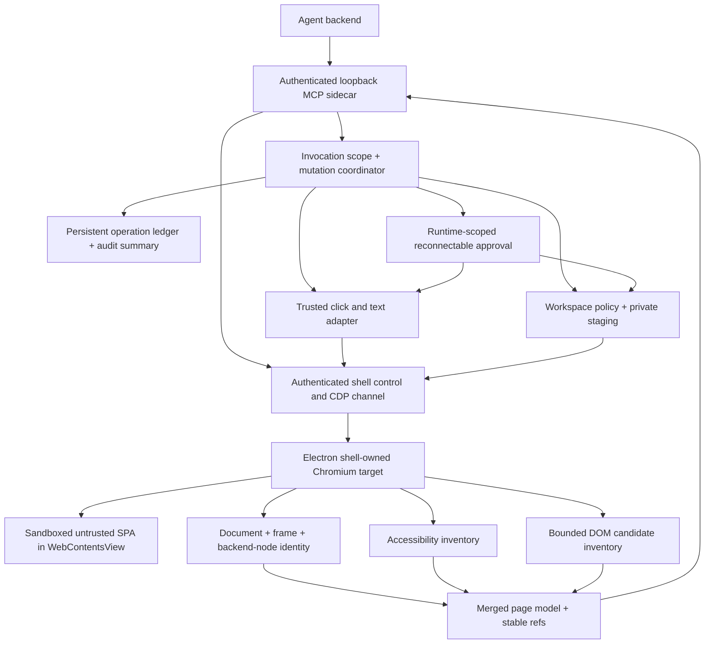
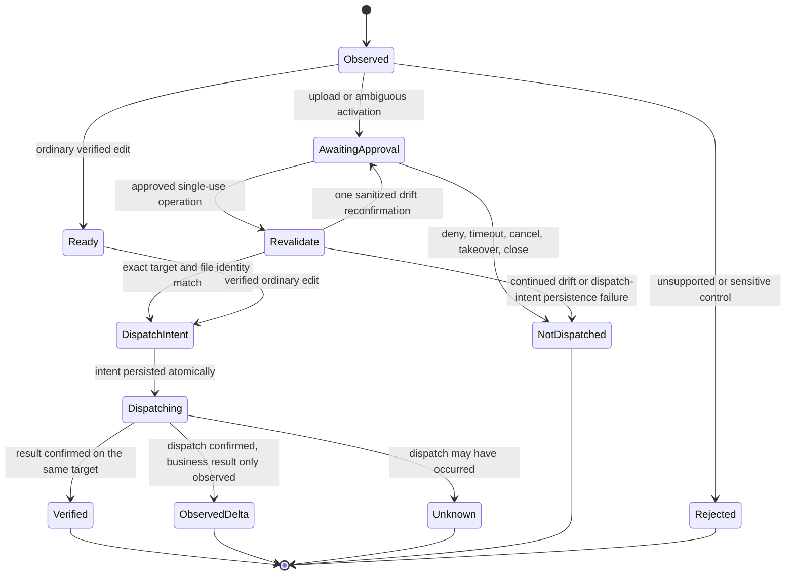
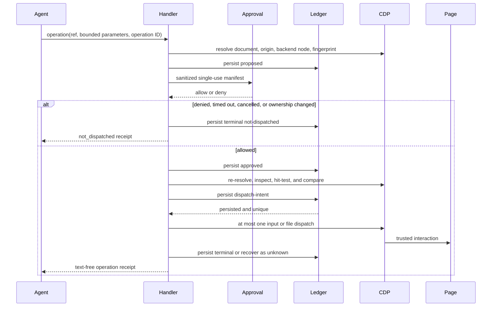
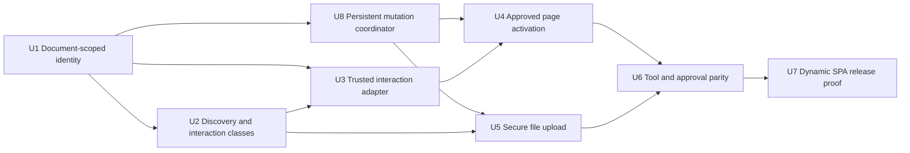

# Dynamic SPA Browser Actions - Plan

## Goal Capsule

- **Objective:** Let the embedded controlled browser discover, edit, upload to, and safely activate dynamic SPA publishing interfaces without site-specific selectors.
- **Product authority:** The Product Contract below reflects the scope confirmed in this task. Xiaohongshu long-form publishing is an acceptance sample, not an implementation dependency.
- **Execution profile:** Deep, security-sensitive feature work across CDP identity, page modeling, MCP tools, approval delivery, file egress, audit, and the Electron shell contract.
- **Stop conditions:** Stop rather than guess if implementation would require arbitrary page JavaScript, site-private APIs, authentication or CAPTCHA automation, filesystem access outside the workspace, or a way to dispatch an ambiguous activation without handler-level approval.
- **Tail ownership:** The implementation owns focused tests, real Chromium and Electron contract tests, approval UI parity, audit assertions, and removal of abandoned experimental paths.
- **Open blockers:** None.

---

## Product Contract

### Summary

Extend the embedded controlled browser so an agent can find visible SPA controls that are absent from the accessibility action inventory, enter long-form content into dynamic editors, upload approved workspace files, and activate a standalone publish control after explicit user approval. The implementation remains generic across sites and preserves the existing human handoff boundary for login, CAPTCHA, consent, and other human-only steps.

### Problem Frame

The current page model can read the visible text “写长文” but cannot produce an actionable reference for it because the action inventory accepts only a small set of accessibility widget roles. `findElements` searches the action and form inventories, not arbitrary visible content, so the agent cannot enter the long-form editor even though the user can see the entry.

After manual navigation, the title and body controls can appear in the page model, but every character-data or child-list mutation increments a document-wide epoch. Dynamic pages update counters, autosave state, and editor DOM continuously, so field references become stale before `act` can use them. Fields also use XPath while actions use `backendDOMNodeId`, which means simply weakening the epoch check could redirect an old reference to a replacement element at the same XPath.

The remaining path is incomplete even after text entry. Contenteditable editors are not first-class fields, `HTMLElement.click()` does not provide a real pointer path for event-sensitive SPAs, file input assignment is unsupported, and `submit` requires an HTML form. A standalone SPA publish button can therefore be neither safely submitted nor reliably distinguished from an ordinary click.

### Actors

- A1. **Comate user** — signs in or handles CAPTCHA when needed, reviews file-egress and activation manifests, and decides whether an externally visible action may proceed.
- A2. **Comate agent** — discovers controls, fills supported editors, proposes workspace files, requests activation, and reasons from receipts and fresh page state.
- A3. **Browser policy and CDP service** — mints document-scoped references, enforces action classes and approval, revalidates targets and files, dispatches one trusted interaction, and records positive-shape audit evidence.
- A4. **Remote web application** — supplies untrusted DOM and scripts and may mutate, navigate, autosave, upload, or publish in response to input.

### Key Decisions

- **Plan the complete authoring flow now.** (session-settled: user-directed — chosen over limiting the first phase to entry discovery and text input: the requested outcome includes approved file upload and publish.) Governs R1-R17.
- **Keep the implementation site-independent.** (session-settled: user-directed — chosen over Xiaohongshu-specific selectors and workflows: the browser capability must generalize to dynamic SPAs.) Governs R1-R17.
- **Require approval for every activation whose external side effects cannot be proven absent.** (session-settled: user-directed — chosen over label-based “publish/submit” detection: generic DOM semantics cannot guarantee that a benign-looking click has no external write.) Governs R9-R14, R17.

### Requirements

**Discovery and element identity**

- R1. The page model must expose visible, text-bearing controls with generic click evidence even when the accessibility tree does not assign a supported widget role.
- R2. DOM-derived candidates must be bounded, deduplicated, inspectable, and labeled with their provenance without exposing raw HTML, arbitrary selectors, or an arbitrary script surface.
- R3. Every actionable field, editable surface, file input, form, and action must use a document-scoped backend-node identity plus a bounded semantic fingerprint.
- R4. A reference from the latest page model must survive unrelated same-document DOM churn but fail after navigation, document replacement, target replacement, debugger detachment, or fingerprint mismatch.

**Reliable editing**

- R5. The browser must support replace-style fill for text inputs, textareas, and bounded editable roots, including Chinese text, newlines, emoji, and long-form content.
- R6. Text interaction must focus and operate on the approved backend node through a trusted CDP input adapter, with an explicit compatibility fallback for unsupported experimental commands.
- R7. Every mutation result must return a bounded receipt that distinguishes not dispatched, dispatched and verified, and dispatched with unknown outcome without echoing article text or sensitive field values.
- R8. Passwords, one-time codes, payment fields, CAPTCHA, OAuth or authorization consent, and equivalent human-gated controls must fail closed or request handoff.

**Activation and external writes**

- R9. The agent tool surface must distinguish ordinary editing, direct URL navigation, file egress, HTML submit, browser-owned local controls, and page-supplied activation with unprovable side effects.
- R10. An unprovable activation must require a handler-level approval even in auto mode or when workspace tool rules bypass `canUseTool`.
- R11. Approval must bind the operation ID, runtime generation, origin, document and frame identity, backend node, semantic fingerprint, action class, and a sanitized parameter summary.
- R12. After approval, A3 must revalidate control ownership, origin, document, target identity, visibility, enabled state, occlusion, and hit-test result before at most one dispatch.
- R13. Denial, timeout, cancellation, runtime replacement, browser close, user takeover, target drift, or dispatch-intent persistence failure must cause no dispatch; a persisted pre-dispatch intent with no terminal result must recover as unknown and must never trigger automatic retry.
- R14. A generic activation result may report dispatch and observed page delta, but it must not claim business success such as “published” without independent evidence.
- R17. Every browser mutation, including navigation, fill, select, check, submit, upload, activation, close, and control-owner change, must share one request-scoped invocation identity, per-session serialization boundary, persistent operation ledger, and bounded receipt contract.

**Workspace file upload**

- R15. Upload must accept only page-model file-input refs and workspace-relative regular media allowed by a product-owned type policy, enforce count and size bounds, and remain available only to the attested shell-owned Electron view.
- R16. File approval and audit must show only origin, visible control context, relative file names, counts, media types, and sizes; no bytes or absolute paths may enter model context, approval events, logs, or durable audit rows.

### Key Flows

- F1. **Discover and enter a long-form editor**
  - **Trigger:** A2 observes a logged-in creator page where a visible entry lacks a supported accessibility action role.
  - **Actors:** A2, A3, A4
  - **Steps:** A3 merges AX actions with bounded DOM candidates, A2 finds the named entry, A3 revalidates and activates it after the applicable approval, then A2 fills the title and body through document-scoped refs.
  - **Outcome:** The current page model verifies the intended title and body state without returning the article body in the receipt.
  - **Covered by:** R1-R14, R17
- F2. **Upload workspace media**
  - **Trigger:** A2 selects a file-input ref and one or more workspace-relative files.
  - **Actors:** A1, A2, A3, A4
  - **Steps:** A3 validates the target and safe file metadata, A1 reviews the sanitized manifest, A3 securely opens and verifies the approved sources, stages approved bytes in private app-owned storage, repeats every target and capability check, and CDP sets the staged files once.
  - **Outcome:** The page receives the approved files or a typed no-dispatch or unknown result; no unapproved path or bytes leave the workspace boundary.
  - **Covered by:** R9, R11-R17
- F3. **Confirm and activate SPA publish**
  - **Trigger:** A2 selects a standalone action that may publish or otherwise mutate the remote application.
  - **Actors:** A1, A2, A3, A4
  - **Steps:** A3 records the proposed operation, A1 approves the exact activation, A3 revalidates the bound operation, persists a pre-dispatch intent, and performs one physical pointer dispatch.
  - **Outcome:** The result reports the dispatch receipt and observed page delta; A2 performs a fresh observation before stating the business outcome.
  - **Covered by:** R9-R14, R17
- F4. **Recover without duplicate side effects**
  - **Trigger:** Approval delivery reconnects, the page changes, the CDP call times out, or the same MCP operation is replayed.
  - **Actors:** A1, A2, A3
  - **Steps:** A3 replays runtime-scoped pending approval state without minting new authority, serializes browser mutations, returns a persisted terminal receipt for a repeated operation, and recovers any crash-era pre-dispatch intent without a terminal as unknown.
  - **Outcome:** No operation is silently retargeted or automatically dispatched twice.
  - **Covered by:** R7, R10-R14, R17

### Acceptance Examples

- AE1. **Covers R1-R4.** Given a page whose visible “写长文” text is inside a pointer-enabled `div` with no AX widget role, when A2 calls `findElements`, then the result includes one actionable DOM-derived ref with bounded context and no site-specific selector.
- AE2. **Covers R3-R7.** Given title and body refs from the latest model and continuous counter or autosave mutations, when A2 fills a Chinese multi-line article with emoji, then both refs remain valid, the fields receive the requested replacement text, and the receipt verifies the normalized result without echoing the text.
- AE3. **Covers R3-R4.** Given a ref whose target is replaced by an identical-looking node at the same DOM position, when A2 acts on the old ref, then A3 returns a stale-target result and does not operate on the replacement.
- AE4. **Covers R9-R14, R17.** Given auto approval mode and any page-supplied click, including an anchor whose handler performs a write, when A2 requests activation, then a handler-level manifest still appears; denial or timeout produces no pointer dispatch.
- AE5. **Covers R10-R14.** Given an approved activation whose origin, document, node, visibility, or hit-test changes before dispatch, when A3 revalidates it, then the old approval is consumed, at most one updated manifest may be requested, and continued drift aborts.
- AE6. **Covers R15-R17.** Given a hidden file input associated with a visible upload control and a workspace image allowed by the product media policy, when A1 approves the sanitized manifest, then the staged file is assigned once to the attested Electron view; source-code, dotfile, disguised media, outside-workspace path, symlink escape, replaced file, unassociated hidden input, or any external CDP target fails before egress.
- AE7. **Covers R7, R12-R14, R17.** Given a pointer press that may have reached the page before CDP times out, when A3 cannot prove the terminal state, then it persists and returns `outcome_unknown` with automatic retry prohibited and records a correlated audit summary.
- AE8. **Covers R8.** Given a password, OTP, CAPTCHA, or authorization-consent control, when A2 attempts the new edit or activation path, then A3 refuses automation and directs A2 to request human handoff.

### Success Criteria

- The deterministic dynamic-SPA fixture completes discovery, title/body editing, approved upload, and approved activation through the registered MCP tools.
- The real Chromium and packaged Electron contract suites prove physical clicks, text insertion, file input assignment, lifecycle invalidation, single-process at-most-one dispatch, and crash recovery to a stable unknown state.
- No automated test fixture or production implementation contains a Xiaohongshu domain, selector, private endpoint, or text-specific code path.
- Security tests prove that approval and persistent operation state are enforced in auto mode, through MCP replay and process recovery, after reconnect, and when workspace rules allow the browser tool prefix.

### Scope Boundaries

**In scope**

- AX plus bounded DOM action discovery, document-scoped refs, input and contenteditable editing, secure media upload to the shell-owned view, confirmed page-supplied activation, persistent operation receipts, approval UI, audit, and end-to-end CDP verification.
- Xiaohongshu long-form publishing as a manual release acceptance sample after the generic fixture passes.

**Outside this plan**

- CAPTCHA, password, OTP, payment, OAuth consent, terms acceptance, OS file choosers, browser permission dialogs, and other intentionally human-gated interactions.
- Arbitrary JavaScript, caller-supplied CSS or XPath mutation selectors, raw DOM export, private API reverse engineering, site-specific adapters, or unattended externally visible commits.
- Canvas or spatial editors, opaque cross-origin iframe editors, drag-and-drop upload, directory upload, non-media workspace files, popups or new-target automation, downloads, and all external-CDP file upload.

### Deferred to Follow-Up Work

- Rich-text formatting parity beyond safe whole-field text replacement.
- Resumable or large multi-file upload, drag-and-drop data transfer, and media progress orchestration.
- Site-specific business-success detectors; the generic tool remains evidence-based and does not claim that a publish operation succeeded.

---

## Planning Contract

### Product Contract Preservation

The Product Contract was created from the user-confirmed scope in this planning task. No upstream requirements document was modified.

### Key Technical Decisions

- KTD1. **Replace global mutation epochs with CDP document identity.** Bind refs to the browser target/session, main frame, loader or document generation, backend node, and semantic fingerprint. Invalidate on cross-document navigation, `DOM.documentUpdated`, frame or target detach, debugger close, unresolved node, or fingerprint mismatch. Keep same-document character and child mutations out of the hard invalidation rule.
- KTD2. **Use AX as the semantic spine and bounded DOM candidates as the missing-action fallback.** Scan only visible text-bearing candidates with native activation or generic click evidence, promote the nearest useful interactive ancestor, and merge by backend node with AX role and name taking precedence. The page model also assigns a fail-closed interaction class; stale classification may over-confirm but can never lower risk. Keep scan, name, context, and returned-inventory limits explicit.
- KTD3. **Map mutable DOM candidates to backend identity inside the trusted CDP layer.** The extractor selects bounded candidates and returns temporary object handles. The CDP adapter resolves each handle to `backendDOMNodeId`, captures the fingerprint within one document generation, releases the object, and returns only positive-shape model data. If the document changes during the batch, rebuild once rather than mix identities. XPath may remain diagnostic metadata but never identifies a dispatch target.
- KTD4. **Use a trusted interaction adapter with verification.** For click, scroll, obtain fresh geometry, hit-test, and dispatch one mouse press and release through CDP. For fill, focus the backend node, select or clear its current content, insert text through a capability-checked CDP path, use the current native setter only as a compatibility fallback, and verify the same node afterward. Accessibility IDs and `Input.insertText` remain experimental helpers, not durable contracts.
- KTD5. **Classify every page-supplied click as ambiguous activation.** (session-settled: user-directed — chosen over label-based “publish/submit” detection: only a conservative handler gate can make unconfirmed generic SPA publishing impossible.) `act(click)` must not bypass the activation handler. Only a caller-supplied `open(http(s) URL)` uses the existing navigation policy; page-controlled anchors, roles, names, `href` values, and “local” labels can never lower risk. File egress and HTML submit keep specialized manifests but use the same mutation lifecycle.
- KTD6. **Use a persistent mutation coordinator and request-scoped authority.** Every mutation receives an immutable invocation scope from the current MCP request, including workspace, session, runtime generation, capability identity, abort signal, and caller-stable operation ID. A principal-scoped unique operation ledger records proposed, approved, dispatch-intent, and terminal states and rejects the same ID with a different parameter digest. A per-session mutex covers all browser mutations, while read-only observation may continue. Approval is runtime-scoped and reconnectable, not process-durable; runtime rotation cancels pre-dispatch work.
- KTD7. **Guarantee at-most-one dispatch with a stable crash outcome, not remote exactly-once.** The coordinator atomically persists dispatch-intent after final revalidation and before physical dispatch. Within one process it permits at most one dispatch. On startup, any dispatch-intent without a terminal receipt becomes `dispatched_unknown` and is never dispatched again. The existing append-only browser audit receives a correlated positive-shape summary for human review but is not the idempotency authority.
- KTD8. **Close file-path TOCTOU with an explicit safe-open gate and process-owned staging.** Before approval, validate only bounded metadata through a descriptor-rooted, component-by-component no-follow path walk; if the platform cannot prove this contract, upload remains unavailable there. After approval, safely reopen and compare identity, digest the bytes, and copy them into a private per-operation staging directory. A process-level staging service retains assigned files until the input is cleared or replaced, the related activation terminates, document or session teardown occurs, or a hard TTL expires; startup removes orphaned staging from invalid capabilities.
- KTD9. **Limit v1 upload to the attested shell-owned view.** Only the Electron shell target created through the authenticated control channel and bound to the current session exposes local file paths. Every external CDP target, including loopback, fails before staging or approval. A future external-local capability requires a separate ownership and shared-filesystem handshake.
- KTD10. **Separate mutation receipts from page observation.** `BrowserOperationReceipt` carries dispatch state, verification, retry safety, lengths or private digests, and a text-free bounded delta. `PageModel` is returned only by explicit observation tools. A timeout after possible dispatch is unknown and never auto-retried, and a mutation result never claims business success.
- KTD11. **Preserve the remote-content trust boundary.** Raw CDP, filesystem access, staging, approval, and audit stay in the trusted server or Electron main-process side. Remote `WebContentsView` content keeps Node integration disabled, context isolation and sandbox enabled, `webSecurity` enabled, permissions denied by default, window creation limited, and IPC senders validated.

### High-Level Technical Design

The diagrams define component and protocol boundaries. Exact helper names remain implementation-time details.

### Assumptions

- Ordinary text input remains unconfirmed as selected, even though an SPA may autosave on the `input` event. Sensitive-field detection and the human-handoff boundary prevent the new adapter from broadening credential or consent automation.
- A product-owned media allowlist rejects dotfiles, source, configuration, archives, executables, wildcard-only page policies, and extension or magic-byte mismatches. The page's `accept` value may narrow this list but never widen it.
- Read-only page observation may run while an approval waits, but a second mutation cannot enter dispatch until the first operation reaches a terminal state.
- Business-success interpretation remains agent or user work after a fresh observation; the handler only reports protocol evidence.

### Sequencing

---

## Implementation Units

### U1. Document-scoped element identity and lifecycle

- **Goal:** Replace mutation-epoch dispatch identity with a CDP-owned document, frame, backend-node, and fingerprint contract for every mutable element.
- **Requirements:** R3-R4; AE3; KTD1, KTD3.
- **Dependencies:** None.
- **Files:** `src/server/services/browser-cdp.ts`, `src/server/services/browser-page-model.ts`, `src/server/services/browser-mcp.ts`, `src/server/services/__tests__/browser-cdp.test.ts`, `src/server/services/__tests__/browser-page-model.test.ts`, `src/server/services/__tests__/browser-mcp.test.ts`.
- **Approach:**
  1. Extend the CDP session with current main-frame document identity and lifecycle invalidation from supported Page, DOM, target, and connection events.
  2. Define the CDP-owned document identity value and lifecycle subscription so the page-model layer consumes identity without owning protocol events.
  3. Store target/session, frame, loader or document generation, backend node, kind, and a bounded semantic fingerprint in each ref entry.
  4. Replace exact epoch validation with same-document backend-node re-resolution and fingerprint validation. Keep the latest-model nonce rule so a later distillation still supersedes earlier inventories.
  5. Remove `window.__comateProbe` from security decisions. It may remain temporarily for non-authoritative cache hints only if that simplifies migration.
- **Patterns to follow:** Action ref reinspection in `BrowserToolContext.getElementDetails`; target/session teardown in `browser-cdp.ts`; current latest-batch tests in `browser-page-model.test.ts`.
- **Test scenarios:**
  - Covers AE3. Replace a field with an identical-looking node at the same XPath and verify the old ref is stale and the replacement is untouched.
  - Apply character-data, child-list, counter, and autosave mutations outside the target and verify the latest ref remains resolvable.
  - Move the same target within the same document and verify backend identity survives while the fingerprint remains valid.
  - Cover main-frame `Page.frameNavigated` with a new loader, `DOM.documentUpdated`, execution-context destruction, target detach, and connection close; each invalidates the ref.
  - Navigate through hash and history state within the same document and verify refs remain valid while the current URL and risk context update.
  - Return a backend node with a changed tag, type, role, editable state, or file-input contract and verify dispatch fails closed.
  - Distill a new model without changing the document and verify refs from the previous model remain rejected by the latest-batch contract.
- **Verification:** Every mutable ref is backend-node backed; no action authorization depends on global mutation count or re-querying an old XPath.

### U2. Bounded DOM action discovery and editable-field modeling

- **Goal:** Make visible SPA entry controls and long-form editable roots discoverable without site selectors or raw DOM exposure.
- **Requirements:** R1-R5, R8, R15; AE1, AE2, AE6, AE8; KTD2, KTD3.
- **Dependencies:** U1.
- **Files:** `src/server/services/browser-cdp.ts`, `src/server/services/browser-page-model.ts`, `src/server/services/browser-mcp.ts`, `src/server/services/__tests__/browser-cdp.test.ts`, `src/server/services/__tests__/browser-page-model.test.ts`, `src/server/services/__tests__/browser-mcp.test.ts`.
- **Approach:**
  1. Add a bounded DOM candidate inventory that begins with visible text-bearing elements and promotes the nearest or smallest ancestor with native activation, explicit handler or keyboard evidence, interactive semantics, or pointer affordance.
  2. Reject hidden, disabled, inert, unnamed, body-copy-only, duplicate ancestor or descendant, and occluded candidates. Record `ax` or `dom` provenance and bounded nearby context.
  3. Resolve temporary candidate objects to backend nodes inside the CDP layer, release every object, and rebuild the bounded batch once if document identity changes during mapping.
  4. Merge DOM and AX actions by backend node. Preserve AX role and name when both sources identify the target.
  5. Assign one fail-closed interaction class to every modeled control: edit, direct navigation, ambiguous page activation, HTML submit, file egress, browser-owned local control, or human-only. A stale registry may only over-confirm.
  6. Model outermost editable roots from contenteditable and textbox semantics, exclude nested false or duplicate editable regions, and normalize them as fillable textboxes.
  7. Model file inputs separately from textboxes. Expose a hidden file input only when a visible associated label or upload control provides user-observable context; retain `multiple` and `accept` constraints.
  8. Extend `findElements` and page-state pagination to search the merged inventory and disclose total, returned, and truncated counts.
- **Patterns to follow:** Existing bounded action, outline, form, field, and page-state inventories in `browser-page-model.ts`; safe regex and result limits in `findElementsInModel`.
- **Test scenarios:**
  - Covers AE1. Find “写长文” inside a pointer-enabled generic container with no AX widget role and return one DOM-derived ref.
  - Verify a matching AX action wins over the DOM fallback and is not duplicated.
  - Reject ordinary paragraph text, hidden or inert containers, zero-size targets, occluded targets, and pointer-styled ancestors with no usable name.
  - Bound candidate scanning and returned inventory on a page with thousands of clickable-looking nodes.
  - Covers AE2. Return one outer editable root for nested contenteditable markup and preserve textarea and textbox fields.
  - Covers AE6. Return an associated hidden file input with `multiple` and `accept`; reject an unassociated hidden input and directory upload semantics.
  - Covers AE8. Mark password, OTP, payment, CAPTCHA, and authorization-consent controls as handoff-only rather than editable or activatable.
  - Classify anchors with `href`, page buttons, and pointer containers as ambiguous page activation; verify page-controlled role, name, and URL cannot downgrade them to direct navigation.
  - Change the document generation during candidate-to-backend mapping and verify the batch is rebuilt rather than returning mixed-document refs.
- **Verification:** `getPageState` and `findElements` can find the generic fixture entry and editor fields without raw selectors, HTML, screenshots, or site-specific code.

### U3. Trusted click and verified text interaction adapter

- **Goal:** Replace JavaScript click and XPath fill as the primary dispatch path with backend-node CDP input plus bounded outcome receipts.
- **Requirements:** R5-R8, R12-R14; AE2, AE7, AE8; KTD4, KTD10.
- **Dependencies:** U1, U2.
- **Files:** `src/server/services/browser-cdp.ts`, `src/server/services/browser-mcp.ts`, `src/server/services/__tests__/browser-cdp.test.ts`, `src/server/services/__tests__/browser-mcp.test.ts`, `scripts/test-shell-cdp.ts`.
- **Approach:**
  1. Add a trusted click pipeline: resolve node, scroll into view, read fresh viewport geometry, hit-test the interior point, require target or an allowed descendant, and dispatch one press and release pair.
  2. Treat an occluding overlay, disabled state, lost frame, press or release failure, navigation race, and target detach as typed outcomes. Never synthesize a second click automatically.
  3. Add replace-style text input: resolve and focus the backend node, select its current content, insert bounded text with the Electron-supported CDP capability, and retain a framework-compatible native setter fallback only when the primary path is unsupported.
  4. Verify normalized resulting text or value on the same backend node. Return length, digest or exact-match booleans, dispatch state, and retry safety without returning the supplied text.
  5. Keep select and check on the same backend-node and post-action verification contract.
- **Patterns to follow:** CDP object resolution and release in `clickBackendNode` and `inspectBackendNode`; sensitive-safe field summaries and `diffPageModels` in `browser-mcp.ts`.
- **Execution note:** Start with a failing real-Chromium fixture for trusted click, Chinese contenteditable input, and post-dispatch ambiguity before replacing the existing compatibility path.
- **Test scenarios:**
  - Covers AE2. Replace existing textarea and contenteditable text with Chinese paragraphs, newlines, emoji, and long content; verify normalized equality and no body echo.
  - Verify input, beforeinput, change, and framework-observed state on the real Chromium fixture where applicable.
  - Simulate unsupported `Input.insertText` and verify the bounded fallback still updates controlled input and textarea state.
  - Occlude the target after discovery and verify hit-test failure causes no mouse event.
  - Verify one click produces exactly one press and release and a trusted event in the packaged Electron fixture.
  - Covers AE7. Fail or time out after a possible press or input dispatch and return unknown with retry prohibited.
  - Remove or replace the target during focus or geometry lookup and verify no retargeting occurs.
  - Covers AE8. Attempt fill on a sensitive or human-only field and verify the adapter is never called.
- **Verification:** Real browser tests prove behavior rather than only CDP command success, including trusted event delivery and long-form editor acceptance.

### U8. Persistent mutation coordinator and invocation authority

- **Goal:** Create one request-scoped, persistent, and serialized lifecycle for every browser mutation before activation and upload add new side-effect paths.
- **Requirements:** R7, R11-R14, R17; AE4, AE5, AE7; KTD6, KTD7, KTD10.
- **Dependencies:** U1.
- **Files:** `src/server/services/browser-mutation-coordinator.ts`, `src/server/services/browser-audit.ts`, `src/server/services/browser-mcp.ts`, `src/server/services/browser-mcp-http.ts`, `src/server/services/session-runtime.ts`, `src/server/services/session-capability-service.ts`, `src/server/services/browser-control.ts`, `src/server/storage/sqlite-store.ts`, `src/server/services/__tests__/browser-mutation-coordinator.test.ts`, `src/server/services/__tests__/browser-mcp.test.ts`, `src/server/services/browser-mcp-http.test.ts`, `src/server/services/session-runtime.test.ts`, `src/server/services/session-capability-service.test.ts`, `src/server/storage/sqlite-store.test.ts`.
- **Approach:**
  1. Pass an immutable invocation scope from each authorized MCP request into every mutation handler. Do not cache workspace, runtime generation, capability identity, abort signal, or operation ID inside the session-reused `BrowserToolContext`.
  2. Require a bounded caller-stable operation ID for mutation tools and bind it to the principal and a private parameter digest. Generate approval request IDs server-side and reject collisions.
  3. Add a positive-shape operation ledger with a unique principal-scoped key and proposed, approved, dispatch-intent, and terminal states. Store no article text, page content, file path, filename, or raw parameters; the private parameter digest required for replay binding may exist only in this ledger.
  4. Serialize `open`, fill, select, check, submit, activation, upload, close, and control-owner changes per browser session. Observation remains available while a mutation waits.
  5. Revalidate that the invocation's runtime generation and task capability are still current after approval. Runtime rotation or user takeover cancels work before dispatch; a persisted dispatch-intent can only become terminal or unknown.
  6. On startup, terminalize orphaned proposed or approved rows as `not_dispatched` with a runtime-replaced reason, and recover dispatch-intent rows as unknown without executing them. Return the same persisted receipt for a repeated ID and same digest; reject a changed digest.
  7. Keep the append-only browser audit as a correlated human-readable summary. The operation ledger, not the audit table or pending-approval map, owns idempotency.
- **Patterns to follow:** Current request-scoped runtime generation passing in `authenticatedRequest`; pending-approval reconnect replay in `session-runtime`; strict broker intent and terminal ordering in `browser-authenticated-request.ts`; positive-shape SQLite storage conventions.
- **Test scenarios:**
  - Reuse a long-lived `BrowserToolContext` across runtime generations and verify each mutation uses the current invocation scope, not constructor-cached authority.
  - Start an operation with an old task token, rebuild the runtime while approval waits, then allow; verify cancellation, mutex release, and zero dispatch.
  - Replay the same operation ID and digest before and after terminal and verify one logical operation and one persisted receipt.
  - Reuse an operation ID with a different digest under the same principal and verify a hard conflict; verify another principal may use the same caller-stable ID independently.
  - Crash or restart after dispatch-intent but before terminal and verify recovery to stable unknown with retry prohibited.
  - Submit two stateless MCP mutations concurrently and verify deterministic serialization; observe the page concurrently and verify read-only access remains available.
  - Change control ownership while approval waits and verify immediate cancellation rather than queued execution after handback.
  - Verify duplicate pending approval IDs cannot overwrite an existing request.
  - Inject ledger-intent persistence failure and verify no dispatch; inject terminal persistence failure and verify unknown rather than success.
  - Assert the operation ledger contains no text, page-provided labels, URL query, path, filename, or raw exception beyond its private replay-binding digest; assert browser audit rows contain none of those values or any digest.
- **Verification:** Every mutation surface shares request-fresh authority, persistent at-most-one dispatch state, one session mutex, and a text-free receipt before any new external-write handler ships.

### U4. Single-use approved page activation

- **Goal:** Add a generic handler-level activation path for every page-supplied click without duplicating replay, approval, ledger, or receipt policy.
- **Requirements:** R7, R9-R14, R17; AE4, AE5, AE7; KTD5-KTD7, KTD10.
- **Dependencies:** U2, U3, U8.
- **Files:** `src/server/services/browser-mcp.ts`, `src/server/services/browser-page-model.ts`, `src/server/services/browser-gate-state.ts`, `src/server/services/browser-tool-names.ts`, `src/server/services/session-runtime.ts`, `src/server/services/__tests__/browser-mcp.test.ts`, `src/server/services/__tests__/browser-page-model.test.ts`, `src/server/services/__tests__/browser-permission-gate.test.ts`, `src/server/services/session-runtime.test.ts`, `src/server/services/__tests__/browser-control.test.ts`.
- **Approach:**
  1. Route every page-supplied click, including anchors and controls with `href`, away from ordinary `act` and into the dedicated activation handler. Only explicit `open` calls use direct-navigation policy.
  2. Require handler-level approval with a sanitized origin, role, name, nearby context, and reconfirmation differences. Keep the `canUseTool` classifier as UI entry and defense in depth, not authority.
  3. Snapshot target identity plus non-sensitive editor counts, lengths, and private digests. Label all page-provided text as untrusted, strip control and bidirectional characters, and use an app-generated warning and parsed origin.
  4. Revalidate control ownership, current runtime capability, target, origin, editor summary, visibility, enabled state, occlusion, and hit-test after approval. Allow one updated approval for safe summarized drift, then abort.
  5. Delegate serialization, operation state, dispatch-intent, one trusted click, terminal receipt, and crash recovery to U8.
- **Patterns to follow:** Handler-level submit approval and one-reconfirmation loop in `handleSubmit`; pending-approval replay in `session-runtime`; strict intent and terminal handling in `browser-authenticated-request.ts`.
- **Test scenarios:**
  - Covers AE4. Auto mode and a broad workspace allow rule still produce the handler manifest for a generic SPA action, anchor with a POST handler, safe-looking `href`, and “next” label.
  - Verify ordinary `act(click)` returns guidance and cannot dispatch an ambiguous activation through the old path.
  - Deny, timeout, abort, browser close, runtime replacement, debugger detach, and user takeover while approval waits; each records no dispatch.
  - Covers AE5. Change origin, document, target, fingerprint, enabled state, geometry, or occlusion after approval; one reconfirm is allowed and continued drift aborts.
  - Edit, navigate, submit, or request handoff while activation approval waits and verify U8 cancels or forces a fresh manifest rather than dispatching stale page state.
  - Covers AE7. Destroy the execution context or time out after pointer dispatch may have started and verify the operation ledger returns the same unknown receipt without retry.
  - Reconnect the approval stream and verify one pending manifest is replayed and one decision resumes the original operation.
  - Render page-provided HTML, Markdown, newlines, bidirectional controls, zero-width text, and fake system language; verify the approval chrome remains app-owned and unspoofed.
- **Verification:** No registered browser tool or SDK approval mode can execute a page-supplied click without handler approval, U8 operation authority, and fresh target proof.

### U5. Workspace-contained approved file upload

- **Goal:** Add a dedicated local file-egress tool that closes workspace, symlink, approval, target, and pathname races before `DOM.setFileInputFiles`.
- **Requirements:** R11-R17; AE5-AE7; KTD6-KTD10.
- **Dependencies:** U1, U2, U8.
- **Files:** `src/server/services/browser-upload-policy.ts`, `src/server/services/browser-upload-staging.ts`, `src/server/services/browser-cdp.ts`, `src/server/services/browser-target.ts`, `src/server/services/browser-service.ts`, `src/server/services/browser-mcp.ts`, `src/server/services/browser-mcp-http.ts`, `src/server/services/chat-service.ts`, `src/server/index.ts`, `src/server/services/__tests__/browser-upload-policy.test.ts`, `src/server/services/__tests__/browser-upload-staging.test.ts`, `src/server/services/__tests__/browser-cdp.test.ts`, `src/server/services/__tests__/browser-target.test.ts`, `src/server/services/__tests__/browser-service.test.ts`, `src/server/services/__tests__/browser-mcp.test.ts`, `src/server/services/browser-mcp-http.test.ts`.
- **Approach:**
  1. Thread the canonical workspace folder and shell-attested target identity through the HTTP MCP invocation scope. Reject every external target before file inspection or approval.
  2. Prove a descriptor-rooted, component-by-component no-follow open path for each supported platform before enabling upload. Reject symlinks, reparse points, hard-linked files, special files, directories, and any platform where this contract is unavailable.
  3. Accept only a file-input ref and bounded workspace-relative paths. Apply the product media allowlist through extension, magic bytes, file count, individual and total size, and dotfile rules; page `accept` may only narrow it.
  4. Before approval, read only safe metadata needed for an app-generated egress warning. After approval, securely open the same source identities, compute a private digest, and copy bytes into exclusive per-operation staging under process-owned private storage.
  5. Repeat control, invocation, shell target, origin, document, node, input contract, source identity, and staging identity checks, then delegate dispatch-intent and one `DOM.setFileInputFiles` call to U8.
  6. Verify `input.files` and page-observed input or change behavior, while treating assignment as the egress boundary. Do not assume the remote application has finished reading or uploading.
  7. Retain assigned staging until input replacement or clearing, related activation terminal, document or session teardown, or a hard TTL. Enforce per-operation, per-session, and global quotas; clean invalid-capability orphans during startup and every owned teardown path.
- **Patterns to follow:** Realpath containment in `wecom-send-file-policy.ts`; submit handler hard gate; browser-service teardown ownership; positive-shape browser audit.
- **Test scenarios:**
  - Covers AE6. Upload one accepted workspace image through an associated hidden input and verify one file assignment and sanitized receipt.
  - Upload multiple files to a single-file input, a rejected media type, a directory, device or socket, oversized files, empty lists, and excessive counts; each fails before approval or egress.
  - Reject `.env`, source, configuration, archive, executable, dotfile, extension or magic-byte mismatch, polyglot, empty `accept`, and wildcard-only `accept` attempts that fall outside the product media policy.
  - Reject absolute paths, `..` escapes, final and parent symlink swaps, hard links, reparse points, multi-component races, loopback external CDP, remote external CDP, popup targets, and shell target replacement.
  - Replace or modify a source after approval and verify digest or identity mismatch consumes approval without assignment.
  - Change origin, document, target, `multiple`, `accept`, visibility association, or control ownership after approval and verify no assignment.
  - Deny, timeout, or abort before approval and verify no content copy occurred. Disconnect or teardown after staging and verify owned cleanup.
  - Assign a file, delay the remote read until later activation, and verify staging remains readable until the owning terminal or TTL.
  - Make CDP assignment or verification unknown and verify bounded retention, startup recovery, and no automatic reassignment.
  - Exhaust per-operation, per-session, and global staging quotas and verify fail-closed behavior without disk growth.
  - Assert that approval events, MCP results, diagnostic logs, and audit rows contain no absolute paths, article text, file bytes, digest, raw exception, or page-controlled fake warning.
- **Verification:** Only user-approved media bytes from safely opened workspace files can reach the attested shell view, and a process-owned staging service controls their complete lifetime.

### U6. Tool contracts, approval presentation, and backend parity

- **Goal:** Make discovery, editing, upload, and activation understandable and equally safe through both supported agent backends and the visible approval surface.
- **Requirements:** R1-R17; AE1, AE4-AE8; KTD5-KTD11.
- **Dependencies:** U4, U5.
- **Files:** `src/server/services/browser-mcp.ts`, `src/server/services/browser-tool-names.ts`, `src/server/services/browser-gate-state.ts`, `src/server/services/session-runtime.ts`, `src/client/components/ApprovalSurface.tsx`, `src/client/components/ApprovalSurface.test.tsx`, `src/client/components/tool-renderers/registry.ts`, `src/client/components/tool-renderers/registry.test.ts`, `src/client/components/tool-renderers/renderers/BrowserActivationRenderer.tsx`, `src/client/components/tool-renderers/renderers/browser-activation-payload.ts`, `src/client/components/tool-renderers/renderers/BrowserUploadRenderer.tsx`, `src/client/components/tool-renderers/renderers/browser-upload-payload.ts`, `src/client/components/tool-renderers/index.ts`, `src/server/services/__tests__/browser-permission-gate.test.ts`, `src/server/services/__tests__/browser-mcp.test.ts`, `src/server/services/browser-mcp-http.test.ts`.
- **Approach:**
  1. Register dedicated upload and approved-activation primitives with destructive and user-interaction annotations, bounded schemas, typed recovery guidance, and updated tool instructions.
  2. Publish the same action classification into the `canUseTool` layer for early UI entry, while preserving handler authority and avoiding duplicate generic approval cards.
  3. Extend the renderer registry with an app-owned security-manifest presentation flag, migrate browser submit to it, and register activation and upload manifests through the same non-collapsible rule. Show parsed origin, action class, clearly labeled untrusted page context, relative file metadata, drift summary, and operation correlation only.
  4. Keep bot-session denial, readonly classification, Claude and OpenCode HTTP MCP registration, stateless request authorization, cancellation, and teardown parity.
  5. Return checkpoint-style receipts that tell A2 whether it may safely observe, edit again, request fresh approval, or must ask the user before retrying.
- **Patterns to follow:** `BrowserSubmitRenderer`, `ApprovalSurface` submit manifest, `BROWSER_TOOL_NAMES`, `BROWSER_MCP_INSTRUCTIONS`, and backend parity tests in `browser-mcp-http.test.ts` and `browser-permission-gate.test.ts`.
- **Test scenarios:**
  - Verify the registered tool names, schemas, annotations, descriptions, and stated tool count through the MCP server surface.
  - Verify Claude and OpenCode sessions receive equivalent upload and activation tools, while bot sessions and invalid task capabilities do not.
  - Render initial and reconfirmation activation manifests with no hidden security fields behind “Show more.”
  - Render single and multiple file manifests with relative names, media types, sizes, and totals but no absolute path or content.
  - Verify submit, activation, and upload security manifests remain visible through the renderer registry without browser-specific branching in `ApprovalSurface`.
  - Verify handler approval fires exactly once even when `canUseTool` is bypassed and that the normal path does not produce duplicate cards.
  - Reconnect after approval creation and verify the pending manifest reappears; resolving it continues only the bound operation.
  - Verify readonly and auto modes never auto-approve upload or ambiguous activation.
- **Verification:** A user and either agent backend see one consistent, sanitized, non-bypassable approval and receive the same typed terminal receipt.

### U7. Dynamic SPA integration proof and release acceptance

- **Goal:** Prove the complete generic flow against real Chromium and Electron, then document supported and human-only boundaries.
- **Requirements:** R1-R17; F1-F4; AE1-AE8; KTD1-KTD11.
- **Dependencies:** U1-U6, U8.
- **Files:** `scripts/fixtures/dynamic-spa-browser-fixture.ts`, `scripts/test-shell-cdp.ts`, `scripts/test-electron-cdp.ts`, `electron/browser-view-manager.test.ts`, `electron/control-server.test.ts`, `src/server/services/__tests__/browser-mcp.test.ts`, `src/server/services/__tests__/browser-permission-gate.test.ts`, `src/client/components/ApprovalSurface.test.tsx`, `CONCEPTS.md`, relevant embedded-browser developer documentation.
- **Approach:**
  1. Add one shared generic dynamic-SPA fixture with an AX-missing text entry, unrelated continuous DOM churn, textarea title, contenteditable body, associated hidden file input, standalone publish-like action, occlusion controls, target replacement, and observable dispatch counters.
  2. Use the shell-CDP suite to drive the full MCP, coordinator, approval, upload, and recovery flow through the real CDP peer rather than direct handler shortcuts.
  3. Use the Electron suite only to pin required commands, trusted events, file-input behavior, shell target attestation, and view lifecycle to Electron 43.3.0. Do not duplicate the entire MCP flow.
  4. Add a manual Xiaohongshu acceptance checklist only after the generic fixture passes. The checklist may name visible user steps but must not add production selectors, private APIs, or a promise to bypass platform defenses.
  5. Document capability boundaries, approval behavior, unknown outcomes, upload limits, local-target requirement, and human-handoff recovery.
- **Patterns to follow:** Existing Part A and Part B release gates in `test-shell-cdp.ts`; Electron target lifecycle checks in `test-electron-cdp.ts`; embedded-browser plan and `CONCEPTS.md` vocabulary.
- **Test scenarios:**
  - Covers AE1-AE6. Complete the fixture flow from entry discovery through verified editing, approved upload, and approved activation.
  - Keep the fixture's autosave counter mutating through the whole flow and verify no unrelated stale-ref failure.
  - Replace the entry, editor, upload input, and activation target at each approval boundary and verify fail-closed behavior.
  - Cover reconnect, duplicated MCP requests, concurrent mutation, user takeover, browser teardown, and runtime replacement.
  - Cover long Chinese text, emoji, newlines, contenteditable normalization, hidden input association, and real file-input events.
  - Covers AE7. Inject command timeouts and navigation or context-destruction races and verify unknown results are stable under replay.
  - Covers AE8. Verify sensitive and human-only controls route to handoff.
  - Verify shell target attestation and Electron view invariants: sandbox and context isolation on, Node integration and preload absent, `webSecurity` on, permissions denied by default, new windows controlled, and IPC sender validation retained.
  - Scan production and automated fixture code for Xiaohongshu domains, selectors, and private endpoints; only the manual acceptance notes may name the site.
- **Verification:** The shipped Electron contract and generic fixture demonstrate the full authoring path; the manual site sample validates compatibility without becoming implementation logic.

---

## Verification Contract

### Focused Development Gates

| Gate | Applies to | Done signal |
|---|---|---|
| `npx tsx --test src/server/services/__tests__/browser-page-model.test.ts src/server/services/__tests__/browser-cdp.test.ts src/server/services/__tests__/browser-mutation-coordinator.test.ts src/server/services/__tests__/browser-mcp.test.ts src/server/services/__tests__/browser-permission-gate.test.ts src/server/services/__tests__/browser-upload-policy.test.ts src/server/services/__tests__/browser-upload-staging.test.ts` | U1-U6, U8 | Identity, discovery, interaction, operation persistence, approval, upload, replay, and audit scenarios pass. |
| `npm run typecheck` | U1-U8 | CDP, MCP, server, Electron, storage, and client contracts compile together. |
| `npm run test:client` | U6-U7 | Approval manifests and interaction states render safely. |
| `npm run test:shell-cdp:required` | U3, U5, U7, U8 | Real Chromium proves trusted click, text, lifecycle, upload, at-most-one dispatch, and stable unknown recovery. |
| `npm run test:electron-cdp:required` | U3, U5, U7 | Electron 43.3.0 proves the commands and events supported by the shipped Chromium peer. |

### Repository Gates

- `npm run lint`
- `npm run build`
- `npm run test:server`
- `npm run test:client`
- `npm run test:electron`
- `npm run test:shell-cdp:required`
- `npm run test:electron-cdp:required`

### Security and Privacy Gates

- Handler approval remains mandatory under auto mode, readonly mode, broad workspace allow rules, reconnect, and both agent backends.
- A principal-scoped operation row reaches dispatch-intent before external activation or file assignment. Persistence failure causes no dispatch. Startup terminalizes orphaned proposed or approved rows as not dispatched, converts every orphaned dispatch-intent to unknown, and never replays either class.
- Article text, sensitive field values, absolute paths, file bytes, digests, unsanitized, unbounded, or unlabeled page-provided text, URL queries, raw exceptions, and raw DOM are absent from approval events, MCP receipts, logs, audit rows, and snapshots; any permitted page text is rendered through an explicit untrusted-data presentation type.
- Workspace escape, symlink or reparse races, hard links, source replacement, target replacement, origin drift, runtime rotation, control takeover, operation-ID conflict, replay, and concurrent mutation fail closed.
- Upload stays disabled unless descriptor-rooted safe open is proven for the platform and the target is the attested shell-owned Electron view.
- Remote content retains Electron's sandbox, context isolation, no-Node, permission, navigation, new-window, IPC-sender, and `webSecurity` boundaries.

### Acceptance Verification

- **Discovery:** The AX-missing generic entry is found by visible name and bounded context.
- **Stability:** Continuous unrelated DOM churn does not stale the latest refs; any target or document replacement does.
- **Editing:** Chinese long-form title and body replacement is verified on textarea and contenteditable targets without content echo.
- **Upload:** Only approved product-allowed workspace media reach the attested shell view; denial and every validation failure produce no staging or assignment.
- **Activation:** Ambiguous activation always asks in the handler, revalidates after approval, dispatches at most once, and never claims unproven business success.
- **Recovery:** Reconnect, cancellation, takeover, teardown, replay, timeout, and unknown outcomes preserve the no-duplicate-write invariant.

---

## Definition of Done

### Global

- All requirements, flows, and acceptance examples are implemented through the registered MCP surface with Claude and OpenCode parity.
- The full repository and real CDP verification contract passes against the shipped Electron version.
- No arbitrary mutation selector, arbitrary JavaScript, site-private API, site-specific production selector, remote filesystem path, or unconfirmed external commit path has been introduced.
- Invocation authority, persistent operation state, approval, audit, replay, teardown, and unknown-outcome behavior is deterministic and covered by adversarial tests.

### Per Unit

- Each feature-bearing unit has focused success, boundary, denial, cancellation, drift, teardown, and integration coverage described in its test scenarios.
- Every new CDP method has a fake-session unit contract and a real Chromium or Electron capability test.
- Every high-impact handler proves that no alternative tool path bypasses its classification and approval boundary.
- Every tool result supplies enough typed recovery context for the agent to continue without guessing or repeating a possible external write.

### Cleanup and Tail Ownership

- Remove obsolete global-epoch authorization branches, XPath dispatch fallbacks that can retarget, unused experimental CDP paths, and abandoned fixture code.
- Clean staging according to its document, activation, teardown, and TTL ownership; release pending operations, mutex ownership, approval waiters, CDP objects, listeners, and timers on every terminal path. Retain ledger receipts only under the defined bounded retention policy.
- Update the embedded-browser documentation and glossary with the final action classes, receipt states, upload constraints, and human-only boundaries.
- Keep the existing HTML form submit tool working on the shared approval and identity contract; do not remove it in this plan.

---

## System-Wide Impact

- **Agent parity:** Discovery, editing, file egress, and activation become first-class MCP primitives for both supported backends. UI-only browser capabilities are no longer unreachable to the agent.
- **Trust boundary:** Remote web content remains untrusted. New filesystem and CDP privileges stay server-owned and never enter preload or remote renderer APIs.
- **Invocation lifecycle:** Authorization identity becomes request-scoped rather than cached with the session context. Runtime rotation, capability revocation, and control-owner changes cancel pre-dispatch work.
- **Operation lifecycle:** A persistent principal-scoped ledger and per-session mutation mutex cover every browser mutation. Pending approval remains runtime-scoped and reconnectable; it does not survive process restart as authority.
- **Audit posture:** The operation ledger owns at-most-one dispatch and crash recovery. Append-only browser audit rows remain correlated, positive-shape summaries for review rather than authorization state.
- **Browser lifecycle:** Document identity and target detach events become authoritative ref invalidation signals. Teardown must now also own operation ledgers and staging cleanup.
- **Performance:** AX and DOM discovery remain bounded. Accessibility IDs are not retained, and expensive file digest or staging work is limited by upload bounds.

## Risks and Mitigations

| Risk | Mitigation |
|---|---|
| DOM click affordance heuristics overproduce or miss controls. | Require usable text and activation evidence, choose the nearest useful ancestor, deduplicate by backend node, retain AX precedence, expose provenance, and keep bounded inventory tests. |
| `BackendNodeId` is treated as stable across documents. | Bind it to target, frame, loader or document generation and invalidate on official lifecycle events and failed re-resolution. |
| Experimental `Input.insertText` or Accessibility behavior changes with Chromium. | Keep stable DOM identity and mouse primitives as the core, add capability fallbacks, and gate release on real Electron 43.3.0 tests. |
| Conservative activation approval creates extra prompts. | Keep direct `open`, editing, select, check, and specialized upload or submit manifests distinct; treat every page-supplied click as ambiguous and avoid duplicate `canUseTool` cards. |
| Runtime rotation leaves stale authority in a reused browser context. | Pass immutable invocation scope per request, revalidate current capability after approval, and keep authorization out of `BrowserToolContext`. |
| An operation is replayed, races, or the process crashes after dispatch-intent. | Use a unique persistent operation key, serialize all mutations, recover orphaned intent as unknown, consume approval once, and prohibit automatic retry. |
| Descriptor-rooted safe open is not portable through the available Node runtime. | Make safe-open proof an enablement gate; add a narrowly audited platform helper or keep upload unavailable on unsupported platforms. |
| Approved file content changes before Chromium opens it. | Securely open after approval, compare identity, digest and stage bytes, revalidate the shell target, and pass only process-owned staged paths. |
| A hidden file input or prompt-injection page is used as an arbitrary egress sink. | Require a visible associated control, a product-owned media allowlist, magic-byte validation, shell attestation, explicit app-generated warning, and post-approval target validation. |
| Staging is deleted before Chromium or the site finishes reading it, or grows without bound. | Retain by input, activation, document and TTL ownership; enforce per-operation, session and global quotas; sweep invalid-capability orphans on startup. |
| A site interprets input as immediate autosave. | Preserve the user-selected low-friction input policy, refuse sensitive fields, bind input to origin and document, and document autosave as an inherent remote-page behavior. |
| A dispatch succeeds but the response is lost. | Persist dispatch-intent, return unknown with retry prohibited, preserve the operation receipt under replay, and require a fresh observation or user confirmation. |
| Page-provided text spoofs system approval language. | Generate title and warning in app chrome, label page text as untrusted, strip control and bidirectional characters, and render it as bounded plain text. |
| Operation-ledger storage is unavailable. | Fail closed before dispatch; surface health and keep any terminal-write failure as a recoverable unknown operation rather than an ordinary success. |

## Alternatives Considered

- **Add Xiaohongshu selectors and click scripts.** Rejected because the capability would be brittle, impossible to review as a generic security boundary, and likely to break on routine site changes.
- **Search all visible text and click the matching node.** Rejected because visible text alone is not activation evidence and would create ambiguous, unsafe refs.
- **Keep XPath fields and ignore epoch drift.** Rejected because a replacement at the same XPath could receive an action authorized for the old element.
- **Keep `HTMLElement.click()` and native value setters as the primary path.** Rejected because event-sensitive SPAs may require physical input semantics and because outcome verification is weaker.
- **Add only a dedicated publish tool with label heuristics.** Rejected by the confirmed safety posture because `act(click)` or a benign label could bypass it.
- **Use file metadata re-stat without staging.** Rejected because CDP reopens a pathname after policy validation, leaving a residual race between approval and host-path consumption.
- **Infer success from a toast, URL change, or button state.** Rejected because generic page evidence does not prove the remote application's business transaction succeeded.

## Documentation and Operational Notes

- Document the new action classes, approval manifests, receipt states, upload limits, local-CDP requirement, and human-handoff boundary in the embedded-browser developer guide.
- Add diagnostics for unsupported CDP commands and Electron-version contract failures without logging element text, input values, URL queries, or paths.
- The manual Xiaohongshu check should verify: discover the long-form entry, enter title and body, select approved workspace media, review approval cards, activate publish, and inspect the resulting page. It must stop for platform verification, CAPTCHA, login, consent, or any unexpected business-state ambiguity.
- Electron upgrades must rerun both required CDP suites because tip-of-tree CDP does not guarantee backward compatibility.

## Sources and Research

- `src/server/services/browser-page-model.ts` — current mutation epoch, form extractor, AX action roles, and bounded inventories.
- `src/server/services/browser-mcp.ts` — current model search, exact ref policy, XPath fill, JavaScript click routing, handler-level submit approval, and one-reconfirmation TOCTOU pattern.
- `src/server/services/browser-cdp.ts` — raw CDP abstraction and current backend-node object lifecycle.
- `src/server/services/browser-gate-state.ts` and `src/server/services/session-runtime.ts` — canUseTool defense-in-depth, navigation policy, durable pending approvals, and reconnect behavior.
- `src/server/services/browser-authenticated-request.ts` and `src/server/services/browser-audit.ts` — strict correlated broker audit precedent and positive-shape browser audit contract.
- `src/server/services/wecom-send-file-policy.ts` — existing workspace realpath containment precedent.
- `scripts/test-shell-cdp.ts` and `scripts/test-electron-cdp.ts` — real browser and production shell CDP release gates.
- `docs/plans/2026-07-18-001-feat-embedded-controlled-browser-plan.md` — original controlled-browser security boundaries and documented same-document mutation residual.
- `docs/solutions/integration-issues/sse-subscription-race-condition-2026-05-21.md` and `docs/solutions/integration-issues/sse-clean-close-retry-2026-05-22.md` — approval ownership and reconnect replay learnings.
- [Chrome DevTools Protocol DOM domain](https://chromedevtools.github.io/devtools-protocol/tot/DOM/) — backend-node identity, document invalidation, geometry, hit-testing, and file-input assignment.
- [Chrome DevTools Protocol Input domain](https://chromedevtools.github.io/devtools-protocol/tot/Input/) — mouse dispatch, key dispatch, and experimental text insertion.
- [Chrome DevTools Protocol Accessibility domain](https://chromedevtools.github.io/devtools-protocol/tot/Accessibility/) — AX tree APIs, backend-node mapping, experimental status, and AX-ID stability cost.
- [Chrome DevTools Protocol version policy](https://chromedevtools.github.io/devtools-protocol/) — tip-of-tree compatibility limitations.
- [Electron security checklist](https://www.electronjs.org/docs/latest/tutorial/security) — remote-content isolation, permission, navigation, window, IPC, and Node integration boundaries.
- [Node.js file system API](https://nodejs.org/api/fs.html) and [Node.js path API](https://nodejs.org/api/path.html) — file TOCTOU cautions, canonicalization, safe open, and platform path behavior.
