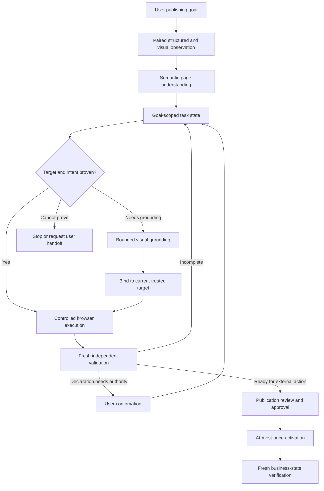
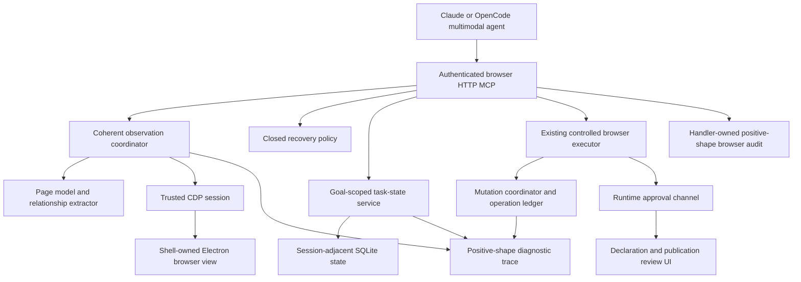
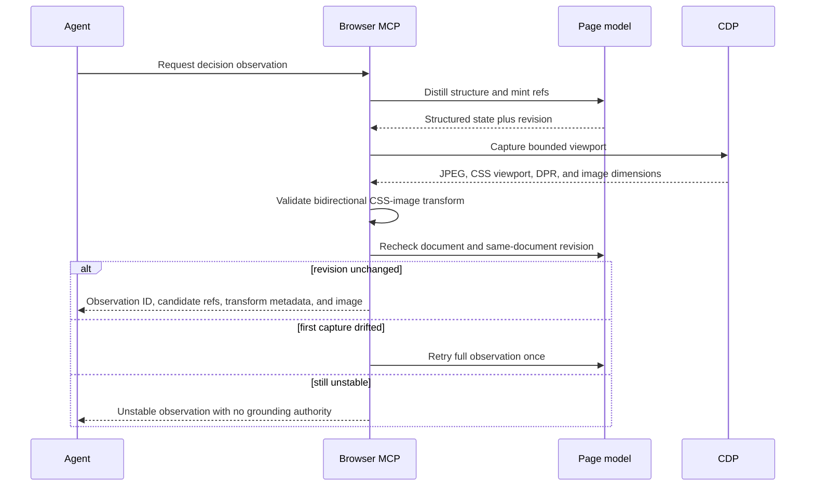
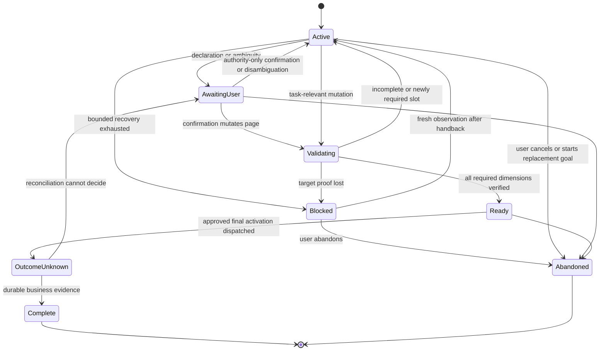
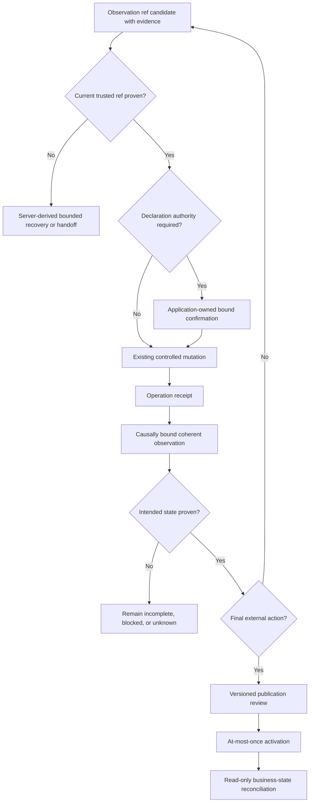
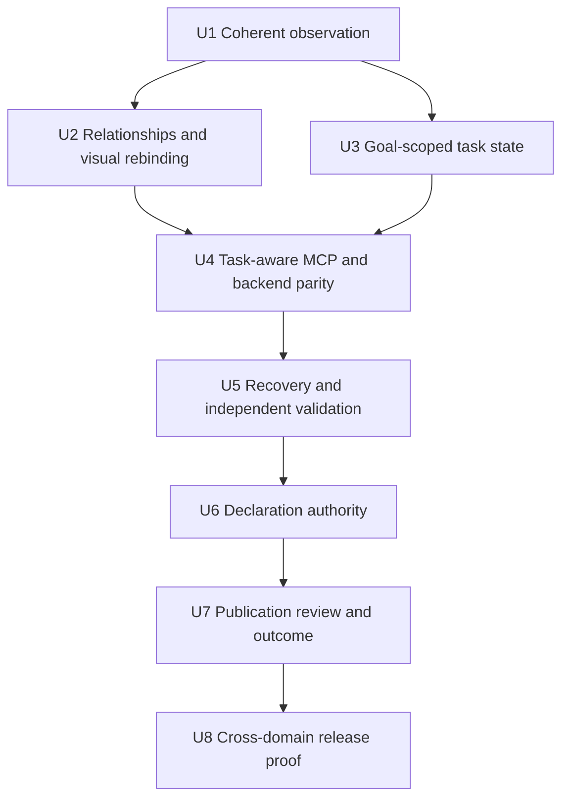

# Multimodal Browser Task Understanding - Plan

## Goal Capsule

- **Objective:** Let the embedded browser agent understand dynamic publishing pages, track the user's publishing goal, and verify completion across content type, editors, metadata, declarations, media, and final submission.
- **Product authority:** The Product Contract below reflects the scope confirmed in this task. It owns page understanding and task completion; the existing Dynamic SPA Browser Actions plan owns reliable element discovery and execution primitives.
- **Execution profile:** Deep, cross-layer implementation across CDP observation, the HTTP MCP contract, goal-scoped task state, handler-owned approvals, client review UI, persistence, and browser acceptance fixtures.
- **Stop conditions:** Stop if coherent observation cannot be proven, a target cannot be rebound to a current trusted ref, declaration authority is absent or stale, final-review state drifts, or the external result remains ambiguous.
- **Tail ownership:** Implementation owns focused tests, both supported agent backends, required Chromium and Electron gates, deterministic cross-domain fixtures, and a supervised Xiaohongshu acceptance run. It does not own unattended production publishing.

---

## Product Contract

### Summary

Add a multimodal understanding and task-completion layer above the embedded browser's controlled execution tools. The agent uses structured page data as its primary evidence, visual context to recover missing semantics, and independent validation to decide what remains before an externally visible action.

### Problem Frame

The browser can expose actionable elements without giving the agent enough meaning to complete a publishing workflow. In the Xiaohongshu trace, the publish page reduced meaningful controls to generic `text`, `div`, and `checkbox` fields while actions such as topics and content-type declarations appeared without their surrounding relationships. The agent could see controls but could not reliably distinguish the long-form body, post description, topic selector, declaration, or publication readiness.

Execution failures compound the semantic gap. The trace includes unavailable or occluded targets during tab selection, topic selection, file selection, and publication, plus a verification mismatch while filling the long-form body. The agent eventually required manual body paste, cover upload, topic completion, and publication, then relied on the user's report that publishing succeeded.

The existing dynamic SPA work addresses discoverable controls, stable references, rich-text input, file upload, controlled activation, and receipts. It does not define how the agent reconstructs page regions and field relationships, maintains a task-level checklist, or independently verifies business completion.

### Actors

- A1. **Comate user** — supplies the publishing goal and content, confirms factual or rights-bearing declarations, reviews externally visible actions, and handles intentionally human-only steps.
- A2. **Comate agent** — interprets the page, maps user data to semantic task slots, executes supported actions, tracks completion, and explains unresolved items without claiming unsupported success.
- A3. **Browser understanding layer** — combines structured page evidence with bounded visual evidence, assigns semantic candidates and confidence, and maintains task state without granting execution authority.
- A4. **Controlled browser executor** — resolves trusted targets, applies existing policy and approval gates, dispatches actions, and returns bounded operation receipts.
- A5. **Remote web application** — presents untrusted structure, text, layout, scripts, and state changes that may be incomplete, misleading, dynamic, or visually dependent.

### Key Decisions

- **Build a generic publishing-task capability.** (session-settled: user-directed — chosen over Xiaohongshu-specific adaptation: the capability must transfer to other dynamic publishing and form workflows.) Governs R1-R17.
- **Use structured interaction first and visual understanding as a bounded fallback.** (session-settled: user-approved — chosen over pure DOM or pure visual control: the hybrid preserves reliable execution while recovering semantics missing from page structure.) Governs R1-R8, R13-R14.
- **Separate understanding, action, and validation.** (session-settled: user-approved — chosen over treating an operation receipt as task completion: dispatch evidence alone does not prove the intended business state.) Governs R6-R17.
- **Keep factual declarations under user authority.** (session-settled: user-approved — chosen over agent-inferred declaration changes: originality and equivalent rights claims require evidence the page cannot supply.) Governs R11-R12, R16-R17.

### How This Work Fits Together

This plan owns multimodal page understanding and task completion. The broader breakdown is current context, not a committed roadmap.

- **Depends on:** `docs/plans/2026-08-11-001-feat-dynamic-spa-browser-actions-plan.md` for generic control discovery, stable mutable references, verified rich-text input, approved upload, controlled activation, and mutation receipts.
- **Shares:** the embedded controlled browser's existing user handoff, approval, audit, operation identity, and at-most-once dispatch rules.
- **Enables:** future reusable workflow memory after a successful task can be represented and invalidated safely.
- **Can proceed independently of:** site-specific adapters, private platform APIs, CAPTCHA automation, and generalized desktop control.

### Requirements

**Multimodal observation and page semantics**

- R1. Each decision observation must return one evidence bundle containing an observation identity, structured page evidence, CSS and image viewport metrics, device-pixel ratio, a bounded normalized viewport image, and a bidirectional CSS-image transform proven coherent against one page revision; an invalid transform or unstable capture is unusable for grounding.
- R2. Structured evidence must preserve stable element identity, geometry, viewport membership, visibility, occlusion, selection, enablement, and editability for actionable or task-relevant controls.
- R3. The understanding layer must reconstruct relationships among controls, labels, help text, sections, dialogs, tab groups, selected tabs, field groups, and nearby status text without relying on site-specific selectors.
- R4. The understanding layer must classify semantic candidates such as content type, title, primary content, post description, topics, media, visibility, declarations, and final activation, while retaining the source evidence and confidence for each classification.
- R5. Untrusted page text and visual content must remain evidence rather than instructions, and neither source may override user intent, browser policy, approval requirements, or tool constraints.
- R6. A visual inference must return candidates from the current observation rather than executable coordinates; before execution, the browser must bind one candidate to a current trusted target and revalidate its structural and spatial evidence.

**Task state and planning**

- R7. The agent must maintain a goal-scoped task state that records the selected content type, required and optional slots, safe summaries, evidence versions, unresolved ambiguity, remaining actions, and task lifecycle without carrying authority into a new goal or fork.
- R8. Each task slot must track availability, population, validation, and user-authority status as separate dimensions so states such as populated-but-unverified or available-but-awaiting-confirmation remain representable.
- R9. The agent must distinguish primary authored content from publication metadata even when the page exposes both as generic text editors.
- R10. The agent must discover platform-required slots from current page evidence and must not assume a fixed checklist or silently omit a newly surfaced required step.
- R11. A factual, legal, rights-bearing, consent, or eligibility declaration requires an application-owned user confirmation bound to the current task and content version; chat assent, a page default, or an observed checked state is insufficient.
- R12. Confirmation of a declaration must bind to the declaration identity and text, content version, media manifest, and intended state; a change to any bound input invalidates that confirmation.

**Execution, recovery, and validation**

- R13. The agent must prefer a high-confidence structured target, use combined structural and visual grounding when semantics are incomplete, and stop or request handoff when the current target cannot be proven.
- R14. When a control is outside the viewport, occluded, or contained in a task-relevant overlay, the agent must attempt bounded recovery and re-observation before declaring it unavailable.
- R15. Every task-relevant mutation must automatically schedule an independent observation causally bound to the operation, task version, target, and browser identity epochs; cancellation records no validation transition and requires fresh re-observation or handoff without replaying the mutation.
- R16. Before final activation, the agent must present a versioned publication review containing the selected content type, safe summaries of completed slots, unresolved optional choices, declaration authority, visibility, media manifest, and the exact external action; any bound-state drift invalidates approval.
- R17. After final activation, the agent may report success only when fresh evidence proves a durable expected business state; ambiguous outcomes enter an unknown state that permits read-only reconciliation but never automatic repeat activation.

### Key Flows

- F1. **Understand an unfamiliar publishing page**
  - **Trigger:** A2 reaches a dynamic authoring or publication page whose structured controls lack sufficient names or relationships.
  - **Actors:** A2, A3, A5
  - **Steps:** A3 pairs the current structured state with the viewport image, reconstructs regions and control relationships, classifies task slots with evidence and confidence, and gives A2 the current task state.
  - **Outcome:** A2 can explain what the page is asking for, which content maps to each slot, and what remains unresolved.
  - **Covered by:** R1-R10
- F2. **Select a non-standard content type and enter long-form content**
  - **Trigger:** The requested publishing mode is visible but lacks reliable native tab semantics, and the primary editor is a dynamic rich-text surface.
  - **Actors:** A2, A3, A4, A5
  - **Steps:** A3 identifies the content-type group, A4 binds and activates the intended target, A3 verifies the selected state and editor transition, A4 fills the primary content, and A3 independently validates the intended content summary.
  - **Outcome:** The requested mode and content are verified without confusing the primary content with a hidden or secondary editor.
  - **Covered by:** R1-R10, R13-R15
- F3. **Complete publication metadata and declarations**
  - **Trigger:** The authoring content is complete and the page presents topics, description, media, visibility, declarations, or other publishing settings.
  - **Actors:** A1, A2, A3, A4, A5
  - **Steps:** A3 updates required and optional task slots, A2 fills supported metadata, A4 recovers bounded overlay or viewport issues, and A1 supplies authority for declarations that cannot be inferred.
  - **Outcome:** Every required slot is verified or explicitly blocked, and optional choices remain visible rather than silently assumed.
  - **Covered by:** R3-R16
- F4. **Review, activate, and verify publication**
  - **Trigger:** All required task slots are verified and no declaration or human-only step is unresolved.
  - **Actors:** A1, A2, A3, A4, A5
  - **Steps:** A2 presents the publication review, A1 approves the exact external action, A4 performs one controlled activation, and A3 observes the resulting business state independently.
  - **Outcome:** Publication is reported as successful only with fresh proof; otherwise the result remains unknown without automatic retry.
  - **Covered by:** R15-R17

### Acceptance Examples

- AE1. **Covers R1-R6.** Given a custom tab rendered as nested generic elements, when the user requests its publishing mode, then the system combines visible grouping and structural evidence, binds the intended current target, activates it, and verifies the selected state and editor transition.
- AE2. **Covers R3-R10.** Given a publish page containing generic `text`, `div`, and `checkbox` controls, when the system observes their labels, layout, section headings, and surrounding descriptions, then it distinguishes primary content, post description, topics, visibility, and declarations with evidence-backed confidence.
- AE3. **Covers R7-R10, R15.** Given a long-form task with title and primary body completed, when the next page introduces a separate post description and required cover, then task state marks the new slots without treating the previously entered body as the description or the task as ready.
- AE4. **Covers R9, R13-R15.** Given hidden and visible editors with similar names, when the primary body is filled, then execution targets the visually and structurally grounded editor and validation detects any write to the wrong field.
- AE5. **Covers R11-R12.** Given an originality declaration and no explicit user evidence applicable to the current article, when the task reaches that declaration, then the agent requests user confirmation and does not change it autonomously.
- AE6. **Covers R13-R15.** Given a topic result inside an overlay or a file control below the viewport, when the target is initially occluded or outside the viewport, then bounded scrolling or overlay recovery is attempted, the page is re-observed, and execution proceeds only against the revalidated target.
- AE7. **Covers R16-R17.** Given all required slots verified, when the user reviews and approves publication, then one activation is dispatched and the agent reports success only after observing the expected confirmation or durable published record.
- AE8. **Covers R5-R6, R13, R17.** Given page content that visually or structurally contains instructions to bypass policy or activate an unrelated external action, when the agent interprets the page, then those instructions remain untrusted evidence and cannot authorize execution.
- AE9. **Covers R1, R6.** Given a same-document mutation between structural extraction and screenshot capture, when the decision observation is assembled, then the bundle is retried once and otherwise rejected as unstable without executable grounding.
- AE10. **Covers R1, R3, R7, R10, R14.** Given required fields below the viewport or behind a collapsed task-relevant section, when the agent explores the page, then bounded reveal and re-observation discover the late fields without reusing stale evidence.
- AE11. **Covers R4, R6, R13.** Given two semantic candidates with insufficient separation in confidence, when the agent cannot prove the intended target, then it stops for user disambiguation or handoff instead of choosing by coordinates.
- AE12. **Covers R7-R12.** Given an approved originality declaration, when the title, primary content, media manifest, declaration text, or intended state changes, then the confirmation becomes stale before any final review.
- AE13. **Covers R13-R17.** Given publication approval is pending, when the target, visibility, media, declaration authority, or task version changes, then the approval is consumed without dispatch and a new review is required.
- AE14. **Covers R15-R17.** Given activation may have reached the remote page before a timeout, when no durable success evidence is available, then the task remains outcome-unknown, performs only read-only reconciliation, and never repeats activation automatically.
- AE15. **Covers R6-R15.** Given the user completes a CAPTCHA or login during handoff, when control returns, then all affected target bindings and validations become stale and the agent resumes only after a coherent observation and task reconciliation.

### Success Criteria

- A deterministic dynamic-publishing fixture completes content-type selection, primary content entry, metadata completion, declaration handling, publication review, activation, and business-state verification without site-specific selectors.
- The real Xiaohongshu long-form acceptance completes without manual tab selection, body paste, topic selection, cover upload, or final publication, except for login, CAPTCHA, factual declarations, and the final externally visible approval.
- At least one additional dynamic content platform and one ordinary administrative form demonstrate that the task model is not specific to Xiaohongshu or publishing copy.
- Evaluation records task completion rate, manual handoffs, incorrect-field writes, safe stops under ambiguity, latency, model cost, and duplicate external activations; duplicate activation must remain zero.
- Page changes that reorder tabs, replace nodes, add overlays, move controls outside the viewport, or continuously mutate unrelated content do not silently redirect a verified action.
- Deterministic acceptance produces zero stale-evidence dispatches, zero unconfirmed declaration mutations, zero publication-review drift dispatches, and zero automatic repeats from unknown outcomes.

### Scope Boundaries

**In scope**

- Paired structured and visual observations, layout-aware page semantics, confidence and evidence, goal-scoped task state, bounded visual grounding, declaration authority, pre-publication review, and independent business-state validation.
- Generic publishing and form-completion behavior with Xiaohongshu as the first real acceptance sample.

**Deferred for later**

- Reusable cross-session workflow memory, successful-action caching, self-healing workflow replay, automatic model routing, and cost optimization beyond the measurement needed for this release.
- Broader desktop and native-application control outside the embedded browser.

**Outside this product's identity**

- Xiaohongshu-specific selectors, private APIs, fixed platform wording, or a per-site publishing adapter.
- CAPTCHA circumvention, unattended factual or rights declarations, unbounded coordinate clicking, arbitrary page JavaScript, or automatic repeat activation after an ambiguous result.
- Replacing the controlled browser executor wholesale with Browser Use, Skyvern, Stagehand, Magnitude, or another external agent framework.

### Dependencies / Assumptions

- The Dynamic SPA Browser Actions work provides reliable target identity, rich-text editing, file upload, physical activation, receipts, and at-most-once mutation behavior before this layer can pass end-to-end acceptance.
- The selected multimodal model can interpret the application's bounded screenshot and structured evidence, but all model classifications remain fallible and subject to confidence, rebinding, policy, and validation requirements.
- Remote application content is untrusted regardless of whether it arrives through DOM, accessibility data, OCR, or pixels.

### Sources / Research

- `docs/plans/2026-08-11-001-feat-dynamic-spa-browser-actions-plan.md` — existing execution-layer scope and Xiaohongshu acceptance target.
- `src/server/services/browser-page-model.ts` — current structured element and editable-root model.
- `src/server/services/browser-cdp.ts` — current trusted target interaction and mutation verification behavior.
- `src/server/services/browser-mcp.ts` — current browser tool surface and operation boundaries.
- [Browser Use](https://github.com/browser-use/browser-use) — paired browser state and screenshot agent loop.
- [Skyvern](https://github.com/Skyvern-AI/skyvern) — separate act, extract, validate, and workflow concepts for write-heavy browser tasks.
- [Stagehand](https://github.com/browserbase/stagehand) — AI-assisted exploration with repeatable deterministic workflows.
- [Magnitude](https://github.com/magnitudedev/browser-agent) — vision-first target grounding and visual verification.
- [Playwright MCP](https://github.com/microsoft/playwright-mcp) — structured accessibility snapshots and deterministic element-reference actions.
- [BrowserGym](https://github.com/ServiceNow/BrowserGym) — reproducible web-agent evaluation across structured and visual tasks.
- [Browser Harness](https://github.com/browser-use/browser-harness) — AX-first interaction, screenshot normalization, post-action evidence traces, and mechanic-specific failure knowledge; used as design and fixture input, not as a runtime dependency.
- [Chrome DevTools Protocol](https://chromedevtools.github.io/devtools-protocol/) — authoritative Accessibility, DOM box-model, screenshot, and input protocol contracts.

---

## Planning Contract

### Product Contract Preservation

The Product Contract is restructured without a scope change. R1, R6, and R15 now make screenshot transforms, candidate-only visual output, and causally bound post-action validation explicit; all R, F, and AE identifiers remain stable. Planning also tightened R7-R8, R11-R12, and R16-R17 so their versioning, authority, and unknown-outcome behavior are executable. AE9-AE15 make already-required failure and recovery behavior testable.

### Key Technical Decisions

- KTD1. **Add one revision-checked and pixel-normalized decision-observation primitive.** (session-settled: user-approved — chosen over composing separate page-state and screenshot calls: coherence must be enforced by the trusted observation boundary.) The primitive distills the page, captures the visible viewport, and rechecks CDP document identity, the same-document epoch, and a compact task-relevant structural/spatial checksum. Its typed transform records capture CSS origin and extent, layout and visual viewport offsets, page scale, DPR, native and normalized image dimensions, and independent X/Y scales. Pre- and post-capture metrics must match. The trusted side decodes the image, masks password, OTP, token, secret, payment, and application-classified sensitive rectangles, and rejects a bundle when masking or the CSS-to-normalized-image mapping cannot be proven coherent. Task-relevant canvas, video, animation, pseudo-content, or pending-image regions are non-grounding unless two bounded samples satisfy the same geometry and stability predicate; unaffected structured refs remain usable. Initial defaults are a normalized long edge of 1800 pixels, 16 megapixels decoded, 4 MiB encoded, a 5-second capture deadline, one capture per session, one coherence retry, and 100 decision observations per task. Non-overridable hard maxima are 2000 pixels, 32 megapixels, 8 MiB, 10 seconds, one concurrent capture, one retry, and 200 observations. Startup validation rejects invalid overrides. Navigation, takeover, replacement, and close cancel partial captures. `getPageState` remains the low-cost diagnostic read. Covers R1-R6 and AE1, AE4, AE9.
- KTD2. **Let the active multimodal agent classify typed evidence.** (session-settled: user-approved — chosen over a second server-side model runtime: one agent should own semantic judgment while deterministic services own safety and state.) The server exposes relationships, geometry, confidence inputs, and bounded pixels. It does not call another model or encode site selectors. Covers R3-R5, R9-R10 and AE2, AE8, AE11.
- KTD3. **Persist one server-owned active task beside each chat session, not inside the MCP context or operation ledger.** The server mints an unguessable task ID bound to workspace, session, active-goal epoch, principal, and creation capability. It owns the active-task pointer and requires explicit replace or abandon transitions that revoke approvals, observations, and authority. The positive-shape store contains slot categories, statuses, counts or length buckets, evidence IDs, versions, and purpose-separated keyed bindings; it stores no excerpts, generated summaries, filenames, page labels, or content-derived audit keys. Bindings use a versioned CSPRNG-generated server key obtained through the existing credential-key facility and kept outside SQLite records; the key is never logged or serialized into task state. Rotation verifies the bounded prior version only during migration. Key loss, retirement, or suspected compromise revokes pending approvals and content-derived bindings. A rebuilt runtime may reclaim the task only after version verification and must clear refs, observation-backed validation, declaration authority, and pending approvals. Session deletion purges it; forks and new goals start empty; terminal retention removes content-derived bindings promptly. Covers R7-R12, R15-R17 and AE3, AE12, AE15.
- KTD4. **Represent slot progress as orthogonal server-derived state dimensions.** Each slot tracks discovery, population, validation, and authority separately. MCP calls propose classifications and evidence; they cannot directly write `verified`, `complete`, authority, requiredness, or successful outcome. The transition engine derives allowed changes from fresh observations, user intent, authority records, and the mutation ledger. Navigation, handoff, document loss, and relevant content drift invalidate only evidence-owned dimensions. A task lifecycle of active, awaiting-user, validating, ready, blocked, outcome-unknown, complete, and abandoned sits above slot state. Blocked exits only through a new coherent observation after disambiguation or handback, or through abandonment. Covers R7-R12 and AE3-AE5, AE12, AE15.
- KTD5. **Treat visual grounding as candidate evidence, never execution authority.** The multimodal result may name current observation refs with confidence and supporting evidence. Image points or boxes may filter refs only through intersection with structure from that observation; they never become dispatch parameters. One candidate proceeds only after current backend-node resolution, CSS geometry, visibility, enablement, and hit-testing succeed. Multiple viable refs remain ambiguous regardless of model confidence. Recovery uses server-derived closed categories and permits one bounded, non-activating reveal attempt per task version, target, and failure class. Exhaustion, managed popups, cross-target occlusion, unknown overlays, and coordinate-only targets enter blocked handoff. Ambiguous boolean controls and submission-gating checkboxes route to authority handling unless the server proves a narrow non-authority class. Covers R2-R6, R11, R13-R14 and AE1, AE4-AE6, AE10-AE11.
- KTD6. **Make validation a causally bound evidence transition independent of mutation receipts.** Existing receipts prove dispatch and local mechanics only. Before mutation, the server binds the expected predicate and baseline observation. Each task-relevant operation automatically schedules a post-action observation that carries the server-owned causal operation identity and matches the task, runtime generation, capability, control epoch, target, and expected page identity. A mismatched observation remains descriptive and cannot advance task state. Each predicate declares a causal evidence class: target-local state must be new relative to baseline, while business completion requires a task-correlated remote identity or a durable record that survives a fresh read. Delayed background changes, autosave, server push, concurrent sessions, pre-existing text, toast-only, cross-origin, unrelated, or conflicting evidence remain non-terminal. Observation failure permits re-observation or handoff, never automatic mutation replay; an edit remains populated-pending-validation, while possible external activation remains outcome-unknown. The mutation ledger is canonical for whether dispatch may have happened. Covers R15-R17 and AE3-AE4, AE7, AE13-AE14.
- KTD7. **Add a handler-owned declaration operation with atomic single-use authority.** (session-settled: user-approved — chosen over inferring authority from a generic checkbox action: factual and rights-bearing declarations require an application-owned confirmation.) The handler uses a versioned, canonical, domain-separated keyed binding over task, content, declaration, target, capability, control epoch, and operation identity. Approval consumption is a compare-and-set; the first terminal resolution wins. It revalidates before at most one dispatch and records authority separately from the checked state. Generic `act(check)` rejects any authority-sensitive or ambiguous boolean target in an active task. Covers R11-R12, R16-R17 and AE5, AE12-AE13.
- KTD8. **Extend final activation with a versioned publication review and explicit reconciliation authority.** The existing activation approval remains the sole final-action gate. The executor intercepts every submission-equivalent path, including generic submit, form-associated activation, Enter-triggered submission, and activation of a final control; classification failure denies dispatch rather than falling back to a generic mutation. Its manifest carries provenance-tagged review data and a purpose-separated keyed binding to the exact task version, control epoch, target, success predicate, and operation. Drift consumes approval without dispatch. Outcome-unknown permits read-only reconciliation. A handler-owned decision can abandon reconciliation, close it as user-acknowledged without a success claim, or record explicit duplicate-risk acknowledgement and advance the task version before another activation may be proposed. Only durable correlated evidence can mark the task complete. Local task and ledger transitions share a transaction where possible; external-dispatch crash boundaries use the ledger as recovery authority. Covers R13-R17 and AE7, AE13-AE14.
- KTD9. **Keep one HTTP MCP contract and a verified Comate-owned retention boundary across Claude and OpenCode.** New tools use the existing authenticated per-session MCP server. Before Comate history, replay buffers, exports, logs, snapshots, approval payloads, task tables, operation rows, evaluation artifacts, or audit persist a result, image blocks are removed and replaced by positive-shape observation metadata. The diagnostic trace links operation, receipt, subsequent observation, task transition, timing, and terminal cancellation state without page prose, field values, filenames, URLs, coordinates, or screenshot bytes. Provider-side request or transcript retention remains governed by the configured backend and must be disclosed and tested separately. Audit rows contain only random correlation identities, state categories, approval dispositions, and outcomes; enforcement records are transactional and fail closed, while descriptive trace, audit, and metrics remain best effort. Bot sessions remain unable to receive browser tools. Covers R5-R8, R11-R17 and AE8, AE12-AE15.
- KTD10. **Model interaction knowledge as closed recovery policy and fixture corpus.** (session-settled: user-approved — chosen over adopting Browser Harness or executable site skills: reusable mechanics must improve recovery without gaining execution authority.) Server-owned policy exhaustively maps every current mutation and observation failure reason to a typed category, allowed primitive, identity invalidations, re-observation requirement, one-attempt budget, and terminal state. Unmapped future reasons fail closed. Page content and agent parameters cannot select a category or lower risk. Browser Harness interaction and domain findings may seed generic deterministic scenarios after review, but production loads no Python helper, dynamic skill, arbitrary JavaScript, raw CDP tool, site selector, or fixed platform wording. Cross-session learned playbooks remain deferred. Covers R3-R6, R13-R15 and AE1-AE6, AE9-AE11, AE15.

| Trusted failure class | Allowed response | Terminal rule |
|---|---|---|
| Off-viewport trusted target | One non-activating reveal, then coherent re-observation | Second failure becomes blocked handoff |
| Task-overlay occlusion | Re-observe inside the same attested overlay | Unknown or changing overlay becomes blocked handoff |
| Duplicate candidate or verification mismatch | No mutation; request disambiguation or fresh evidence | Remains active or awaiting-user |
| Target unavailable, document replaced, or target transition | Invalidate refs and observe the attested current target | Unattested target becomes blocked handoff |
| Takeover, CAPTCHA, login, managed popup, or cross-target occlusion | Human handoff only | Resume requires handback and a new observation |
| Possible dispatch or outcome-unknown | Read-only reconciliation only | No automatic mutation retry |
| Observation timeout, size limit, unstable pixels, or invalid transform | Structured-only observation or handoff | No executable visual grounding |

### High-Level Technical Design

These diagrams define boundaries and invariants, not implementation signatures.

#### Component topology

#### Coherent observation sequence

#### Task and slot lifecycle

Each slot carries four dimensions under the task lifecycle: discovery, population, validation, and authority. Page change invalidates evidence; it does not erase authored intent or manufacture authority.

#### Authority and outcome gates

### Assumptions and Constraints

- The Dynamic SPA Browser Actions plan lands first or its equivalent contracts are already present: document-scoped refs, verified rich-text fill, secure upload, controlled activation, mutation coordination, and bounded receipts.
- The selected session model can consume image blocks. A backend or model that cannot do so returns an explicit visual-unavailable result and falls back to structured evidence or handoff; automatic model routing remains deferred.
- Main-frame observation is the first delivery boundary. Same-origin frames and open Shadow DOM may be added only through the same bounded evidence and identity rules; cross-origin frame automation remains a safe-stop path unless the current trusted CDP model can prove ownership.
- Electron-managed popups and other browser targets are outside primary-target recovery. They require an attested target transition or user handoff.
- Page content and pixels are untrusted input. They can update evidence but cannot lower tool risk, approve declarations, change task authority, or redefine the user's goal.
- Task-state persistence uses isolated test stores and production-path guards. Comate-owned persistence never stores raw authored content, screenshot bytes, remote page prose, page labels, filenames, or generated summaries.
- Browser Harness is a research input only. This plan adds no Python runtime, external CDP daemon, executable domain skill, raw JavaScript tool, or site-specific production adapter.

### Sequencing

---

## Implementation Units

### U1. Revision-coherent multimodal observation

- **Goal:** Produce one bounded observation whose refs, structure, geometry, viewport metadata, and image are proven to describe the same page revision.
- **Requirements:** R1-R6; F1-F2; AE1, AE4, AE8-AE9; KTD1-KTD2, KTD5, KTD9.
- **Dependencies:** Dynamic SPA Browser Actions identity and page-model contracts.
- **Files:** `src/server/services/browser-page-model.ts`, `src/server/services/browser-page-state.ts`, `src/server/services/browser-cdp.ts`, `src/server/services/browser-mcp.ts`, `src/server/services/browser-control.ts`, `src/server/services/browser-tool-names.ts`, `src/server/services/session-runtime.ts`, `src/server/services/chat-service.ts`, `src/server/services/opencode-adapter.ts`, `src/server/storage/sqlite-store.ts`, `src/server/services/__tests__/browser-page-model.test.ts`, `src/server/services/__tests__/browser-cdp.test.ts`, `src/server/services/__tests__/browser-mcp.test.ts`, `scripts/test-shell-cdp.ts`, `scripts/test-electron-cdp.ts`.
- **Approach:** Reuse document identity and the current epoch probe, then add a compact checksum for task-relevant roles, states, visibility, occlusion, and geometry. Return CSS viewport, visual viewport, DPR, decoded image dimensions, normalization scale, bounded rectangles, control epoch, and capability epoch. Derive transforms on the trusted side and reject non-finite, non-positive, non-representable, or revision-drifted geometry. The coordinator fences every phase, retries once, caps capture resources, cancels superseded work, and strips pixels before Comate-owned history, replay, export, evaluation, or diagnostics persist the tool result.
- **Test scenarios:**
  - A stable custom-tab page returns text and JPEG content under one observation ID and page revision.
  - A DOM mutation between structure and capture causes one full retry; a second mutation returns unstable without executable refs.
  - Navigation, target replacement, or document update during capture invalidates the complete bundle.
  - Tab selection, `aria-*`, disabled state, CSS visibility, or geometry changes without an epoch increment still invalidate the checksum.
  - Takeover beginning before capture, between structure and image, or before delivery cancels the bundle without exposing pixels or refs.
  - DPR 1 and 2, page zoom, visual-versus-layout viewport differences, and trusted downscaling preserve a verified image-pixel-to-CSS transform.
  - Extreme or invalid DPR, non-proportional image dimensions, oversized viewport, stalled capture, hidden or detached view, parallel observations, perpetual churn, and encoded-size overflow make the entire bundle unusable without partial images or executable refs.
  - Boundary tests cover every default and hard maximum; invalid startup overrides fail before browser capability becomes available.
  - Password, OTP, token, secret, payment, and application-classified sensitive canaries are masked before both backend request payloads, while their geometry remains coherent.
  - Task-relevant canvas, video, animation, pseudo-content, and pending-image regions either pass the bounded two-sample stability predicate or remain non-grounding without invalidating unaffected structured refs.
  - Screenshot canary text and base64 fragments are absent from reconnect replay, history reload, exports, logs, snapshots, approval events, and Comate-owned transcript storage for both backends.
  - Sensitive fields expose geometry and safe state but not values; screenshots and page prose never enter persistence or audit fixtures.
- **Verification:** A consumer can prove every visual coordinate and structured ref came from one accepted observation, and no unstable bundle can reach grounding.

### U2. Relationship-rich semantics and trusted visual rebinding

- **Goal:** Give the agent enough generic evidence to distinguish tabs, editor roles, metadata, overlays, declarations, and final actions without creating coordinate execution.
- **Requirements:** R2-R6, R9-R10, R13-R14; F1-F3; AE1-AE2, AE4, AE6, AE8, AE10-AE11; KTD2, KTD5.
- **Dependencies:** U1.
- **Files:** `src/server/services/browser-page-model.ts`, `src/server/services/browser-page-state.ts`, `src/server/services/browser-cdp.ts`, `src/server/services/browser-mcp.ts`, `src/server/services/__tests__/browser-page-model.test.ts`, `src/server/services/__tests__/browser-cdp.test.ts`, `src/server/services/__tests__/browser-mcp.test.ts`.
- **Approach:** Extend the AX semantic spine and bounded DOM fallback with section, label, help-text, tab-group, selected-tab, dialog, field-group, and nearby-status relationships. The multimodal schema accepts observation refs, confidence, and cited evidence. Image points or boxes can intersect same-observation rectangles to rank refs but cannot cross the MCP boundary as action coordinates. Rebinding resolves a current backend node, reads CSS geometry, hit-tests the point, and rechecks structural and spatial evidence before existing action tools may use it.
- **Test scenarios:**
  - Nested generic elements representing a selected and unselected tab expose group and selection evidence that survives unrelated churn.
  - Duplicate hidden and visible editors are distinguishable by section, viewport, geometry, and associated labels.
  - A topic result inside an overlay binds to the overlay-owned current ref; an occluding unrelated element remains a blocker.
  - Two viable refs remain ambiguous even when the model assigns one higher confidence; one structurally and spatially corroborated ref may proceed.
  - A model-supplied point or box that maps to zero or multiple current refs returns ambiguous and cannot reach input dispatch.
  - An Electron-managed popup or cross-target occlusion safe-stops or hands off instead of being treated as a DOM overlay.
  - Visual capability unavailable returns a structured-only result and directs the agent to targeted inspection or handoff.
- **Verification:** Semantic classification can cite bounded evidence, while every executable candidate still passes the existing trusted-ref and hit-test boundary.

### U3. Goal-scoped task-state engine and persistence

- **Goal:** Maintain recoverable, versioned task and slot state without storing authored content or leaking authority across goals.
- **Requirements:** R7-R12, R15-R17; F1-F4; AE2-AE5, AE12, AE14-AE15; KTD3-KTD4, KTD6, KTD9.
- **Dependencies:** U1.
- **Files:** `src/server/services/browser-task-state.ts` (new), `src/server/services/__tests__/browser-task-state.test.ts` (new), `src/server/storage/sqlite-store.ts`, `src/server/storage/sqlite-store.test.ts`, `src/server/utils/credential-crypto.ts`, `src/server/utils/credential-crypto.test.ts`, `src/server/services/chat-service.ts`, `src/server/services/browser-service.ts`, `src/server/services/browser-control.ts`, `src/client/stores/browser-pane-store.ts`, `src/client/components/browser/BrowserStateBar.tsx`, `src/client/components/browser/__tests__/BrowserStateBar.test.tsx`, `src/client/components/browser/__tests__/browser-pane-store.test.ts`, `src/client/i18n/en/browser.json`, `src/client/i18n/zh-CN/browser.json`.
- **Approach:** Add a session-adjacent positive-shape store and a server-owned single-active-task pointer. Mint task IDs and active-goal epochs server-side. Use task versions and compare-and-set transitions. Persist typed slot status, counts or length buckets, evidence IDs, versions, and canonical purpose-separated keyed bindings. A runtime reclaim verifies identity and then revokes refs, validation, authority, observations, and approvals. Replacement and abandonment are application-owned transitions; terminal cleanup destroys bindings and secrets.
- **Test scenarios:**
  - A task records primary body and description as different slots even when both page roles are generic text editors.
  - Mutation changes a verified slot to populated-and-pending-validation; only a newer coherent observation restores verified.
  - A newly surfaced required cover or metadata slot makes a previously ready task incomplete.
  - Runtime rebuild retains bounded task progress but invalidates refs; browser crash and handback trigger reconciliation.
  - A new goal in the same chat and a forked session inherit neither completion nor declaration authority.
  - Concurrent stale task-version updates fail without overwriting newer evidence.
  - Guessed or reused task IDs, concurrent task creation, stale runtime reclaim, fork mismatch, and replacement during approval cannot select or preserve the wrong active task.
  - Malicious page evidence and agent arguments cannot directly set verified, complete, authority, optional, or successful outcome.
  - Canonical bindings resist field reorder, Unicode normalization differences, omitted defaults, type confusion, cross-purpose substitution, cross-task replay, and low-entropy guessing.
  - Key rotation accepts only the bounded prior version during migration; key loss, retirement, or compromise revokes pending approvals and content-derived bindings.
  - The persistent browser state bar projects required, populated-pending-validation, verified, awaiting-authority, blocked, and outcome-unknown task categories without page prose or authored values.
  - Tests import persistence only after an isolated data directory is installed and refuse a protected production path.
- **Verification:** Task state is authoritative, replay-safe, privacy-bounded, and incapable of promoting a slot from a receipt or stale observation alone.

### U4. Task-aware MCP contract and agent-backend parity

- **Goal:** Expose observation and task-state operations through one backend-neutral tool contract and teach the agent the required observe-plan-act-validate loop.
- **Requirements:** R1-R10, R13-R15; F1-F3; AE1-AE4, AE8-AE11, AE15; KTD1-KTD6, KTD9-KTD10.
- **Dependencies:** U1-U3.
- **Files:** `src/server/services/browser-mcp.ts`, `src/server/services/browser-mcp-http.ts`, `src/server/services/browser-mcp-http.test.ts`, `src/server/services/browser-tool-names.ts`, `src/server/services/browser-recovery-policy.ts` (new), `src/server/services/__tests__/browser-recovery-policy.test.ts` (new), `src/server/services/session-runtime.ts`, `src/server/services/chat-service.ts`, `src/server/services/opencode-adapter.ts`, `src/server/services/opencode-adapter.test.ts`, `src/server/services/__tests__/browser-mcp.test.ts`, `src/server/services/__tests__/browser-permission-gate.test.ts`.
- **Approach:** Add small tools for coherent observation, server-minted task creation or replacement, abandonment, and evidence proposals. Add a closed recovery policy whose categories map trusted errors to allowed primitives, re-observation requirements, one-attempt budgets, and blocked handoff. The server transition engine owns authoritative reconciliation. Keep `act`, `upload`, `submit`, and `activate` as the generic page mutations, but deny generic boolean mutation when active-task evidence cannot prove a non-authority control. Update MCP instructions for the observe-plan-act-validate loop. Preserve the browser ban for bot sessions.
- **Test scenarios:**
  - HTTP `tools/list` exposes identical schemas to Claude and OpenCode, including mixed-content observation results.
  - A task update with a stale observation, ref batch, task version, session capability, or wrong task identity fails closed.
  - An agent can discover new required slots without a fixed publishing checklist or site vocabulary.
  - Auto, readonly, and manual modes do not treat task-state writes as authority for declarations or external activation.
  - Parallel calls, stale runtimes, malicious tool arguments, and prompt-injected page instructions cannot switch the active task or promote readiness.
  - Claude and OpenCode receive identical server-derived recovery categories; page text and agent arguments cannot create a category, reset its budget, or downgrade risk.
  - No tool exposes raw CDP, arbitrary JavaScript, executable coordinates, dynamic helper loading, or site-specific selectors.
  - Bot and scheduled sessions continue to receive no embedded-browser surface.
- **Verification:** Both supported GUI backends can execute the same task loop, and no tool combines semantic inference with remote mutation or bypasses handler approval.

### U5. Bounded recovery and independent validation

- **Goal:** Recover safe targets that are merely outside the viewport and require fresh evidence after every task-relevant mutation.
- **Requirements:** R6-R10, R13-R17; F2-F4; AE3-AE4, AE6-AE7, AE10-AE11, AE14-AE15; KTD4-KTD6, KTD9-KTD10.
- **Dependencies:** U4 and the Dynamic SPA Browser Actions mutation coordinator.
- **Files:** `src/server/services/browser-cdp.ts`, `src/server/services/browser-mcp.ts`, `src/server/services/browser-task-state.ts`, `src/server/services/browser-task-trace.ts` (new), `src/server/services/browser-control.ts`, `src/server/services/__tests__/browser-cdp.test.ts`, `src/server/services/__tests__/browser-mcp.test.ts`, `src/server/services/__tests__/browser-task-trace.test.ts` (new), `src/server/services/__tests__/browser-control.test.ts`, `src/client/stores/browser-pane-store.ts`, `src/client/components/browser/BrowserStateBar.tsx`, `src/client/components/browser/__tests__/BrowserStateBar.test.tsx`, `src/client/components/browser/__tests__/browser-pane-store.test.ts`, `src/client/i18n/en/browser.json`, `src/client/i18n/zh-CN/browser.json`.
- **Approach:** Add a non-activating reveal path bound to a trusted backend node. Permit one recovery per task version, target, and server-derived failure class. Exhaustion enters blocked handoff without changing targets. Every task-relevant mutation schedules an observation bound to its operation, pre-mutation baseline, causal evidence class, and identity epochs. A bounded trace service emits ordered positive-shape variants for operation intent and receipt, observation accepted or rejected, validation transition or cancellation, recovery, approval, and terminal outcome. It signals loss explicitly and exposes a read-only evaluator subscription with no task mutation capability. Cancelled or mismatched observations close the trace without a task transition. The existing browser state bar shows the blocked reason category, exhausted recovery, safe target summary, and Take over, Continue after completion, and Abandon task actions. Do not dismiss unknown overlays or accept raw coordinates. Handoff and crash signals invalidate evidence and resume through a new coherent observation.
- **Test scenarios:**
  - A below-viewport file control is revealed once, rebound under a new observation, and remains subject to upload approval.
  - A target occluded by its task-relevant overlay is resolved within the overlay; an unrelated or changing overlay stops.
  - A long-form fill receipt verifies local mechanics but leaves the slot pending until fresh evidence matches the intended keyed binding or positive-shape state.
  - Partial writes, editor replacement, autosave churn, or writes to the hidden duplicate fail validation and do not silently retry.
  - DOM value change without framework state, network effect, or matching task evidence remains populated-pending-validation.
  - An unrelated read, user takeover, next operation, stale runtime, or wrong page identity cannot satisfy the previous operation's validation predicate.
  - Capture failure after a local edit permits re-observation or handoff but not mutation replay; possible final activation remains outcome-unknown.
  - A second recovery for the same task version, target, and failure class is denied with a structured blocked-handoff result.
  - The blocked state bar announces the transition, exposes the three explicit recovery actions to keyboard and screen-reader users, and cannot reset a recovery budget through client state.
  - Trace loss closes with an explicit loss marker and cannot change task state, authorize a retry, or hide a possible dispatch.
  - CAPTCHA handback and expired login invalidate affected state and require a new page scan.
  - Every observation read path fails closed while handoff is pending or the user controls the browser, including a capture already in flight.
- **Verification:** Recovery never clicks by coordinates, and every completed slot has evidence newer than its last relevant mutation or handoff.

### U6. Declaration authority and confirmation UI

- **Goal:** Obtain and enforce single-use user authority for factual, legal, rights-bearing, consent, and eligibility declarations.
- **Requirements:** R5-R6, R11-R17; F3-F4; AE5, AE8, AE12-AE13, AE15; KTD3-KTD7, KTD9.
- **Dependencies:** U3-U5.
- **Files:** `src/server/services/browser-mcp.ts`, `src/server/services/browser-tool-names.ts`, `src/server/services/browser-mcp-http.test.ts`, `src/server/services/browser-mutation-coordinator.ts`, `src/server/services/browser-task-state.ts`, `src/server/services/browser-audit.ts`, `src/server/services/session-runtime.ts`, `src/client/components/ApprovalSurface.tsx`, `src/client/components/ApprovalSurface.test.tsx`, `src/client/components/tool-renderers/index.ts`, `src/client/components/tool-renderers/registry.ts`, `src/client/components/tool-renderers/registry.test.ts`, `src/client/components/tool-renderers/renderers/BrowserDeclarationRenderer.tsx` (new), `src/client/components/tool-renderers/renderers/browser-declaration-payload.ts` (new), `src/client/i18n/en/chat.json`, `src/client/i18n/zh-CN/chat.json`, `src/server/services/__tests__/browser-mcp.test.ts`, `src/server/services/session-runtime.test.ts`.
- **Approach:** Add one handler-owned declaration operation. Its manifest renders trusted warning and exact action first, user-intent and derived summaries second, visibly labelled untrusted page text third, and approval actions last. Programmatic source labels, keyboard traversal, narrow-window scrolling, stale-state announcements, and focus restoration are shared with final review. Approval records authority and performs at most one current-target mutation through the coordinator. Atomic consumption binds request, task and content versions, control epoch, capability, and operation. Deny abandons the declaration request without toggling the page; Decide later keeps the task awaiting-user. Timeout, drift, handoff, close, deletion, or runtime replacement revokes the request without dispatch. Generic `act(check)` cannot reach an ambiguous or authority-sensitive control.
- **Test scenarios:**
  - An unchecked originality declaration asks for confirmation even in auto mode; no duplicate generic approval card appears.
  - A page-default checked declaration remains authority-missing until the application-owned confirmation completes.
  - Changing title, body, media, declaration text, or intended state invalidates authority and blocks final review.
  - Deny and Decide later make no page mutation and produce their distinct server-owned task transitions.
  - Deny maps to abandoned declaration request, Decide later maps to awaiting-user, and only a separate task-abandon action terminates the full task.
  - Source hierarchy, keyboard order, screen-reader labels, stale-state announcement, focus restoration, and narrow-window scrolling remain usable with adversarial page labels.
  - Approval payload parsing rejects raw content, private digests, absolute paths, and malformed untrusted labels.
  - Reconnect reprojects the pending authority request, and a consumed confirmation cannot be submitted twice.
  - Multilingual, icon-only, visually labeled, relabeled, default-checked, hidden-label, and adversarial declaration controls never bypass authority handling.
  - Two clients, approve-versus-deny, timeout-versus-approve, replayed events, and a stale post-rebuild card all have one terminal winner and no duplicate dispatch.
  - Bidi controls, invisible characters, homoglyphs, newlines, links, fake warnings, oversized labels, malformed Unicode, and secret-like filenames cannot impersonate trusted manifest content.
- **Verification:** No declaration mutation can occur through generic checkbox semantics when task state classifies it as authority-bearing, and audit contains only positive-shape metadata.

### U7. Review-bound publication activation and business outcome

- **Goal:** Bind final approval to the complete publication state and report success only from durable post-activation evidence.
- **Requirements:** R13-R17; F4; AE7-AE8, AE13-AE14; KTD6, KTD8-KTD9.
- **Dependencies:** U6.
- **Files:** `src/server/services/browser-mcp.ts`, `src/server/services/browser-mutation-coordinator.ts`, `src/server/services/browser-task-state.ts`, `src/server/services/browser-audit.ts`, `src/client/components/tool-renderers/renderers/BrowserActivationRenderer.tsx`, `src/client/components/tool-renderers/renderers/browser-activation-payload.ts`, `src/client/components/ApprovalSurface.tsx`, `src/client/components/ApprovalSurface.test.tsx`, `src/client/stores/browser-pane-store.ts`, `src/client/components/browser/BrowserStateBar.tsx`, `src/client/components/browser/__tests__/BrowserStateBar.test.tsx`, `src/client/i18n/en/chat.json`, `src/client/i18n/zh-CN/chat.json`, `src/client/i18n/en/browser.json`, `src/client/i18n/zh-CN/browser.json`, `src/server/services/__tests__/browser-mcp.test.ts`, `src/server/services/__tests__/browser-mutation-coordinator.test.ts`.
- **Approach:** Extend the existing activation manifest when server-derived state marks a target as final. Intercept every submission-equivalent path before generic dispatch. Every review value carries user-intent, derived-metadata, or untrusted-page provenance and uses the shared accessible hierarchy from U6. Bind the review and expected outcome predicate to task, control, capability, target, and operation versions. Revalidate after approval and persist local enforcement transitions transactionally before one activation. Cancel review keeps the task awaiting-user; Abandon tracking is a separate terminal action. The mutation ledger governs crash recovery. The persistent state bar gives outcome-unknown priority, shows possible dispatch, latest evidence category and check time, and offers read-only Recheck, Abandon tracking, or Acknowledge duplicate risk. Publication retry remains absent until a new task version and review are proposed. Outcome-unknown resolves to complete only through correlated durable evidence.
- **Test scenarios:**
  - Complete task state produces a review that names every required slot, skipped optional choice, visibility, media item, declaration disposition, and exact external action.
  - Target, task version, visibility, media, declaration, or page drift during approval consumes the approval without dispatch and requests a fresh review.
  - Timeout after possible activation returns unknown with retry prohibited and permits only read-only reconciliation.
  - A transient success toast without a durable record remains unknown; a durable record promotes the task to complete.
  - Conflicting success and failure evidence remains unknown and surfaces the conflict to the user.
  - A user-cancelled final review makes no external request and returns the task to awaiting-user.
  - Cancel review maps to awaiting-user; only explicit Abandon tracking creates the non-success terminal state.
  - Generic submit, Enter, form-associated activation, and final-control click are intercepted before dispatch and cannot bypass versioned review when classification is absent or stale.
  - Outcome-unknown remains visible across reconnect with possible-dispatch warning, evidence status, last checked time, and only the three safe reconciliation actions.
  - The shared provenance hierarchy and accessibility states match declaration approval under keyboard, screen-reader, reconnect, drift, and narrow-window tests.
  - Crash recovery at each boundary from approval persistence through post-click task persistence never automatically repeats activation.
  - Fake success text present before dispatch, an unrelated region, stale prior record, cross-origin page, conflicting record identity, delayed failure, or instructions to mark complete cannot satisfy the bound predicate.
  - Concurrent approval resolutions, revocation immediately before authorization, enforcement-store failure, best-effort audit failure, and failure after possible dispatch produce their distinct fail-closed or outcome-unknown states.
- **Verification:** Final approval and physical activation share one operation identity, duplicate activation remains impossible, and task completion requires post-dispatch business evidence.

### U8. Cross-domain fixtures, metrics, and release acceptance

- **Goal:** Prove that the capability generalizes beyond Xiaohongshu and remains safe under dynamic-page failures.
- **Requirements:** R1-R17; F1-F4; AE1-AE15; KTD1-KTD10.
- **Dependencies:** U1-U7.
- **Files:** `scripts/fixtures/dynamic-spa-browser-fixture.ts`, `scripts/fixtures/dynamic-publishing-task-fixture.ts` (new), `scripts/evaluate-browser-task.ts` (new), `scripts/test-shell-cdp.ts`, `scripts/test-electron-cdp.ts`, `src/server/services/browser-task-trace.ts`, `src/server/services/__tests__/browser-task-trace.test.ts`, `src/server/services/__tests__/browser-mcp.test.ts`, `src/server/services/browser-mcp-http.test.ts`, `src/server/services/opencode-adapter.test.ts`, `docs/browser-acceptance.md` (new or existing browser runbook location selected during implementation).
- **Approach:** Extend the existing dynamic-SPA fixture and add deterministic publishing and administrative scenarios. Translate reviewed interaction findings into generic mechanics such as duplicate nodes, overlays, controlled editors, node replacement, virtual or below-viewport content, delayed requirements, and unknown outcomes. Each scenario owns an oracle for allowed terminal states, mutation and recovery limits, required handoff, and forbidden dispatch or task transition. Add an evaluation artifact that consumes the positive-shape operation-to-transition trace without becoming an enforcement or audit store. Protocol tests prove both backend adapters; supervised backend evaluations record model outcome parity separately. Keep Xiaohongshu behavior in a supervised runbook and out of production selectors or fixtures.
- **Test scenarios:**
  - The generic publishing fixture completes all four key flows with no site-specific selector and zero manual field manipulation.
  - The same task protocol completes an administrative form whose slots do not use publishing vocabulary.
  - Node replacement, tab reorder, overlay occlusion, below-viewport controls, unrelated DOM churn, approval drift, and unknown outcome each produce the expected safe transition.
  - Duplicate hidden controls, controlled-editor rollback, DOM-versus-framework-state divergence, absent network effect, transient toast, delayed required slot, DPR 2, oversized image normalization, and capture failure satisfy their explicit scenario oracles.
  - Every scenario asserts allowed terminal states, maximum mutations and recoveries, handoff expectation, and forbidden dispatches or task transitions; a safe stop is not scored as an unsafe failure.
  - Scenario oracles use harness-only state that is unavailable through the production MCP surface and cannot be satisfied by fixture page text.
  - Trace recording or evaluation projection failure cannot change an enforcement transition, repeat an action, or mark a task verified or complete.
  - Claude and OpenCode execute the MCP-level outcome scenario, not only tool discovery.
  - A repository scan finds no Xiaohongshu domain, selector, private endpoint, authored fixture content, or screenshot persisted in production implementation.
  - A supervised Xiaohongshu long-form run needs human action only for login, CAPTCHA, factual declarations, and final external approval.
- **Verification:** Required Chromium and Electron runs pass; deterministic fixtures meet zero-unsafe-dispatch thresholds; real-site acceptance records evidence and any remaining handoff without weakening policy.

---

## Verification Contract

### Focused Development Gates

| Command | Units | Required outcome |
|---|---|---|
| `npx tsx --test src/server/services/__tests__/browser-page-model.test.ts src/server/services/__tests__/browser-cdp.test.ts src/server/services/__tests__/browser-task-state.test.ts src/server/services/__tests__/browser-mcp.test.ts src/server/services/__tests__/browser-recovery-policy.test.ts src/server/services/__tests__/browser-mutation-coordinator.test.ts src/server/services/__tests__/browser-control.test.ts src/server/services/__tests__/browser-permission-gate.test.ts src/server/services/session-runtime.test.ts src/server/services/browser-mcp-http.test.ts src/server/storage/sqlite-store.test.ts` | U1-U7 | Observation transforms, causal task transitions, authority, closed recovery, activation, persistence, and failure cases pass in isolated stores. |
| `npm run test:client` | U6-U7 | Declaration and publication manifests render safely, reconnect correctly, and expose no raw content or private digest. |
| `npm run typecheck` | U1-U8 | CDP, MCP, persistence, backend, client, and fixture contracts compile together. |
| `npm run test:shell-cdp:required` | U1-U2, U5-U8 | Real Chromium proves mixed observation, geometry, reveal, rebinding, rich editing, authority, and outcome behavior. |
| `npm run test:electron-cdp:required` | U1-U2, U5, U8 | Electron 43.3.0 proves all required CDP methods and shell-owned target assumptions. |

### Repository Gates

- `npm run lint`
- `npm run build`
- `npm run test:server`
- `npm run test:client`
- `npm run test:electron`
- `npm run test:shell-cdp:required`
- `npm run test:electron-cdp:required`

### Security and Privacy Gates

- Verify that pixels, page prose, authored content, private digests, URL paths and queries, and absolute media paths never enter task persistence, approval events, browser audit, logs, or snapshots.
- Verify that Comate reconnect replay, history reload, exports, event buffers, crash diagnostics, and stored tool results contain observation metadata rather than image bytes or base64; verify and disclose the configured provider's separate retention boundary.
- Verify that stale observation, task, capability, target, declaration, and review identities all fail before dispatch.
- Verify that page text and visual content cannot lower an interaction class, create declaration authority, satisfy final approval, or change the goal.
- Verify that read-only observation is cancelled at every takeover, capability, runtime, navigation, task-replacement, and browser-close fence.
- Verify that a diagnostic trace carries only positive-shape identities, categories, timings, and terminal states; it contains no screenshots, image coordinates, page prose, authored values, URLs, filenames, or secrets.
- Verify that sensitive-region masking occurs before either provider request is assembled and that masking failure rejects the visual bundle.
- Verify that every submission-equivalent path reaches the same version-bound final-action gate or fails closed before dispatch.
- Verify that recovery categories and budgets are server-derived and cannot be selected, reset, or downgraded by the agent or page.
- Verify that enforcement-state failure blocks pre-dispatch authority, while descriptive audit or metrics failure does not rewrite authority; after possible dispatch, recovery becomes outcome-unknown.
- Verify that bot sessions, external CDP targets, and unsupported visual backends retain their existing denial or explicit degradation behavior.
- Verify that persistence tests redirect storage before importing the store and reject protected production paths at runtime.

### Acceptance Verification

- Run the deterministic dynamic-publishing fixture through content-type selection, long-form content, metadata, topic overlay, media, declaration, review, activation, and durable result verification.
- Run the ordinary administrative-form fixture through discovery, entry, validation, review, and completion using the same task-state protocol.
- Run the interaction-failure matrix with explicit scenario oracles for duplicate nodes, controlled-input rollback, framework-state divergence, node replacement, overlays, delayed requirements, viewport normalization, capture cancellation, and outcome-unknown.
- Run MCP outcome tests through Claude and OpenCode adapters with the same authenticated HTTP tool surface.
- Execute the supervised Xiaohongshu long-form run after deterministic gates pass. Record observation and task IDs, state categories, approvals, handoffs, and outcome without recording content or screenshots.
- Accept release only with zero stale-target dispatches, zero wrong-field verified writes, zero unconfirmed declaration mutations, zero review-drift dispatches, and zero automatic duplicate activations.
- Accept release only when hostile-page observation stays within configured image bytes, dimensions, duration, concurrency, retry, and per-task budget ceilings.

---

## Definition of Done

### Global

- R1-R17 and F1-F4 are traceable to implementation units and executable acceptance evidence.
- Every decision observation is coherent or explicitly unusable; no visual inference can dispatch without trusted rebinding.
- Screenshot normalization preserves a verified bidirectional CSS-image transform across supported DPR and viewport cases; invalid transforms expose no executable refs.
- Goal-scoped task state survives runtime rebuild safely, resets across new goals and forks, and stores no authored content or pixels.
- Comate-owned transcript, replay, export, event, diagnostic, audit, ledger, and task persistence satisfy the verified image-retention contract.
- Declaration and final-action authority are application-owned, version-bound, single-use, reconnectable, and invalidated by relevant drift.
- Task completion requires independent durable business evidence; unknown outcomes never cause automatic activation.
- Every task-relevant mutation has one causally bound post-action evidence transition or an explicit cancelled trace; descriptive traces never become state authority.
- Claude and OpenCode achieve the same browser task outcome through the shared HTTP MCP surface.
- All focused, repository, security, privacy, deterministic-fixture, and supervised real-site gates pass.

### Per Unit

- U1 is done when mixed observation coherence, DPR and viewport normalization, resource bounds, and capture-drift rejection pass in fake and real CDP tests.
- U2 is done when relationship evidence supports generic semantic classification and candidate-ref-only visual results rebind through current geometry and hit-testing.
- U3 is done when task and slot lifecycles, persistence, invalidation, cleanup, fork isolation, and test-store isolation pass.
- U4 is done when both supported backends expose one task-aware MCP contract and the same server-derived closed recovery policy with correct permission behavior.
- U5 is done when bounded recovery and causally bound validation cover off-viewport, overlay, handoff, partial-write, framework-state divergence, observation failure, and editor-replacement cases.
- U6 is done when every authority-bearing declaration uses one bound confirmation path with safe UI and audit output.
- U7 is done when publication review drift aborts and durable evidence is the only route from outcome-unknown to complete.
- U8 is done when cross-domain fixtures, per-scenario safety oracles, positive-shape traces, both backend paths, required browser runtimes, metrics, and the supervised Xiaohongshu run satisfy acceptance.

### Cleanup and Tail Ownership

- Remove experimental selectors, coordinate-click paths, arbitrary script helpers, duplicate task stores, superseded approval UI, unused metrics, and dead-end code introduced by this implementation. Pre-existing agent-accessible paths proven to bypass the controlled executor move into this cleanup; unrelated legacy facilities require a separate plan.
- Update the browser acceptance runbook and any tool-contract documentation changed by the implementation.
- Leave no requirements, review findings, fixture failures, or real-site blockers hidden behind a success claim.
- The implementation owner carries verification through the required Electron and Chromium gates and records the final supervised acceptance result.

---

## System-Wide Impact

- **Data lifecycle:** A new goal-scoped persistent state lives beside chat sessions. Session deletion cleans it; new goals and forks start without it; runtime and browser replacement invalidate evidence rather than copying authority.
- **State authority:** The task service owns one active-task pointer and server-derived transitions. The mutation ledger owns dispatch possibility. Handler approval owns declaration and final-action authority. Audit and evaluation are projections, never enforcement sources.
- **Agent context:** Tool instructions change from a page-control sequence to an observe-plan-act-validate loop. Both backends receive identical context and mixed-content results.
- **Agent parity:** User review and agent tools project the same task version, evidence categories, unresolved states, declaration authority, and final action. Neither surface can bypass the other's trust boundary.
- **Trust boundary:** Remote DOM, accessibility data, pixels, OCR-like interpretation, and success messages remain untrusted. Only the server owns identity, state transitions, confirmation binding, and dispatch.
- **Approval lifecycle:** Declaration confirmation and final publication review reuse the reconnectable pending-approval channel. Handler-owned requests must bypass duplicate generic cards while retaining denial, timeout, cancellation, and single-consumption semantics.
- **Browser lifecycle:** Handoff, navigation, renderer replacement, debugger detach, crash, and close notify task state. Old callbacks can invalidate only evidence they own.
- **Performance:** Decision observations add screenshot and recheck cost. Keep cheap `getPageState` for diagnostic reads, bound viewport image quality, retry once, record latency and retry categories, and avoid persistent image storage.
- **Diagnostics:** Operation, receipt, observation, and task transition form a positive-shape trace with stable lifecycle-correlation anchors. Semantic and visual failures are reproduced only in deterministic fixtures or live supervised runs. Trace and evaluation failures are best effort and cannot alter enforcement.
- **Retention:** Comate strips mixed-content images before local history, replay, export, snapshot, and diagnostic persistence. Provider-side retention follows the selected backend contract and remains visible to operators and users.
- **Compatibility:** The HTTP MCP server remains the only agent integration boundary. Electron shell ownership and target attestation remain unchanged.

---

## Risks and Dependencies

- **Dynamic pages may never produce a stable observation.** Retry once, return an explicit unstable result, and require structured inspection or handoff instead of weakening coherence.
- **Task state can leak authority across goals or runtime identities.** Use the server-owned active-task pointer and goal epoch, compare-and-set versions, capability-safe reclaim, terminal cleanup, and empty fork state.
- **Agent classifications may be confidently wrong.** Preserve evidence and candidate confidence, require separation for ambiguous targets, rebind structurally and spatially, and validate afterward.
- **Screenshots and summaries can expose private authored data.** Bound them to live model context, avoid persistence and audit, redact sensitive field values, and use positive-shape telemetry.
- **Backend transcripts may retain image blocks.** Redact images from every Comate-owned persistence path, verify both adapters with canaries, and document provider-side retention separately.
- **Declaration or publication approval can drift while the user decides.** Bind the exact task, content, target, and review versions; consume stale approvals with no dispatch.
- **A remote success signal may be misleading.** Rank durable records above transient UI signals and keep conflicting or insufficient evidence outcome-unknown.
- **Persistence failure could weaken authority.** Fail closed when a declaration confirmation, final review, or dispatch-correlated task transition cannot be stored. Non-authoritative metrics remain best effort.
- **Task and operation records can diverge at crash boundaries.** Make the ledger canonical for possible dispatch, transact local pre-dispatch transitions together, and recover any incomplete dispatch intent as outcome-unknown.
- **Hostile pages can amplify capture cost.** Enforce server-owned observation budgets, coalesce duplicates, cancel superseded captures, and fail without partial evidence.
- **Image normalization can create coordinate drift.** Derive transforms from decoded dimensions and same-observation viewport metrics, reject invalid mappings, and keep all image geometry non-executable.
- **The wrong observation can validate the wrong operation.** Require server-owned causal operation identity plus task, runtime, capability, control, target, and page-identity matches before a task transition.
- **Recovery advice can become a policy bypass.** Use a closed server-owned category set, one-attempt budgets, and blocked handoff; treat page and model suggestions as evidence only.
- **The prerequisite execution layer may change.** Implement against its stable identity, mutation-coordinator, approval, and receipt contracts; do not duplicate or bypass them in task services.

---

## Alternative Approaches Considered

- **Site-specific Xiaohongshu workflow:** Faster for the trace, but rejected because selectors, wording, and workflow steps would not transfer and would hide general task-state gaps.
- **Pure DOM or accessibility automation:** Cheaper, but rejected because the failing page exposes generic elements without enough spatial and relational meaning.
- **Pure vision with coordinate clicks:** Flexible, but rejected because it cannot provide stable identity, policy binding, TOCTOU protection, or safe retry semantics.
- **A second server-side browser-agent model:** Could centralize interpretation, but rejected because it duplicates provider and session orchestration and splits semantic responsibility from the active agent.
- **One monolithic publish tool:** Could simplify the happy path, but rejected because it hardcodes a workflow and collapses understanding, execution, authority, and validation into one opaque mutation.
- **Task state only in model context:** Minimal implementation, but rejected because it cannot survive runtime rebuilds, enforce version transitions, bind approval, or provide replay-safe evidence.
- **Adopt Browser Harness as the runtime:** Rejected because its raw CDP, arbitrary JavaScript, default coordinate interaction, live helper editing, and site skills conflict with the controlled executor and approval boundary.
- **Persist full browser recordings:** Useful for debugging, but rejected because screenshot and authored-content retention would widen the privacy boundary; positive-shape causal traces provide the required diagnostics.

---

## Documentation and Operational Notes

- Document the decision-observation contract, task and slot lifecycle, authority invalidation rules, supported-backend behavior, and unknown-outcome reconciliation.
- Document screenshot transforms, closed recovery categories, causal trace fields, recovery budgets, and the rule that interaction knowledge supplies fixture or candidate evidence only.
- Document Comate-owned image redaction and provider-side transcript retention so operators can select an appropriate backend policy.
- Add a supervised acceptance checklist for Xiaohongshu that names allowed human-only steps and forbids production selectors, private APIs, stored screenshots, and unattended declarations.
- Add metrics dashboards or existing diagnostic summaries for observation retries, unstable pages, ambiguity stops, handoffs, validation failures, approval drift, outcome-unknown, latency, and duplicate activation.
- Roll out behind the existing embedded-browser capability boundary. Prove deterministic fixtures first, then internal supervised real-site runs, then broader availability.

### Planning Research Applied

- `docs/plans/2026-08-11-001-feat-dynamic-spa-browser-actions-plan.md` supplies the prerequisite execution identity, mutation, approval, upload, and receipt contracts.
- `docs/solutions/integration-issues/sse-subscription-race-condition-2026-05-21.md` requires identity-bound invalidation so old callbacks cannot erase new evidence.
- `docs/solutions/integration-issues/sse-stream-resume-on-reconnect-2026-05-18.md` supports replay-safe task evidence instead of replacing state with the newest snapshot.
- `docs/solutions/integration-issues/sse-clean-close-retry-2026-05-22.md` and `docs/solutions/integration-issues/sse-heartbeat-read-timeout-recovery-2026-05-24.md` shape reconnectable confirmation and long-wait behavior.
- `docs/solutions/integration-issues/sdk-sandbox-loopback-requires-proxy-egress.md` reinforces that visual convenience cannot bypass authenticated control surfaces.
- `docs/solutions/conventions/use-isolated-test-database-for-comate.md` requires import-order-safe store isolation and production-path guards.
- Browser Use, Skyvern, Stagehand, Magnitude, Playwright MCP, and BrowserGym support the hybrid observation, separate validation, deterministic replay, and evaluation direction already recorded in Product Contract research. They are design references, not runtime dependencies.
- Browser Harness contributes AX-first mechanics, screenshot DPR and size handling, post-action trace shape, and reviewed failure cases. Its runtime self-modification, arbitrary JavaScript, coordinate authority, and site-specific production skills are explicitly excluded.
- Chrome DevTools Protocol confirms the Accessibility, DOM box-model, screenshot, and input primitives used by the trusted sequence; the existing executor remains the sole dispatch boundary.
