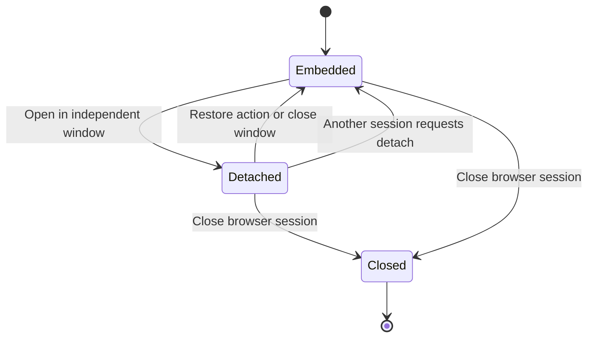
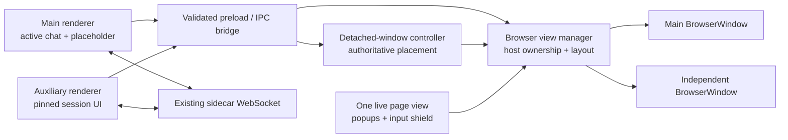
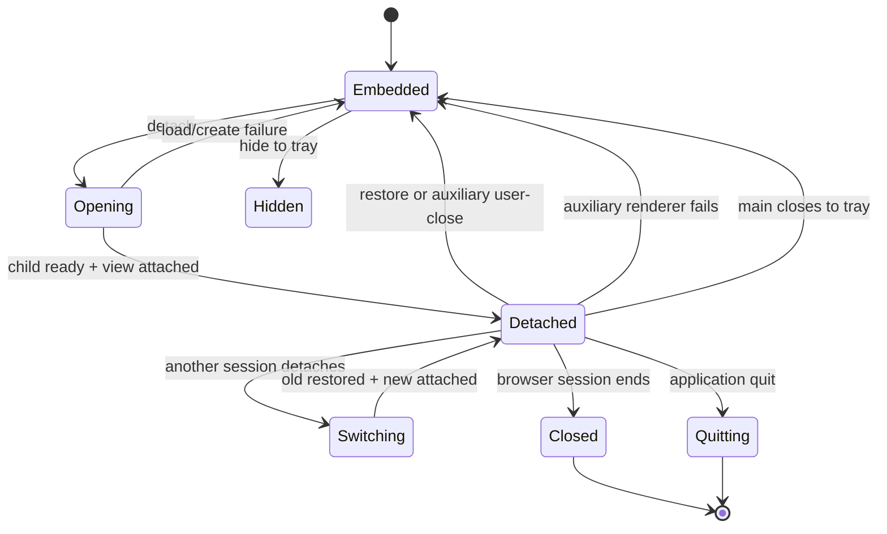

# Detached Browser Window - Plan

## Goal Capsule

- **Objective:** Replace the browser's in-app floating overlay with a real OS window while keeping its relationship to the originating chat session clear and recoverable.
- **Product authority:** This plan owns the browser window's user-visible placement, identity, lifecycle, and main-window fallback behavior. Browser automation, control handoff, authentication, and resource teardown semantics remain governed by the existing embedded-browser product contract.
- **Open blockers:** None. Startup placement, in-run geometry, and platform variance are resolved by KTD2 and KTD10.
- **Stop conditions:** Stop implementation if Electron cannot safely reparent the existing `WebContentsView` hierarchy without recreating its page, or if a supported platform forces the auxiliary window to be parent-bound; do not silently fall back to an in-app overlay.
- **Execution profile:** One coordinated desktop-shell change, implemented in dependency order with focused Electron and renderer tests before full repository gates.
- **Tail ownership:** The executor owns implementation, regression cleanup, cross-platform smoke documentation, and the final review/commit tail; publishing a release is outside this plan.

---

## Product Contract

### Summary

The embedded browser can move from its right-side panel into an independent OS window fixed to the originating chat session. The main window keeps the original browser panel as a full-size placeholder with explicit focus and restore actions.

### Problem Frame

The current Float action opens a React overlay inside the main application window. It cannot move independently across monitors or remain available when the main window is minimized, so it does not meet the user's expectation of a separate window.

Moving the browser introduces a second usability risk: the originating panel can become an unexplained blank area, or the detached content can silently change identity as the user switches chats. The window relationship therefore needs explicit placement, identity, and recovery rules.

### Key Decisions

- **Call the action “Open in Independent Window,” not “Float.”** The product should distinguish a real OS window from an overlay attached to the main window. Governs R1, R4.
- **Keep the full browser-panel placeholder.** (session-settled: user-directed — chosen over a compact dock strip or global-only indicator: preserving spatial context and findability matters more than reclaiming chat width.) Governs R5, R6.
- **Pin the window to its originating chat session.** (session-settled: user-directed — chosen over following the main window's active chat: browser identity must not change unexpectedly.) Governs R3, R7.
- **Closing the independent window restores the panel.** (session-settled: user-directed — chosen over leaving an orphaned placeholder or closing the browser session: closing changes placement, not session lifecycle.) Governs R8, R9.
- **Allow one independent browser window globally in the first release.** (session-settled: user-directed — chosen over per-session windows or window-level tabs: avoid multi-window and tab-management complexity.) Governs R10, R11.
- **Keep the independent window visible when the main window is minimized.** (session-settled: user-directed — chosen over minimizing both together: the browser window is an independently manageable work surface.) Governs R12.
- **Restore the browser before hiding the application to the system tray.** (session-settled: user-directed — chosen over hiding both windows or leaving the independent browser visible: the application should return to a single embedded state before it is hidden.) Governs R15.

### Actors

- A1. **Desktop user:** Watches or controls the browser while continuing work in the main chat window.
- A2. **Browser agent:** Continues operating the same browser session regardless of which application window hosts its view.
- A3. **Desktop application:** Maintains the placement, session identity, and lifecycle relationship between the main and independent windows.

### Requirements

**Window placement and identity**

- R1. The browser can move from the embedded right-side panel into a real OS window with standard move, resize, minimize, restore, and focus behavior.
- R2. The browser view has one visual host at a time; moving it never duplicates the live page into both windows.
- R3. The independent window remains bound to the chat session from which it was opened and identifies that session in its title until it is restored or its browser session closes.
- R4. User-facing copy names the action and state as an independent or separate window rather than a floating overlay.

**Main-window behavior**

- R5. While a browser is detached, its originating chat keeps the browser panel at its existing width and shows that the browser is open in another window.
- R6. The placeholder identifies the detached session and offers actions to focus the independent window and restore it to the panel.
- R7. Switching the main window to another chat does not change the independent window's session or content.
- R8. Closing the independent window restores the browser view to its originating panel without ending the browser session or resetting its state. If another chat is active, the main window keeps that chat selected and the restored browser becomes visible when the user returns to its originating chat.
- R9. Closing the independent window and closing the browser session are distinct actions with distinct labels and outcomes.

**Single-window lifecycle**

- R10. The first release permits at most one independent browser window across the application.
- R11. Detaching another chat's browser first restores the currently detached browser to its own panel, then moves the newly requested browser into the independent window.
- R12. Minimizing the main window does not minimize or hide the independent browser window.
- R13. Exiting the desktop application closes both the main window and the independent browser window.
- R14. Closing the browser session while detached closes the independent browser window and leaves the originating panel in the normal no-browser state.
- R15. When closing the main window follows the existing hide-to-tray behavior, the detached browser first returns to its originating panel and the application then hides; on platforms without a usable tray, the existing quit behavior still closes all windows.

### Window State Model



The placement state does not replace the browser control state. Agent control, user control, handoff pending, and session loss continue unchanged while the view moves between hosts.

### Key Flows

- F1. Detach the current browser
  - **Trigger:** A1 chooses Open in Independent Window from an embedded browser panel.
  - **Actors:** A1, A3
  - **Steps:** A3 opens the independent window, moves the browser view into it, binds the window to the originating chat, and replaces the embedded view with the full-size placeholder.
  - **Covered by:** R1, R2, R3, R5, R6
- F2. Continue working in another chat
  - **Trigger:** A1 switches the main window to a different chat while a browser is detached.
  - **Actors:** A1, A2, A3
  - **Steps:** The main window changes chats while the independent browser remains bound to and continues displaying its originating session.
  - **Covered by:** R3, R7
- F3. Close or restore the independent window
  - **Trigger:** A1 closes the OS window or chooses Restore to Panel.
  - **Actors:** A1, A3
  - **Steps:** A3 moves the same browser view back to the originating panel and preserves page, login, control, and task state.
  - **Covered by:** R2, R8, R9
- F4. Detach a different session
  - **Trigger:** A1 requests an independent window from another chat while one is already open.
  - **Actors:** A1, A3
  - **Steps:** A3 restores the first browser to its originating panel before moving the second browser into the single independent window.
  - **Covered by:** R10, R11
- F5. Close the browser session while detached
  - **Trigger:** A1 chooses Close Browser from the independent window.
  - **Actors:** A1, A2, A3
  - **Steps:** The browser session ends, the independent window closes, and the originating panel returns to its normal no-browser state.
  - **Covered by:** R9, R14
- F6. Close the main window to the system tray
  - **Trigger:** A1 closes the main window while a browser is detached and the application has a usable system tray.
  - **Actors:** A1, A3
  - **Steps:** A3 restores the detached browser to its originating panel, then hides the main window according to the existing tray lifecycle.
  - **Covered by:** R8, R15

### Acceptance Examples

- AE1. **Covers R1, R5, R6.** Given a live embedded browser, when the user opens it in an independent window, then the OS can move that window to another monitor and the original panel remains as a full-size placeholder with Focus Window and Restore to Panel actions.
- AE2. **Covers R3, R7.** Given session A's browser is detached, when the main window switches to session B, then the independent window continues showing session A and its title identifies session A.
- AE3. **Covers R8, R9.** Given a detached browser with an active page and control state, when the user closes the OS window, then the browser session remains live and the same page and control state appear in the originating panel when that chat is active; closing does not force the main window away from a different active chat.
- AE4. **Covers R10, R11.** Given session A's browser is detached, when session B requests detachment, then session A is restored before session B appears in the single independent window.
- AE5. **Covers R12.** Given the independent browser is visible, when the main window is minimized, then the browser window remains visible and independently manageable.
- AE6. **Covers R13, R14.** Closing the browser session while detached returns the originating panel to its no-browser state, while exiting the application closes all application windows.
- AE7. **Covers R15.** Given a browser is detached, when the user closes the main window on a tray-enabled desktop, then the browser is restored before the application hides; after reopening from the tray and returning to the originating chat, the same live page is embedded in its panel.

### Success Criteria

- A user can move the browser to another monitor, keep it visible while the main window is minimized, and restore it without losing page, login, control, or task state.
- At every point, the user can tell which chat owns the detached browser and how to focus, restore, or terminate it.
- Window placement actions never create a second live rendering of the same browser session.

### Scope Boundaries

**Deferred for later**

- Multiple simultaneous independent browser windows.
- Tabs or a session switcher inside the independent window.
- A Follow Active Chat mode.
- Optional Always on Top behavior.
- Persisting independent-window placement across full application restarts.

**Outside this work**

- Changes to browser-agent control, takeover, handback, approvals, authentication, or remembered-site behavior.
- Turning the embedded browser into a general-purpose browser with tabs, bookmarks, or download management.
- Mirroring or streaming the same live browser view into both the main and independent windows.

### Dependencies / Assumptions

- The feature is available only in the desktop application, where OS-level windows and the native browser view exist.
- The browser session remains the source of truth; window placement is presentation state and must not rebuild or transfer the underlying session.
- The current UI Float is an in-main-window overlay in `src/client/components/browser/BrowserPopout.tsx`, and its store state is global in `src/client/stores/browser-pane-store.ts`.
- The current native view manager attaches browser views to the main window through `electron/browser-view-manager.ts`; planning must account for hosting the same view in either application window.
- Platform window managers differ, but the product behaviors in R8, R12, and R13 must remain consistent across supported desktop platforms.

### Sources / Research

- `docs/plans/2026-07-18-001-feat-embedded-controlled-browser-plan.md` — original embedded-browser contract, which deferred a native second window and established the application-overlay behavior being replaced.
- `src/client/components/browser/BrowserPopout.tsx` and `src/client/components/browser/BrowserBody.tsx` — current single-surface overlay and placeholder behavior.
- `electron/browser-view-manager.ts` — current native browser-view host and lifecycle constraints.
- [Visual Studio Code Custom Layout](https://code.visualstudio.com/docs/configure/custom-layout) — independent auxiliary windows, fixed content identity, optional compact and Always on Top modes.
- [Chrome DevTools customization](https://developer.chrome.com/docs/devtools/customize) — undock into a separate window and restore to a dock position.
- [JetBrains tool window view modes](https://www.jetbrains.com/help/idea/viewing-modes.html) — explicit distinction between Float, which remains tied to the project window, and Window, which behaves independently.

---

## Planning Contract

### Preservation Note

The Product Contract is preserved from the confirmed brainstorm, with one planning-time addition: R15, F6, and AE7 resolve how the existing close-to-tray lifecycle interacts with a detached browser. The user explicitly chose restore-before-hide.

### Key Technical Decisions

- KTD1. **The main process owns one authoritative detached placement record.** A controller stores the pinned workspace/session identity, display title, auxiliary window, and current host. Renderer stores mirror this state for presentation but never decide ownership. This instantiates the single-window and pinned-session decisions governing R3, R7, R10, and R11.
- KTD2. **Use a reusable, unparented top-level `BrowserWindow`.** The auxiliary window has no `parent` or modal relationship, so main-window minimize and movement do not drag or hide it. Reuse it for in-run session switches and geometry continuity; do not persist it across app restarts. This instantiates the independent-minimize decision governing R1 and R12.
- KTD3. **Move the existing native view hierarchy; never recreate or mirror it.** Rehosting removes the page view, managed popups, and input shield from the old host and attaches them to the new host in page → popup → shield order. The same `WebContents` and persistent partition survive the move, preserving URL, login, control, and task state. Governs R2 and R8.
- KTD4. **Derive view-surface report identity from the IPC sender and reject stale hosts.** Rect, `null`, and modal-occlusion reports carry no trusted renderer-supplied host identifier. The main process maps `event.sender` to a known main or auxiliary window, and the view manager accepts layout or occlusion changes only for sessions currently hosted by that window. Ownership changes before the new renderer reports, so late cleanup or modal state from the former renderer cannot hide the moved view.
- KTD5. **Load a dedicated minimal renderer in the auxiliary window.** The existing client bundle selects a detached-window entry by a validated local URL mode and renders only the browser state bar, browser body, and window-level shell. It subscribes directly to the pinned session over the existing authenticated sidecar channel rather than mounting the full application. Governs R3, R4, and R9.
- KTD6. **Keep the privileged UI origin hardened and give the auxiliary renderer a narrower preload.** Both application renderers remain sandboxed and context-isolated, navigation stays pinned to the trusted local UI origin, popups are denied, and every placement IPC validates sender plus workspace/session/title inputs. A dedicated auxiliary preload exposes only sidecar connection data, browser-view controls, and detach-placement operations; it omits updater, file-manager, native-dialog, notification, badge, and main-window capabilities and never exposes raw Electron objects.
- KTD7. **Treat placement close, browser close, application hide, quit, and renderer failure as separate transitions.** User-close of the auxiliary window restores; closing the browser session clears placement without restoring; tray close restores then hides; app quit closes without restoring; auxiliary renderer failure fails safe to the embedded host. This instantiates the close/restore and tray decisions governing R8, R9, R13, R14, and R15.
- KTD8. **Each renderer has an independent browser-pane store subscription.** The main renderer follows its active chat and renders a placeholder only when that active session matches the authoritative detached placement. The auxiliary renderer subscribes to the pinned session and never follows main-window navigation. Governs R5–R7.
- KTD9. **Switching the singleton window is serialized.** A second detach request restores the previous session, updates placement, retargets the reusable auxiliary renderer, then moves the new session after the child acknowledges readiness. Overlapping detach/restore/close requests are idempotent and converge on one host. Governs R10 and R11.
- KTD10. **Window geometry is an in-run convenience, not durable product state.** Electron may retain the reusable window's size and position while the app runs, but startup always begins embedded. This keeps cross-restart restoration and monitor-topology migration out of scope.

### High-Level Technical Design



The auxiliary renderer supplies controls and the rectangle in which the native page should appear; it does not render the untrusted website itself. The website remains in the existing sandboxed `WebContentsView`, with its persistent per-session partition and control channel unchanged.

```mermaid
sequenceDiagram
  participant MainUI as Main renderer
  participant Controller as Window controller
  participant Views as View manager
  participant AuxUI as Auxiliary renderer

  MainUI->>Controller: Detach pinned session
  Controller->>Views: Change owner to auxiliary
  Controller->>AuxUI: Load/show pinned session shell
  AuxUI-->>Controller: Renderer ready
  AuxUI->>Views: Report auxiliary rect
  Views->>Views: Reparent page, popups, shield
  MainUI-->>Views: Late null cleanup from main
  Views-->>MainUI: Ignore; main is no longer owner
  Note over AuxUI,Views: Same WebContents and partition remain live
```



### Implementation Constraints

- Keep the control-server API and sidecar browser-session lifecycle unchanged. Host ownership is desktop-shell state and must not leak into the server's browser control contract.
- Continue denying permissions and preloads in untrusted page and popup views. Only the trusted application UI window gets a preload.
- Do not trust a renderer-provided window ID, host token, title, or session relationship. Resolve senders main-side; validate IDs with existing patterns and cap display metadata length.
- Reparent all views belonging to a session as one operation. The input shield must remain above page and popup content after every attach, popup open, and host switch.
- Preserve existing modal occlusion and usage-login exemptions, but scope occlusion to the reporting host. A main-window modal cannot hide a session hosted by the auxiliary window, and a session not owned by a reporting renderer ignores that renderer's occlusion/layout cleanup.
- The auxiliary window must not use `parent`, `modal`, `setAlwaysOnTop`, or a platform-specific child-window primitive.
- Delete the old overlay behavior and tests once replacement coverage exists; do not leave two independent placement models in the renderer.

### Sequencing

Build the host-aware view manager first, then the main-process controller, because the controller must have a safe destination for ownership changes. Add the bridge and minimal renderer next. Replace the main-panel overlay last, once the authoritative placement snapshot is available. Finish with lifecycle integration and supported-platform smoke checks.

### System-Wide Impact

- **Security:** Adds a second trusted renderer carrying the desktop API token. Its navigation, IPC sender validation, and preload surface must receive the same scrutiny as the main window; untrusted browser pages remain isolated from both.
- **Lifecycle:** Main close-to-tray, explicit quit, update relaunch, app activation, renderer crash, and browser-session destruction gain placement-specific branches.
- **State ownership:** Detached placement moves from a renderer-local boolean to a main-process authority mirrored into two renderer processes.
- **Resource management:** The feature reuses one auxiliary window and one existing browser view hierarchy; it must not leak popups, views, listeners, or WebSocket subscriptions across repeated switches.
- **Agent parity:** Browser automation and control endpoints continue targeting the same session and page target regardless of visual host.

### Risks & Dependencies

| Risk | Consequence | Mitigation / proof |
|---|---|---|
| A former renderer emits delayed `reportRect(null)` | The newly detached or restored page disappears | Sender-derived ownership plus explicit stale-report tests in U1 and U3 |
| Reparenting omits a popup or shield | OAuth content disappears or user input bypasses agent gating | Move the full hierarchy and assert child ordering/host identity in U1 |
| Auxiliary renderer loads before placement/API data is ready | Blank or briefly misbound window | Readiness handshake, loading state, and serialized controller transition in U2/U4 |
| Close events recurse during restore or quit | Duplicate windows, unwanted redock, or blocked shutdown | Controller transition guard and explicit close-reason tests in U2/U6 |
| Linux window managers vary in focus/minimize behavior | Exact foreground activation differs by desktop | Require semantic smoke checks—window remains separately manageable—without promising forced focus on every compositor |
| Two renderer stores diverge | Wrong session title or controls | Main-process placement snapshot is authority; each renderer independently subscribes to session state and tests retarget/unsubscribe |

### Assumptions

- Electron 43's `BrowserWindow.contentView` and `WebContentsView` ownership behavior supports removing an existing child view from one live window and adding it to another without destroying its `webContents`.
- Supported platforms permit a normal unparented top-level window; exact focus-stealing policy remains controlled by the OS/window manager.
- The existing browser state WebSocket and desktop credential can serve a second trusted renderer without server changes.
- Browser session display names are presentation metadata; stable identity remains workspace ID plus session ID.

### Technical Sources

- `electron/main.ts` — main-window hardening, IPC validation seams, shutdown, update, activation, and close-to-tray lifecycle.
- `electron/browser-view-manager.ts` and `electron/browser-view-manager.test.ts` — current one-host layout model, page/popup/shield hierarchy, focus, occlusion, and injectable test pattern.
- `electron/preload.ts`, `src/client/lib/desktop-api.ts`, and `src/client/lib/browser-view-bridge.ts` — whitelisted bridge contract and rectangle reporting lifecycle.
- `src/client/stores/browser-pane-store.ts` and `src/client/components/browser/` — active-session subscription, control state machine, placeholder, and overlay behavior to replace.
- [Electron BrowserWindow](https://www.electronjs.org/docs/latest/api/browser-window) — top-level window lifecycle, close/minimize events, and parent-window behavior.
- [Electron BaseWindow](https://www.electronjs.org/docs/latest/api/base-window) and [WebContentsView](https://www.electronjs.org/docs/latest/api/web-contents-view) — child-view ownership and composition model.
- [Electron Security](https://www.electronjs.org/docs/latest/tutorial/security) — context isolation, navigation constraints, and IPC sender validation.

---

## Implementation Units

### U1. Make browser-view hosting explicit and race-safe

- **Goal:** Allow the existing page, managed popups, and input shield to move between known application windows without recreating the page or accepting stale layout events.
- **Requirements:** R1, R2, R8; KTD3, KTD4
- **Flows / acceptance:** F1, F3; AE1, AE3
- **Dependencies:** None
- **Files:** `electron/browser-view-manager.ts`; `electron/browser-view-manager.test.ts`; `electron/control-server.ts` only if its structural type needs a non-breaking adapter.
- **Approach:** Replace the single `hostWindow()` lookup with per-session owner selection and explicit host-aware renderer layout and occlusion reports. Track modal occlusion per host while retaining the existing per-session usage-login exemption. Add an atomic rehost path that detaches the entire hierarchy from the prior host, attaches it to the target, reapplies the accepted bounds/visibility, and restores page → popup → shield stacking. Focus and Escape delivery target the attached host. Keep server-originated rect compatibility behind a shell-owned adapter rather than exposing host identity through the control API.
- **Test scenarios:**
  - Moving a live session from fake host A to B removes page, popup, and shield from A and attaches the same objects to B in correct order.
  - URL, partition-backed view object, input mode, popup count, and last navigation state survive the move.
  - A `null` or non-null report from A after ownership moved to B is ignored; B's current bounds remain visible.
  - Agent mode focuses B and keeps the shield above all popups; user-mode Escape is sent only to B's UI renderer.
  - Rehosting out of an occluded host makes the view visible in a non-occluded target; clearing the old host's modal later cannot affect it.
  - Destroying a view or host during a move is idempotent and leaves no child views registered.
- **Verification:** Focused Node tests for the manager pass via `npm run test:electron`.

### U2. Add the detached-window controller and lifecycle policy

- **Goal:** Introduce one main-process authority that creates, reuses, focuses, restores, retargets, and destroys the independent window with explicit close reasons.
- **Requirements:** R1, R3, R8, R10–R15; KTD1, KTD2, KTD7, KTD9, KTD10
- **Flows / acceptance:** F1, F3–F6; AE1–AE7
- **Dependencies:** U1
- **Files:** new `electron/detached-browser-window.ts`; new `electron/detached-browser-window.test.ts`; `electron/main.ts`; `electron/tray.ts` and `electron/tray.test.ts` if close-policy inputs are extended.
- **Approach:** Build an Electron-free/injectable controller around a single optional auxiliary window and placement record. Wire a real unparented `BrowserWindow` in `main.ts` using the existing icon and trusted-UI navigation policy. Serialize detach/restore/switch transitions; make programmatic close reasons suppress the user-close redock path. Restore before main-window hide-to-tray, but skip restore during quit/update shutdown and browser-session termination. On auxiliary `render-process-gone`, close the failed shell and return ownership to main when the browser still exists.
- **Test scenarios:**
  - First detach creates and shows one unparented window; repeated focus does not create another.
  - Detaching session B while A is detached restores A before B becomes the placement; concurrent requests converge on B with one window.
  - Auxiliary user-close restores; programmatic browser-close clears without restore; application quit closes without restore.
  - Main minimize does not call minimize/hide on the auxiliary window.
  - Tray-enabled main close restores then hides; no-tray close follows existing quit semantics and closes all windows.
  - Child load failure or renderer crash restores the live browser to main and clears the placement.
  - Window size/position survive in-run reuse but no detached placement is restored on a new controller boot.
- **Verification:** Controller and tray lifecycle tests pass through `npm run test:electron`.

### U3. Expose a validated detached-placement desktop bridge

- **Goal:** Let trusted renderers request and observe placement without exposing Electron primitives or allowing one renderer to impersonate another host.
- **Requirements:** R3–R11; KTD4, KTD6
- **Flows / acceptance:** F1–F4; AE1–AE4
- **Dependencies:** U1, U2
- **Files:** `electron/main.ts`; `electron/preload.ts`; new `electron/detached-browser-preload.ts`; `electron.vite.config.ts`; `src/client/lib/desktop-api.ts`; `src/client/lib/browser-view-bridge.ts`; related bridge/preload tests and `scripts/build-bridge-manifest.test.ts` if the manifest is enumerated.
- **Approach:** Add detach, focus, restore, snapshot, placement-change subscription, renderer-ready, and detached-session-ended calls to the context bridge. Build a dedicated least-privilege auxiliary preload and a shared TypeScript bridge contract that prevents the two exposed surfaces from drifting. Validate trusted UI origin/sender role, existing ID patterns, string lengths, and that a renderer may report bounds or occlusion only for sessions hosted by its window. Map `event.sender` to the known main or auxiliary host before forwarding view-surface state. Publish placement changes to both live renderer windows and return unsubscribe functions for listeners.
- **Test scenarios:**
  - Valid main-renderer detach and focus/restore requests reach the controller and publish matching snapshots.
  - Unknown, destroyed, remote-origin, or wrong-role senders cannot detach, restore, report rects, or end another placement.
  - Invalid session/workspace IDs, non-finite rects, and oversized display metadata are rejected without state changes.
  - Old-owner cleanup reports cannot hide the new owner's view; current-owner cleanup still hides it when its panel unmounts.
  - Opening a modal in the main window does not occlude an auxiliary-hosted browser; main-hosted browser views still follow existing modal and usage-login exemption behavior.
  - The auxiliary bridge contains no updater, file-manager, dialog, notification, badge, or main-window control methods.
  - Event subscriptions remove listeners and do not accumulate across renderer remounts or window reuse.
  - Existing bridge capabilities and build manifest remain compatible.
- **Verification:** `npm run test:electron`, `npm run test:client`, and `npm run test:bridge:manifest` pass.

### U4. Build the minimal independent-browser renderer

- **Goal:** Render the pinned session's browser chrome and controls in the auxiliary window without mounting the full Comate application.
- **Requirements:** R1, R3, R4, R7, R9, R12, R14; KTD5, KTD8, KTD9
- **Flows / acceptance:** F1–F5; AE1–AE6
- **Dependencies:** U3
- **Files:** `src/client/main.tsx`; new `src/client/components/browser/DetachedBrowserWindowApp.tsx`; `src/client/stores/browser-pane-store.ts`; `src/client/components/browser/BrowserBody.tsx`; `src/client/components/browser/BrowserStateBar.tsx`; new component tests.
- **Approach:** Select the renderer root from a validated local URL mode. On auxiliary startup, fetch placement, subscribe the browser store to the pinned workspace/session, show a bounded loading/error state, acknowledge readiness, and render the existing state bar/body in a window-sized layout. Retarget cleanly when the singleton window switches sessions. Report native-view bounds only after placement matches. If the subscribed session transitions to browser-closed, notify the controller so it clears and closes without redocking. Use window close for placement restore and keep Close Browser as the existing session-ending action.
- **Test scenarios:**
  - Auxiliary mode mounts only the detached browser shell; normal mode still mounts `App`.
  - Session A remains rendered after the main store switches to session B.
  - Retarget A → B unsubscribes A, subscribes B, resets transient state, and reports B's rect only after readiness.
  - User/agent control buttons invoke the same WebSocket requests and input-mode bridge as the embedded panel.
  - Browser-session close notifies the controller and renders no stale placeholder or page surface.
  - Missing/invalid placement produces a safe close or recovery state without mounting another application shell.
- **Verification:** Focused jsdom tests and `npm run test:client` pass.

### U5. Replace the overlay with authoritative placeholder behavior

- **Goal:** Remove the in-window floating overlay and make the originating panel reflect main-process placement, with focus and restore actions.
- **Requirements:** R4–R11, R15; KTD1, KTD8
- **Flows / acceptance:** F1–F4, F6; AE1–AE4, AE7
- **Dependencies:** U3, U4
- **Files:** `src/client/App.tsx`; `src/client/components/browser/BrowserPane.tsx`; `src/client/components/browser/BrowserBody.tsx`; `src/client/components/browser/BrowserStateBar.tsx`; delete `src/client/components/browser/BrowserPopout.tsx`; `src/client/stores/browser-pane-store.ts`; browser component/store tests; English and Chinese browser i18n resources.
- **Approach:** Replace `popoutOpen` and `setPopoutOpen` with a placement snapshot synced from the main process. Rename the action to Open in Independent Window. When the active session owns the detached placement, preserve panel width and render a full placeholder with session identity, an announced status, Focus Window, and Restore to Panel. Other sessions render their own normal browser state and never retarget the auxiliary window. Explicit restore returns keyboard focus to the embedded browser frame; auxiliary OS-close does not steal focus or change the main window's active chat. Remove overlay focus-trap/Escape code and its tests, replacing them with placement/placeholder tests.
- **Test scenarios:**
  - Clicking the action requests detach with the current workspace/session metadata and does not set a local overlay boolean.
  - The originating session shows exactly one full-width placeholder and no native host; focus and restore invoke their bridge actions.
  - Switching to another chat hides the originating placeholder but leaves detached placement unchanged; returning restores it.
  - Placement change events update the UI after auxiliary close, second-session switch, tray redock, and session end.
  - Browser panel width is preserved through detach/restore and the same live page host returns after restore.
  - Placeholder status and actions have accessible names, a logical tab order, and visible focus; explicit restore moves focus to the embedded frame without OS-close stealing main-window focus.
  - English and Chinese labels distinguish independent-window restore from Close Browser.
- **Verification:** Browser pane/store/state-bar component tests and `npm run test:client` pass.

### U6. Close lifecycle gaps and validate the integrated experience

- **Goal:** Prove the full two-window lifecycle across shutdown, tray, errors, packaging, and supported desktop environments.
- **Requirements:** R1–R15; KTD1–KTD10
- **Flows / acceptance:** F1–F6; AE1–AE7
- **Dependencies:** U1–U5
- **Files:** `electron/main.ts`; relevant Electron integration/build tests; `scripts/test-electron-cdp.ts` or a focused successor if two-window CDP inspection needs support; `docs/runbooks/linux-smoke.md` and equivalent existing desktop smoke documentation where present.
- **Approach:** Add integration coverage around real window creation and view ownership where Electron test seams allow it, then document and run manual smoke cases for native window-manager behavior. Verify packaged renderer routing and preload availability. Exercise repeated detach/restore/switch cycles to expose listener/view leaks. Keep automation behavior under the existing control API as a regression assertion.
- **Test scenarios:**
  - Detach, move/resize, main minimize, focus, restore, and auxiliary OS-close preserve URL, login partition, control state, and a single live view.
  - Detach A, navigate main to B, then detach B produces the specified restore-before-switch order.
  - Close Browser, auxiliary crash, tray close/reopen, explicit quit, update relaunch, and no-tray Linux close each follow their distinct terminal state.
  - OAuth-style managed popup and agent-mode shield remain correctly stacked before and after both detach and restore.
  - Repeating detach/restore and A/B switching does not increase live page, popup, IPC listener, or WebSocket subscription counts after settling.
  - Packaged builds load both renderer modes only from the trusted application origin; external navigation opens in the system browser.
- **Verification:** Complete the Verification Contract below, including manual native-window smoke on macOS, Windows, and a supported Linux desktop/Wayland environment available to the release process.

---

## Verification Contract

### Automated gates

1. Focused development loop: `npm run test:electron` and the affected browser component/store tests under `npm run test:client`.
2. Bridge and packaging contracts: `npm run test:bridge:manifest`, `npm run test:electron:build`, and `npm run build:electron`.
3. Static quality: `npm run typecheck` and `npm run lint`.
4. Full regression gate before handoff: `npm test`.
5. When an Electron runtime is available, run `npm run test:electron-cdp:required` and extend its assertions to verify two top-level windows and a single browser page target if U6 introduces that coverage.

### Behavioral gates

- In the main window, the detached session's panel remains full width and clearly names the independent-window state; Focus and Restore are keyboard reachable.
- In the auxiliary window, native move, resize, minimize, restore, and close behave like a normal top-level window. Main minimize leaves it available.
- Restore, auxiliary close, singleton session switch, and tray close preserve the same page, cookies/login, and control mode; Close Browser does not redock.
- Main chat switching cannot change the auxiliary session, title, URL, controls, or bounds owner.
- At no time do both windows show or own the same live native browser view.

### Platform smoke matrix

| Platform | Required observations |
|---|---|
| macOS | Independent traffic-light lifecycle; main minimize/close-to-tray does not parent-move the browser; Dock/tray reopen shows redocked state |
| Windows | Independent taskbar window and caption lifecycle; main minimize isolation; quit and update-relaunch close both windows |
| Linux / Wayland | Separate manageable top-level window; no-tray close quits safely; focus behavior is recorded by semantic outcome rather than forced foreground ordering |

Failures in sender validation, single-view ownership, redock state preservation, or quit/tray lifecycle are release blockers. Cosmetic platform differences in focus animation or window decoration are not blockers when the semantic outcome remains correct.

---

## Definition of Done

- The action formerly called Float opens a real unparented OS window and the old in-app overlay implementation is removed.
- The auxiliary window stays pinned to its originating session, while the main panel retains the confirmed full-size placeholder with Focus and Restore actions.
- The same live page view, popup hierarchy, partition, URL, login, and control state move between hosts without duplication or reconstruction.
- Main-process ownership rejects stale or unauthorized layout reports, and all new IPC paths validate trusted senders and inputs.
- Auxiliary close, browser close, main minimize, tray close, explicit quit, update relaunch, renderer failure, and singleton session switching satisfy their distinct acceptance behavior.
- U1–U6 test scenarios pass, all automated verification gates are green, and the platform smoke matrix has no release-blocking failures.
- The final diff contains no abandoned overlay code, duplicate placement state, dead experimental controller paths, leaked listeners, or unrelated refactors.
- Documentation and bilingual user-facing copy consistently use independent/separate window terminology instead of Float for this behavior.
