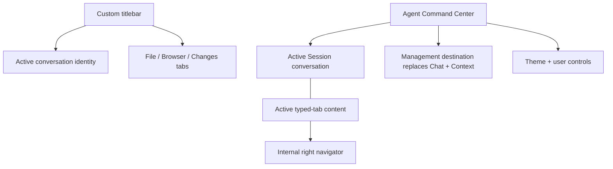
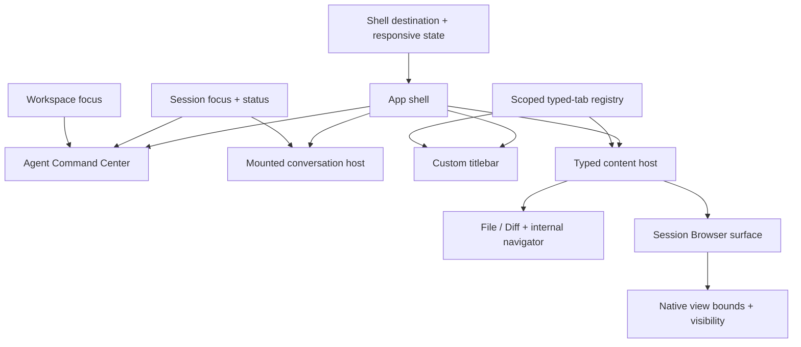
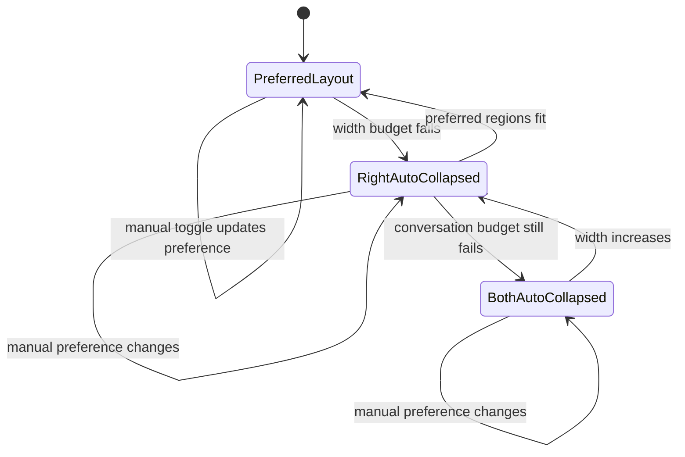
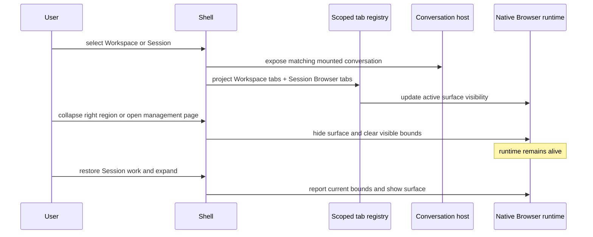

# Agent Workspace Layout - Plan

## Goal Capsule

- **Objective:** Reorganize the desktop shell around background agent supervision, one focused conversation, and typed Workspace- or Session-scoped context tabs.
- **Product authority:** The Product Contract owns information architecture, navigation, tab behavior, status placement, management destinations, responsive collapse, and motion behavior.
- **Execution profile:** Preserve active Session runtimes and native Browser surfaces while replacing the shell and state model incrementally.
- **Stop conditions:** Stop if the new shell would require terminating background Sessions, discarding open context tabs on focus change, or replacing native window controls with renderer-only controls.
- **Tail ownership:** The implementation includes migration cleanup, regression coverage, and desktop smoke verification.

---

## Product Contract

### Summary

The desktop shell will use a persistent Agent Command Center on the left, the active Session conversation in the middle, and typed File, Browser, or Changes content on the right.
The custom titlebar will carry the active conversation identity and right-side typed tabs, while management destinations keep the Command Center visible and replace the remaining work area.

### Problem Frame

The current shell distributes Workspace navigation across top tabs, Session navigation across the left sidebar, and Files, Git Changes, and Browser across one right-side panel.
This hierarchy diverges from the ownership model: Files and Git Changes belong to a Workspace, Browser belongs to a Session, and multiple background Sessions compete with the one conversation the user can respond to at a time.
The result becomes crowded when conversation, browser, file navigation, file content, and Git review are all open.

### Actors

- A1. **User:** supervises multiple background Sessions but responds to one Session at a time.
- A2. **Agent Session:** continues work in the background and may require an Approval or AskUserQuestion response.
- A3. **Bot channel:** creates or owns Sessions through sources such as WeCom or Feishu and exposes a Workspace-level connection state.

### Key Decisions

- **One focused Session over Session tiling** (session-settled: user-directed — chosen over tiled parallel conversations: the user can act on only one Session feedback request at a time). Governs R3-R4.
- **Command Center + conversation + typed context tabs** (session-settled: user-directed — chosen over an IDE document canvas and permanent tool panes: conversation is the primary work object). Governs R1-R3, R7-R12.
- **Conversation identity and typed tabs live in the custom titlebar** (session-settled: user-directed — chosen over separate content headers: the titlebar should contribute usable navigation space). Governs R7-R8, R17-R18.
- **Theme and user controls live at the bottom of the Command Center** (session-settled: user-directed — chosen over global controls in the titlebar: the titlebar is reserved for active work context). Governs R19.
- **Context navigation lives inside each content type** (session-settled: user-directed — chosen over a global file or change tree: the right region must remain usable when several tools are open). Governs R10-R11.
- **File trees and change lists sit on the internal right** (session-settled: user-directed — chosen over left-side internal navigation: file content and Diff remain the primary reading surfaces). Governs R10-R11.
- **Management destinations are first-level pages** (session-settled: user-approved — chosen over full-screen overlays and context tabs: they carry application or Workspace scope rather than current-Session context). Governs R13-R16.
- **Existing operational status remains visible in the new hierarchy** (session-settled: user-directed — chosen over a simplified Session list: bot connection, pending interaction, bot source, and WIP state are required supervision signals). Governs R5-R6.
- **Both side regions collapse responsively with motion** (session-settled: user-directed — chosen over a fixed three-column minimum width: the conversation must remain usable in narrow windows). Governs R20-R24.

### Layout Model

### Requirements

**Command Center and focus**

- R1. The left Agent Command Center must group open Workspaces and their Sessions, with search, status filters, and collapsible Workspace groups.
- R2. Global search must find defined Workspaces that are not currently open, and selecting one must open it in the Command Center.
- R3. The middle region must display exactly one active Session conversation while other Sessions continue in the background.
- R4. A background Session that needs user participation must become discoverable in the Command Center without replacing or interrupting the active conversation.

**Operational status**

- R5. Each Workspace group header must display enabled Bot channel connection states plus aggregate counts for needs-user, running, and unread-completed Sessions.
- R6. Each Session item must display its primary activity state, mutually exclusive Approval or Question status when applicable, Bot or scheduled source, WIP state, background activity count, and recency.

**Typed context tabs**

- R7. The right region must support File, Browser, and Changes tab types in one titlebar-aligned tab strip without moving conversation content into that tab system.
- R8. The typed tab strip must provide a `+` action that lets the user explicitly choose File, Browser, or Git Changes as the new tab type.
- R9. Browser tabs must be scoped to a Session with at most one Browser tab and runtime per Session, while File and Changes tabs must be scoped to a Workspace.
- R10. A File tab must place file content on the left and a collapsible file tree on the internal right; single-clicking a file previews it in the current File tab, while double-clicking opens a new durable File tab.
- R11. A Changes tab must place the Diff on the left and a collapsible changed-file list on the internal right; selecting or double-clicking a changed file must follow the corresponding preview or durable-tab behavior from R10.
- R12. Users must be able to select and close multiple typed tabs, and the application must restore the correct Workspace- or Session-scoped tab set when focus changes.

**Application management**

- R13. Todos, Analytics, Settings, and the Plugins / Skills capability center must be first-level management destinations that keep the Agent Command Center visible and replace the middle plus right regions.
- R14. Todos must remain a cross-Workspace collection with Workspace grouping; Analytics and Settings must retain global and Workspace scopes; the capability center must expose User and Workspace scopes.
- R15. The Workspace section in the Command Center must provide a `+` action that opens the new-Workspace modal flow.
- R16. Returning from a management destination to Session work must restore the active conversation and its visible typed-tab state.

**Titlebar and account placement**

- R17. The custom titlebar must align with the three work regions: application and native window chrome on the left, active Workspace and Session identity in the middle, and typed context tabs on the right.
- R18. Titlebar controls must preserve draggable blank regions, macOS traffic-light clearance, Windows native caption buttons, Windows snap behavior, themed titlebar overlay, and restored-window frame behavior.
- R19. Theme selection and the user account entry must appear at the bottom of the Agent Command Center instead of occupying titlebar space.
- R25. A management destination must replace conversation identity with its page identity in the titlebar and hide the typed-tab strip without changing native window controls.

**Responsive collapse and motion**

- R20. The Agent Command Center and right context region must each provide an always-discoverable manual expand or collapse control.
- R21. When width becomes insufficient, the shell must automatically collapse the right context region before the Agent Command Center and keep the active conversation usable.
- R22. Automatic collapse must not overwrite the user's manual expanded widths or collapse preferences; widening the window must restore the latest layout that fits.
- R23. Manual and automatic collapse or expansion must animate the affected panel, adjacent titlebar region, and conversation width as one coordinated transition, with reversible behavior during rapid repeated input.
- R24. Reduced-motion preference must disable nonessential transition movement, and collapsing the right region must hide rather than terminate an open Browser runtime or discard its tab state.

### Key Flows

- F1. **Respond to a background Session**
  - **Trigger:** A background Session enters Approval or Question state.
  - **Actors:** A1, A2
  - **Steps:** The Session item and its Workspace aggregate update; the user selects the Session; the conversation and Session-owned Browser tabs become active; the user responds.
  - **Outcome:** The Session resumes without requiring other background Sessions to occupy the main canvas.
  - **Covers:** R3-R6, R9, R12.

- F2. **Open and inspect a file**
  - **Trigger:** The user creates a File tab or navigates within an existing File tab.
  - **Actors:** A1
  - **Steps:** The File tab shows content with the tree on its right; single-click previews in place; double-click creates another File tab; the tree may be collapsed.
  - **Outcome:** Multiple files remain available without adding a permanent global file-tree column.
  - **Covers:** R7-R10, R12.

- F3. **Review Workspace changes**
  - **Trigger:** The user opens a Changes tab.
  - **Actors:** A1
  - **Steps:** The Diff appears with the changed-file list on its right; the user previews or opens additional changed files; the list may be collapsed.
  - **Outcome:** Multiple reviews remain available as Workspace-owned tabs.
  - **Covers:** R7-R9, R11-R12.

- F4. **Use an application management destination**
  - **Trigger:** The user selects Todos, Analytics, Settings, or Plugins / Skills from the Command Center navigation.
  - **Actors:** A1
  - **Steps:** The Command Center remains visible; the management page replaces conversation and context content; the user returns to Session work.
  - **Outcome:** The previous conversation and typed-tab state are restored.
  - **Covers:** R13-R16.

- F5. **Adapt to a narrow window**
  - **Trigger:** The user narrows the application window below the available three-region width.
  - **Actors:** A1
  - **Steps:** The right region animates closed; if space remains insufficient the Command Center also animates closed; widening restores the latest user layout that fits.
  - **Outcome:** Conversation remains usable without losing supervision, tab, or Browser runtime state.
  - **Covers:** R20-R24.

### Acceptance Examples

- AE1. **Background Question does not interrupt focus.** Covers R3-R6.
  - **Given:** Session A is active and Session B is running in the background.
  - **When:** Session B emits AskUserQuestion.
  - **Then:** Session B shows Question, its Workspace needs-user count increases, and Session A remains visible until the user selects Session B.
- AE2. **Approval and Question remain mutually exclusive.** Covers R6.
  - **Given:** A Session has one pending user interaction.
  - **When:** The interaction is rendered in the Command Center.
  - **Then:** The Session item shows Approval or Question, never both.
- AE3. **Bot ownership and connection are not conflated.** Covers R5-R6.
  - **Given:** A Workspace has a connected WeCom Bot and contains a WeCom-origin Session.
  - **When:** The Workspace and Session render.
  - **Then:** The Workspace header shows WeCom connection state while the Session item shows WeCom as its source.
- AE4. **File tabs survive Session switching within a Workspace.** Covers R9-R12.
  - **Given:** A Workspace has open File tabs and two Sessions.
  - **When:** The user changes the active Session.
  - **Then:** The conversation and Browser tab set change to the selected Session while the Workspace File tabs remain available.
- AE5. **Workspace switching restores the Workspace work set.** Covers R1-R2, R9, R12.
  - **Given:** Two open Workspaces have different File and Changes tabs.
  - **When:** The user switches Workspace through the Command Center.
  - **Then:** The selected Workspace's Sessions, File tabs, Changes tabs, and aggregate status replace the previous Workspace context.
- AE6. **Double-click opens a durable File tab.** Covers R10.
  - **Given:** A File tab is displaying one previewed file.
  - **When:** The user double-clicks another file in the internal right-side tree.
  - **Then:** A new File tab opens for that file and the previous File tab remains open.
- AE7. **Management navigation preserves work state.** Covers R13-R16.
  - **Given:** A Session conversation and several typed tabs are open.
  - **When:** The user opens Analytics and then returns to Session work.
  - **Then:** The same conversation, active tab, and open tab set are restored.
- AE8. **Titlebar remains native and useful.** Covers R17-R19.
  - **Given:** Comate runs on macOS or Windows with its custom titlebar.
  - **When:** The user changes Session or typed tab and then moves, maximizes, or snaps the window.
  - **Then:** The titlebar updates its work context while native window behavior remains available.
- AE9. **Responsive collapse preserves user intent.** Covers R20-R23.
  - **Given:** Both side regions are manually expanded with user-selected widths.
  - **When:** The window narrows enough to collapse both regions and later widens again.
  - **Then:** The right region collapses first, both transitions animate, and the prior widths return when space permits.
- AE10. **Rapid reversal does not jump.** Covers R23-R24.
  - **Given:** A side region is midway through an animated collapse.
  - **When:** The user immediately requests expansion.
  - **Then:** The transition reverses from its current visual position without a terminal width jump; reduced-motion users receive an immediate stable layout.
- AE11. **Collapsed Browser stays alive.** Covers R9, R12, R24.
  - **Given:** The current Session has an open Browser tab with live page state.
  - **When:** The right region auto-collapses and is later expanded.
  - **Then:** The same Browser runtime and page state reappear, with corrected native view bounds.

### Success Criteria

- Users can locate a needs-user Session across multiple Workspaces without displaying multiple conversations at once.
- Conversation remains the stable center of Session work while files, Browser content, and Diffs remain accessible in the right work set.
- Bot connection, pending interaction, Bot source, and WIP signals remain as discoverable as in the current interface.
- Narrow-window adaptation preserves a usable conversation and restores user layout intent without terminating background work.
- The custom titlebar increases usable navigation space without regressing native macOS or Windows behavior.

### Scope Boundaries

- Multi-Session tiling and simultaneous conversation panes are excluded.
- Arbitrary pane composition and drag-and-drop layout building are excluded.
- Multiple independent context-tab groups are deferred.
- App-restart persistence for open context tabs is deferred; this plan preserves them during the current application lifetime and across Workspace, Session, and management navigation.
- A visual redesign of conversation content, code rendering, Diff rendering, or management-page internals is excluded.
- Server-side Session, Browser, and Git semantics remain unchanged except for the pending-interaction status discriminator required by R6.

### Dependencies / Assumptions

- The distinction between defined and open Workspaces remains part of the product model; the Command Center primarily lists open Workspaces while global search can open defined ones.
- Existing Session activity, unread completion, WIP, source, background-task, and Bot connection signals remain authoritative inputs for the new surfaces.
- Approval and AskUserQuestion cannot be pending simultaneously for one Session.
- Existing native titlebar and Browser `WebContentsView` bridges remain the platform integration boundaries.

### Sources / Research

- Current shell and mounted Workspace lifecycle: `src/client/App.tsx`.
- Current Workspace and Session navigation: `src/client/components/WorkspaceTabs.tsx`, `src/client/components/WorkspaceSwitcher.tsx`, and `src/client/components/Sidebar.tsx`.
- Current Session status presentation: `src/client/components/SessionListItem.tsx` and `src/client/stores/chat-store.ts`.
- Current Files, Git Changes, Browser, and tab state: `src/client/components/RightPanel.tsx` and `src/client/stores/right-panel-store.ts`.
- Existing collapse and animation behavior: `src/client/hooks/use-sidebar-width.ts` and `src/client/hooks/use-right-panel-width.ts`.
- Native Browser bounds and visibility: `src/client/lib/browser-view-bridge.ts` and `electron/browser-view-manager.ts`.
- Existing management scope behavior: `src/client/components/TodosPanel.tsx`, `src/client/components/AnalyticsPanel.tsx`, `src/client/components/SettingsPanel.tsx`, `src/client/components/PluginSettingsPage.tsx`, and `src/client/components/SkillsPage.tsx`.
- Session lifecycle learnings: `docs/solutions/integration-issues/sse-stream-resume-on-reconnect-2026-05-18.md`, `docs/solutions/integration-issues/sse-subscription-race-condition-2026-05-21.md`, and `docs/solutions/integration-issues/sse-clean-close-retry-2026-05-22.md`.
- Product direction references: <https://openai.com/index/introducing-the-codex-app/>, <https://code.claude.com/docs/en/desktop>, and <https://cursor.com/changelog/3-0>.

---

## Planning Contract

### Key Technical Decisions

- KTD1. **Model shell destination separately from active Workspace and Session.** Use a single shell destination state for Session work or a management page, so navigation changes presentation without destroying active work state. This implements R13-R16.
- KTD2. **Replace the global right-panel list mode with a scoped typed-tab registry.** Store Workspace-owned File and Changes tabs by Workspace and Session-owned Browser tabs by Session, with an active projection for the current focus. Keep the registry in memory for this migration. This implements R7-R12.
- KTD3. **Keep one preview slot per content type and promote durable tabs explicitly.** Single-click replaces the applicable preview tab; double-click or explicit open pins a durable File or Changes tab. This prevents navigation from multiplying tabs while preserving the requested multi-file workflow. This implements R10-R11.
- KTD4. **Compose the titlebar on the same column model as the body.** Put active conversation identity over the middle region and the typed tab strip over the right region, while marking only noninteractive gaps as drag regions and preserving platform-native control reservations. (session-settled: user-directed — chosen over separate conversation and right-panel headers: the custom titlebar should carry active work navigation). This implements R17-R18.
- KTD5. **Separate manual preference from effective responsive state.** Persist manual collapsed state and expanded widths, but derive effective collapse from the current width budget. Apply pressure in right-then-left order and restore only the preferred regions that fit. Use one centralized minimum conversation-width token; U6 may tune its value during desktop smoke without changing this precedence policy. (session-settled: user-directed — chosen over fixed three-column layout: narrow windows must prioritize conversation). This implements R20-R22.
- KTD6. **Animate layout dimensions while keeping content lifecycles mounted.** Reuse CSS transition semantics for reversible width and opacity changes, disable them for reduced motion and active resize drag, and let Browser rect reporting follow layout frames before a final bounds report. (session-settled: user-directed — chosen over immediate visibility toggles: both automatic and manual changes need motion). This implements R23-R24.
- KTD7. **Preserve long-lived Session and tool lifecycles.** Keep open Workspace chat panels mounted and inert when inactive, keep the Git watcher mounted across tab switches, and treat right-region collapse as Browser visibility change rather than Browser close. This follows the SSE lifecycle learnings and implements R3-R4, R12, and R24.
- KTD8. **Add a pending interaction discriminator to the status protocol.** Extend runtime, service, WebSocket, and client status data with `approval`, `question`, or no pending kind while retaining `pendingCount` for badge compatibility. This is the smallest reliable way to render R6 and AE2 without inspecting message text.
- KTD9. **Adapt management content to an in-shell presentation contract.** Reuse each page's content, data loading, scopes, and Settings dirty guard while replacing `ModalPanel` ownership with the shell destination host. Compose Plugins and Skills as one capability-center destination with User and Workspace scope instead of preserving two first-level entries. This implements R13-R16 without duplicating management state.

### High-Level Technical Design

**Component topology**

**Responsive state machine**

**Focus and lifecycle sequence**

### Implementation Constraints

- Keep the existing mounted-per-open-Workspace conversation strategy; do not replace it with unmount/remount navigation.
- Keep width drag behavior and stored widths compatible with existing local-storage keys unless migration requires an explicit versioned key.
- Keep native Browser resize reporting deduplicated and animation-frame throttled.
- Keep Windows caption controls outside renderer interaction and drag hit areas.
- Keep Settings unsaved-change confirmation active for every route away from Settings, including Session and Workspace selection.
- Keep existing file, Git, Browser, bot, plugin, skill, Todo, and Analytics APIs unchanged unless a unit explicitly names the status protocol extension.

### Sequencing

1. Establish the status discriminator and scoped state contracts before moving UI ownership.
2. Introduce the new shell and titlebar against compatibility adapters so existing content remains functional.
3. Migrate File and Changes behavior, then Browser visibility and bounds behavior.
4. Add responsive derivation and coordinated motion after all three regions use the new shell geometry.
5. Move management pages into the shell host and remove obsolete shell paths only after regression coverage passes.

### System-Wide Impact

- **Client state:** Workspace, Session, management destination, typed-tab scope, and effective panel visibility become separate axes rather than one global right-panel mode.
- **Server contract:** Session status gains a pending-interaction kind across runtime, service, WebSocket, and client state.
- **Native shell:** Browser view bounds change during animated layout and titlebar hit regions change around the new interactive controls.
- **Lifecycle:** Background chats, Browser runtimes, and Git watchers must remain active while their renderer surfaces are hidden.
- **Accessibility:** Tab semantics, toggle labels, focus restoration, keyboard access, and reduced-motion behavior must remain correct after the shell moves controls.

### Risks & Mitigations

- **Native Browser flashes or intercepts clicks during motion:** Hide when effective width reaches collapsed state, keep rect reports frame-throttled, and assert final bounds after transition completion.
- **Responsive behavior overwrites user choice:** Store preferred state separately from auto-collapse pressure and test narrow-wide round trips.
- **Session subscriptions restart during navigation:** Preserve mounted conversation hosts and add switching tests based on the existing SSE lifecycle learnings.
- **Typed tabs leak across scope:** Key Workspace and Session entries explicitly and cover cross-Workspace and cross-Session restoration.
- **Settings changes are lost during destination switching:** Route all shell navigation through the existing dirty-guard decision before changing destination.
- **Titlebar loses drag or native controls:** Test macOS spacing and Windows caption reservations separately and retain Electron-native window configuration.

---

## Implementation Units

### U1. Expose pending interaction kind end to end

- **Goal:** Make Approval and Question directly distinguishable in Workspace and Session supervision status.
- **Requirements:** R5-R6; covers AE1-AE3.
- **Dependencies:** None.
- **Files:** `src/server/services/session-runtime.ts`, `src/server/services/session-runtime.test.ts`, `src/server/services/chat-service.ts`, `src/server/services/chat-service.test.ts`, `src/server/websocket/types.ts`, `src/server/websocket/server.ts`, `src/server/websocket/server.test.ts`, `src/client/stores/chat-store.ts`, `src/client/stores/chat-store.test.ts`, `src/client/lib/session-status.ts`.
- **Approach:** Extend the existing status pipeline per KTD8. Derive one pending kind from the runtime queue, propagate it without changing current activity snapshots, and preserve `pendingCount` consumers.
- **Patterns to follow:** Existing `getStatus` to `getSessionsStatus` to WebSocket status flow; existing immutable `sessionStatus` merge logic.
- **Test scenarios:**
  1. A runtime containing a pending Approval reports `approval` and its existing count.
  2. A runtime containing AskUserQuestion reports `question` and never reports Approval simultaneously. Covers AE2.
  3. A runtime with no pending interaction omits or clears the discriminator without changing processing activity.
  4. WebSocket status payloads and client merges preserve the discriminator across successive polls.
  5. Clearing the last pending interaction removes needs-user state and does not create a false completion notification.
- **Verification:** Server and client status tests prove the discriminator reaches the client with no regression to existing count-based badges.

### U2. Introduce scoped typed-tab state

- **Goal:** Replace the global right-panel mode with Workspace- and Session-owned typed tab collections.
- **Requirements:** R7-R12; covers AE4-AE6.
- **Dependencies:** None.
- **Files:** `src/client/stores/context-tab-store.ts`, `src/client/stores/context-tab-store.test.ts`, `src/client/stores/right-panel-store.ts`, `src/client/stores/right-panel-store.test.ts`, `src/client/App.tsx`, `src/client/components/AppLayout.test.tsx`.
- **Approach:** Create the discriminated tab registry from KTD2 and KTD3. Migrate current File and Diff data-loading behavior behind compatible actions, add Session Browser entries, and derive the visible tab set from active Workspace and Session.
- **Execution note:** Characterize current file and Diff abort, close-neighbor, and duplicate-open behavior before changing the store.
- **Patterns to follow:** Existing Zustand stores, request abort-controller cleanup, and nearest-tab selection in `right-panel-store.ts`.
- **Test scenarios:**
  1. Switching Sessions in one Workspace keeps File and Changes tabs while projecting the selected Session's Browser tabs. Covers AE4.
  2. Switching Workspaces projects only the target Workspace's File and Changes tabs and the target Session's Browser tabs. Covers AE5.
  3. A single-click preview replaces only the preview slot for its type; a durable tab remains open. Covers AE6.
  4. Double-click or explicit open creates a durable tab and selects an existing matching durable tab instead of duplicating it.
  5. Closing the active tab chooses the nearest remaining tab within the current projected set.
  6. A late file or Diff response cannot reinsert a tab after its Workspace is closed or the store is reset.
- **Verification:** Store tests prove ownership, projection, preview promotion, closure, and stale-request cancellation independently of UI rendering.

### U3. Build the titlebar-aligned shell and Agent Command Center

- **Goal:** Replace top Workspace tabs and the legacy sidebar with the confirmed titlebar, Command Center, conversation, and context geometry.
- **Requirements:** R1-R8, R15, R17-R20; covers AE1-AE3 and AE8.
- **Dependencies:** U1, U2.
- **Files:** `src/client/App.tsx`, `src/client/components/CustomTitlebar.tsx`, `src/client/components/CustomTitlebar.test.tsx`, `src/client/components/AgentCommandCenter.tsx`, `src/client/components/AgentCommandCenter.test.tsx`, `src/client/components/Sidebar.tsx`, `src/client/components/WorkspaceTabs.tsx`, `src/client/components/WorkspaceSwitcher.tsx`, `src/client/components/HeaderToolbar.tsx`, `src/client/components/SessionList.tsx`, `src/client/components/SessionListItem.tsx`, `src/client/components/SessionListItem.test.tsx`, `src/client/components/AppLayout.test.tsx`, `src/client/index.css`.
- **Approach:** Compose the shell per KTD1 and KTD4. Reuse current Workspace and Session data sources, move Workspace creation and management navigation into the Command Center, render aggregate and row status from U1, and place theme plus account controls in its footer.
- **Patterns to follow:** Existing mounted Workspace panels in `App.tsx`, current Session filtering and sorting, `data-tauri-drag-region`, and Windows restored-frame tests.
- **Test scenarios:**
  1. The titlebar aligns active conversation identity over the conversation and typed tabs over the right region.
  2. Interactive titlebar controls are excluded from drag regions while blank space remains draggable.
  3. macOS clearance and Windows caption-button reservation remain present, including maximized and restored states. Covers AE8.
  4. Workspace search opens a defined Workspace and exposes its Sessions in the Command Center.
  5. Workspace aggregate counts and Session rows render connected Bot state, source, WIP, activity, recency, and mutually exclusive Approval or Question.
  6. Selecting a background needs-user Session changes focus only after user action. Covers AE1.
  7. Theme and user controls render in the Command Center footer and remain keyboard accessible.
- **Verification:** Shell tests establish semantic region ownership, titlebar hit areas, status presentation, and native control reservations without mounting duplicate Workspace navigation.

### U4. Render File and Changes typed workspaces

- **Goal:** Move File and Changes content under typed titlebar tabs with internal right-side navigators.
- **Requirements:** R7-R12; covers AE4-AE6.
- **Dependencies:** U2, U3.
- **Files:** `src/client/components/ContextTabStrip.tsx`, `src/client/components/ContextTabStrip.test.tsx`, `src/client/components/ContextWorkspace.tsx`, `src/client/components/ContextWorkspace.test.tsx`, `src/client/components/FileExplorer.tsx`, `src/client/components/FileExplorer.test.tsx`, `src/client/components/GitChangesPanel.tsx`, `src/client/components/GitChangesPanel.test.tsx`, `src/client/components/RightPanelContent.tsx`, `src/client/components/RightPanel.tsx`, `src/client/components/RightPanel.test.tsx`, `src/client/stores/git-changes-store.ts`, `src/client/stores/git-changes-store.test.ts`.
- **Approach:** Render the U2 projection in the titlebar strip and content host. Keep File and Diff viewers primary, move each list to the internal right, add independent navigator collapse, and keep the Git changes subscription mounted when its tab is inactive.
- **Patterns to follow:** Current CodeMirror viewers, `FileExplorer`, `GitChangesPanel`, and the existing CSS-hidden Git watcher lifetime.
- **Test scenarios:**
  1. The `+` menu creates File, Browser, or Changes entries with correct scope and keyboard tab semantics.
  2. A File tab renders content left and its tree right; the internal tree can collapse without closing the tab.
  3. Single-click File navigation replaces the current preview and double-click opens a durable tab. Covers AE6.
  4. Changes uses the same preview and durable behavior while preserving staged, working-tree, rename, binary, deleted, untracked, and truncated Diff states.
  5. Switching away from Changes and back does not restart or duplicate the Git watcher.
  6. Closing the final right-side tab leaves a valid empty context state and an available `+` action.
- **Verification:** Component and store tests prove titlebar tab semantics, internal-right navigation, preview behavior, and Git watcher continuity.

### U5. Integrate Session-scoped Browser tabs

- **Goal:** Make Browser a Session-owned typed tab while preserving native runtime, handoff, and keep-alive behavior.
- **Requirements:** R7-R9, R12, R24; covers AE4, AE5, and AE11.
- **Dependencies:** U2, U3.
- **Files:** `src/client/components/ContextWorkspace.tsx`, `src/client/components/RightPanel.browser.test.tsx`, `src/client/components/browser/BrowserPane.tsx`, `src/client/components/browser/__tests__/BrowserPane.test.tsx`, `src/client/components/browser/BrowserViewer.tsx`, `src/client/components/browser/__tests__/BrowserViewer.native.test.tsx`, `src/client/stores/browser-pane-store.ts`, `src/client/components/browser/__tests__/browser-pane-store.native.test.ts`, `src/client/lib/browser-view-bridge.ts`, `src/client/lib/browser-view-bridge.test.ts`, `electron/browser-view-manager.ts`, `electron/browser-view-manager.test.ts`.
- **Approach:** Project Browser tabs from Session scope per KTD2 and preserve their lifecycle per KTD7. Map tab selection and region visibility to `surfaceVisible`; reserve explicit Browser close for runtime termination and treat shell collapse or navigation as hiding only.
- **Patterns to follow:** Existing per-Session browser-pane state, `ResizeObserver` and animation-frame rect reporting, and Electron manager visibility reconciliation.
- **Test scenarios:**
  1. Two Sessions in one Workspace restore different Browser tab and open-state projections.
  2. Opening Browser again for the same Session selects its existing tab and runtime instead of creating a duplicate.
  3. Hiding the right region reports the Browser surface invisible but does not call runtime close. Covers AE11.
  4. Re-expanding reports the new bounds and restores the same Session runtime and page state.
  5. Browser handoff selects the current Session's Browser tab and expands the region only when user-space constraints allow.
  6. Switching Workspace or management destination hides the native surface so it cannot overlay unrelated renderer content.
  7. Explicit Browser close terminates only the targeted Session runtime and removes its tab.
- **Verification:** Browser component, bridge, store, and Electron manager tests prove scope isolation, visibility, bounds recovery, and explicit-close semantics.

### U6. Add responsive collapse and coordinated motion

- **Goal:** Make both side regions manually collapsible and automatically responsive with reversible, accessible transitions.
- **Requirements:** R20-R24; covers AE9-AE11.
- **Dependencies:** U3, U4, U5.
- **Files:** `src/client/hooks/use-responsive-shell.ts`, `src/client/hooks/use-responsive-shell.test.ts`, `src/client/hooks/use-sidebar-width.ts`, `src/client/hooks/use-sidebar-width.test.ts`, `src/client/hooks/use-right-panel-width.ts`, `src/client/hooks/use-right-panel-width.test.ts`, `src/client/App.tsx`, `src/client/components/CustomTitlebar.tsx`, `src/client/components/AppLayout.test.tsx`, `src/client/index.css`, `src/client/lib/browser-view-bridge.ts`, `src/client/lib/browser-view-bridge.test.ts`.
- **Approach:** Implement KTD5 and KTD6 as one width-budget coordinator. Reuse stored manual widths, derive effective collapse in right-then-left order, expose manual controls in the titlebar, and coordinate panel width, titlebar segment, conversation expansion, content opacity, and Browser bounds.
- **Patterns to follow:** Existing 200ms width transitions, motion-reduce classes, drag-time transition suppression, and frame-throttled native rect reporting.
- **Test scenarios:**
  1. Manual left and right toggles update preferred state and remain available when their region is collapsed.
  2. Width pressure auto-collapses right first and left only when the conversation budget still fails. Covers AE9.
  3. Widening restores preferred expanded regions and exact prior widths without changing stored manual intent.
  4. A manual preference change made while auto-collapsed is honored when space next permits it.
  5. Rapid collapse-to-expand reversal continues from the current rendered width without a final jump. Covers AE10.
  6. Reduced-motion mode produces the correct final layout without transition delay.
  7. Resize dragging disables layout animation and resumes normal transition behavior after pointer release.
  8. Browser visibility and final bounds remain correct through auto-collapse, manual collapse, and reversal. Covers AE11.
  9. If a collapsing region contains keyboard focus, focus moves to its visible expand control; expanding does not create duplicate tab stops.
- **Verification:** Hook and shell tests prove state precedence and motion outcomes; Browser bridge tests prove native bounds remain synchronized.

### U7. Move management destinations into the shell host

- **Goal:** Present Todos, Analytics, Settings, and one Plugins / Skills capability center as first-level pages without losing existing data, scope, or dirty-state behavior.
- **Requirements:** R13-R16, R19, R25; covers AE7 and AE8.
- **Dependencies:** U3.
- **Files:** `src/client/App.tsx`, `src/client/components/ManagementPageHost.tsx`, `src/client/components/ManagementPageHost.test.tsx`, `src/client/components/CapabilityCenter.tsx`, `src/client/components/CapabilityCenter.test.tsx`, `src/client/components/TodosPanel.tsx`, `src/client/components/TodosPanel.test.tsx`, `src/client/components/AnalyticsPanel.tsx`, `src/client/components/SettingsPanel.tsx`, `src/client/components/SettingsPanel.test.tsx`, `src/client/components/PluginSettingsPage.tsx`, `src/client/components/SkillsPage.tsx`, `src/client/components/SkillsPage.browser.test.tsx`, `src/client/components/ModalPanel.tsx`, `src/client/components/AppLayout.test.tsx`.
- **Approach:** Add an embedded presentation boundary per KTD1 and KTD9. Keep page-local scopes and loading behavior, route destination changes through Settings dirty handling, and restore the prior Session work projection on return.
- **Patterns to follow:** Existing panel content components, Settings snapshot and unsaved dialog, Analytics tab persistence, and Workspace-scoped plugin and skill stores.
- **Test scenarios:**
  1. Each management destination leaves the Command Center visible and replaces conversation plus context content.
  2. Returning to Session work restores the previous conversation, typed-tab set, active tab, and responsive layout. Covers AE7.
  3. Attempting to leave dirty Settings opens the existing unsaved dialog and changes destination only after the chosen save or discard action.
  4. Todos retains cross-Workspace grouping; Analytics and Settings retain global and Workspace scopes; the combined capability center exposes Plugins and Skills under User and Workspace scopes.
  5. Management navigation hides every native Browser surface and restoration shows only the active Session surface.
  6. Repeated destination changes do not duplicate fetches, subscriptions, or keyboard focus targets.
  7. A management destination replaces Session identity in the titlebar and hides typed tabs while preserving platform window controls.
- **Verification:** Management and app-layout tests prove embedded presentation, scope preservation, dirty navigation, work restoration, and native-surface isolation.

---

## Verification Contract

| Gate | Applies to | Command or check | Required outcome |
|---|---|---|---|
| Focused client tests | U2-U7 | `npx vitest run --project jsdom` with the unit test paths named above | Scoped state, shell layout, status rendering, responsive state, and management navigation pass. |
| Browser renderer tests | U4-U6 | `npm run test:browser` | Browser-tab integration and renderer behavior pass in the browser project. |
| Server status tests | U1 | `npm run test:server` | Runtime, service, and WebSocket status contracts pass. |
| Electron native-view tests | U5-U6 | `npm run test:electron` | Native Browser visibility, bounds, and window-shell behavior pass. |
| Static checks | All units | `npm run lint` and `npm run typecheck` | No lint, TypeScript, server, or Electron contract errors. |
| Client regression suite | U2-U7 | `npm run test:client` | Existing conversation, Sidebar, RightPanel, Settings, Todos, Analytics, Plugins, and Skills coverage remains green. |
| Desktop smoke | U3-U7 | Run the Electron development shell on macOS or Windows | Window drag, native controls, snap/maximize, tab interaction, responsive collapse, motion, and Browser recovery behave as specified. |

`release` is not required for this UI refactor unless packaging or release-path files change during implementation.

---

## Definition of Done

- U1 is done when Approval and Question are distinguishable end to end and remain mutually exclusive.
- U2 is done when File and Changes tabs restore by Workspace, Browser tabs restore by Session, and preview or durable behavior is deterministic.
- U3 is done when the custom titlebar, Command Center, conversation, and right content align to the confirmed composition on macOS and Windows.
- U4 is done when File and Changes content use titlebar tabs with collapsible internal-right navigators and no duplicate Git watcher.
- U5 is done when Browser tabs are Session-scoped and collapsing or navigating hides the native surface without terminating it.
- U6 is done when manual and responsive collapse preserve user intent, animate reversibly, respect reduced motion, and keep native Browser bounds correct.
- U7 is done when every management destination renders in-shell, preserves its scope and dirty guard, and restores Session work state.
- All Verification Contract gates applicable to the changed files pass.
- Obsolete Workspace top-tab, legacy right-list-tab, modal-only management, and duplicate shell paths are removed after compatibility migration.
- Abandoned experiments, unused adapters, stale local-storage migrations, dead styles, and superseded tests are removed from the final diff.
