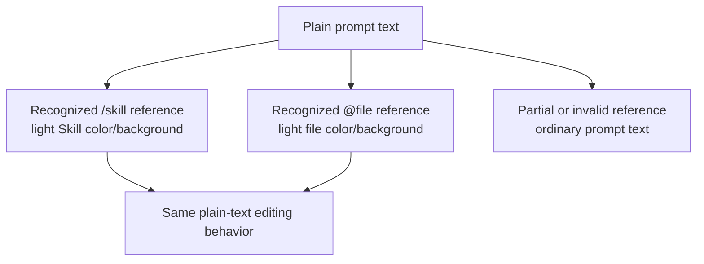
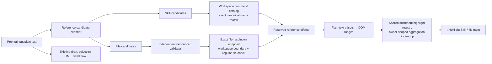

# Prompt Input Semantic References - Plan

## Goal Capsule

- **Objective:** Make valid Skill and workspace-file references easier to recognize in the prompt composer while removing the distracting local sentence-completion feature.
- **Product authority:** This Product Contract defines the user-visible scope for Prompt Input semantic references and completion cleanup.
- **Open blockers:** None.

---

## Product Contract

### Summary

The prompt composer will keep its plain-text editing model while giving recognized `/skill` and `@file` references lightweight semantic styling.
The local n-gram sentence completion will be removed without removing reference pickers or Skill argument hints.

### Problem Frame

Skill and file selections currently return to the composer as visually undifferentiated text, so users must re-read prompt syntax to distinguish an actionable reference from ordinary prose.

The local n-gram completion produces suggestions that are rarely useful, adds persistent visual noise, and has known positioning failures around line breaks.
That feature also carries model training, suggestion state, keyboard handling, rendering, and tests that do not earn their maintenance cost.

### Key Decisions

- **Use lightweight semantic styling rather than atomic tokens.** (session-settled: user-directed — chosen over atomic chips and mixed-strength styling: ordinary caret movement, selection, copying, and character-by-character deletion remain predictable.) Governs R1, R4, R5.
- **Style only references confirmed as valid.** (session-settled: user-directed — chosen over syntax-only styling and picker-origin-only styling: the visual treatment should also communicate that the reference resolves.) Governs R2, R3, R6.
- **Remove only local sentence completion.** (session-settled: user-directed — chosen over removing every automatic prompt aid: pickers and Skill argument hints remain useful and are not the source of the reported noise.) Governs R7, R8, R9.
- **Keep the current plain-text editor architecture.** The native CSS Custom Highlight API is the preferred planning direction because it can style ranges without adding token elements to the editable DOM; a full mention editor is disproportionate for the selected visual behavior. Governs R4, R5, R10.

### Requirements

**Semantic references**

- R1. A recognized Skill reference is visually distinct from ordinary prompt text through a lightweight, theme-compatible treatment.
- R2. A `/skill-name` reference receives Skill styling only when the named Skill exists in the current workspace-visible Skill catalog.
- R3. An `@path` reference receives file styling only when the path resolves to an existing file in the current workspace.
- R4. Styled references remain ordinary editable text rather than atomic or non-editable objects.
- R5. Users can place the caret within a styled reference, select any substring, copy it as its original plain text, and delete it one character at a time.
- R6. A partial, invalid, deleted, or no-longer-resolvable reference renders as ordinary prompt text without an error badge or warning.

**Completion cleanup and retained aids**

- R7. The composer no longer generates or displays local n-gram sentence-completion suggestions after an idle typing delay.
- R8. Tab, Escape, and arrow keys no longer carry sentence-completion accept or dismiss behavior.
- R9. The `/` Skill picker, `@` file picker, toolbar picker entry points, and Skill argument hints keep their current user-visible behavior.
- R10. Removing sentence completion and adding reference styling must not regress multiline input, IME composition, selection, undo and redo, history recall, paste normalization, draft restoration, or send shortcuts.

### Reference Presentation

The diagram shows semantic presentation states, not separate stored token types.

### Key Flows

- F1. Insert a Skill reference
  - **Trigger:** The user chooses a Skill from the picker or finishes typing an exact valid Skill name.
  - **Steps:** The composer retains the original `/skill-name` text, confirms it against the visible Skill catalog, and applies Skill styling.
  - **Outcome:** The reference is distinguishable without changing its editing behavior.
  - **Covered by:** R1, R2, R4, R5.
- F2. Insert a file reference
  - **Trigger:** The user chooses a file from the picker or finishes typing an exact valid workspace path.
  - **Steps:** The composer retains the original `@path` text, confirms it against the workspace, and applies file styling.
  - **Outcome:** The file reference is distinguishable while remaining plain text.
  - **Covered by:** R3, R4, R5.
- F3. Edit or invalidate a reference
  - **Trigger:** The user changes a styled Skill name or file path.
  - **Steps:** The composer re-evaluates the changed text and removes semantic styling when it no longer resolves.
  - **Outcome:** Styling never presents an invalid reference as confirmed.
  - **Covered by:** R2, R3, R6.
- F4. Continue ordinary prompt writing
  - **Trigger:** The user pauses after typing ordinary text or moves through a multiline prompt.
  - **Steps:** No sentence suggestion appears and no completion-specific keyboard path activates.
  - **Outcome:** The composer remains visually stable while retained pickers and Skill hints continue to work.
  - **Covered by:** R7, R8, R9, R10.

### Acceptance Examples

- AE1. Picker-inserted valid Skill
  - **Covers R1, R2, R4, R5.**
  - **Given:** `/ce-code-review` exists in the current Skill catalog.
  - **When:** The user selects it from the Skill picker.
  - **Then:** `/ce-code-review` receives Skill styling, remains plain text, and supports caret placement inside the name.
- AE2. Manually typed valid file
  - **Covers R3, R4, R5.**
  - **Given:** `src/client/components/PromptInput.tsx` exists in the workspace.
  - **When:** The user types `@src/client/components/PromptInput.tsx` without using the picker.
  - **Then:** The exact reference receives file styling and copies as the unchanged full path.
- AE3. Invalidated reference
  - **Covers R2, R3, R6.**
  - **Given:** A Skill or file reference is styled because it currently resolves.
  - **When:** The user edits the reference so it no longer resolves.
  - **Then:** The styling disappears and no warning UI replaces it.
- AE4. Multiline prompt without completion
  - **Covers R7, R8, R10.**
  - **Given:** The user is composing a multiline prompt containing ordinary prose and valid references.
  - **When:** The user pauses, moves across lines, or presses Tab outside a picker.
  - **Then:** No n-gram suggestion appears, no completion is inserted, and reference styling remains aligned with its text.
- AE5. Retained Skill argument hint
  - **Covers R9.**
  - **Given:** A selected Skill supplies an argument hint.
  - **When:** The Skill is inserted through the picker.
  - **Then:** Its existing argument hint can still appear even though sentence completion has been removed.

### Success Criteria

- Valid Skill and file references are distinguishable at a glance without behaving like chips or embedded controls.
- Pausing during ordinary or multiline input never produces an n-gram sentence suggestion.
- Reference styling does not introduce caret drift, misplaced rendering, IME interference, or altered plain-text submission.
- The sentence-completion model, training path, suggestion lifecycle, keyboard acceptance path, and completion-only tests are removed rather than disabled.

### Scope Boundaries

- No atomic chips, whole-token deletion, custom token serialization, or structured rich-text document model.
- No token click actions, hover cards, tooltips, path shortening, or file previews.
- No replacement sentence completion, remote completion service, predictive writing, or broader Prompt IDE work.
- No redesign or removal of Skill, file, or history pickers.
- No removal of Skill argument hints.

### Dependencies / Assumptions

- The app remains Electron-based, so the prompt surface can rely on its bundled Chromium capability rather than supporting an open-ended browser matrix.
- Skill validity is defined by the catalog already visible to the current workspace and session context.
- File validity is bounded to the current workspace and follows the same workspace boundary used by the existing file picker.
- The submitted and persisted prompt remains one plain-text string.

### Sources / Research

- Current composer and insertion behavior: `src/client/components/PromptInput.tsx`.
- Current plain-text editing and selection helpers: `src/client/lib/contenteditable.ts`.
- Current sentence-completion model: `src/client/hooks/useNgramCompletion.ts` and `src/client/lib/ngram-completion.ts`.
- Current shared ghost rendering: `src/client/components/PromptGhostText.tsx`.
- Prior overlay reliability findings: `docs/plans/2026-06-15-001-refactor-remove-prompt-input-markdown-overlay-plan.md`.
- Current `contentEditable` and IME contract: `docs/plans/2026-06-15-002-refactor-prompt-input-contenteditable-ime-plan.md`.
- [CSS Custom Highlight API](https://developer.mozilla.org/en-US/docs/Web/API/CSS_Custom_Highlight_API) — styles arbitrary text ranges without changing DOM structure.
- [CSS Custom Highlight API Module Level 1](https://www.w3.org/TR/css-highlight-api-1/) — standards reference for custom range highlights.
- [Plate Mention](https://platejs.org/docs/mention), [BlockNote custom inline content](https://www.blocknotejs.org/docs/features/custom-schemas/custom-inline-content), [Tiptap Mention](https://tiptap.dev/docs/editor/extensions/nodes/mention), and [Lexical Nodes](https://lexical.dev/docs/concepts/nodes) — structured mention alternatives considered and rejected for this lightweight scope.

Product Contract preservation note: this implementation plan preserves R1–R10, F1–F4, and AE1–AE5 without changing their meaning; the planning details below only resolve how to deliver and verify them.

---

## Planning Contract

### Confirmed Planning Scope

This plan implements the complete brainstorm scope: lightweight styling for valid Skill and workspace-file references, plus deletion of local n-gram sentence completion. It includes the exact file-resolution support and browser-level regression coverage required to make “valid only” styling trustworthy, but excludes adjacent editor redesigns and richer reference interactions.

### Key Technical Decisions

- **KTD1 — Paint semantic references without modifying the editable DOM.** Use the CSS Custom Highlight API with DOM `Range`/`StaticRange` objects over the existing plain-text `contentEditable`. Do not insert wrapper spans, mention nodes, or a second text mirror for reference styling. Feature detection must fail open to ordinary unstyled text so editing and submission remain available even if the API is unavailable. Governs U3; supports R1, R4, R5, R10.
- **KTD2 — Parse only complete whitespace-delimited reference candidates.** A candidate begins at offset zero or immediately after whitespace, starts with `/` or `@`, and continues until the next whitespace or end of input. Skill validity is exact membership in the current command catalog’s canonical `name` values; file validity is an exact workspace-relative path match. Partial and syntactically similar prose remain ordinary text. Governs U2; supports R2, R3, R6.
- **KTD3 — Add a bounded exact-file resolution endpoint instead of borrowing picker search state.** The client sends the unique `@path` candidates in one request; the server resolves each candidate against the canonical workspace root, rejects traversal and escaping symlinks, and returns only existing regular-file paths. The endpoint must cap request count and path length and must not read file contents. Governs U1 and U2; supports R3, R6, R10.
- **KTD4 — Isolate asynchronous validation from picker behavior.** Reference validation uses its own hook/cache, debounce, abort controller, and generation key scoped by workspace and current candidate set. It must not call or mutate `useFilesStore`, because that store represents one active picker query. Stale, failed, or aborted validation resolves to no file styling and never surfaces warning UI. Positive results are rechecked after their cache lifetime and on composer refocus so removed files do not remain indefinitely confirmed. Governs U2; supports R3, R6, R10.
- **KTD5 — Coordinate the document-global highlight registry.** Static CSS highlight names are shared across the document, so a module-level registry manager owns per-composer Skill and file ranges, rebuilds aggregate highlights when any owner changes, and removes an owner’s ranges on unmount. Use `StaticRange` where supported because the composer recreates ranges after text changes; the W3C specification recommends static ranges when authors already observe DOM changes. Governs U3; supports R1, R3, R6, R10.
- **KTD6 — Make the plain-text traversal model authoritative for both values and ranges.** Extend the existing contentEditable helpers with an offset-to-range function that follows the same text-node, ` `, `
`, and `
` newline rules as `extractPlainText`. Do not rely on `textContent` offsets in the fallback `contentEditable="true"` DOM shape. Governs U3; supports R4, R5, R10.
- **KTD7 — Delete sentence completion rather than feature-flagging it.** Remove the n-gram model, hook, training call, suggestion state/effect, completion keyboard branch, and completion-only tests. Narrow `PromptGhostText` to the retained Skill argument-hint responsibility; keep `useSentPrompts` because HistoryPicker still consumes it. Governs U4; supports R7, R8, R9, R10.
- **KTD8 — Add no new editor or runtime dependency.** Electron 43 embeds Chromium 150, while CSS Custom Highlight has long been available in Chromium. Existing TypeScript DOM declarations already include `Highlight`, `HighlightRegistry`, and `CSS.highlights`. CodeMirror and structured mention frameworks remain unused for this feature. Governs U3 and the verification contract.

### High-Level Technical Design

The recognition path is presentation-only. It derives ranges from the existing draft string and never becomes the source of truth for text, selection, serialization, or submission. Validation may lag behind typing, but stale validation is not allowed to paint stale offsets.

### Data and API Contract

#### Reference candidates

- The scanner returns `{ kind, value, start, end }` records where `start` includes the `/` or `@` and `end` is the exclusive plain-text offset.
- Empty triggers (`/`, `@`) and tokens preceded by non-whitespace are not resolvable references.
- The scanner preserves exact casing and path characters. Resolution decides validity; parsing does not normalize user text.
- Duplicate candidates retain separate ranges but share one validity lookup.
- A reference cannot cross whitespace or a newline. This matches the current picker insertion format and trigger filtering behavior.

#### Exact file resolution

- Add a workspace-scoped batch route under the existing files router accepting a JSON body with `paths: string[]`.
- Keep the route beneath the existing authenticated `/api/workspaces/:id/files` mount so it inherits the server's default-deny loopback authentication and state-changing request guard; do not add an unauthenticated parallel route.
- Return a stable response containing the subset of input paths that resolve to regular files beneath the canonical workspace root. Preserve the original workspace-relative spelling used by the client for set membership.
- Accept at most 64 unique candidates, at most 4,096 UTF-16 code units per candidate, and at most 64 KiB of candidate text per request. Reject malformed or over-limit bodies before filesystem work; ignore empty values, absolute paths, NUL-containing paths, traversal outside the workspace, symlinks escaping the workspace, and directories.
- A missing file is an ordinary negative result, not an exceptional response. A missing workspace or malformed request follows existing route error conventions.
- Share the existing canonical path-boundary helper rather than implementing weaker string-prefix validation in the new handler.

#### Client validation lifecycle

- Derive a stable sorted set of unique file candidates from the current draft.
- Debounce requests so a partially typed path does not issue a request for every character.
- Abort the prior request and increment a generation when the workspace or candidate set changes; commit results only when both still match.
- Cache exact results per workspace for at most five seconds. Revalidate expired entries and visible references when the editable surface regains focus.
- While validation is pending or unavailable, render the candidate as ordinary text. Never retain the prior valid style at a changed offset or changed value.

#### Highlight ownership

- Use two static registry keys, one for Skill ranges and one for file ranges, with CSS rules scoped to the composer surface.
- Each mounted composer owns an opaque identifier and publishes its current ranges to the shared manager.
- Updating one owner replaces only that owner’s ranges; unmounting removes only that owner. When no owners remain, remove the registry entries.
- Rebuild ranges after DOM content synchronization, draft/session change, command-catalog change, and file-validation result change.
- The Highlight API styles foreground/background/text decoration only; the selected lightweight design must not depend on chip padding, borders, rounded boxes, or layout-affecting properties.

### Error and Degraded-State Behavior

- Command catalog loading, partial catalog state, or catalog errors produce no false-positive Skill styling. When the catalog later arrives, matching references become styled without changing the draft.
- File validation loading, abort, network failure, or server failure produces ordinary unstyled text and no inline error UI.
- Unsupported Highlight API leaves all references unstyled but preserves every editing and submission behavior.
- A DOM offset that cannot be mapped safely is skipped individually; it must not throw from an input event or clear other valid ranges.
- Session/workspace changes invalidate pending requests and owner ranges before new results can paint.

---

## Implementation Units

### U1. Add secure batch resolution for exact workspace files

- **Goal:** Provide a side-effect-free server contract that answers whether candidate `@path` values name existing workspace files.
- **Requirements:** R3, R6, R10.
- **Dependencies:** None.
- **Files:**
  - `src/server/routes/files.ts`
  - `src/server/routes/files.test.ts`
- **Approach:**
  - Extract or reuse the existing canonical workspace-path resolution logic so the new endpoint and content endpoint enforce the same boundary and symlink policy.
  - Add the bounded batch handler described in the Data and API Contract.
  - Resolve candidates independently so one missing or invalid path does not invalidate valid siblings.
  - Use `stat().isFile()` after canonical resolution; directories must not be returned as valid file references.
- **Test scenarios:**
  - Returns exact existing regular files and omits missing files from a mixed batch.
  - Rejects malformed bodies and enforces batch/path limits.
  - Omits absolute paths, parent traversal, sibling-prefix escapes, escaping symlinks, directories, and NUL-containing input.
  - Returns workspace-not-found using the established files-route convention.
- **Verification:** Targeted server route tests pass before client integration begins.

### U2. Parse references and resolve validity independently of pickers

- **Goal:** Convert a draft into stable semantic reference records without changing picker state or the draft itself.
- **Requirements:** R2, R3, R6, R9, R10.
- **Dependencies:** U1.
- **Files:**
  - `src/client/lib/prompt-references.ts` (new)
  - `src/client/lib/prompt-references.test.ts` (new)
  - `src/client/hooks/usePromptReferenceValidation.ts` (new)
  - `src/client/hooks/usePromptReferenceValidation.test.ts` (new)
  - `src/client/components/PromptInput.tsx`
- **Approach:**
  - Implement the pure candidate scanner once and cover its offset semantics with table-driven tests.
  - Read the current workspace command catalog through `useCommands`, call its deduplicated `fetch()` when the composer mounts or the workspace changes, and match only exact canonical names. Manual and restored Skill references must not depend on the user opening CommandPicker first.
  - Implement the file-validation lifecycle from KTD4 against the U1 endpoint, with no calls to `useFilesStore`.
  - Combine synchronous Skill validity and asynchronous file validity into resolved records whose offsets still correspond to the current input generation.
- **Test scenarios:**
  - Recognizes valid references at input start and after spaces/newlines, including multiple and repeated references.
  - Leaves mid-word triggers, empty triggers, partial names, unknown Skills, missing paths, and punctuation-altered nonmatches unresolved.
  - Revalidates when workspace, draft candidates, catalog, or focus changes.
  - Drops an older response that arrives after a new draft or workspace is active.
  - Does not mutate file-picker results, loading state, filter text, or open state.
- **Verification:** Pure scanner and hook tests pass under the jsdom project with mocked fetch timing and abort behavior.

### U3. Paint resolved references with owner-safe CSS highlights

- **Goal:** Apply the selected lightweight visual treatment while keeping the editable DOM and plain-text behavior unchanged.
- **Requirements:** R1, R3, R4, R5, R6, R10.
- **Dependencies:** U2.
- **Files:**
  - `src/client/lib/contenteditable.ts`
  - `src/client/components/contenteditable.test.ts`
  - `src/client/lib/prompt-reference-highlights.ts` (new)
  - `src/client/components/PromptInput.tsx`
  - `src/client/index.css`
  - `src/client/components/PromptInput.browser.test.tsx`
- **Approach:**
  - Refactor the contentEditable traversal into shared offset segments and add a helper that creates a DOM range from plain-text offsets using the same newline model as extraction.
  - Implement the owner-scoped shared highlight manager from KTD5, including feature detection and complete cleanup.
  - Publish resolved ranges from `PromptInput` only after the uncontrolled DOM content matches the draft generation used for recognition.
  - Add subtle, theme-token-based Skill and file colors/backgrounds through static `::highlight()` rules. Preserve native selection visibility and avoid layout-affecting styles.
- **Test scenarios:**
  - Maps offsets correctly in `plaintext-only` text nodes and fallback block/` ` DOM, including empty lines.
  - Registry ranges contain exactly the valid reference text for picker-inserted and manually typed references.
  - Editing one character removes the old highlight until the new value validates; copy and send still yield unchanged plain text.
  - Multiple references and multiple mounted composers aggregate correctly; updating or unmounting one composer does not erase the other.
  - Session switch, clear, history recall, external draft restoration, and unmount remove stale ranges.
  - IME composition, selection across a reference, character deletion, undo/redo, paste, wrapping, and multiline input retain existing behavior.
  - Missing Highlight API degrades to an ordinary functional composer.
- **Verification:** Browser-mode tests inspect both `CSS.highlights` ranges and user-visible editing behavior in real Chromium; a manual Electron pass checks light/dark visual contrast and native selection overlap.

### U4. Remove local sentence completion and narrow ghost rendering

- **Goal:** Delete the distracting n-gram feature while preserving Skill argument hints and prompt history.
- **Requirements:** R7, R8, R9, R10.
- **Dependencies:** None; may proceed alongside U1–U3, then merge into U3 integration tests.
- **Files:**
  - `src/client/components/PromptInput.tsx`
  - `src/client/components/PromptGhostText.tsx`
  - `src/client/components/PromptGhostText.test.tsx`
  - `src/client/components/PromptGhostText.browser.test.tsx`
  - `src/client/components/PromptInput.browser.test.tsx`
  - `src/client/hooks/useNgramCompletion.ts` (delete)
  - `src/client/hooks/ngram-completion.test.ts` (delete)
  - `src/client/lib/ngram-completion.ts` (delete)
- **Approach:**
  - Remove completion imports, suggestion/training calls, state, debounce effect, resets, and completion-specific Tab/Escape/arrow handling from `PromptInput`.
  - Remove the `completionSuggestion` prop and fallback branch from `PromptGhostText`; retain only the existing argument-hint condition and mirror alignment needed by that hint.
  - Delete the model and hook files rather than leaving dormant code or a feature flag.
  - Keep `useSentPrompts` and its tests because history browsing still depends on it.
- **Test scenarios:**
  - Repeated sent prompts no longer produce suggestion text after the idle interval.
  - Tab outside a picker follows normal browser focus behavior and never inserts predicted text; Escape and arrows have no completion-only branch.
  - Skill selection still shows its argument hint and typing beyond the inserted command still removes that hint.
  - Slash/file picker Tab behavior is unchanged while a picker is open.
- **Verification:** No source imports or references `useNgramCompletion`, `TrigramCompletion`, or `completionSuggestion`; retained picker, hint, and history tests pass.

---

## Integration Sequence

1. Implement and verify U1 so exact file validity has a secure contract.
2. Implement U2 against the fixed endpoint and prove stale-response isolation before rendering ranges.
3. Implement U3, first the offset mapper, then shared registry ownership, then `PromptInput` integration and styling.
4. Implement U4 cleanup and update overlapping browser tests so the final suite asserts both the absence of completion and the presence of semantic styling.
5. Run targeted gates after each unit, then the full verification contract and manual Electron checks.

U4 is code-independent from U1/U2, but its browser-test edits overlap U3. Apply its production cleanup early if useful, then reconcile test files once to avoid competing rewrites.

---

## Verification Contract

### Automated gates

1. **Server path-safety contract**
   - `npx tsx -r ./src/server/test-utils/test-env.ts --test --test-force-exit src/server/routes/files.test.ts`
   - Proves exact-file resolution, workspace confinement, symlink handling, limits, and mixed batches.
2. **Client unit contract**
   - `npx vitest run --project jsdom src/client/lib/prompt-references.test.ts src/client/hooks/usePromptReferenceValidation.test.ts src/client/components/contenteditable.test.ts src/client/components/PromptGhostText.test.tsx`
   - Proves parsing, validity lifecycle, offset traversal, and retained argument-hint behavior.
3. **Real-browser composer contract**
   - `npm run test:browser -- src/client/components/PromptInput.browser.test.tsx src/client/components/PromptGhostText.browser.test.tsx`
   - Proves real Range/Highlight behavior, editing invariants, stale cleanup, multiline layout, and completion absence.
4. **Static correctness**
   - `npm run typecheck`
   - `npm run lint`
5. **Full affected-suite regression**
   - `npm run test:client`
   - `npm run test:browser`
   - `npm run test:server`

If an exact targeted command differs under the installed toolchain, use the repository script that runs the same project/file set and record the equivalent command in the implementation handoff; do not skip the gate.

### Manual Electron checks

- In both light and dark themes, compare ordinary text, a valid Skill, a valid file, and invalid variants; treatments must be visible but quieter than selection or error UI.
- Type Chinese with an IME before, inside, and after a styled reference; commit composition, move the caret, and submit without duplicated text or cursor jumps.
- Create a wrapped multiline prompt containing multiple references, select across them, copy/paste, undo/redo, and delete inside each reference one character at a time.
- Keep New Chat and an existing session composer mounted or switch rapidly between them; verify highlights do not leak, disappear incorrectly, or return from stale file validation.
- Delete or rename a referenced file, refocus the composer, and verify styling returns to ordinary text without an error badge.
- Pause after repeated prose and press Tab/Escape/arrows; verify no sentence suggestion appears or is inserted, while picker keyboard handling and the existing whole-command Skill argument hint still work.

### Acceptance traceability

| Acceptance example | Primary automated coverage | Manual confirmation |
|---|---|---|
| AE1 Picker-inserted valid Skill | U2 scanner tests; U3 PromptInput browser test | Caret, selection, and deletion inside styled Skill |
| AE2 Manually typed valid file | U1 route tests; U2 validation tests; U3 browser test | Exact path appearance and unchanged copy text |
| AE3 Invalidated reference | U2 stale/negative tests; U3 edit and cleanup tests | Delete/rename file then refocus |
| AE4 Multiline prompt without completion | U3/U4 browser tests | Wrapped multiline input and keyboard pass |
| AE5 Retained Skill argument hint | U4 component and browser tests | Picker insertion and final-line alignment |

---

## Risks and Mitigations

- **Global registry collision:** `CSS.highlights` is document-global and naïve component effects overwrite one another. Mitigate with the owner-scoped aggregate manager and explicit multi-composer tests.
- **Offset drift:** The fallback editable DOM represents newlines as elements rather than text characters. Mitigate by sharing traversal semantics with `extractPlainText` and refusing to paint unmappable ranges.
- **Stale async styling:** A slow validation response can otherwise paint ranges from an old draft or workspace. Mitigate with abort plus generation matching and tests that resolve requests out of order.
- **Filesystem load:** Exact validation on every keystroke could cause excess I/O. Mitigate with unique-candidate batching, debounce, capped requests, and bounded cache lifetime.
- **False confirmation:** Fuzzy search results or syntax-only matching would style invalid references. Mitigate with a dedicated exact route and canonical command-name membership.
- **Native selection contrast:** Custom background/foreground styling may compete with `::selection`. Mitigate with restrained theme tokens and manual light/dark selection checks.
- **Regression to the removed overlay pattern:** Adding wrapper or mirror text could revive IME/caret defects documented in the prior plans. Mitigate by treating “no editable DOM mutation for styling” as a hard implementation constraint.

---

## Definition of Done

- R1–R10 and AE1–AE5 are covered by the implementation and the traceability table above.
- Valid canonical `/skill-name` and exact existing `@path` references receive distinct lightweight styles; invalid or pending candidates remain ordinary text.
- Reference styling never changes the editable DOM’s plain-text content, submitted prompt, persisted draft, copy result, or character-level editing behavior.
- Multiple mounted composers, session/workspace changes, unmounts, and out-of-order validation responses leave no stale highlight ranges.
- The n-gram model, hook, training path, suggestion lifecycle, keyboard acceptance/dismissal path, and completion-only tests are deleted with no remaining source references.
- Slash and file pickers, toolbar entry points, Skill argument hints, history, IME, multiline input, paste, selection, undo/redo, and send shortcuts pass their relevant regressions.
- Targeted and full automated gates pass, and the manual Electron checks show acceptable light/dark contrast with no caret or IME regression.
- No new editor framework or runtime dependency is added.

---

## External Implementation Notes

- The [CSS Custom Highlight API specification](https://www.w3.org/TR/css-highlight-api-1/) defines highlights as arbitrary ranges registered per document without changing the underlying DOM; it also documents registry stacking and recommends `StaticRange` when authors recreate ranges after DOM changes.
- The [CSS Pseudo-Elements Level 4 specification](https://www.w3.org/TR/css-pseudo-4/#highlight-styling) limits highlight styling to paint-oriented properties, which matches the selected lightweight direction and rules out chip-like padding/borders through this API.
- [Electron’s release schedule](https://releases.electronjs.org/schedule) maps Electron 43 to Chromium M150, so the packaged runtime has ample Custom Highlight support. Feature detection remains required to keep tests and non-Electron development surfaces safe.
- Plate, BlockNote, Tiptap, and Lexical demonstrate structured mention nodes and suggestion menus, but adopting their document models would expand serialization, selection, undo, and IME scope without providing value required by this plan.
