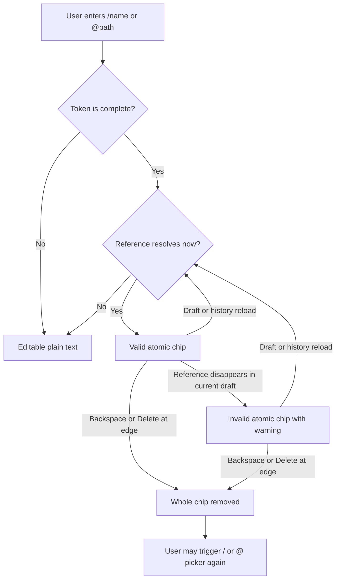
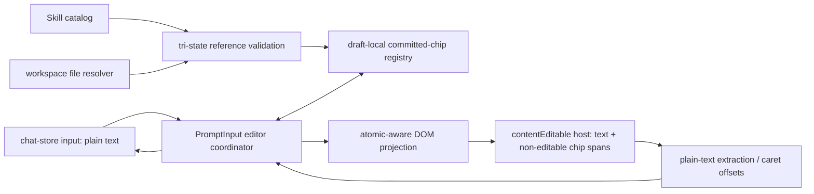
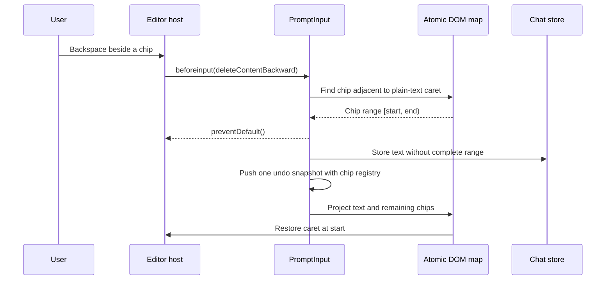

# Atomic Prompt References - Plan

## Goal Capsule

- **Objective:** Turn resolved Skill and workspace-file references into lightweight atomic chips that cannot be edited accidentally and can be removed in one action before the user inserts a replacement through the existing picker.
- **Product authority:** This Product Contract defines the user-visible creation, navigation, deletion, validity, and reload behavior of atomic prompt references.
- **Implementation authority:** The Planning Contract below defines the DOM projection, validation state, draft-local identity, editing interception, test strategy, and cleanup required to deliver the Product Contract.
- **Stop conditions:** Stop and re-plan if plain-text prompt storage would need to change, if reliable atomic deletion cannot be implemented with cancelable `beforeinput` events in the supported Electron runtime, or if IME compatibility requires adopting a new editor framework.
- **Execution profile:** Four dependency-ordered implementation units; test the DOM primitives and validation model before integrating them into `PromptInput`.
- **Tail ownership:** The implementer owns targeted tests, browser interaction coverage, typecheck, lint, documentation updates, legacy highlight removal, and final regression verification.
- **Open blockers:** None.

---

## Product Contract

### Summary

Resolved `/skill` and `@file` references will become lightweight atomic chips after the user finishes entering them.
The chips keep plain-text prompt semantics while preventing partial edits, and invalid chips remain visibly removable for the lifetime of the current draft.

### Problem Frame

Semantic references currently look distinct but still behave like ordinary character ranges.
Users can place the caret inside a reference and partially modify it, leaving a broken Skill name or file path without an obvious recovery path.
Reopening a picker from every possible internal edit would add state and cursor rules to an interaction whose intended outcome is usually replacement rather than repair.

### Key Decisions

- **Use atomic chips instead of reopening a picker during reference edits.** (session-settled: user-directed — chosen over making existing references editable with automatic picker reactivation: whole-reference deletion followed by the existing `/` or `@` flow is simpler and predictable.) Governs R1, R4, R5, R10.
- **Use a lightweight chip treatment.** (session-settled: user-directed — chosen over ordinary semantic highlighting and hover-only boundaries: the visual form should communicate the atomic editing behavior without adding a close button.) Governs R1, R6.
- **Atomize only references that resolve.** (session-settled: user-directed — chosen over treating every `/xxx` or `@xxx` token as atomic: ordinary paths, handles, and unresolved text must remain editable.) Governs R2, R8, R9.
- **Commit hand-typed references only at a token boundary.** (session-settled: user-directed — chosen over atomizing on the first valid prefix or waiting for input blur: users must be able to finish longer names whose prefix is already valid.) Governs R3.
- **Keep lost validity within the current draft, not across reloads.** (session-settled: user-directed — chosen over persistent token identity and unconditional syntax atomization: an invalidated chip stays atomic in memory, while reload reparses the plain text against current resolvers.) Governs R7, R8.
- **Expose invalidity on the chip itself.** (session-settled: user-directed — chosen over leaving invalid chips visually unchanged or warning only at submission: users should see and understand stale references before sending.) Governs R7.

### Requirements

**Creation and recognition**

- R1. A resolved Skill or workspace-file reference is presented as a lightweight chip with a rounded, theme-compatible background and no embedded close button.
- R2. A token becomes a chip only when `/name` resolves through the current Skill catalog or `@path` resolves to a file in the current workspace.
- R3. A hand-typed token is evaluated for atomization only when the user enters a space or newline after it, or submits the prompt; picker selection, paste, and history or draft restoration may evaluate complete tokens immediately.

**Atomic editing behavior**

- R4. The caret cannot rest inside a chip, and keyboard or pointer navigation treats the chip as one unit.
- R5. Backspace or Delete from the adjacent edge removes the entire chip in one action without leaving a partial `/name` or `@path` suffix.
- R6. Whole-chip selection, copying, draft storage, and prompt submission preserve the reference's original plain-text form.

**Validity lifecycle**

- R7. A chip that stops resolving during the current draft remains atomic and shows a lightweight warning treatment with an accessible explanation of the lost reference.
- R8. When a draft or historical prompt is loaded, currently resolved references become chips and unresolved text remains ordinary editable text, even if that text represented a chip before reload.
- R9. Partial tokens, invalid references, ordinary absolute paths such as `/usr/bin/node`, and handles such as `@alice` remain ordinary editable text unless they resolve under R2.

**Recovery and compatibility**

- R10. Replacing a chip requires deleting it as a whole and then using the existing `/` or `@` trigger or toolbar entry point; editing inside a chip does not reopen a picker.
- R11. Chip behavior must preserve multiline input, IME composition, undo and redo, plain-text paste, history recall, draft switching, selection, copy, and send shortcuts.

### Reference Lifecycle

The lifecycle is draft-local: plain text is the durable prompt representation, while chip identity is reconstructed from current resolution state when content is loaded.

### Key Flows

- F1. Create an atomic reference
  - **Trigger:** The user selects a picker result, pastes or restores complete prompt text, or finishes a hand-typed token with a space, newline, or submission.
  - **Steps:** The composer evaluates the complete token under R2 and converts a resolved reference to the chip presentation in R1.
  - **Outcome:** Valid references become atomic without locking a valid prefix before the user finishes typing.
  - **Covered by:** R1, R2, R3, R6.

- F2. Remove and replace a reference
  - **Trigger:** The caret reaches either edge of a valid or invalid chip and the user presses the deletion key directed toward it.
  - **Steps:** The composer removes the whole chip, restores an ordinary caret position, and leaves the existing `/`, `@`, and toolbar picker entry points available.
  - **Outcome:** No partial reference remains, and replacement uses the established picker flow.
  - **Covered by:** R4, R5, R10.

- F3. Handle a reference that loses validity
  - **Trigger:** A referenced file disappears or a referenced Skill stops resolving while the draft remains open.
  - **Steps:** The chip remains atomic, changes to the invalid treatment, and exposes an accessible explanation; a later reload reparses its plain text under current resolution state.
  - **Outcome:** The user can identify and remove the stale reference without requiring persistent structured-token metadata.
  - **Covered by:** R7, R8.

### Acceptance Examples

- AE1. Picker insertion becomes atomic immediately
  - **Covers R1, R2, R3, R6.**
  - **Given:** A picker result resolves to the Skill `commit`.
  - **When:** The user selects it.
  - **Then:** `/commit` appears as one lightweight chip, while copying or sending produces the plain text `/commit`.

- AE2. A valid prefix does not lock early
  - **Covers R2, R3.**
  - **Given:** `/commit` is valid and the user intends to type `/commit-extra`.
  - **When:** The draft currently contains `/commit` but no token boundary has been entered.
  - **Then:** The text remains editable so the user can continue typing; atomization is evaluated only after the token is completed.

- AE3. Edge deletion removes the whole chip
  - **Covers R4, R5, R10.**
  - **Given:** The caret is immediately after an `@src/app.ts` chip.
  - **When:** The user presses Backspace once.
  - **Then:** The complete chip is removed, no partial path remains, and typing `@` can open the file picker again.

- AE4. Invalidity remains visible during the draft
  - **Covers R7.**
  - **Given:** `@src/app.ts` is already a chip in an open draft.
  - **When:** The file is deleted before the prompt is sent.
  - **Then:** The chip remains atomic, displays the invalid treatment, and exposes an accessible explanation that the file no longer resolves.

- AE5. Reload does not preserve stale token identity
  - **Covers R2, R8.**
  - **Given:** A saved draft contains the plain text `@src/app.ts`, but the file no longer exists when the draft is loaded.
  - **When:** The composer reconstructs the draft.
  - **Then:** `@src/app.ts` appears as ordinary editable text rather than an invalid chip.

- AE6. Ordinary slash and at-sign text remains editable
  - **Covers R2, R9.**
  - **Given:** Neither `/usr/bin/node` nor `@alice` resolves as a prompt reference.
  - **When:** The user finishes or pastes those tokens.
  - **Then:** Both remain ordinary text with normal character-level caret and deletion behavior.

- AE7. Atomic behavior survives core composer interactions
  - **Covers R6, R11.**
  - **Given:** A draft contains chips alongside CJK text and multiple lines.
  - **When:** The user composes with IME, selects across a chip, performs undo and redo, switches drafts, copies, and submits.
  - **Then:** Text integrity and existing composer shortcuts are preserved, and each currently resolved reference reconstructs as one chip after reload.

### Scope Boundaries

- No character-level editing, partial selection, or caret placement inside a chip.
- No picker reactivation from an attempt to edit inside an existing chip.
- No embedded close button or heavier attachment-card presentation.
- No unconditional atomization based only on `/xxx` or `@xxx` syntax.
- No persistent structured identity for chips across draft reloads, history restoration, application restarts, or workspace changes.
- No change to Skill discovery, file search, picker filtering, or picker result ranking.

### Dependencies and Assumptions

- Skill and file validity continue to use the same workspace-scoped resolution authorities as the existing semantic-reference behavior.
- The durable prompt and draft representation remains plain text; atomicity is an editor presentation and interaction state.
- The composer can observe validity changes while a draft is open closely enough to apply R7 before submission.

### Sources

- `src/client/components/PromptInput.tsx` — current picker triggers, caret handling, plain-text draft synchronization, and reference highlighting surface.
- `src/client/lib/prompt-references.ts` — current parsing and resolution boundary for Skill and file references.
- `src/client/lib/prompt-reference-highlights.ts` — current non-atomic semantic presentation behavior that this contract replaces.
- `docs/plans/2026-08-16-1922-feat-prompt-input-semantic-references-plan.md` — prior Product Contract whose ordinary-text editing decisions are superseded for reference interaction by this plan.

---

## Planning Contract

The Product Contract above is unchanged. This section translates R1–R11 and AE1–AE7 into an implementation-ready sequence without broadening the feature.

### Key Technical Decisions

- **KTD1 — Project chips into the existing editor DOM.** (session-settled: user-approved — chosen over a rich-text editor dependency: the confirmed scope extends the existing composer and keeps the change narrow.) Keep `PromptInput` as the editor owner and replace CSS Highlight projection with inline `contenteditable="false"` spans inside the existing editing host. This provides rounded chip styling, pointer semantics, accessible invalid state, and native atomic boundaries. Governs R1, R4, R6, R7.
- **KTD2 — Keep plain text authoritative.** (session-settled: user-approved — chosen over persisted structured tokens: reload must reconstruct identity from current resolution state.) The chat store, prompt history, draft persistence, clipboard output, and submitted prompt remain strings. A chip is a draft-local projection of a plain-text range plus validation metadata. Governs R6, R8.
- **KTD3 — Centralize atomic-aware offset mapping.** (session-settled: user-approved — chosen over local DOM walks in each event handler: one mapping authority prevents caret and extraction rules from drifting.) Add one DOM helper that understands text nodes, line breaks, and chip nodes. All extraction, caret restoration, selection offsets, projection, and adjacent-chip lookup use that helper. Native ordinary input synchronizes its already-current DOM to the string store without reprojection; projection runs only when chip structure/status changes or external text is loaded. Governs R4, R5, R6, R11.
- **KTD4 — Make validation tri-state and monotonic during refresh.** (session-settled: user-approved — chosen over clearing validity on every refresh: pending work and resolver failures must not create false warnings.) Expose candidate status as `pending`, `valid`, or `invalid`. Preserve the last confirmed status during an in-flight refresh or resolver error; only a confirmed negative result may add the invalid treatment. Governs R2, R7, R8, R9.
- **KTD5 — Track committed chips in the current draft snapshot.** (session-settled: user-approved — chosen over deriving identity from syntax after every keystroke: the confirmed creation and invalidation lifecycle needs draft-local memory.) Picker selection commits immediately; paste, drop, history, and draft restoration may commit complete references immediately; hand typing commits only at the R3 boundary. Once committed, a chip remains in the draft-local registry even if it becomes invalid. Custom undo/redo snapshots include this registry alongside text and caret. Governs R3, R7, R8, R11.
- **KTD6 — Intercept deletion at `beforeinput`.** (session-settled: user-approved — chosen over keydown-only deletion: canceling the edit before DOM mutation gives Backspace and Delete one atomic path.) Handle `deleteContentBackward` and `deleteContentForward` before the browser mutates the DOM. If the deletion direction targets an adjacent chip, prevent the native edit, remove its complete plain-text range, record one undo step, and restore the caret at the removed boundary. `keydown` remains responsible for picker and submission routing. Governs R4, R5, R10, R11.
- **KTD7 — Refresh validity at bounded checkpoints.** (session-settled: user-approved — chosen over polling or a global watcher: focus and pre-send checks cover the open-draft warning contract without widening system scope.) Refresh on composer focus and immediately before send, in addition to existing catalog/workspace updates. A resolver error does not block sending; a confirmed invalid result updates the open draft chip before submission proceeds. Governs R7.
- **KTD8 — Preserve the plain-text input contract after enabling element children.** (session-settled: user-approved — chosen over retaining `plaintext-only`: the host must allow non-editable chip elements while continuing to reject rich input.) Use `contentEditable="true"`, continue sanitizing paste and drop to plain text, reject rich formatting input paths in `beforeinput`, and keep composition guards around DOM projection. Governs R6, R11.
- **KTD9 — Express invalidity accessibly.** (session-settled: user-approved — chosen over color- or hover-only feedback: stale references must be understandable to keyboard and assistive-technology users.) A stale chip receives a warning class and state attribute plus a localized accessible label explaining that the Skill or file no longer resolves. The chip remains removable through the same atomic keyboard behavior. Governs R1, R7.

### Technical Topology

### System-Wide Impact

- **Data and persistence:** No schema, IPC contract, or persisted draft format changes. Existing strings remain compatible with older versions and external consumers.
- **State and lifecycle:** `PromptInput` gains ephemeral committed-chip metadata. That state resets when the workspace/session draft source changes and is rebuilt only from currently resolvable references, satisfying R8.
- **Validation:** The existing hook evolves from “valid ranges only” to candidate status. Skill loading, workspace changes, focus refresh, and pre-send refresh share the same status authority.
- **Editor behavior:** The root can no longer rely on `plaintext-only`; paste/drop and `beforeinput` protections become the enforcement boundary for plain-text editing.
- **Accessibility and localization:** Invalid-reference text is added to English and Simplified Chinese chat resources. Chip state is conveyed semantically and visually.
- **Documentation:** The English and Simplified Chinese prompt-input feature pages explain atomic reference removal and replacement.
- **Agent-native parity:** Not material. The submitted prompt and all durable interfaces remain the same plain text; this feature changes only direct-manipulation behavior in the visual composer.

### Alternatives Considered

- **Keep CSS Highlights and intercept only keyboard edits:** Rejected because highlights cannot supply a rounded atomic element, pointer boundary, focusable semantics, or accessible per-reference invalid state.
- **Render editor children declaratively through React:** Rejected because React reconciliation would compete with browser-owned selection and IME composition inside `contentEditable`. Projection should be imperative and guarded.
- **Adopt a rich-text editor framework:** Rejected for this scope because the durable model remains plain text and the required node behavior is narrow. The dependency and migration cost would exceed the product change.
- **Persist structured token identity:** Rejected by R8 and the product decision that reload reparses current validity from plain text.

### Risks and Mitigations

- **DOM/plain-text offset drift:** A chip visually occupies one node but represents several characters. Mitigate with KTD3, invariant tests for round-trip extraction, and one shared mapping implementation.
- **IME disruption from DOM replacement:** Projection during composition can cancel or duplicate composed text. Mitigate by deferring reconciliation until `compositionend` and covering CJK composition in browser tests.
- **Rich content entering `contentEditable="true"`:** Mitigate with existing plain-text paste/drop normalization plus explicit `beforeinput` guards and regression tests.
- **Transient invalid state during asynchronous refresh:** Mitigate with KTD4; pending and resolver error retain the last confirmed state.
- **Undo restoring text but not atomic identity:** Mitigate with KTD5 by versioning the local snapshot shape and restoring the committed registry atomically with text and caret.
- **Browser-dependent deletion behavior:** Mitigate with KTD6 and browser tests on the repository's Electron/Chromium-backed Vitest project. If supported `beforeinput` is not cancelable for the required deletion types, hit the Goal Capsule stop condition.

### Research Basis

- [`src/client/components/PromptInput.tsx`](../../src/client/components/PromptInput.tsx) — existing plain-text synchronization, picker insertion, paste/drop handling, custom undo stack, IME guard, and CSS Highlight projection.
- [`src/client/lib/contenteditable.ts`](../../src/client/lib/contenteditable.ts) — existing text extraction, offset, range, selection, and replacement primitives to consolidate behind the atomic-aware map.
- [`src/client/hooks/usePromptReferenceValidation.ts`](../../src/client/hooks/usePromptReferenceValidation.ts) — current debounced, cached resolver flow that must expose candidate states without clearing confirmed results during refresh.
- [`src/client/lib/prompt-references.ts`](../../src/client/lib/prompt-references.ts) — existing reference scanning rules; retain its resolver authority rather than introducing syntax-only atomization.
- [`src/client/index.css`](../../src/client/index.css) — current CSS Highlight presentation to replace with chip classes.
- [W3C Input Events Level 2](https://www.w3.org/TR/input-events-2/) — defines cancelable `beforeinput`, deletion input types, target ranges, and composition-related behavior used by KTD6 and KTD8.
- [W3C ContentEditable](https://www.w3.org/TR/content-editable/) and [WHATWG HTML editing hosts](https://html.spec.whatwg.org/multipage/interaction.html) — define editing-host states and support the choice to enforce plain-text behavior around an element-capable host.
- [Playwright keyboard input](https://playwright.dev/docs/input) — supports explicit Backspace, Delete, and arrow-key acceptance coverage.

## Implementation Units

### U1 — Atomic-Aware Editor DOM Primitives

**Covers:** R4, R5, R6, R11; realizes F2 and enables AE3 and AE7.

**Dependencies:** None.

**Files:**

- Modify `src/client/lib/contenteditable.ts`.
- Add `src/client/lib/prompt-reference-chips.ts`.
- Modify `src/client/components/contenteditable.test.ts`.
- Add `src/client/lib/prompt-reference-chips.browser.test.tsx`; U4 owns removal of the legacy highlight test after replacement coverage passes.

**Approach:**

1. Define a DOM segment model for ordinary text, normalized line breaks, and chip nodes whose `data-reference-*` attributes contain their plain text, kind, stable draft-local key, and validity state.
2. Implement projection from authoritative text plus committed ranges into DOM nodes. Escape/render all reference text through DOM text APIs; never inject HTML.
3. Implement inverse extraction and offset mapping so text → DOM → text is lossless and every legal caret offset maps immediately before or after a chip, never inside it.
4. Add selection restoration and normalization helpers for collapsed carets, selections spanning a chip, pointer placement, and arrow movement fallbacks.
5. Add adjacent-chip lookup/removal primitives used later by `beforeinput`; keep mutation coordination in `PromptInput`.
6. Ensure copying a selection that crosses a chip yields the original `/name` or `@path` text.

**Test scenarios:**

- Round-trip mixed text, multiple chips, adjacent chips, Unicode, and multiline content without changing the extracted string.
- Map offsets at both chip edges and normalize attempted interior offsets.
- Preserve forward and backward selections spanning one or more chips.
- Resolve Backspace/Delete targets only when the caret or selection is actually adjacent to a chip.
- Copy a whole chip and a mixed selection as plain text.
- Render reference text without interpreting markup.

**Verification:**

- `npm run test:client -- src/client/components/contenteditable.test.ts`
- `npm run test:browser -- src/client/lib/prompt-reference-chips.browser.test.tsx`

**Unit done when:** The helper owns all chip-aware DOM walking, its projection/extraction invariant is tested, and no consumer needs to infer chip character length from DOM structure.

### U2 — Tri-State Validation and Draft-Local Chip State

**Covers:** R2, R3, R7, R8, R9; realizes F1 and F3 and enables AE2, AE4, AE5, and AE6.

**Dependencies:** U1's committed-range shape may be shared as a type, but U2 must remain DOM-independent.

**Files:**

- Modify `src/client/hooks/usePromptReferenceValidation.ts`.
- Modify `src/client/hooks/usePromptReferenceValidation.test.ts`.
- Modify `src/client/lib/prompt-references.ts` only if candidate identity or completed-token metadata belongs at the parser boundary.
- Modify `src/client/lib/prompt-references.test.ts`.
- Add `src/client/lib/prompt-reference-state.ts` and `src/client/lib/prompt-reference-state.test.ts` for pure draft-local state transitions.

**Approach:**

1. Return scanned candidates with `pending | valid | invalid` status and expose an awaitable refresh path for pre-send validation.
2. Retain last confirmed status during debounce, catalog loading, and resolver error. A successful refresh that no longer resolves a committed item transitions it to invalid.
3. Model committed references separately from current candidates: insertion source, text range/key, kind, and current confirmed status. Rebase ranges after ordinary text edits through a tested pure transition function.
4. Commit picker insertions immediately. Commit paste/drop/history/load candidates immediately only when confirmed valid. Commit manually typed candidates only when a trailing space/newline or submit establishes the R3 boundary.
5. Preserve committed identity after confirmed invalidation while the same draft is open. On draft/workspace/session load, discard the prior registry and build a new one from references that currently confirm valid.
6. Extend the custom undo/redo snapshot data used by `PromptInput` to carry the committed registry; define equality and cloning rules in the pure state module.

**Test scenarios:**

- A valid prefix remains ordinary text until the user enters a boundary.
- Picker selection commits immediately; paste and restoration atomize only confirmed valid candidates.
- Loading, debounce, and resolver error do not flash a valid chip invalid.
- Confirmed removal of a Skill/file changes an open committed chip to invalid without unwrapping it.
- Reload drops unresolved committed identity while current valid references reconstruct.
- `/usr/bin/node`, `@alice`, partial candidates, and invalid candidates remain ordinary text.
- Text insert/delete before a chip rebases its range; edits overlapping ordinary candidates do not create corrupt committed ranges.

**Verification:**

- `npm run test:client -- src/client/hooks/usePromptReferenceValidation.test.ts src/client/lib/prompt-references.test.ts src/client/lib/prompt-reference-state.test.ts`

**Unit done when:** Validation distinguishes uncertainty from confirmed invalidity, all creation sources follow R3, and chip identity lifecycle is proven independently of the DOM.

### U3 — PromptInput Integration and Atomic Editing

**Covers:** R1–R11; realizes F1–F3 and delivers AE1–AE7 behavior in the real composer.

**Dependencies:** U1 and U2.

**Files:**

- Modify `src/client/components/PromptInput.tsx`.
- Modify `src/client/components/PromptInput.browser.test.tsx`.
- Modify `src/client/i18n/en/chat.json`.
- Modify `src/client/i18n/zh-CN/chat.json`.

**Approach:**

1. Switch the editing host to element-capable `contentEditable="true"` and keep React from declaratively reconciling its children. Ordinary native input extracts and stores text without rebuilding the DOM. Reproject only for a committed-chip structure/status change or an external draft/history load, always outside active composition and with selection restoration.
2. Route picker insertion, typing boundaries, paste/drop, history recall, draft switching, and external store synchronization through the draft-local state transition and DOM projection APIs.
3. In `beforeinput`, preserve existing history/paste policy, reject rich-format input paths, and atomically handle backward/forward deletion and selections that touch chips. One gesture creates one custom undo entry.
4. Restore snapshot text, caret, and committed registry together for undo/redo. Reproject after restoration and verify that an invalid chip does not silently become editable.
5. Normalize pointer and keyboard carets that the browser places at chip boundaries. Prefer native behavior from `contenteditable="false"`; use normalization only for observed unsupported placements.
6. Refresh validation on focus and await a final refresh before send. Apply confirmed invalid states but do not block send solely because refresh failed.
7. Give invalid chips localized accessible text, warning state attributes, and non-color-only presentation hooks. Do not add a close button or make the chip a new tab stop.

**Browser test scenarios:**

- Select a Skill and file from each picker and observe an immediate chip while the store/submission value remains plain text.
- Type a valid prefix, continue to a longer token, then enter space/newline and verify only the completed resolving form atomizes.
- Paste/drop complete valid and invalid mixed content; rich HTML never survives.
- Press Backspace after and Delete before valid and invalid chips; each removes exactly the whole token in one undoable step.
- Move with left/right arrows and click around a chip; the caret never rests inside. Select and copy across it as plain text.
- Undo/redo creation, deletion, and invalidation-adjacent edits without losing chip identity or corrupting caret placement.
- Compose CJK text before/after a chip with IME and verify composition is not interrupted by projection.
- Remove a referenced item, trigger focus/pre-send refresh, and verify warning semantics while the chip remains atomic.
- Switch drafts/history/workspaces and verify current valid references reconstruct while unresolved ones reload as ordinary text.
- Preserve multiline behavior, both send-shortcut modes, picker keyboard controls, and ordinary `/usr/bin/node` / `@alice` editing.

**Verification:**

- `npm run test:browser -- src/client/components/PromptInput.browser.test.tsx`
- `npm run typecheck`

**Unit done when:** All creation, editing, invalidation, reload, undo/redo, IME, copy, and submit behaviors pass through the real `PromptInput`, with no durable data-format change.

### U4 — Presentation, Legacy Cleanup, Documentation, and Regression Tail

**Covers:** R1, R7, R10, R11; completes F2, F3, AE4, and product communication.

**Dependencies:** U3 acceptance coverage must pass before deleting the legacy path.

**Files:**

- Modify `src/client/index.css`.
- Delete `src/client/lib/prompt-reference-highlights.ts`.
- Delete `src/client/lib/prompt-reference-highlights.browser.test.tsx` after U1/U3 replacements are green.
- Modify `website/src/content/features/en/prompt-input.mdx`.
- Modify `website/src/content/features/zh-CN/prompt-input.mdx`.

**Approach:**

1. Add compact rounded chip styles using existing theme tokens; preserve readable selection, high contrast, light/dark themes, narrow composer layouts, and inline baseline alignment.
2. Add a warning border/icon or decoration plus accessible state from U3. Do not rely on red alone, hover alone, or an embedded dismissal control.
3. Remove CSS Highlight registration, cleanup calls, styles, helper, and obsolete tests only after the chip path covers semantic presentation and owner cleanup.
4. Document that resolved `/` and `@` references become chips, are removed as a whole, and are replaced through the existing picker.
5. Run targeted and broad checks, then manually inspect the supported interaction and visual matrix.

**Manual QA matrix:**

- Light and dark theme; normal and narrow composer widths; valid and invalid Skill/file chips.
- Mouse and keyboard-only navigation/deletion; screen-reader announcement of invalid state; high-contrast/focus visibility.
- English and Simplified Chinese labels; long file paths; adjacent punctuation; multiple chips on one and multiple lines.
- macOS IME composition, selection/copy, history recall, draft switching, and both submission shortcuts.

**Verification:**

- `npm run test:client -- src/client/components/contenteditable.test.ts src/client/hooks/usePromptReferenceValidation.test.ts src/client/lib/prompt-references.test.ts src/client/lib/prompt-reference-state.test.ts`
- `npm run test:browser -- src/client/lib/prompt-reference-chips.browser.test.tsx src/client/components/PromptInput.browser.test.tsx`
- `npm run typecheck`
- `npm run lint`
- `npm run check`

**Unit done when:** The old Highlight path is absent, docs and localization match behavior, manual QA passes, and targeted plus repository checks are green.

## Verification Contract

### Requirement-to-Test Matrix

| Contract | Primary automated proof | Additional proof |
|---|---|---|
| R1, R6 | U1 projection/copy tests; U3 picker insertion tests | U4 theme/layout manual QA |
| R2, R3, R9 | `prompt-references` and `prompt-reference-state` unit tests | U3 manual typing/paste browser tests |
| R4, R5, R10 | U1 offset/adjacency tests; U3 Backspace/Delete browser tests | Keyboard-only manual QA |
| R7, R8 | Validation/state unit tests; U3 invalidation and reload browser tests | Accessible-state inspection |
| R11 | U3 IME, undo/redo, multiline, history, selection, copy, and shortcut tests | U4 macOS interaction matrix |

### Test Order

1. Run pure client tests for parsing, validation status, state transitions, and contenteditable helpers.
2. Run focused browser tests for DOM projection and `PromptInput` interactions.
3. Run `npm run typecheck` and `npm run lint`.
4. Run `npm run check` for the repository regression suite, retaining the explicit browser command because the broad script does not replace interaction coverage.
5. Complete the manual QA matrix in U4. There is no repository `release:validate` script, so no release-specific command is required.

### Failure Policy

- Do not weaken or delete an existing IME, picker, history, paste/drop, or submission assertion to make chip tests pass.
- Any text round-trip mismatch, caret-inside-chip state, partial chip deletion, transient false-invalid warning, or lost undo identity is a release blocker for this feature.
- If Electron's `beforeinput` behavior fails the KTD6 assumption, stop and revise the architecture instead of adding divergent key-specific DOM hacks.

## Definition of Done

- R1–R11 and AE1–AE7 are represented by passing automated tests or an explicit manual check in the matrix above.
- Resolved references use lightweight atomic chips; unresolved slash paths, handles, and partial tokens remain normal editable text.
- Backspace/Delete, caret navigation, pointer placement, selection, copy, undo/redo, IME, paste/drop, history, draft reload, and sending preserve the plain-text contract.
- A committed reference that becomes unresolved stays atomic and exposes localized, accessible warning semantics for the open draft; reload reparses it as ordinary text.
- No structured chip metadata is persisted and no IPC/database schema changes are introduced.
- The legacy CSS Highlight implementation and obsolete tests/styles are removed only after replacement coverage passes.
- English and Simplified Chinese product documentation and invalid-reference copy are updated.
- Focused client/browser tests, `typecheck`, `lint`, and `check` pass; manual light/dark, narrow-layout, keyboard, screen-reader, and macOS IME checks are recorded.
