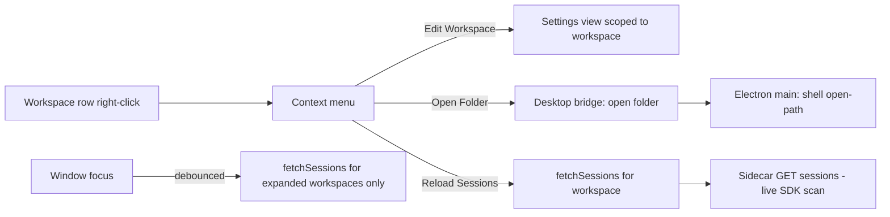

# Sidebar Workspace Context Menu - Plan

## Goal Capsule

- **Objective:** Give each left-sidebar workspace item a three-action context menu — Edit Workspace, Open Folder, Reload Sessions — and refresh expanded workspaces' session lists when the app window regains focus, so externally created bot sessions appear without restarting the app.
- **Product authority:** This contract defines the menu's actions, their user-visible semantics, and the focus-refresh behavior. Surrounding surfaces (management page, new-chat workspace selector) are not active scope.
- **Implementation authority:** The Planning Contract below defines the desktop bridge method, the settings deep-link channel, the menu's reuse of the session-row pattern, and the focus-refresh strategy.
- **Stop conditions:** Stop and re-plan if adding a whitelisted bridge method requires changing the preload security model, if the settings deep-link cannot seed the settings panel's workspace selection without restructuring its state ownership, or if focus-refresh cannot preserve selection and scroll with the existing list rendering.
- **Execution profile:** Four units; U1 and U2 are independent enablers, U3 wires the menu to both and introduces the shared per-workspace refetch helper, U4 reuses that helper and lands after U3.
- **Tail ownership:** The implementer owns targeted tests, i18n keys in both locales, typecheck, lint, and the manual OS smoke checks recorded in the Verification Contract.
- **Open blockers:** None.

---

## Product Contract

> Product Contract unchanged from the requirements-only brainstorm artifact. One dependency assumption was corrected during planning: a file-manager bridge already exists in the Electron shell (see Dependencies / Assumptions and Sources).

### Summary

Left-sidebar workspace items gain a right-click context menu with three actions: Edit Workspace (deep-links to that workspace's settings), Open Folder (opens the workspace folder in the OS file manager), and Reload Sessions (refreshes that workspace's session list). When the app window regains focus, expanded workspaces' session lists refresh automatically, so externally created bot sessions no longer require an app restart to appear.

### Problem Frame

The sidebar fetches each workspace's session list once per mount behind a one-shot guard, and nothing re-triggers that fetch afterward. A session created outside the app — a new bot conversation arriving while the user is elsewhere — is therefore invisible in the sidebar until the app is quit and relaunched; restarting the whole app is the only workaround today. Per-workspace operations suffer a milder version of the same distance problem: reaching a workspace's settings or its folder on disk means navigating away from the sidebar where the user actually works.

### Key Decisions

- **Menu scope: sidebar workspace rows only** (session-settled: user-directed — chosen over management page / new-chat selector / all list surfaces: the sidebar is where the user works day-to-day).
- **Approach B: manual reload plus focus-time auto-refresh** (session-settled: user-approved — chosen over manual-only reload and watcher-based auto-freshness: removes the restart pain cheaply without carrying a file watcher). Governs R6, R7.
- **Reload is list-refresh only** — refreshing never interrupts running or streaming sessions. Governs R6, R7.
- **Edit is a deep link into existing settings, not an in-menu form** (session-settled: user-directed — chosen over full in-menu editing: reuse the existing per-workspace settings surface). Governs R4.
- **Delete stays out of the menu** (session-settled: user-approved — chosen over a menu item guarded by the existing confirm dialog: destructive actions remain in settings, keeping the menu at three items).

### Requirements

**Menu behavior**

- R1. Right-clicking a workspace row in the left sidebar opens a context menu anchored at the pointer.
- R2. The menu offers exactly three actions: Edit Workspace, Open Folder, and Reload Sessions.
- R3. The menu closes on outside click, Escape, or after an action fires, matching the existing session-row context menu's behavior including localized labels.

**Action semantics**

- R4. Edit Workspace opens the app's settings view scoped to that workspace.
- R5. Open Folder opens the workspace's folder in the OS file manager — Finder on macOS, Explorer on Windows.
- R6. Reload Sessions refreshes that workspace's session list in place without interrupting running or streaming sessions.

**Background freshness**

- R7. When the app window regains focus, the session lists of expanded workspace groups refresh automatically; collapsed groups are not refreshed.
- R8. Any refresh preserves the user's current session selection and the sidebar's scroll position.

### Key Flows

- F1. Context menu action
  - **Trigger:** User right-clicks a workspace row in the left sidebar.
  - **Actors:** App user.
  - **Steps:** Menu opens at the pointer → user picks an action → the action executes → menu closes.
  - **Covered by:** R1–R6.
- F2. External session becomes visible
  - **Trigger:** A bot session is created outside the app, then the user refocuses the app window (or picks Reload Sessions).
  - **Actors:** App user; external bot runtime.
  - **Steps:** Window regains focus → expanded workspaces' lists refresh → the new session appears in its workspace group without an app restart.
  - **Covered by:** R6–R8.

### Acceptance Examples

- AE1. **Covers R7.** **Given** a collapsed workspace with externally added sessions, **When** the app window regains focus, **Then** that workspace's list is not refreshed and no request is issued for it.
- AE2. **Covers R6, R7, R8.** **Given** a workspace with a currently streaming session, **When** Reload Sessions fires or the window regains focus, **Then** the session keeps running, stays selected, and the sidebar does not jump scroll.
- AE3. **Covers R5.** **Given** the app on Windows, **When** the user picks Open Folder, **Then** Explorer opens that workspace's folder (Finder on macOS).
- AE4. **Covers R4.** **Given** a right-click on a workspace, **When** the user picks Edit Workspace, **Then** settings open scoped to that workspace.

### Scope Boundaries

- Deferred for later: context menus on other workspace-list surfaces (management page, new-chat workspace selector); watcher-based fully automatic session freshness; in-menu rename or delete.
- Not proposed: any change to how sessions are created, archived, or deleted — the menu only reaches existing capabilities.

#### Deferred to Follow-Up Work

- Extract a shared context-menu component from the session-row and workspace menus. This plan duplicates the menu-item styling inline instead, mirroring the existing session menu; extraction is a separate refactor.

### Dependencies / Assumptions

- The server's session listing is already a live per-request scan with no server-side cache, so reload and focus refresh are client-side refetches (verified against the route and service code).
- Every workspace carries a local folder path; Open Folder opens it. Workspaces without a resolvable path are not known to exist — if implementation finds one, the action's disabled state is decided there (default: disable the item).
- The Electron shell already ships a whitelisted desktop bridge with a reveal-in-file-manager method (parent-select semantics). This plan adds one sibling method with open-folder semantics; no new security surface beyond the existing string-validated pattern.
- Focus refresh mirrors an existing focus/visibility refresh pattern in the sidebar's git-branch bar; no new global event infrastructure is needed.

### Sources

- Session-row context menu pattern to mirror: `src/client/components/AgentCommandCenter.tsx:607` (handler) and `:805-851` (fixed-position menu + actions).
- Workspace row that is the menu target: `src/client/components/AgentCommandCenter.tsx:445-530`.
- One-shot session fetch guard — root cause of restart-only visibility: `src/client/components/AgentCommandCenter.tsx:194-198`.
- Refetch primitive that replaces a workspace's session list: `src/client/stores/chat-store.ts:2668`.
- Server route and live SDK scan (no cache): `src/server/routes/chat.ts:21-41`; `src/server/services/chat-service.ts:622-630`.
- Desktop bridge pattern (main handler → preload whitelist → client wrapper): `electron/main.ts:527-570` (including the existing `comate:reveal-in-file-manager` handler), `electron/preload.ts:90-91`, `src/client/lib/desktop-api.ts:261-264`.
- Focus/visibility refresh precedent: `src/client/components/WorkspaceGitBranch.tsx:34-39`.
- Settings surfaces: `src/client/App.tsx:42-82` (destination mechanism), `src/client/components/ManagementWorkspace.tsx:11-15`, `src/client/components/SettingsPanel.tsx:210-305` (internal workspace selection with deletion guards).
- Workspace folder path field: `src/client/stores/workspace-store.ts:13`.

---

## Planning Contract

### High-Level Technical Design

One wiring diagram covers the plan's shape — the three menu actions fan out from the workspace row to three existing-style destinations:

The reveal path is the only new cross-process surface; it follows the existing bridge pattern end to end.

### Key Technical Decisions

- KTD1. **Open-folder is a new sibling bridge method with open semantics, not a reuse of the existing reveal method.** The existing `reveal-in-file-manager` uses parent-select semantics (the item is highlighted in its parent folder); R5 asks for the folder itself to open. Add one `comate:`-namespaced IPC handler with the same non-empty-string validation style, expose it through the preload whitelist, and wrap it in `src/client/lib/desktop-api.ts` with the same unsupported-bridge error shape. Governs R5.
- KTD2. **The workspace menu extends the sidebar's existing session-menu mechanics.** The context-menu state becomes a union (session target or workspace target); rendering, item styling, pointer anchoring, and the document-mousedown close listener stay as they are for sessions today. No shared menu abstraction (see Deferred to Follow-Up Work). Governs R1, R2, R3.
- KTD3. **Settings deep-link targets an arbitrary workspace through the existing destination mechanism.** App state gains a requested settings-workspace id passed down to the management surface; the settings panel seeds its internal workspace selection from it, keeping its existing deletion-sync guards intact. Today the panel is only ever handed the active workspace. Governs R4.
- KTD4. **Focus refresh mirrors the git-branch bar's listener pattern with two guards.** Listen for window focus and visibility change; refresh only expanded workspaces; skip any workspace whose fetch is already in flight. Debounce interval is an implementation choice. Streaming state is never touched — refresh only replaces the session list, per R6. Governs R7, R8.

### Assumptions

- List re-render keyed by session id preserves scroll position; if implementation shows otherwise, keying or anchoring is fixed inside U4 without changing R8's meaning.
- The preload whitelist accepts one more method without a security-model change (same class as the existing reveal method).

### Sequencing

U1 and U2 are independent enablers. U3 depends on both. U4 depends on U3's shared per-workspace refetch helper; its listener logic is independent.

---

## Implementation Units

### U1. Open-folder desktop bridge method

- **Goal:** The renderer can ask the shell to open a workspace folder's contents in the OS file manager.
- **Requirements:** R5.
- **Dependencies:** None.
- **Files:** `electron/main.ts`, `electron/preload.ts`, `src/client/lib/desktop-api.ts`, `src/client/lib/desktop-api.test.ts`, `src/client/lib/__mocks__/desktop-api.ts`.
- **Approach:**
  1. Add an IPC handler next to the existing reveal handler, validating a non-empty string path and calling Electron's open-path shell API.
  2. Expose it on the preload bridge beside `revealInFileManager`.
  3. Wrap it in `desktop-api.ts` with the same unsupported-bridge error shape; update the mock.
- **Patterns to follow:** `electron/main.ts:558-570` (reveal handler validation style), `electron/preload.ts:90-91`, `src/client/lib/desktop-api.ts:261-264`.
- **Test scenarios:**
  - Wrapper rejects an empty or non-string path before invoking the bridge.
  - Wrapper invokes the bridge method with the given path and resolves.
  - Wrapper throws the unsupported-capability error when the bridge method is absent (non-Electron context).
  - Mock exports the new function with the same shape as `revealInFileManager`.
- **Verification:** Wrapper unit tests pass; typecheck passes.

### U2. Settings deep-link to an arbitrary workspace

- **Goal:** Opening settings can scope to a chosen workspace instead of only the active one.
- **Requirements:** R4.
- **Dependencies:** None.
- **Files:** `src/client/App.tsx`, `src/client/components/ManagementWorkspace.tsx`, `src/client/components/SettingsPanel.tsx`, `src/client/components/SettingsPanel.workspace.test.tsx`, `src/client/components/ManagementWorkspace.test.tsx`.
- **Approach:**
  1. Add App-level state for a requested settings workspace id, threaded to the management surface when the destination is settings.
  2. Let the settings panel accept an initial workspace selection that seeds its internal `selectedWorkspaceId`, without weakening the existing deletion-sync guards.
- **Patterns to follow:** `src/client/App.tsx:76-82` (destination request), `src/client/components/SettingsPanel.tsx:210-305` (selection state and guards).
- **Test scenarios:**
  - Deep link to a non-active workspace opens settings scoped to it. Covers AE4.
  - The seeded workspace being deleted mid-session still resets the selection per the existing guard.
  - With no requested id, behavior is unchanged (active workspace as today).
- **Verification:** Component tests pass; typecheck passes.

### U3. Workspace context menu in the sidebar

- **Goal:** Right-clicking a workspace row opens the three-action menu, wired to the bridge, the settings deep-link, and session reload.
- **Requirements:** R1, R2, R3, R4, R5, R6.
- **Dependencies:** U1, U2.
- **Files:** `src/client/components/AgentCommandCenter.tsx`, `src/client/i18n/en/chat.json`, `src/client/i18n/zh-CN/chat.json`, `src/client/components/AgentCommandCenter.test.tsx`.
- **Approach:**
  1. Extend the context-menu state to a union of session and workspace targets; keep one menu open at a time.
  2. Attach the handler to the workspace row's header area (the row that carries the folder icon, name, and badges).
  3. Render the three items with the session menu's item class and close semantics; labels localized in the chat namespace for both locales.
  4. Wire actions: Edit Workspace requests the settings destination with the row's workspace id; Open Folder calls the U1 wrapper with the workspace's folder path; Reload Sessions calls a per-workspace refetch helper introduced here — wrapping the existing store fetch with an in-flight guard — and closes the menu. U4's focus refresh reuses this same helper.
  5. Disable Open Folder when the workspace has no folder path.
  6. Surface a visible error indication when the open-folder call fails (for example the folder was deleted externally), following the app's existing error-feedback pattern.
- **Patterns to follow:** `src/client/components/AgentCommandCenter.tsx:607-619` (session-row handler), `:805-851` (menu render), `:222-233` (close listener).
- **Test scenarios:**
  - Right-click on a workspace row opens a menu anchored at the pointer. Covers R1.
  - The menu shows exactly the three actions with localized labels. Covers R2.
  - Outside click, Escape, and action dispatch each close the menu. Covers R3.
  - Edit Workspace opens settings scoped to the right-clicked workspace, including a non-active one. Covers R4, AE4.
  - Open Folder invokes the bridge wrapper with the workspace's folder path (bridge mocked). Covers R5, AE3.
  - Open Folder renders disabled when the workspace lacks a folder path.
  - A failing open-folder call (folder missing on disk) shows the error feedback instead of failing silently.
  - Reload Sessions refetches that workspace's list and leaves streaming sessions running. Covers R6, part of AE2.
  - The session-row menu still opens and acts unchanged (regression).
- **Verification:** Component tests pass; typecheck passes.

### U4. Focus-time session refresh

- **Goal:** Expanded workspaces' session lists refresh when the window regains focus, without restarts, lost selection, or scroll jumps.
- **Requirements:** R7, R8.
- **Dependencies:** U3 (provides the shared per-workspace refetch helper with its in-flight guard).
- **Files:** `src/client/components/AgentCommandCenter.tsx`, `src/client/components/AgentCommandCenter.test.tsx`.
- **Approach:**
  1. Add window focus and visibility-change listeners following the git-branch bar's pattern.
  2. On fire (debounced), call the U3 refetch helper for expanded workspace ids only; the helper's in-flight guard prevents duplicates.
  3. Keep active session selection untouched; rely on stable list keys to preserve scroll.
- **Patterns to follow:** `src/client/components/WorkspaceGitBranch.tsx:34-39`.
- **Test scenarios:**
  - Window focus triggers a refetch for each expanded workspace; an externally added session appears in its group. Covers R7, F2.
  - A collapsed workspace is not fetched on focus. Covers AE1.
  - Rapid repeated focus results in one fetch per workspace per debounce window.
  - A fetch already in flight for a workspace is not duplicated.
  - With a streaming session selected, refresh keeps it selected, running, and scroll-stable. Covers R8, AE2.
- **Execution note:** Verify the focus path against a real external bot session once, manually, before declaring the unit done.
- **Verification:** Component tests pass; manual smoke recorded.

---

## Verification Contract

- Targeted tests: `npx vitest run src/client/lib/desktop-api.test.ts src/client/components/SettingsPanel.workspace.test.tsx src/client/components/ManagementWorkspace.test.tsx src/client/components/AgentCommandCenter.test.tsx`.
- Full gates: `npm run typecheck`, `npm run test:client`, and `npm run test:electron` if any electron-side test file changed.
- Manual smoke (recorded in the PR description): Open Folder opens the workspace folder on macOS Finder and on Windows Explorer where available; an externally created bot session appears after window refocus without app restart.
- Behavioral skill evaluation: none required — no skill or agent surface is touched.

## Definition of Done

- Global: all four units landed; targeted tests, `npm run typecheck`, and `npm run test:client` pass; chat-namespace labels exist in en and zh-CN; manual smoke notes are in the PR; no dead-end or experimental code remains in the diff.
- U1: wrapper tests green; bridge method live in preload whitelist and main handler.
- U2: deep link works for non-active workspaces; deletion guard behavior unchanged.
- U3: menu opens on workspace rows with three working actions; session menu regression-free.
- U4: focus refresh limited to expanded workspaces, selection and scroll stable, manual smoke confirmed.
