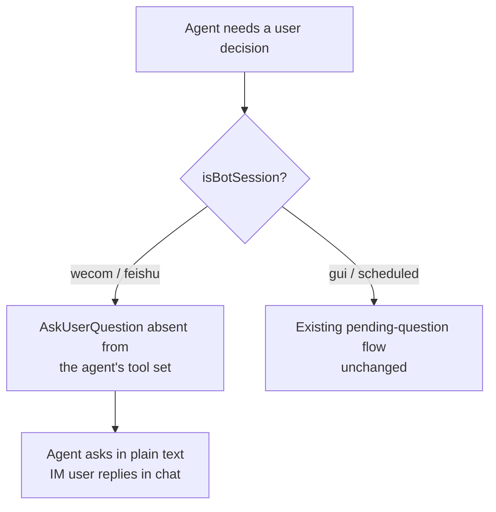
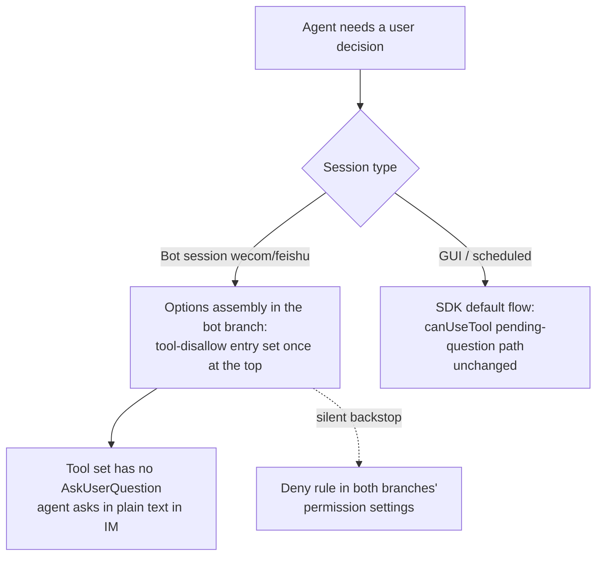

# Disable AskUserQuestion in Bot Sessions - Plan

## Goal Capsule

- **Objective:** In bot-initiated sessions (WeCom today, feishu when it ships), the agent can no longer call AskUserQuestion; when it needs a user decision it asks in plain text in the IM channel. GUI sessions keep AskUserQuestion unchanged.
- **Product authority:** This contract owns the disable semantics, the removal mechanism, and the cleanup of the now-unreachable bot question paths. All other bot-session behavior is out of scope.
- **Implementation authority:** The Planning Contract owns the enforcement mechanism (tool-context removal via SDK options, with a deny-rule backstop in both permission branches), the cleanup symbol inventory, and the sequencing gates.
- **Stop conditions:** Stop and re-plan if the SDK's tool-removal surface proves ineffective for built-in tools at runtime, or if cleanup discovers a consumer of the removed paths outside the inventoried question flow.
- **Execution profile:** Three units. U1 lands the removal in the bot session option assembly (covering all three permission paths); U2 and U3 remove the WeCom and feishu question paths (removal gated on U1's tests).
- **Tail ownership:** The implementer owns node:test suites (with `test-utils/test-env` isolation), `npm run typecheck` and `npm run lint`, the CHANGELOG entry, and committing this plan doc with the implementation.
- **Open blockers:** None.

---

## Product Contract

> Carried forward from the requirements-only brainstorm artifact. Revised at the planning handoff (user-directed): the disable mechanism changed from deny-with-guidance to tool-context removal, so R2's denial-message requirement is superseded by removal semantics (see Key Decisions). R4/AE4 cleanup scope was earlier extended to the parallel feishu question path, and the upgrade-settlement assumption was corrected during planning (see Dependencies / Assumptions).

### Summary

Bot sessions get AskUserQuestion removed from the agent's tool context: the agent never sees the tool and asks for user decisions in plain text, so IM users stop receiving unreadable structured questions and answer by replying in chat. The bot-side question-card and answer-routing paths become unreachable and are removed; GUI and scheduled sessions are untouched.

### Problem Frame

AskUserQuestion renders its questions and options as structured content. In the WeCom IM channel this content is, in practice, unreadable — the product owner's observed experience. The current code already tries to bridge the gap (template cards for choice questions, a "reply in chat" notice for free-text, answer routing back into the session), but the experience stays broken: cards depend on WeCom app-side support, and free-text questions already degrade to plain chat replies. IM's native interaction is a text round-trip; a structured question UI fights the medium. The cost lands exactly at the worst moment — the agent needs the user's decision, the user gets an unusable interaction, and the session stalls or the turn produces garbage.

### Key Decisions

- **Disable only, no system-prompt guidance** — chosen over injecting an "ask in text" instruction into the bot system prompt: minimal implementation, and with the tool absent, plain text is the model's only option anyway. Governs R2.
- **Removal over denial — no guidance text** — the tool is removed from the agent's tool context rather than denied on call with an explanatory message; revised from the original deny-with-guidance decision at the planning handoff: with the tool absent, asking in plain text is the model's default behavior, so no denial message is needed. Governs R2.
- **Keyed on `isBotSession`, not `source === 'wecom'`** — matches the existing bot-session identity (wecom + feishu); a future feishu channel inherits the disable automatically. Governs R1.
- **Mechanism: tool-context removal in the bot session's SDK option assembly** — chosen over rewriting the three canUseTool interception branches: one option assignment covers every downstream permission path, and the model never wastes a call on a tool it cannot use. Governs R1.
- **Remove the unreachable bot question path in the same change** — chosen over keeping it dormant: no dead code and no dormant tests; if card-based questions are ever wanted again, that work re-enters as a new plan. Governs R4.
- **No Open Code-side work** — bot sessions resolve to the claude backend by construction (R14), so Open Code never serves a bot session today. This rests solely on the verified backend pinning; if backend pinning ever changes, the bot AskUserQuestion disable must be re-evaluated for the new backend.

### Actors

- A1. Bot session agent — the claude-backend runtime serving a WeCom (or feishu) bot session; the actor that loses AskUserQuestion.
- A2. IM bot user — the human on the WeCom (or feishu) side; receives plain-text questions and answers by replying in chat.
- A3. GUI session user — unaffected; present here only as the regression boundary.

### Requirements

**Disable semantics**

- R1. In bot-initiated sessions (`isBotSession`: source `wecom` or `feishu`), AskUserQuestion is unavailable — no call can reach the pending-question flow.
- R2. The tool is removed from the model's context, not merely denied on call: the agent never sees it, never attempts it, and plain text is its only channel for user decisions.

**Unchanged surfaces**

- R3. GUI sessions and scheduled sessions keep their current AskUserQuestion behavior, including the pending-question approval flow and its fail-closed timeout.

**Cleanup**

- R4. Bot-only paths left unreachable by R1 — the WeCom and feishu pending-question card construction and rendering, the card-event answer parsing, and the routing of a bot user's next chat message into a pending free-text question — are removed; handlers shared with permission approvals and the GUI question flow stay.

### Key Flows

- F1. Bot session needs a user decision
  - **Trigger:** In a bot session, the agent reaches a decision point where it wants the user's input.
  - **Actors:** A1, A2
  - **Steps:** AskUserQuestion is not in the agent's tool set, so the agent asks the user in plain text in the IM channel, enumerating options as text when present; the bot user's next chat message enters as a normal turn and the session continues.
  - **Outcome:** No structured question reaches the IM channel and no pending question is registered. Covers R1, R2.
- F2. GUI session asks a question (regression boundary)
  - **Trigger:** The same agent need in a GUI session.
  - **Actors:** A3
  - **Steps:** AskUserQuestion routes through the existing pending-question flow — SSE to the GUI renderer, answer resolution through the approval queue — exactly as today.
  - **Outcome:** Zero behavior change. Covers R3.

### Acceptance Examples

- AE1. **Given** a WeCom bot session, **When** the agent reaches a decision point, **Then** AskUserQuestion is not in its tool set, no question card or waiting placeholder appears in IM, and the user receives the question as plain text they can answer by replying. Covers R1, R2.
- AE2. **Given** a GUI session, **When** the agent calls AskUserQuestion, **Then** the structured question UI appears and resolves as before. Covers R3.
- AE3. **Given** a scheduled-task run session, **When** the agent attempts AskUserQuestion, **Then** behavior is unchanged from today (still routed to the pending-question flow with its fail-closed timeout). Covers R3.
- AE4. **Given** the disable is live, **When** the bot-only question paths are searched in the codebase, **Then** the WeCom and feishu question-card construction, card-answer parsing, and free-text routing no longer exist, while the GUI renderer and shared approval handlers are untouched. Covers R4.

### Scope Boundaries

- Deferred for later: reviving card-based structured questions in WeCom or feishu — rejected for now; the paths are removed, so a revival is new work, not a toggle.
- Out of scope: any Open Code-side change (bot sessions never run it today); scheduled-session question behavior; building out the feishu channel; GUI rendering changes.

### Dependencies / Assumptions

- Verified: bot sessions always resolve to the claude backend (`src/server/services/chat-service.ts`, `resolveSessionBackend`, comment "Bot sessions always resolve to claude regardless of the app default (R14)") — makes the Open Code concern moot today.
- Verified: the SDK exposes `disallowedTools` on the Options surface and documents that it also blocks harness-internal direct calls that bypass name lookup; deny rules cannot be bypassed by allow rules (backstop rationale). See `node_modules/@anthropic-ai/claude-agent-sdk/sdk.d.ts`.
- Resolved during planning: the removal is one options assignment inside the `isBotSession` block, which all three permission assemblies (sandbox, legacy kill-switch, no-botId fallback) read; U1 tests prove each path.
- Assumption (corrected during planning): a pending question at upgrade time is settled by SDK resume over the dangling tool call — the in-process fail-closed timeout dies with the process; no migration.
- Assumption: asking in plain text without a question tool is expected model behavior — a chat model's default, with no guidance text carried; if field behavior proves unreliable, adding system-prompt guidance is a follow-up.

### Outstanding Questions

- Resolved during planning: removal placement (KTD1, KTD2) and the cleanup inventory (U2, U3).

### Sources

- `src/server/services/chat-service.ts` — bot-session identity threading, backend pinning, the three AskUserQuestion interception branches, SDK option assembly with the skill-deny precedent.
- `src/server/services/session-runtime.ts` — `requestToolQuestion` and the pending-question flow, the GUI canUseTool callback, the auto-mode exception for AskUserQuestion, `getPendingFreeTextQuestion`.
- `src/server/services/wecom-stream-reply.ts`, `src/server/services/wecom-template-card.ts`, `src/server/services/wecom-bot-service.ts` — the WeCom question-card rendering, answer routing, and timeout handling that R4's cleanup touches.
- `src/server/services/feishu-stream-reply.ts`, `src/server/services/feishu-card-action-handler.ts`, `src/server/services/feishu-card-builder.ts`, `src/server/services/feishu-bot-service.ts` — the parallel feishu question paths in R4's cleanup scope.
- `src/server/services/bot-escalation-ledger.ts` — samples AskUserQuestion events; audited in U2.
- `node_modules/@anthropic-ai/claude-agent-sdk/sdk.d.ts` — the `disallowedTools` Options surface and the permission-rules typing (deny before allow/canUseTool).
- `src/server/services/opencode-adapter.ts`, `src/server/services/opencode-event-mapper.ts` — the Open Code `question` equivalent (context for the "no Open Code work" decision).
- `src/client/lib/session-filter.ts` — the client-side `isBotSession` definition (wecom | feishu).
- `docs/solutions/integration-issues/wecom-update-template-card-5s-window.md` — the card files serve approval/resume/workspace flows besides questions; cleanup must stay symbol-scoped.

---

## Planning Contract

### Key Technical Decisions

- KTD1. **AskUserQuestion is removed from the model's tool context via the SDK's tool-disallow option; a deny-rule backstop rides both permission branches** — with the tool absent, the agent never attempts it and asks in plain text as its only option: no wasted tool call, no denial round-trip, no hook-ordering constraints. The SDK documents that the disallow option also blocks harness-internal direct calls, which name-based gates miss; the deny-rule backstop cannot be bypassed by allow rules. Revised from the earlier PreToolUse-deny-hook mechanism at the planning handoff (user-directed): the hook let the model see the tool, call it, and bounce — removal is the direct route. Governs R1, R2.
- KTD2. **One options assignment at the top of the `isBotSession` block covers all three permission assemblies** — the sandbox branch, the legacy kill-switch branch, and the no-botId migration fallback all consume the same options object, so a single tool-disallow entry protects every path. The legacy branch's canary-rollback comment is updated: rollback no longer restores the question flow, which is intended per R1. Gates U2/U3 on U1's tests.
- KTD4. **Upgrade settlement relies on SDK resume over the dangling tool call; no migration** — the in-process fail-closed timeout dies with the process, so an interrupted bot session resumes with a dangling AskUserQuestion tool_use; the model sees the interrupted question and, with the tool absent, re-asks in plain text. The boot-time escalation sweep settles approval escalations only (questions never create ledger rows), so it does not participate in question settlement.

### High-Level Technical Design

### Risks & Dependencies

- Runtime effectiveness of the tool-disallow option for built-in tools is verified by U1's option-level tests plus one live bot-session smoke; if the tool still surfaces, stop per the Goal Capsule stop conditions.
- Do not reorder or relocate pending-question SSE emission points in `session-runtime.ts` — GUI delivery there has a fragile history (see `docs/solutions/integration-issues/sse-clean-close-retry-2026-05-22.md`); the cleanup touches channel adapters, not the SSE core.
- Model adaptation (asking in plain text without the tool) is an assumption, not a mechanism; if bot sessions stop asking in practice, the follow-up is system-prompt guidance, not reverting the removal.

### Sequencing

U1 (removal) must land before U2/U3 (cleanup) — cleanup first would leave a window where a bot session creates a pending question that nothing renders or resolves.

---

## Implementation Units

### U1. Bot-session AskUserQuestion removal in the option assembly

- **Goal:** AskUserQuestion is absent from bot-session tool contexts across all three permission paths.
- **Requirements:** R1, R2; covers AE1 (removal), AE2, AE3 (negative assertions).
- **Dependencies:** None.
- **Files:** `src/server/services/chat-service.ts` (modify); `src/server/services/chat-service.test.ts` (modify).
- **Approach:**
  1. At the top of the `isBotSession` block in `buildSdkOptions`, add `AskUserQuestion` to the tool-disallow list on the options object — one assignment covering the sandbox branch, the legacy kill-switch branch, and the no-botId migration fallback (KTD2).
  2. Add `AskUserQuestion` to the sandbox deny-rule merge as a silent backstop (restructuring the merge so it is not gated on `skillDenyRules` being non-empty), and mirror a minimal deny entry in the legacy branch's settings.
  3. Update the legacy branch's canary-rollback comment: rollback no longer restores the question flow (KTD2).
  4. Live smoke: one real bot session confirming the agent asks in plain text at a decision point.
- **Patterns to follow:** the `compileSkillDenyRules` permission merge (deny-rule merge shape); `denyBrowserToolInBotSession` (bot capability-denial precedent — non-injection as the primary control).
- **Test scenarios:**
  - Sandbox bot session: built options carry the tool-disallow entry for AskUserQuestion. Covers AE1.
  - Legacy bot session (`botPermissionSandboxDisabled: true`): same entry asserted — this is the cleanup gate.
  - Bot session without a botId binding (migration fallback path): same entry asserted.
  - GUI session: no tool-disallow entry for AskUserQuestion. Covers AE2.
  - Scheduled session: no entry. Covers AE3.
  - Runtime rebuild after toggling `botPermissionSandboxDisabled`: rebuilt options still carry the entry.
  - Sandbox permissions include the deny-rule backstop; legacy settings carry the mirrored entry.
- **Verification:** New and updated cases in `chat-service.test.ts` green; `npm run test:server`.

### U2. WeCom question-path removal

- **Goal:** Remove the WeCom-only question flow that R1 makes unreachable.
- **Requirements:** R4; covers AE4 (WeCom half).
- **Dependencies:** U1 — specifically its legacy-branch and fallback-path tests.
- **Files:** `src/server/services/chat-service.ts`, `src/server/services/wecom-stream-reply.ts`, `src/server/services/wecom-template-card.ts`, `src/server/services/wecom-bot-service.ts` (modify); `src/server/services/bot-escalation-ledger.ts` (modify only if the step-5 audit shows the sampling needs adjustment); `src/server/services/chat-service.test.ts`, `src/server/services/wecom-stream-reply.test.ts`, `src/server/services/wecom-template-card.test.ts`, `src/server/services/wecom-bot-service.test.ts` (modify).
- **Approach:**
  1. Remove the three AskUserQuestion interception branches in the bot canUseTool paths of `chat-service.ts` and `mapAskUserQuestionInput` (their only consumer); `noUnusedLocals` enforces the removal.
  2. `wecom-stream-reply.ts`: remove the `pending_question` branch and the `question` waiting-placeholder case; keep the `approval_timeout` branch (it serves approval cards too).
  3. `wecom-template-card.ts`: remove `buildQuestionCard` with its vote/multiple/text-notice sub-builders and `formatQuestionFold`; keep the approval, session-switch, escalation, and workspace card builders.
  4. `wecom-bot-service.ts`: remove the free-text question routing, the question tail of the template-card event handler (keep the `approval` path), `buildAnswersFromCardEvent`, and the now-unused `validateQuestionAnswers` / `formatQuestionFold` imports.
  5. Audit the escalation ledger's AskUserQuestion sampling: with the tool absent, no question events occur — the codebase's only reference is a documentation comment, so "leave inert" is the expected outcome; adjust only if the audit shows otherwise.
  6. Update or remove the affected tests in the four test files.
- **Patterns to follow:** the structural card tests in `wecom-template-card.test.ts` (keep-assertions style).
- **Test scenarios:**
  - Symbol absence in the WeCom files: `buildQuestionCard`, `formatQuestionFold`, `buildAnswersFromCardEvent` gone from the WeCom card and bot services, and `mapAskUserQuestionInput` gone from `chat-service.ts`. Covers AE4 (the whole-src absence check, including feishu's `buildQuestionCard`, lives in the Verification Contract's joint U2/U3 gate).
  - Keep-assertions: the approval-timeout card flow still sends; a tool-approval card callback still resolves an approval; `/resume` and `/workspace` cards render unchanged.
  - A bot user's next chat message at a decision point starts a normal turn — no free-text reroute. Covers AE1.
- **Verification:** `npm run test:server`; `npm run typecheck` (catches dead imports); grep-verifiable symbol absence in the WeCom files.

### U3. Feishu parallel question-path removal

- **Goal:** Remove the feishu question flow, equally unreachable under R1.
- **Requirements:** R4 (scope extension confirmed at planning synthesis); covers AE4 (feishu half).
- **Dependencies:** U1; lands after or together with U2 (step 3 requires both channels' callers gone).
- **Files:** `src/server/services/feishu-stream-reply.ts`, `src/server/services/feishu-card-action-handler.ts`, `src/server/services/feishu-card-builder.ts`, `src/server/services/feishu-bot-service.ts`, `src/server/services/session-runtime.ts` (modify); matching `feishu-*.test.ts` files and `src/server/services/session-runtime.test.ts` (modify).
- **Approach:**
  1. `feishu-stream-reply.ts`: remove `postQuestionCard`, the pending-question dispatch, and the seen-questions tracking.
  2. `feishu-card-action-handler.ts`: remove the question registration map and the `question` / `question_submit` actions; `feishu-card-builder.ts`: remove its `buildQuestionCard`.
  3. `feishu-bot-service.ts`: remove its free-text question routing; once both channels' callers are gone, remove `getPendingFreeTextQuestion` from `session-runtime.ts` and its tests.
- **Test scenarios:**
  - Symbol absence for the removed feishu builders, actions, and the runtime free-text API. Covers AE4.
  - GUI `requestToolQuestion` tests in `session-runtime.test.ts` stay green (keep-assertion).
- **Verification:** `npm run test:server`; `npm run typecheck`.

---

## Verification Contract

| Gate | Command / check | Applies to | Done signal |
|---|---|---|---|
| Lint | `npm run lint` | All units | No errors |
| Typecheck | `npm run typecheck` | All units | Passes; `noUnusedLocals` confirms dead symbols are gone |
| Server tests | `npm run test:server` | U1–U3 | Full suite green, including updated suites |
| Removal matrix | U1 test scenarios | U1 | Sandbox bot, legacy bot, no-botId fallback, GUI, scheduled, rebuild — all asserted |
| Keep-assertions | U2 test scenarios | U2 | Approval/resume/workspace cards unaffected |
| Cleanup absence | Symbol grep over `src/` | U2, U3 | Removed symbols return zero matches |
| Live smoke | One real bot session at a decision point | U1 | Agent asks in plain text; no card, no placeholder |

---

## Definition of Done

- R1–R4 hold and AE1–AE4 are verified through the unit test scenarios and the verification gates above.
- All three bot permission paths (sandbox, legacy kill-switch, no-botId fallback) carry the tool removal; GUI and scheduled sessions show zero regression in their existing suites.
- All removed symbols are gone from `src/` and no dead imports remain.
- `CHANGELOG.md` carries an entry for the behavior change (bot sessions ask in plain text; question cards removed).
- This plan doc is committed together with the implementation, per the repo convention for plan files.
- No abandoned-attempt or experimental code is left in the final diff.
