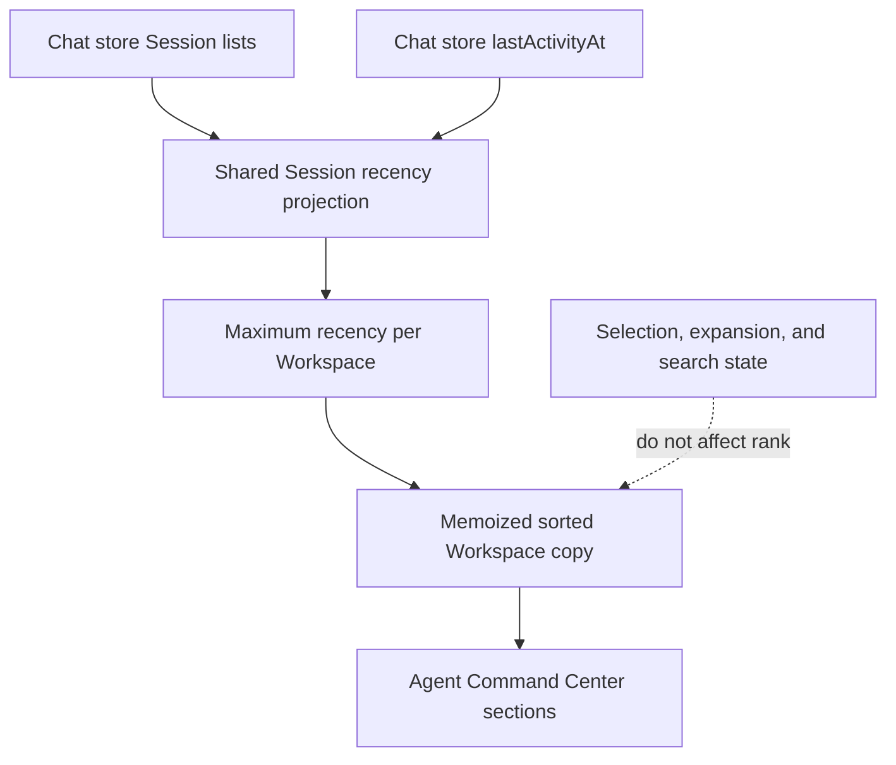

# Workspace Activity Sort - Plan

## Goal Capsule

- **Objective:** Keep the Workspace list ordered by the most recent meaningful Session activity so users can reach work that needs attention without scanning the full list.
- **Product authority:** The existing Session activity semantics define what makes a Workspace recent; this contract defines the resulting user-visible ordering, while planning owns the implementation.
- **Open blockers:** None.
- **Execution profile:** Localized client-side derivation and rendering change with pure-function and component regression coverage.
- **Stop conditions:** Stop if implementation requires new Session activity semantics, server persistence, or a change to the confirmed Workspace ordering behavior.
- **Tail ownership:** The executor owns focused tests, client type checking, linting, and removal of abandoned implementation paths before handoff.

---

## Product Contract

### Summary

Derive every Workspace's ordering key from the same effective Session activity recency used for Session rows.
Apply the derived order in the Agent Command Center without adding persistent Workspace activity state.

### Problem Frame

The Agent Command Center now presents Workspaces as a vertical list, but that list keeps its underlying Workspace order even when Sessions inside a lower Workspace are active or need attention.
Users must scan or scroll through Workspaces to find relevant work despite Session rows already using activity-driven ordering.

### Key Decisions

- **Reuse the full Session activity meaning.** (session-settled: user-directed — chosen over counting only running or processing Sessions: unread completions and pending user interactions also require attention.) Governs R2.
- **Use full recency ordering across Workspaces.** (session-settled: user-directed — chosen over promoting only currently active Workspaces while preserving the inactive order: mirroring Session ordering keeps recently active work easy to reach.) Governs R1, R3.
- **Keep navigation state separate from recency.** Selecting or expanding a Workspace does not make it more recent. Governs R4.

### Requirements

- R1. The Workspace list orders Workspaces by the newest effective activity time found among each Workspace's Sessions, newest first.
- R2. Effective activity uses the existing Session activity semantics, including running or processing work, unread completions, and pending user interactions.
- R3. When a Workspace no longer has current activity, it remains ordered by its last effective Session activity instead of returning to its original position.
- R4. The selected, opened, or expanded Workspace receives no additional ordering priority.
- R5. Session activity updates can reorder the Workspace list whether the affected Workspace is expanded or collapsed.
- R6. A Workspace with no Session activity sorts after Workspaces with recorded activity; Workspaces with equal or absent activity retain a stable relative order.
- R7. Search or filtering within the Agent Command Center does not redefine Workspace recency or change the relative Workspace order.

### Acceptance Examples

- AE1. **Covers R1, R2, R5.**
  - **Given:** Workspace A has no current activity and Workspace B contains a Session that starts processing while B is collapsed.
  - **When:** the Session activity update arrives.
  - **Then:** Workspace B moves above Workspace A without requiring B to be expanded.
- AE2. **Covers R1, R2.**
  - **Given:** no Session is currently processing and Workspace C receives an unread completion after Workspace B's latest activity.
  - **When:** the unread state updates.
  - **Then:** Workspace C appears above Workspace B.
- AE3. **Covers R1, R2.**
  - **Given:** Workspace D has a pending user interaction newer than the last activity in Workspace C.
  - **When:** the Workspace list renders.
  - **Then:** Workspace D appears above Workspace C.
- AE4. **Covers R3.**
  - **Given:** Workspace E recently finished processing and Workspace F last had activity earlier.
  - **When:** Workspace E becomes inactive.
  - **Then:** Workspace E remains above Workspace F until a newer effective activity changes their order.
- AE5. **Covers R4.**
  - **Given:** an older Workspace is selected or expanded while another Workspace has newer effective activity.
  - **When:** the list renders.
  - **Then:** the newer Workspace remains above the selected or expanded Workspace.
- AE6. **Covers R6, R7.**
  - **Given:** two empty Workspaces have no recorded Session activity.
  - **When:** the user searches Sessions or the list rerenders.
  - **Then:** both remain after Workspaces with activity and do not swap relative positions.

### Scope Boundaries

- No manual Workspace pinning or drag-and-drop ordering.
- No separate active Workspace section, header, or divider.
- No new Workspace activity badges or row styling.
- No activity weight for the currently selected Workspace.
- No change to the meaning of Session activity.

### Sources / Research

- `docs/brainstorms/2026-06-13-session-list-activity-sort-requirements.md` defines the existing Session ordering behavior this feature extends.
- `src/client/components/AgentCommandCenter.tsx` contains the current Workspace list and its Session activity-derived presentation.
- `src/client/lib/session-sort.ts` captures the existing Session recency comparator behavior.

---

## Planning Contract

### Product Contract Preservation

Product Contract reworded for implementation orientation, with no scope change and all R/AE IDs preserved.

### Key Technical Decisions

- KTD1. **Derive Workspace recency from Session recency without new state.** (session-settled: user-directed — chosen over a running-only Workspace flag: the confirmed behavior requires all existing Session activity signals to participate.) Extract one Session activity timestamp projection and use it for both Session and Workspace ordering. Governs R1, R2, R3.
- KTD2. **Keep Workspace ordering as a pure client-side projection.** Compute each Workspace's maximum Session activity timestamp from the loaded Session map and sort a copied Workspace array. Do not mutate either Zustand store. Governs R1, R4, R5.
- KTD3. **Preserve source order for equal recency.** Use an oldest sentinel for Workspaces without Session activity and return equality for tied values so the stable array sort keeps their input order. Governs R6, R7.

### High-Level Technical Design

The shared projection retains the existing fallback chain from live `lastActivityAt` state to Session metadata.
The Workspace comparator adds only aggregation and stable empty/tie handling.

### Research Findings

- `src/client/components/AgentCommandCenter.tsx` already loads Sessions for every Workspace and subscribes to the state needed for recency, so the feature needs no new data-fetch path.
- `src/client/stores/chat-store.ts` updates `lastActivityAt` for message, processing, result, approval, question, creation, and send activity; its background status poll also records a newly pending interaction.
- `src/client/lib/session-sort.ts` already owns the Session timestamp fallback chain, but the Agent Command Center currently repeats that chain inline instead of calling the helper.
- `docs/solutions/integration-issues/sse-subscription-race-condition-2026-05-21.md` and `docs/solutions/integration-issues/sse-clean-close-retry-2026-05-22.md` show that background status polling remains an important source for pending-interaction visibility when an SSE subscription is unhealthy.

### Sequencing

Build and prove the shared recency projection before wiring it into the Agent Command Center.
The component integration then consumes the tested comparator without changing chat-store event handling.

### Risks & Dependencies

- Workspace order can change after the initial Session fetch completes. This is expected because unloaded Workspaces have no derived recency yet.
- Sorting runs whenever Workspace, Session, or activity timestamps change. Memoize the copied ordering projection and keep the comparator pure to avoid unrelated rerenders and store mutation.
- Reordering must preserve Workspace-local UI state. Existing ID-keyed expansion, creation, and visibility maps must remain keyed by Workspace ID rather than list position.

---

## Implementation Units

### U1. Shared Workspace recency projection

- **Goal:** Provide one tested activity timestamp rule for Session ordering and Workspace aggregation.
- **Requirements:** R1, R2, R3, R6; AE2, AE3, AE4, AE6.
- **Dependencies:** None.
- **Files:**
  - Modify `src/client/lib/session-sort.ts`.
  - Modify `src/client/lib/session-sort.test.ts`.
  - Create `src/client/lib/workspace-sort.ts`.
  - Create `src/client/lib/workspace-sort.test.ts`.
- **Approach:**
  1. Extract the existing Session activity timestamp fallback into an exported pure projection while preserving `compareSessionActivity` behavior.
  2. Derive a Workspace timestamp from the maximum projected timestamp across its loaded Sessions per KTD1.
  3. Compare Workspaces on a copied array and return equality for equal or absent recency per KTD3.
- **Execution note:** Start with failing pure-function coverage for aggregation, empty Workspaces, ties, and metadata fallback before changing the component.
- **Patterns to follow:** Mirror the small pure comparator and table-driven fixtures in `src/client/lib/session-sort.ts` and `src/client/lib/session-sort.test.ts`.
- **Test scenarios:**
  - Existing Session comparator cases keep their current order after timestamp extraction.
  - A Workspace with the newest `lastActivityAt` value sorts before a Workspace whose Sessions are older. Covers AE2 and AE3.
  - The newest Session controls a Workspace rank when that Workspace contains multiple Sessions.
  - Session `lastModified`, `updatedAt`, and `createdAt` fallbacks produce the same ordering semantics as the Session comparator.
  - A Workspace with no Sessions sorts after a Workspace with recorded activity.
  - Two empty or equal-recency Workspaces keep their input order when the array is sorted. Covers AE6.
- **Verification:** The pure tests prove aggregation, fallback parity, stable ties, and no mutation of the input Workspace array.

### U2. Agent Command Center activity ordering

- **Goal:** Render Workspace sections in derived recency order while preserving all existing Workspace and Session interactions.
- **Requirements:** R1, R2, R3, R4, R5, R6, R7; AE1, AE2, AE3, AE4, AE5, AE6.
- **Dependencies:** U1.
- **Files:**
  - Modify `src/client/components/AgentCommandCenter.tsx`.
  - Modify `src/client/components/AgentCommandCenter.test.tsx`.
- **Approach:**
  1. Replace the inline Session timestamp comparison with the shared Session comparator from U1.
  2. Memoize a sorted Workspace copy from Workspace data, loaded Sessions, and `lastActivityAt`.
  3. Render the existing Workspace sections from that copy while leaving fetch, selection, expansion, search, and context-menu state keyed by Workspace ID.
- **Patterns to follow:** Preserve the component's current `useMemo` derivations, immutable Zustand inputs, and semantic role/test-id assertions.
- **Test scenarios:**
  - A collapsed Workspace with a newer active Session renders above a previously earlier Workspace. Covers AE1.
  - Updating `lastActivityAt` and rerendering moves the affected Workspace without changing its expansion state. Covers AE1 and AE4.
  - A selected or expanded older Workspace remains below a Workspace with newer activity. Covers AE5.
  - Search narrows Session rows without changing Workspace relative order. Covers AE6.
  - Empty and equal-recency Workspaces retain stable order across rerenders. Covers AE6.
  - Existing creation, rename, context-menu, status, and show-more component tests continue to pass after Workspace reordering.
- **Verification:** Component tests assert DOM order and state preservation, and the Agent Command Center retains its existing interactions and accessibility structure.

---

## Verification Contract

| Gate | Command | Proves |
|---|---|---|
| Focused client behavior | `npx vitest run --project jsdom src/client/lib/session-sort.test.ts src/client/lib/workspace-sort.test.ts src/client/components/AgentCommandCenter.test.tsx` | Pure recency rules and rendered Workspace ordering pass together. |
| Client regression suite | `npm run test:client` | The sidebar change does not regress other jsdom client behavior. |
| Type safety | `npm run typecheck` | New helper boundaries and component derivations satisfy TypeScript. |
| Static quality | `npm run lint` | React hooks, imports, and TypeScript style meet repository rules. |

`release` validation is not required because this change does not touch packaging, Electron process boundaries, browser automation, or release artifacts.

---

## Definition of Done

- R1-R7 and AE1-AE6 are satisfied without changing the confirmed Product Contract.
- U1 provides the shared Session recency projection and a pure Workspace comparator with focused tests.
- U2 renders Workspaces from a memoized sorted copy and preserves ID-keyed interaction state.
- Focused client tests, the full client test suite, type checking, and linting pass.
- No server API, persistent Workspace field, new visual grouping, or selection-based ranking is introduced.
- Experimental helpers, duplicate timestamp logic, debug output, and abandoned implementation paths are removed from the final diff.
