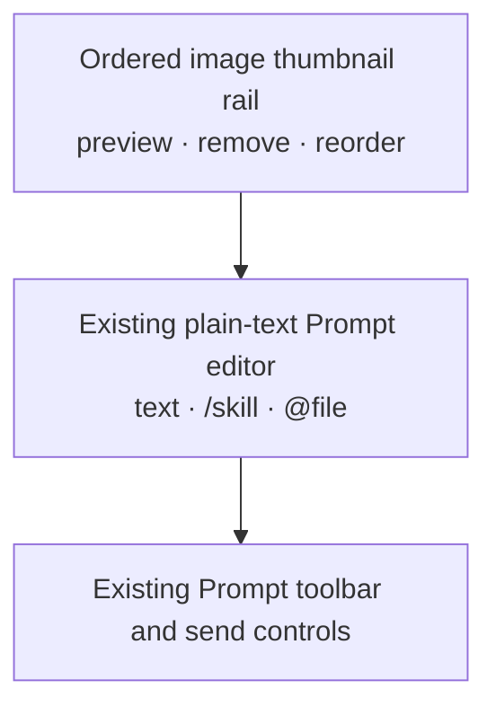
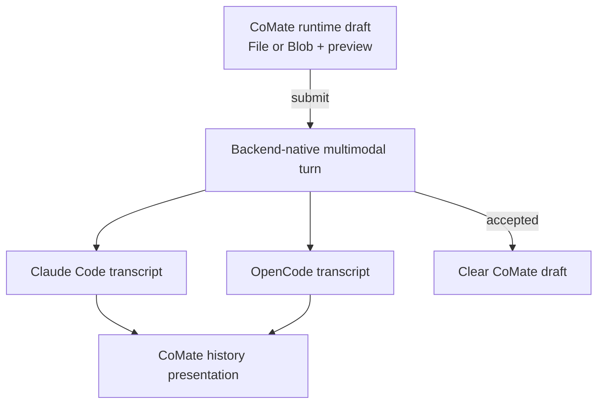
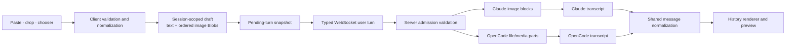
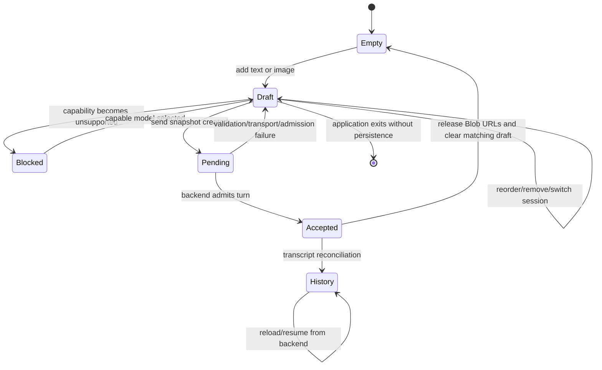
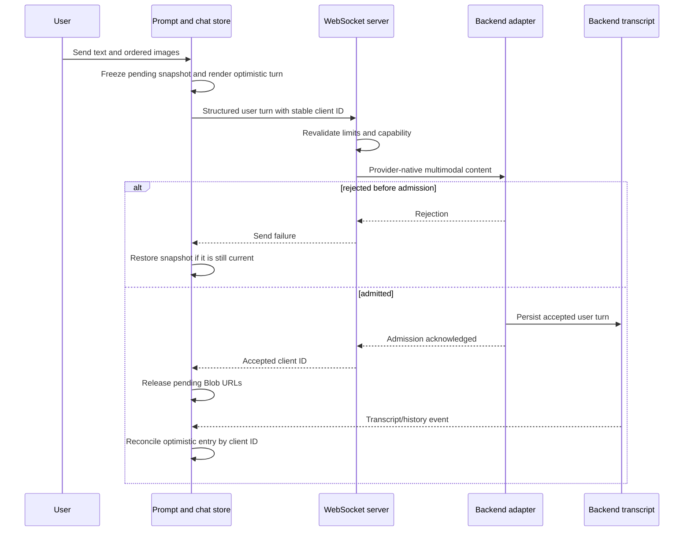

# Prompt Image Input - Plan

## Goal Capsule

- **Objective:** Let users attach UI screenshots directly to a Prompt so an agent can diagnose and fix visual bugs without an inaccurate text-only description or a manual save-and-`@` workflow.
- **Product authority:** This Product Contract defines image composition, draft ownership, backend submission, capability gating, and history presentation for ordinary Claude Code and OpenCode sessions. Bot sessions and generic file attachments remain outside active scope.
- **Open blockers:** None.

---

## Product Contract

### Summary

The Prompt composer will support ordered image attachments alongside optional text for Claude Code and OpenCode sessions.
CoMate will own only unsent runtime drafts; after a successful send, each backend transcript becomes the sole authority for the image and its historical presentation.

### Problem Frame

UI bugs are difficult to communicate accurately as text because layout, spacing, clipping, layering, and visual states are easy to omit or misdescribe.
The current workaround requires saving a screenshot to a file and inserting an `@` reference, which adds steps and still depends on the agent reading the file.

### Key Decisions

- **Deliver complete image composition in the first version.** (session-settled: user-directed — chosen over paste-only input and over adding screenshot annotation tools: the useful baseline is direct intake from paste, drop, and file selection.) Governs R1–R5.
- **Keep images outside the editable Prompt text.** (session-settled: user-directed — chosen over inline image tokens: the thumbnail rail preserves existing plain-text editing and semantic-reference behavior.) Governs R2, R6–R9.
- **Send provider-native multimodal content.** (session-settled: user-directed — chosen over automatic `@path` plus a Read tool: the selected path guarantees that the model receives the image with the user turn.) Governs R10, R11.
- **Delegate sent-image persistence to each backend transcript.** (session-settled: user-directed — chosen over a CoMate-owned attachment archive: Claude Code and OpenCode remain the authorities for their own session histories.) Governs R13–R16.
- **Gate image entry on the active model.** (session-settled: user-approved — chosen over silent text or path fallback: unsupported models must fail visibly before submission.) Governs R17, R18.
- **Normalize oversized images automatically before admission.** (session-settled: user-approved — chosen over forcing users to resize screenshots manually: CoMate may downscale and compress without cropping, and rejects only when safe normalization cannot satisfy the effective limits.) Governs R5.

### Actors

- A1. The user attaches screenshots, reviews their order, and submits them with optional instructions.
- A2. CoMate manages the unsent draft, presents capability and validation feedback, and adapts the resulting transcript for display.
- A3. Claude Code or OpenCode accepts the multimodal turn, persists it in its transcript, and returns it as session history.

### Requirements

**Composition and validation**

- R1. The Prompt accepts images from clipboard paste, drag and drop, and a file chooser.
- R2. Attached images appear in an ordered thumbnail rail above the plain-text editor, following layout direction A from the confirmed visual probe.
- R3. The user can preview, remove, and reorder attached images before sending.
- R4. The Prompt supports multiple images with optional text and also supports an image-only turn.
- R5. CoMate validates format, decoded dimensions, per-image size, aggregate size, and image count against the effective backend/model profile. It automatically normalizes oversized static images by proportional downscaling and compression without cropping; animated GIFs remain unchanged. The complete candidate batch is rejected without partial admission when an image is corrupt, unsupported, unsafe to decode, or still exceeds the effective limits after normalization.

**Draft lifecycle**

- R6. Unsent images remain separate from the Prompt string and from its semantic references.
- R7. Each session keeps its own unsent image draft while the application is running, including when the user switches to another session and returns.
- R8. A successful backend acceptance releases the submitted pending snapshot and clears the composer only when it still represents that submission; text or images added while the send is pending remain as the next draft. A validation, transport, or pre-admission backend failure restores the submitted text and images without overwriting a newer draft.
- R9. Workspace Prompt history continues to recall text only and does not resurrect previously sent image attachments.

**Submission and backend coverage**

- R10. CoMate submits ordered image content directly in the same user turn as the optional text rather than asking the model to discover it through a file tool.
- R11. Claude Code receives its native image content blocks, while OpenCode receives image-capable file or media parts that its provider layer converts to native multimodal input.
- R12. Both existing-session and new-session composers provide the same image behavior for ordinary Claude Code and OpenCode sessions.
- R13. While a send is pending, CoMate may render the user message from the immutable pending-turn snapshot; transcript reconciliation must preserve the ownership rule in R8.

**History authority and presentation**

- R14. CoMate does not create a durable copy of an image after its turn has been accepted by Claude Code or OpenCode.
- R15. Reloading or resuming a session reconstructs sent-image messages from the selected backend transcript and renders each returned image as an attachment that can be previewed.
- R16. If a backend transcript compacts, removes, or can no longer supply an image, CoMate reflects that backend state and does not restore the image from a private fallback archive.

**Capability behavior**

- R17. Image entry and submission are available only when the active backend and model advertise image-input support.
- R18. When image input is unsupported, CoMate disables the attachment entry points and explains why without silently converting the image to text, a local path, or an `@` reference.

### Key Flows

- F1. Compose a screenshot Prompt
  - **Trigger:** A1 pastes, drops, or selects one or more screenshots.
  - **Steps:** A2 validates the complete candidate batch, adds valid images to the ordered rail, and leaves the text editor independently editable.
  - **Outcome:** The user can review the exact visual evidence before sending.
  - **Covered by:** R1–R7.
- F2. Send a multimodal turn
  - **Trigger:** A1 sends a text-and-image or image-only Prompt.
  - **Steps:** A2 freezes the submitted content as a pending snapshot, creates an optimistic user message, and submits the ordered content to A3 in its native multimodal vocabulary. A2 may accept a new composer draft while the snapshot is pending.
  - **Outcome:** The accepted backend transcript becomes the message authority and the local draft is cleared.
  - **Covered by:** R8, R10–R13.
- F3. Reopen image history
  - **Trigger:** A1 reloads, resumes, or returns to a session containing sent images.
  - **Steps:** A2 loads the selected backend transcript, maps its image representation into the shared message presentation, and exposes image preview when bytes remain available.
  - **Outcome:** Historical images are visible without CoMate maintaining a second durable copy.
  - **Covered by:** R14–R16.
- F4. Encounter an unsupported model
  - **Trigger:** A1 selects a model without image-input capability.
  - **Steps:** A2 disables image intake and surfaces the model limitation before a draft can be submitted.
  - **Outcome:** No image is silently dropped or transformed into a weaker workflow.
  - **Covered by:** R17, R18.

### Acceptance Examples

- AE1. Paste a UI screenshot with instructions
  - **Covers R1, R2, R4, R6, R10.**
  - **Given:** The active session uses an image-capable model.
  - **When:** The user pastes a screenshot and types "fix the clipped button".
  - **Then:** A thumbnail appears above the editor and the backend receives the text and image in one user turn.
- AE2. Send multiple images without text
  - **Covers R3–R5, R10.**
  - **Given:** Three valid screenshots are attached in a user-selected order.
  - **When:** The user sends without entering text.
  - **Then:** All three images are submitted in that order as one turn.
- AE3. Preserve an unsent draft across session switches
  - **Covers R6–R8.**
  - **Given:** A session has unsent text and two attached images.
  - **When:** The user visits another session and returns without restarting the application.
  - **Then:** The original text, images, and image order are restored.
- AE4. Preserve a failed send
  - **Covers R5, R8, R13.**
  - **Given:** A valid multimodal draft is ready to send.
  - **When:** Validation, transport, or backend acceptance fails.
  - **Then:** No partial image batch is committed and the complete draft remains available for retry.
- AE5. Reload backend-owned history
  - **Covers R13–R16.**
  - **Given:** Claude Code or OpenCode previously accepted a turn with an image.
  - **When:** The user reloads or resumes that session.
  - **Then:** CoMate renders the image from the backend transcript and does not consult a separate CoMate image archive.
- AE6. Select a text-only model
  - **Covers R17, R18.**
  - **Given:** The active model does not support image input.
  - **When:** The user views the Prompt composer.
  - **Then:** Image intake is unavailable with an explanatory reason, while ordinary text input remains available.

### Success Criteria

- A user can submit a UI screenshot from the clipboard without first saving it or describing the visual defect in text.
- Claude Code and OpenCode both receive real multimodal turns, including image-only turns, when the selected model supports them.
- Unsaved drafts survive session switching and failed sends without creating durable sent-image storage in CoMate.
- Reloaded session history shows the images supplied by each backend transcript with preview behavior consistent across CoMate's message UI.
- Existing Prompt text editing, `/skill` references, `@file` references, IME behavior, history recall, and send shortcuts continue to work without images embedded in the editable DOM.

### Scope Boundaries

- No screenshot annotation, drawing, cropping, or image editing.
- No PDF, audio, video, or generic file-attachment expansion.
- No persistence of unsent image drafts across an application restart.
- No CoMate-owned durable archive, migration, deduplication store, or recovery copy beyond the boundary defined by R14.
- Historical image availability follows R16; CoMate adds no guarantee beyond backend retention.
- No image submission to bot sessions, which remain non-interactive.

### Dependencies / Assumptions

- Claude Code and OpenCode remain responsible for persisting accepted multimodal turns and exposing them through their existing transcript/history interfaces.
- CoMate can derive image availability from the active model rather than treating backend identity alone as sufficient.
- The existing plain-text Prompt architecture remains authoritative; image attachments form an adjacent draft collection rather than changing the Prompt document model.
- Backend-specific image limits may differ, so CoMate must present the effective limits for the active backend and model rather than inventing one universal capacity.

### Sources / Research

- Current text-only Prompt contract and paste/drop behavior: `src/client/components/PromptInput.tsx`.
- Current draft, optimistic message, Prompt history, and send behavior: `src/client/stores/chat-store.ts`.
- Current shared message vocabulary: `src/server/types/message.ts`.
- Current Claude Code submission boundary: `src/server/services/session-runtime.ts`.
- Current OpenCode text-flattening boundary: `src/server/services/opencode-adapter.ts`.
- Existing decision to keep the editable Prompt body plain text: `docs/plans/2026-08-16-1922-feat-prompt-input-semantic-references-plan.md`.
- Claude Code was used as the reference for pasted-image blocks, resizing, transcript-contained base64, and runtime file caching.
- OpenCode was used as the reference for `FilePart`/media normalization, provider-native conversion, transcript-owned data URLs, and historical thumbnail rendering.
- Codex and Pi were used as references for typed multimodal input and provider-specific image conversion.
- DeepSeek Harness was used as a contrast for durable attachment references; that sent-image store was deliberately excluded from CoMate ownership.

---

## Planning Contract

### Product Contract Preservation

This planning enrichment preserves the meaning and identifiers of R1–R18, F1–F4, and AE1–AE6. It adds implementation detail and the user-confirmed normalization behavior to R5 without expanding the Product Contract into generic attachments, durable CoMate image history, bot sessions, or image editing.

### Context and Repository Findings

- `src/client/components/PromptInput.tsx` currently exposes a string-only send contract and handles paste/drop as text or semantic references. Images should remain adjacent state so the content-editable DOM and its IME/reference behavior are not rewritten.
- `src/client/stores/chat-store.ts`, `src/client/lib/websocket-client.ts`, `src/server/websocket/types.ts`, and `src/server/websocket/server.ts` carry a string prompt end to end. The send boundary must become a typed turn while retaining a text-only compatibility path for existing callers.
- The current optimistic flow clears text before backend acceptance. A multimodal send therefore needs an immutable pending-turn snapshot that can restore both text and image drafts on pre-admission failure.
- New-chat creation currently derives its first title and send from a text prompt. Image-only creation needs an explicit fallback title and must transfer the new-chat draft into the created session before submission.
- `src/server/services/session-runtime.ts` already owns Claude SDK user-message construction. It is the correct boundary for translating the shared turn into Anthropic image blocks.
- `src/server/services/opencode-adapter.ts` currently flattens prompts to text, and `src/server/services/opencode-transcript.ts` maps only text/reasoning/tool parts. Both send and history translation must preserve OpenCode image-capable file/media parts.
- `src/server/types/message.ts` and `src/client/types/message.ts` are mirrored contracts. Image history parts must be added identically and covered by a parity assertion.
- `src/server/services/agent-backends.ts`, `src/server/utils/provider-capability.ts`, and `src/client/stores/backend-store.ts` already establish conservative capability declarations and disable-with-reason UI. Image support should extend this mechanism instead of creating a composer-only model list.
- `docs/solutions/integration-issues/sse-stream-resume-on-reconnect-2026-05-18.md` requires history replay not to overwrite local in-flight state. `docs/solutions/integration-issues/sse-subscription-race-condition-2026-05-21.md` requires identity-guarded async cleanup. Both apply to pending image turns and object-URL lifecycle.
- `docs/solutions/conventions/use-isolated-test-database-for-comate.md` applies to every server test added by this plan; server suites must initialize the isolated test environment before importing stateful modules.

### Upstream Reference Findings

- Claude Code converts pasted images to native Anthropic base64 image blocks, automatically constrains them to 2000×2000 and a 5 MiB base64 ceiling, and persists accepted blocks in its JSONL transcript. Its separate image cache is runtime convenience rather than transcript authority.
- Pi also persists base64 `ImageContent` in session JSONL and defaults to 2000×2000 with a 4.5 MiB base64 target, progressively reducing JPEG quality and dimensions.
- OpenCode composes image attachments as file/media parts backed by data URLs and persists those parts with its session data. Its reusable normalizer defaults to 2000×2000 and 5 MiB, although direct-composer normalization is not consistently enforced in the inspected revision.
- Codex snapshots local images into portable data URLs, then applies dimension and visual-patch budgets before provider submission; its rollout retains typed image items rather than depending on the original file path.
- These implementations support a direct multimodal contract plus bounded automatic normalization. None requires a user-visible file tool invocation for ordinary image input.

### Key Technical Decisions

- **KTD-1 — Use a shared typed user-turn envelope.** The client, WebSocket protocol, chat service, and runtime adapters carry optional text plus an ordered image array. This avoids embedding binary data in the editor string and gives queued, optimistic, and retry paths one lossless value. Governs R6, R10–R13 and F2.
- **KTD-2 — Normalize in the client and validate again at the server boundary.** The browser performs a real decode and normalization for immediate feedback and smaller WebSocket frames. The server treats client metadata as untrusted and rechecks base64 syntax, allowlisted MIME signature, parseable dimension headers, image count, per-image base64 length, and aggregate payload before provider admission. This prevents limit bypasses without duplicating image transformation on the server; provider decode rejection remains a pre-admission failure under KTD-4. Governs R5 and AE2/AE4.
- **KTD-3 — Use a conservative v1 normalization profile.** Accept PNG, JPEG, WebP, and GIF; reject corrupt or mismatched content. For PNG/JPEG/WebP, preserve aspect ratio, cap width and height at 2000px, and iteratively encode below 4.5 MiB of base64 data. GIF is passed through unchanged to preserve animation and must already fit. Reject raw inputs above 20 MiB or 40 megapixels before expensive work, allow at most 10 images, and cap the normalized batch at 20 MiB of base64 data. A stricter backend/model profile overrides these defaults. Governs R5.
- **KTD-4 — Define backend acceptance as runtime admission, not model completion.** Validation, WebSocket/transport failure, or runtime rejection before transcript admission restores the pending snapshot. Once the backend has accepted the turn into its transcript, later provider/tool execution errors do not refill the editor, preventing duplicate resubmission. Governs R8, R13 and AE4.
- **KTD-5 — Keep only unsent and pending bytes in CoMate.** Draft `File`/`Blob` objects and object URLs live in runtime client state keyed by workspace plus session identity, with a workspace-scoped new-chat identity before creation. Successful admission releases only the matching pending snapshot; history is reconstructed exclusively from Claude/OpenCode transcript parts. Governs R7–R9 and R14–R16.
- **KTD-6 — Extend existing backend/model capability resolution.** Add an `imageInput` backend capability and a server-owned model profile. Known capable defaults/models are enabled; known text-only and unknown/custom models remain unavailable until declared. A capability change never deletes an attached draft: it blocks send and explains the reason until the user selects a capable model. Governs R17, R18 and F4.
- **KTD-7 — Treat image input as context parity, not a new agent tool.** The model receives the same ordered images the human composed through native message content. No new MCP/tool or approval surface is introduced because the feature does not add an agent-initiated action. Governs R10, R11.
- **KTD-8 — Reconcile optimistic messages by stable client turn identity.** The pending local bubble, WebSocket acknowledgement, backend transcript event, and history replay use one client turn identifier. Reconciliation replaces or confirms the optimistic entry without clearing a newer draft or duplicating accepted images. Governs R8, R13–R16.

### High-Level Technical Design

These diagrams establish boundaries and sequencing; they are not prescribed class or function signatures.

### System-Wide Impact

- **Contracts:** The prompt send payload, queued-send representation, runtime push boundary, normalized chat message, and client/server mirrored message types all gain ordered image parts. Text-only payloads remain valid during the migration.
- **State lifecycle:** Draft images are session keyed, including a distinct new-chat key. A send moves ownership into a pending snapshot; only matching acceptance may release its object URLs. Session switching, reconnection, and history reload must not mutate another session's draft or a newer draft created after send.
- **New-session flow:** The draft key includes workspace identity so screenshots cannot leak between workspaces. Creation must permit an image-only initial turn, use a neutral fallback title such as `Image prompt`, and atomically transfer that workspace's new-chat draft into the newly created session before the first send.
- **Failure propagation:** Intake failures remain local; server validation failures return structured, actionable errors; transport/runtime rejection restores the snapshot; provider errors after admission stay in history and do not restore the composer.
- **Capability changes:** Backend capability and model profile are resolved server-side and mirrored to the client. Switching to an unsupported model retains thumbnails but disables intake/send with an explanation.
- **History and compaction:** Claude and OpenCode translators map transcript images into one shared image part. Missing, compacted, invalid, or inaccessible history images render a non-interactive placeholder and never consult a CoMate fallback.
- **Performance:** Base64 increases payload size by roughly one third and duplicates data during browser conversion. Client normalization, count/aggregate caps, sequential or bounded-concurrency decoding, and timely object-URL revocation keep memory and WebSocket frames bounded.
- **Security and privacy:** Server validation must inspect decoded bytes for allowlisted MIME signatures and parse dimensions from trusted format headers rather than filenames or client-declared types. Error/log paths must report dimensions and sizes without logging base64 data, data URLs, or screenshot contents.
- **Search and prompt history:** Text search, prompt recall, and generated session titles consume text only. Image-only turns use the explicit fallback title; images do not become searchable blobs.
- **Agent-native parity:** Both backends receive the same human-composed image context. No human-only durable archive or hidden tool workflow exists.

### Risks and Dependencies

- **Browser image processing variance:** Canvas encoding can differ by browser and may drop metadata. Mitigation: constrain supported static formats, test observable bounds rather than byte-identical output, preserve orientation during decode, and fail visibly when normalization cannot complete.
- **Animated GIF handling:** Browser re-encoding would flatten animation. Mitigation: never transform GIF in v1; validate and pass through only when it already fits the effective profile.
- **Large-payload memory pressure:** File bytes, decoded bitmap, encoded base64, and WebSocket serialization may coexist. Mitigation: apply the raw-size/pixel guard before decode, process with bounded concurrency, enforce aggregate limits, and release intermediate buffers/object URLs promptly.
- **Backend transcript drift:** Claude SDK or OpenCode part shapes may change independently. Mitigation: keep translation isolated in each adapter, add fixture-based transcript tests, and render an unavailable placeholder for unrecognized historical image data.
- **Capability uncertainty:** Claude SDK model metadata does not expose a universal vision flag, while OpenCode capability data may depend on provider configuration. Mitigation: keep profiles server-owned and conservative; unknown/custom models are unsupported until explicitly declared and tested.
- **Optimistic/history races:** A reconnect or replay can arrive before send acknowledgement. Mitigation: use stable client turn identity and identity-guarded reconciliation, following the cited SSE race learnings.
- **No CoMate recovery copy:** Backend compaction may make a historical image unavailable. This is intentional under R14–R16; UI placeholders and acceptance tests must make the boundary explicit.
- **Dependency:** Provider-native image input must remain available in `@anthropic-ai/claude-agent-sdk` and `@opencode-ai/sdk`. No new native image-processing dependency is required for v1; browser APIs perform draft normalization.

### Implementation Units

#### U1 — Establish multimodal contracts, limits, and capability profiles

- **Goal:** Create one typed vocabulary and one effective-capability/limit source that every later unit consumes.
- **Requirements:** R5, R10–R12, R17, R18; F4; AE6.
- **Files to modify:** `src/client/types/message.ts`, `src/server/types/message.ts`, `src/server/websocket/types.ts`, `src/server/services/agent-backends.ts`, `src/server/utils/provider-capability.ts`, `src/client/stores/backend-store.ts`, `src/client/i18n/en/chat.json`, `src/client/i18n/zh-CN/chat.json`.
- **Files to create:** `src/server/utils/image-input-profile.ts` and its focused test.
- **Approach:** Extend the existing message and WebSocket contracts with an ordered image send descriptor, transcript image part, structured validation error, `imageInput` capability, and effective limit profile. Keep client/server wire declarations byte-identical where the repository already requires mirrored types; do not introduce a parallel prompt-contract abstraction. Preserve the existing string/text-only path as a valid degenerate turn during rollout.
- **Test scenarios:** Known capable Claude/OpenCode models resolve enabled profiles; known text-only and unknown custom models resolve unavailable with a reason; client/backend capability mirrors agree; text-only payloads still decode; malformed or reordered wire image fields fail deterministically.
- **Verification:** Type contracts compile on both sides, capability API responses include `imageInput`, and parity tests prove the mirrored message vocabulary cannot drift.
- **Depends on:** None.

#### U2 — Build image intake, normalization, and session-scoped draft UI

- **Goal:** Let users compose and manage bounded image drafts without changing the editable Prompt document model.
- **Requirements:** R1–R7, R17, R18; F1/F4; AE1–AE3/AE6.
- **Files to modify:** `src/client/components/PromptInput.tsx`, `src/client/components/PromptInput.browser.test.tsx`, `src/client/stores/chat-store.ts`, `src/client/i18n/en/chat.json`, `src/client/i18n/zh-CN/chat.json`.
- **Files to create:** `src/client/lib/image-input.ts`, `src/client/components/PromptImageRail.tsx`, and focused browser/jsdom tests beside them.
- **Approach:** Add paste, drop, and hidden file-chooser intake; normalize a complete candidate batch according to KTD-2/KTD-3; show a horizontally scrolling ordered rail above the editor without wrapping. Preview opens an accessible dialog and returns focus to its thumbnail; pointer reordering has keyboard move-left/move-right controls. During asynchronous normalization, show a busy state for the candidate batch; failures leave existing attachments unchanged and appear in a persistent inline alert adjacent to the rail. Retain drafts by the KTD-5 identity in runtime state only. Preserve attached images when capability changes but block additional intake and submission while unsupported.
- **Test scenarios:** Paste/drop/chooser accept supported static images; image-only drafts enable send; oversized PNG/JPEG/WebP are proportionally normalized; compliant GIF passes unchanged while oversized GIF fails; corrupt, 40MP+, over-count, and aggregate-over-limit batches add nothing and expose an inline reason; reorder/remove/preview are keyboard accessible and restore focus; narrow layouts scroll the rail; switching sessions during normalization cannot attach results to the wrong draft; each runtime draft restores by workspace/session identity; unsupported capability disables entry points without deleting existing images.
- **Verification:** Existing IME, semantic reference, prompt-history, send-shortcut, and text paste/drop browser tests remain green alongside observable normalized size/dimension assertions.
- **Depends on:** U1.

#### U3 — Make send, retry, queueing, and new-session transitions lossless

- **Goal:** Carry the complete composed turn through optimistic UI and failure recovery without stale draft mutations.
- **Requirements:** R4, R7–R13; F2; AE2–AE4.
- **Files to modify:** `src/client/stores/chat-store.ts`, `src/client/stores/chat-store.test.ts`, `src/client/lib/websocket-client.ts`, `src/client/App.tsx`, `src/client/components/NewChatPage.tsx`, `src/client/components/NewChatPage.test.tsx`.
- **Approach:** Replace string-only pending/queued values with immutable typed turn snapshots; assign a stable client turn ID; clear the visible composer into pending state; restore only the matching snapshot on pre-admission failure; transfer the new-chat draft into the created session before send; derive an image-only fallback title without inspecting image bytes.
- **Test scenarios:** Text-only behavior is unchanged; image-only and mixed turns preserve order; an approval/subscription queue retains images; validation/transport/runtime rejection restores the exact draft; acceptance followed by provider error does not restore it; a newer draft typed during a pending send is never cleared or overwritten; new-chat image-only creation sends once and receives the fallback title.
- **Verification:** Store tests cover every ownership transition and reconnection/history replay cannot duplicate the optimistic turn or clobber a newer draft.
- **Depends on:** U1, U2.

#### U4 — Admit bounded image turns and translate Claude content blocks

- **Goal:** Enforce the trust boundary and submit ordered native image blocks to Claude.
- **Requirements:** R5, R8, R10–R13; F2; AE1/AE2/AE4.
- **Files to modify:** `src/server/websocket/server.ts`, `src/server/websocket/server.test.ts`, `src/server/services/chat-service.ts`, `src/server/services/session-runtime.ts`, `src/server/services/session-runtime.test.ts`.
- **Files to create:** `src/server/utils/image-input-validation.ts` and focused tests.
- **Approach:** Validate base64, format signature, declared-versus-detected MIME, dimension headers, and limits before runtime admission; reject the whole turn on any invalid member; map ordered images to Claude base64 image blocks plus optional text; return an explicit admission acknowledgement keyed by client turn ID. Treat provider decode rejection as pre-admission and never log image data.
- **Test scenarios:** Valid PNG/JPEG/WebP/GIF blocks preserve order and MIME; image-only turns are accepted; spoofed MIME, invalid base64, invalid/truncated headers, limit bypasses, provider decode rejection, and aggregate overflow reject atomically; unsupported capability rejects before runtime push; acknowledgement occurs only after runtime admission; post-admission execution failure remains an accepted turn.
- **Verification:** WebSocket and runtime tests assert exact provider block structure, failure classification, acknowledgement timing, and absence of partial admission. Server tests import the isolated test environment first.
- **Depends on:** U1, U3.

#### U5 — Preserve OpenCode image parts through send and transcript replay

- **Goal:** Give OpenCode the same multimodal input and backend-owned history semantics as Claude.
- **Requirements:** R10–R16; F2/F3; AE1/AE2/AE5.
- **Files to modify:** `src/server/services/opencode-adapter.ts`, `src/server/services/opencode-adapter.test.ts`, `src/server/services/opencode-transcript.ts`, `src/server/services/opencode-transcript.test.ts`, and OpenCode provider configuration owned by the adapter if required.
- **Approach:** Stop flattening multimodal turns to text; emit ordered OpenCode file/media parts with data URLs and declared filenames; configure image/attachment capability consistently with the server-owned model profile; translate persisted image parts back into the shared transcript image type without copying them into CoMate storage.
- **Test scenarios:** Mixed and image-only turns produce valid OpenCode parts; order and MIME survive; unsupported profiles refuse submission; transcript fixtures with data URLs return renderable shared image parts; missing/remote/invalid or compacted image data becomes unavailable metadata rather than a fabricated fallback; text/reasoning/tool translation remains unchanged.
- **Verification:** Adapter and transcript fixtures prove send/history round-trip fidelity for both supported static images and bounded GIFs.
- **Depends on:** U1, U4.

#### U6 — Render and reconcile backend-owned historical images

- **Goal:** Present optimistic and historical images consistently while keeping the backend transcript authoritative.
- **Requirements:** R13–R16; F3; AE5.
- **Files to modify:** `src/server/services/message-normalizer.ts`, `src/server/services/message-normalizer.test.ts`, `src/client/components/chat-message-adapter.ts`, `src/client/components/chat-message-adapter.test.ts`, `src/client/components/ChatMessageRenderer.tsx`, `src/client/components/ChatMessageRenderer.test.tsx`, `src/client/components/ChatMessageRenderer.browser.test.tsx`.
- **Approach:** Normalize Claude/OpenCode transcript image blocks into one shared part; reconcile the optimistic message by stable client turn ID; render ordered thumbnails with preview and an unavailable placeholder; revoke draft object URLs only when their owning pending turn settles. Keep text search and prompt recall image-blind.
- **Test scenarios:** Optimistic thumbnails reconcile to one transcript message; reload/resume renders backend data; a replay arriving before acknowledgement remains idempotent; missing/invalid historical content renders a placeholder; multiple images preserve order; text-only messages and tool rendering are unaffected; preview has accessible name, focus handling, and close behavior.
- **Verification:** Normalizer, adapter, renderer, and browser tests cover Claude and OpenCode fixtures plus reconnect ordering.
- **Depends on:** U4, U5.

#### U7 — Close cross-backend acceptance, documentation, and regression coverage

- **Goal:** Demonstrate that the complete Product Contract works on both backends and record its operational boundaries.
- **Requirements:** R1–R18; F1–F4; AE1–AE6.
- **Files to modify:** `docs/acceptance/agent-backend-parity-checklist.md`, `CHANGELOG.md`, and only the existing test files named by U1–U6 where integration coverage needs consolidation.
- **Approach:** Add a capability evidence row for image input, document effective limits and transcript ownership, exercise real Claude/OpenCode round trips manually, and run the repository-wide regression gates. Record any backend/version-specific limitation as a capability profile rather than a silent fallback.
- **Test scenarios:** Execute AE1–AE6 for Claude and OpenCode; verify one oversized static screenshot is normalized automatically; verify an unprocessable/oversized GIF is rejected with the draft intact; restart the app to confirm unsent images are intentionally gone; reload accepted sessions to confirm history comes only from each backend; select an unsupported/unknown model and confirm disable-with-reason behavior.
- **Verification:** Automated suites pass, the parity checklist cites executable evidence, and manual transcript inspection confirms the actual backend receives and later returns image content.
- **Depends on:** U2, U3, U4, U5, U6.

### Verification Contract

#### Automated gates

- Run focused client browser/jsdom tests for Prompt composition, session-scoped drafts, optimistic reconciliation, history rendering, preview accessibility, and new-chat image-only creation.
- Run focused server tests for WebSocket admission, server-side byte/header validation, Claude content blocks, OpenCode file/media parts, transcript normalization, and capability profiles.
- Run `npm run test:client`, `npm run test:browser`, and `npm run test:server` after the focused suites.
- Run `npm run typecheck` and `npm run lint` to catch client/server contract drift and unsafe unused branches.
- Run `npm run check` before handoff because the change crosses renderer, server, WebSocket, provider, and package boundaries.

#### Required observable outcomes

- Every AE1–AE6 scenario has at least one automated assertion, with backend-specific integration coverage for AE1, AE2, AE4, and AE5.
- Text-only Prompt behavior remains byte-compatible on the wire or is covered by an explicit compatibility decoder test.
- No failing intake or pre-admission send partially adds, sends, or clears images.
- No successful admission retains CoMate-owned draft bytes or requires a private history copy.
- Reconnect/replay order cannot duplicate a turn, revoke another turn's object URL, or overwrite a newer draft.
- Logs, snapshots, and test failure messages contain no real base64 payloads beyond tiny synthetic fixtures.

#### Manual backend checks

- With a known image-capable Claude model, send a large UI screenshot plus text, inspect that it is normalized, confirm Claude receives a native image block, reload the session, and preview the transcript-owned image.
- Repeat the same mixed and image-only checks with OpenCode, verifying that the persisted part is returned from OpenCode history rather than a CoMate cache.
- Switch each backend to an unsupported or unknown/custom model and confirm the draft remains visible, intake/send are blocked, and the reason is understandable.
- Force a transport rejection before admission and a provider error after admission; confirm only the former restores the draft.

### Definition of Done

- R1–R18, F1–F4, and AE1–AE6 are traceable to completed implementation units and passing verification.
- Users can paste, drop, or choose ordered screenshots; preview, remove, and reorder them; and send mixed or image-only turns without embedding images in Prompt text.
- Static images are automatically normalized within KTD-3, GIF handling is explicit, and the server atomically rejects every invalid or over-limit batch.
- Claude and OpenCode receive provider-native multimodal turns and expose accepted images through their own transcripts.
- Session switching and retry behavior preserve unsent drafts, while application restart intentionally does not.
- Successful admission clears and releases only the matching draft; reconnect/history replay is idempotent.
- Unsupported and unknown model behavior is capability-gated with a localized explanation and no silent fallback.
- Historical images render with accessible preview or an honest unavailable placeholder, without durable CoMate image storage.
- Focused and full verification gates pass, backend parity evidence is updated, and no unrelated Prompt, tool, or bot-session behavior regresses.

### Open Questions

#### Resolved During Planning

- Images are direct multimodal content, not `@path` references or Read-tool indirection.
- CoMate persists only runtime drafts; accepted history belongs exclusively to Claude Code/OpenCode transcripts.
- Oversized static images are automatically normalized without cropping; GIFs are never re-encoded in v1.
- Runtime admission is the draft-clearing boundary; later provider execution failure does not restore the editor.
- Unknown/custom models are conservatively treated as image-unsupported until declared.
- Bot sessions, generic files, PDF/audio/video, annotation, cropping, and restart-persistent drafts remain out of scope.

#### Deferred to Implementation

- Exact model identifiers in the initial capable/unsupported profile must be derived from the versions bundled by this repository and locked by fixtures; this may update data entries but must not change KTD-6's conservative rule.
- Browser encoding quality steps may be tuned to reliably reach the 4.5 MiB target, provided the observable KTD-3 limits and no-crop behavior remain unchanged.
