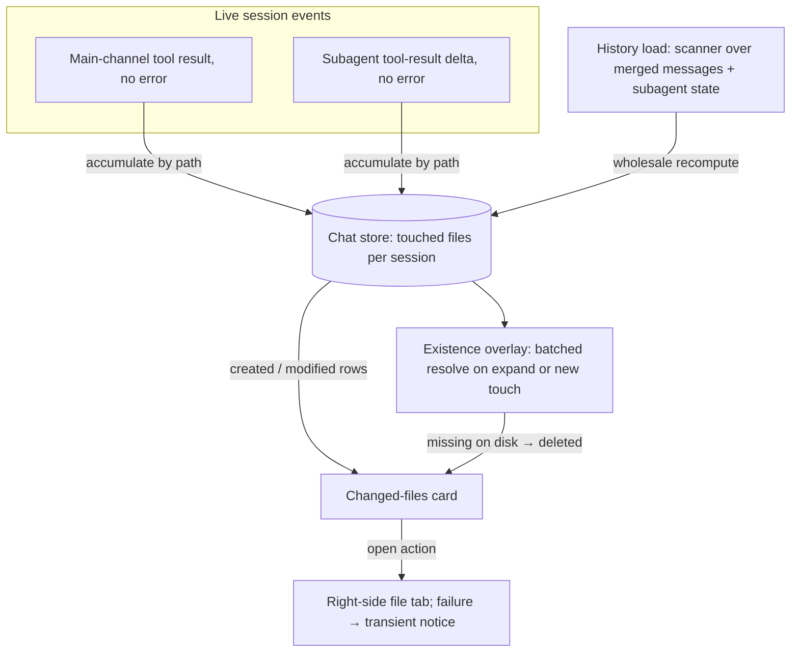

# Session Changed Files Panel - Plan

## Goal Capsule

- **Objective:** Add a session-scoped "changed files" floating card below the floating Task panel in the chat view, so users can see at a glance which files the agent created, modified, or deleted during the current conversation and open any of them with one click.
- **Product authority:** User request — opening an agent-touched file today costs six manual steps, including copying the file name from the transcript into the file explorer's search.
- **Execution profile:** Client-only work in the React/Zustand layer; no server, schema, or API changes.
- **Stop conditions:** Any change to product behavior or scope (e.g., reintroducing a review action, capturing bash-driven changes) goes back to the user; any need to modify server routes or the SSE event contract surfaces before coding continues.
- **Open blockers:** None.

---

## Product Contract

Product Contract preservation: restructured, no scope change — the Outstanding Questions entry was resolved by planning research (subagent edits do surface through the parallel subagent channel); no requirement text altered.

### Summary

A collapsible floating card stacked under the chat view's Task panel lists the files the agent touched in the active session, each row carrying a created/modified/deleted badge, the workspace-relative path, and an open action. The list's core value is awareness — knowing which files changed without scrolling the transcript — and it deliberately ships without any review/diff action. A companion change makes in-chat file paths open on plain click with a visible affordance.

### Problem Frame

The concrete pain, reported from real use: to open a file the agent just modified, the user scrolls back through the conversation, finds the file name in a tool call, copies it, switches to the file explorer, searches, and opens it — six steps with a copy-paste in the middle. The transcript does render each edit, but the file name inside it is not an obvious way out: paths open only via Cmd/Ctrl+click, and nothing on screen hints at that shortcut — the tooltip shows the path and the clickable styling appears only while the modifier is already held. Meanwhile the workspace Changes tab answers "what is uncommitted" for git repositories, not "what did this conversation touch," and it lives one more context switch away from the chat. The result is that during and after a session, the user has no single glanceable answer to "which files did the agent just change?"

### Key Decisions

- **Awareness-first list, no review action.** Review was cut because every baseline proved unreliable: a HEAD-based diff goes empty the moment anything commits mid-session, non-git workspaces have no baseline at all, and a session-start snapshot facility was judged too expensive for the value. Per-edit inline diffs already exist in the chat stream, and the workspace Changes tab covers git review.
- **Independent floating card below the Task panel.** Chosen over merging the list into the Task card and over a collapsed count-only pill, because the core value is seeing the file names themselves at a glance; the pill shows only a count, and the merged card pushes files below a long task list. Governs R1.
- **Collect explicit file-tool touches only.** Chosen over file-system watching and git-status cross-checks: both alternatives capture bash-driven changes but add noise or wrong attribution, while file tools carry exact paths. The accepted gap — bash-driven changes never appear — is documented in R5 and AE3. Governs R5.
- **The list is a derivation over session history, not live-only state.** It is rebuilt from the session's persisted tool activity, so historical sessions and app restarts keep their lists. Governs R8.
- **In-chat file paths open on plain click.** The existing modifier-only open is undiscoverable (no static affordance at all), which was a root cause of the six-step workflow; making it visible and unmodified attacks the same pain at a second entry point for near-zero cost. Governs R14.

### Requirements

**Panel behavior**

- R1. Add a collapsible changed-files card to the chat view's floating right-side stack, positioned directly below the floating Task panel.
- R2. The card is hidden whenever the active session has no recorded file changes.
- R3. The card mirrors the Task panel's session behavior: its content is session-scoped, and its collapsed state resets when switching sessions.
- R4. The list caps its visible height and scrolls internally when entries exceed it.

**Collection**

- R5. The list collects the paths touched by the Edit, Write, MultiEdit, and NotebookEdit tools in the active session; changes made any other way (for example via Bash) do not appear.
- R6. Each file appears exactly once, with a status of created, modified, or deleted derived from its session touches; once a file is marked created, later modifications in the same session keep the created badge.
- R7. Only files inside the workspace folder are listed.
- R8. The list is derived from the session's persisted tool activity, so it is available for historical sessions and after an app restart.

**List display**

- R9. Each row shows a status badge (created / modified / deleted), the workspace-relative path with the directory portion visually dimmed, and an open action.
- R10. A file whose latest status is deleted stays in the list with struck-through styling and its open action disabled.
- R11. Rows are ordered by most recent touch first.

**Open action**

- R12. The open action opens the file in the workspace's right-side file tab through the existing file-open path.
- R13. If the file can no longer be read when opened, the user gets a notice instead of an error or silent failure.

**Chat file-path affordance**

- R14. In-chat file paths open on plain click, and their clickability is visible without holding a modifier key.

### Key Flows

- F1. Watch a turn change files
  - **Trigger:** The agent completes a file-tool call during a turn.
  - **Steps:** The touched path is recorded for the session; the card appears if hidden; the file's row is added or updated with its badge and moved to the top.
  - **Outcome:** The user watches the change set accumulate in real time without reading tool calls.
  - **Covers R1, R2, R5, R6, R9, R11.**
- F2. Open a changed file
  - **Trigger:** The user clicks a row's open action.
  - **Steps:** The file opens in the right-side file tab; if it no longer exists, a notice explains that instead.
  - **Outcome:** One click replaces the six-step copy-search-open path.
  - **Covers R12, R13.**
- F3. Return to a historical session
  - **Trigger:** The user opens a past session, including after an app restart.
  - **Steps:** The list is rebuilt from the session's persisted tool activity.
  - **Outcome:** "What did that conversation touch" stays answerable days later.
  - **Covers R8.**

### Acceptance Examples

- AE1. **Covers R6.** Given the agent edits `src/a.ts` three times in one session, when the list renders, then `src/a.ts` appears exactly once with a modified badge.
- AE2. **Covers R6, R10.** Given the agent creates `draft.md` and later deletes it within the same session, when the list renders, then `draft.md` appears once, struck through, with its open action disabled.
- AE3. **Covers R5.** Given the agent creates files only through Bash commands in a session, when the list renders, then those files do not appear.
- AE4. **Covers R2.** Given a session with no file-tool activity, when the chat view renders, then the card is not shown.
- AE5. **Covers R8.** Given the app has restarted since a session's edits, when the user reopens that session, then the list shows the files it touched.

### Success Criteria

- The user can name the files a session touched without scrolling the chat transcript.
- Opening an agent-touched file from the chat view takes one click, down from the six-step copy-search-open path.

### Scope Boundaries

- No review or diff action on list entries, in any form — HEAD-baseline, pinned-session-commit, and snapshot variants were all considered and rejected; the chat's per-edit inline diffs and the workspace Changes tab remain the review surfaces.
- No capture of bash-driven file changes via file-system watching or git-status cross-checks; the resulting awareness gap is accepted and documented (R5, AE3).
- No improvement to the file explorer's own entry point — this feature bypasses that entry rather than fixing it.

#### Deferred to Follow-Up Work

- Incremental bot-session message appends (`loadMessagesAfter`) do not rescan touched files, matching the existing task-list gap; a bot session's card fills on the next full load.
- A soft cap or virtualization for very long lists, only if real sessions show a performance problem.
- Server-pushed deletion status, only if the client-side existence check proves too chatty in practice.

### Dependencies / Assumptions

- Tool-completion events already deliver full tool inputs (including file paths) to the client per session, so R5 needs no new capture mechanism. Verified against the current codebase.
- The existing file-open route errors with a 500 when the file is missing, so R13 requires new graceful handling. Verified against the current codebase.

### Sources / Research

- Floating stack host: `src/client/components/ChatPanel.tsx:401-409`; Task panel empty-state and session-switch conventions: `src/client/components/TaskPanel.tsx:95-128`.
- Tool-event materialization on the client: `src/client/stores/chat-store.ts:1649-1659`; server emission with full input: `src/server/services/sse-emitter.ts:656-660`.
- Existing file-open path: `src/client/stores/context-tab-store.ts:246-279`; missing-file 500 behavior: `src/server/routes/files.ts:338,400-403`.
- Modifier-only in-chat path open with no static affordance: `src/client/components/tool-renderers/FilePath.tsx:55`.
- Related prior plans for the workspace-scoped Changes tab (a distinct surface from this session-scoped list): `docs/plans/2026-07-17-002-feat-git-changes-panel-plan.md`, `docs/plans/2026-07-17-003-refactor-files-git-right-panel-plan.md`.

---

## Planning Contract

### Key Technical Decisions

- KTD1. **The derivation lives in the chat store, extending the task-derivation idiom.** The list's data source is the chat message stream, which the chat store already owns; a separate store would have to subscribe to it or duplicate SSE handling, and the standalone-store precedents own their data (server push, file fetches). Persisted history returns complete tool inputs for both main and subagent messages, so no server work is needed.
- KTD2. **A touch counts only on a confirmed tool result.** Accumulation fires when a tool result arrives without an error, so approval rejections, never-decided approvals, and failed edits (for example an Edit whose old_string did not match) never enter the list. There are two capture sites — the main-channel tool-result path and the subagent tool-result delta, with input joined by toolUseId — because the server diverts subagent tool calls out of the main channel. Governs R5.
- KTD3. **History rebuild is a wholesale recompute over merged state.** On session load the scanner runs over the combined history-plus-live messages and the merged subagent state, so a reload can replace the session's list outright without losing touches that raced the load. Entries dedupe by normalized path, order by a recorded last-touch timestamp, and keep created sticky within a session. On history rebuild, a subagent touch takes its parent subagent's end-or-start time as the last-touch timestamp; live accumulation uses accumulation time. Governs R6, R8, R11.
- KTD4. **Deleted is detected, not streamed.** The four file tools never delete, and the event stream carries no deletion signal, so a batched existence check against the files-resolve endpoint runs when the card expands and when a new touch lands while it is expanded, cached with a short TTL. A touched file missing on disk shows as deleted — overriding its created/modified status — until a later check finds it again. Governs R6, R10.
- KTD5. **Created-versus-modified uses structured tool-result metadata with a heuristic fallback.** Write's create/update result type and Edit's diff status (or null original file) identify creations when present; otherwise a first-seen Write counts as created and everything else as modified. Metadata presence varies with SDK version and transcript age, so the fallback is mandatory, not optional. Subagent tool results carry no structured metadata under the current subagent event contract, so the fallback always applies to subagent touches and a subagent Write to an existing file will read created — accepted, because widening that payload is an event-contract change reserved by the stop conditions. Governs R6, R9.
- KTD6. **Workspace membership is judged at the panel layer, not inside the chat store.** The chat store cannot see the workspace folder path (importing the workspace store would create an import cycle), so entries are stored as normalized absolute paths, and a memoized selector at the panel applies the prefix membership check and relativization using the active workspace. The existence hook relativizes before calling the resolve endpoint, which rejects absolute paths. String-prefix membership can silently under-include on symlink or case mismatches, accepted because the server endpoints remain the security boundary when the file is opened. Governs R7.
- KTD7. **Open failures share one notice path.** The existing open handler logs failures silently; failures instead raise the app's existing toast system, and both the card's open action and in-chat path clicks funnel through one handler. Governs R13, R14.

### High-Level Technical Design

Two status sources feed each row: the stream-derived created/modified status (sticky, per KTD3 and KTD5) and the detected deleted status (point-in-time, per KTD4). Deleted wins while the file is missing; the stream status reappears if the file comes back.

### Deferred to Implementation

- Exact SSE field names for the error flag on the main-channel tool-result event and the subagent tool-result delta — verified against live event shapes during implementation.
- Whether the existence check also fires on app-window focus; start without it and add only if stale deleted badges prove common.

### Sequencing

U1 → U2 → U3 and U4 (independent of each other) → U5 → U6. U6 is last because its failure-notice integration is only meaningful once U4 exists, though the plain-click behavior itself is independent.

---

## Implementation Units

### U1. Touched-files scanner

**Goal:** A pure, exported scanner that derives a session's touched-file entries from loaded session data, mirroring the `scanMessagesForTasks` idiom in the same file.

**Requirements:** R5, R6, R7, R11; AE1, AE3.

**Dependencies:** None.

**Files:**
- `src/client/stores/chat-store.ts` — add the scanner and the touched-file entry type, next to the existing task scanner.
- `src/client/stores/chat-store.test.ts` — scanner unit tests, following the existing task-scanner test helpers.

**Approach:**
1. Define the entry shape: normalized absolute path, stream status (created or modified), last-touch timestamp.
2. The scanner takes the merged message list and the merged subagent state; it walks tool-use parts for the four file tools (KTD2's tool set), accepting `file_path` or `notebook_path`.
3. A tool use counts only when its correlated tool result exists and carries no error (per KTD2); both main-channel and subagent parts follow the same gate.
4. Status comes from structured tool-result metadata when present, else the heuristic (per KTD5); created stays sticky on later modifications.
5. Dedupe by normalized path, keeping the latest touch timestamp; on history rebuild, a subagent touch takes its parent subagent's end-or-start time as its timestamp, ties broken by scan order (per KTD3).
6. Workspace membership and relativization are not the scanner's job — they happen at the panel layer (per KTD6).

**Patterns to follow:** `scanMessagesForTasks` in `src/client/stores/chat-store.ts` for the pure-scanner shape; the path helpers in `src/client/components/tool-renderers/path-utils.ts` (`normalizePath`, `getRelativePath`) for normalization and relative conversion.

**Test scenarios:**
- Covers AE1. Three Edit results for `src/a.ts` produce exactly one entry, status modified.
- A Write result whose metadata marks a creation yields created; a later successful Edit keeps created (sticky).
- Without structured metadata, a first-seen Write falls back to created and a first-seen Edit to modified.
- A tool use whose result carries an error produces no entry.
- A tool use with no result at all (approval never decided) produces no entry.
- A NotebookEdit part contributes via its notebook path field.
- Covers AE3. Messages containing only Bash tool uses produce an empty list.
- Subagent message parts contribute entries the same as main-channel parts.
- A subagent touch on history rebuild orders by its parent subagent's end-or-start time rather than sinking to the bottom.
- A subagent Write without structured metadata falls back to the heuristic (created on first sight).
- A tool use with an absolute path outside the workspace stays in the store; the panel-side filter (U5) owns excluding it from display (per KTD6).
- Two touches of one path yield one entry ordered by the later touch.

**Verification:** The new scanner tests pass under the client test runner; no existing chat-store test changes behavior.

### U2. Store wiring: live accumulation, load rescan, cleanup

**Goal:** Keep `touchedFiles` per session current during live streaming and correct after history loads, and clean it up with the session lifecycle.

**Requirements:** R5, R6, R8; F1, F3; AE5.

**Dependencies:** U1.

**Files:**
- `src/client/stores/chat-store.ts` — state record, accumulation in the two result paths, rescan on load, cleanup registration.
- `src/client/stores/chat-store.test.ts` — wiring integration tests.

**Approach:**
1. Add `touchedFiles: Record<string, TouchedFileEntry[]>` alongside the existing per-session task records.
2. Live main channel: on a successful tool result, find the matching tool-use part by toolUseId in the session's messages and accumulate through the same entry-merge logic the scanner uses (per KTD2).
3. Live subagent channel: on a subagent tool-result delta without error, join the earlier tool-use delta by toolUseId and accumulate the same way.
4. On full history load, replace the session's list with the scanner's output over the merged state — combined history-plus-live messages and merged subagent state (per KTD3), which makes the replace safe against the load race.
5. Register the new key in both existing per-session cleanup blocks (session delete and message clear/eviction).

**Patterns to follow:** The task accumulation and cleanup blocks in the same file; the merged-state assembly already computed during `loadMessages`.

**Test scenarios:**
- A live tool-use-done then successful-result sequence adds one entry; the same with an error result adds none.
- A subagent tool-use delta followed by its successful result delta adds an entry; an error result delta adds none.
- Covers AE5. Loading a session whose persisted messages contain file-tool activity rebuilds the full list with correct statuses and order.
- A load that completes while live touches already accumulated does not lose them (merged-state rescan).
- Deleting a session and clearing/evicting its messages both drop its touched-files record.
- Repeated accumulation for one path keeps a single entry and refreshes its timestamp.

**Verification:** New and existing chat-store tests pass; the task list and other per-session derivations behave unchanged.

### U3. Deletion existence overlay

**Goal:** Mark touched files that no longer exist on disk as deleted at view time, without mutating the stream-derived store data.

**Requirements:** R6 (deleted leg), R10; AE2.

**Dependencies:** None (consumed by U5).

**Files:**
- `src/client/hooks/use-changed-files-existence.ts` — new hook.
- `src/client/hooks/use-changed-files-existence.test.ts` — hook tests.

**Approach:**
1. The hook takes the workspace id and folder path plus the current list of normalized absolute paths, relativizes them against the workspace, and returns the set missing on disk.
2. It calls the existing batch files-resolve endpoint, mirroring the debounce and TTL-cache pattern in `src/client/hooks/usePromptReferenceValidation.ts`.
3. It re-checks when invoked on card expansion and when a new touch lands while it is expanded (per KTD4); a failed check leaves previous results untouched.
4. Consumers compute the effective status at render: missing overrides to deleted; a file found again reverts to its stream status.

**Patterns to follow:** `usePromptReferenceValidation.ts` for debounce, TTL cache, and resolve-endpoint usage.

**Test scenarios:**
- Covers AE2 (detection half). A touched path absent from the resolve response is reported missing; one present is not.
- A second call within the TTL issues no new request.
- A path that reappears in a later response drops out of the missing set.
- A failed resolve request leaves the previous missing set unchanged and surfaces no error.

**Verification:** Hook tests pass under the client runner; no server changes are made.

### U4. Shared open-with-notice path

**Goal:** One handler opens a workspace file in the right-side tab and shows a transient notice on failure, replacing today's silent log.

**Requirements:** R12, R13; F2.

**Dependencies:** None (consumed by U5 and U6's integration).

**Files:**
- `src/client/lib/open-file-with-notice.ts` — new shared handler wrapping the context-tab store's open and raising a toast on failure.
- `src/client/App.tsx` — route the existing file-click handler through the shared path.
- `src/client/lib/open-file-with-notice.test.ts` — handler tests.

**Approach:**
1. The handler calls the existing open path and expands the right panel, exactly as today's click handler does; on rejection it raises an error toast naming the file instead of only logging.
2. The app already has a transient notice system — the toast store in `src/client/stores/toast-store.ts` with auto-dismiss, mounted through `ToastContainer` in `src/client/App.tsx` — so this unit adds no new UI primitive (per KTD7).
3. The existing context-tab open behavior is not modified; the notice lives entirely in the caller.
4. Verify the toast container announces through a polite live region without moving focus, and extend it if missing — an open failure must be heard by screen-reader users, not only shown.

**Patterns to follow:** The current click handler in `src/client/App.tsx` for open-plus-expand; the established `addToast` call pattern in `src/client/stores/chat-store.ts` and `src/client/components/AgentCommandCenter.tsx`.

**Test scenarios:**
- A failed open raises an error toast containing the file name; a successful open raises none.
- The existing right-panel expansion still happens on success.
- The toast container carries live-region announcement attributes (assert in its component test, extending it if missing).

**Verification:** New tests pass; opening files from the existing surfaces (file explorer, tool paths) still works with modifier-click until U6 lands.

### U5. Changed-files card

**Goal:** Render the card in the chat view's floating stack and wire its rows to the open path.

**Requirements:** R1, R2, R3, R4, R9, R10, R11, R12, R13; F1, F2; AE4.

**Dependencies:** U1, U2, U3, U4.

**Files:**
- `src/client/components/ChangedFilesPanel.tsx` — new component.
- `src/client/components/ChangedFilesPanel.test.tsx` — new component test, cloned from the Task panel test.
- `src/client/components/ChatPanel.tsx` — add the card to the floating stack after the Task panel.
- `src/client/i18n/en/chat.json` and `src/client/i18n/zh-CN/chat.json` — flat keys for the card title, the three status labels, and the open action.

**Approach:**
1. Mirror the Task panel's container classes and hidden-when-empty rule (R1, R2, R4); a memoized selector relativizes the session's absolute-path entries against the active workspace and drops out-of-workspace paths (per KTD6).
2. Unlike the Task panel, the card starts expanded and auto-expands when the session's first entry lands — the file names at a glance are the core value; the manual collapse toggle and collapse reset on session switch remain (R3), and the collapsed header shows the title plus the touched-file count.
3. Rows show the badge letter colored through the shared git-status badge class helper (created → added color, modified → modified color, deleted → deleted color), the relative path with dimmed directory, and an open action (R9).
4. The effective status combines the store entry with the existence overlay (per KTD4); deleted rows are struck through with the open action disabled (R10).
5. Rows order by last-touch timestamp descending (R11); the open action goes through the shared handler from U4 (R12, R13).
6. Strings use the chat namespace with flat keys in both locales, matching the Task panel's convention.

**Patterns to follow:** `src/client/components/TaskPanel.tsx` for structure and lifecycle; `src/client/components/TaskPanel.test.tsx` for the test harness; `src/client/lib/git-status-helpers.ts` for badge colors.

**Test scenarios:**
- Covers AE4. A session with no touched files renders nothing.
- A session with touched files renders the card expanded by default; collapsing it shows the title and count.
- Rows render badge, dimmed directory, and file name; order follows last-touch.
- A stored path outside the workspace folder does not render (membership filter in the selector, per KTD6).
- A missing file's row is struck through and its open action is disabled (display half of AE2).
- Clicking open on a normal row calls the shared open handler with the file's path.
- Switching sessions resets the collapse state and shows the new session's list.
- A list longer than the cap scrolls internally.

**Verification:** Component tests pass; the floating stack shows Task panel and card stacked without layout regressions in the running app.

### U6. Plain-click file paths in chat

**Goal:** In-chat file paths open on plain click with an always-visible affordance.

**Requirements:** R14.

**Dependencies:** U4 (for failure notice on the same open path).

**Files:**
- `src/client/components/tool-renderers/FilePath.tsx` — remove the modifier gate.
- `src/client/components/tool-renderers/FilePath.test.tsx` — update the click-behavior tests.

**Approach:**
1. Drop the modifier check from the click handler so plain click opens; keep the workspace-relative guard unchanged.
2. Give clickable workspace paths an at-rest affordance — a persistent underline (or the app's accent link color) that intensifies on hover — and remove the now-unused modifier-tracking hook; clickability must be visible before any hover happens.
3. Modifier-click keeps working identically — it falls out of the same handler with no separate semantics.
4. This changes path-click behavior app-wide wherever the component renders (tool headers, Write and Edit renderers); that is the intent of R14.

**Patterns to follow:** The component's existing structure; the copy-button affordance beside it for always-visible styling precedent.

**Test scenarios:**
- Plain click on a workspace-relative path calls the open handler (previously asserted not to).
- Click on a non-workspace path still does nothing.
- The copy button still copies without triggering open.
- Clickable paths show the at-rest affordance without hover or modifier state; non-workspace paths render without it.

**Verification:** Updated tests pass; paths in streamed tool calls open with one click in the running app, with failures surfacing through the U4 notice.

---

## Verification Contract

- `npm run test:client` — the jsdom suite covers U1-U6: scanner and wiring tests in `src/client/stores/chat-store.test.ts`, the existence-hook test, the notice tests, the card component test, and the updated `FilePath.test.tsx`.
- `npm run lint` and `npm run typecheck` — clean.
- `npm run check` — full gate before landing.
- Manual smoke in `npm run dev:electron`: a session that creates, edits, and deletes files grows the card live with correct badges; a historical session after an app restart shows its list; plain-clicking a path in the transcript opens the file; opening a since-deleted file shows the notice.
- No server tests are required — the plan makes no server changes; if implementation discovers one is needed, that is a stop condition per the Goal Capsule.

## Definition of Done

- All of R1-R14 hold in the running app, with AE1-AE5 demonstrated by the named tests or the manual smoke above.
- The full `npm run check` gate is green.
- All user-facing strings exist in both `en` and `zh-CN` chat namespaces.
- The diff contains no abandoned-approach code (unused modifier tracking, superseded handlers) — removed, not commented out.
- This plan file is committed together with the code changes, per the repo's plan-commit convention.
- Per unit: U1 done when the scanner tests pass; U2 when live accumulation, load rescan, and cleanup tests pass; U3 when the existence-hook tests pass; U4 when open failures raise the shared notice in tests; U5 when the card renders and behaves per its component tests; U6 when plain-click opens paths in tests and the running app.
