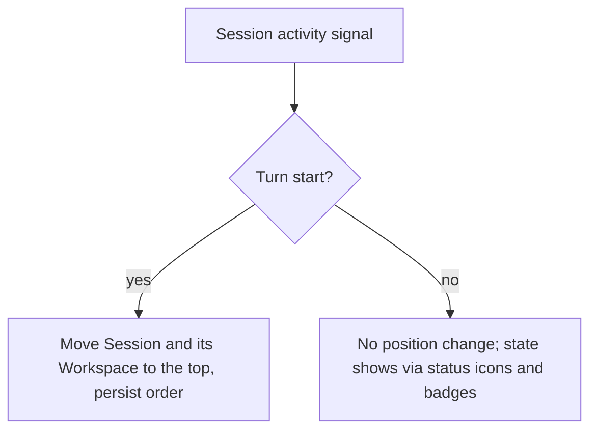
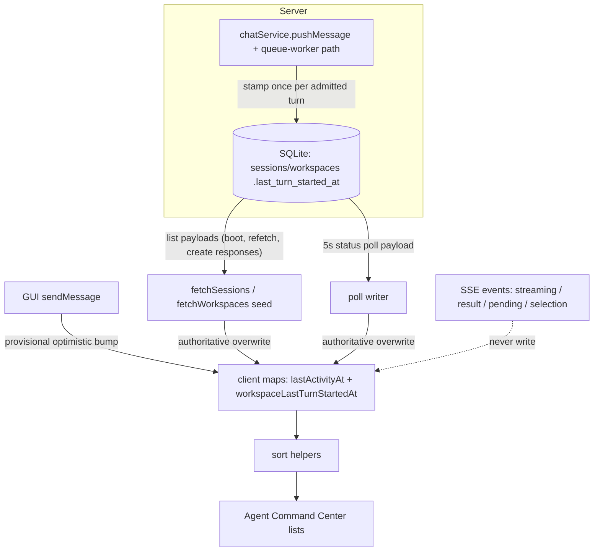

# Activity Sort Position Stability - Plan

## Goal Capsule

- **Objective:** Give the Agent Command Center's Workspace and Session lists stable, predictable positions: items move only when a turn starts, while recently working items still rise to the front.
- **Product authority:** The Product Contract below defines the user-visible ordering behavior for both sidebar lists; the Planning Contract owns where the order is stored and how the activity bumps are rewired.
- **Open blockers:** None.
- **Execution profile:** Server schema migration plus turn-start stamping, payload carriers, and a client rewrite of ordering writers; server storage tests, client store tests, and component regression coverage.
- **Stop conditions:** Stop if implementation requires changing Session Activity semantics themselves, or if persisting the order requires new server schema beyond the per-item sort key defined here.
- **Tail ownership:** The executor owns focused tests, client and server type checking, linting, and removal of abandoned implementation paths before handoff.

---

## Product Contract

Product Contract preservation: restructured, no scope change — the requirements-only Outstanding Questions section is removed because its single entry (OQ1, where the MRU order persists) was deferred to planning and is answered by KTD1.

### Summary

Reorder the Agent Command Center's Workspace and Session lists only when a Session starts a new turn (event-driven MRU), persist that order across restarts, and let every other activity change show through the existing status icons and badges instead of position changes. The ordering key is persisted server-side as a per-item turn-start timestamp and reaches the client through list payloads and the status poll; the client applies server-carried values authoritatively.

### Problem Frame

Both sidebar lists currently re-sort on every bump of a client-side activity timestamp. The bump fires on streaming SSE events, on turn completion, on pending interactions, on session create/fork/send, on opening a session, and on a background poll's pending-count transition. Each bump rebuilds the timestamp map and re-renders both lists with no debounce. Two bot sessions streaming alternately swap positions repeatedly; a finished session jumps; clicking a session moves it. Users cannot build a stable expectation of where an item sits from one second to the next.

### Key Decisions

- **Event-driven MRU ordering.** (session-settled: user-approved — chosen over a fixed-size active window and a state-sectioned list: no magic-number window size, and it fixes the root cause, which is bump timing rather than the sort rule.) Governs R1, R2.
- **Turn start is the only activation event.** (session-settled: user-directed — chosen over also promoting on pending interactions, session opening, and turn completion: position stability takes priority, and attention is signaled by badges rather than position.) Governs R1, R3, R4.
- **Persist the MRU order across restarts.** (session-settled: user-directed — chosen over recomputing order from persisted modification timestamps at launch: the order the user learned stays the order they see.) Governs R5.
- **New items insert at the top once.** (session-settled: user-approved — chosen over computing an insertion position: inserting a previously nonexistent item breaks no established position, and matches where creation time would place it anyway.) Governs R6.

### Requirements

**Ordering rule**

- R1. Both the per-Workspace Session list and the Workspace list keep a stable order that changes only when an activation event fires; between events no item changes position for any reason, including streaming, polling, completion, and pending-interaction updates.
- R2. The only activation event is the start of a new turn in a Session — the user sending a message, or a remote entry (bot, scheduled task) beginning a run. It moves that Session to the top of its Workspace's Session list and moves that Workspace to the top of the Workspace list; every other item keeps its relative position.

**Non-reordering signals**

- R3. Opening or selecting a Session or Workspace does not change any item's position.
- R4. States that no longer move items — running, pending approval or question, unread completion — remain visible through the existing sidebar status icons and badges.

**Persistence and new items**

- R5. The order of both lists persists across application restarts, initializing from existing activity recency on first launch after upgrade; after every later restart both lists render in the last persisted order.
- R6. A newly created Session or Workspace, including one created while the app was closed, inserts at the top of its list once; the insertion shifts other items down without changing their relative order.
- R7. Search and filtering inside the Agent Command Center do not redefine or mutate the underlying order.

### Acceptance Examples

- AE1. **Covers R1.**
  - **Given:** two background bot Sessions in different Workspaces are streaming output alternately.
  - **When:** streaming deltas, poll ticks, and turn-completion events arrive.
  - **Then:** no item in either list changes position.
- AE2. **Covers R2.**
  - **Given:** Session S sits mid-list inside Workspace W, which sits mid-list.
  - **When:** the user sends a message in S.
  - **Then:** S moves to the top of W's Session list, W moves to the top of the Workspace list, and all other relative positions are unchanged.
- AE3. **Covers R1, R4.**
  - **Given:** Session X finishes its turn and later raises a pending approval while the user views another Session.
  - **When:** the completion and then the pending interaction arrive.
  - **Then:** X does not move on either event; both surface through X's unread and pending badges.
- AE4. **Covers R3.**
  - **Given:** the user clicks a Session sitting mid-list.
  - **When:** the Session opens.
  - **Then:** no list positions change.
- AE5. **Covers R5.**
  - **Given:** the lists have drifted to some MRU order during use.
  - **When:** the app quits and relaunches.
  - **Then:** both lists render in the same order as before quitting.
- AE6. **Covers R6.**
  - **Given:** a scheduled task fires while the app is closed and creates a new run Session in Workspace W.
  - **When:** the app next launches.
  - **Then:** the new Session appears at the top of W's Session list, and W's other Sessions keep their relative order.

Key Flows omitted: the behavior is single-step (event, then reorder) and R1–R7 with the Acceptance Examples specify it without flow paths.

### Scope Boundaries

- Fixed-size active window and state-sectioned list designs — rejected alternatives, not deferred work.
- No user-facing ordering preference or toggle, no manual drag ordering, and no pin revival; the orphaned pin hook stays untouched.
- No changes to the status badges' appearance or to Session Activity semantics themselves; this contract changes only when positions update.
- The chat message list and all surfaces outside the Agent Command Center sidebar are untouched.

#### Deferred to Follow-Up Work

- Extend the focus-triggered sessions refetch to collapsed workspaces. Today it covers only expanded workspaces, so a session created externally in a collapsed workspace surfaces on the next app start or manual reload. Pre-existing behavior; this plan does not change it.

### Sources / Research

- Prior ordering contracts this plan revises: `docs/plans/2026-08-17-1130-feat-workspace-activity-sort-plan.md` (full-recency Workspace ordering) and `docs/plans/2026-06-13-004-feat-session-list-activity-sort-plan.md` (Session activity sort). This plan keeps their recency direction but narrows the reorder trigger to turn-start granularity.
- Current implementation, verified against source: `src/client/lib/session-sort.ts` (Session comparator keyed on `lastActivityAt` with `lastModified`/`updatedAt` fallback), `src/client/lib/workspace-sort.ts` (Workspace key = max of its Sessions' timestamps), `src/client/stores/chat-store.ts` (`applyActivityUpdate` at :3124; bump sites at SSE handlers :1884/:2415/:2441/:2636, create/fork/add :3313/:3359/:3385, `setActiveSession` :3619, send :3921; 5s poll :259-336 bumps only on a pending-count 0→>0 transition at :306-308), `src/client/components/AgentCommandCenter.tsx` (memoized Workspace sort :157-160, inline Session sort :522-526, existing badges :588-592 and :717-748), `src/client/hooks/use-workspace-pins.ts` (orphaned).
- Noted drift: the prior Workspace-sort plan states selection must not affect ordering, but `setActiveSession` currently bumps the key; R3 restores that intent.

---

## Planning Contract

### Key Technical Decisions

- KTD1. **Persist the ordering key server-side as a per-item turn-start timestamp.** Add `last_turn_started_at` (INTEGER, epoch ms) to the `sessions` and `workspaces` tables in `src/server/storage/sqlite-store.ts`; the client never persists ordering state itself. Chosen over a client localStorage MRU map: turn starts originate server-side (bot and scheduled sessions have no client send path), the sidecar is the single writer so the documented cross-window localStorage clobber hazard (`docs/solutions/conventions/merge-shared-localstorage-writes-across-electron-windows.md`) does not apply, and server-stamped values are SSE-replay-safe by construction. Implements R5, serves R2, R6; resolves the deferred persistence question from the requirements phase.
- KTD2. **Rewire the client ordering writers; keep the map-and-helper shape.** The `lastActivityAt` map and `compareSessionActivity` stay; all SSE-event, selection, creation, and poll-pending bumps are removed; writers become the `fetchSessions` seed, the status-poll payload, and the optimistic send bump. The Workspace list gets its own client key map fed by the new workspace column instead of deriving from Session keys — derivation cannot place a zero-Session Workspace at the top (R6) and would move a Workspace when its newest Session is deleted. Implements R1, R3, R5, R6.
- KTD3. **Server-carried values are authoritative for both maps; the optimistic bump is provisional.** Fetch and poll values always overwrite `lastActivityAt` and `workspaceLastTurnStartedAt` alike — one merge rule governs both lists, so a failed send's workspace bump corrects downward exactly as its session bump does. The optimistic send bump (`Date.now()`) may be overwritten by an in-flight pre-send poll response and self-corrects within one poll tick. A failed admission leaves a stale optimistic bump that the next server value corrects downward. Implements R1, R2.
- KTD4. **Creation and discovery initialize the key differently.** True creation (`createLocalSession`, `createWorkspace`) initializes to now, which places new items at the top per R6. Transcript discovery (`syncSdkSession` insert branch) initializes from `COALESCE(last_modified, created_at)` so pre-existing transcripts do not rocket to the top on first scan; the conflict-upsert branch leaves the key untouched. Implements R5, R6.
- KTD5. **Unarchive-on-activity fires when any writer observes a genuine server-carried advance.** The current `applyActivityUpdate` unarchives archived Sessions as a side effect of every bump; under the new writers the gate becomes: an archived Session unarchives when an incoming server key exceeds the key last seen for it (compared before the overwrite), regardless of which writer — fetch, poll, or send — observes the advance; only the first-boot seed is exempt, because no prior key exists to compare against. Gating only the poll writer would let a focus refetch landing between the stamp and the next poll absorb the advance and leave the Session archived until a later turn. Side effect: bot-turn unarchive latency moves from first-SSE-event to one poll tick (≤5s). Implements R1.

### High-Level Technical Design

The ordering key has exactly one writer (the server, at turn admission) and three delivery paths to the client. Everything that used to move items directly is cut off from the maps.

Stamping covers every turn-start caller: GUI send, WeCom bot, Feishu bot, and scheduled runs all funnel through `chatService.pushMessage`; the WeCom proactive queue worker calls `runtime.pushMessage` directly and is routed through a stamped path (U2).

### Sequencing

U1 (schema) → U2 (stamping) → U3 (payloads) → U4 (client rewiring) is the dependency order; U5 (test-runner wiring) is independent and can land anywhere.

### Risks & Dependencies

- **Migration risk on user data.** The ALTER runs against existing installs' databases; the backfill is the risk surface. It is an always-run, NULL-guarded, transaction-wrapped pass at the end of the constructor migration chain (U1), so interrupted first starts, legacy-JSON inserts, and downgrade-created NULL rows all converge on a later launch. Follow the isolated-test-database convention (`docs/solutions/conventions/use-isolated-test-database-for-comate.md`): never point a migration test at a production data path.
- **Downgrade story.** The column is additive and inert to old binaries: row parsers pick named fields from `SELECT *`, and all writes use explicit column lists. Rows created while a downgraded binary runs carry NULL keys and sort by client fallbacks until re-upgrade, when the backfill heals them. No rollback tooling ships with this migration.
- **SSE replay.** Never derive ordering writes from client-observed SSE traffic — the channel replays buffered events on reconnect and session switch (`docs/solutions/integration-issues/sse-stream-resume-on-reconnect-2026-05-18.md`). This design writes only from server-carried values and direct user sends, so replays are idempotent by construction.
- **Multi-window.** A non-issue here by construction: the ordering maps stay in memory, and the detached browser window does not boot the chat store. Recorded so reviewers do not re-raise the localStorage learning against this plan.
- **Background-turn latency.** Bot/scheduled turn starts reach the sidebar through the status poll, so their position updates lag by up to one poll interval (~5s); the user's own sends are immediate via the optimistic bump. Accepted at scoping.
- **Collapsed-workspace discovery.** A session created externally in a collapsed workspace surfaces only on refetch (see Deferred to Follow-Up Work); its creation-initialized key then places it at the top per R6.

---

## Implementation Units

### U1. Ordering-key schema, migration, and backfill

- **Goal:** Persist a per-item turn-start key on sessions and workspaces with safe migration for existing installs.
- **Requirements:** R5, R6. KTD1, KTD4.
- **Dependencies:** None.
- **Files:** `src/server/storage/sqlite-store.ts`, `src/server/models/session.ts`, `src/server/models/workspace.ts`, `src/server/storage/sqlite-store.test.ts` (or `migration.test.ts`).
- **Approach:**
  1. Add `last_turn_started_at INTEGER` (epoch ms, nullable, no default) to `sessions` and `workspaces` via the PRAGMA `table_info` + conditional `ALTER TABLE` precedent (sessions guards at :393-418, workspaces guard at :101-104).
  2. Backfill as an unconditional, NULL-guarded (`WHERE last_turn_started_at IS NULL`) pass at the end of the constructor migration chain — after the legacy-JSON migrations at :642-643 — following the `backfillWeComSessionSource` precedent (:1198-1214), with both UPDATEs wrapped in one `db.transaction`. Every successful construction then converges to zero NULL keys, covering interrupted first runs, the legacy inserts, and any future insert path that forgets the column.
  3. Backfill expressions in epoch ms, matching the `last_modified` scale: sessions use `COALESCE(last_modified, unixepoch(updated_at) * 1000, unixepoch(created_at) * 1000, 0)` — `unixepoch` returns seconds so the `* 1000` is load-bearing, and the terminal `0` guarantees convergence on NULL, empty, or malformed legacy timestamps. The COALESCE priority mirrors the pre-upgrade client comparator (`lastModified ?? Date.parse(updatedAt)`). Workspaces compute from the raw session columns with the same expression (max per workspace), falling back to their own `createdAt` — never read the sessions' backfilled output, so each pass is independently correct and re-runnable in any order.
  4. Initialize at true creation (`createLocalSession`, `createWorkspace`) to now; initialize `syncSdkSession`'s insert branch from `COALESCE(last_modified, created_at)` and leave the conflict-upsert branch untouched (KTD4). The two legacy-JSON migration inserts (workspaces :1228, draft sessions :1281) are deliberately not edited — step 2's placement covers them.
  5. Extend both row parsers so list payloads carry the field; `stripWorkspaceForResponse` needs no change (it strips only `browserSiteAuth`).
  6. Accepted divergence: `unixepoch()` floors to whole seconds while the old comparator kept millisecond precision, so two rows with NULL `last_modified` whose `updated_at` differ by less than a second may swap relative order once at migration.
- **Test scenarios:**
  - Migration on a populated pre-upgrade fixture: zero NULL keys in both tables, and all keys in epoch-ms scale (a magnitude assertion catches a seconds/milliseconds mix-up).
  - Order equivalence: sorting sessions by the backfilled key reproduces the pre-upgrade comparator order (`lastModified ?? Date.parse(updatedAt)`, ties by `createdAt` then `id`), with the sub-second flooring exception excluded or asserted.
  - Workspace backfill equals the max of its sessions' intended keys computed from raw columns; a zero-session workspace backfills from `createdAt`.
  - Rows with `last_modified` get exactly that value; rows with empty or malformed text timestamps get the terminal fallback, never NULL.
  - Interrupted start: a fixture DB with the column present but all-NULL heals to zero NULLs on reopen; double construction changes no keys.
  - A partially backfilled sessions table still yields the intended workspace maxima (raw-column computation).
  - Legacy `workspaces.json` and draft-sessions fixtures against an empty DB end construction with zero NULL keys.
  - Downgrade round-trip: reading migrated rows through a parser lacking the new field, then rewriting a row, errors nowhere and loses nothing.
  - `createLocalSession` and `createWorkspace` initialize the key to ~now; `syncSdkSession` discovery initializes from `last_modified`, and a repeat sync leaves the key untouched.
  - All tests use the isolated-test-database convention (`test-utils/test-env`, `createIsolatedStore`).
- **Verification:** `npm run test:server` covers the migration acceptance set above; the order-equivalence and interrupted-start cases are the load-bearing ones.

### U2. Turn-start stamping at the run chokepoint

- **Goal:** Every admitted turn stamps its session and workspace keys exactly once, on every entry path.
- **Requirements:** R2. KTD1.
- **Dependencies:** U1.
- **Files:** `src/server/services/chat-service.ts` (`pushMessage`, :2003-2065), `src/server/services/wecom-queue-worker.ts` (:173 direct `runtime.pushMessage`), stamp helper on `chatService` or the store; tests near the existing `websocket/server.test.ts` pushMessage stubs or chat-service tests.
- **Approach:**
  1. Stamp both rows after `runtime.pushMessage` admission succeeds (~:2039); a failed admission (e.g. busy-error rejection) must not stamp. The stamp write is post-admission housekeeping: wrap it in try/catch and `diagLog` on failure, per the draft-promotion precedent at :2050-2063 — a stamp failure must never fail an admitted turn (a rejecting promise would let a client retry re-admit the message), and a missed stamp only leaves the key one turn stale until the next turn start.
  2. Route the WeCom queue worker's direct `runtime.pushMessage` through a stamped path (call the same stamp helper after its admission).
  3. Confirm by reading call sites that Feishu bot (`feishu-bot-service.ts:1114`) and scheduled runs (`todo-execution-service.ts:17-23`) funnel through `chatService.pushMessage`; no separate work if they do.
- **Test scenarios:**
  - GUI send stamps the session row and its workspace row.
  - WeCom bot turn stamps; scheduled run stamps; queue-worker proactive dispatch stamps.
  - Failed admission leaves both keys unchanged; a stamp write failure after admission does not fail the send and leaves both keys unchanged.
  - Two turns in sequence produce monotonically non-decreasing keys.
- **Verification:** server tests green under `npm run test:server`.

### U3. Ordering key on the wire

- **Goal:** The key reaches clients through session/workspace payloads and the status poll.
- **Requirements:** R2, R5, R6. KTD1, KTD3.
- **Dependencies:** U1, U2.
- **Files:** `src/server/services/chat-service.ts` (`getSessionsStatus`, :2067-2097), `src/server/routes/chat.ts` (sessions list :21-42, session create response), `src/server/routes/workspaces.ts` (list :32-40), client type mirrors in `src/client/stores/chat-store.ts` and `src/client/stores/workspace-store.ts`.
- **Approach:**
  1. Sessions and workspaces list payloads carry the column automatically once U1's parsers map it; verify both routes serialize it.
  2. The session-create response carries the initialized key so the creating client seeds immediately.
  3. Extend the status-poll payload with per-session `lastTurnStartedAt` plus the workspace-level key, so background turn starts propagate within one poll tick.
- **Test scenarios:**
  - Sessions list and workspace list responses include the key.
  - Session-create response includes the initialized key.
  - Poll payload reports the stamped key after a turn starts.
- **Verification:** server route/service tests; `npm run typecheck` for the client type mirrors.

### U4. Client rewiring to server-sourced ordering

- **Goal:** Sidebar ordering reads only server-sourced keys; streaming, completion, pending interactions, selection, and polling never move items.
- **Requirements:** R1, R2, R3, R4, R5, R6, R7. KTD2, KTD3, KTD5. Product Key Decisions governing those R-IDs are session-settled (see Product Contract).
- **Dependencies:** U1, U3.
- **Files:** `src/client/stores/chat-store.ts`, `src/client/stores/workspace-store.ts`, `src/client/lib/workspace-sort.ts`, `src/client/lib/session-sort.ts` (fallback chain only if needed), `src/client/components/AgentCommandCenter.tsx` (no logic change expected; fixture-visible field), tests: `src/client/stores/chat-store.test.ts`, `src/client/components/AgentCommandCenter.test.tsx`, `src/client/lib/session-sort.test.ts`, `src/client/lib/workspace-sort.test.ts`.
- **Approach:**
  1. `fetchSessions` seeds `lastActivityAt` from rows' `lastTurnStartedAt`, and its pruning is scoped to the fetched workspace's session ids — today it deletes every key not in the just-fetched list, which would mis-order the other workspaces once the seed diverges from the comparator fallback.
  2. The poll writer applies per-session keys and the workspace key; server-carried values always overwrite (KTD3).
  3. The only remaining client-initiated bump is the optimistic one on user send; remove the SSE handler bumps (:1884/:2415/:2441/:2636), the `setActiveSession` bump (:3619), the create/fork/add bumps (:3313/:3359/:3385 — create paths seed from the server response instead), and the poll pendingCount bump (:306-308).
  4. Relocate `applyActivityUpdate`'s unarchive side effect behind the KTD5 gate: compare each incoming server-carried key against the stored value before overwriting it, and unarchive the Session only on a genuine advance; the first-boot seed (no stored key) never unarchives.
  5. Add a `workspaceLastTurnStartedAt` map: seeded from workspace rows at `fetchWorkspaces`, overwritten by the poll writer and provisionally advanced by the send bump — the same server-authoritative overwrite rule as the session map (KTD3). Change `sortWorkspacesByActivity` to read it, falling back to the session-derived max then `createdAt`. The map's store home is an implementation-time choice; the constraint is that all three writers (fetch seed, poll, send) update it without introducing a circular store import.
  6. Update the `AgentCommandCenter` test fixture's store shape and the ordering assertion at :226.
- **Test scenarios:**
  - Covers AE1. With `lastActivityAt` seeded from server keys, simulated streaming/result/pending SSE events and poll ticks without key changes leave both list orders untouched.
  - Covers AE2. A user send moves the session and its workspace to the top; other relative positions unchanged.
  - Covers AE3. Completion and pending-approval events change badges but not positions.
  - Covers AE4. `setActiveSession` no longer changes ordering.
  - Covers AE5. After simulated restart (fresh store, `fetchSessions` from server rows carrying keys), the order matches the pre-restart order.
  - Covers AE6. A fetch returning a previously unseen session with a creation-initialized key places it at the top; existing relative order preserved.
  - Fetching workspace B does not prune workspace A's keys (scoped pruning).
  - An in-flight poll response carrying a pre-send key does not demote a just-sent session on the following tick (server value converges).
  - A failed send's optimistic bumps are corrected downward by the next server-carried value on both the session and workspace maps.
  - A refetch with no key advance does not unarchive an archived session; a refetch or poll tick observing a key advance does (KTD5), including the refetch-lands-before-poll ordering.
  - Workspace with zero sessions sorts by its seeded key (new workspace at top).
- **Verification:** `npm run test:client` plus the sort-helper tests (via U5's runner wiring) are green; `npm run lint`.

### U5. Wire the orphaned lib tests into the runner

- **Goal:** The `node:test` files under `src/client/lib` actually execute in the standard test suite, so the sort helpers' coverage stops being green-by-omission.
- **Requirements:** Supports all (verification hygiene for the helpers this plan relies on).
- **Dependencies:** None.
- **Files:** `scripts/test-server.ts` (test-file crawl) or `package.json` scripts; `CLAUDE.md` already documents the intent that `test:server` runs these.
- **Approach:** Extend the crawl to `src/client/lib` with a content filter that keeps only files importing `node:test` — the directory holds 25 test files of which 16 import from `vitest` and must stay with the jsdom project (the sets are currently separated only by explicit filename lists in `vitest.jsdom.config.ts`). Future files then self-classify by their imports.
- **Test scenarios:**
  - The runner discovers and executes exactly the nine node:test-style files under `src/client/lib` (keyboard, session-filter, session-sort, sound-player, summarize-tool-input, updater-api, updater-config, use-badge-sync, workspace-sort) and none of the vitest-style files.
  - The nine previously orphaned tests run green unmodified.
- **Verification:** `npm test` output includes the lib files.

---

## Verification Contract

- `npm run test:server` — schema migration, backfill, stamping, and payload tests (U1-U3); also executes the newly wired `src/client/lib` tests after U5.
- `npm run test:client` — chat-store rewiring and AgentCommandCenter regression tests (U4).
- `npm run typecheck` and `npm run lint` — clean.
- `npm run check` — full suite green before handoff.
- Manual smoke before ship: run the app, stream two background sessions alternately and observe zero list movement (AE1); send a message and observe the session and workspace rise (AE2); quit and relaunch and observe identical order (AE5).

## Definition of Done

- All six Acceptance Examples hold, each backed by at least one automated test except AE5's full-restart path, which is covered by the simulated-restart store test plus the manual smoke.
- No position change occurs on streaming, polling, completion, pending interaction, or selection; badges alone carry those states.
- Order persists across restart, initialized from pre-upgrade recency on first launch.
- Migration runs safely on an existing database; no test touches a production data path.
- Every turn-start path (GUI, WeCom, Feishu, scheduled, WeCom proactive queue) stamps the key.
- Abandoned implementation paths (e.g. a client-side persistence draft, an unused bump helper) are removed before handoff.
- `npm run check` is green.
