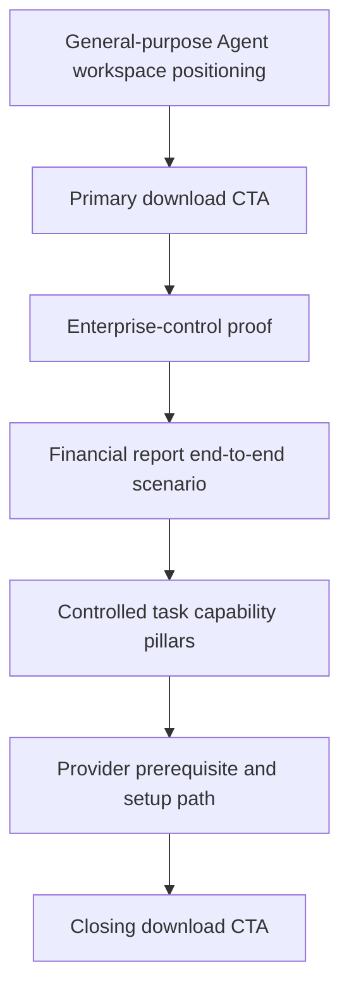
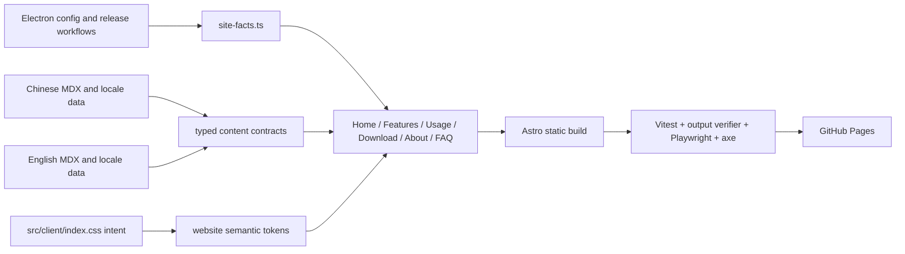
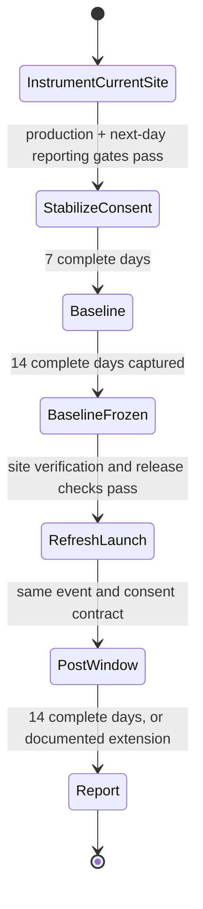

# Comate Website Refresh - Plan

## Goal Capsule

- **Objective:** Refresh the full Comate marketing site so it positions Comate as a general-purpose Agent task workspace for individual professionals inside organizations and increases download CTA clicks.
- **Product authority:** Confirmed positioning and scope decisions in this Product Contract govern the refresh; current product behavior and platform support must be verified against the repository rather than inherited from the July 2026 website plan.
- **Execution profile:** Deep, website-only delivery in the existing Astro application. Ship analytics on the unchanged site first, allow a seven-complete-day consent stabilization period, freeze a 14-day baseline, then deploy the refreshed experience and compare the same primary event for 14 days.
- **Open blockers:** A GA4 property, Editor access, public Measurement ID, and bilingual privacy/legal approval are required before the instrumentation deployment. These do not block implementation, but baseline day 1 cannot start until reporting and filtering are verified, and the visual refresh cannot launch until the baseline is frozen.
- **Stop condition:** The code tail ends when the refreshed bilingual site is deployed, all verification gates pass, and the primary conversion is observable under consent. The product-measurement tail ends after the 14-day post-launch comparison (or a documented extension for insufficient traffic).

---

## Product Contract

### Summary

Refresh the existing bilingual six-page Comate website without changing its top-level information architecture.
The site will present Comate as a user-controlled, general-purpose Agent task workspace that fits enterprise environments, proves the promise through real work, and leads qualified visitors toward download.

### Problem Frame

The current website reflects an earlier product era.
Its hero centers coding, Claude Code, and Tauri; its purple-and-cyan visual system no longer matches the desktop application's neutral surfaces and orange accent; and its feature presentation does not explain how Comate completes a real task.

Comate has since moved to Electron, added Linux support, gained multiple Agent backends, embedded browser capabilities, scheduled tasks, and enterprise Skill discovery.
The existing site therefore understates the product while narrowing it to developers.

The current download path also hides a material prerequisite.
Visitors may create a Workspace and draft Session without configuring a Provider, but they cannot run an Agent or complete a task until they supply model credentials or configure a Provider.
Comate does not include a free inference Provider, so the website must set this expectation before download without weakening the primary CTA.

### Actors

- A1. **Individual professional:** Uses Comate for general work such as research, analysis, reporting, operations, project management, or development.
- A2. **Organization:** Supplies the internal models, IM channels, Skill Market, permissions, and security boundaries within which A1 works.
- A3. **Prospective visitor:** Evaluates whether Comate fits their environment, understands the Provider prerequisite, and decides whether to download.

### Key Decisions

- **General-purpose work over programming identity.** (session-settled: user-directed — chosen over developer-first positioning: programming is one scenario, not the product category.) Governs R1, R2, R7.
- **Personal use with enterprise control.** (session-settled: user-directed — chosen over enterprise-platform-first positioning: the individual experience leads while enterprise compatibility establishes credibility.) Governs R2, R3, R8.
- **Control is a complete promise.** (session-settled: user-directed — chosen over reducing control to one feature: local workspace management, Provider choice, transparent permissions, open extensibility, and enterprise fit all matter.) Governs R3, R8, R9.
- **Enterprise-environment fit is the strongest proof.** (session-settled: user-directed — chosen over local-only, Provider-only, permissions-only, or extensibility-only proof: internal models, IM, and Skill Market demonstrate that Comate can operate inside real organizational boundaries.) Governs R3, R6, R8.
- **Download remains the primary conversion.** (session-settled: user-directed — chosen over case-study, setup-guide, sales-contact, or GitHub-first conversion: the refreshed site is accountable to download CTA clicks.) Governs R4, R8, R11.
- **Disclose the bring-your-own-Provider prerequisite.** (session-settled: user-directed — chosen over hiding the prerequisite or expanding this work into a free-model product change: qualified downloads are more valuable than a misleading first-run promise.) Governs R5, R10, R11.
- **Use the restrained visual direction.** (session-settled: user-directed — chosen over editorial storytelling and a heavy Agent-console aesthetic: neutral black, white, and gray surfaces with orange accents feel controlled and credible.) Governs R13, R14, R15.
- **Optimize the existing information architecture.** (session-settled: user-directed — chosen over replacing the six-page structure: the current routes are sufficient when each page receives a clearer job.) Governs R7-R12.

### Requirements

**Positioning and conversion**

- R1. The site must define Comate as a general-purpose Agent task workspace and must not frame programming as its product category.
- R2. The primary audience must be individual professionals working inside organizations, with personal task completion leading the narrative and enterprise capabilities supporting it.
- R3. The control promise must cover workspace ownership, Agent backend and model choice, transparent permissions, Skills and MCP extensibility, and compatibility with enterprise models, IM, and Skill Markets.
- R4. Download must remain the primary call to action across the site, and download CTA clicks must be measurable against a pre-refresh baseline.
- R5. The site must state before download that users need their own model credentials or configured Provider to run an Agent and complete a task, without implying that Comate includes free inference.
- R6. The site must use one end-to-end scenario in which a user requests financial data collection through IM, Comate uses internal models and Skills to collect and analyze the data, and the finished report is published back into the work context.

**Information architecture and page responsibilities**

- R7. The site must retain the localized Home, Features, Usage, Download, About, and FAQ pages in Chinese and English.
- R8. Home must establish the positioning and download path first, then prove enterprise fit, show the financial-report scenario, explain the core capability pillars, and repeat the download CTA.
- R9. Features must explain how capabilities contribute to controlled task execution rather than present an undifferentiated list of technical features.
- R10. Usage must introduce prerequisites before the current Workspace and Session flow, then guide the visitor through Provider setup and a first successful task.
- R11. Download must present current macOS, Windows, and Linux availability, disclose the Provider prerequisite, and link visitors to the official release artifacts and setup guidance.
- R12. About and FAQ must carry the new product identity and answer trust questions about model choice, data boundaries, permissions, enterprise integration, platform support, and licensing without duplicating the usage guide.

The intended Home hierarchy is directional; planning may refine its exact section count while preserving R8.



**Visual direction and product truth**

- R13. The visual system must use restrained neutral surfaces with orange accents and must remove the generic purple-to-cyan AI-SaaS identity from primary brand surfaces.
- R14. The refreshed experience must preserve responsive behavior, accessible light and dark modes, visible focus states, and reduced-motion support.
- R15. Product imagery must represent the current Electron application and real task flows; temporary feature artwork and code-centric hero mockups must not remain as primary evidence.
- R16. Storytelling may borrow the approachable task narrative explored in visual direction B, and technical console treatments may appear as supporting details, but visual direction A must remain dominant.
- R17. All product claims must reflect the current Electron-based, macOS/Windows/Linux, multi-backend product and remove stale Tauri-only, Claude-only, Windows/macOS-only, and developer-only language.
- R18. Chinese and English versions must carry equivalent positioning, prerequisites, platform facts, scenarios, and CTA hierarchy.
- R19. “User-controlled” must not be expressed as “fully local” when a configured model service or enterprise system processes task data.

### Key Flows

- F1. Positioning to download
  - **Trigger:** A3 lands on Home without prior knowledge of Comate.
  - **Actors:** A3.
  - **Steps:** The visitor understands the general-purpose workspace promise, sees enterprise-control evidence, reviews the financial-report scenario, notices the Provider prerequisite, and selects the download CTA.
  - **Outcome:** The click represents informed download intent rather than curiosity based on an incomplete promise.
  - **Covers:** R1-R6, R8.
- F2. Download to first successful task
  - **Trigger:** A1 decides to install Comate.
  - **Actors:** A1, A2.
  - **Steps:** The user checks platform and Provider prerequisites, downloads Comate, configures model credentials, creates a Workspace and Session, then runs a first task.
  - **Outcome:** The Usage and Download pages set the correct sequence and do not imply that installation alone enables Agent execution.
  - **Covers:** R5, R10, R11.
- F3. Enterprise-bounded financial report
  - **Trigger:** A1 requests a financial report through an approved IM channel.
  - **Actors:** A1, A2.
  - **Steps:** Comate receives the request, uses the organization's internal model and Skill Market capabilities, gathers and analyzes finance data, then publishes the report to the expected work context.
  - **Outcome:** The story demonstrates task completion, enterprise fit, and user control in one coherent example.
  - **Covers:** R2, R3, R6.

### Acceptance Examples

- AE1. **Covers R1, R2, R17.** Given a visitor reads only the Home hero and first supporting section, when asked what Comate is, then the answer describes a general-purpose Agent task workspace rather than a Claude Code GUI or coding tool.
- AE2. **Covers R3, R6, R8.** Given a professional works inside an organization, when they review the Home scenario, then they can see how internal models, IM, Skills, permissions, and task execution fit together without turning the page into an enterprise buyer pitch.
- AE3. **Covers R4, R5, R11.** Given a visitor intends to download, when they reach a download CTA or the Download page, then the CTA remains prominent and the need for model credentials or a configured Provider is visible before installation.
- AE4. **Covers R5, R10.** Given a user has created a Workspace or draft Session but has no configured Provider, when they follow Usage, then the guide does not claim they can run an Agent until Provider setup is complete.
- AE5. **Covers R7, R18.** Given the same page is opened in Chinese and English, when the visitor compares its positioning and prerequisites, then neither locale omits or materially changes the product promise.
- AE6. **Covers R13-R16.** Given the refreshed Home is viewed in light or dark mode, when compared with the current desktop application, then the site feels like the same product family and does not rely on purple/cyan gradients or code-centric placeholder art as its primary identity.

### Success Criteria

- GA4 Session key event rate among measured sessions after analytics consent—sessions containing the explicit Download-to-official-Releases key event divided by measured sessions—increases over a frozen 14-day pre-refresh baseline when measured for 14 days after launch. Basic Consent Mode does not observe rejecting or no-choice visitors, so this metric must not be described as all-visitor conversion or consent rate. Because there is no trustworthy baseline yet, this plan does not invent an uplift percentage; report the observed change and apply the pre-registered low-volume rule below.
- All six pages in both languages express the same product category, audience, and Provider prerequisite without stale Tauri, platform, or Claude-only claims.
- A cold reader can identify the financial-report flow and the five dimensions of user control without reading every feature entry.

### Scope Boundaries

**In scope**

- Repositioning, copy, page-level content hierarchy, product imagery, and visual-system updates across the existing bilingual site.
- Current product-fact corrections and a coherent first-use explanation spanning Usage and Download.

**Deferred or excluded**

- New top-level pages, navigation restructuring, a documentation knowledge base, or an enterprise sales portal.
- A free model, trial credits, bundled inference, or changes to Provider onboarding inside the desktop product.
- User accounts, paid plans, lead-capture workflows, or sales-contact conversion.
- An interactive browser demo, blog, newsletter, site search, or custom-domain work already deferred by the original website plan.

### Dependencies / Assumptions

- Public release artifacts remain available through the official GitHub Releases flow for all supported platforms.
- Current Electron screenshots can be captured from a staged environment using synthetic, redacted financial data; no customer data, credentials, internal URLs, or proprietary enterprise content may enter website assets.
- Internal model, IM, and Skill Market claims can be shown at a level that is accurate without exposing proprietary enterprise details.
- The site owner can create or grant access to a GA4 property and expose its Measurement ID as a non-secret GitHub Actions variable.
- A designated privacy/legal owner can approve the bilingual purpose, storage, recipient, retention, jurisdiction, and revocation disclosure before production instrumentation. Mechanical tests do not establish legal sufficiency.
- Baseline and post-launch comparisons use the same GA4 property/timezone, event/key-event contract, consent-storage version, filters, route set, and measured-session denominator.

### Outstanding Questions

**Deferred to Implementation**

- Select the exact staged Electron frames after the finance scenario has been populated with synthetic data; the required states and redaction rules are fixed below.
- Refine final Chinese and English editorial wording within the settled positioning, page responsibilities, canonical terminology, and parity contract; copy review must not reopen the product category or information architecture.

### Sources / Research

- `docs/plans/2026-07-09-003-feat-comate-website-plan.md` — original website Product Contract and implementation plan.
- `website/src/content/home/zh-CN/hero.mdx` and `website/src/pages/zh/about.astro` — current coding-, Claude-, and Tauri-centered positioning.
- `website/src/styles/global.css` and `website/public/images/features/README.md` — current purple/cyan theme and temporary feature artwork.
- `README.md`, `CHANGELOG.md`, and `docs/acceptance/agent-backend-parity-checklist.md` — current platform, runtime, backend, browser, scheduled-task, and enterprise Skill capabilities.
- `src/client/index.css` — current desktop visual tokens.
- `src/server/services/chat-service.ts` and `src/server/services/provider-detection.ts` — Provider requirement and credential-detection behavior.
- `electron-builder.config.ts`, `.github/workflows/build.yml`, and `.github/workflows/deploy-website.yml` — current desktop artifact and website deployment authorities.
- [Google Analytics consent mode overview](https://support.google.com/analytics/answer/10000067?hl=en) — consent-state behavior for Google tags.
- [Google Analytics consent settings](https://support.google.com/analytics/answer/13566436?hl=en) — consent configuration and regional considerations.
- [Enhanced measurement events](https://support.google.com/analytics/answer/9216061?hl=en) — supporting context for outbound-click measurement; this plan still uses an explicit primary conversion event for a stable contract.
- [Consent mode concepts](https://developers.google.com/tag-platform/security/concepts/consent-mode) and [implementation guide](https://developers.google.com/tag-platform/security/guides/consent) — Basic versus Advanced behavior and consent-type ordering.
- [GA4 metrics definitions](https://support.google.com/analytics/table/13948007?hl=en) — Session key event rate definition used by KTD3.
- [GA4 custom events](https://developers.google.com/analytics/devguides/collection/ga4/events), [key events](https://support.google.com/analytics/answer/9267568?hl=en), and [custom dimensions](https://support.google.com/analytics/answer/14239696?hl=en) — property-side event contract and reporting prerequisites.

---

## Planning Contract

**Product Contract preservation note:** The Product Contract above is unchanged in meaning. This section resolves its planning questions and turns R1–R19, F1–F3, and AE1–AE6 into implementation units without reopening settled scope.

### Key Technical Decisions

1. **KTD1 — Direct GA4 with Basic Consent Mode v2.** Add the Google tag directly in `BaseLayout.astro` through a small website-owned analytics module and consent component; do not add Google Tag Manager, a third-party CMP, Plausible, or Umami. Reject/no-choice visitors must cause zero Google tag requests: the external tag loads only after an explicit or persisted grant, with consent defaults established before configuration/events and only `analytics_storage` updated to granted. Keep `ad_storage`, `ad_user_data`, and `ad_personalization` denied; disable Google Signals, ad personalization signals/destinations, and query/email collection; select minimal justified retention. The Measurement ID is public build-time configuration, not a secret. A custom banner is a mechanism, not legal approval. (session-settled: user-directed — GA4 + Consent Mode + an in-site banner and privacy disclosure were chosen explicitly.) Covers R4, R7, R12.
2. **KTD2 — One stable GA4 key-event contract.** Register one explicit custom event, `release_download_click`, for a Download-page outbound click to the official GitHub Releases destination and mark only it as the primary GA4 Key Event. Internal site CTAs to Download and Enhanced Measurement's automatic outbound `click` are diagnostic only; disable automatic outbound clicks if they cannot be cleanly excluded from KPI reporting. Create event-scoped custom dimensions for locale, CTA location, selected platform, and destination stage before baseline day 1. Never send free text, workspace/Provider names, finance content, email, arbitrary URLs, or identifiers. Event failure must never delay navigation. Covers R4, AE3.
3. **KTD3 — Stabilized two-stage rollout and reproducible metric.** First deploy analytics, consent, and privacy disclosure on the otherwise unchanged production site. After production mechanics and next-day reporting pass, allow seven complete days for consent choices to stabilize, then freeze 14 complete baseline days in the GA4 property's recorded timezone. The redesign may proceed in parallel but cannot deploy before the baseline freeze. Compare 14 complete post-launch days using GA4 Session key event rate among measured sessions, plus measured-session/key-event-session/event counts. Before baseline day 1, pre-register a low-volume rule: extend both windows symmetrically in seven-day increments up to 42 days when either window has fewer than 100 measured sessions or 20 key-event sessions; after the cap, report the result as inconclusive rather than repeatedly checking for a favorable stop point. Covers R4.
4. **KTD4 — Central product facts.** Introduce `website/src/lib/site-facts.ts` as the website-owned projection of verified platform, release, Provider-prerequisite, and canonical terminology facts. Root Electron build configuration and workflows remain the upstream evidence; the static site does not call the GitHub API at runtime. Pages and verification tests consume the projection so macOS, Windows, Linux, release, and Provider claims cannot drift independently. Covers R3, R5, R11, R17–R19.
5. **KTD5 — Strict bilingual parity.** Preserve `/zh/*` and `/en/*`, but fail tests/build when paired content slugs, critical product facts, scenario stages, Provider disclosure, or primary CTA hierarchy are missing in either locale. Production page copy must not silently fall back from English to Chinese. Shared chrome labels may use typed locale dictionaries with an explicit missing-key failure in tests. Covers R7, R18, AE5.
6. **KTD6 — Evolve the current Astro structure.** Keep Astro 7, Tailwind 4, the six routes, content collections, and shared components. Move repeated business facts and CTA labels into typed modules; keep long editorial copy in paired MDX/content sources. Do not replace the site framework or create a new navigation model. Covers R7–R12.
7. **KTD7 — App-aligned visual tokens.** Derive website semantic aliases from the neutral surface, border, text, and orange-accent intent in `src/client/index.css`; do not copy implementation-specific desktop selectors. Preserve light/dark initialization without flash, visible keyboard focus, reduced motion, responsive layouts, and readable contrast. Direction A controls hierarchy; B informs the approachable scenario narrative; C is limited to small status/progress details. Covers R13–R16, AE6.
8. **KTD8 — Current, sanitized product evidence.** Capture the current Electron application at deterministic viewport sizes with a synthetic finance-report dataset. Required states are: IM request/acknowledgement, task in progress with approved Skill/data access, permission/attention state, analysis/report output, and final IM notification. Export optimized WebP with PNG source when needed, document the synthetic fixture, provide bilingual alt text, and remove every placeholder SVG used as primary evidence. Covers R6, R15.
9. **KTD9 — Explicit platform choice.** Show macOS, Windows, and Linux actions together. User-agent detection may reorder or emphasize a likely platform but must never hide another platform or choose on the visitor's behalf; mobile/unknown agents see all choices equally. Link to the generic official Releases destination unless a stable repository-owned per-artifact URL contract is verified during implementation. Covers R11, AE3.
10. **KTD10 — Layered verification.** Keep Vitest for modules/content contracts, extend the built-output verifier for routes/links/semantic assertions, and add Playwright browser tests for consent, CTA attribution, locale/theme/mobile behavior, accessibility semantics, and release navigation. Add `@axe-core/playwright` for repeatable automated accessibility checks while retaining manual contrast, keyboard, reduced-motion, and screen-reader spot checks. Covers R4, R7, R14, R18.

### High-Level Technical Design

The refreshed pages remain static Astro output. Verified product facts, localized content, and semantic tokens fan out through shared page components; tests reject drift before deployment.



Consent gates measurement, not navigation or content. A rejected or unavailable analytics path leaves the site fully functional.

```mermaid
sequenceDiagram
  participant V as Visitor
  participant C as Consent UI
  participant S as Site analytics helper
  participant G as GA4
  participant R as GitHub Releases
  V->>C: First eligible visit
  C->>S: Default denied
  alt Accept (Basic Consent Mode)
    V->>C: Accept analytics
    C->>S: Persist granted state
    S->>S: Establish consent defaults, keep ad consent denied
    S->>G: Load/configure tag with analytics granted
    V->>S: Click official release CTA
    S-->>G: Send primary event (enumerated metadata)
  else Reject or ignore
    V->>C: Reject / no choice
    C->>S: Persist or retain denied state
    Note over S,G: Google tag is not loaded; no request/event is sent
  end
  V->>R: Navigate immediately
```

The measurement lifecycle deliberately separates instrumentation from the visual launch.



### System-Wide Impact

- **Website runtime:** Static Astro output gains a small client-side consent and analytics layer; no server, database, account, or desktop runtime changes.
- **Build/deploy:** GitHub Pages receives the public GA4 Measurement ID at build time and runs static, unit, and browser gates before deployment. The `/comate` base path and canonical/OG URLs must be verified to avoid double-prefixing.
- **External systems:** GA4 receives only consented, enumerated marketing events. GitHub Releases remains the download destination and is not proxied by the website.
- **Product/content:** The same platform and Provider facts feed multiple pages; bilingual content becomes a build contract rather than an editorial convention.
- **Operations:** A named release/measurement owner owns property setup, filter verification, baseline freeze, launch annotation, rollback, post-window comparison, and the aggregate measurement record. A privacy/legal owner separately approves disclosure and jurisdiction behavior.

### Risks and Dependencies

- **RISK1 — Consent reduces observable volume.** Compare only measured sessions after analytics consent under the same policy; report measured-session and key-event counts and apply KTD3's extension/inconclusive rule instead of treating unobserved traffic as zero intent.
- **RISK2 — GA4 or tag blockers hide events.** Navigation remains independent. Validate with GA4 DebugView/realtime, a clean browser profile, accepted/rejected states, and a blocked-script scenario before baseline starts.
- **RISK3 — Release facts drift.** Centralize facts, cite their root authorities in code comments/tests, and avoid brittle direct asset URLs until the release workflow guarantees them.
- **RISK4 — Marketing overclaims enterprise integration.** Use the repository's actual terms: Agent backend is distinct from Provider; enterprise Skill discovery is SkillHub/企业专区; name only verified IM integrations such as WeCom/Feishu, not “any IM.”
- **RISK5 — Screenshot leakage.** Use a dedicated synthetic fixture and a redaction checklist; inspect full-resolution exports and metadata before adding assets.
- **RISK6 — Locale drift.** Pair content by stable keys/slugs and fail CI on missing critical copy/facts rather than allowing silent fallback.
- **RISK7 — Refresh confounds the baseline.** The first production deployment changes only analytics/consent/privacy disclosure. Record its commit and date; freeze the baseline before the visual/content deployment.
- **RISK8 — Consent cohorts change the measured population.** Returning visitors may begin a post-launch session with stored consent while the instrumentation launch begins with no stored choices. Keep the seven-day stabilization period, record new/returning composition when available, and treat material cohort differences as a limitation rather than causal uplift.
- **RISK9 — Production test traffic pollutes a small sample.** Configure and verify internal/developer traffic filters before baseline day 1; record unavoidable smoke events and exclude them consistently from both windows.
- **RISK10 — Privacy or navigation regression requires immediate rollback.** Any pre-consent Google request, non-allowlisted payload, broken release navigation, or material route/accessibility regression is a no-go. Disable the Measurement ID/analytics path for privacy failure without disabling downloads. After baseline begins, refresh rollback returns to the validated U1 instrumentation deployment; record the affected interval and restart the comparison window if its event/consent contract was invalid.

### Phased Delivery

1. **Measurement foundation:** Implement U1, obtain privacy/legal approval, deploy it independently, pass same-day and next-day reporting gates, complete the seven-day stabilization period, and begin the 14-day baseline.
2. **Content and design foundation:** During the baseline, implement U2–U3 and lock the centralized facts, locale contract, tokens, and shared shell.
3. **Six-page refresh:** Implement U4–U6 against the fixed page responsibilities and conversion contract.
4. **Product evidence and hardening:** Complete U7 and U8's pre-launch verification, run the full matrix, freeze the 14-day baseline, then deploy the refresh.
5. **Outcome readout:** Complete U8 by observing the unchanged event contract for 14 days, comparing conversion rates and counts, documenting limitations, and applying KTD3's extension/inconclusive rule.

---

## Implementation Units

### U1 — Establish consented download measurement on the current site

**Purpose:** Create a trustworthy pre-refresh baseline without mixing the visual/content change into the measurement setup. Covers R4, R7, R12 and KTD1–KTD3.

**Files:**

- Modify `website/src/layouts/BaseLayout.astro`, `website/src/i18n/ui.ts`, `website/src/components/Footer.astro`, `Nav.astro`, `MobileNav.astro`, `HeroSection.astro`, `CTASection.astro`, `FeaturesContent.astro`, and `DownloadPanel.astro`; also modify `website/scripts/verify-site.js`, `website/package.json`, `website/package-lock.json`, `.github/workflows/deploy-website.yml`, and `website/README.md`.
- Add `website/src/lib/analytics.ts`, `website/src/lib/analytics.test.ts`, and `website/src/components/AnalyticsConsent.astro`.

**Implementation:**

- Define consent storage/versioning, Basic Consent Mode command order, GA4 initialization, diagnostic CTA events, and `release_download_click` through one helper. Keep event values enumerated and navigation non-blocking.
- Render a localized banner on first eligible visit with accept, reject, and a persistent footer route to revise the choice. Default to denied before any Google tag activity.
- Add a concise bilingual privacy disclosure to FAQ/footer context; do not add a top-level page.
- Pass `PUBLIC_GA_MEASUREMENT_ID` from a GitHub Actions variable. In local/test builds without it, analytics becomes a safe no-op and emits no network request. Configure the GA4 property timezone, Key Event, event-scoped custom dimensions, internal/developer filters, minimal retention, and analytics-only privacy controls; Enhanced Measurement outbound clicks must not enter KPI reporting.
- Instrument every existing internal Download CTA diagnostically and the Download-page official release action as primary. Deploy this unit before any positioning or visual change and record the production commit/time.
- Name the release/measurement owner and privacy/legal approver. Freeze an aggregate measurement specification containing the property/timezone, exact event/key-event, denominator, consent-storage version, filters, dimensions, production commit, exclusion policy, and low-volume rule; do not store visitor-level exports in git.

**Tests:**

- `website/src/lib/analytics.test.ts`: denied/unknown/revoked consent loads no Google resource and sends nothing; granted consent establishes defaults before config/events, grants only analytics storage, and initializes once; ad consent remains denied; payload allowlist rejects free text/unknown keys; storage version changes reset choice; event failure does not prevent callback/navigation.
- Extend `website/scripts/verify-site.js`: built pages include localized consent controls and privacy disclosure; all primary release links carry a stable CTA hook; no Measurement ID is hard-coded in source.
- Manual production gates: accept produces exactly one allowlisted event in Tag Assistant/DebugView/realtime; reject, revoke, and fresh no-choice sessions produce zero Google requests; link navigation succeeds with analytics blocked; the event, dimensions, measured-session denominator, and internal-traffic exclusion appear correctly in standard reporting the next day.

**Done when:** The unchanged production site has a verified analytics-only key event, privacy/legal approval, named owners, frozen measurement specification, and seven complete stabilization days; baseline day 1 is recorded and the design refresh remains undeployed.

### U2 — Centralize product facts and enforce bilingual content contracts

**Purpose:** Give all six pages one accurate source for platforms, release destination, Provider prerequisite, and canonical product vocabulary. Covers R3, R5, R7, R11, R17–R19 and KTD4–KTD6.

**Files:**

- Add `website/src/lib/site-facts.ts`, `website/src/lib/site-facts.test.ts`, and `website/src/content-parity.test.ts`.
- Modify `website/src/content.config.ts`, `website/src/i18n/ui.ts`, `website/src/i18n/utils.ts`, and paired files under `website/src/content/{home,features,usage,faq}/{zh-CN,en}/`.

**Implementation:**

- Model platform labels/order/requirements, generic official Releases URL, Provider prerequisite, control pillars, finance-scenario stage keys, and canonical terminology as typed values.
- Reorganize current feature entries by jobs/outcomes: organize work, connect approved intelligence, execute with visible control, extend through Skills/MCP, and complete recurring/cross-tool work. Remove or rewrite developer-category and stale runtime claims while preserving verified development as one example.
- Pair localized content by stable semantic key. Make missing English content or critical facts a test/build failure rather than a Chinese fallback.

**Tests:**

- `website/src/lib/site-facts.test.ts`: all three platforms exist once; release URL is HTTPS and official; Provider copy distinguishes Workspace/draft Session creation from Agent execution; forbidden claims such as “fully local,” Tauri, Claude-only, and macOS/Windows-only are absent from exported marketing facts.
- `website/src/content-parity.test.ts`: paired slugs/keys match; both locales include every control pillar, scenario stage, platform, Provider disclosure, and primary CTA slot; English production pages cannot resolve a Chinese content entry.
- Existing `website/src/i18n/utils.test.ts`: add explicit missing-key and locale-route cases.

**Done when:** A single fact change propagates consistently, every production content key has a peer locale, and the stale product-era vocabulary is rejected by tests.

### U3 — Align the visual system and repair shared navigation/accessibility

**Purpose:** Establish direction A and a trustworthy shared shell before page-specific composition. Covers R13, R14, R16 and KTD7, KTD10.

**Files:**

- Modify `website/src/styles/global.css`, `website/src/layouts/BaseLayout.astro`, `website/src/components/Nav.astro`, `MobileNav.astro`, `LanguagePicker.astro`, `ThemeToggle.astro`, and `Footer.astro`.
- Add `website/tests/shared-shell.spec.ts` and `website/tests/accessibility.spec.ts`; add `website/playwright.config.ts` and a `test:browser` script/dependencies in `website/package.json` and lockfile.

**Implementation:**

- Replace purple/cyan primary styling with semantic neutral/orange tokens aligned to the desktop application's intent; retain robust light/dark initialization, restrained shadows/radii, and reduced-motion behavior.
- Resolve duplicate `language-picker` IDs, localized accessible names, incorrect mobile theme-toggle labeling, mobile-menu naming/state, keyboard focus order, and touch-target sizing.
- Configure Playwright against the built preview under the `/comate` base path and integrate `@axe-core/playwright` without treating automated checks as complete accessibility proof.

**Tests:**

- `website/tests/shared-shell.spec.ts`: desktop/mobile navigation, locale switch preserving equivalent route, theme persistence, no flash-prone invalid theme state, one unique language-picker control, menu escape/focus behavior, and 404 navigation.
- `website/tests/accessibility.spec.ts`: automated axe scans of representative zh/en pages in light/dark and desktop/mobile modes; assertions for landmarks, heading order, labels, focus visibility hooks, and reduced-motion CSS.
- Manual: full keyboard traversal, 200% zoom, contrast review, VoiceOver spot check, and reduced-motion inspection.

**Done when:** Shared chrome passes the matrix, direction A is visually dominant, and page units no longer need bespoke accessibility fixes for global controls.

### U4 — Rebuild Home around positioning, proof, scenario, and download

**Purpose:** Make a cold visitor understand the general-purpose category, enterprise fit, control promise, and informed download path. Covers R1–R8, R13–R16, AE1–AE3, AE6 and KTD2, KTD6–KTD8.

**Files:**

- Modify paired `website/src/content/home/{zh-CN,en}/hero.mdx`, `website/src/components/HomeContent.astro`, `HeroSection.astro`, `DemoMockup.astro`, `StatsBand.astro`, `FeatureHighlightGrid.astro`, `BeforeAfterStrip.astro`, and `CTASection.astro`.
- Add focused components such as `website/src/components/ControlPillars.astro` and `website/src/components/FinanceWorkflow.astro` only when they remove duplication and map directly to R3/R6.
- Add `website/tests/home.spec.ts`.

**Implementation:**

- Implement the R8 hierarchy: category/personal outcome and Download first; enterprise-bound control proof; staged finance-report workflow; capability pillars; adjacent Provider prerequisite/setup link; closing Download CTA.
- Show F3 as a realistic asynchronous flow: IM request → immediate acknowledgement/task ID → approved internal Skill/data access → background collection/analysis → permission or attention state → approved internal report destination → final IM notification with status/link.
- Avoid fake quantitative stats. Replace `StatsBand` with verifiable product facts or remove it. Use small console/status styling only inside the workflow.
- Add stable CTA location identifiers and keep the Provider requirement visible adjacent to the hero/closing conversion path.

**Tests:**

- `website/tests/home.spec.ts`: zh/en hero identifies a general-purpose Agent task workspace; primary CTA precedes scenario; all scenario stages and five control dimensions render; Provider disclosure is visible near conversion; CTA diagnostic event has correct locale/location; responsive and theme snapshots are reviewed rather than blindly updated.
- `website/src/content-parity.test.ts`: Home hierarchy and semantic stage keys match between locales.

**Done when:** AE1–AE3 and AE6 pass in both locales and Home contains no code-centric primary imagery, fabricated metrics, or stale placeholder evidence.

### U5 — Reframe Features and Usage around controlled task completion

**Purpose:** Explain why capabilities matter and give a truthful path from install to first completed task. Covers R3, R5, R9, R10, R17–R19, F2, AE4 and KTD4–KTD7.

**Files:**

- Modify paired feature and usage MDX under `website/src/content/features/{zh-CN,en}/` and `website/src/content/usage/{zh-CN,en}/`.
- Modify `website/src/components/FeaturesContent.astro`, `FeatureCard.astro`, `FeatureHighlightGrid.astro`, and `UsageContent.astro`.
- Add `website/tests/features-usage.spec.ts`.

**Implementation:**

- Features groups verified capabilities under outcome/control pillars and distinguishes Agent backend, model Provider, Skills/MCP, permissions, embedded browser, scheduled tasks, IM, and SkillHub/企业专区 accurately.
- Usage orders prerequisites before execution: choose/download platform; supply model credentials/configure Provider and test connection; create Workspace; create/draft Session; run first task; handle tool permission; review result.
- Include recovery branches for no Provider, credential test failure, and permission-required/attention states. State explicitly that Workspace and draft Session may exist before Provider configuration, but Agent execution cannot complete.

**Tests:**

- `website/tests/features-usage.spec.ts`: feature groups render in the same semantic order in both locales; terminology distinctions are present; Usage prerequisite precedes run action; all three recovery branches are discoverable; CTA tracking remains diagnostic on links to Download.
- `website/src/content-parity.test.ts`: paired feature/usage entries and prerequisite facts match.

**Done when:** A reader can connect each capability to a controlled work outcome and follow F2 without encountering the false promise that installation alone enables execution.

### U6 — Complete Download, About, FAQ, and privacy/trust content

**Purpose:** Turn informed intent into a clear platform choice and close trust questions without adding a sales funnel or new page. Covers R4, R5, R7, R11, R12, R17–R19, AE3, AE5 and KTD1, KTD2, KTD4, KTD9.

**Files:**

- Modify `website/src/pages/{zh,en}/download.astro`, `about.astro`, and paired FAQ content under `website/src/content/faq/{zh-CN,en}/`.
- Modify `website/src/components/DownloadPanel.astro`, `FAQContent.astro`, `Footer.astro`, and `website/src/i18n/ui.ts`.
- Add `website/tests/download-trust.spec.ts`.

**Implementation:**

- Render explicit macOS, Windows, and Linux cards/actions with verified minimum guidance; detection only emphasizes/reorders. Link primary actions to official Releases and send the primary conversion contract before immediate navigation.
- Place the Provider prerequisite and setup route inside the Download decision panel, using exact behavior language from R5/AE4.
- Rewrite About around the general-purpose, user-controlled product identity. Expand FAQ to cover Provider/model choice, data boundaries, permissions, enterprise integrations, platforms, licensing, analytics consent, and changing/revoking analytics preference.
- Verify canonical and Open Graph URLs under the GitHub Pages `/comate` base path and remove stale Tauri/Claude/platform claims.

**Tests:**

- `website/tests/download-trust.spec.ts`: all platforms remain visible for macOS/Windows/Linux/mobile/unknown user agents; likely platform emphasis changes only ordering/style; each primary click opens the official HTTPS Releases destination and emits one allowed event after consent; denied consent emits none; Provider disclosure is adjacent; About/FAQ parity and privacy preference control are present.
- Extend `website/scripts/verify-site.js`: external release hostname allowlist, canonical/OG URL base correctness, no duplicate route links, and forbidden stale claim scan.

**Done when:** The primary conversion is clear, truthful, measurable under consent, and equally usable from any platform/locale without a new top-level page.

### U7 — Capture and integrate current Electron product imagery

**Purpose:** Replace placeholder and code-centric evidence with a safe, believable general-work scenario. Covers R6, R15, R16, AE2, AE6 and KTD8.

**Files:**

- Add optimized assets under `website/public/images/product/` plus a small `website/public/images/product/README.md` recording source viewport, synthetic fixture, crop, redaction review, and alt-text keys.
- Modify the relevant Home/Features/Usage MDX and components to reference the approved assets.
- Modify or remove primary uses of `website/public/images/features/*.svg` and its README; delete an asset only after confirming no route references it.
- Add `website/src/assets-contract.test.ts`.

**Implementation:**

- Populate a staged Electron app with fictional organization names, financial figures, messages, Skills, report destinations, and task identifiers. Capture the five KTD8 states at consistent desktop and detail crops.
- Inspect screenshots at full resolution and strip unnecessary metadata. Provide meaningful localized alt text for informative images and empty alt for decorative detail crops.
- Use responsive `picture`/dimension attributes and compressed assets to avoid layout shift and oversized downloads.

**Tests:**

- `website/src/assets-contract.test.ts`: referenced files exist, dimensions are declared, supported formats/sizes meet the agreed budget, alt-text keys exist in both locales, and no placeholder path remains on primary Home/Features evidence.
- Manual redaction checklist signed off by a second reviewer or product owner; mobile/retina visual inspection confirms legibility without exposing sensitive details.

**Done when:** Every primary product image depicts the current Electron product with synthetic data, passes redaction and performance checks, and placeholder/code-first art is no longer carrying the positioning.

### U8 — Harden, deploy, and complete the measurement tail

**Purpose:** Prove the refreshed site works across the supported experience matrix, deploy only after baseline freeze, and produce the outcome readout. Covers all requirements and KTD3, KTD10.

**Files:**

- Modify `website/scripts/verify-site.js`, `website/package.json`, `website/README.md`, and `.github/workflows/deploy-website.yml`.
- Consolidate Playwright coverage in `website/tests/*.spec.ts`; add fixtures/helpers only under `website/tests/`.
- Record baseline/launch/post-window dates and event definition in this plan's delivery notes or a linked repository release note; do not place analytics exports containing visitor-level data in git.

**Implementation:**

- Make CI run install, Astro type/content check, Vitest, static build verification, and Playwright/axe against built output. Preserve the current build/deploy contract and base path.
- Install the Playwright Chromium browser and system dependencies on a clean CI runner after package installation and before browser tests; document the equivalent one-time prerequisite for a clean local environment.
- Execute the full zh/en × light/dark × mobile/desktop matrix, consent accept/reject/revise states, reduced motion, keyboard navigation, external Releases navigation, missing Measurement ID, blocked analytics, and 404 behavior.
- After 14 complete baseline days, freeze aggregate measured sessions, key-event sessions/events, Session key event rate, settings/query, and launch annotation. Deploy the refresh, repeat same-day and next-day production gates, then compare 14 complete post-launch days under KTD3. Report counts, rates, relative/absolute change, new/returning and known traffic differences where available, and whether the symmetric extension rule ended in a result or “inconclusive.” Do not report a GA4-derived consent rate because Basic mode cannot observe rejecting/no-choice visitors.
- Maintain two rollback targets: the pre-U1 site until instrumentation is validated, and the validated U1 deployment after baseline begins. Privacy failures disable analytics immediately while preserving release navigation; a refresh regression rolls back to U1 and pauses/restarts the affected post window as KTD3 requires.

**Tests:**

- All files in `website/tests/*.spec.ts` pass against `astro preview` with the production base path.
- `website/scripts/verify-site.js` validates all localized routes, internal links, required semantic hooks/facts, canonical/OG URLs, and asset references.
- Manual live checks verify GitHub Pages, all platform links, GA4 accepted/rejected behavior, and no sensitive payload in browser network tools.

**Code-tail done when:** All automated/manual gates pass, the production refresh is linked to a frozen baseline, the primary event still works under consent, and the post-launch readout owner/date are recorded.

**Full U8 done when:** The post-launch window and any KTD3 extension have ended, the comparison/report is complete, and the result or “inconclusive” outcome is recorded.

---

## Verification Contract

Run from the repository root unless noted:

```bash
cd website
npm ci
npm run check
npm run test
npm run build
npm run test:e2e
npm run test:browser
```

Required verification layers:

- **Unit/contracts:** Analytics privacy/no-op behavior, centralized product facts, bilingual key/slug parity, i18n failure behavior, and asset references.
- **Built output:** Twelve localized page routes plus redirects/404, internal links, official release hostname, canonical/OG base-path correctness, critical facts/CTA hooks, and forbidden stale-language scan.
- **Browser:** zh/en, mobile/desktop, light/dark, consent accept/reject/revise, all platform choices, keyboard/focus, reduced motion, accessibility scans, and analytics-blocked navigation.
- **Live production:** Tag Assistant/DebugView/realtime accepted event, zero Google requests for reject/no-choice/revoke, next-day standard-report visibility, internal-traffic exclusion, GitHub Releases destination, GitHub Pages base path, responsive assets, and preference revision.
- **Measurement:** After seven stabilization days, baseline and post-launch use 14 complete days each, the same `release_download_click` Key Event and measured-session denominator, frozen property/timezone/filter/dimension settings, annotated deployments, and KTD3's symmetric extension/inconclusive rule.

### Requirement Traceability

| Contract | Primary implementation | Primary verification |
|---|---|---|
| R1–R3, R6 | U2, U4, U5, U7 | Home/features browser tests, content parity, screenshot review |
| R4 | U1, U4, U6, U8 | Analytics unit tests, consent browser tests, GA4 smoke, baseline comparison |
| R5 | U2, U4–U6 | Facts/content tests, Provider adjacency and Usage recovery tests |
| R7–R12 | U2, U4–U6 | Route verifier, locale parity, page-specific Playwright tests |
| R13–R16 | U3, U4, U7 | Accessibility/theme matrix, visual and asset review |
| R17–R19 | U2, U5, U6 | Central facts and forbidden-claim tests |
| F1–F3 | U4–U7 | Home, Download, Usage, and finance-flow browser scenarios |
| AE1–AE6 | U2–U7 | Named assertions in the corresponding unit tests and manual visual checks |

---

## Definition of Done

- U1 is deployed separately on the unchanged site; privacy/legal approval, Basic Consent Mode mechanics, property reporting/filtering, and seven-day stabilization are complete; a 14-complete-day baseline is frozen before the refresh launches.
- U2–U8 meet their unit-level done conditions; no stale component, content entry, placeholder asset, unused token, or obsolete test remains after reference checks.
- All six pages exist in Chinese and English with equivalent positioning, scenario, Provider disclosure, platform facts, privacy controls, and CTA hierarchy.
- Home presents Comate as a general-purpose Agent task workspace for individuals inside organizations; programming remains only a valid example.
- Every primary Download action reaches the official GitHub Releases destination, is never blocked by analytics, and is measured only after explicit consent with the allowlisted payload.
- macOS, Windows, and Linux choices remain visible; Provider behavior matches the repository; no “free inference,” “fully local,” Tauri-only, Claude-only, or two-platform claim survives.
- Direction A is dominant across light/dark and mobile/desktop; accessibility, reduced-motion, keyboard, canonical/OG, asset, performance, and privacy checks pass.
- Product imagery shows the current Electron app with synthetic/redacted data and has a recorded redaction review.
- CI runs the full verification contract, production smoke tests pass, and rollback can restore the last known-good static deployment without losing the frozen baseline definition.
- Named release/measurement and privacy/legal owners are recorded. The post-launch readout reports measured-session and key-event counts/rates, change, cohort/traffic limitations, and KTD3's extension or inconclusive outcome without claiming GA4 consent rate or committing visitor-level analytics data.
