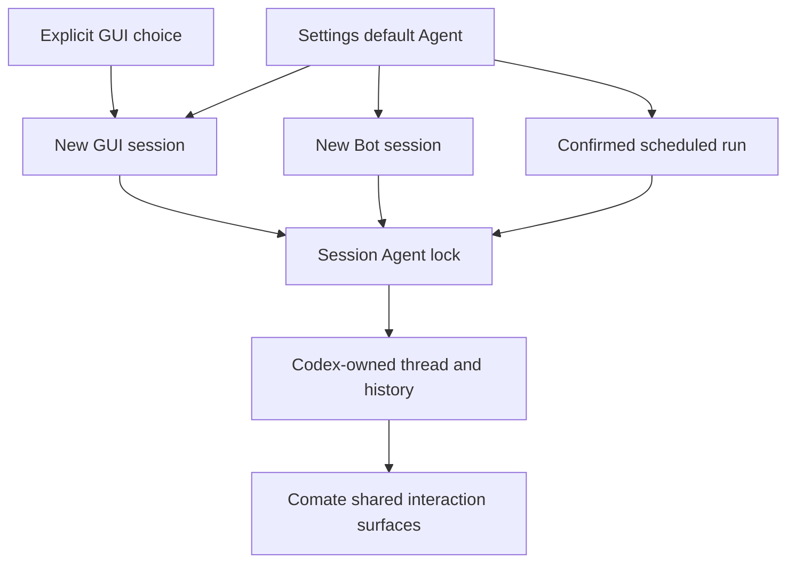
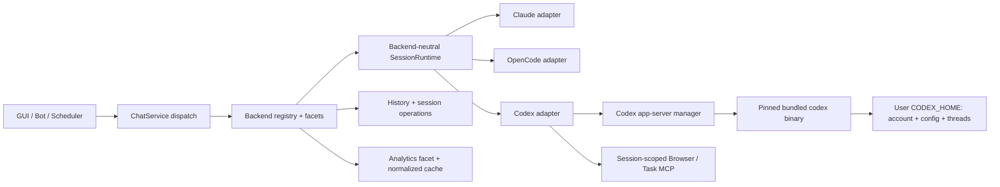

# Codex Agent Backend - Plan

## Goal Capsule

- **Objective:** Make Codex a first-class Comate Agent backend alongside Claude Code and OpenCode, with the same supported outcomes across GUI sessions, Bots, scheduled tasks, analytics, and shared workspace capabilities.
- **Product authority:** This contract owns Codex backend identity, availability, account and Provider behavior, session ownership, default-Agent routing, capability parity, packaging, release gates, and unavailable-runtime behavior.
- **Open blockers:** None. The implementation must pin the Codex release before generating protocol types, and production enablement remains gated by the parity matrix.
- **Execution profile:** Deep, cross-cutting backend integration. Implement in dependency order, preserve existing Claude Code and OpenCode behavior with characterization tests, and keep the shipping tail in the final unit.
- **Tail ownership:** The executor owns implementation, regression fixes, packaged-runtime validation, acceptance evidence, and documentation updates. It does not own publishing a release unless separately authorized.

---

## Product Contract

### Summary

Codex will become a selectable, bundled Agent backend throughout Comate.
Users will stay inside Comate for Codex work while Codex remains authoritative for its own accounts, configuration, sessions, and execution state.

### Problem Frame

Users who want Codex currently leave Comate and work through Codex CLI.
That breaks the unified workspace experience and excludes Codex from Comate's Bot, scheduling, analytics, browser, approval, and task-management surfaces.
The desired value is a genuinely different Agent choice inside the same product, not merely access to an OpenAI model through another backend.

### Key Decisions

- **Codex is a peer session backend.** (session-settled: user-directed — chosen over a callable subagent or multi-backend orchestration mode: the goal is another independent Agent choice.) Governs R1–R3.
- **Release requires complete Comate capability parity.** (session-settled: user-directed — chosen over GUI-only or partially degraded rollout: Codex must replace leaving Comate in every existing product entry point.) Governs R7–R10.
- **Native Codex accounts and enterprise Providers coexist.** (session-settled: user-directed — chosen over either account path alone: individuals need Codex-native access while organizations retain endpoint control.) Governs R4–R6.
- **Codex owns accepted session data.** (session-settled: user-directed — chosen over Comate-owned transcript copies or full CLI-history import: backend-native persistence matches the Claude Code ownership model.) Governs R3 and R13.
- **Comate bundles a pinned Codex runtime.** (session-settled: user-directed — chosen over relying on a user-installed CLI or supporting an external override in v1: parity evidence must apply to one known runtime.) Governs R14–R16.
- **Unattended work never falls back to a different Agent.** (session-settled: user-directed — chosen over automatic fallback: changing Agent semantics without the user present is unsafe.) Governs R9–R12.
- **Default-Agent changes affect only new sessions.** (session-settled: user-directed — chosen over automatic reset or cross-backend history migration: backend transcripts are not portable.) Governs R2, R9, and R11.

### Actors

- A1. A Comate user who selects Codex for an interactive workspace session.
- A2. A workspace administrator who configures the default Agent, Codex account access, or an enterprise Provider.
- A3. A Bot user whose persistent session is created and executed through the configured default Agent.
- A4. The scheduler, which starts unattended run sessions using a previously confirmed default-Agent snapshot.
- A5. The Codex runtime, which owns authentication state, threads, turns, tool interactions, and transcript persistence.

### Requirements

**Backend identity and session ownership**

- R1. Codex appears as a peer of Claude Code and OpenCode wherever Comate lets a user inspect, select, or set the default Agent.
- R2. Every session locks to its Agent when its first runtime starts; changing the default Agent never changes an existing GUI, Bot, or run session.
- R3. Codex persists accepted turns and histories in its own session store, while Comate persists only the association and Comate-owned presentation metadata needed to reopen and display that session.

**Accounts, configuration, and Providers**

- R4. Comate supports Codex-native ChatGPT login and OpenAI API-key login without requiring the user to leave the application to finish setup, except for the external browser authorization step itself.
- R5. Codex sessions launched by Comate reuse the user's existing Codex CLI identity and compatible configuration, including account state and user-selected Codex capabilities.
- R6. Organizations can select a compatible Comate Provider for Codex, and an invalid or unsupported Provider is rejected with an actionable reason rather than silently replaced by native Codex access.

**Capability and entry-point parity**

- R7. Codex provides the same user-visible outcomes as Claude Code for streaming text and reasoning, tool rendering, approvals, user questions, subagents, browser use, hooks, slash commands, todos, session management, model selection, image input, Skills, MCP, and other capabilities present in Comate's shared Agent surface.
- R8. Codex supports GUI sessions, WeCom and Feishu Bot sessions, scheduled tasks, and analytics with the same product rules and safety boundaries applied to Claude Code.
- R9. A newly created GUI, Bot, or scheduled run session uses the Agent selected by the applicable explicit choice or settings default at creation time, then follows R2.
- R10. Every shared capability has a fail-closed Codex declaration backed by executable parity evidence before Codex is offered in a production build.
- R11. When the settings default changes, existing Bot sessions retain their locked Agent; a Bot user starts using the new default only after creating a new Bot session.
- R12. A confirmed scheduled task retains its confirmed Agent snapshot; a later default-Agent change blocks execution until the task is reconfirmed.
- R13. Comate reconstructs Codex session history, child-agent activity, changed-file summaries, pending interactions, and analytics from Codex-owned authoritative data rather than a parallel transcript copy.

**Availability, packaging, and failure behavior**

- R14. Production Comate packages include one platform-appropriate Codex runtime version pinned to the Comate release and verified on every supported desktop platform.
- R15. Codex is selectable only when its runtime is healthy and its required account or Provider configuration is usable.
- R16. If a selected or locked Codex backend is unavailable, Comate fails that operation with a visible recovery path and never runs it through Claude Code or OpenCode instead.

The default and locked-session relationship is:



### Key Flows

- F1. Start an interactive Codex session
  - **Trigger:** A1 opens a new chat and selects Codex or inherits Codex as the default Agent.
  - **Actors:** A1, A5
  - **Steps:** Comate verifies availability and account or Provider readiness, starts the Codex session, locks its backend, and presents normalized streaming and interaction events.
  - **Outcome:** The user completes Codex work without leaving Comate.
  - **Covered by:** R1–R7, R9, R14–R16
- F2. Resume a Codex-owned session
  - **Trigger:** A1 reopens a prior Comate session associated with a Codex thread.
  - **Actors:** A1, A5
  - **Steps:** Comate asks Codex for authoritative history and live state, rebuilds shared UI projections, and continues the same Codex thread.
  - **Outcome:** History and current activity survive application and workspace restarts without a Comate transcript copy.
  - **Covered by:** R2, R3, R7, R13
- F3. Route a Bot user through the default Agent
  - **Trigger:** A3 sends a message without an existing Bot session or explicitly starts a new one.
  - **Actors:** A2, A3, A5
  - **Steps:** Comate resolves the current settings default, creates and locks the Bot session, then applies the same isolation, approval, and interaction rules used by supported Bot sessions.
  - **Outcome:** Codex can serve Bot work only when it is the selected default at session creation.
  - **Covered by:** R8, R9, R11, R16
- F4. Execute a scheduled task
  - **Trigger:** A4 reaches the next firing time for a confirmed task.
  - **Actors:** A2, A4, A5
  - **Steps:** Comate verifies that the current default still matches the confirmed snapshot, verifies backend readiness, and creates a locked run session; drift or unavailability fails before dispatch.
  - **Outcome:** Unattended work never changes Agents without renewed user confirmation.
  - **Covered by:** R8, R9, R12, R16
- F5. Recover from unavailable Codex
  - **Trigger:** A user or unattended entry point targets Codex when authentication, Provider configuration, health, or compatibility checks fail.
  - **Actors:** A1 or A2, A5
  - **Steps:** Comate prevents dispatch, identifies the failing prerequisite, and offers the relevant login, configuration, repair, or reconfirmation path.
  - **Outcome:** No work silently executes through another Agent.
  - **Covered by:** R6, R10, R15, R16

### Acceptance Examples

- AE1. **Covers R1, R2, R7, R9.** Given Codex is healthy and selected for a new GUI chat, when the first turn starts, then the session locks to Codex and exposes the same shared interaction surfaces as a Claude Code session.
- AE2. **Covers R3, R5, R13.** Given the user is already signed in through Codex CLI, when Comate starts and later reopens a Codex session, then the existing identity is reused and history is loaded from the Codex-owned thread.
- AE3. **Covers R4, R6, R15.** Given no native Codex login is active, when an administrator selects a valid enterprise Provider, then Codex uses that Provider; an invalid Provider blocks the session with a configuration reason and does not fall back to native access.
- AE4. **Covers R8–R11.** Given Codex is the settings default and a Bot user starts a new session, when messages and interactive requests occur, then the session runs on Codex with Bot safety rules; changing the default afterward does not alter that session.
- AE5. **Covers R8, R9, R12.** Given a scheduled task was confirmed while Codex was the default, when the default later changes, then the next run is blocked until reconfirmation and the task does not silently use the new Agent.
- AE6. **Covers R14–R16.** Given the bundled Codex runtime is missing, unhealthy, unauthenticated, or incompatible, when any entry point targets it, then execution fails with a recovery path and neither Claude Code nor OpenCode receives the work.
- AE7. **Covers R7, R8, R10.** Given one named shared capability lacks executable Codex parity evidence, when a production release is assembled, then Codex remains unavailable in that build rather than shipping with an undeclared degradation.
- AE8. **Covers R8, R13.** Given Codex sessions have completed through GUI, Bot, and scheduled runs, when analytics are opened, then their supported usage, model, tool, and activity data are included under the same product semantics as Claude Code data.

### Success Criteria

- Users can choose Codex and complete the same Comate workflows available through Claude Code without switching to Codex CLI.
- The Codex parity checklist contains executable evidence for every shared capability and every supported entry point before production availability.
- Backend-owned session replay produces no duplicate, missing, or cross-session messages after restart, resume, fork, or subagent activity.
- No unavailable, changed-default, or invalid-Provider path executes work through a different Agent.

### Scope Boundaries

- A Codex session is not a subagent of a Claude Code or OpenCode session.
- One task is not automatically fanned out to multiple Agent backends for comparison, consensus, or review.
- Existing transcripts are not migrated or summarized across Agent backends when the default changes.
- Codex-specific product surfaces beyond Comate's shared Agent capability set are deferred unless required to deliver a shared outcome or account setup.
- This work does not change the behavior of existing locked Claude Code or OpenCode sessions.

### Dependencies / Assumptions

- The pinned Codex app-server protocol continues to expose the lifecycle, interaction, account, usage, and session data required by R3–R13.
- Codex can consume the enterprise Provider configurations Comate intends to support; unsupported Provider classes must be discovered before planning completes.
- Comate can identify itself as an approved Codex app-server client where enterprise compliance logging requires a known client identity.
- The release may be staged internally for validation, but production availability remains gated by R10 rather than by calendar date.

### Sources / Research

- Existing product vocabulary and backend invariants: `CONCEPTS.md`.
- Existing backend registry and capability contract: `src/server/services/agent-backends.ts`.
- Existing backend-neutral runtime seam: `src/server/services/backend-driver.ts` and `src/server/services/session-runtime.ts`.
- Existing alternate-backend precedent: `docs/plans/2026-07-23-002-feat-pluggable-agent-backend-plan.md`.
- Existing executable evidence format: `docs/acceptance/agent-backend-parity-checklist.md`.
- Upstream integration authority: `/Users/shunyun/workspace/ai/codex/codex-rs/app-server/README.md` from the user-selected Codex checkout.
- Initial published runtime pin: `@openai/codex@0.149.0`, verified from the official npm registry on 2026-08-22. Its generated schema, not the moving source checkout, is authoritative for implementation.

---

## Planning Contract

The Product Contract above is preserved from the confirmed `ce-brainstorm` artifact: R1–R16, F1–F5, and AE1–AE8 retain their identifiers and meaning.

### Key Technical Decisions

- **KTD1 — Integrate `codex app-server` over its supported stdio JSONL transport.** Do not scrape the TUI, shell out once per prompt, or adopt the experimental WebSocket transport. One initialized connection supports concurrent Codex threads and server-initiated requests. Governs R2–R4, R7, R13, R16.
- **KTD2 — Pin `@openai/codex@0.149.0` and generate protocol types from that exact binary.** Add a checked-in generated protocol surface and a drift test that runs `codex app-server generate-ts` or `generate-json-schema`. The user-selected source checkout reports `0.0.0-dev` and may be ahead of the release, so its README guides design while the pinned binary's generated schema decides which calls may ship. A later pin change is an explicit dependency update that reruns the full protocol and packaged-runtime gates. Governs R10, R14–R16.
- **KTD3 — Replace the Anthropic-shaped driver boundary with a backend-neutral contract before adding Codex behavior.** Define neutral turn input, normalized agent events, server-request responses, history projections, and lifecycle controls. Claude and OpenCode adapters receive characterization coverage before `SessionRuntime` switches to the neutral contract. Codex-specific branches stay inside its adapter and service facets. Governs R1, R7–R10.
- **KTD4 — Run one long-lived Codex app-server manager per Comate sidecar and multiplex threads through it.** The manager owns initialization, request IDs, pending RPCs, notification routing, backpressure retry, health, graceful shutdown, and generation restart. A process failure fails active turns visibly, restarts with bounded backoff, then resumes later work from persisted Codex thread IDs. Governs R2, R3, R13, R15, R16.
- **KTD5 — Let Codex remain the session system of record.** Store the Codex thread ID in the existing backend-session association and keep only Comate-owned title, workspace, source, lock, provider reference, and presentation state in SQLite. Load history through `thread/read` and related thread APIs; never copy Codex rollout files or emulate their path encoding. Governs R2, R3, R13.
- **KTD6 — Separate native identity from per-session enterprise Provider overrides.** Native sessions use Codex `account/*` APIs and the user's default `CODEX_HOME`. Codex-compatible Comate Providers must explicitly declare the OpenAI Responses protocol. Pass their base URL, model provider, and programmatic bearer token as an in-memory thread configuration over local stdio; do not write them to Codex global config, child-process environment, logs, transcripts, API responses, or client-readable diagnostics. Provider reads expose only masked metadata or a credential-present flag, and an update that omits the secret retains the existing value. An explicit Provider wins for that session; otherwise Codex native identity applies. Governs R4–R6, R15, R16.
- **KTD7 — Normalize Codex item lifecycle events, not only turn summaries.** Route `item/started`, deltas, `item/completed`, server approval requests, user-input requests, and `turn/completed` through the shared event model. Use stable Codex item and request IDs for deduplication. A reconnect rehydrates authoritative history first and reattaches live state without replacing in-progress UI with completed-only history. Governs R7, R8, R13.
- **KTD8 — Represent backend functionality as fail-closed service facets.** The registry declares stream, interaction, history, session operations, account, model, activity, and analytics facets. A capability is selectable only when its facet and executable evidence exist. Unsupported Codex-native extras remain hidden unless they implement an existing shared outcome. Governs R1, R7, R10, R15.
- **KTD9 — Inject Comate-owned capabilities as per-thread dynamic tools.** Expose browser and scheduled-task operations through app-server dynamic-tool requests that call the existing policy-enforcing services in process; do not place Comate session bearer tokens in Codex-persisted thread configuration. Pass user-configured Skills/MCP roots, approval policy, sandbox policy, cwd, images, and model selection through `thread/start` or `thread/resume`. Preserve existing workspace, Bot-role, loopback-auth, human-approval, and token-rotation boundaries. Governs R7–R10.
- **KTD10 — Preserve lock and no-fallback rules at the common dispatch boundary.** Remove the current Bot-to-Claude override. Resolve the default exactly once for each new session, persist the backend only after runtime startup succeeds, and reject unavailable locked/default backends. Keep scheduler snapshot drift checks and require reconfirmation. Do not reuse `resolveDefaultBackend` fallback behavior for an explicitly selected, locked, Bot, or scheduled target. Governs R2, R9, R11, R12, R16.
- **KTD11 — Read analytics through a backend analytics facet.** Keep the existing normalized analytics cache and rollups. Claude continues direct JSONL extraction; OpenCode retains its adapter; Codex enumerates associated threads and derives usage, model, tool, duration, and activity from public app-server thread/turn/item data and usage notifications. Missing pricing produces partial cost coverage, not fabricated cost. Governs R8, R13.
- **KTD12 — Treat parity and packaged execution as release contracts.** Use a deterministic fake app-server for protocol and failure tests, a live pinned-binary smoke suite for contract checks, and packaged-artifact smoke tests on supported OS/architecture variants. Production capability declarations stay disabled until the corresponding acceptance row passes. Governs R10, R14–R16.

### High-Level Technical Design



The app-server manager is a transport and lifecycle component. It does not contain product routing. The Codex adapter translates between normalized Comate concepts and Codex Thread/Turn/Item concepts. Backend facets provide history, session operations, account, model, and analytics behavior without making `chat-service.ts` a third-backend switchboard.

Codex thread IDs are the durable join key. A Comate session receives its backend lock and Codex thread ID only after `thread/start` succeeds. Resume uses the stored thread ID. Fork creates a new Codex thread and a new Comate association. Delete or archive follows the shared Comate product semantics without deleting Codex-owned history unless Codex exposes and the product explicitly invokes the corresponding destructive operation.

Server-initiated Codex requests enter the same pending-interaction state machine as Claude Code requests. Bot and scheduled sessions apply their existing non-interactive policies. Requests that require human consent and cannot be answered under those policies fail visibly; they are never auto-approved merely because Codex supports a richer decision set.

### Protocol and Capability Mapping

| Comate outcome | Codex app-server authority | Normalized behavior |
|---|---|---|
| Start/resume/fork/history | `thread/start`, `thread/resume`, `thread/fork`, `thread/read` and thread listing | Persist only the thread association; translate returned turns/items into shared history projections. |
| Stream text/reasoning/tools/files | item start, delta, and completion notifications | Emit stable normalized item events; map command, file change, MCP, dynamic tool, and agent items to existing renderers. |
| Approval and questions | command/file approval requests and `item/tool/requestUserInput` | Register pending interactions by request ID and route decisions through the existing approval/question APIs and policy gates. |
| Stop | `turn/interrupt` plus Comate activity cleanup | Stop the foreground turn; also terminate Comate-owned background activity when product Stop means full-session stop. |
| Models/account/usage | `model/list`, `account/read`, `account/login/start`, `account/logout`, rate-limit and usage APIs | Populate settings and selectors without reading Codex private files. Human login and secret entry remain explicit UI actions. |
| Skills/MCP/browser/tasks | thread configuration, Skills and MCP APIs, dynamic tools | Bridge Comate-owned browser/task operations as dynamic tools with existing policy checks; apply user MCP/Skill configuration without persisting Comate bearer tokens or mutating global Codex config. |
| Hooks, slash commands, and todos | `hooks/list`, backend command discovery/execution, and plan/item notifications | Merge backend-provided entries into the existing shared command and todo projections; hide unsupported Codex-only commands and refresh on invalidation notifications. |
| Subagents/activity | collaboration-agent items and parent-thread relationships | Project child activity into the existing subagent and Session Activity surfaces with stable parent IDs. |
| Analytics | thread/turn/item usage plus account usage where semantically applicable | Cache per-session normalized facts; label unavailable dimensions instead of inferring them from unrelated account quotas. |

### Data and Security Boundaries

- The existing Comate session row keeps `backend = 'codex'` and the backend session field keeps the Codex thread ID. No Codex message body is added to SQLite solely for replay.
- Provider compatibility is an explicit stored field such as `protocol: 'anthropic' | 'openai-responses'`; existing Provider rows migrate to the current Anthropic-compatible meaning. URL pattern detection may suggest a value but cannot authorize Codex usage.
- Provider secrets remain server-side. Programmatic bearer configuration is constructed in memory for the target Codex thread and must be covered by negative assertions across API responses, environment snapshots, diagnostics, SSE payloads, stored presentation metadata, generated config, and transcript reads. Existing Provider APIs migrate from returning `authToken` to masked metadata or a credential-present flag without forcing users to re-enter an unchanged secret.
- The app-server process inherits the real Codex home location so native CLI identity and configuration remain shared. Tests override it with an isolated temporary home; they must never read or mutate the developer's real Codex state.
- Browser and scheduled-task dynamic-tool requests carry the owning Codex thread and resolve back to the Comate session's current capability context. The adapter never accepts a session/workspace identity asserted by tool arguments, preserving the same token-bound identity and Bot workspace constraints as the existing MCP routes.
- Codex account, login, logout, Provider, health, and model-management routes remain under the existing default-deny `/api` middleware. Only the desktop credential can mutate global account or Provider state; Bot/session capability tokens are rejected even if they know an endpoint path.
- Comate records backend availability and sanitized failure categories. It does not expose raw app-server stderr, bearer tokens, login payloads, or Provider headers to Bot users or analytics.

### System-Wide Impact

- **Runtime lifecycle:** Sidecar startup now owns a second long-lived child process in addition to existing backend resources. Shutdown, idle behavior, crash recovery, and diagnostic status must account for app-server generations without leaking active request promises.
- **Persistent associations:** SQLite gains only backend/provider compatibility metadata and Codex thread associations. Codex remains authoritative for messages. Missing, moved, or incompatible threads produce repairable association failures rather than automatic replacement threads.
- **Authentication:** Native Codex login changes shared CLI account state. Comate must surface account-change notifications immediately and must not reinterpret a logout as permission to use a configured enterprise Provider or another Agent.
- **Shared workspace capabilities:** Browser, scheduled-task, Skill, MCP, hook, command, todo, approval, and subagent projections must carry the same cwd, Bot-role, token, and human-consent context regardless of backend.
- **Analytics cache:** Cache enumeration becomes multi-backend. Refresh failures remain isolated per backend and session so an unavailable Codex app-server does not erase cached Claude/OpenCode data or block the global summary.
- **Release operations:** Binary staging, schema drift, client identity, and capability evidence become release inputs. Diagnostics expose version and readiness categories but redact process arguments, config overrides, and credentials.

### Sequencing

1. Establish the neutral contracts and characterize existing backends before changing runtime behavior.
2. Pin, generate, bundle, and resolve Codex before building product surfaces against it.
3. Add the app-server transport and native/provider identity path.
4. Implement live runtime, interactions, history, and session operations.
5. Expose settings and selection only after health and readiness can be evaluated.
6. Route Bot, scheduler, and analytics through shared facets.
7. Complete the parity matrix and packaged smoke tests before enabling production availability.

### Risks and Mitigations

- **Protocol churn:** A newer Codex binary can change JSON-RPC types. Pin one published version, check in generated types, and fail CI on schema drift.
- **Partial event replay:** Reconnect races can duplicate items or erase pending interactions. Key projections by thread/turn/item/request IDs and test disconnects during deltas, approvals, and child-agent work.
- **Credential leakage:** Programmatic Provider credentials cross a local protocol boundary. Keep them out of environment/config persistence and add explicit redaction and absence tests.
- **Backend regression:** Neutralizing the driver seam touches mature Claude/OpenCode paths. Land characterization tests first and migrate one event class at a time.
- **Packaged-runtime divergence:** Development Node and a source-built Codex do not prove packaged behavior. Test the staged platform binary and a packaged application on each release target.
- **Analytics mismatch:** Codex account quotas are not session usage. Use thread/turn facts for per-session rollups and expose account limits separately.
- **Enterprise client identity:** The pinned app-server may require a registered `clientInfo.name` for compliance attribution. Use one stable Comate client identity and make registration/approval a production release prerequisite, not a runtime fallback.

### Rollout and Rollback

- Ship the binary, generated schema, Provider migration, and hidden backend declaration before exposing Codex selection. Enable production selection only after U8 evidence passes for that release artifact.
- An upgrade first validates the new binary/schema against existing associated thread IDs in read-only smoke checks. It must not rewrite Codex history or change existing session locks during validation.
- If the new runtime fails health or compatibility checks, disable new Codex selection and fail locked Codex operations with recovery guidance. Do not roll those sessions to another Agent.
- A binary rollback is allowed only when the previous pinned app-server can read the existing Codex thread format. Otherwise retain the newer binary or ship a forward fix while keeping Codex unavailable; never downgrade by copying or transforming Codex-owned transcripts.
- Provider schema rollback preserves the original Provider fields and ignores the additive compatibility marker. Secret-response redaction is not rolled back.

### Assumptions

- The selected published Codex release exposes the documented app-server lifecycle, account, thread, item, model, Skills, MCP, and usage APIs.
- Codex-compatible enterprise endpoints implement the OpenAI Responses wire API. Anthropic-only Providers remain valid for Claude/OpenCode but are ineligible for Codex.
- Comate's supported desktop platform matrix determines which `@openai/codex-<platform>` optional packages must be staged; unsupported Codex binary variants block that target's release.
- Existing Comate approval, Bot-role, browser-token, and scheduler confirmation policies remain the source of product policy even when Codex offers additional low-level choices.

---

## Implementation Units

### U1. Introduce backend-neutral runtime and service contracts

- **Goal:** Give all backends one explicit, fail-closed contract without regressing Claude Code or OpenCode.
- **Requirements:** R1, R7, R10, R16; AE1, AE7.
- **Dependencies:** None.
- **Primary files:** `src/server/services/backend-driver.ts`, `src/server/services/agent-backends.ts`, `src/server/services/session-runtime.ts`, `src/server/services/chat-service.ts`, `src/server/types/` or `src/server/types/message.ts`, existing backend tests.
- **Approach:**
  - Define neutral turn input, agent item/event, interaction request, history reader, session operation, model/account, activity, and analytics interfaces.
  - Extend `BackendId` with `codex`, but keep Codex unavailable until its required facets pass readiness checks.
  - Wrap the current Claude driver and OpenCode adapter behind the neutral model. Preserve event ordering, approval IDs, bot handlers, usage tracking, images, stop behavior, and SSE output.
  - Replace backend checks in `chat-service.ts` with facet lookup where the behavior is truly backend-specific. Keep shared policy in `ChatService` and `SessionRuntime`.
- **Test scenarios:** Characterize Claude and OpenCode streaming, tool lifecycle, question/approval routing, stop, history, rename/fork, and unavailable-capability errors before and after the seam change. Assert undeclared facets fail closed.
- **Verification:** Run focused server tests for the registry, driver, runtime, chat service, and OpenCode mapper/transcript modules. A captured normalized event fixture must be unchanged for existing backends.

### U2. Pin, generate, bundle, and resolve the Codex runtime

- **Goal:** Make one exact Codex app-server build available in development and packaged Comate builds.
- **Requirements:** R10, R14–R16; AE6, AE7.
- **Dependencies:** U1.
- **Primary files:** `package.json`, `package-lock.json`, `scripts/build-sidecar.ts`, `scripts/test-build-sidecar.ts`, `electron-builder.yml`, `src/server/utils/resolve-codex-binary.ts` (new), generated Codex protocol directory (new), packaging and host-config tests.
- **Approach:**
  - Pin `@openai/codex` and the required platform optional packages to the same concrete published version.
  - Extend `COMATE_BUNDLE_BACKENDS` and resource staging for Darwin arm64/x64, Linux arm64/x64, and supported Windows variants. Preserve dangling-symlink, executable-bit, architecture, and non-ASCII resource audits.
  - Resolve the binary from staged resources in packaged mode and the pinned dependency in development. Do not search arbitrary user PATH locations in v1.
  - Generate TypeScript or JSON-schema-derived protocol types from the resolved binary and add a reproducible drift command/test.
  - Health checks validate executable presence, version equality, app-server startup, initialize response, and schema/protocol compatibility.
- **Test scenarios:** Missing package, wrong architecture, mismatched wrapper/native version, failed initialize, malformed schema output, dangling staged link, spaces/non-ASCII paths, and each supported resource layout.
- **Verification:** Run build-sidecar tests, protocol drift test, and a live `initialize`/`thread/list` smoke against the pinned development binary. Inspect staged resources rather than relying on host PATH.

### U3. Build the Codex app-server manager and identity/provider services

- **Goal:** Provide a resilient local RPC connection plus native and enterprise authentication without credential drift.
- **Requirements:** R4–R6, R14–R16; AE2, AE3, AE6.
- **Dependencies:** U2.
- **Primary files:** `src/server/services/codex-app-server-manager.ts` (new), `src/server/services/codex-rpc-client.ts` (new), `src/server/services/codex-account-service.ts` (new), `src/server/services/agent-backends.ts`, `src/server/server-main.ts`, manager/account tests and fake app-server fixture.
- **Approach:**
  - Spawn one sanitized long-lived app-server process, send one initialize request with stable Comate client information, and multiplex requests/notifications by ID and thread.
  - Implement bounded request timeouts, cancellation, `-32001` exponential backoff with jitter, stderr redaction, graceful shutdown, crash generation tracking, and bounded restart backoff.
  - Expose account read, ChatGPT/device/browser login start and completion notifications, API-key login, logout, rate-limit state, model listing, and readiness.
  - Translate an explicitly Codex-compatible Provider into an in-memory thread override. Reject incompatible protocol, missing model/base URL/token, unsupported auth shape, and failed endpoint health without native fallback.
  - Keep real `CODEX_HOME` for production and force isolated temporary homes in tests.
- **Test scenarios:** Concurrent out-of-order RPC responses, server requests while client requests are pending, malformed JSON, EOF, restart, retryable backpressure, timeout, redacted stderr, existing CLI login reuse, login cancellation, invalid Provider, and secret-absence assertions.
- **Verification:** Run deterministic fake-server tests and a live pinned-binary account/read plus model/list smoke using an isolated Codex home. No test may inspect the developer's real account.

### U4. Implement live Codex turns, interactions, and shared tools

- **Goal:** Deliver full interactive runtime behavior through the shared Comate UI and policy engine.
- **Requirements:** R2, R7–R10, R13, R15, R16; AE1, AE4, AE6, AE7.
- **Dependencies:** U1, U3.
- **Primary files:** `src/server/services/codex-driver.ts` (new), `src/server/services/codex-event-mapper.ts` (new), `src/server/services/session-runtime.ts`, `src/server/services/chat-service.ts`, `src/server/services/browser-mcp-http.ts`, `src/server/services/scheduled-tasks-mcp.ts`, shared SSE/message types, adapter/runtime tests.
- **Approach:**
  - Map Comate prompts, images, cwd, model, approval/sandbox policy, Skills roots, user MCP configuration, dynamic tool declarations, and Provider overrides into thread/turn requests.
  - Map item start/delta/completion events for assistant text, reasoning, commands, file changes, MCP/dynamic tools, and collaboration agents into stable normalized events.
  - Map plan/todo updates, hook discovery, and backend command discovery into the existing shared projections. Execute only commands supported by the shared command contract and current workspace policy.
  - Route dynamic browser/task requests by manager-owned thread ID to the associated Comate session and existing service dependencies. Ignore any workspace or session identity supplied in model-controlled arguments.
  - Route command/file approvals and request-user-input through the existing interaction state machine. Translate only decisions permitted by Comate policy.
  - Deduplicate by Codex IDs, preserve ordered deltas, expose usage/error state, and settle every pending interaction when a turn completes, interrupts, or the process fails.
  - Implement Stop as turn interruption plus cleanup of Comate-owned background terminals/tools required by the shared Session Activity semantics.
- **Test scenarios:** Text/reasoning interleaving, tool delta/completion, command and patch approval variants, multi-question input, images, dynamic browser/task authorization, forged tool identity, user MCP configuration, subagent item creation, interruption, process death, and late/duplicate notifications.
- **Verification:** Run adapter and runtime suites with golden normalized event traces. Manually exercise one live Codex turn with a tool, approval, user question, image, browser action, and Stop in an isolated workspace.

### U5. Implement Codex history, session operations, child activity, and changed files

- **Goal:** Reopen and manage Codex-owned sessions with the same user-visible outcomes as Claude Code.
- **Requirements:** R2, R3, R7, R13, R16; AE2, AE6.
- **Dependencies:** U4.
- **Primary files:** `src/server/services/codex-history.ts` (new), `src/server/services/codex-session-operations.ts` (new), `src/server/services/chat-service.ts`, `src/server/storage/sqlite-store.ts`, session/subagent/activity/changed-file tests.
- **Approach:**
  - Persist the Codex thread association only after successful start and resume it on runtime reconstruction.
  - Translate thread/turn/item history into shared messages, tasks, tool results, errors, pending interactions, collaboration children, and changed-file summaries.
  - Implement shared rename, fork, archive/delete projection, model switch for subsequent turns, and session-info operations through the Codex facet where supported.
  - Load slash commands, hooks, and todo/plan state through backend facets so reopening a session reconstructs the same shared panels as the live path.
  - Rebuild live state with an ID-based merge so reconnect history cannot overwrite newer in-progress items. Preserve backend ownership on forks and all existing sessions.
  - Treat missing or inaccessible Codex threads as recoverable association errors with repair guidance, never as empty histories or new sessions.
- **Test scenarios:** Restart/resume, compacted history, partial image history, fork parentage, rename, missing thread, duplicate association, child-agent history, in-progress reconnect, pending approval reconnect, file change aggregation, and cross-backend isolation.
- **Verification:** Run transcript/history, chat-session, subagent, changed-file, and reconnect tests. A restart fixture must produce the same normalized history and no duplicated live item.

### U6. Add Codex settings, account state, Provider compatibility, and selection UI

- **Goal:** Let administrators and users configure, diagnose, and select Codex safely.
- **Requirements:** R1, R4–R6, R9, R15, R16; AE1, AE3, AE6.
- **Dependencies:** U3, U5.
- **Primary files:** `src/server/models/provider.ts`, `src/server/storage/sqlite-store.ts`, `src/server/routes/providers.ts`, backend/account routes (new or extended), `src/client/stores/backend-store.ts`, `src/client/stores/provider-store.ts`, `src/client/components/BackendSection.tsx`, `src/client/components/BackendSelector.tsx`, `src/client/components/ProviderSection.tsx`, localization files, related tests.
- **Approach:**
  - Add explicit Provider protocol compatibility with a backward-safe data migration and protocol-aware health checks. Do not infer Codex eligibility from a URL at dispatch time.
  - Replace raw Provider-token reads with masked metadata or a credential-present flag. Treat an omitted secret during update as “retain existing”; require a new value only for creation or explicit credential replacement.
  - Add Codex readiness detail: runtime version, account mode, login state, compatible Provider state, models, and actionable sanitized failures.
  - Provide ChatGPT login, API-key login, logout, native-vs-Provider choice, and model selection. External browser consent and secret entry stay human-controlled.
  - Cover idle, checking, login-pending, external-authorization, ready, expired, Provider-invalid, runtime-unavailable, and retry states. Make the active account/Provider mode and locked session backend readable without relying on color alone.
  - Keep all global account and Provider mutations behind the desktop credential. Bot/session tokens may read only the backend readiness already exposed by their allowed workflow and cannot invoke login, logout, secret, or global model-configuration actions.
  - Add Codex to default and per-session selectors only when runtime readiness rules permit it; show locked-session identity separately from the current default.
- **Test scenarios:** Provider migration, masked token reads, omitted-secret updates, compatible/incompatible Provider options, desktop-vs-session-token authorization, native login reuse, login pending/cancel/error, account notification refresh, model refresh, default selection, locked session after default change, keyboard/screen-reader state labels, and sanitized UI errors.
- **Verification:** Run provider route/store tests and client backend/provider component/store tests. Browser-check account setup, Provider setup, default selection, and locked-session presentation.

### U7. Route Bots, scheduled tasks, and analytics through Codex facets

- **Goal:** Complete non-GUI entry-point and reporting parity without fallback.
- **Requirements:** R8, R9, R11–R13, R16; AE4, AE5, AE8.
- **Dependencies:** U4–U6.
- **Primary files:** `src/server/services/chat-service.ts`, WeCom and Feishu bot services/tests, `src/server/services/scheduled-tasks-service.ts`, `src/server/services/scheduler-service.ts`, `src/server/services/analytics-service.ts`, analytics reader/aggregation/cache modules and routes, corresponding client analytics tests.
- **Approach:**
  - Remove the hard-coded Bot Claude resolution. New Bot sessions resolve the settings default, then lock; existing sessions and Bot `/new` semantics follow R11.
  - Keep scheduler confirm-time backend snapshots and drift checks. Add Codex readiness failure before dispatch and a reconfirm path; never substitute another backend.
  - Introduce backend analytics enumeration/extraction. Feed Codex session usage, model, tool, duration, and activity into existing normalized cache/rollups while keeping account quota separate.
  - Key analytics cache entries by the Comate session association and backend, and use Codex `updatedAt` plus the last observed turn/item cursor as the stale fingerprint. Paginate history so a large Codex thread does not require one unbounded response.
  - Apply existing Bot permission, workspace isolation, audit, approval, browser, and capability-token policies to Codex interactions.
  - Surface scheduled drift/unavailable failures with an administrator-facing reconfirm or repair action. Bot users receive a safe failure that identifies the locked Agent and directs configuration work to an administrator without exposing account or Provider details.
- **Test scenarios:** New Bot on Codex default, persistent Bot after default change, `/new` after change, unavailable Codex Bot, both Bot channels, scheduled confirm/run/drift/reconfirm/unavailable, GUI/Bot/scheduled analytics, stale-cache refresh, unknown pricing, and one corrupt Codex thread.
- **Verification:** Run Bot service/routes, scheduler/scheduled-task, analytics service/reader/aggregation, loopback-auth, and MCP authorization tests. Assert every failure leaves no Claude/OpenCode runtime or session.

### U8. Close the parity matrix and packaged release gate

- **Goal:** Prove all product requirements on real bundled artifacts and make Codex production-selectable only when evidence is complete.
- **Requirements:** R1–R16; F1–F5; AE1–AE8.
- **Dependencies:** U1–U7.
- **Primary files:** `docs/acceptance/agent-backend-parity-checklist.md`, `CONCEPTS.md`, README/operations documentation, release scripts/workflows, end-to-end and packaged-smoke tests.
- **Approach:**
  - Add a Codex evidence row for every declared shared capability and each GUI, WeCom, Feishu, scheduler, analytics, account, Provider, resume, and failure flow.
  - Separate deterministic protocol tests, live pinned-binary smoke, and packaged-app smoke. Record which layer proves each row.
  - Exercise supported OS/architecture packages and validate the binary actually launched from staged resources.
  - Add production gating that keeps Codex hidden/unavailable when required evidence, binary, client registration, or protocol health is missing.
  - Exercise enable, upgrade, health-failure disablement, compatible binary rollback, and incompatible-downgrade refusal without changing session locks or copying transcripts.
  - Document account ownership, Provider compatibility, session ownership, default/lock rules, reconfirmation, recovery, diagnostics, and upgrade procedure.
- **Test scenarios:** Full AE1–AE8 matrix, packaged launch on every supported target, upgrade with existing Codex threads and Providers, downgrade/incompatible schema, offline startup, account expiry, corrupted binary, and sanitized diagnostic export.
- **Verification:** Run the full repository validation commands below, the live Codex smoke suite, and target-specific packaged smoke jobs. Review the completed parity checklist before enabling the capability flag.

---

## Verification Contract

### Test Layers

1. **Pure and deterministic tests:** protocol framing, generated-type drift, event mapping, history projection, provider compatibility, selection/lock rules, scheduler drift, analytics extraction, redaction, and capability declarations.
2. **Fake app-server integration:** concurrent JSON-RPC, server-initiated requests, backpressure, malformed data, disconnect/restart, resume, pending interaction recovery, and no-fallback assertions.
3. **Live pinned-binary smoke:** initialize, account/read, model/list, thread start/turn/read/resume/fork/interrupt, one tool, and usage extraction with an isolated Codex home.
4. **Product integration:** GUI, WeCom, Feishu, scheduled task, analytics, browser MCP, Skills/MCP, images, approvals, questions, subagents, and Session Activity.
5. **Packaged application:** launch the staged binary on every supported OS/architecture and repeat a minimal create/resume/stop flow from the installed resource path.

### Repository Commands

Use the repository's current scripts as the source of truth if names change during implementation. At minimum run:

```bash
npm run typecheck
npm run test:server
npm run test:client
npm run test:electron
npm run test:scripts
npm run test:packages
npm run build:sidecar
npm run build
```

Also run the new Codex protocol-drift, fake-server, live-binary, and packaged-smoke commands introduced by U2–U8. All tests that touch Codex identity or Comate storage must use temporary `CODEX_HOME` and `COMATE_DATA_DIR` values.

### Quality Gates

- Every R-ID maps to at least one executable test or parity evidence row; every AE-ID passes on the intended surface.
- Existing Claude Code and OpenCode characterization fixtures remain unchanged unless the plan explicitly requires a shared-contract migration, in which case semantic equivalence is asserted.
- No Codex Provider secret appears in API read responses, logs, environment exposed to tools, SQLite presentation metadata, SSE payloads, transcripts, diagnostic exports, or generated config files.
- Account and Provider mutation routes accept the desktop credential and reject Bot/session capability tokens.
- Reconnect and resume tests cover disconnect during text delta, tool execution, approval, user question, subagent execution, and turn completion.
- No explicit, locked, Bot, or scheduled Codex path creates or invokes a Claude Code/OpenCode runtime when Codex is unavailable.
- Production selection remains disabled until the pinned binary, protocol schema, client identity, and parity checklist all pass on the release target.
- Packaged smoke tests execute the binary from application resources; a successful development binary run is not accepted as packaged evidence.

---

## Definition of Done

- U1–U8 are complete in dependency order, with their focused tests and verification evidence passing.
- R1–R16, F1–F5, and AE1–AE8 are traceable through implementation units and the parity checklist.
- Codex is selectable as a peer Agent in GUI settings and new sessions, and the same default routes new Bot and scheduled sessions under the confirmed lock/reconfirmation rules.
- Native ChatGPT/API-key identity and explicitly compatible Comate Providers work without cross-mode fallback or credential persistence outside their defined owner.
- Codex owns thread history; Comate can resume, fork, render, analyze, and recover associated sessions without storing a parallel transcript.
- Streaming, tools, approvals, questions, images, browser, Skills/MCP, subagents, session operations, models, todos, activity, Bot flows, scheduler flows, and analytics meet the shared outcome contract.
- Unavailable runtime, invalid Provider, account expiry, protocol mismatch, process crash, missing thread, and default drift all fail visibly and never dispatch to another Agent.
- The pinned Codex binary and generated protocol schema match, and packaged smoke tests pass on every supported release target.
- `CONCEPTS.md`, acceptance evidence, setup/recovery documentation, and upgrade notes describe the shipped behavior and ownership boundaries.
- The final diff contains no abandoned adapters, temporary compatibility switches, debug logging, copied Codex transcripts, or unused generated artifacts from rejected approaches.
