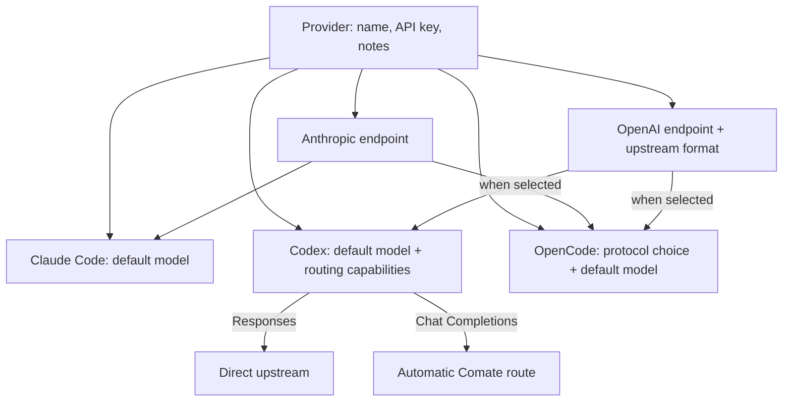
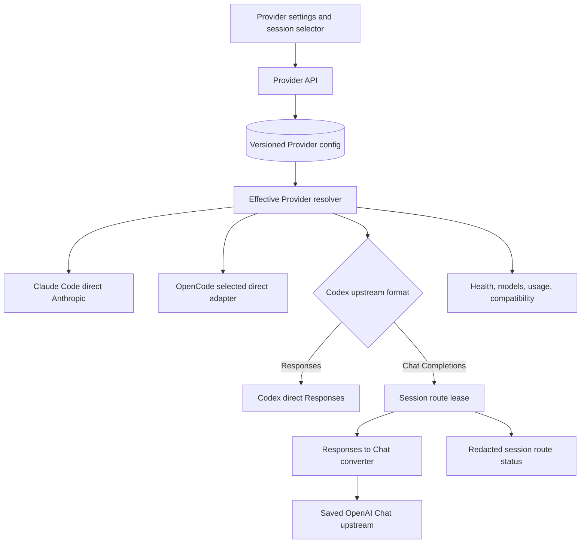
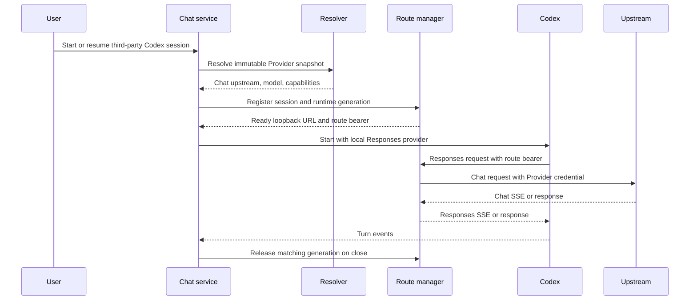
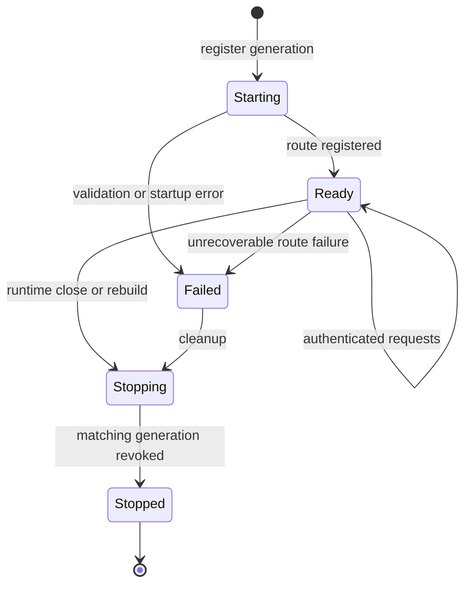

# Provider Multi-Protocol Routing - Plan

## Goal Capsule

- **Objective:** Let users configure one third-party Provider once and use it reliably from Claude Code, Codex, or OpenCode, including providers whose Codex-facing upstream speaks Chat Completions rather than Responses.
- **Means:** Evolve Provider settings around CC Switch's protocol and routing semantics while retaining Comate's shared Provider identity and credentials (KTD1-KTD11).
- **Product authority:** This contract owns Provider endpoint and model configuration across Agents, first-version protocol selection and conversion behavior, presets, settings presentation, compatibility, and migration from the existing Provider shape.
- **Open blockers:** None. Current official BigModel documentation confirms the Anthropic endpoint and OpenAI Chat Completions Coding Plan endpoint used by this plan.

---

## Product Contract

### Summary

Comate will treat a Provider as one shared service account with protocol-specific endpoints and Agent-specific model choices. Claude Code and OpenCode use their selected upstream protocol directly; Codex uses native Responses where available and an automatically managed local route for Responses-to-Chat conversion where required.

### Problem Frame

The current Provider record represents one endpoint, token, model, and protocol. That shape works while all Agent backends consume the same protocol, but fails for services such as Kimi that expose an Anthropic endpoint for Claude-compatible clients and a Chat Completions endpoint for Codex integration through a conversion route.

Treating `https://api.kimi.com/coding/v1` as a native Codex endpoint is insufficient: current Codex sends Responses requests, while Kimi's documented Codex setup relies on CC Switch to translate those requests. Comate therefore needs an explicit upstream-format contract and must own the conversion lifecycle when a configured Agent cannot call that format directly.

### Key Decisions

- **Shared Provider with Agent-specific models** (session-settled: user-directed — chosen over one model shared by every Agent: client model names and capabilities can differ). Governs R1, R3.
- **Automatic route management** (session-settled: user-directed — chosen over a manual global route switch: sessions should work without separate proxy setup). Governs R5, R6.
- **Minimum useful protocol matrix** (session-settled: user-directed — chosen over full CC Switch protocol conversion parity: the first version covers the documented integration paths). Governs R4–R7.
- **Editable built-in presets** (session-settled: user-directed — chosen over Custom-only setup: Kimi and BigModel should work from documented defaults). Governs R9, R10.
- **Automatic backward-compatible migration** (session-settled: user-directed — chosen over requiring users to recreate Providers: existing sessions and credentials must continue to work). Governs R12, R13.

<!-- ce-section: work-relationships -->
### How This Work Fits Together

This plan owns the multi-protocol Provider experience and supersedes the Responses-only third-party Provider boundary in `docs/plans/2026-08-22-1230-feat-codex-agent-backend-plan.md` where the two conflict.

- **Shares:** Agent selection, session backend locking, native Codex account behavior, and new-session Codex defaults remain governed by the Codex Agent Backend plan.
- **Enables:** Third-party Chat Completions services can become valid Codex Providers through Comate's supported route instead of being permanently marked incompatible.
- **Can proceed independently of:** Full CC Switch protocol parity and unrelated routing features remain future candidates rather than prerequisites for this work.

### Actors

- A1. **Provider administrator:** Creates or edits shared credentials, endpoints, formats, presets, and Agent-specific defaults.
- A2. **Session user:** Selects an Agent and Provider, then expects a working session without configuring routing separately.
- A3. **Comate Provider resolver:** Chooses the effective endpoint, protocol, model, and routing behavior for the selected Agent.
- A4. **Comate local route:** Translates Codex Responses traffic to Chat Completions when the upstream requires it and reports route health without exposing credentials.
- A5. **Agent runtime:** Claude Code, Codex, or OpenCode, each consuming the effective configuration that matches its protocol contract.

### Requirements

**Provider identity and configuration**

- R1. A Provider must share its identity and coding API credential across Agents while keeping a separate default model for Claude Code, Codex, and OpenCode.
- R2. A Provider must support an Anthropic Base URL and an OpenAI Base URL, with the OpenAI endpoint declaring whether its upstream format is Chat Completions or Responses.
- R3. Selecting an Agent must resolve only that Agent's model and protocol configuration without changing the Provider selected by other new or existing sessions.
- R4. Claude Code must use the Provider's Anthropic endpoint directly, and OpenCode must directly use the Anthropic or OpenAI configuration explicitly selected for OpenCode in that Provider.

**Codex routing behavior**

- R5. Codex must call a Responses upstream directly when the Provider declares native Responses compatibility.
- R6. Codex must automatically use a Comate-managed local route when the Provider declares a Chat Completions upstream, translating Codex Responses requests and responses without requiring a user-managed route switch.
- R7. The first version must not claim or attempt unsupported conversion paths such as Claude-to-Responses or Codex-to-Anthropic; incompatible or incomplete configurations must remain visible but unavailable with an actionable reason.
- R8. Route startup, readiness, failure, and shutdown must follow the owning Agent session lifecycle, and a route failure must block dispatch rather than fall back to another Provider, protocol, or Agent.

**Provider settings and presets**

- R9. Provider settings must expose the CC Switch-derived advanced controls relevant to the supported paths: OpenAI upstream format, prompt-cache routing, thinking-mode support, and reasoning-effort support.
- R10. Comate must include editable Kimi, BigModel, and Custom Provider presets whose endpoint and capability defaults are sourced from official provider documentation; applying a preset creates user-owned values that later preset updates do not silently overwrite.
- R11. Provider reasoning controls describe upstream capability, while the Agent settings page owns the default Codex effort for compatible new sessions and the native-account Codex speed default; unavailable effort choices and third-party speed must not be presented as supported by the selected Provider/model.

**Migration, safety, and operations**

- R12. Existing Anthropic Providers must migrate into the Anthropic configuration, existing Responses Providers into the OpenAI Responses configuration, and the existing model must seed each Agent's model default without changing the Provider ID.
- R13. Migration must preserve stored credentials, secret-redaction behavior, session Provider references, blank-secret update semantics, defaults, and existing usage-token separation.
- R14. Provider availability, connection checks, model discovery, and usage requests must use the effective Agent/protocol configuration and must not issue requests for a disabled or incompatible selection.
- R15. Provider APIs, diagnostics, route status, logs, and Agent configuration projections must never expose the shared API credential or usage credential.

### Provider Settings Shape

The Provider page presents shared ownership first, then the endpoint and Agent-specific choices that derive from it.

Preset-selected values remain editable. Advanced controls may be visually collapsed for preset users, but their effective values and routing consequences must remain inspectable.

### Key Flows

- F1. Configure Kimi For Coding for Codex
  - **Trigger:** A1 chooses the Kimi preset.
  - **Actors:** A1, A3
  - **Steps:** Comate fills the documented OpenAI Base URL, selects Chat Completions, enables the preset's cache and reasoning capabilities, and lets the administrator choose the Codex model.
  - **Outcome:** The Provider is ready for an automatically routed Codex session without pretending the Kimi endpoint is native Responses.
  - **Covered by:** R1, R2, R6, R9–R11
- F2. Start a Codex session through a Chat upstream
  - **Trigger:** A2 starts a Codex session with a compatible Chat Completions Provider.
  - **Actors:** A2–A5
  - **Steps:** A3 resolves the OpenAI endpoint and Codex model, A4 becomes ready, and Codex connects through the local Responses-facing address while A4 forwards translated traffic upstream.
  - **Outcome:** The session uses the selected Provider and model without manual route setup or credential exposure.
  - **Covered by:** R3, R6, R8, R15
- F3. Use one Provider from different Agents
  - **Trigger:** A2 creates separate Claude Code, Codex, and OpenCode sessions with the same Provider.
  - **Actors:** A2, A3, A5
  - **Steps:** A3 selects the correct endpoint, OpenCode protocol, and per-Agent model for each new session while preserving the shared credential.
  - **Outcome:** Each Agent uses its intended protocol and model without duplicating the Provider account.
  - **Covered by:** R1–R5
- F4. Upgrade an existing Provider
  - **Trigger:** Comate opens a database containing the prior single-protocol Provider shape.
  - **Actors:** A1, A2, A3
  - **Steps:** Comate derives the new endpoint slot from the stored protocol, seeds Agent model defaults, retains the Provider ID and secrets, and resolves existing session references against the migrated record.
  - **Outcome:** Existing sessions and Provider selections remain usable without credential re-entry.
  - **Covered by:** R12–R15
- F5. Reject an incompatible configuration
  - **Trigger:** A2 selects a Provider whose required endpoint or protocol configuration is incomplete or unsupported for the chosen Agent.
  - **Actors:** A2, A3
  - **Steps:** Comate explains the missing or unsupported setting and prevents route startup and upstream requests.
  - **Outcome:** Work never silently runs through a different Agent, Provider, endpoint, or protocol.
  - **Covered by:** R7, R8, R14

### Acceptance Examples

- AE1. **Covers R2, R5.** Given a Provider declares an OpenAI Responses endpoint, when a Codex session starts, then Codex uses that endpoint without a conversion route.
- AE2. **Covers R2, R6, R8.** Given Kimi For Coding uses `https://api.kimi.com/coding/v1` with Chat Completions, when a Codex session starts, then Comate automatically exposes a local Responses route and forwards translated traffic to Kimi.
- AE3. **Covers R1, R3, R4.** Given one Provider has different Claude, Codex, and OpenCode models, when sessions start on each Agent, then each session receives its own model while all three reuse the same stored API credential.
- AE4. **Covers R4, R7.** Given OpenCode is configured to use Anthropic, when its session starts, then it ignores the Provider's OpenAI endpoint; changing OpenCode to OpenAI leaves an active turn on its snapshot and affects new or idle-time rebuilt OpenCode runtimes.
- AE5. **Covers R7, R8, R14.** Given a Codex Provider has neither native Responses nor a supported Chat route, when the user selects it, then it remains visible with an incompatibility reason and no usage, health, model, or session request is sent through it.
- AE6. **Covers R9–R11.** Given the Kimi preset declares supported reasoning levels, when a user chooses a new-session Codex effort, then only compatible values are enabled and the chosen default does not mutate Provider capability metadata.
- AE7. **Covers R10.** Given a user edits a preset-derived Base URL or capability, when Comate later updates its built-in preset catalog, then the saved Provider keeps the user's value.
- AE8. **Covers R12, R13.** Given an existing Provider is referenced by historical sessions, when the application upgrades, then its ID and stored secrets remain stable and those sessions still resolve the same Provider.
- AE9. **Covers R8, R15.** Given an automatic route fails to start or its upstream fails, when Comate reports the failure, then the error is actionable but contains no API key, usage token, or raw authenticated request data.

### Success Criteria

- A user can create Kimi or BigModel from a preset and start supported Claude Code, Codex, and OpenCode sessions without consulting CC Switch or configuring a separate proxy.
- Native Responses Providers keep the existing direct Codex behavior, while Chat-only Providers work through automatic conversion with no silent fallback.
- Existing Providers and their historical session references survive migration without re-entering credentials.
- Settings, health, usage, model discovery, and runtime dispatch agree on the same effective Agent/protocol configuration.

### Scope Boundaries

- The first version supports Claude Code through Anthropic direct, Codex through Responses direct or Responses-to-Chat conversion, and OpenCode through its selected direct protocol.
- Full bidirectional conversion among Anthropic Messages, Chat Completions, Responses, and Gemini protocols is deferred.
- CC Switch features such as failover queues, endpoint speed selection, arbitrary request overrides, client impersonation, and its complete model-catalog system are not included solely because they exist upstream.
- This work does not make Provider settings the owner of Codex account login, account usage, the native-account new-session speed default, or compatible new-session effort defaults.
- This work does not merge transcripts or change the existing session backend and Provider lock semantics.

### Dependencies / Assumptions

- Codex continues to speak Responses to custom model providers and does not restore automatic Chat Completions negotiation.
- Kimi and BigModel continue to permit one coding-plan credential across their documented tool-specific endpoints; preset values must be versioned as product defaults rather than treated as immutable provider contracts.
- The supported subset of Responses-to-Chat translation covers the Codex request, streaming response, tools, reasoning, errors, cancellation, and prompt-cache behavior needed by Comate's declared Codex capability set.
- Existing Provider secret storage and redacted API projections remain authoritative security boundaries during migration and routing.

### Sources / Research

- Current Provider shape and secret boundary: `src/server/models/provider.ts`, `src/server/storage/sqlite-store.ts`, and `src/server/routes/providers.ts`.
- Current Agent-specific resolution: `src/server/services/chat-service.ts` and `src/server/services/opencode-adapter.ts`.
- Related Codex product contract: `docs/plans/2026-08-22-1230-feat-codex-agent-backend-plan.md`.
- CC Switch reference behavior at commit [`5ca9459`](https://github.com/farion1231/cc-switch/tree/5ca9459d50ea4beea6a81bbc509de6ec5b6b09ca), especially its Codex Provider form and Kimi For Coding preset.
- [Kimi Claude Code integration](https://www.kimi.com/code/docs/third-party-tools/claude-code.html), [Kimi Codex integration](https://www.kimi.com/code/docs/third-party-tools/codex.html), and [Kimi OpenCode integration](https://www.kimi.com/code/docs/third-party-tools/opencode.html).
- [BigModel Claude Code integration](https://docs.bigmodel.cn/cn/coding-plan/tool/claude), [BigModel Codex integration](https://docs.bigmodel.cn/cn/coding-plan/tool/codex), and [BigModel OpenCode integration](https://docs.bigmodel.cn/cn/coding-plan/tool/opencode).

---

## Planning Contract

The Product Contract retains its actors, stable IDs, scope, and outcomes. R11 and AE4 clarify the confirmed third-party speed and runtime-snapshot timing rules without changing their product intent.

### Key Technical Decisions

- KTD1. **Use a versioned nested Provider configuration as the sole new-code authority.** Keep the shared identity and coding credential at the Provider root. Store independently enabled Anthropic and OpenAI endpoint configurations, the OpenAI upstream format, per-Agent model defaults, OpenCode protocol selection, and protocol capability metadata in `options_json`. The legacy physical Base URL and model columns are migration inputs only and cannot represent or override the nested configuration; versioned rows no longer dual-write them. Persist the nested configuration, default flag, and timestamp in one transaction. This implements the session-settled shared-credential decision for R1-R4.
- KTD2. **Make one pure server-side resolver authoritative.** Every runtime, settings projection, compatibility gate, health check, model discovery request, usage request, and command/history path consumes a discriminated effective configuration for the selected Agent. React renders the resolver's redacted availability and reason codes instead of repeating protocol rules. This implements R3, R7, R11, and R14.
- KTD3. **Publish immutable preset definitions through the Provider API.** Kimi, BigModel, and Custom presets live in a server-owned catalog. Applying a preset copies editable values into the draft Provider and records diagnostic provenance only; later catalog changes never mutate saved Providers. This implements the session-settled editable-preset decision for R9 and R10.
- KTD4. **Use direct protocol adapters whenever no conversion is required.** Claude Code receives the Anthropic endpoint. OpenCode selects the pinned runtime's verified Anthropic, OpenAI Chat Completions, or OpenAI Responses package/configuration shape. Codex receives the saved Responses endpoint directly when the resolver selects native Responses. OpenCode Responses remains unavailable if version-pinned characterization cannot prove the promised direct wire behavior. This implements R4 and R5.
- KTD5. **Host automatic Codex conversion on the existing sidecar listener.** Bind the sidecar explicitly to loopback and verify the socket peer before parsing a route request. A session-scoped route manager registers one authenticated route lease per `(session, runtime generation)` using an opaque random route ID and bearer. Codex receives only that loopback capability, while the route record owns the upstream endpoint and real Provider credential. Admission control bounds both each lease and total sidecar leases, requests, retained history, and buffered response bytes. This implements the session-settled automatic-routing decision for R6, R8, and R15.
- KTD6. **Port only the CC Switch Responses-to-Chat compatibility boundary.** Implement request, non-stream response, streaming SSE, reasoning, tool-call history, usage, prompt-cache, error, and cancellation conversion as focused TypeScript modules. Use CC Switch commit `5ca9459` as the behavioral oracle and retain attribution for any ported code. Do not adopt its global proxy, failover, model catalog, other protocol converters, or binary. This implements the session-settled minimum-protocol-matrix decision for R6 and R7.
- KTD7. **Treat Provider configuration as a revisioned immutable runtime snapshot.** Record whether resolution was explicit, inherited default, or native account, plus the resolved Provider ID, canonical configuration revision, and runtime generation. A turn in progress completes against its existing snapshot. Every new turn re-resolves and rebuilds stale state after idle, so a missed post-commit notification self-heals. Stale teardown may revoke only its own generation. Startup, resume, rebuild, deletion, runtime-creation failure, and application shutdown use idempotent cleanup and never fall back. This implements R3 and R8.
- KTD8. **Validate third-party Codex controls against Provider capabilities.** A Provider declares allowed effort values by Codex model and the wire mapping needed by a Chat upstream. Third-party speed is unsupported and rejected in the first version because no tested service-tier mapping is in scope. Native Codex account validation remains governed by the Codex model catalog. This implements R9 and R11.
- KTD9. **Keep route and Provider diagnostics agent-readable but secret-free.** The desktop API and an authenticated read-only session projection expose routing mode, lifecycle state, runtime generation, safe reason code, and timestamps. The route bearer authorizes request dispatch only and cannot access desktop, registration, lifecycle, or status APIs. Errors and structured logs use fixed allowlisted fields and omit Provider credentials, route bearers, usage tokens, request bodies, upstream messages, headers, and authenticated URLs. This implements R8, R14, and R15.
- KTD10. **Migrate Provider rows with a strict, forward-only version state machine.** Classify every row as legacy, current, partial, malformed, or unknown-future before writing. Create an owner-only crash-safe pre-migration backup, then migrate the full batch in one transaction only when every row validates and commit-time invariants preserve IDs, credential bytes, defaults, timestamps, and the complete session Provider-reference multiset. Failure retains the original database and backup for safe retry; successful post-migration reopen deletes the temporary backup and changes neither rows nor timestamps. A database write barrier rejects legacy-shaped Provider updates after migration. Application downgrade requires a user-held compatible backup, not dual-write compatibility. This implements the session-settled automatic-migration decision for R12 and R13.
- KTD11. **Use protocol-aware URL construction and the existing pinned egress primitives.** Preserve required base paths such as Kimi `/coding/v1` and BigModel `/api/coding/paas/v4`; append only the selected protocol resource. Reuse or extract `browser-request-policy` and `browser-direct-http-client` so URL normalization, all-answer DNS validation, connection pinning with the original TLS hostname, HTTPS-only public destinations, disabled redirects, response streaming, and outbound-header allowlisting occur before attaching credentials. Private-network Provider trust is deferred from the first version. Usage capability derives from stored vendor identity rather than fragile URL matching. This implements R10, R14, and R15.

### High-Level Technical Design

The technical design is authoritative for component ownership and data flow. Exact module boundaries may adjust during implementation without changing the KTDs.

The resolver follows this mode matrix:

| Agent | Selected endpoint | Upstream format | Runtime mode |
|---|---|---|---|
| Claude Code | Anthropic | Anthropic Messages | Direct |
| Codex | OpenAI | Responses | Direct |
| Codex | OpenAI | Chat Completions | Authenticated local conversion |
| OpenCode | Anthropic | Anthropic Messages | Direct with Anthropic SDK |
| OpenCode | OpenAI | Chat Completions | Direct with OpenAI-compatible SDK |
| OpenCode | OpenAI | Responses | Direct with OpenAI SDK |

### Converter Compatibility Contract

- **Request coverage:** instructions and input items; text and supported image input; model replacement; output limits; streaming; function and namespaced tools; tool choice; reasoning effort; a non-reversible Provider-scoped prompt-cache identity; and Provider-declared reasoning parameters. Raw Comate session and route identifiers never cross the upstream boundary.
- **Response coverage:** non-stream responses; arbitrarily fragmented SSE; text and reasoning deltas; function calls and argument deltas; completion, incomplete, and failure events; cached and uncached usage; and terminal `[DONE]` handling.
- **Continuity coverage:** characterize what Codex replays after restart and route regeneration before choosing the minimum continuity cache. Retain bounded session-scoped history for `previous_response_id`, tool-call identifiers, canonical arguments, and tool outputs only when current Codex traffic requires it. Commit continuity only after a validated successful terminal event; cancellation, malformed streams, failures, and incomplete responses do not publish partial history.
- **Failure coverage:** reject unsupported input before upstream dispatch; abort upstream work on disconnect or runtime close; translate authentication, rate-limit, timeout, network, malformed-stream, resource-limit, and upstream server failures into sanitized Responses-compatible failures.
- **Resource coverage:** enforce per-route and process-wide budgets for request and image bytes, headers, SSE frame and cumulative response bytes, history entries and bytes, live leases, concurrent requests, tool arguments, and connection, first-byte, idle, and total time. Every limit releases readers, controllers, counters, and provisional history.
- **Forwarding invariants:** authenticate the socket peer, opaque route, and bearer before parsing the body; replace inbound authorization with the saved Provider credential; construct the upstream URL from saved configuration only; allowlist outbound headers; disable redirects; do not log bodies or authorization data.

### Preset Baseline

| Preset | Anthropic Base URL | OpenAI Base URL | OpenAI format | Codex capability baseline |
|---|---|---|---|---|
| Kimi For Coding | Documented Claude Code endpoint | `https://api.kimi.com/coding/v1` | Chat Completions | Prompt-cache routing `auto`; thinking required; effort `low`, `high`, `max` with documented Codex mapping |
| BigModel Coding Plan | `https://open.bigmodel.cn/api/anthropic` | `https://open.bigmodel.cn/api/coding/paas/v4` | Chat Completions | Thinking supported through the documented Chat convention; no third-party speed or unverified effort mapping |
| Custom | Empty and disabled until configured | Empty and disabled until configured | User-selected | Unknown capabilities default off |

Preset model lists remain editable and are not treated as live vendor catalogs. Implementation must recheck the linked official documents before freezing a release because vendor endpoints and model entitlements can change.

### System-Wide Impact

- **Data lifecycle:** Provider reads and writes move to a versioned nested contract while retaining stable Provider IDs and the exact session Provider-reference multiset, including pre-existing dangling references. Versioned rows are forward-only and reject legacy-shaped writes. At most one Provider is default through a database constraint and transactional default switch. Provider deletion remains non-cascading: the historical reference is retained, distinguished from no selection, and becomes visibly unavailable until an explicit atomic reassignment.
- **Runtime lifecycle:** Provider edits, default changes, and deletion rebuild explicit and inherited runtimes after the active turn becomes idle. Post-commit scheduling is an optimization; new-turn revision comparison repairs a missed notification. Explicit sessions never follow the default, providerless Claude/OpenCode sessions follow the committed default, and providerless Codex remains native.
- **Security:** The loopback route becomes a capability surface. The sidecar binds explicitly to `127.0.0.1`; the route also verifies the TCP peer is loopback before reading authorization or body data. Opaque route IDs and per-generation bearers are memory-only, generation-scoped, non-enumerable, compared in constant time, and revoked with the lease. The real Provider credential stays server-side.
- **Agent/API parity:** Presets, compatibility, capability limits, and route status are API-backed. The desktop's existing single-principal credential authorizes Provider administration; session and route capabilities cannot mutate Providers or enable egress. The UI does not own hidden protocol decisions. Runtime agents can inspect only their safe selected-session state.
- **Operations:** Development Node success is insufficient. The packaged sidecar and real Codex app-server must prove streaming route reachability before release.

### Sequencing and Stop Conditions

1. Prove the packaged Codex app-server can reach a minimal authenticated route in every supported runtime context before committing to the route architecture.
2. Land the versioned contract, migration, preset catalog, and resolver before changing consumers.
3. Characterize pinned OpenCode protocol behavior, then move direct Agent consumers and Provider operations onto the resolver.
4. Characterize current Codex requests, restart continuity, and CC Switch conversion behavior before implementing the converter and production route.
5. Expose routed Providers in the UI only after the production route, server capability projections, and packaged reachability gate pass.

Stop implementation and return to planning if the packaged Codex app-server cannot reach an authenticated sidecar route in ordinary, bot, and scheduled session contexts; if current Codex traffic requires a Responses feature outside the declared converter contract; if restart requires persistent converter-owned session data; or if the pinned OpenCode runtime cannot provide a promised direct protocol mode.

### Alternative Approaches Considered

- **Run CC Switch as a child process:** Rejected because it adds a second lifecycle, configuration store, port, binary, and credential boundary while importing features outside the confirmed scope.
- **Add a second Comate proxy listener:** Rejected because the sidecar already owns a loopback listener and authenticated capability patterns. A second port increases packaging and teardown risk without adding product value.
- **Configure Kimi's Chat endpoint directly in Codex:** Rejected because current Codex speaks Responses and Kimi documents bidirectional local conversion.
- **Store one Provider row per Agent:** Rejected by the shared Provider product decision and because it duplicates credentials and weakens cross-Agent administration.
- **Perform a lazy read-time migration:** Rejected because it leaves ambiguous ownership, makes defaults depend on fallback code indefinitely, and cannot prove idempotent persisted migration.

### Risks and Mitigations

| Risk | Mitigation |
|---|---|
| Codex or vendor protocol drift breaks translation | Keep recorded compatibility fixtures, run Codex protocol drift checks, and version preset data independently of saved Providers. |
| Stale route cleanup revokes a newer session route | Key leases by session and runtime generation; compare identity on every teardown and test rapid rebuilds. |
| Loopback access exposes Provider credentials | Require per-generation Bearer authentication; retain the real key only in the route manager; redact projections, logs, and errors. |
| Local or upstream traffic exhausts sidecar resources | Enforce per-route and process-wide request, stream, history, lease, concurrency, and timeout budgets; abort and release all resources on every limit. |
| Custom Provider URLs reach internal services | Reuse the existing all-answer DNS policy and pinned HTTPS transport, disable redirects, and attach credentials only after the validated destination is bound to the connection. |
| Packaged sidecar differs from development Node | Avoid unnecessary parser dependencies and execute non-ASCII, streaming, tool, cancellation, and failure smoke cases in the packaged sidecar. |
| Provider edit/delete changes active work unexpectedly | Finish the active turn on its snapshot, rebuild only when idle, and never silently select a replacement Provider. |
| Incomplete or malformed migration loses access | Use a transaction, keep legacy physical values as untouched evidence, fail without clearing credentials, and verify idempotent file-backed upgrades. |
| A migration commits a valid but incorrect mapping or an older app overwrites new data | Create a temporary owner-only backup, verify row/reference invariants before commit, reject legacy-shaped writes after migration, and require a user-held backup for downgrade. |
| A missed rebuild notification leaves a runtime on stale credentials or endpoints | Record the resolved source and canonical config revision, then re-resolve at every new-turn boundary and rebuild stale state after idle. |
| Vendor documentation changes after release | Treat presets as versioned defaults, preserve user edits, and revalidate official endpoints before each preset update. |

### Deferred Implementation Notes

- Final helper and file names inside the converter directory may change after fixture characterization.
- The exact packaged acceptance harness may extend the existing Codex app-server verifier or add a focused script; it must exercise the same production router and converter.
- Custom Provider reasoning metadata is limited to the declared Kimi/BigModel-compatible conventions in this release. An arbitrary field-mapping DSL is deferred.
- Private-network Provider trust and a generalized administrator egress exception are deferred; the first version supports public HTTPS endpoints only.
- Bulk repair of sessions whose Provider was deleted is deferred; the first version repairs one session through its existing Provider selector.

---

## Implementation Units

### U1. Version the Provider contract and migrate legacy rows

- **Goal:** Establish the persisted multi-protocol Provider shape without breaking existing Providers or sessions.
- **Requirements:** R1-R3, R12, R13; F4; AE3, AE8; KTD1, KTD10.
- **Dependencies:** None.
- **Files:** `src/server/models/provider.ts`, `src/server/storage/sqlite-store.ts`, `src/server/storage/migration.test.ts`, `src/server/storage/sqlite-store.test.ts`, `src/server/routes/providers.test.ts`.
- **Approach:**
  1. Define the versioned nested contract for shared identity, credentials, endpoints, Agent models, OpenCode selection, Claude options, Codex capabilities, and preset provenance.
  2. Strictly classify every legacy, current, partial, malformed, and future-version row before creating an owner-only crash-safe temporary backup and starting the all-row transaction.
  3. Seed all Agent models from the legacy model and select the matching legacy endpoint for OpenCode.
  4. Leave legacy physical values untouched as migration evidence, make the nested versioned configuration authoritative, and verify Provider IDs, credential bytes, defaults, timestamps, row counts, and the complete session-reference multiset before commit.
  5. Enforce at most one default Provider and perform default switching atomically; fail safely on ambiguous legacy defaults rather than choosing one silently.
  6. Enforce partial-update semantics at the service/storage boundary: missing or blank coding credentials retain the old value, usage credentials remain independent, and only an explicit validated action can clear a credential or nested field.
  7. Add a database write barrier that rejects legacy-shaped Provider updates after migration while allowing current-version writes and controlled migration.
  8. Delete the temporary backup only after a successful verified reopen; keep failure backups owner-only and exclude them from logs and support/diagnostic bundles.
  9. Reject or normalize reserved Claude transport/auth/model environment keys so custom environment variables cannot override the resolver.
- **Patterns to follow:** Additive migration guards in `src/server/storage/sqlite-store.ts`; isolated file-backed fixtures in `src/server/storage/migration.test.ts`; public secret regression test in `src/server/routes/providers.test.ts`.
- **Test scenarios:**
  - Covers F4 / AE8. Upgrade a legacy Anthropic Provider and preserve its ID, credential, default flag, timestamps, session reference, Claude options, and three seeded Agent models.
  - Upgrade a legacy Responses Provider and preserve direct Codex behavior while selecting OpenAI for OpenCode.
  - Reopen an upgraded file-backed database and make no further data change.
  - Submit missing, undefined, and blank credentials through route and direct service/storage updates and retain both coding and independent usage credentials.
  - Encounter partial, malformed, and unknown-future options and roll back the whole batch without changing raw blobs, physical columns, timestamps, or the migration marker.
  - Preserve the exact session Provider-reference multiset, including an already dangling reference, and leave usage/site-auth storage untouched.
  - Detect multiple legacy defaults and fail with a safe recovery diagnostic; switch one valid default to another atomically and enforce database-level single-default uniqueness.
  - Attempt a legacy-shaped write after migration and preserve every Provider byte while returning a safe version error.
  - Restore the temporary backup after a failed migration; after verified reopen, remove it and leave no copy in diagnostics or support output.
  - Project a migrated Provider through the API and expose presence metadata but no coding or usage token.
- **Verification:** Legacy and newly created equivalent Providers resolve to the same canonical shape, and historical sessions still point at the same Provider IDs.

### U2. Add presets, the effective resolver, and safe Provider operations

- **Goal:** Make one server-owned contract drive compatibility, presets, health, discovery, usage, and public projections.
- **Requirements:** R2-R4, R7, R9-R11, R14, R15; F1, F3, F5; AE4-AE7; KTD2, KTD3, KTD8, KTD9, KTD11.
- **Dependencies:** U1.
- **Files:** `src/server/services/provider-presets.ts`, `src/server/services/provider-presets.test.ts`, `src/server/services/provider-resolver.ts`, `src/server/services/provider-resolver.test.ts`, `src/server/routes/providers.ts`, `src/server/routes/providers.test.ts`, `src/server/services/provider-detection.ts`, `src/server/services/browser-request-policy.ts`, `src/server/services/browser-request-policy.test.ts`, `src/server/services/browser-direct-http-client.ts`, `src/server/services/browser-direct-http-client.test.ts`, `src/server/services/kimi-usage-service.ts`, `src/server/services/bigmodel-usage-service.ts`, `src/server/services/provider-usage-login-service.ts`, `src/server/services/kimi-loop-detector.ts`, and their existing tests.
- **Approach:**
  1. Publish Kimi, BigModel, and Custom catalog entries through a redacted Provider API endpoint and copy selected values into ordinary drafts.
  2. Return a discriminated effective configuration and a safe per-Agent availability projection with mode, reason code, model, effort support, and speed support.
  3. Replace spread-based public serialization with an explicit allowlist for nested fields.
  4. Give health, model discovery, and usage operations an explicit Agent or endpoint target; skip disabled and incompatible paths.
  5. Join protocol resource paths without duplicating `/v1`, `/responses`, or `/chat/completions`, then reuse or extract the existing all-answer DNS and pinned streaming HTTPS transport before credentials are attached.
  6. Keep Provider CRUD, preset application, and destination changes behind the existing desktop administrator credential; reject session and route capabilities at the authorization boundary.
  7. Identify vendor usage support from stored provenance rather than URL substrings.
- **Execution note:** Implement the resolver as a pure table-driven surface before integrating network operations.
- **Patterns to follow:** Existing redacted `publicProvider()` boundary; Provider usage services; provider capability utilities.
- **Test scenarios:**
  - Resolve every Agent across Anthropic, OpenAI Chat, OpenAI Responses, disabled endpoints, missing models, and missing credentials.
  - Covers AE5. Keep an incompatible Provider visible with an actionable reason and issue no health, model, usage, or session request.
  - Covers AE7. Apply a preset, edit its copied URL or capability, update the catalog, and retain the saved user value.
  - Build correct Kimi and BigModel model/health URLs without losing or duplicating required paths.
  - Reject user information, non-HTTPS URLs, private or unsafe IPv4/IPv6 destinations, any unsafe DNS answer, redirects, malformed URLs, and unsupported targets before attaching a credential.
  - Pin the validated DNS answer to the streaming TLS connection while preserving the original hostname, and prevent environment proxy inheritance or a second resolver lookup.
  - Reject Provider mutation, preset application, and endpoint testing from session tokens, route tokens, and unauthenticated clients.
  - Serialize presets, compatibility, capabilities, and safe failures without any coding credential, usage token, or authorization value.
- **Verification:** Every Provider consumer can receive the same resolved mode and compatibility decision from one pure resolver, and Provider operations target only the selected valid endpoint.

### U3. Move direct Agent consumers and runtime rebuilds onto the resolver

- **Goal:** Preserve Claude, OpenCode, and native Responses behavior while removing flat Provider reads and divergent compatibility checks.
- **Requirements:** R3-R5, R7, R8, R14; F3, F5; AE1, AE3-AE5; KTD2, KTD4, KTD7.
- **Dependencies:** U2.
- **Files:** `src/server/services/chat-service.ts`, `src/server/services/chat-service.test.ts`, `src/server/services/commands-service.ts`, `src/server/services/opencode-adapter.ts`, `src/server/services/opencode-adapter.test.ts`, `src/server/services/codex-adapter.ts`, `src/server/services/codex-adapter.test.ts`, `src/server/services/session-runtime.ts`, `src/server/services/kimi-loop-detector.ts`.
- **Approach:**
  1. Replace direct Provider field reads in runtime creation, closed-session OpenCode history, Claude command discovery, and loop detection with effective configurations.
  2. Characterize the pinned OpenCode runtime against recording endpoints for Anthropic, OpenAI Chat, and OpenAI Responses, then configure only the proven package, path, authorization, streaming, and tool-event shapes from KTD4.
  3. Keep native Responses Codex direct and preserve native-account behavior when no third-party Provider is explicitly selected.
  4. Persist each runtime's resolution source, resolved Provider ID, canonical configuration revision, and generation; compare them against a fresh resolution before every new turn.
  5. Rebuild providerless Claude/OpenCode runtimes when the committed default changes, is edited, or is deleted; never move explicit sessions or convert providerless Codex into third-party sessions.
  6. Leave the original Provider ID on affected historical sessions after deletion, distinguish it from no selection, and require explicit atomic reassignment before rebuild.
- **Test scenarios:**
  - Covers AE1. Start and resume Codex against native Responses without allocating a route lease.
  - Covers AE4. Build OpenCode serve configuration for Anthropic, OpenAI Chat, and OpenAI Responses with the correct selected model.
  - Record the actual pinned OpenCode request paths, payloads, authorization, stream parsing, and tool events for every promised direct mode; mark an unproven mode unavailable.
  - Start Claude command discovery and closed OpenCode history using the same resolved configuration as live chat.
  - Switch, edit, and delete the default Provider; rebuild inherited Claude/OpenCode runtimes after idle while leaving providerless Codex native.
  - Delete a Provider referenced by a historical session and return a stable unavailable error instead of falling back.
  - Reject a new or updated session reference to a missing Provider, while preserving a historical dangling reference for explicit repair.
  - Switch the default rapidly from A to B to C and allow only C's generation to serve the next providerless Claude/OpenCode turn.
  - Commit a Provider/default change and simulate a missed rebuild notification; detect the stale revision at the next turn and self-heal.
  - Edit a Provider during an active turn; complete on the old snapshot and use the new snapshot on the next turn.
- **Verification:** Direct Agent paths retain existing behavior, and settings, history, commands, availability, and runtime dispatch agree on the resolver result.

### U4. Build the bounded Responses-to-Chat converter

- **Goal:** Translate the current Codex Responses contract to supported Chat Completions upstreams with fixture-proven parity.
- **Requirements:** R6-R9, R15; F2; AE2, AE6, AE9; KTD6, KTD8, KTD11.
- **Dependencies:** U3.
- **Files:** `src/server/services/codex-chat-route/request-transform.ts`, `src/server/services/codex-chat-route/response-transform.ts`, `src/server/services/codex-chat-route/sse-transform.ts`, `src/server/services/codex-chat-route/history.ts`, `src/server/services/codex-chat-route/errors.ts`, `src/server/services/codex-chat-route/converter.test.ts`, `src/server/services/codex-chat-route/fixtures/`, `scripts/codex-protocol-drift.test.ts`.
- **Approach:**
  1. Derive request, response, SSE, reasoning, tools, history, usage, and error fixtures from current Codex traffic and the scoped CC Switch modules.
  2. Implement pure transformations before any HTTP forwarding code.
  3. Characterize restart, Provider-triggered regeneration, pending tool output, and `previous_response_id` traffic; stop if continuity requires persistent converter-owned session data.
  4. Derive a non-reversible Provider-scoped prompt-cache identity without sending raw session or route IDs, and rotate it when Provider identity or credential changes.
  5. Apply preset capability metadata for thinking and effort; do not forward unsupported Kimi sampling parameters.
  6. Fail unsupported media or event shapes locally instead of silently dropping them.
- **Execution note:** Start with characterization fixtures and run them against the production converter; do not reimplement expected behavior in test helpers.
- **Patterns to follow:** CC Switch commit `5ca9459` modules `transform_codex_chat.rs`, `streaming_codex_chat.rs`, `codex_responses_sse.rs`, `codex_chat_common.rs`, and `codex_chat_history.rs`.
- **Test scenarios:**
  - Convert instructions, text, supported images, output limits, tool choice, function and namespaced tools, parallel tool calls, and canonical arguments.
  - Convert non-stream text, reasoning, tools, completed, incomplete, failed, and cached/uncached usage responses.
  - Convert arbitrarily fragmented Unicode SSE, reasoning fields and `<think>` content, `[DONE]`, malformed chunks, and early termination.
  - Characterize and restore tool-call and tool-output continuity across a normal request, route regeneration, and sidecar restart while isolating concurrent sessions.
  - Send prompt-cache identity upstream and find no raw session/route ID; change Provider identity or credential and rotate the derived value.
  - Map Kimi effort levels and prompt-cache behavior without forwarding unsupported sampling fields.
  - Abort on cancellation and produce safe Responses-compatible failures for authentication, rate limit, timeout, network, and upstream server errors.
  - Cancel or corrupt a stream during text, reasoning, and tool arguments; publish no partial continuity to the next request.
  - Enforce request, image, header, SSE frame, cumulative response, history, concurrency, tool-argument, and timeout budgets and return every resource count to baseline.
  - Confirm fixture serialization contains no credential sentinel or raw authorization header.
- **Verification:** The converter passes the declared compatibility matrix for both non-stream and streaming traffic and rejects every unsupported shape before upstream dispatch.

### U5. Add the authenticated route registry and forwarding lifecycle

- **Goal:** Expose the converter to Codex through a session-owned, fail-closed loopback route on the existing sidecar.
- **Requirements:** R6-R8, R14, R15; F2, F5; AE2, AE5, AE9; KTD5, KTD7, KTD9, KTD11.
- **Dependencies:** U4, U8.
- **Files:** `src/server/services/provider-route-registry.ts`, `src/server/services/provider-route-registry.test.ts`, `src/server/services/provider-route-http.ts`, `src/server/services/provider-route-http.test.ts`, `src/server/server-main.ts`, `src/server/services/security/loopback-auth.ts`, `src/server/services/security/loopback-auth.test.ts`, `src/server/service-teardown.ts`, `src/server/service-teardown.test.ts`.
- **Approach:**
  1. Bind the sidecar to loopback and register a pre-CORS, non-`/api` router that validates the socket peer, method, opaque path, and dedicated Bearer before body parsing.
  2. Mint an opaque route ID and high-entropy credential per session and runtime generation; store only the credential digest and compare it in constant time for request dispatch. Registration, status, and teardown use internal generation identity or desktop/session authorization instead of the route bearer.
  3. Keep the Provider credential and immutable upstream snapshot only in the registry, apply the shared egress policy, and construct outbound requests from an explicit header allowlist.
  4. Track active upstream abort controllers and bounded session continuity; abort and remove only the matching generation during close or rebuild.
  5. Enforce per-lease and process-wide admission for leases, active requests, retained history bytes, and buffered response bytes.
  6. Expose a safe read-only lifecycle projection and close all leases during service teardown.
- **Execution note:** Prove an authenticated streamed request and cancellation against a mock upstream before ChatService integration.
- **Patterns to follow:** `src/server/services/browser-mcp-http.ts`, `src/server/services/session-capability-service.ts`, `src/server/services/security/loopback-auth.ts`, and generation-safe browser task state.
- **Test scenarios:**
  - Reject missing, wrong, revoked, cross-session, desktop, and stale-generation tokens while accepting only the owning route and generation.
  - Send a non-loopback request with a forged loopback Host header and reject it before authorization and body parsing; verify the packaged listener does not bind all interfaces.
  - Send wrong methods, unknown opaque routes, and oversized unauthenticated bodies and reveal neither route existence nor parser behavior.
  - Run concurrent sessions on one Provider without sharing route credentials, history, cancellation, or status.
  - Reach process-wide lease, request, history, and buffer ceilings with individually valid sessions; reject deterministically and return all counters to baseline after teardown.
  - Close an old generation after a replacement becomes ready and preserve the replacement.
  - Cancel a client request and abort its upstream fetch; close the runtime and abort all remaining requests for that generation.
  - Reject DNS rebinding and unsafe redirects, and forward only allowlisted headers after destination validation.
  - Fail registration or forwarding and return a sanitized state without leaking either credential or request body.
  - Execute global service teardown and leave no active lease or controller.
- **Verification:** The route is unreachable without its per-generation capability, supports concurrent sessions, and leaves no live resource after every teardown path.

### U6. Integrate routed Codex sessions, validation, and diagnostics

- **Goal:** Start, resume, rebuild, and stop routed Codex sessions with Provider-aware effort validation and observable failures.
- **Requirements:** R3, R6-R9, R11, R14, R15; F2, F5; AE2, AE5, AE6, AE9; KTD5, KTD7-KTD9.
- **Dependencies:** U3, U5.
- **Files:** `src/server/services/chat-service.ts`, `src/server/services/chat-service.test.ts`, `src/server/services/codex-adapter.ts`, `src/server/services/codex-adapter.test.ts`, `src/server/routes/chat.ts`, `src/server/routes/chat.test.ts`, `src/server/routes/backends.ts`, `src/server/routes/backends.test.ts`, `src/server/models/session.ts`, `src/server/service-teardown.ts`.
- **Approach:**
  1. Resolve and freeze the Provider snapshot, register the route, wait for readiness, then construct Codex with the local URL and route bearer.
  2. Roll back a provisional lease when runtime creation fails; release the matching lease from query close and application teardown.
  3. Recreate a fresh route generation and token on resume or application restart while preserving the Codex transcript identity.
  4. Compare the runtime snapshot revision before dispatch and rebuild stale routes after idle even if the original post-commit notification was lost.
  5. Validate Provider existence, model, effort, and speed together on session create/update. Preserve an invalidated stored effort as visible unsupported state and require an explicit compatible replacement; reject every third-party speed value with stable safe reason codes.
  6. Add redacted route status to the owning session projection and propagate actionable sanitized failures through existing chat error handling.
- **Test scenarios:**
  - Covers AE2. Start and resume Kimi Codex only after the local route reports ready, and pass the route token rather than the Provider key to Codex.
  - Fail route startup and roll back the lease before creating Codex, with no fallback to native or another Provider.
  - Fail Codex runtime creation after route readiness and revoke the provisional generation.
  - Resume after application restart with a new token and generation while preserving transcript continuity.
  - Covers AE6. Accept only the selected Provider/model effort allowlist; reject stale stored effort and all third-party speed selections.
  - Change Provider or model so the current effort becomes invalid, preserve it as an unsupported value, and block dispatch until the user selects a compatible replacement.
  - Rebuild after an idle Provider edit and ensure a late close from the old runtime cannot revoke the new route.
  - Covers AE9. Return safe status and failure codes without Provider credentials, route tokens, usage tokens, authenticated URLs, or raw bodies.
  - Echo secret sentinels from upstream headers, bodies, URLs, and SSE failure events and find none in APIs, SSE, logs, process output, database rows, transcripts, or temporary Codex configuration.
- **Verification:** Routed Codex dispatch is readiness-gated, lifecycle-complete, Provider-aware, and fail-closed across creation, resume, rebuild, cancellation, and shutdown.

### U7. Redesign Provider settings and Agent selection around capabilities

- **Goal:** Give users a CC Switch-derived configuration experience while keeping all compatibility and control rules server-authoritative.
- **Requirements:** R1-R4, R7, R9-R11, R14; F1, F3, F5; AE3-AE7; KTD2, KTD3, KTD8, KTD9.
- **Dependencies:** U2, U3, U6, U8.
- **Files:** `src/client/stores/provider-store.ts`, `src/client/components/ProviderSection.tsx`, `src/client/components/ProviderSection.test.tsx`, `src/client/components/ProviderSelector.tsx`, `src/client/components/ProviderSelector.test.tsx`, `src/client/components/BackendSection.tsx`, `src/client/components/BackendSection.test.tsx`, `src/client/i18n/en/settings.json`, `src/client/i18n/zh-CN/settings.json`, `src/client/i18n/en/chat.json`, `src/client/i18n/zh-CN/chat.json`.
- **Approach:**
  1. Present shared identity and credential first, then Anthropic/OpenAI endpoint cards, OpenAI format, Agent models, OpenCode protocol, and collapsed advanced capabilities.
  2. Fetch presets from the API, copy them into editable drafts, and confirm before discarding dirty edits when switching presets.
  3. Show each enabled endpoint as idle, checking, reachable, unreachable, skipped/disabled, or structurally invalid. Aggregate save-anyway only over named reachability failures and allow retry of failed endpoints.
  4. Keep all Providers visible in Agent selectors and display the server reason for disabled entries with text and accessible state, not color alone.
  5. On Provider deletion, show the authorized affected-session count and retain missing-Provider identity. Repair one session from its existing Provider selector by choosing a compatible replacement, confirming, atomically updating the reference, and rebuilding; bulk reassignment stays deferred.
  6. Show an invalidated Codex effort as unsupported and require an explicit replacement before dispatch. Hide third-party speed and keep native Account defaults on the Agent settings page.
  7. Display pending rebuild and safe route state without exposing credentials or raw network data.
  8. Specify keyboard traversal, semantic field grouping, error association, dialog focus/return, expanded state, live-status announcements, and narrow-window behavior for endpoint cards and long reasons.
- **Patterns to follow:** Existing Provider CRUD/store flow, save-anyway dialog, Provider selector, and Codex default controls.
- **Test scenarios:**
  - Covers F1. Choose Kimi or BigModel, receive documented editable defaults, and save one shared credential with distinct Agent models.
  - Switch presets with a dirty form and require confirmation before replacing edits.
  - Test Anthropic and OpenAI endpoints with mixed reachable, unreachable, skipped, and invalid results; retry one endpoint and allow save-anyway only for the named reachability failure.
  - Covers AE4. Change OpenCode between Anthropic and OpenAI and affect only new or rebuilt OpenCode sessions.
  - Covers AE5. Display an incompatible Provider with an accessible reason and prevent selection without hiding it.
  - Delete a Provider with referenced sessions, show only the authorized affected count, preserve the unavailable identity, and repair it through explicit reassignment.
  - Change Provider or model, show the former effort as unsupported, require a compatible replacement, and restore it when returning to a compatible selection.
  - Filter third-party effort by server capability, hide speed, and retain the existing native Codex model/effort/speed experience.
  - Show pending rebuild, ready, and failed route states using only redacted session data.
  - Navigate, validate, expand, confirm, and recover the complete form with keyboard and screen reader semantics at normal and narrow widths.
- **Verification:** UI and trusted API clients can perform the same Provider workflows and observe the same server-owned compatibility, capabilities, and safe route status.

### U8. Prove packaged route reachability before production routing

- **Goal:** Falsify or validate the automatic-route architecture before schema, converter, and UI work depend on it.
- **Requirements:** R6, R8, R15; F2; KTD5, KTD9.
- **Dependencies:** None.
- **Files:** `scripts/verify-codex-app-server.ts`, `scripts/sidecar-new-chat-smoke.test.ts`, `scripts/build-sidecar.ts`, `src/server/server-main.ts`, `src/server/services/codex-adapter.test.ts`.
- **Approach:**
  1. Add a minimal reusable authenticated Responses pass-through route on the production sidecar listener without implementing Chat conversion.
  2. Start the real packaged Codex app-server against a recording Responses server through that route.
  3. Exercise ordinary, bot, and scheduled contexts that can create Codex runtimes; record unsupported contexts as explicit blockers.
  4. Confirm loopback binding, route-bearer delivery, streaming, cancellation, teardown, and secret-free process output before U5 productionizes the registry.
- **Execution note:** Run this vertical spike first and stop the plan if any supported runtime context cannot reach the authenticated packaged route.
- **Patterns to follow:** Existing Codex app-server verifier, packaged sidecar smoke test, and in-memory Codex Provider override.
- **Test scenarios:**
  - Build the packaged sidecar and complete an authenticated streamed Responses turn with the real Codex app-server.
  - Repeat route creation and cancellation in ordinary, bot, and scheduled contexts where Codex is supported.
  - Confirm the packaged sidecar listens only on loopback and rejects a non-loopback peer before body parsing.
  - Pass only the route bearer to Codex and find neither Provider credentials nor route tokens in process output, persistence, or diagnostics.
  - Cancel and close the spike route and return listener, controller, and capability counts to baseline.
- **Verification:** The automatic-route architecture is proven in the packaged runtime before U5, U6, or U7 can complete.

### U9. Complete packaged acceptance and operational documentation

- **Goal:** Make protocol drift, complete routed behavior, and operational recovery release gates for the finished feature.
- **Requirements:** R6, R8, R10, R14, R15; AE2, AE9; KTD5, KTD6, KTD9.
- **Dependencies:** U1-U8.
- **Files:** `scripts/verify-codex-app-server.ts`, `scripts/codex-protocol-drift.test.ts`, `scripts/sidecar-new-chat-smoke.test.ts`, `scripts/build-sidecar.ts`, `docs/operations/codex-backend.md`, `docs/acceptance/agent-backend-parity-checklist.md`, `package.json`.
- **Approach:**
  1. Replace the U8 pass-through fixture with the production registry, resolver, egress transport, and converter in the packaged smoke path.
  2. Exercise text, non-ASCII, reasoning, tools, streaming, usage, continuity, cancellation, aggregate resource limits, route failure, and credential redaction.
  3. Document direct versus routed diagnostics, preset provenance, temporary migration backup handling, forward-only downgrade boundaries, failure recovery, and the no-fallback contract.
- **Execution note:** Treat complete packaged behavior as a release-blocking gate, not a development-only observation.
- **Patterns to follow:** Existing Codex protocol drift verifier, packaged sidecar smoke test, backend operations guide, and acceptance parity checklist.
- **Test scenarios:**
  - Run Unicode, reasoning, tool-call/history, malformed-upstream, aggregate-capacity, and shutdown cases in the packaged binary.
  - Assert credential and route-token sentinels are absent from process output, diagnostics, API responses, persistence, transcripts, and captured errors.
  - Detect a Codex protocol fixture drift and fail with an instruction to update the converter contract before release.
  - Verify the runbook's migration recovery and deleted-Provider session repair steps against the implemented UI and API.
- **Verification:** The packaged app-server uses and cleans up the production authenticated route for every supported session context, and the runbook explains every safe failure mode.

---

## Verification Contract

| Gate | Command | Proves |
|---|---|---|
| Provider storage and server behavior | `npm run test:server` | Migration, resolver, routes, adapters, lifecycle, converter, redaction, and ChatService integration |
| Provider settings and selection | `npm run test:client` | Presets, editing, compatibility reasons, protocol selection, effort/speed controls, and route state UI |
| Codex protocol contract | `npm run test:codex-protocol` | Generated Codex protocol and converter fixtures have not drifted silently |
| Codex app-server compatibility | `npm run verify:codex-app-server` | Current Codex app-server can start and speak the expected Responses contract |
| Packaged sidecar route | `npm run build:sidecar` | The early pass-through gate and final production route smoke suite complete with cancellation and cleanup |
| Static quality | `npm run lint` and `npm run typecheck` | New nested types, route modules, adapters, and client projections satisfy repository quality gates |
| Full repository regression | `npm run check` | Server, client, Electron, scripts, packages, lint, and type checks pass together |
| Release acceptance | `npm run release` | Packaged application and required browser/Electron acceptance gates remain shippable |

Behavioral verification must also confirm:

- Native Codex Account sessions and third-party native Responses Providers do not allocate conversion routes.
- Kimi and BigModel Chat Providers allocate one authenticated route generation per active runtime and never expose the shared credential to Codex.
- Incompatible selections produce no upstream request and never switch Provider, Agent, or protocol.
- Provider mutation during a turn preserves the old snapshot until idle, then replaces the runtime and route safely.
- API projections, persistence, transcripts, logs, diagnostics, errors, and packaged process output contain neither Provider credentials, usage tokens, route bearers, nor authenticated request bodies. The owning Codex process receives its route bearer only through the private in-memory Provider override.

---

## Definition of Done

- Every R1-R15 requirement is implemented and traced through at least one completed U-ID and verification outcome.
- Every F1-F5 flow and AE1-AE9 example has an automated or packaged acceptance scenario.
- Legacy Anthropic and Responses Providers migrate in place with stable IDs, credentials, default status, session references, and idempotent reopen behavior.
- Migration creates an owner-only temporary recovery backup, preserves row/reference invariants, enforces a single default, rejects legacy-shaped writes, fails closed on malformed/future versions, and removes the backup after verified reopen.
- Claude Code, Codex direct Responses, Codex routed Chat, and all three supported OpenCode protocol modes use the same effective Provider resolver.
- Routed Codex covers declared request, SSE, reasoning, tools, usage, history, cancellation, error, and cache behavior with CC Switch-grounded fixtures.
- Route startup and teardown are generation-safe across start, resume, edit, default change, deletion, failure, cancellation, session close, and application shutdown.
- Every new turn detects stale Provider/default revisions even when post-commit runtime rebuild scheduling was missed.
- Third-party Codex effort and speed validation is enforced by the server and represented accurately in the UI.
- Provider presets are API-discoverable, editable after application, and never overwrite saved user values.
- The real Provider credential remains absent from Codex. The route bearer exists only in the owning Codex process's private in-memory Provider override and remains absent from persistence, transcripts, public projections, logs, diagnostics, and errors.
- Packaged sidecar verification passes for every supported Codex session context; otherwise the feature remains unavailable rather than shipping on development-only evidence.
- Operational and acceptance documentation describes configuration, routing modes, diagnostics, migration, and recovery.
- All Verification Contract gates pass, and abandoned experimental converter, route, migration, or UI code is removed from the final diff.
