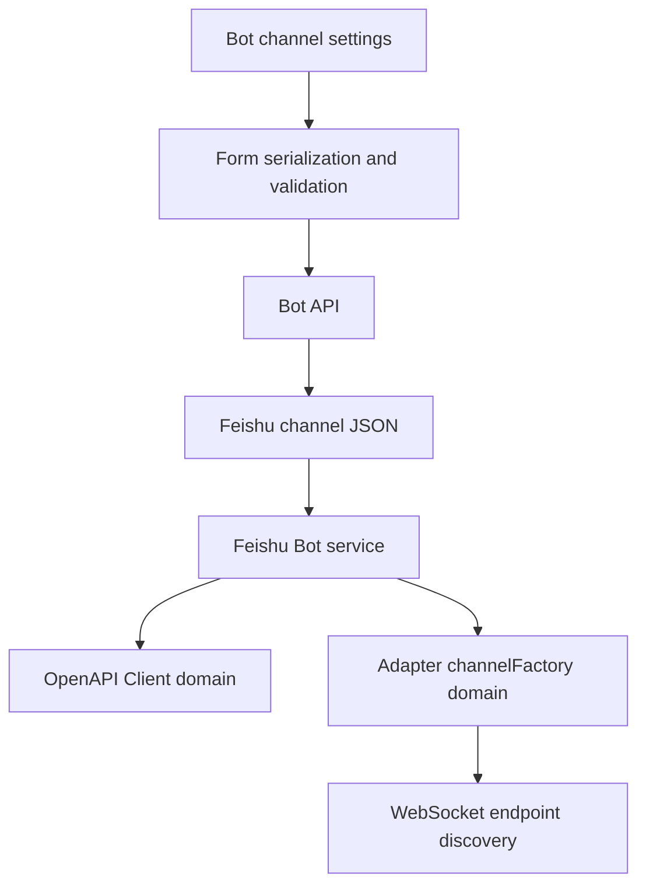
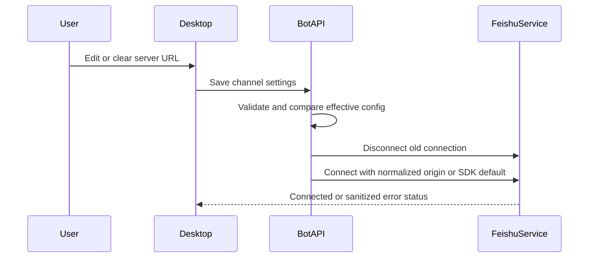

# Feishu Custom Server URL - Plan

## Goal Capsule

- **Objective:** A Feishu Bot can connect to either the official Feishu service or an enterprise private deployment without code or environment changes.
- **Means:** Add one optional per-Bot server URL and pass its normalized origin to every Feishu SDK transport (KTD1, KTD2).
- **Authority:** Product Requirements and session-settled decisions override planning details; official SDK contracts override local assumptions about `domain` behavior.
- **Execution profile:** Three dependency-ordered units covering the channel contract, runtime wiring, and desktop configuration surface.
- **Stop conditions:** Stop if the installed SDK cannot use one custom origin for both REST and WebSocket traffic, or if private deployment requires custom TLS trust that is outside this plan.
- **Tail ownership:** The implementer owns focused tests, full type checks, regression tests, and removal of abandoned experimental code.

---

## Product Contract

### Summary

Add an optional server URL to each Feishu Bot channel.
An empty value keeps the official Feishu endpoint.
A configured value routes both OpenAPI requests and the event WebSocket connection to the same private deployment origin.

### Problem Frame

The current Feishu integration constructs its SDK clients with only an App ID and App Secret.
The SDK therefore uses `https://open.feishu.cn` for every Bot.
Enterprises that run a private Feishu deployment cannot connect their Bots because the endpoint is fixed implicitly.

### Key Decisions

- **One root URL governs REST and WebSocket traffic.** (session-settled: user-approved — chosen over separate REST and WebSocket fields: one private deployment origin is the intended operator contract.) Governs R1, R4, R6.
- **Custom TLS trust and proxy settings remain outside this change.** (session-settled: user-approved — chosen over bundling custom CA, proxy, or TLS-disable controls: the private service must already be trusted by the runtime.) Governs R3, R8.

### Requirements

**Configuration and compatibility**

- R1. Each Feishu Bot channel accepts one optional server URL.
- R2. A missing or blank server URL preserves the SDK's official Feishu default.
- R3. A custom server URL must be an HTTPS origin without embedded credentials, query parameters, a fragment, or a non-root path.
- R4. The configured URL applies to both Feishu OpenAPI calls and the event WebSocket connection.
- R5. The Bot API returns the non-secret server URL so the desktop can display and edit the saved value.
- R6. Saving a changed server URL reconnects the enabled Feishu channel with the new origin.
- R7. Existing Bot records without the field remain valid and require no data migration.

**Scope boundary**

- R8. This feature does not add custom CA certificates, proxy configuration, HTTP endpoints, or disabled TLS verification.

### Acceptance Examples

- AE1. **Covers R1, R3, R4, R5.** Given an enabled Feishu Bot with `https://feishu.internal.example:8443`, when the Bot is saved and connected, then the same normalized origin is stored, displayed, and supplied to REST and WebSocket SDK construction.
- AE2. **Covers R2, R7.** Given an existing Feishu Bot with no server URL, when the application starts, then it connects through the SDK's official Feishu default without rewriting the record.
- AE3. **Covers R3, R8.** Given a URL that uses HTTP, contains credentials, includes a query or fragment, or contains a non-root path, when the user saves the Bot, then validation rejects the value before it reaches connection setup.
- AE4. **Covers R6.** Given a connected Feishu Bot, when its server URL changes from one valid origin to another, then the old connection is disconnected and a new connection is created with the new origin.
- AE5. **Covers R1, R2, R6.** Given a Bot using a private origin, when the user clears the server URL and saves, then the channel reconnects using the official SDK default.

### Scope Boundaries

The active scope is limited to per-Bot endpoint selection, validation, persistence, display, and connection lifecycle behavior.

#### Deferred to Follow-Up Work

- Custom CA or certificate bundle selection for enterprises with a private trust root.
- Per-Bot HTTP or HTTPS proxy controls.
- Independent REST and WebSocket endpoint fields.
- A live endpoint health check before saving credentials.

---

## Planning Contract

### Key Technical Decisions

- KTD1. **Store the product field as `serverUrl` and map it to the SDK's `domain` option.** The product concept is a server origin, while `domain` is the external SDK term. The field remains ordinary channel configuration and is not encrypted.
- KTD2. **Pass one normalized origin to both SDK construction paths.** (session-settled: user-approved — chosen over separate REST and WebSocket origins: the confirmed scope defines one private deployment root.) The direct `lark.Client` receives `domain`, and the adapter's existing `channelFactory` adds the same `domain` when it creates the Lark channel. Implements R4 and follows the installed SDK contract.
- KTD3. **Normalize at the Bot service write boundary and preserve private-network hosts.** One server helper trims the value, parses it as a URL, rejects non-HTTPS schemes, credentials, query strings, fragments, and non-root paths, and returns a canonical origin without a trailing slash. Every service write uses the normalized result before persistence. Ports, IP literals, and internal DNS names remain valid because private deployment is the feature's purpose. Client validation mirrors these rules for immediate feedback, while the server remains authoritative.
- KTD4. **Use the existing channel JSON compatibility path.** `bot_channels.config_json` already stores optional channel fields and encrypts only named secret keys. Adding a non-secret optional property needs no schema migration or credential-redaction change.
- KTD5. **Treat the server URL as an effective connection parameter.** The route reconciliation comparison includes it so changing or clearing the URL follows the same disconnect-and-connect lifecycle as credential changes.

### High-Level Technical Design

### System-Wide Impact

- **Data lifecycle:** The URL is stored in existing encrypted channel JSON as non-secret metadata. Existing rows remain readable because the field is optional.
- **Security boundary:** App credentials will be sent to the configured origin to obtain tokens. HTTPS and URL-component validation reduce accidental credential disclosure, while private hosts remain intentionally allowed.
- **Connection lifecycle:** A URL edit must invalidate the current long connection. Workspace-only binding changes continue to update routing without recreating SDK clients.
- **User experience:** The desktop shows one advanced Feishu field with an official-default hint. Validation errors appear before save and remain enforced by the server API.
- **Agent parity:** This is an administrator configuration capability rather than a task-domain action. No agent tool or MCP surface is added.

### Risks and Dependencies

- The implementation depends on `@larksuiteoapi/node-sdk` accepting a complete custom `domain` string for `Client` and `LarkChannelOptions`. Pin behavioral tests to the installed `1.67.x` contract so a dependency update cannot silently drop one transport path.
- The private deployment must expose Feishu SDK-compatible paths beneath the configured origin, including OpenAPI routes and `/callback/ws/endpoint`; this field selects an origin and does not remap protocol paths. Treat a deployment with a different path contract as incompatible and never fall back to the official service.
- `@larksuite/vercel-chat-adapter` does not expose `domain` directly. Keep its existing `channelFactory` extension point and preserve every current channel option when adding the origin.
- A private deployment may use a certificate chain unavailable to Electron's Node runtime. Surface that failure through the existing sanitized connection status; do not retry against the official endpoint because that would cross the operator's selected trust boundary.
- A private deployment that requires different REST and WebSocket hosts will not work under the confirmed one-origin contract. Report the connection failure without fallback and keep split endpoints as follow-up scope.

### Sources and Research

- `src/server/services/feishu-bot-service.ts` — current direct `lark.Client` construction and adapter `channelFactory` override.
- `src/server/routes/bots.ts` — channel update reconciliation, credential comparison, and public redaction behavior.
- `src/server/services/bot-service.ts` — authoritative channel validation.
- `src/server/models/bot.ts` and `src/client/stores/bot-store.ts` — duplicate server/client channel contracts that must remain aligned.
- `src/client/components/bot-form-utils.ts` and `src/client/components/BotChannelsSection.tsx` — form serialization, validation, dirty state, and channel UI patterns.
- [Official Lark Node SDK README](https://github.com/larksuite/node-sdk#api-call) — documents custom complete-domain support for `Client` and the `domain` option on the Channel API.
- Installed `@larksuiteoapi/node-sdk@1.67.x` types and source — confirm `domain` reaches both OpenAPI URL construction and `/callback/ws/endpoint` discovery.

---

## Implementation Units

### U1. Extend and validate the Feishu channel contract

- **Goal:** Add the optional server URL to the server contract and make the Bot API persist only valid normalized values.
- **Requirements:** R1, R2, R3, R5, R7, R8; AE2, AE3.
- **Dependencies:** None.
- **Files:**
  - Modify `src/server/models/bot.ts`.
  - Modify `src/server/services/bot-service.ts`.
  - Modify `src/server/services/bot-service.test.ts`.
  - Modify `src/server/routes/bots.ts`.
  - Modify `src/server/routes/bots.test.ts`.
- **Approach:**
  1. Add the optional non-secret field to `FeishuChannelConfig` without adding it to `ENCRYPTED_CHANNEL_KEYS`.
  2. Add one authoritative normalizer for KTD3 and call it from the Bot service write path before validation and persistence, rather than relying on route-only cleanup.
  3. Preserve the normalized field through create, update, list, and detail paths. Public Bot responses keep it visible because it is configuration metadata; credential-reveal behavior remains limited to secrets.
  4. Include the field in the Feishu effective-connection comparison per KTD5.
- **Patterns to follow:** Existing `validateCredentials`, `redactChannelSettings`, sentinel-secret resolution, and `effectiveCredentialsChanged` behavior in `src/server/services/bot-service.ts` and `src/server/routes/bots.ts`.
- **Test scenarios:**
  1. Accept an HTTPS hostname with a custom port and store one canonical origin without a trailing slash.
  2. Treat an absent or whitespace-only value as unset and keep legacy Feishu settings valid.
  3. Reject HTTP, malformed URLs, embedded username or password, query strings, fragments, and non-root paths.
  4. Allow private DNS names, IPv4 or IPv6 literals, and custom ports when the scheme is HTTPS.
  5. Return the URL unchanged in redacted Bot responses while continuing to redact `appSecret`, `encryptKey`, and `verificationToken`.
  6. Covers AE4. Updating only the URL on an enabled Feishu channel triggers disconnect and reconnect.
  7. Covers AE5. Clearing a previously configured URL triggers reconnect and leaves the stored field unset.
  8. A direct Bot service channel update and an HTTP route update produce the same canonical stored value, proving the route cannot bypass or diverge from service validation.
- **Verification:** Server contract tests prove canonicalization, rejection, API round-trip behavior, backward compatibility, and reconnection decisions.

### U2. Route all Feishu SDK traffic through the configured origin

- **Goal:** Apply the effective server origin to both outbound OpenAPI calls and inbound event WebSocket setup.
- **Requirements:** R2, R4, R6; AE1, AE2, AE4, AE5.
- **Dependencies:** U1.
- **Files:**
  - Modify `src/server/services/feishu-bot-service.ts`.
  - Modify `src/server/services/feishu-bot-service.test.ts`.
- **Approach:**
  1. Read the normalized URL from the Bot's Feishu channel settings during connection creation.
  2. Supply it as `domain` to the direct `lark.Client` used by CardKit, messages, contacts, and menu handlers.
  3. Capture the same value in the adapter's existing `channelFactory` and pass it to `lark.createLarkChannel` with `includeRawEvent` preserved.
  4. Omit `domain` when no URL is configured so the SDK retains its official default rather than duplicating that default locally.
  5. Keep SDK option construction behind a narrow test seam so tests can inspect both client option sets without opening a real connection.
  6. Keep errors on the existing status and sanitization path; do not log secrets or add endpoint-specific fallbacks.
- **Patterns to follow:** The existing `channelFactory` override and `Connection` lifecycle in `src/server/services/feishu-bot-service.ts`.
- **Test scenarios:**
  1. Covers AE1. A configured origin reaches the direct OpenAPI client options and the Lark channel options with the same value.
  2. Covers AE2. An omitted URL leaves both SDK construction paths on their default-domain behavior.
  3. Preserve `includeRawEvent: true` and existing adapter options when the domain is added.
  4. A connection failure against a custom origin sets the Bot to `error` and retains the existing sanitized error behavior.
  5. A reconnect after a URL edit constructs new SDK clients instead of mutating the old connection.
  6. A private-origin failure never falls back to the official Feishu endpoint.
- **Verification:** Focused service tests prove both transport paths receive one origin and default behavior remains unchanged.

### U3. Add the server URL to the desktop Bot editor

- **Goal:** Let an administrator create, inspect, edit, clear, and validate the Feishu server URL from the existing channel form.
- **Requirements:** R1, R2, R3, R5, R6, R8; AE1, AE3, AE5.
- **Dependencies:** U1.
- **Files:**
  - Modify `src/client/stores/bot-store.ts`.
  - Modify `src/client/components/bot-form-utils.ts`.
  - Modify `src/client/components/bot-form-utils.test.ts`.
  - Modify `src/client/components/BotChannelsSection.tsx`.
  - Modify `src/client/components/BotChannelsSection.test.tsx`.
  - Modify `src/client/components/BotManagementPage.tsx`.
  - Modify `src/client/i18n/en/settings.json`.
  - Modify `src/client/i18n/zh-CN/settings.json`.
- **Approach:**
  1. Mirror the optional field in the client channel type and Bot form state.
  2. Round-trip the value through empty, create, update, disable, re-enable, and edit-mode conversions.
  3. Add a non-secret URL input to the enabled Feishu channel section with localized label, placeholder, and official-default guidance.
  4. Apply the KTD3 rules in client validation and show a localized actionable error before save.
  5. Include the field in channel dirty detection and pending connection action derivation so edit and reconnect controls reflect unsaved endpoint changes.
- **Patterns to follow:** Existing Feishu App ID form fields, `botToForm`, create/update input builders, channel dirty-state comparison, and pending connection hints.
- **Test scenarios:**
  1. A Bot response with a saved server URL populates the edit form and the input displays the exact normalized value.
  2. Creating or updating a Bot sends the trimmed value, while a blank input omits or clears it according to the server contract.
  3. Disabling and re-enabling a Feishu channel does not silently discard its saved URL.
  4. Covers AE3. Invalid scheme and unsafe URL components produce the localized validation error and prevent save.
  5. Editing only the URL marks Feishu as dirty, hides reconnect until save, and shows a pending connect action during reconciliation.
  6. English and Simplified Chinese resources render the new label, placeholder, hint, and validation message.
- **Verification:** Client unit and component tests prove form round trips, validation, dirty state, pending status, and localized rendering.

---

## Verification Contract

| Gate | Applies to | Done signal |
|---|---|---|
| Focused server tests for `bot-service`, `bots` routes, and `feishu-bot-service` | U1, U2 | URL validation, API round trips, reconnect behavior, and dual SDK propagation pass. |
| Focused client tests for Bot form utilities and channel UI | U3 | Form state, validation, localization, and dirty/pending behavior pass. |
| `npm run typecheck` | U1-U3 | Server and client channel types agree and SDK option usage compiles. |
| `npm run test:server` | U1, U2 | The complete server suite reports no Bot or Feishu regressions. |
| `npm run test:client` | U3 | The complete client suite reports no settings regressions. |
| Manual desktop smoke check | U1-U3 | A blank URL preserves official behavior; changing to a reachable private HTTPS origin reconnects and reports connected; an unreachable origin reports a sanitized error. |

---

## Definition of Done

- R1-R8 are implemented without expanding into custom TLS, proxy, or split-endpoint controls.
- U1 is complete when valid URLs persist canonically, invalid URLs fail closed, legacy records remain valid, and URL changes trigger connection reconciliation.
- U2 is complete when REST and WebSocket SDK paths receive the same configured origin and omit `domain` for official-default Bots.
- U3 is complete when administrators can round-trip, clear, and validate the value in both supported languages with correct dirty and pending states.
- Focused tests, full server and client suites, and type checks pass.
- Public responses expose the non-secret URL while all existing secrets remain redacted and encrypted at rest.
- Connection errors continue through the existing sanitizer and do not expose App credentials or sensitive URL details.
- Documentation and code contain no abandoned factories, duplicate URL sources, or experimental fallback paths from unsuccessful approaches.
