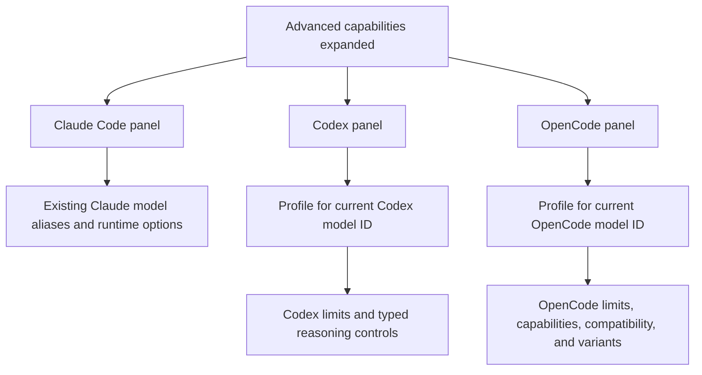
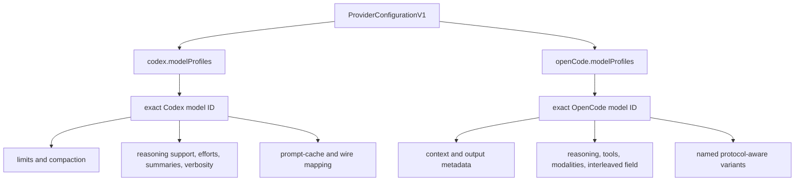
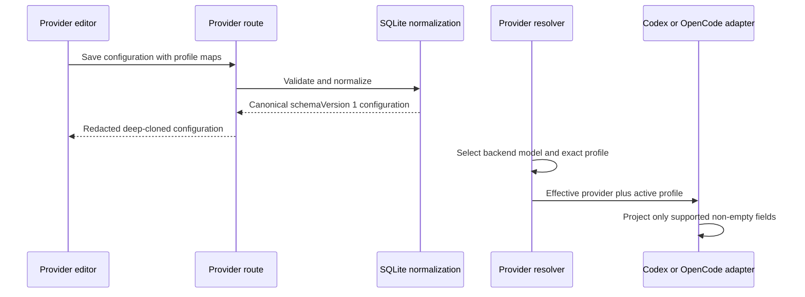

# Provider Backend Model Capabilities - Plan

## Goal Capsule

- **Objective:** Users can describe the real limits and reasoning behavior of third-party models for each Agent backend so Codex and OpenCode operate with accurate model metadata.
- **Means:** Replace the Claude-only advanced area with stacked backend panels and implicit per-model capability profiles. (KTD1-KTD3)
- **Product authority:** Provider settings own third-party endpoint and model declarations. Native account controls and per-session preferences remain owned by their Agent backend.
- **Execution profile:** Code implementation across the Provider domain model, presets, runtime adapters, API projection, and settings UI.
- **Stop conditions:** Stop if the pinned Codex or OpenCode runtime rejects a planned typed field, or if preserving legacy Provider behavior requires a destructive configuration migration. Record the observed contract before changing the plan.
- **Tail ownership:** The implementer owns focused tests, full server and client suites, type checking, localized copy, and removal of obsolete legacy-field code.

---

## Product Contract

### Summary

Expand Provider advanced capabilities into stacked Claude Code, Codex, and OpenCode panels. Codex and OpenCode receive independent profiles keyed by model ID, with editable preset defaults and backend-native controls.

### Problem Frame

The Provider editor currently exposes advanced settings only for Claude Code even though a Provider can serve Claude Code, Codex, and OpenCode. Codex and OpenCode therefore receive endpoint and model routing without the model metadata needed to represent non-default context limits or provider-specific reasoning behavior.

This is visible with models such as BigModel `glm-5.3`, whose documented context window differs from the fallback assumptions a backend may make. An endpoint can be reachable and protocol-compatible while the runtime still has an inaccurate view of its model.

### Key Decisions

- **Separate backend panels.** (session-settled: user-directed — chosen over shared model capabilities: backend semantics stay explicit even when values are duplicated.) Governs R1, R4, R10, R14.
- **Stack all panels in one advanced area.** (session-settled: user-directed — chosen over tabs or accordions: users can compare every configured backend without changing views.) Governs R1.
- **Use a balanced typed surface.** (session-settled: user-directed — chosen over minimal fields or raw configuration: common capabilities are editable without turning Provider settings into a backend config editor.) Governs R7, R10-R17, R21.
- **Keep implicit per-model profiles.** (session-settled: user-directed — chosen over a profile manager or active-profile-only storage: changing a model restores its settings without adding another management surface.) Governs R4-R6.
- **Seed editable preset defaults and omit unknowns.** (session-settled: user-directed — chosen over manual-only, locked, required, or guessed values: known Providers start correctly while custom Providers retain backend defaults.) Governs R7-R9.
- **Use OpenCode-native variants.** (session-settled: user-directed — chosen over reusing Codex effort levels: OpenCode variant names and overlays remain model-specific.) Governs R16.

### Interface Shape

### Actors

- A1. **Provider administrator:** Configures endpoints, backend models, presets, and advanced capability profiles.
- A2. **Codex backend:** Consumes the active Codex model profile when a session uses the Provider.
- A3. **OpenCode backend:** Consumes the active OpenCode model profile when building its provider model catalog.
- A4. **Claude Code backend:** Continues consuming its existing Provider-specific model aliases and runtime options.

### Requirements

**Advanced interface**

- R1. The expanded advanced area presents stacked Claude Code, Codex, and OpenCode panels in that order.
- R2. Each backend panel identifies the model ID whose settings it edits and distinguishes model limits, declared capabilities, and runtime behavior where those groups apply.
- R3. The Claude Code panel preserves the existing model aliases, subagent model, effort, and custom environment behavior without forcing them into the Codex or OpenCode profile model.

**Profile lifecycle**

- R4. Codex and OpenCode capability profiles are keyed by exact model ID within their own backend namespace and never synchronize implicitly across backends.
- R5. Changing a backend model ID loads its existing profile or presents an empty draft profile without deleting profiles for previously selected models.
- R6. A backend with no model ID has no active model profile and communicates that a model must be selected before capability fields can be edited.

**Defaults and unknown values**

- R7. A known Provider preset may seed capability profiles for its known backend model IDs, and every seeded value remains user-editable.
- R8. An unset capability is omitted from generated backend configuration so the backend or upstream provider retains its default behavior.
- R9. The application does not invent fallback capability values for custom Providers or unknown model IDs.

**Codex panel**

- R10. A Codex model profile supports an optional positive context-window token count that becomes the active model context window for Codex sessions using that Provider.
- R11. A Codex model profile declares whether reasoning is required, supported, unsupported, or unknown.
- R12. A Codex model profile declares only the supported Codex reasoning effort levels for that model and retains any required mapping to vendor wire values.
- R13. A Codex model profile supports documented model reasoning-summary behavior, verbosity behavior, auto-compaction threshold, and prompt-cache routing where the selected Provider can honor them.

**OpenCode panel**

- R14. An OpenCode model profile supports optional positive context-window and maximum-output token counts.
- R15. An OpenCode model profile declares reasoning and tool support plus supported text and image input and text output modalities.
- R16. An OpenCode model profile supports named model-specific variants with typed reasoning effort, reasoning summary, or token-budget overlays instead of assuming Codex effort names.
- R17. An OpenCode model profile supports a reasoning-field compatibility value for OpenAI-compatible models that stream reasoning outside the standard field.

**Validation and runtime projection**

- R18. Token limits and thresholds accept only positive integers, and an output limit cannot exceed a known context limit in the same profile.
- R19. Unsupported combinations are rejected or disabled with a backend-specific explanation before the Provider is saved.
- R20. Saving, loading, applying a preset, and editing an unrelated Provider field preserve every inactive Codex and OpenCode model profile.
- R21. Only fields supported by the target backend's documented configuration contract are projected into that backend. Stored metadata that cannot affect that backend is not presented as active backend behavior.
- R22. Legacy Providers load without manual migration. Existing Codex capability values become canonical model profiles, while Providers without such values acquire empty profile collections.

### Key Flows

- F1. Configure a known preset
  - **Trigger:** A1 applies a Provider preset with known model capabilities.
  - **Actors:** A1, A2, A3
  - **Steps:** The preset selects its backend model IDs, seeds matching editable profiles, and shows them in the stacked panels.
  - **Outcome:** Saving the Provider projects each active profile only to its matching backend.
  - **Covers:** R1, R4, R7, R10-R17, R21.
- F2. Switch models within one backend
  - **Trigger:** A1 changes the model ID in the Codex or OpenCode model field.
  - **Actors:** A1
  - **Steps:** The panel resolves the profile by the new exact model ID and displays either saved values or an empty draft.
  - **Outcome:** Switching back restores the previous model's values without changing the other backend.
  - **Covers:** R4-R6, R20.
- F3. Configure an unknown custom model
  - **Trigger:** A1 enters a model ID that no preset recognizes.
  - **Actors:** A1, A2, A3
  - **Steps:** The relevant panel starts unset, validates only values the user supplies, and omits the remaining fields.
  - **Outcome:** The backend uses its own defaults for every unknown capability.
  - **Covers:** R8, R9, R18, R21.

### Acceptance Examples

- AE1. **Covers R4, R7, R10, R14.** Given the BigModel preset selects `glm-5.3` for Codex and OpenCode, when the preset seeds a `1,048,576` context window for each backend, then editing the Codex value does not alter the OpenCode value.
- AE2. **Covers R5, R20.** Given Codex has saved profiles for `glm-5.3` and another model, when the user switches between those exact IDs, then each profile returns with its prior values.
- AE3. **Covers R8, R9, R21.** Given a custom model has no context limit, when the Provider is saved, then no guessed context value is generated and the backend default remains authoritative.
- AE4. **Covers R16.** Given an OpenCode model defines `fast` and `deep` variants, when OpenCode builds its model catalog, then those names and their typed overlays are available without creating fixed Codex effort choices.
- AE5. **Covers R18, R19.** Given an OpenCode profile has a `32,768` context limit, when the user enters a `65,536` output limit, then saving is blocked with an explanation tied to the OpenCode profile.
- AE6. **Covers R22.** Given a Provider was saved before model profiles existed, when it is opened, then its endpoints, models, Claude settings, and existing Codex capabilities remain intact.

### Scope Boundaries

**In scope**

- Typed Codex and OpenCode capability profiles, preset defaults, validation, runtime projection, API parity, and localized settings UI.
- Characterization and migration coverage for the current Provider configuration shape.

**Deferred to follow-up work**

- Exhaustive transport controls such as retry counts, stream timeouts, and WebSocket options.
- Remote model discovery and automatic capability refresh.
- A shared server/client schema package if the duplicated Provider types become a broader maintenance problem.

**Outside this product's identity**

- Raw Codex TOML, OpenCode JSON, arbitrary request-body, header, or environment editors.
- A separate add, duplicate, delete, or browse interface for model profiles.
- Implicit synchronization between Codex and OpenCode profiles, including when both use the same upstream model ID.
- Native OpenAI account model controls and per-session user preferences.

### Dependencies and Assumptions

- The runtime contract is the repository-pinned `@openai/codex` 0.149.0 and `@opencode-ai/sdk` 1.18.4 behavior, not a newer website schema alone.
- Provider presets are versioned application data rather than a live guarantee from the vendor.
- Model IDs are case-sensitive profile keys because both backends treat model identity as an exact string.
- BigModel documents `glm-5.3` as its Codex model slug. Bracketed names such as `glm-5.3[1m]` remain OpenCode/Claude compatibility aliases and are not advertised as native Codex model IDs.

### Sources and Research

- Existing Provider editor and configuration contract: `src/client/components/ProviderSection.tsx`, `src/client/stores/provider-store.ts`, `src/server/models/provider.ts`.
- Existing persistence and public API projection: `src/server/storage/sqlite-store.ts`, `src/server/routes/providers.ts`.
- Existing runtime projection points: `src/server/services/provider-resolver.ts`, `src/server/services/codex-adapter.ts`, `src/server/services/opencode-adapter.ts`, `src/server/services/opencode-model-fallback.ts`.
- Installed OpenCode configuration contracts: `node_modules/@opencode-ai/sdk/dist/gen/types.gen.d.ts` and `node_modules/@opencode-ai/sdk/dist/v2/gen/types.gen.d.ts`.
- Existing routing decisions and scope boundaries: `docs/plans/2026-08-23-1548-feat-provider-multi-protocol-routing-plan.md`.
- Server test isolation convention: `docs/solutions/conventions/use-isolated-test-database-for-comate.md`.
- Plan lifecycle convention: `docs/solutions/conventions/commit-plan-and-brainstorm-files-with-code-changes.md`.
- [OpenAI Codex configuration reference](https://developers.openai.com/codex/config-reference/).
- [OpenCode model configuration and variants](https://opencode.ai/docs/models).
- [OpenCode custom-provider limits](https://opencode.ai/docs/providers#custom).
- [BigModel Codex configuration](https://docs.bigmodel.cn/cn/coding-plan/tool/codex#%E6%96%B9%E5%BC%8F%E4%B8%80%EF%BC%9A%E6%89%8B%E5%8A%A8%E9%85%8D%E7%BD%AE).
- [BigModel OpenCode configuration](https://docs.bigmodel.cn/cn/coding-plan/tool/opencode).

---

## Planning Contract

### Key Technical Decisions

- KTD1. **Keep Provider configuration at schema version 1 and add optional backend profile maps.** The change is additive and the existing `options_json` column can store it without a database migration. `codex.modelProfiles` and `openCode.modelProfiles` become the canonical profile collections. Normalization must use prototype-safe map construction and reject dangerous object keys. Governs R4, R20, R22.
- KTD2. **Resolve profiles by exact selected model ID and materialize them only after a capability edit or preset application.** Model-field keystrokes may show an empty draft but must not accumulate empty persisted keys. (session-settled: user-directed — chosen over an explicit profile manager: model switching stays implicit and preserves inactive profiles.) Governs R4-R6, R20.
- KTD3. **Use the Provider resolver as the active-profile boundary.** `resolveProviderForAgent` selects the backend model and attaches only that backend's matching profile to the effective runtime configuration. Adapters do not inspect the complete persisted profile map. Governs R4, R8, R20, R21.
- KTD4. **Canonicalize legacy Codex capabilities during normalization.** The normalizer accepts `promptCacheRouting`, `thinking`, `effortByModel`, and `effortWireMappingByModel`. It folds them into profiles for the selected Codex model and every model named by a legacy map, then emits only `modelProfiles`. This avoids dual authority while preserving configured behavior. Governs R12, R13, R22.
- KTD5. **Project Codex profile fields through thread configuration and keep session effort session-owned.** The adapter maps known profile values to `model_context_window`, `model_auto_compact_token_limit`, `model_reasoning_summary`, `model_supports_reasoning_summaries`, and `model_verbosity`. The selected session effort still overrides the Provider-supported effort catalog. Governs R10-R13, R21.
- KTD6. **Target and characterize the pinned OpenCode 1.18.4 executable contract.** The package's default generated config type proves `reasoning`, `tool_call`, `modalities`, and paired `limit`, while its separate v2 type also describes `interleaved` and `variants`. Add a focused `OPENCODE_CONFIG_CONTENT` characterization gate before exposing the latter two fields. If the pinned executable rejects them, stop and report that R16-R17 require a dependency decision instead of silently storing inactive controls. A lone context value remains local metadata because the proven `limit` contract requires output too. Governs R14-R19, R21.
- KTD7. **Map OpenCode variants according to the selected OpenCode protocol.** OpenAI-compatible profiles expose typed reasoning effort and summary overlays. Anthropic profiles expose a positive thinking token budget. Unsupported controls are disabled and omitted rather than serialized under guessed option names. (session-settled: user-directed — chosen over Codex effort reuse: variants retain OpenCode and provider-native semantics.) Governs R16, R19, R21.
- KTD8. **Refresh known presets through ordinary editable profile data.** Increment affected preset versions. Migrate Kimi's existing Codex capability maps into its model profile. Update BigModel to Responses at `https://open.bigmodel.cn/api/v1`, select `glm-5.3`, and seed only fields supported by its published metadata. Do not invent an OpenCode maximum-output limit. Governs R7-R9, R20.
- KTD9. **Preserve Provider API parity without adding agent mutation tools.** The redacted Provider API returns deep-cloned profiles and never returns credentials. Existing desktop-authenticated Provider routes remain the only mutation surface because session capability tokens must not administer Providers. Governs R20, R21.

### Canonical Profile Shape

The persisted representation uses optional fields so absence retains backend defaults.

The Codex profile owns the existing thinking, prompt-cache, supported-effort, and wire-mapping values for one model. It also owns optional context window, auto-compaction threshold, reasoning-summary mode, reasoning-summary support, and verbosity.

The OpenCode profile owns optional context and output limits, optional capability booleans, optional modality lists, an optional interleaved reasoning field, and a map of named typed variants. Variant names are non-empty exact keys. Empty profiles and empty variants are removed during normalization.

### Validation Matrix

| Area | Accepted values | Rejected or disabled | Runtime behavior when unset |
|---|---|---|---|
| Token counts | Positive safe integers | Zero, negatives, decimals, overflow | Omit field |
| OpenCode limits | Context alone as metadata, or context plus output | Output greater than known context; output without context | Omit `limit` unless both exist |
| Codex efforts | Unique values from the app's Codex effort enum | Empty wire values; mappings for unsupported efforts | Session/backend default |
| Codex summaries | Documented summary enum plus optional support flag | Summary mode when reasoning is unsupported | Omit field |
| OpenCode modalities | Supported typed values only | Empty explicit list; unsupported output modality | Omit field |
| OpenCode variants | Unique non-empty prototype-safe names with at least one characterized overlay | Empty variants; dangerous keys; protocol-incompatible or unproven overlays | Omit variant |
| Reasoning field | `reasoning`, `reasoning_content`, or `reasoning_details` | Any arbitrary field name | Omit `interleaved` |

### High-Level Runtime Flow

### Sequencing and Implementation Constraints

1. Land the canonical model and normalization before changing presets, resolver output, adapters, or UI.
2. Preserve legacy Codex behavior with characterization tests before deleting reads of the legacy fields.
3. Make resolver and adapter projections independently testable before wiring the advanced panels.
4. Keep bracket-suffix fallback behavior in OpenCode. Register identical profile metadata for both the configured alias and fallback base model, while resolving the profile from the exact configured ID first.
5. Keep all server storage tests on the isolated test database bootstrap required by repository conventions.
6. Do not add a second source of truth in component-local state. The Provider form draft remains the complete editable configuration.

### Deferred Implementation Notes

- Exact helper and component names may change after the implementer measures whether extracting `ProviderAdvancedCapabilities` materially reduces `ProviderSection.tsx` complexity.
- If Codex 0.149.0 ignores any documented thread-level override, retain the field in the profile only if another active application behavior consumes it. Otherwise remove it from the UI and update R21 evidence before proceeding.
- Treat a change to the pinned OpenCode config type as a dependency upgrade and separate follow-up, not an opportunity to implement the current website's newer schema in this feature.

### System-Wide Impact

- **Data lifecycle:** Normalization changes the canonical shape of every Provider carrying legacy Codex capability fields, but does not change database columns or credentials.
- **API contract:** Provider list, detail, create, update, and preset responses gain nested optional profile maps. Credential redaction remains unchanged.
- **Session behavior:** The resolver and adapters consume only the selected profile. Inactive profiles do not enter session configuration or prompt context.
- **Context reporting:** Codex continues using runtime token-usage metadata. OpenCode may use the active profile context window as a fallback when its event stream does not report a maximum.
- **Security:** Profiles contain declarative metadata only. Arbitrary headers, environment values, and request bodies stay out of scope.
- **Agent parity:** Trusted UI/API users can read and mutate the same profile fields. Session agents receive no new Provider-administration capability.

### Risks and Mitigations

- **Pinned runtime drift:** Current OpenCode documentation differs from the installed 1.18.4 type contract. Bind adapter tests to the pinned contract and defer dependency upgrades.
- **Split OpenCode type surfaces:** The installed package's default and v2 declarations disagree on advanced model fields. Characterize the executable config path before rendering those controls, and stop rather than claiming unsupported behavior.
- **Silent legacy regression:** Moving Provider-wide Codex fields into per-model profiles can change routing if a model key is missed. Normalize the union of the selected model and every legacy map key, then cover each source with characterization tests.
- **False capability claims:** Presets can become stale. Version them, cite vendor documentation in tests or comments, and leave undocumented values unset.
- **Profile loss during editing:** Model switching and preset replacement can accidentally discard inactive entries. Update profile maps immutably and exercise the complete form round trip.
- **Oversized UI:** Variants and capability fields can overwhelm one panel. Use clear subgroups, compact optional controls, and accessible explanations rather than raw configuration text areas.

---

## Implementation Units

### U1. Canonical backend model-profile domain

- **Goal:** Add the typed canonical profile collections, validation, legacy normalization, persistence, and redacted API projection.
- **Requirements:** R4-R6, R8, R18-R22; AE2, AE3, AE5, AE6.
- **Dependencies:** None.
- **Files:** `src/server/models/provider.ts`, `src/server/storage/sqlite-store.ts`, `src/server/storage/sqlite-store.test.ts`, `src/server/routes/providers.ts`, `src/server/routes/providers.test.ts`, `src/client/stores/provider-store.ts`.
- **Approach:**
  1. Define backend-specific profile types and optional `modelProfiles` maps under the existing Codex and OpenCode namespaces per KTD1.
  2. Extend normalization for exact keys, optional fields, empty-value pruning, and the validation matrix.
  3. Construct model and variant maps without inheriting user-controlled prototypes, and reject `__proto__`, `prototype`, and `constructor` keys.
  4. Fold legacy Codex fields into the canonical maps per KTD4 and stop emitting the legacy fields.
  5. Deep-clone profile maps through the public API and mirror the contract in the client store without exposing secrets.
- **Patterns to follow:** Existing `normalizeProviderConfiguration`, effort-map normalizers, `publicConfiguration`, and structured-clone boundaries.
- **Test scenarios:**
  - Covers AE6. Load a legacy Provider with selected-model, effort-map, wire-map, thinking, and prompt-cache values; verify one canonical map preserves all behavior.
  - Normalize multiple exact model keys, including keys that differ only by case, and verify they remain independent.
  - Submit dangerous model and variant keys and verify validation rejects them without mutating an object prototype.
  - Save a profile with all supported optional fields and verify a database round trip preserves it.
  - Covers AE3. Save empty and partially populated profiles; verify empty fields and empty profile entries are omitted without guessed values.
  - Covers AE5. Reject non-positive, fractional, unsafe, and inconsistent token values with backend-specific errors.
  - Return public Provider data and verify nested maps are cloned while the authentication token remains absent.
- **Verification:** Canonical configurations round-trip through storage and API responses, legacy capability inputs preserve behavior, and invalid combinations fail before persistence.

### U2. Preset and resolver profile selection

- **Goal:** Seed accurate editable profiles for known Providers and make the resolver carry only the selected backend profile.
- **Requirements:** R4, R7-R9, R12, R20-R22; F1, AE1, AE6.
- **Dependencies:** U1.
- **Files:** `src/server/services/provider-presets.ts`, `src/server/services/provider-presets.test.ts`, `src/server/services/provider-resolver.ts`, `src/server/services/provider-resolver.test.ts`, `src/server/routes/providers.test.ts`.
- **Approach:**
  1. Migrate Kimi's current Codex capability declaration into its model profile and increment its preset version.
  2. Update BigModel per KTD8, including separate Codex and OpenCode profiles for exact `glm-5.3` keys.
  3. Extend effective Provider resolution with a backend-specific active profile while keeping redacted availability output free of the full profile payload.
  4. Leave custom and undocumented capabilities unset.
- **Patterns to follow:** Immutable preset definitions, `applyProviderPreset` cloning, `providerVendorFromProvenance`, and current availability redaction.
- **Test scenarios:**
  - Covers F1 / AE1. Apply BigModel and verify Responses `/api/v1`, exact `glm-5.3` models, independent `1,048,576` context values, and no invented OpenCode output limit.
  - Apply Kimi and verify its supported Codex efforts and wire mappings are preserved in the canonical profile.
  - Resolve Codex and OpenCode for the same model ID and verify each receives only its own backend profile.
  - Resolve a custom model with no profile and verify the backend remains available with no active capability fields.
  - Redact availability and verify active profiles and credentials are not included in the public availability summary.
- **Verification:** Preset fixtures match documented endpoint and model metadata, and resolver tests prove exact backend-scoped selection without implicit synchronization.

### U3. Codex runtime projection

- **Goal:** Apply the active Codex profile to direct Responses sessions and existing routed Chat Completions behavior.
- **Requirements:** R8, R10-R13, R18, R19, R21; AE3.
- **Dependencies:** U1, U2.
- **Files:** `src/server/services/codex-adapter.ts`, `src/server/services/codex-adapter.test.ts`, `src/server/services/chat-service.ts`, `src/server/services/chat-service.test.ts`, `src/server/services/provider-route-http.ts`, `src/server/services/provider-route-http.test.ts`.
- **Approach:**
  1. Extend the Codex provider override with the active profile selected by the resolver.
  2. Project documented Codex root configuration fields per KTD5 and omit absent values.
  3. Read supported efforts, wire mappings, thinking support, and prompt-cache routing from the active profile in both direct and routed paths.
  4. Preserve per-session reasoning effort precedence and the existing hosted-tool restrictions.
- **Patterns to follow:** `codexThreadConfig`, session option merging, current routed-provider registration, and token-usage context reporting.
- **Test scenarios:**
  - Generate a Codex thread config with every supported profile field and verify the documented keys and values.
  - Covers AE3. Generate a config from an empty profile and verify no capability override keys appear.
  - Start a session with a supported effort and verify the session selection takes precedence without mutating the Provider profile.
  - Route a Chat Completions model and verify prompt-cache, thinking, supported-effort, and wire-value behavior comes from the selected profile.
  - Select a different Codex model and verify no inactive model capability enters the request path.
- **Verification:** Direct and routed Codex paths consume one active profile, preserve session-level choices, and produce no unknown configuration fields.

### U4. OpenCode model catalog projection

- **Goal:** Generate pinned-version OpenCode model metadata, protocol-aware variants, suffix aliases, and context-usage fallback from the active profile.
- **Requirements:** R8, R14-R19, R21; AE3-AE5.
- **Dependencies:** U1, U2.
- **Files:** `src/server/services/opencode-adapter.ts`, `src/server/services/opencode-adapter.test.ts`, `src/server/services/opencode-model-fallback.ts`, `src/server/services/opencode-model-fallback.test.ts`, `src/server/services/chat-service.test.ts`.
- **Approach:**
  1. Add a focused executable-config characterization for the advanced fields identified in KTD6 before wiring them into the adapter or UI.
  2. Expand `buildServeConfig` model entries using only the characterized pinned contract.
  3. Apply protocol-aware variant overlays per KTD7 and omit incompatible options.
  4. Copy identical active metadata onto the configured model alias and its fallback base entry, but keep profile lookup keyed by the exact configured model ID.
  5. Use the active context value as a local usage fallback when OpenCode does not report a maximum.
- **Patterns to follow:** `expandModelAliases`, `decideModelFallback`, existing serve-config construction, and event-derived context accounting.
- **Test scenarios:**
  - Build a complete model entry and verify reasoning, tools, modalities, interleaved field, paired limits, and variants match the pinned OpenCode shape.
  - Start the pinned OpenCode executable with an isolated generated config and verify it accepts and returns the planned advanced model fields; fail the implementation gate if it drops or rejects them.
  - Covers AE3. Supply no profile and verify the model entry contains only its name.
  - Supply context without output and verify local context reporting uses it while generated OpenCode `limit` remains absent.
  - Covers AE4. Generate OpenAI reasoning-effort/summary variants and Anthropic token-budget variants without cross-protocol fields.
  - Configure `glm-5.3[1m]` and verify both alias entries receive identical metadata while the retry still strips only the wire model ID.
  - Reject or omit an invalid variant and verify no arbitrary unknown field reaches the serve config.
- **Verification:** Serve-config snapshots conform to SDK 1.18.4, fallback aliases remain operational, and every omitted value leaves OpenCode defaults intact.

### U5. Stacked advanced-capability editor

- **Goal:** Deliver the confirmed stacked Claude Code, Codex, and OpenCode editing experience with implicit model switching and accessible validation.
- **Requirements:** R1-R20; F1-F3; AE1-AE5.
- **Dependencies:** U1, U2.
- **Files:** `src/client/components/ProviderSection.tsx`, `src/client/components/ProviderSection.test.tsx`, `src/client/i18n/en/settings.json`, `src/client/i18n/zh-CN/settings.json`, and optionally `src/client/components/ProviderAdvancedCapabilities.tsx` with a colocated test if extraction improves cohesion.
- **Approach:**
  1. Replace the single Claude fieldset with three stacked panels and preserve the existing Claude controls.
  2. Resolve each draft panel from its backend model field per KTD2. Disable profile controls when the model ID is empty.
  3. Group Codex and OpenCode inputs by limits, capabilities, and runtime behavior. Use optional controls whose cleared state removes the field.
  4. Render variants as repeatable named typed rows without introducing a separate profile manager or raw JSON editor.
  5. Surface protocol-specific disabled states and validation errors before the existing save/health-check flow.
- **Patterns to follow:** Current immutable `updateConfiguration`, preset dirty-confirmation flow, fieldset styling, error summary focus, and settings i18n conventions.
- **Test scenarios:**
  - Covers R1 / AE1. Expand Advanced and verify the three panels render in order with independent BigModel values.
  - Covers F2 / AE2. Edit model A, switch to model B, switch back, and verify model A's draft values remain intact.
  - Type an unknown model ID without editing capability fields and verify saving does not persist an empty profile key.
  - Clear the model field and verify controls disable without deleting the previous profile.
  - Add, edit, and remove OpenCode variants; verify names are unique and protocol-incompatible controls are disabled with explanations.
  - Covers AE5. Enter inconsistent limits and verify the error summary blocks save and identifies the OpenCode model.
  - Apply a preset over dirty profile data, cancel once, then confirm; verify the existing confirmation semantics and complete profile replacement.
  - Edit an unrelated endpoint or Provider name and verify all inactive profiles survive the form round trip.
  - Render the stacked panels at a narrow viewport and verify field groups remain readable, keyboard reachable, and free of horizontal overflow.
- **Verification:** Keyboard-accessible localized panels satisfy the confirmed layout, profile switching is lossless, and UI validation matches server normalization.

### U6. Cross-layer regression and documentation alignment

- **Goal:** Prove the complete Provider-to-runtime flow and keep durable product terminology aligned with the shipped behavior.
- **Requirements:** R7-R22; F1-F3; AE1-AE6.
- **Dependencies:** U1-U5.
- **Files:** `src/server/storage/migration.test.ts`, `src/server/services/chat-service.test.ts`, `src/client/components/ProviderSection.test.tsx`, `CONCEPTS.md`, `docs/plans/2026-08-25-2006-feat-provider-backend-model-capabilities-plan.md`.
- **Approach:**
  1. Add cross-layer cases only where unit tests cannot prove preservation from persisted Provider through resolver to adapter config.
  2. Verify the legacy normalization path against a real isolated database fixture without adding a schema migration.
  3. Keep the backend model capability profile term in `CONCEPTS.md` consistent with the canonical implementation.
  4. Commit the plan and concept update with the implementation per repository convention.
- **Patterns to follow:** Isolated database setup, existing Provider route/chat-service integration fixtures, and repository solution-document conventions.
- **Test scenarios:**
  - Covers AE6. Load a pre-profile database fixture and run a Codex resolution to verify legacy capabilities reach the adapter after canonicalization.
  - Covers F1. Apply BigModel, persist it, reload it through the public API, and verify Codex and OpenCode runtime projections use their independent profiles.
  - Covers F3. Persist a custom Provider with partial metadata and verify unknown fields remain absent end to end.
  - Run the complete Provider editor interaction suite after localization and component extraction changes.
- **Verification:** Cross-layer tests cover migration, preset, persistence, API, resolver, and adapter seams without duplicate assertions that belong in earlier units.

---

## Verification Contract

| Gate | Command | Coverage | Required outcome |
|---|---|---|---|
| Server focused | `npx tsx --test` with the changed Provider storage, route, resolver, preset, Codex, OpenCode, and chat-service test files | U1-U4, U6 | All focused tests pass using isolated test databases where storage is involved |
| Client focused | `npx vitest run --project jsdom src/client/components/ProviderSection.test.tsx` plus any extracted component test | U5, U6 | Profile switching, validation, preset, and accessibility interactions pass |
| Type safety | `npm run typecheck` | U1-U6 | No server/client contract drift or pinned SDK type errors |
| Server regression | `npm run test:server` | U1-U4, U6 | Full server suite passes |
| Client regression | `npm run test:client` | U5, U6 | Full client suite passes |
| Manual settings smoke | Open an existing legacy Provider, BigModel preset, and custom Provider in the desktop settings UI | U2, U5, U6 | Panels, disabled states, localized explanations, save, reload, and inactive-profile retention match the Product Contract |

Do not call the feature verified from type checking or snapshots alone. The implementation must include behavioral assertions for omitted fields, legacy canonicalization, exact model-key switching, protocol-aware variants, and end-to-end active-profile selection.

---

## Definition of Done

- Every R-ID has an implementing U-ID and at least one behavioral verification path.
- `ProviderConfigurationV1` has one canonical authority for Codex and OpenCode model profiles, while legacy Codex inputs normalize without manual migration.
- BigModel uses the documented Responses endpoint and exact Codex model slug. No preset contains an undocumented output limit.
- Codex and OpenCode adapters project only fields supported by their pinned runtime contracts and only from the selected backend profile.
- The Provider editor renders stacked localized panels, preserves inactive profiles, avoids empty-profile accumulation, and blocks invalid combinations accessibly.
- Public Provider responses expose editable profiles without credentials or mutable shared references.
- Focused tests, full server and client suites, and type checking pass.
- `CONCEPTS.md` and this plan match the implemented canonical terminology and constraints.
- The final diff contains no obsolete dual-authority legacy reads, abandoned experiments, unused controls, or unrelated cleanup.
