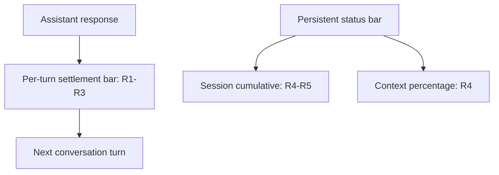
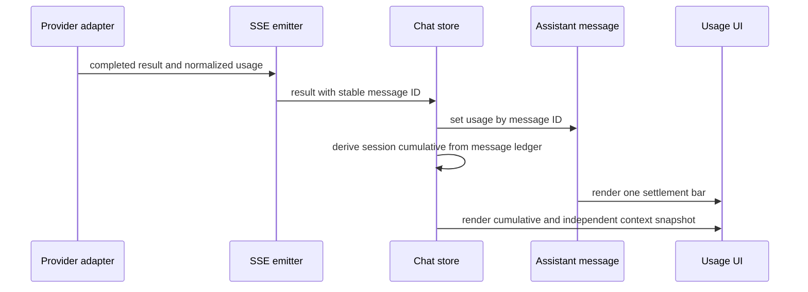
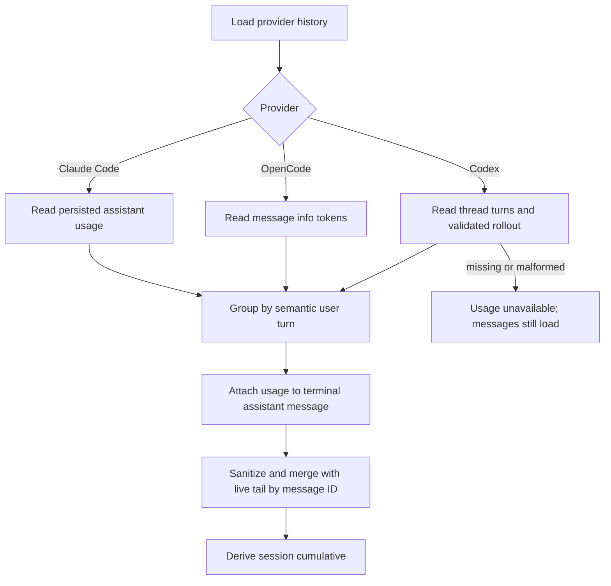
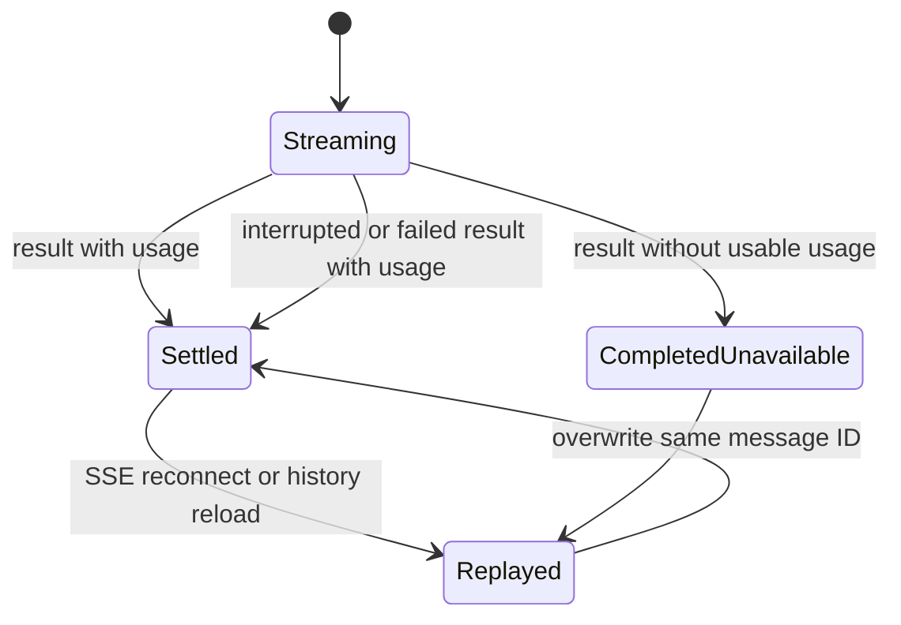
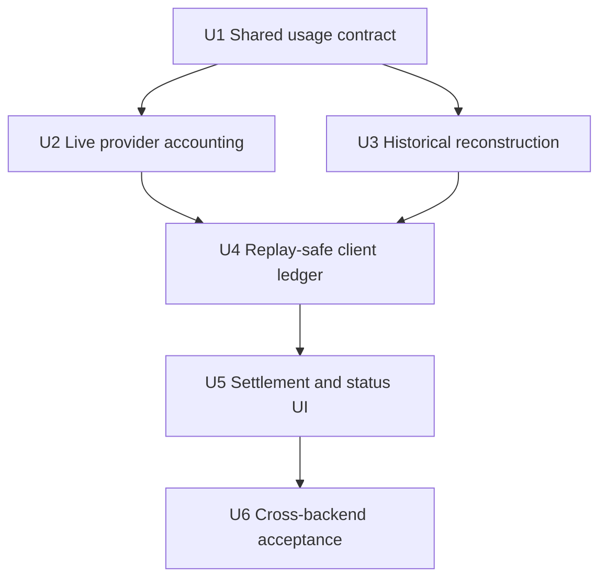

# Conversation Token Usage - Plan

## Goal Capsule

- **Objective:** 用户无需安装额外软件，即可在 Claude Code、OpenCode 和 Codex 对话中了解每轮及整段会话的 Token 消耗。
- **Means:** 通过消息级用量账本统一三种后端的实时结果与历史记录，并由同一账本驱动回复结算条和会话状态栏（KTD1-KTD6）。
- **Product authority:** Product Contract 定义用户可见语义；Planning Contract 定义数据采集、消息归属、降级和验证机制。
- **Open blockers:** 无。
- **Execution profile:** 按 U1-U6 的依赖顺序实施；每个行为单元必须先建立针对其数据边界的回归覆盖。
- **Stop conditions:** 任一后端无法稳定绑定用量与对应回复、SSE 重放会重复累计、或累计 Token 被错误当作上下文占用时停止交付。
- **Tail ownership:** 实施者负责完成 Verification Contract、浏览器行为验证和失败方案清理；本计划不要求创建 PR。

---

## Product Contract

### Summary

本计划扩展现有消息、后端适配器和历史恢复链路，以一个跨后端的消息级用量账本驱动 Token 结算条和底部状态栏。
实时与历史路径共享准确度语义，并为 Claude Code、OpenCode 和 Codex 建立对应的数据恢复与降级测试。

### Problem Frame

当前聊天状态栏主要表达上下文占用，不能直接回答“这一轮用了多少 Token”或“这段会话累计用了多少 Token”。
用户需要安装 Claude Code History Viewer 等额外软件才能获得这些信息，造成查看路径割裂，也无法在对话进行时持续感知消耗。
Claude Code、OpenCode 和 Codex 提供的 Token 字段与精度并不完全一致，因此统一界面必须诚实表达数据质量。

### Key Decisions

- **同时展示单轮与会话累计。** (session-settled: user-directed — chosen over showing only one metric: both the immediate turn cost and the running session total are needed.) Governs R1, R4.
- **采用每轮结算条。** (session-settled: user-directed — chosen over a compact message footer or a persistent summary card: per-turn usage should remain immediately visible in the conversation.) Governs R1, R2, R9.
- **状态栏同时保留累计量与上下文百分比。** (session-settled: user-directed — chosen over a cumulative-only footer: users need both consumed volume and remaining context pressure.) Governs R4.
- **允许带标记的估算值。** (session-settled: user-directed — chosen over hiding incomplete data or reporting it as unavailable: cross-backend consistency is valuable when uncertainty remains visible.) Governs R3, R8.
- **实时与历史对话保持一致。** (session-settled: user-directed — chosen over new-turn-only coverage or session-only history: the feature should replace the need for a separate history viewer.) Governs R6, R7.

### Requirements

**Per-turn settlement**

- R1. 每个已完成的 assistant 回合之后必须显示一条 Token 结算条；进行中的回合不显示尚未结算的数字。
- R2. 结算条必须在总量可获得时显示本轮 Token 总量，并展示该后端可提供的输入、输出、缓存和推理 Token 拆分；完全没有用量时显示不可用状态。
- R3. 后端直接报告的准确值按准确值展示；推导或估算的值必须以 `约` 明确标注。

**Session status**

- R4. 底部状态栏必须同时显示会话累计 Token 与上下文占用百分比，任一指标缺失时不得隐藏另一项可用指标。
- R5. 会话累计值必须随已完成回合更新，并与单轮结算条采用相同的 Token 口径。

**Backend and history coverage**

- R6. Claude Code、OpenCode 和 Codex 会话必须使用同一套展示结构，不因后端字段差异形成三套界面。
- R7. 重新打开历史对话时，必须恢复可获得的单轮结算条、会话累计值和上下文百分比。
- R8. 后端未提供的拆分类别必须表现为缺失或不可用，不得伪装成准确的零值。
- R9. 每轮结算条在该轮结束后固定归属于对应回复，不得被后续回合的更新覆盖。

### Layout Relationship

该图只表达信息层级：单轮数据跟随对应回复，会话累计和上下文百分比常驻底部状态栏。

### Key Flows

- F1. 实时回合结算
  - **Trigger:** Assistant 回合结束。
  - **Steps:** 确定本轮可用的 Token 数据质量；按 R2、R3 形成结算条；按 R5 更新状态栏累计值。
  - **Outcome:** 用户无需离开对话即可同时看见本轮与累计消耗。
  - **Covered by:** R1-R6, R8, R9.
- F2. 恢复历史对话
  - **Trigger:** 用户重新打开已有会话。
  - **Steps:** 恢复历史轮次可获得的 Token 数据；按相同的数据质量规则重建结算条与状态栏指标。
  - **Outcome:** 历史对话与实时对话保持一致，不依赖额外查看软件。
  - **Covered by:** R3-R8.

### Acceptance Examples

- AE1. 准确的实时数据
  - **Covers R1-R6, R9.**
  - **Given:** 当前后端为一个回合报告准确的输入、输出、缓存和推理 Token。
  - **When:** 该回合完成。
  - **Then:** 对应回复后出现结算条，显示准确总量与可用拆分；状态栏累计值同步增加并继续显示上下文百分比。
- AE2. 只能推导单轮数据
  - **Covers R2, R3, R6, R8.**
  - **Given:** 后端只提供可用于推导本轮消耗的累计快照。
  - **When:** 该回合完成。
  - **Then:** 结算条展示推导结果并标注 `约`，缺少的拆分类别不显示为零。
- AE3. 部分指标不可用
  - **Covers R4, R8.**
  - **Given:** 会话累计 Token 可用，但上下文百分比不可用。
  - **When:** 用户查看底部状态栏。
  - **Then:** 状态栏保留累计 Token，并对上下文指标使用不可用状态而不是隐藏整组信息。
- AE4. 恢复历史会话
  - **Covers R3-R9.**
  - **Given:** 一个历史会话包含可恢复的准确数据和估算数据。
  - **When:** 用户重新打开该会话。
  - **Then:** 每轮结算条保持原有归属与数据质量标记，状态栏显示恢复后的累计值和可获得的上下文百分比。

### Success Criteria

- 用户可以在当前聊天界面回答“这一轮用了多少 Token”和“这段会话累计用了多少 Token”。
- 用户可以区分准确值、估算值和不可用数据。
- 用户为查看实时或历史 Token 消耗不再需要安装 Claude Code History Viewer 等额外软件。

### Scope Boundaries

- 不在本功能中增加美元费用估算、模型价格表或订阅费用换算。
- 不把 Provider 账户额度、重置周期或计费余额并入对话 Token 结算条。
- 不扩展为新的分析仪表盘、跨项目统计或用量趋势报表。
- 除容纳累计 Token 外，不重新设计现有上下文详情卡的内容结构。
- 第一版只统计当前主对话回合，不把独立子代理或子会话额外并入父回合。

### Dependencies and Assumptions

- 后端事件或持久化会话记录至少能提供准确值、可推导值或可估算值中的一种；完全没有数据时允许显示不可用状态。
- 不同后端可能缺少部分 Token 分类，统一体验依赖 R8 的缺失语义，而不是强行补齐字段。
- 历史数据的可见精度不能高于原始会话记录所保存的信息。

### Sources and Research

- `src/client/components/StatusBar.tsx` — 当前底部状态栏及 Token 用量入口。
- `src/client/components/SessionTokenUsage.tsx` — 当前会话累计与上下文占用展示。
- `src/client/stores/chat-store.ts` — 当前单轮、累计和上下文用量模型。
- `src/server/services/codex-adapter.ts` — Codex 累计 Token 与上下文窗口数据来源。
- `src/server/services/opencode-event-mapper.ts` — OpenCode 回合结果中的用量数据。
- [Claude Code History Viewer](https://github.com/jhlee0409/claude-code-history-viewer) — 用户指定的逐消息 Token 拆分与会话统计体验参照。

---

## Planning Contract

Product Contract preservation: unchanged.

### Key Technical Decisions

- KTD1. **使用统一的消息级 Token 结算结构。** 语义回合的终端 `ChatMessage` 携带结算状态，数据质量为 `exact`、`estimated` 或 `unavailable`。前两者包含后端报告的总量与可选输入/输出/缓存读/缓存写/推理拆分；总量是独立字段，缓存和推理拆分不得再次加到总量中，缺失字段保持缺失。`unavailable` 不携带虚构数字。
- KTD2. **以稳定消息 ID 作为实时用量的幂等键。** `result` SSE 事件只在当前回合确实产生 assistant 消息时携带该消息 ID；客户端按该 ID 设置用量，而不是寻找最后一条消息或在事件到达时直接累加。结果处理后清除活动归属，历史加载和 SSE 重放对同一消息执行覆盖，因此启动失败不会误绑上一回合，重放也不会重复计数。
- KTD3. **一个语义用户回合只产生一个结算归属。** Claude Code 的多步工具循环和结果聚焦视图可能合并多个 assistant 消息；归一化层把回合用量放在该回合最后一个可见 assistant 消息上，合并视图继承末条消息的用量。线性视图和结果聚焦视图因此只显示一个结算条。
- KTD4. **各后端在适配边界转成相同口径。** Claude Code 使用每轮 `result.usage`；OpenCode 使用完成 assistant 消息的 `info.tokens` 并保留 reasoning；Codex 在 `turn/started` 到 `turn/completed` 之间根据单调累计快照计算回合增量。直接的每轮值标记 `exact`，累计差值或多消息聚合标记 `estimated`；Codex 快照倒退时重置基线且不产生负数，遵守 R3、R8。
- KTD5. **Codex 历史通过 app-server 返回的 rollout 路径恢复。** (session-settled: user-approved — chosen over leaving historical Codex turns unavailable: the existing local record can restore the requested history experience without another application.) 服务端只读取 `thread/read` 返回的当前会话路径，不接受客户端提供的路径，也不扫描会话目录。解析器按 `task_started`、`token_count`、`task_complete` 边界计算累计差值；路径无效、文件缺失、记录损坏或格式不兼容时返回不可用，不阻断消息历史。
- KTD6. **会话累计与上下文占用保持两个独立量。** 会话累计由绑定到消息的回合总量求和；上下文百分比只来自最新上下文快照或可说明来源的估算，不再用跨回合累计 Token 除以上下文窗口。历史加载响应可携带最后一个可恢复的上下文快照；实时快照按新鲜度覆盖历史快照。Codex 上下文使用最新模型调用快照而非线程生命周期累计值。
- KTD7. **第一版不合并子会话用量。** (session-settled: user-approved — chosen over folding child-agent consumption into the parent turn: the three backends do not expose comparable parent-child accounting.) 后端主回合报告的用量保持原样；独立子代理、子线程和工作流会话只在其自身会话中统计。

### High-Level Technical Design

实时数据流：

历史数据流与降级：

用量生命周期：

### Implementation Constraints

- 客户端与服务端的 `message.ts` 是字节级镜像；任何共享类型变化必须同步修改并通过现有差异检查。
- `sanitizeMessages` 必须验证用量对象，拒绝负数、非有限数和未知数据质量，同时保留拆分类别的缺失语义。
- 历史与实时合并继续保留现有 live tail；历史加载不得覆盖正在流式生成的本地消息或较新的用量。
- `result` 到达前没有本回合 assistant 消息时不得复用上一回合的 `currentMessageId`；活动消息归属在每个终态后清除。
- Rollout 解析必须是只读、容错且有界的。损坏行可跳过，但只有完整回合边界和单调累计快照才能生成估算值。
- 每个存在终端 assistant 消息的完成、错误或中断回合都显示结算条；没有最终用量时显示不可用状态，不渲染虚构的零值。
- 新 UI 使用现有设计 Token、Popover 和国际化结构，不引入新的图表或第三方依赖。

### System-Wide Impact

- **数据生命周期:** Token 用量成为消息历史的一部分，但不新增数据库迁移；数据从后端历史源或实时事件重建。
- **重连可靠性:** `result` 事件从增量副作用变为按消息 ID 幂等设置，避免 SSE replay 造成累计膨胀。
- **渲染投影:** 结果聚焦模式的 assistant 消息合并需要保留终端用量，否则两种显示模式会产生差异。
- **性能:** 会话累计可在历史加载或消息变更时线性重算；渲染期间不得重复解析 rollout 或扫描整个会话目录。
- **隐私与安全:** Codex rollout 仅在本机服务端读取，只使用 app-server 给出的当前线程路径，Token UI 不展示日志中的提示词或其他内容。

### Risks and Mitigations

| Risk | Consequence | Mitigation |
|---|---|---|
| Claude SDK 的实时 `usage` 与历史 assistant usage 粒度不同 | 同一回合在实时与重载后显示不同 | 以语义用户回合为边界建立 fixture，对多步工具循环执行历史聚合并标记 `estimated` |
| OpenCode 缺少部分 Token 分类 | 缺失值被误认为零 | 归一化结构使用可选分类；只对真实存在的字段渲染拆分 |
| Codex 累计通知重复或首个基线缺失 | 回合增量重复或包含旧会话用量 | 以累计快照去重；有基线时取差值，无基线时只采用当前回合可证明的 `last` 快照并标记估算 |
| Codex 在清理、回滚或格式升级后累计快照倒退 | 产生负数或污染后续回合 | 将倒退视为新纪元，清除当前差值基线，只有后续完整且单调的回合才能结算 |
| Codex rollout 内部格式变化 | 历史 Token 恢复失效 | 隔离解析器、使用版本兼容 fixture、失败时仅降级用量而继续加载消息 |
| 会话累计被误作上下文占用 | 百分比超过实际窗口且误导用户 | 按 KTD6 分离两个状态来源，并为长会话累计超过窗口的情况建立回归测试 |
| 历史请求与实时尾部竞态 | 新回复的用量被旧历史覆盖 | 沿用按消息 ID 合并 live tail 的模式，并测试历史请求完成晚于实时结果的场景 |

### Alternatives Considered

- **继续只保留 `lastTurnUsage` 和递增 `sessionUsage`:** 改动较小，但无法把结算条固定到历史消息，SSE 重放也会重复累计，因此不采用。
- **为三种后端分别维护 UI 模型:** 可以保留所有原始字段，但会形成不同界面和缺失语义，违反 R6，因此不采用。
- **Codex 历史不读取 rollout:** 最稳定，但无法满足已确认的历史体验；保留为文件不可用时的降级路径。
- **把累计 Token 当作上下文百分比的备用来源:** 当前实现已有类似回退，但生命周期累计和当前上下文不是同一指标，因此移除该推导。

### Sequencing

### Research Grounding

- `src/server/services/sse-emitter.ts` 已在 `assistant_done` 中使用 `currentMessageId`，是 KTD2 的稳定归属来源；当前 `result` 尚未携带该 ID。
- `src/client/stores/chat-store.ts` 当前用 `lastTurnUsage` 覆盖上一轮并在每个 result 上递增 `sessionUsage`，解释了为何必须转成消息级幂等账本。
- `src/client/components/message-grouping.ts` 已定义工具循环内多个 assistant 消息合并为一个语义回合，KTD3 延续该边界。
- `src/server/generated/codex-protocol/v2/ThreadTokenUsage.ts` 提供线程累计、最近调用和 context window；`Turn.ts` 不含历史 usage，因此 KTD5 需要独立 rollout 恢复。
- `docs/solutions/integration-issues/sse-stream-resume-on-reconnect-2026-05-18.md`、`sse-subscription-race-condition-2026-05-21.md` 和 `sse-clean-close-retry-2026-05-22.md` 要求重连重放幂等，并禁止历史响应覆盖流式本地状态。

---

## Implementation Units

### U1. Establish the normalized message usage contract

- **Goal:** 建立实时、历史和 UI 共用的 Token 用量结构及纯归一化规则。
- **Requirements:** R2, R3, R6, R8, R9.
- **Dependencies:** 无。
- **Files:**
  - `src/client/types/message.ts`
  - `src/server/types/message.ts`
  - `src/server/services/token-usage.ts`（新增）
  - `src/server/services/token-usage.test.ts`（新增）
- **Approach:**
  1. 在镜像消息类型中增加可选的回合用量与数据质量，并为 `result` 事件增加消息 ID。
  2. 在服务端纯辅助模块中统一校验数值、映射分类、采用后端总量和合并估算值。
  3. 明确缓存读写和推理是拆分字段，不参与总量的二次求和。
- **Patterns to follow:** 复用共享 `message.ts` 的镜像约束，以及 `message-normalizer.ts` 对未知 SDK 数据的防御式解析。
- **Test scenarios:**
  - 输入完整的后端总量与所有拆分时，输出保留总量、拆分和 `exact` 质量。
  - 输入缺少 reasoning 或 cache 字段时，输出保持字段缺失而不是零。
  - 输入负数、`NaN`、无限值或未知质量时，拒绝该用量而不影响消息主体。
  - 合并多个直接报告的 assistant 用量时，总量与各可用分类分别求和并标记 `estimated`。
  - 完成回合没有任何可用数字时，终端消息得到 `unavailable` 结算且不包含总量或拆分。
- **Verification:** 客户端与服务端消息类型保持字节一致；归一化测试证明总量不会因拆分字段重复计算。

### U2. Emit turn usage from all live backends

- **Goal:** 让三种后端在回合结束时发出可绑定到终端 assistant 消息的统一用量。
- **Requirements:** R1-R6, R8, R9; F1; AE1, AE2.
- **Dependencies:** U1.
- **Files:**
  - `src/server/services/sse-emitter.ts`
  - `src/server/services/sse-emitter.test.ts`
  - `src/server/services/opencode-event-mapper.ts`
  - `src/server/services/opencode-event-mapper.test.ts`
  - `src/server/services/codex-adapter.ts`
  - `src/server/services/codex-adapter.test.ts`
- **Approach:**
  1. 让 `SseEmitter` 在 `result` 中携带本回合刚完成的 `currentMessageId`；成功和带最终用量的失败结果均适用，但本回合没有 assistant 消息时省略 ID。
  2. 为 OpenCode 保留 reasoning Token，并确保 session idle 只结算最终 assistant 消息的用量。
  3. 为 Codex 维护每线程最后累计快照和当前回合增量；忽略重复快照，并在 turn completed 时发送估算的回合汇总。
  4. 修正 Codex 上下文统计，使其使用最新调用快照而不是线程生命周期累计值。
  5. 按 KTD7 只映射当前主回合报告的用量，不向父回合追加独立子会话统计。
- **Execution note:** 先为现有结果事件建立消息 ID 和重复通知的失败测试，再修改适配器。
- **Patterns to follow:** `SseEmitter` 的 `assistant_done` 消息归属、`CodexBackendDriver.onNotification` 的通知映射、OpenCode mapper 的回合状态机。
- **Test scenarios:**
  - Covers AE1. Claude Code 成功结果带完整 usage 时，result 使用终端消息 ID 并保留准确拆分。
  - Covers AE2. Codex 一个回合包含多次 token update 时，以累计差值形成一个 `estimated` 回合用量。
  - Codex 收到相同累计快照两次时，不重复加入当前回合。
  - Codex 恢复会话缺少回合前基线时，只使用可证明属于当前回合的快照并标记估算。
  - OpenCode 报告 reasoning 和 cache 字段时，result 不丢失任何已提供分类。
  - 失败或中断结果带 usage 时仍携带消息 ID；没有 assistant 消息时不伪造归属。
  - 上一回合已经完成后，下一回合在 assistant start 前失败时，result 不携带上一回合消息 ID。
  - Codex 累计快照倒退时不产生负数；后续完整回合从新基线恢复估算。
  - 长 Codex 会话的线程累计超过上下文窗口时，上下文百分比仍基于最新调用且不使用线程累计。
- **Verification:** 每个后端的单元测试都能从终端事件读取统一用量；重复通知不会改变已结算总量。

### U3. Reconstruct usage for historical conversations

- **Goal:** 为 Claude Code、OpenCode 和 Codex 历史消息恢复同一套回合用量与质量标记。
- **Requirements:** R2, R3, R5-R9; F2; AE4.
- **Dependencies:** U1.
- **Files:**
  - `src/server/services/message-normalizer.ts`
  - `src/server/services/message-normalizer.test.ts`
  - `src/server/services/opencode-transcript.ts`
  - `src/server/services/opencode-transcript.test.ts`
  - `src/server/services/codex-rollout-token-usage.ts`（新增）
  - `src/server/services/codex-rollout-token-usage.test.ts`（新增）
  - `src/server/services/codex-session-service.ts`
  - `src/server/services/codex-session-service.test.ts`
  - `src/server/services/chat-service.ts`
  - `src/server/services/chat-service.test.ts`
- **Approach:**
  1. 从 Claude Code persisted assistant message 中读取原始 usage，并按实际用户消息边界把工具循环内的多个 assistant 步骤归并到终端消息。
  2. 从 OpenCode `info.tokens` 保留总量、reasoning 和 cache，并在失败消息追加时把结算归属保持在该回合终端 assistant 消息。
  3. 按 KTD5 使用 `thread/read` 返回的 Codex `Thread.path` 读取当前 rollout；按 turn ID 边界和单调累计快照生成估算用量，再绑定到对应 `Turn` 的最后一个可见 assistant item。
  4. 从各历史源提取最后一个可证明的 context snapshot；历史响应将它作为独立元数据返回，而不是从会话累计反推。
  5. 将解析失败设计为终端 assistant 消息的 `unavailable` 结算和 context 缺失，不让 Token 恢复失败中断历史消息、任务或工作流加载。
- **Execution note:** Codex rollout 解析器先用现代、旧版、损坏和缺失 fixture 做特征测试，再接入历史服务。
- **Patterns to follow:** `analytics-transcript-reader.ts` 的逐行容错、`opencodeMessagesToSessionMessages` 的历史投影、`CodexSessionService.loadMessages` 的 app-server 权威路径。
- **Test scenarios:**
  - Claude Code 单 assistant 回合保留直接报告的准确用量。
  - Claude Code 工具循环有多个 assistant usage 时，只在终端消息生成一个估算结算。
  - OpenCode 完整 token 对象恢复为准确用量；缺少 reasoning 时该字段保持缺失。
  - OpenCode 失败回合的错误消息和用量只产生一个终端结算归属。
  - Covers AE4. Codex rollout 包含两个完整 turn ID 和累计快照时，两个历史回复分别得到正确估算差值。
  - Codex rollout 含重复 token_count、无 info 的 token_count 或损坏 JSON 行时，只使用完整且单调的证据。
  - Codex app-server 返回空路径、非文件路径或缺失文件时，消息正常返回且用量不可用。
  - Rollout 中不相关提示词和工具内容不会进入 Token 用量响应。
  - OpenCode 或 Codex 历史包含 context window 和最后调用快照时，响应恢复独立 context 百分比；缺少窗口时保持不可用。
- **Verification:** 三个历史源通过各自 fixture 产出一致消息结构；Codex 降级测试证明文件问题不影响历史消息可用性。

### U4. Build a replay-safe client usage ledger

- **Goal:** 客户端按消息 ID 保存结算用量，并从历史与实时消息统一派生会话累计。
- **Requirements:** R3-R5, R7-R9; F1, F2; AE2-AE4.
- **Dependencies:** U2, U3.
- **Files:**
  - `src/client/stores/chat-store.ts`
  - `src/client/stores/chat-store.test.ts`
  - `src/client/lib/conversation-view.ts`
  - `src/client/lib/result-focus-view.ts`
  - `src/client/components/message-grouping.ts`
  - `src/client/components/message-grouping.test.ts`
  - `src/client/components/chat-message-adapter.ts`
  - `src/client/components/MessageList.result.test.tsx`
- **Approach:**
  1. 扩展消息清洗以保留合法结算，并用 `result.messageId` 不可变更新对应 assistant 消息；result 没有合法数字时写入 `unavailable`。
  2. 从当前会话中所有唯一消息用量派生累计，替代每次 result 到达时的盲目递增；保留 `lastTurnUsage` 仅作为兼容派生值或移除其非必要写入。
  3. 历史加载继续按消息 ID 合并 live tail；同一消息的实时版本优先，避免迟到历史覆盖新用量。
  4. 接收历史响应中的可选 context snapshot；仅当该会话没有更新的实时 snapshot 时写入。
  5. 让结果聚焦模式的合并消息继承终端 source message 的 usage，并保持 memo 引用稳定性。
- **Patterns to follow:** 现有 `loadMessages` 的 history/live 合并、conversation projector 的引用稳定缓存、SSE 重连解决方案中的幂等重放规则。
- **Test scenarios:**
  - 一个 result 按 message ID 结算正确 assistant 消息，后续回合不会覆盖它。
  - 同一个 result 重放两次时，消息用量和会话累计保持不变。
  - 历史消息先加载、相同实时 result 后到达时，准确值覆盖消息且累计只出现一次。
  - 实时消息先完成、旧历史请求后返回时，live tail 的用量仍保留。
  - 实时 context snapshot 比历史请求更新时，迟到的历史 context 不覆盖实时值。
  - Covers AE3. 只有会话累计而没有 context usage 时，累计仍可派生，context 保持不可用。
  - 多个 assistant SDK 消息合并为结果聚焦回合时，只继承终端消息的一个结算用量。
  - 消息包含非法用量对象时，消息内容仍加载但该用量被丢弃。
- **Verification:** store 测试证明历史恢复、实时完成和 SSE 重放三条路径得到相同累计；两种会话投影只暴露一个终端用量。

### U5. Render the settlement bar and independent status metrics

- **Goal:** 在 assistant 回复后显示结算条，并让状态栏同时表达会话累计和上下文百分比。
- **Requirements:** R1-R9; F1, F2; AE1-AE4.
- **Dependencies:** U4.
- **Files:**
  - `src/client/components/TokenSettlementBar.tsx`（新增）
  - `src/client/components/TokenSettlementBar.test.tsx`（新增）
  - `src/client/components/ChatMessageRenderer.tsx`
  - `src/client/components/ChatMessageRenderer.test.tsx`
  - `src/client/components/ChatMessageRenderer.result.test.tsx`
  - `src/client/components/ChatMessageRenderer.browser.test.tsx`
  - `src/client/components/SessionTokenUsage.tsx`
  - `src/client/components/SessionTokenUsage.test.tsx`
  - `src/client/i18n/en/chat.json`
  - `src/client/i18n/zh-CN/chat.json`
- **Approach:**
  1. 新建轻量结算条，主行显示本轮总量，详情区只显示实际存在的输入、输出、缓存读写和推理分类。
  2. `estimated` 用量在总量与详情入口使用本地化的 `约`/`Approx.` 标记；准确值不显示额外徽标。
  3. 每个完成的终端 assistant 消息都渲染结算条；没有合法用量时显示本地化的不可用状态，流式消息与 system/user 消息不显示结算。
  4. 重构 `SessionTokenUsage` 的紧凑展示，使累计 Token 与上下文百分比可以独立显示可用或不可用状态，并移除累计量推导 context 的回退。
  5. 结算条默认保持单行：总量与 `约` 标记直接可见，点击或键盘聚焦详情入口后使用现有 Popover 展示分类；窄宽度不横向滚动。
  6. 为详情入口提供可访问名称、键盘触发、焦点可见样式和屏幕阅读器可理解的准确度/不可用文本。
- **Patterns to follow:** 当前 `SessionTokenUsage` 的紧凑状态栏、`ContextUsageCard` 的详情交互、聊天消息的时间戳和次要元信息样式。
- **Test scenarios:**
  - Covers AE1. 完成的准确 assistant 消息显示总量和所有可用拆分，状态栏同时显示累计与 context 百分比。
  - Covers AE2. 估算消息显示 `约`，没有 cache 或 reasoning 时不渲染这些分类。
  - Covers AE3. 只有累计值时，累计保持可见且 context 显示不可用；反向缺失时 context 仍可见。
  - 流式 assistant 消息即使已有临时字段也不显示结算条，完成后才出现。
  - 失败的 assistant 回复带最终用量时显示数字结算；无用量失败回复显示不可用且不显示零值。
  - 在线性和结果聚焦模式下，同一语义回合都只显示一个结算条。
  - 超长累计值使用现有紧凑数字格式且不挤压状态栏的 context 指标。
  - 详情入口可通过键盘打开和关闭，焦点状态可见，屏幕阅读器能读出总量、估算或不可用状态。
- **Verification:** jsdom 测试覆盖数据质量与缺失组合；浏览器测试验证结算条在窄宽度、两种显示模式和状态栏中的布局不重叠。

### U6. Prove cross-backend live/history parity

- **Goal:** 用跨层验收覆盖确保三种后端、历史恢复和重连得到相同用户体验。
- **Requirements:** R1-R9; F1, F2; AE1-AE4.
- **Dependencies:** U5.
- **Files:**
  - `src/server/services/chat-service.test.ts`
  - `src/client/stores/chat-store.test.ts`
  - `src/client/components/MessageList.result.test.tsx`
  - `src/client/components/ChatMessageRenderer.browser.test.tsx`
- **Approach:**
  1. 建立三后端的最小实时与历史 fixture 矩阵，比较最终 `ChatMessage.usage`、质量标记和会话累计。
  2. 增加历史加载与实时 result 交错、SSE replay、compact boundary 后 context 刷新的跨层场景。
  3. 通过真实浏览器断言用户可见的本轮、累计、context 和 `约` 标记，不依赖组件内部结构。
- **Execution note:** 该单元只补跨层证明和遗漏修正，不扩大为分析统计或计费功能。
- **Patterns to follow:** 现有 server fixture 测试、`MessageList.result.test.tsx` 的投影断言和 Vitest browser 项目。
- **Test scenarios:**
  - Covers AE1. 三个实时后端完成等价回合后都显示一次结算、累计和可用 context。
  - Covers AE4. 三个历史后端重载等价会话后都恢复结算归属，估算来源保留 `约`。
  - SSE 断线重连并重放 result 后，结算条数量与累计不变化。
  - 历史加载和新实时回合并发完成时，两者用量都存在且按消息 ID 正确归属。
  - compact boundary 清除旧 context 后，累计 Token 保留，新 context 快照到达后独立恢复。
  - 完全没有 Token 数据的旧历史仍正常显示消息，终端回复显示不可用且 UI 不出现误导性的零值。
  - 按 KTD7 运行含独立子会话的 fixture 时，父回合累计不追加子会话用量，子会话在自身会话中独立显示。
- **Verification:** 验收矩阵证明每个后端至少有一条实时、一条历史和一条缺失/失败路径；用户可见断言覆盖本轮、累计、context 与估算标记。

---

## Verification Contract

| Gate | Applies to | Expected outcome |
|---|---|---|
| `diff src/client/types/message.ts src/server/types/message.ts` | U1-U4 | 镜像类型无差异 |
| `npm run test:server` | U1-U3, U6 | 三后端适配、历史解析、rollout 降级和 SSE 归属测试通过 |
| `npm run test:client` | U4-U6 | store 幂等、消息投影、结算条和状态栏测试通过 |
| `npm run test:browser` | U5, U6 | 窄宽度和两种对话模式的用户可见布局通过 |
| `npm run typecheck` | U1-U6 | 共享事件、消息与组件类型通过所有 TypeScript 项目 |
| `npm run lint` | U1-U6 | 新增解析器、状态逻辑与 UI 无 lint 警告 |
| `npm run build` | U1-U6 | 客户端、服务端和工作区契约完整构建 |

仓库没有 `release:validate` 脚本，因此不需要额外的 release 专用命令。行为验证需要真实浏览器检查：至少各打开一个 Claude Code、OpenCode、Codex fixture 会话，切换线性/结果聚焦模式，并确认历史重载后 Token 归属不变。

---

## Definition of Done

- R1-R9、F1-F2 和 AE1-AE4 均有对应实施单元和自动化证明。
- Claude Code、OpenCode、Codex 的实时完成事件都能把用量固定到正确的终端 assistant 消息。
- 三种历史来源都能恢复可获得的用量；Codex rollout 缺失或损坏不会阻断历史消息。
- 同一 result 的 SSE 重放不会新增结算条或增加会话累计。
- 会话累计 Token 与 context 百分比使用独立数据源，并能分别降级。
- 线性模式和结果聚焦模式对同一语义回合只显示一个结算条。
- 准确值、`约` 值和不可用值在中英文界面中可区分，缺失分类不显示为零。
- 主对话统计不额外合并独立子代理或子会话用量。
- Verification Contract 中所有适用 gate 通过，且没有被跳过的失败测试。
- 实施过程中产生的废弃解析分支、临时 fixture、调试日志和未采用方案代码已删除。
