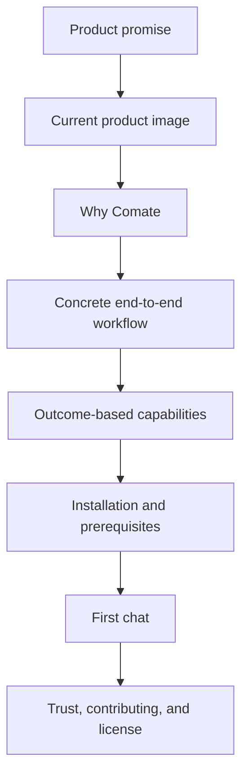
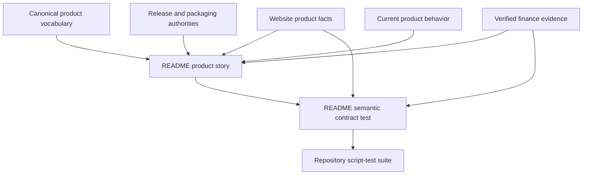

# README Product Story Refresh - Plan

## Goal Capsule

- **Objective:** A first-time repository visitor understands what Comate is, sees why it is useful, confirms that it fits their platform and Agent setup, and can proceed confidently toward installation and a first chat.
- **Means:** Rewrite the README as a product brochure, reuse the verified finance-workflow evidence, and protect stable product claims with a focused documentation contract (Product Contract Key Decision: Product story before installation; KTD1-KTD3).
- **Product authority:** The README follows the general-purpose Agent task workspace identity in `CONCEPTS.md` and uses current product facts already maintained in the app, website, and changelog.
- **Execution profile:** Standard documentation change with test-first proof for stable README facts and a manual rendered-Markdown review.
- **Open blockers:** None.
- **Stop condition:** The README tells the confirmed product story, the contract test protects its stable claims, the changelog records the user-facing documentation change, and all verification gates pass.

---

## Product Contract

### Summary

Rewrite the root README around the verified finance-workflow story and existing product evidence.
Keep the developer guide separate and add focused checks for the stable facts that have drifted before.

### Problem Frame

The current README presents Comate as a desktop AI workspace centered on three coding-oriented Agent backends, while the canonical product identity has expanded to a general-purpose Agent task workspace for research, analysis, writing, operations, project management, and development.
Its long feature inventory also contains stale interaction claims, including a removed Skills button and bot question cards that no longer exist.
The result is a repository landing page that is difficult to scan, undersells the broader product, and requires frequent line-by-line maintenance as individual controls change.

### Key Decisions

- **User-facing product overview over a hybrid developer guide.** (session-settled: user-directed — chosen over developer-focused and hybrid structures: prospective users are the README's primary audience.) Governs R1, R2, R10.
- **Product story before installation.** (session-settled: user-directed — chosen over download-first and feature-inventory structures: the selected brochure layout earns interest through explanation and workflow proof before presenting installers.) Governs R2, R3, R5, R9.
- **Outcome-level capability coverage over control-by-control inventory.** This keeps the README useful as UI details change. Governs R8, R9.

The intended information order is:

### Requirements

**Positioning and story**

- R1. The opening must describe Comate as a general-purpose Agent task workspace for professional everyday work, with development presented as one supported scenario rather than the product category.
- R2. The README must establish the product promise, intended user value, and a coherent end-to-end workflow before the installation section.
- R3. The story must include at least one current product image that proves the desktop experience rather than leaving a screenshot placeholder.
- R4. The README must identify Claude Code and OpenCode as supported Agent backends and describe Codex with its current experimental boundary rather than implying equal production maturity.

**Installation and first use**

- R5. The installation section must offer the current macOS, Windows, and Linux artifacts and retain both GitHub Releases and the Gitee mirror as download sources.
- R6. The README must explain that Agent execution requires a configured Provider or supported Agent account and must not imply that Comate includes free model inference.
- R7. The quick start must follow the current New Chat-first experience, including choosing or creating a workspace, selecting an Agent and Provider as needed, and sending the first prompt.

**Capability coverage and trust**

- R8. Every retained product claim must match current behavior, including the removal of dedicated Skills and Files toolbar buttons and structured question cards from bot sessions.
- R9. Capability coverage must be organized around durable user outcomes such as multi-Agent work, workspace context, browser-assisted tasks, files, Skills and plugins, automation, and controlled enterprise integrations instead of enumerating individual controls.
- R10. Contributor setup must remain a short link to `development.md`; the README must retain concise system requirements, contributing, and license information without becoming a second developer manual.
- R11. Trust-sensitive claims about accounts, transcripts, Providers, permissions, experimental features, platform support, signing, and updates must be checked against current repository authorities before publication.

### Acceptance Examples

- AE1. **Covers R1, R2, R3, R9.** Given a visitor who has never used Comate, when they scan the opening and workflow story, then they can explain what Comate helps them accomplish without first reading the full capability list.
- AE2. **Covers R4, R5, R6, R7.** Given a visitor ready to try Comate, when they reach installation and quick start, then they can identify the right platform artifact, understand which Agent or Provider setup is required, and reach the current New Chat flow.
- AE3. **Covers R8, R11.** Given a current Comate user, when they compare the README with the application, then they do not encounter instructions for removed controls or promises that exceed current Agent, bot, account, updater, or platform behavior.
- AE4. **Covers R9, R10.** Given a contributor seeking implementation details, when they scan the README, then they find the development guide quickly without the product narrative being interrupted by build and test instructions.

### Success Criteria

- A first-time reader can identify Comate's product category, primary uses, supported desktop platforms, supported Agents, prerequisite model-service setup, and path to a first chat from the README alone.
- The top half of the document reads as a product story rather than a changelog or settings inventory.
- The README contains no screenshot, badge, or content placeholders.
- Future UI-level changes can usually be reflected by updating one outcome-oriented statement instead of auditing a list of individual controls.

### Scope Boundaries

- The README will not duplicate the local development, test, packaging, or release instructions owned by `development.md`.
- The README will not catalog every setting, permission state, bot command, status indicator, or recent release change.
- The README will not redefine product positioning independently of `CONCEPTS.md` or introduce claims that conflict with the website's maintained product facts.
- Creating new polished marketing imagery is outside this refresh; current repository-owned product imagery should be reused unless implementation review finds it inaccurate.

### Dependencies and Assumptions

- Existing product imagery under `website/public/images/product/` is assumed suitable for reuse after a final accuracy check against the current UI.
- The English root README remains canonical for this work; bilingual website content remains on the website and is not duplicated into a second README language in this scope.
- Release artifact availability and signing state may vary by release, so wording must remain accurate without promising that every platform artifact is signed.

### Sources and Research

- `README.md` — current structure, claims, installation links, quick start, and placeholders.
- `CONCEPTS.md` — canonical general-purpose Agent task workspace positioning and Provider vocabulary.
- `CHANGELOG.md` — current New Chat flow, Agent boundaries, removed bot question cards, removed prompt toolbar buttons, and recent desktop behavior.
- `website/src/lib/site-facts.ts` — maintained product vocabulary and Provider prerequisite facts.
- `website/public/images/product/` — current finance-workflow product imagery available for reuse.
- `development.md` — platform artifacts, Linux update behavior, build workflow, and browser-runtime boundaries.

---

## Planning Contract

**Product Contract preservation:** unchanged.

### Key Technical Decisions

- KTD1. **Treat maintained repository facts as README authorities.** The README remains human-authored Markdown, while `CONCEPTS.md`, `website/src/lib/site-facts.ts`, release configuration, and current changelog entries provide the facts checked before publication. Covers R1, R4-R8, R11.
- KTD2. **Reuse the current full-frame finance report as the primary product proof.** Use the existing synthetic evidence and its descriptive alt-text pattern instead of creating or editing imagery. Covers R2, R3, R9.
- KTD3. **Guard semantic contracts rather than exact marketing copy.** Add a Node test that checks required facts, section order, link and asset validity, and forbidden stale claims without snapshotting the full README. Covers R1-R8, R10, R11.

### High-Level Technical Design

The README is a curated projection of current product authorities.
The contract test verifies stable boundaries while leaving narrative wording editable.

### Implementation Constraints

- Use standard GitHub Markdown with repo-relative image and document links.
- Reuse files under `website/public/images/product/`; do not create or alter binary assets.
- Keep the root README in English for this scope.
- Keep platform compatibility wording durable by pointing readers to current release notes instead of freezing narrow OS-version claims that can drift.
- Do not couple the contract test to paragraph wording, feature-count totals, or exact heading copy beyond the load-bearing story-before-installation order.

### Sequencing

1. Add the semantic README contract and register it with the existing script-test suite.
2. Rewrite the README and changelog until the new contract and repository gates pass.
3. Review the rendered Markdown and the referenced full-size product image before declaring the work complete.

### System-Wide Impact

- **End users:** Repository visitors receive current positioning, prerequisites, downloads, and first-run guidance.
- **Contributors:** `development.md` remains the single contributor setup guide, while the root README becomes easier to scan.
- **Maintainers:** The script-test suite gains a small product-documentation contract tied to existing website facts and assets.
- **Application runtime:** No desktop, server, storage, permission, Agent, or release behavior changes.

### Risks and Dependencies

- **Narrative tests can become brittle.** Match stable semantic markers and relative order only; do not assert full paragraphs.
- **Small text may be hard to read in the full-frame image.** Review the rendered README at normal GitHub content width and switch to the existing detail crop only if the full frame fails to prove the desktop experience.
- **Release and Agent maturity can change after this update.** Keep `website/src/lib/site-facts.ts`, release configuration, and current changelog entries as pre-publication authorities under R11.
- **Existing unrelated working-tree edits may overlap `CHANGELOG.md` or `package.json`.** Implement against the live files and preserve unrelated changes.

### Research Notes

- `docs/plans/2026-08-22-0129-feat-comate-website-refresh-plan.md` established the product-facts projection, Provider disclosure, finance scenario, and current evidence pipeline reused here.
- `website/public/images/product/README.md` records the synthetic fixture, capture method, dimensions, redaction review, and alt-text ownership for the selected evidence.
- `website/src/lib/site-facts.test.ts` demonstrates the preferred contract style: test stable platform, Provider, release, and vocabulary markers without coupling to whole-page copy.
- `scripts/electron-build-contract.test.ts` demonstrates root-level `node:test` contract checks that read repository files directly.
- `docs/solutions/conventions/commit-plan-and-brainstorm-files-with-code-changes.md` requires this plan artifact to ship with the implementation branch.

---

## Implementation Units

### U1. Add the README semantic contract

**Goal:** Create a focused regression test for the README facts and structure most likely to drift.

**Requirements:** R1-R8, R10, R11; AE2, AE3.

**Dependencies:** None.

**Files:**

- Create `scripts/readme-contract.test.ts`.
- Modify `package.json`.
- Read `website/src/lib/site-facts.ts`, `electron-builder.config.ts`, `.github/workflows/build.yml`, and `website/public/images/product/README.md` as test authorities.

**Approach:**

1. Read `README.md` from the repository root and import or derive only stable facts from the owning authorities in KTD1.
2. Assert the canonical product category, supported Agent boundaries, Provider prerequisite semantics, three desktop platforms, GitHub and Gitee release destinations, and New Chat-first guidance.
3. Assert that product proof uses an existing repository-owned image with descriptive alt text.
4. Assert that product-story content appears before installation and that contributor setup points to `development.md`.
5. Reject placeholders and retired claims such as dedicated Skills or Files toolbar buttons, bot `AskUserQuestion` cards, Tauri positioning, or Claude-only product framing.
6. Register the test in the explicit `test:scripts` command without disturbing existing entries.

**Execution note:** Add the contract first and observe it fail against the current README before rewriting the document.

**Patterns to follow:**

- Use `node:test` and `node:assert/strict` as in `scripts/electron-build-contract.test.ts`.
- Follow the semantic-marker strategy in `website/src/lib/site-facts.test.ts`; avoid a whole-file snapshot.

**Test scenarios:**

- Covers AE2. A README with macOS, Windows, and Linux download guidance, both release destinations, Provider prerequisites, Agent boundaries, and New Chat-first steps passes.
- Covers AE3. A README containing a screenshot placeholder, a Skills- or Files-toolbar-button instruction, bot structured-question-card guidance, Tauri positioning, or Claude-only positioning fails with a targeted assertion.
- A README whose installation heading appears before the product workflow fails the information-order assertion.
- A README that references a missing product image or omits descriptive alt text fails the asset assertion.
- A wording-only change that preserves the required semantics passes without updating a snapshot.
- The root `test:scripts` command invokes the new contract alongside the existing script tests.

**Verification:** The new test fails for the current stale README, reports actionable contract violations, and becomes part of `npm run test:scripts`.

### U2. Rewrite the README around the product story

**Goal:** Replace the stale feature inventory with the confirmed product-brochure narrative and current first-use guidance.

**Requirements:** R1-R11; AE1-AE4.

**Dependencies:** U1.

**Files:**

- Modify `README.md`.
- Modify `CHANGELOG.md`.
- Test with `scripts/readme-contract.test.ts`.
- Reuse `website/public/images/product/finance-report.webp`.
- Reference `development.md`, `CONCEPTS.md`, and `website/src/lib/site-facts.ts` while drafting.

**Approach:**

1. Replace the placeholder opening with the general-purpose Agent task workspace promise and a concise audience-focused explanation.
2. Place the current finance report image near the top with descriptive alt text adapted from the existing product-evidence component.
3. Tell the finance workflow as a short end-to-end story that leads from a professional request through controlled Agent work to a delivered result.
4. Compress capabilities into durable outcome groups that support the story instead of listing individual controls.
5. Present installation after the story with current artifacts, both release sources, Provider or supported-account prerequisites, and durable compatibility wording.
6. Rewrite Quick Start around New Chat, workspace selection or creation, Agent and Provider choice, the first prompt, and visible approvals.
7. Retain concise trust notes, system requirements, contributing, `development.md`, and license sections.
8. Add a top-of-changelog entry that records the user-facing README refresh without modifying unrelated release notes.

**Patterns to follow:**

- Use the vocabulary and disclosure boundaries in `website/src/lib/site-facts.ts`.
- Use the scenario arc and evidence description in `website/src/components/FinanceWorkflow.astro`, `website/src/components/ProductEvidence.astro`, and `website/public/images/product/README.md`.
- Keep contributor detail in `development.md` as established by the original README plan.

**Test scenarios:**

- Covers AE1. A visitor reading the opening, image, and workflow can describe Comate as a general-purpose Agent task workspace without reading the capability section.
- Covers AE2. A visitor can choose the correct platform artifact, see the Provider or supported-account prerequisite, and follow the current New Chat flow.
- Covers AE3. The finished README contains no placeholder, retired control, unsupported maturity claim, or signing promise.
- Covers AE4. A contributor finds `development.md` without build and test instructions interrupting the product narrative.
- The selected image and all repository-relative links resolve from the root README.
- The README remains legible in GitHub's rendered Markdown at desktop and narrow content widths.

**Verification:** The rendered README follows the Product Contract hierarchy, the finance image is legible and accurate, all links resolve, and the semantic contract passes without exact-copy assertions.

---

## Verification Contract

| Gate | Applies to | Required signal |
| --- | --- | --- |
| `npx tsx --test scripts/readme-contract.test.ts` | U1, U2 | All README semantic, ordering, link, and asset assertions pass. |
| `npm run test:scripts` | U1, U2 | The new contract runs inside the complete script-test suite with no regressions. |
| `npm run lint` | U1 | The new TypeScript test and package-script edits meet repository lint rules. |
| `npm run typecheck` | U1 | Repository TypeScript contracts remain valid. |
| `npm run check` | U1, U2 | The full lint, typecheck, and test suite passes before handoff. |
| Rendered Markdown review | U2 | GitHub-style rendering shows the intended information order, a legible product image, descriptive alt text, and working internal and release links. |
| Product truth review | U2 | README claims agree with `CONCEPTS.md`, `website/src/lib/site-facts.ts`, current release configuration, and the current changelog. |

---

## Definition of Done

- `artifact_readiness` is `implementation-ready`, and the Product Contract remains unchanged in meaning with all R-IDs and AE-IDs preserved.
- U1 is complete when the semantic contract exists, fails against known stale content, avoids whole-file snapshots, and runs through `test:scripts`.
- U2 is complete when the README follows the confirmed product-story hierarchy, reuses verified imagery, documents accurate installation and first-use facts, and records the change in `CHANGELOG.md`.
- All Verification Contract gates pass, including rendered-Markdown and product-truth review.
- The implementation contains no new binary assets, duplicate developer guide, or unrelated application changes.
- The plan artifact is committed with the implementation as required by the repository documentation convention.
- Any abandoned test markers, temporary copy variants, dead links, or unused asset references from unsuccessful approaches are removed before completion.
