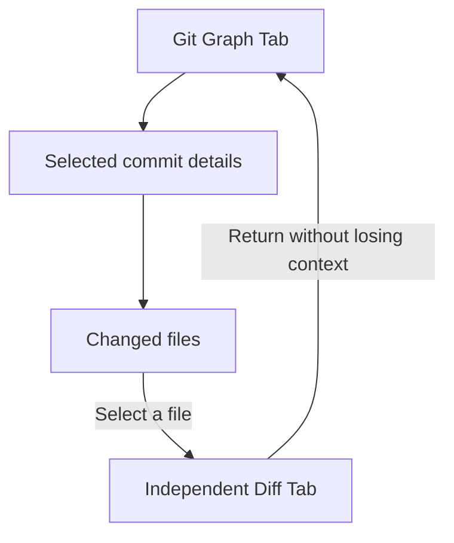
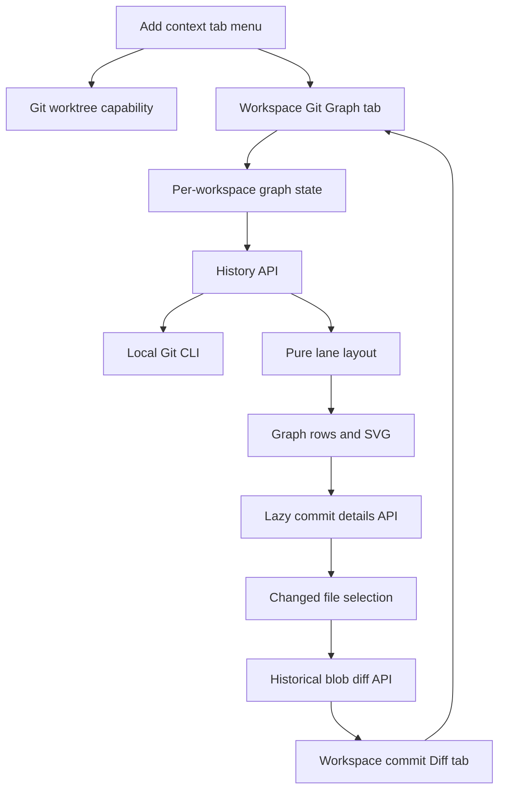
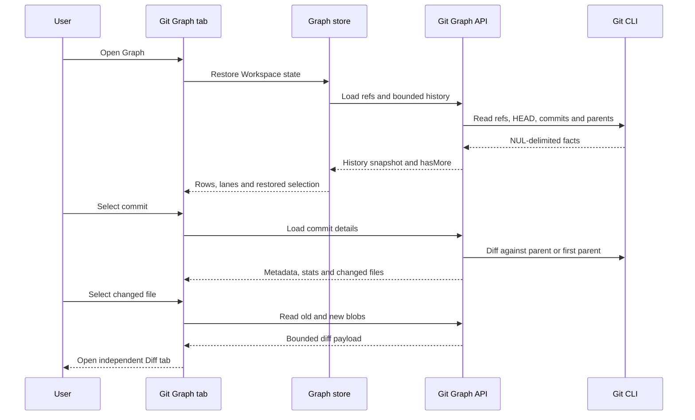

# Git Graph - Plan

## Goal Capsule

- **Objective:** Comate 用户无需打开 VS Code、JetBrains 或其他 Git 工具，就能理解当前 Workspace 的分支与 commit 关系，并检查任一 commit 的文件级修改和具体 diff。
- **Means:** 为 Git Workspace 提供独立的只读 Git Graph Tab，服务端读取 Git 历史，客户端绘制拓扑，并将历史文件 diff 延续到现有 Workspace 级标签页体验（KTD1-KTD6）。
- **Authority:** Product Contract 定义用户行为和范围；Planning Contract 定义实现约束；冲突时前者优先。
- **Execution profile:** Standard、代码实施、无数据迁移；按 U-ID 依赖顺序执行。
- **Stop conditions:** 若 Git CLI 无法稳定提供 NUL 分隔的历史/路径数据，或现有 Context Workspace 无法在不破坏 Workspace/Session 隔离的情况下承载 Graph，停止并回到规划，而不是改变产品语义。
- **Tail ownership:** 实施者负责完成 Verification Contract、清理试验代码，并按仓库惯例交付；本计划不要求发布或远端 Git 操作。

---

## Product Contract

### Summary

Git Workspace 将获得独立的 Git Graph Tab，用于浏览分支拓扑、commit 历史和所选 commit 的详情。
commit 详情保留在 Git Graph 内，选择变更文件后才打开独立 Diff Tab。

Product Contract preservation note: 本次规划保留了 brainstorm 已确认的 R1-R13、F1-F3 和 AE1-AE5 的含义与编号，仅补充实现合同和可验证性。

### Problem Frame

Comate 已能显示当前 Git ref 和 Workspace 的未提交 Changes，但不能解释分支历史、commit 与分支的关系或一次已提交变更的内容。
用户目前需要切换到 VS Code Git Graph 或 JetBrains 才能判断分支关系并审查 Agent 或本人产生的 commit，打断了 Comate 内的任务闭环。

### Key Decisions

- **只读审查与导航。** (session-settled: user-directed — chosen over 完整 Git 客户端: 保留历史理解和 diff 闭环，同时避免高风险仓库修改。) Governs R3, R4, R5, R6, R7, R8, R9, R10, R11, R12, R13.
- **独立 Git Graph Tab，详情留在图内。** (session-settled: user-directed — chosen over 合并进 Changes 或为 commit 新建详情 Tab: 为拓扑保留完整浏览空间，只让文件 diff 占用额外 Tab。) Governs R2, R6, R7, R8, R9.
- **忠实展示拓扑，不推断合并状态。** (session-settled: user-directed — chosen over 自动识别主分支并标记已合并状态: 用户根据真实分支关系自行判断。) Governs R3, R8.
- **merge commit 使用第一父提交作为 diff 基准。** (session-settled: user-approved — chosen over combined diff 或首版禁用 merge diff: 与参考工具的已修正语义一致，避免混入其他父分支之间的差异。) Governs R11.

### Requirements

**Availability and graph navigation**

- R1. Git Graph 只对当前目录可识别为 Git worktree 的 Workspace 可用，非 Git Workspace 不显示一个可打开但无内容的 Graph 入口。
- R2. Git Graph 作为 Workspace 级 Typed context tab 打开，并在该 Workspace 的 Session 之间保持同一内容归属。
- R3. Graph 展示 commit 拓扑以及可用的本地分支、远端分支和 Tag 引用，使用户能直接观察分支与 commit 的关系。
- R4. Graph 明确标识当前 HEAD，并提供回到当前 HEAD 的导航动作。
- R5. 用户可以筛选图中显示的分支、搜索 commit，并按需继续加载更早的历史，而不要求首次打开时读取完整仓库历史。

**Commit information**

- R6. 选择一个 commit 后，Git Graph 内的详情区显示完整标题与正文、作者与时间、完整和短 SHA、分支或 Tag 引用、父提交以及增删统计。
- R7. commit 详情包含变更文件列表，并为每个文件显示路径和新增、修改、删除或重命名状态。
- R8. Graph 和 commit 详情只呈现 Git 可验证的引用与拓扑信息，不生成“已合并到主分支”等推断状态。

**File diff**

- R9. 用户选择 commit 中的变更文件后，Comate 像打开普通文件一样创建独立的 Workspace 级 Diff Tab，Git Graph 的选择和浏览位置保持不变。
- R10. 普通 commit 的 diff 与其唯一父提交比较。
- R11. merge commit 的 diff 与第一父提交比较，第一版不提供父提交切换或 combined diff。
- R12. 新增、删除、重命名、二进制或无法文本比较的文件必须显示准确状态，并在不能展示文本 diff 时给出明确的不可比较结果。

**Read-only boundary**

- R13. Git Graph 不提供 checkout、创建或删除分支、fetch、pull、push、merge、rebase、reset、cherry-pick、revert、stash 或其他会修改仓库及远端状态的动作。

### Key Flows

- F1. Browse branch relationships
  - **Trigger:** 用户在 Git Workspace 中打开 Git Graph。
  - **Steps:** Graph 定位当前 HEAD，呈现分支与 commit 拓扑；用户筛选分支、搜索或继续加载历史。
  - **Outcome:** 用户可以根据图中的真实关系判断目标分支与其他分支如何分叉或汇合。
  - **Covered by:** R1, R2, R3, R4, R5, R8.

- F2. Inspect a commit
  - **Trigger:** 用户在 Graph 中选择一个 commit。
  - **Steps:** Graph 保持可见，并在详情区展示 commit 元信息、父提交、统计和变更文件列表。
  - **Outcome:** 用户无需离开 Git Graph 即可理解 commit 的身份和修改范围。
  - **Covered by:** R6, R7, R8.

- F3. Review a file diff
  - **Trigger:** 用户在 commit 详情中选择一个变更文件。
  - **Steps:** Comate 打开独立 Diff Tab；用户检查具体改动后可返回原 Git Graph 上下文。
  - **Outcome:** 用户在 Comate 内完成从分支关系到 commit 再到文件 diff 的审查闭环。
  - **Covered by:** R9, R10, R11, R12.

### Acceptance Examples

- AE1. Git Workspace opens a graph
  - **Covers R1, R2, R3, R4, R5, R6.**
  - **Given:** 当前 Workspace 是 Git worktree，并包含多条本地或远端分支。
  - **When:** 用户打开 Git Graph。
  - **Then:** Comate 显示当前 HEAD、分支标签和 commit 拓扑，并允许用户选择 commit 查看详情。

- AE2. Non-Git Workspace has no false graph
  - **Covers R1.**
  - **Given:** 当前 Workspace 不是 Git worktree。
  - **When:** 用户查看可添加的 Workspace context tabs。
  - **Then:** Git Graph 不作为一个会打开空白或误导性页面的可用入口出现。

- AE3. Commit file opens a diff tab
  - **Covers R6, R7, R9, R12.**
  - **Given:** 用户已选择一个包含多个文件修改的 commit。
  - **When:** 用户选择其中一个可进行文本比较的文件。
  - **Then:** Comate 打开独立 Diff Tab，并在返回 Git Graph 时保留原 commit 和浏览位置。

- AE4. Merge commit uses first-parent semantics
  - **Covers R11.**
  - **Given:** 用户选择一个拥有多个父提交的 merge commit。
  - **When:** 用户查看文件列表或打开文件 diff。
  - **Then:** 文件范围和内容均以该 commit 相对第一父提交的变化为准，不混合其他父提交之间的差异。

- AE5. Large history remains explorable
  - **Covers R5.**
  - **Given:** Workspace 包含超过初始显示范围的 commit 历史。
  - **When:** 用户到达当前已加载历史的末端。
  - **Then:** 用户可以继续加载更早 commit，并保留当前筛选和搜索上下文。

### Success Criteria

- 用户无需打开其他 IDE 或 Git GUI，即可确认分支是否已经在拓扑上汇合、查看一个 commit 修改了哪些文件，并检查每个文件的具体 diff。
- 从 Graph 选择 commit、查看文件列表、打开 Diff Tab、再返回 Graph 的流程不会丢失原选择和浏览位置。
- Git Graph 对非 Git Workspace、大历史仓库和无法展示文本 diff 的文件给出明确且不误导的结果。

### Scope Boundaries

- 不包含任何 Git 写操作或远端同步动作；Git Graph 第一版不是完整 Git 客户端。
- 不保存“已审查”“待处理”等状态，不提供 commit 评论、逐行评论或审查记录。
- 不为 commit 信息创建独立 Tab；只有文件 diff 使用独立 Tab。
- 不计算主分支，不标记 commit 或分支是否已合并，也不提供 merge commit 的父提交切换或 combined diff。
- 不包含任意两次 commit 的比较、未提交 Changes 与 commit 的比较或持久化 Git Graph 个性化设置。

### Dependencies and Assumptions

- Workspace 路径可由本机 Git 读取，且 Git worktree、linked worktree 和 submodule 的识别沿用同一产品语义。
- 现有 Workspace 级 Typed context tab 和 Diff Tab 行为是新增 Graph 与文件审查体验的产品基线。
- Git Graph 的视觉拓扑来自仓库可验证的父子关系与 refs；展示顺序和绘制算法遵循 KTD2、KTD3，且不得改变 R3 和 R8 的信息语义。

### Sources and Research

- `CONCEPTS.md` — Typed context tab 与 Workspace/Session 归属的规范词汇。
- `src/client/stores/context-tab-store.ts` — 现有 File、Changes 和 Browser context tab 的产品基线。
- `src/client/components/ContextWorkspace.tsx` — 现有 Workspace context surface、navigator 与 diff 呈现关系。
- `src/server/routes/git-status.ts` — 当前 Git ref 检测能力。
- `src/server/routes/git-changes.ts` — 当前 Workspace Git status 与文件 diff 能力。
- `src/server/services/git-changes-service.ts` — 当前 Git worktree、linked worktree 与 watcher 识别能力。
- [VS Code Git Graph Marketplace](https://marketplace.visualstudio.com/items?itemName=mhutchie.git-graph) — Graph、Commit Details、文件 Diff、搜索和分支筛选的参考行为。
- [VS Code Git Graph Extension Settings](https://github.com/mhutchie/vscode-git-graph/wiki/Extension-Settings) — Commit Details 布局和增量历史加载的参考行为。
- [VS Code Git Graph issue #274](https://github.com/mhutchie/vscode-git-graph/issues/274) — merge commit 混合多个父提交差异被认定为错误的参考证据。

---

## Planning Contract

### Key Technical Decisions

- KTD1. **以 Workspace Git capability 和专用只读路由为服务边界。** `git-ref` 增加独立的 worktree capability，新的 Git Graph 路由负责历史、commit 详情和历史文件 diff；所有 Git 调用使用参数数组而非 shell 字符串。这样未出生分支仍可判定为 Git worktree，非 Git Workspace 可在打开入口前被排除。Governs R1, R3, R6, R7, R9, R12.
- KTD2. **历史采用可重复的扩大窗口，而不是不稳定的 offset 分页。** 服务端按拓扑顺序返回 `limit + 1` 个 commit 和 `hasMore`，客户端每次加载更早历史时扩大 limit 并替换完整快照；切换分支筛选时从初始窗口重新加载。该方式与参考实现一致，并保证泳道在窗口扩大后可以从同一 DAG 重新计算。Governs R3, R4, R5.
- KTD3. **服务端返回 Git 事实，客户端计算泳道并用行对齐 SVG 绘制。** API 只返回 parents、refs、HEAD 和 commit 元数据；纯函数布局器为每行分配 lane、节点和连线，React 组件渲染图形与提交行。不引入通用流程图库，避免其自动布局改变 Git 的时间顺序或增加交互负担。Governs R3, R4, R8.
- KTD4. **commit 详情与 blob 内容按选择惰性读取。** 历史列表不携带文件清单；选择 commit 后，服务端以唯一父提交或第一父提交为基准生成 NUL 分隔的 name-status/numstat，选择文件后才读取前后两个 blob，并复用现有大小、行数、二进制和错误展示上限。root commit 的旧内容为空。Governs R6, R7, R10, R11, R12; carries forward the session-settled first-parent decision.
- KTD5. **Graph 状态和 Diff Tab 身份均绑定 Workspace。** 每个 Workspace 保存已加载窗口、筛选、搜索、选择、滚动位置和请求状态；Graph Tab 是单例 Workspace tab，历史 Diff Tab 以 commit、基准、旧/新路径组成稳定身份，不复用 working-tree Changes 的身份。这样切换到 Diff 后不会销毁 Graph 上下文。Governs R2, R9; carries forward the session-settled independent-tab decision.
- KTD6. **刷新采用打开、显式动作和应用重新聚焦触发。** 刷新保留仍存在的选择和可恢复的滚动锚点，使用 abort/request generation 丢弃过期响应；首版不新增常驻 refs watcher。Governs R4, R5.
- KTD7. **搜索只匹配当前已加载窗口。** 匹配 commit 标题、作者、SHA 与可见 refs；界面同时保留“加载更多”动作，让用户扩大搜索范围。该边界对应参考工具的 Find 行为，不会为一次搜索扫描完整仓库。Governs R5.
- KTD8. **不新增 Agent 专用 Git Graph 工具。** Graph 不产生新的仓库动作，Agent 已可在同一 Workspace 使用只读 Git CLI 获取等价事实；本次只补齐人类 UI 的可视化与导航差距，不创建一套重复的 Agent API。Governs R8, R13.

### High-Level Technical Design

以下图示约束组件职责和数据流；具体函数名与内部数据结构由实施时依照现有模式确定。

```mermaid
stateDiagram-v2
  [*] --> Unavailable: Workspace is not a Git worktree
  [*] --> Idle: Git capability is available
  Idle --> Loading: Open, refresh, refocus, filter or load more
  Loading --> Ready: Snapshot succeeds
  Loading --> Error: Snapshot fails
  Ready --> Loading: Refresh or expand history
  Ready --> DetailLoading: Select commit
  DetailLoading --> Ready: Details succeed and selection remains
  DetailLoading --> DetailError: Details fail; graph snapshot remains
  DetailError --> DetailLoading: Retry selected commit
  DetailError --> Ready: Select another commit
  Error --> Loading: Retry
  Ready --> [*]: Workspace closes
```

### API and Data Constraints

- History input accepts a bounded limit and zero or more server-known ref identifiers. User input is never forwarded as a Git option; selected refs must match the enumerated ref set before invocation.
- Commit identifiers accepted by detail and diff routes must resolve to a commit in the Workspace repository. File paths must come from that commit's computed change list and remain repository-relative before blob access.
- History and file-change parsing uses NUL or an unambiguous record separator so Unicode, spaces, tabs, rename pairs and unusual filenames do not corrupt records.
- History responses distinguish `isGitWorktree`, an empty repository, detached HEAD and command failure. A missing HEAD is not equivalent to a non-Git Workspace.
- Refresh replaces one coherent snapshot; refs, HEAD and commit rows from different generations are never merged.

### Sequencing

U1 establishes repository capability and the history contract. U2 adds lazy detail and historical diff semantics. U3 builds deterministic client state and layout on those contracts. U4 extends Typed context tabs and the shell integration. U5 composes the end-user Graph and commit-review flow.

### System-Wide Impact

- **Desktop API surface:** Adds authenticated local read-only endpoints under the existing Workspace API boundary; no new external service or credential is introduced.
- **Context lifecycle:** Adds two Workspace-scoped tab types and per-Workspace Graph state; Session-scoped Browser behavior remains unchanged.
- **Resource posture:** Git subprocesses are bounded by timeout and result size, history is incrementally expanded, details/blobs are lazy, and stale requests are aborted or ignored.
- **Security:** Commit/ref/path inputs are validated against repository-derived values and passed through `execFile`-style argument arrays. Historical paths are not trusted merely because the current filesystem contains a matching path.
- **Agent parity:** No domain mutation becomes human-only; equivalent read-only facts remain available to agents through the Workspace Git CLI.

### Risks and Mitigations

| Risk | Consequence | Mitigation |
|---|---|---|
| Large or highly branched repositories | Slow Git calls, excessive DOM/SVG work | Bounded initial window, explicit incremental expansion, lazy details, subprocess timeouts, and performance fixtures with wide/long histories |
| Unusual commit messages or filenames | Corrupt parsing or wrong file Diff | NUL/record-delimited parsing, rename-aware records, Unicode and separator-character fixtures |
| History changes during an active request | HEAD, refs and rows describe different generations | Atomic snapshot replacement plus request generations; refresh instead of merging partial results |
| Merge and root commit ambiguity | Misleading file list or Diff | One shared baseline resolver used by both details and blob Diff; first-parent and root integration tests |
| Historical path traversal or revision injection | Reading unintended repository objects | Resolve commit IDs, accept only change-list paths, reject absolute/traversal paths, and never interpolate shell commands |
| Graph layout regressions | Branch relationships appear false even when API facts are correct | Pure deterministic layout function with topology fixtures and visible-edge assertions separate from UI tests |

### Deferred Implementation Notes

- Exact initial/incremental commit counts may be tuned while measuring representative fixtures, but both remain bounded constants and do not change the expanding-window contract.
- A fixed-row rendering optimization may be added inside U5 if profiling shows the target history fixture exceeds the interaction budget; it must not change selection, scroll restoration or topology output.

---

## Implementation Units

### U1. Expose Git capability, refs and bounded history

- **Goal:** Provide one repository-grounded snapshot that tells the client whether Graph is available and returns HEAD, refs, commits, parents and incremental-history availability.
- **Requirements:** R1, R3, R4, R5; F1; AE1, AE2, AE5; KTD1, KTD2.
- **Dependencies:** None.
- **Files:**
  - Modify `src/server/routes/git-status.ts`
  - Create `src/server/models/git-graph.ts`
  - Create `src/server/services/git-graph-service.ts`
  - Create `src/server/services/git-graph-service.test.ts`
  - Create `src/server/routes/git-graph.ts`
  - Create `src/server/routes/git-graph.test.ts`
  - Modify `src/server/server-main.ts`
- **Approach:**
  1. Replace the current ref-only probe with a structured capability result that distinguishes non-Git, unborn, attached and detached states while preserving the existing `ref` consumer.
  2. Add typed history/ref models and a service that invokes Git with argument arrays, bounded timeouts and delimiter-safe formats.
  3. Enumerate local branches, remote branches and tags, attach them by peeled commit hash, and return a coherent HEAD/history snapshot in deterministic topological order.
  4. Implement the expanding-window contract and validate any selected ref filters against the enumerated repository refs.
  5. Register the authenticated Workspace route using the existing workspace lookup and diagnostic-error conventions.
- **Patterns to follow:** `src/server/routes/git-status.ts` for Workspace lookup; `src/server/routes/git-changes.ts` for read-only Git route errors; `src/server/services/git-changes-service.ts` for linked-worktree recognition; the reference Git Graph `getCommits`/`getRefs` split for behavior, not code reuse.
- **Test scenarios:**
  - A repository with diverged local branches, a remote-tracking ref and a tag returns all refs attached to their exact commit rows and marks HEAD.
  - A non-Git directory reports unavailable capability and rejects Graph history without presenting an empty repository as success.
  - An initialized repository with no commits reports Git capability with no HEAD and an empty history.
  - A detached HEAD returns the full commit hash and no fabricated branch name.
  - A history longer than the requested limit returns a bounded snapshot plus `hasMore`; a larger limit returns a stable prefix followed by older commits.
  - A branch filter containing a name not present in the enumerated refs is rejected before Git execution.
  - Commit subjects, authors and ref names containing Unicode or separator-like characters round-trip without record corruption.
- **Verification:** Server tests prove capability classification, ref attachment, deterministic history expansion and safe filter validation against real temporary repositories.

### U2. Provide lazy commit details and historical file diffs

- **Goal:** Return accurate metadata, stats, file status and bounded before/after content for a selected historical commit.
- **Requirements:** R6, R7, R9, R10, R11, R12; F2, F3; AE3, AE4; KTD1, KTD4.
- **Dependencies:** U1.
- **Files:**
  - Modify `src/server/models/git-graph.ts`
  - Modify `src/server/services/git-graph-service.ts`
  - Modify `src/server/services/git-graph-service.test.ts`
  - Modify `src/server/routes/git-graph.ts`
  - Modify `src/server/routes/git-graph.test.ts`
  - Refactor shared bounded-content helpers from `src/server/routes/git-changes.ts` into an adjacent Git diff utility if reuse is cleaner
  - Modify `src/server/routes/git-changes.test.ts` if helper extraction changes existing coverage boundaries
- **Approach:**
  1. Centralize baseline resolution so normal, merge and root commits use the same base for both file enumeration and content retrieval.
  2. Parse rename-aware `name-status` and `numstat` output into one file list carrying old/new paths, status and nullable line counts for binary files.
  3. Resolve requested commit IDs and verify requested paths against the selected commit's computed change list before reading blobs.
  4. Read old/new blobs lazily and map added, deleted, renamed, binary, missing and truncated cases into the existing Diff viewer contract.
  5. Preserve current working-tree compare behavior while extracting only genuinely shared size/binary helpers.
- **Execution note:** Start with real-repository integration tests for first-parent and root semantics because route mocks cannot prove Git's revision behavior.
- **Patterns to follow:** `src/server/routes/git-changes.ts` for caps and binary presentation; Git Graph's `diff-tree --root --find-renames` and first-parent behavior as external reference.
- **Test scenarios:**
  - A normal commit returns metadata and the same changed-file set used by each file Diff.
  - Covers AE4. A two-parent merge returns only changes relative to parent zero, and opening each listed file uses that identical baseline.
  - A root commit reports all files as added and returns empty original content.
  - A rename reports distinct old/new paths and retrieves the corresponding blobs.
  - Added and deleted text files produce one empty side and one populated side with the correct status.
  - A binary file returns an explicit binary result without decoding arbitrary bytes as text.
  - Oversized content returns the same bounded/truncated semantics as the current Changes Diff.
  - An invalid hash, absolute path, traversal path, or path not present in the commit change list is rejected without unintended object access.
- **Verification:** Real Git fixtures prove that detail stats, file lists and blob pairs share one baseline across normal, merge, root, rename, binary and failure cases.

### U3. Build per-Workspace graph state and deterministic lane layout

- **Goal:** Convert server snapshots into stable graph geometry and preserve independent navigation state for each Workspace.
- **Requirements:** R2, R3, R4, R5, R8, R9; F1; AE1, AE3, AE5; KTD2, KTD3, KTD5, KTD6, KTD7.
- **Dependencies:** U1, U2.
- **Files:**
  - Create `src/client/lib/git-graph-layout.ts`
  - Create `src/client/lib/git-graph-layout.test.ts`
  - Create `src/client/stores/git-graph-store.ts`
  - Create `src/client/stores/git-graph-store.test.ts`
- **Approach:**
  1. Implement a pure top-to-bottom lane allocator that keeps first-parent continuity, opens lanes for alternate parents, closes/reuses lanes deterministically and emits clipped continuation edges at the loaded boundary.
  2. Keep raw repository facts separate from derived layout so ref/HEAD truth is never inferred from drawing geometry.
  3. Store graph snapshot, filters, loaded limit, search text/matches, selected commit/detail, scroll anchor, snapshot error and detail error independently by Workspace ID so a detail failure never replaces a usable graph.
  4. Implement open/refresh/refocus/filter/load-more transitions with abort or generation guards, preserving a still-valid selection and resetting only state invalidated by a changed filter/snapshot.
  5. Match search against the loaded snapshot and expose match navigation without silently querying unseen history.
- **Patterns to follow:** `src/client/stores/git-changes-store.ts` for per-Workspace Zustand state and request lifecycle; `src/client/stores/context-tab-store.ts` for Workspace isolation; reference `web/graph.ts` for lane-continuity concepts without copying its DOM-oriented implementation.
- **Test scenarios:**
  - Linear history stays in one lane with continuous first-parent edges.
  - A branch split and later merge creates an alternate lane that reconnects to the correct parent without crossing unrelated rows.
  - An octopus merge and a parent outside the loaded window produce deterministic lanes and continuation edges without fabricated commits.
  - Identical snapshots always produce identical geometry; expanding the snapshot keeps the existing visible prefix topologically equivalent.
  - Loading more preserves active branch filters and search text while expanding possible matches.
  - Switching from Graph to a Diff tab and back retains selected commit and scroll anchor.
  - Two Workspaces maintain different filters, selections and loading results without state leakage.
  - A stale history or detail response arriving after a newer request is ignored.
  - A refresh where the selected commit disappeared falls back to HEAD or the first visible commit with an explicit, testable rule.
- **Verification:** Pure layout fixtures establish topology correctness, and store tests establish Workspace isolation, refresh semantics, search bounds and stale-response safety.

### U4. Extend Typed context tabs for Graph and historical Diff

- **Goal:** Make Git Graph and commit-specific file diffs first-class Workspace tabs without changing File, Changes or Browser ownership.
- **Requirements:** R1, R2, R9, R12; F3; AE2, AE3; KTD1, KTD5.
- **Dependencies:** U1, U2.
- **Files:**
  - Modify `src/client/stores/context-tab-store.ts`
  - Modify `src/client/stores/context-tab-store.test.ts`
  - Modify `src/client/components/CustomTitlebar.tsx`
  - Modify `src/client/components/ContextWorkspace.tsx`
  - Modify `src/client/components/ContextWorkspace.test.tsx`
  - Modify `src/client/App.tsx`
  - Modify `src/client/components/AppLayout.test.tsx` and titlebar tests or add focused shell tests where appropriate
  - Modify `src/client/i18n/en/common.json`
  - Modify `src/client/i18n/zh-CN/common.json`
- **Approach:**
  1. Add a singleton Workspace `git-graph` tab and a commit-specific `commit-diff` tab to the discriminated union, projection, selection, close and cleanup paths.
  2. Give historical Diff a stable identity that includes commit/base and old/new paths, and adapt it to `CodeMirrorDiffViewer` without pretending it is staged or working-tree Changes.
  3. Add the Graph icon and label to the titlebar, and show its add-menu entry only after the active Workspace capability says it is a Git worktree.
  4. Render Graph as primary Context Workspace content with no File/Changes navigator; keep each Diff as its own normal tab so returning selects the unchanged Graph instance.
  5. Preserve current preview-slot rules for Files and Changes; opening one historical file Diff must not replace or mutate the Graph tab.
- **Patterns to follow:** Existing File/Changes Workspace tabs and Browser Session tabs in `context-tab-store.ts`; current tab icons/menu in `CustomTitlebar.tsx` and `App.tsx`; current Diff adapter in `ContextWorkspace.tsx`.
- **Test scenarios:**
  - Covers AE2. The add-menu omits Git Graph for a non-Git Workspace and includes it for an unborn or populated Git worktree.
  - Opening Git Graph twice selects one Workspace tab instead of duplicating it.
  - The same Workspace Graph remains available when sessions change, while another Workspace receives a distinct Graph tab and state owner.
  - Opening two files from different commits creates identities that cannot collide solely because their paths match.
  - A historical text Diff renders through the existing viewer; binary, deleted and truncated states retain their explicit presentation.
  - Closing a Diff does not close or reset Graph; closing/clearing the Workspace removes both tab types and aborts related requests.
  - Existing File preview, Changes preview and Browser Session projection tests remain unchanged in behavior.
- **Verification:** Context-store and component tests prove tab ownership, availability gating, identity, cleanup and regression safety for existing tab types.

### U5. Compose the Git Graph browsing and commit-review experience

- **Goal:** Deliver the complete Graph, commit details and file-to-Diff interaction inside the Context Workspace.
- **Requirements:** R3, R4, R5, R6, R7, R8, R9, R12, R13; F1, F2, F3; AE1, AE3, AE4, AE5; KTD3-KTD7.
- **Dependencies:** U3, U4.
- **Files:**
  - Create `src/client/components/git-graph/GitGraphPanel.tsx`
  - Create `src/client/components/git-graph/GitGraphToolbar.tsx`
  - Create `src/client/components/git-graph/GitGraphRows.tsx`
  - Create `src/client/components/git-graph/GitCommitDetails.tsx`
  - Create focused component tests under `src/client/components/git-graph/`
  - Modify `src/client/components/ContextWorkspace.tsx`
  - Modify `src/client/components/ContextWorkspace.test.tsx`
  - Modify `src/client/i18n/en/common.json`
  - Modify `src/client/i18n/zh-CN/common.json`
- **Approach:**
  1. Build a compact toolbar for branch filtering, loaded-window search/match navigation, locate HEAD, refresh and load-more status.
  2. Render fixed-height commit rows and an aligned SVG graph from U3 geometry, with distinct local/remote/tag labels and an accessible current-HEAD marker.
  3. Keep the selected commit's metadata and changed-file list inside the Graph panel, using loading, empty and retry states that do not remove the surrounding graph.
  4. Open file rows through the U4 historical Diff action and preserve Graph selection/scroll while another tab is active.
  5. Expose only navigation actions plus copy SHA; omit every repository mutation and every inferred merge-status label.
- **Execution note:** Validate graph legibility with branch, merge and long-history fixtures at the smallest supported Context panel width before polishing secondary metadata.
- **Patterns to follow:** `GitChangesPanel.tsx` for toolbar/loading/error conventions; `CodeMirrorDiffViewer.tsx` for status language; the reference Git Graph's row-aligned SVG, in-graph details and Find behavior for interaction precedent.
- **Test scenarios:**
  - Covers AE1. Opening a multi-branch fixture displays aligned topology, local/remote/tag labels, HEAD and an initially selected commit with details.
  - Selecting another row loads its metadata and file list without changing Graph scroll position.
  - Locate HEAD clears no filters and scrolls/focuses the visible HEAD row; when HEAD is excluded by the active filter, the UI explains that state instead of selecting an unrelated commit.
  - Search highlights and navigates loaded matches across author, subject, SHA and refs; no-match state distinguishes the current loaded window from full history.
  - Covers AE5. Loading more appends older visible history while retaining filters, search and a still-valid selection.
  - Covers AE3. Selecting a text file opens its independent Diff tab, and returning restores the same commit and viewport.
  - Covers AE4. A merge commit describes the first-parent baseline consistently with its server-provided file list.
  - Empty repository, command failure, retry, binary file and truncated Diff states are explicit and keyboard reachable.
  - No checkout, merge, reset, fetch, push or other mutation control is rendered in toolbar, row, details or file actions.
- **Verification:** Focused UI tests prove the three product flows, keyboard-accessible selection/actions, explicit failure states and the absence of Git mutations; manual browser QA confirms graph/row alignment and scroll restoration at narrow and normal panel widths.

---

## Verification Contract

| Gate | Applies to | Required outcome |
|---|---|---|
| `npx tsx --test src/server/services/git-graph-service.test.ts src/server/routes/git-graph.test.ts src/server/routes/git-changes.test.ts` | U1, U2 | Real repositories prove Git capability, refs/history, first-parent details, path validation and bounded blob Diff without regressing Changes |
| `npx vitest run --project jsdom src/client/lib/git-graph-layout.test.ts src/client/stores/git-graph-store.test.ts src/client/stores/context-tab-store.test.ts src/client/components/ContextWorkspace.test.tsx src/client/components/git-graph` | U3, U4, U5 | Layout, Workspace state, Typed tabs and Graph interactions satisfy the unit scenarios |
| `npm run typecheck` | All units | Client/server discriminated unions, API models and component contracts compile without type escapes |
| `npm run lint` | All units | New Git parsing, stores and UI follow repository lint rules with no warnings |
| `npm run test:server` and `npm run test:client` | Final integration | The complete server and jsdom suites pass, including existing File/Changes/Browser behavior |
| `npm run build` | Final integration | Production client/server/package build succeeds with the new route and components included |
| Browser QA in the desktop shell | U5 | A real multi-branch Workspace completes browse → inspect commit → open file Diff → return to Graph, with aligned topology and preserved context |

Release-only packaging and signing gates are not required for this feature unless the implementation also changes Electron packaging or release configuration.

---

## Definition of Done

- R1-R13 are implemented without broadening the read-only product boundary.
- F1-F3 complete inside Comate, and AE1-AE5 are represented by automated or named browser verification.
- U1-U5 satisfy their test scenarios and verification outcomes in dependency order.
- Normal, merge and root commit details use one consistent baseline for both file lists and file content.
- Git capability distinguishes non-Git, empty, attached and detached repositories; Graph availability never relies on `ref !== null` alone.
- Local branches, remote branches, tags, HEAD, parent edges and loaded-window boundaries render from Git facts without inferred merge status.
- Opening and closing historical Diff tabs does not lose per-Workspace Graph selection, filters, search or scroll context.
- Git subprocesses are parameterized, timed out and bounded; revision/ref/path validation tests cover malicious and unusual inputs.
- Existing File, Changes and Browser tabs retain their ownership, preview, rendering and cleanup behavior.
- Targeted tests, full server/client suites, typecheck, lint and build gates pass; browser QA records the end-to-end Graph review flow.
- No Git mutation control, persistent review state, main-branch inference, arbitrary commit comparison or combined merge Diff is present.
- Any abandoned layout, parsing or state-management experiment is removed, and the final diff contains no dead code or untracked plan/fixture artifacts.

---

## Appendix

### Reference Implementation Findings

- VS Code Git Graph requests `maxCommits + 1`, reports whether more commits exist, and increases `maxCommits` for manual or automatic load-more. KTD2 adopts that coherent-window behavior.
- Its `getLog` selects branch/ref tips and emits commit hash, parents, author, date and subject; refs are read separately and attached by hash. KTD1 and KTD3 preserve that fact/layout separation.
- Its browser-side `Graph` builds vertices from parent hashes, assigns branches/lanes and draws SVG paths aligned to commit rows. KTD3 adopts the boundary while using React and a pure layout function suited to this repository.
- Its Find widget searches already-loaded commit data and visible columns. KTD7 makes the loaded-window boundary explicit in Comate.
- Its Commit Details view remains inside the graph, while file selection sends a `viewDiff` action to the host editor. This directly supports the session-settled Graph/detail/Diff composition.
- Its commit detail path uses root-aware diff-tree behavior, and the corrected merge behavior treats mixing differences from all parents as a bug. KTD4 uses one explicit first-parent baseline for details and file Diff.

### Repository Grounding

- `src/client/stores/context-tab-store.ts` provides the Workspace/Session projection and async stale-response patterns extended by U4.
- `src/client/stores/git-changes-store.ts` provides the per-Workspace Git state lifecycle extended by U3.
- `src/client/components/ContextWorkspace.tsx` and `src/client/components/CodeMirrorDiffViewer.tsx` provide the Graph host surface and historical Diff renderer.
- `src/server/routes/git-changes.ts` and `src/server/services/git-changes-service.ts` provide bounded diff, Git-worktree and diagnostic conventions extended by U1-U2.
- `docs/solutions/conventions/commit-plan-and-brainstorm-files-with-code-changes.md` requires this plan artifact to land with the implementation rather than remain untracked.
