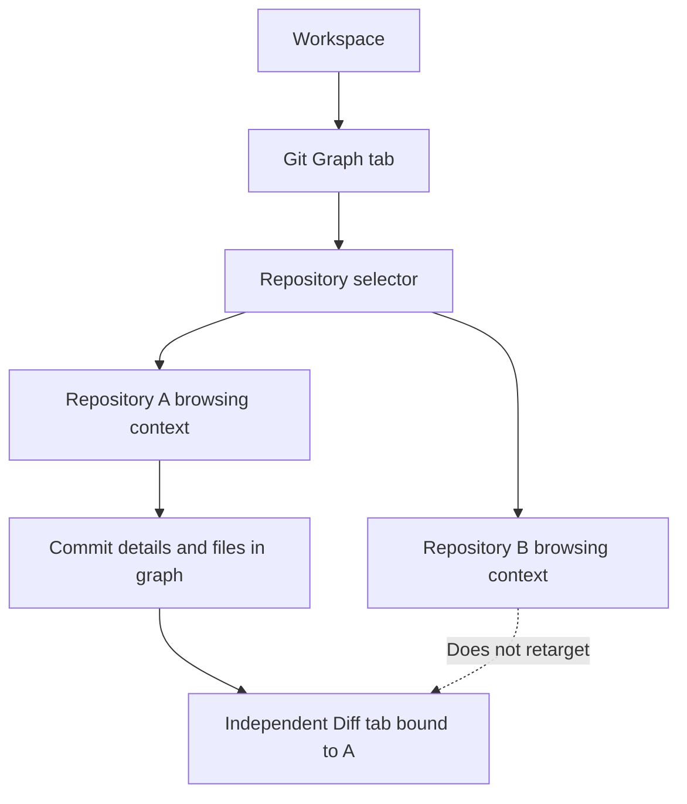
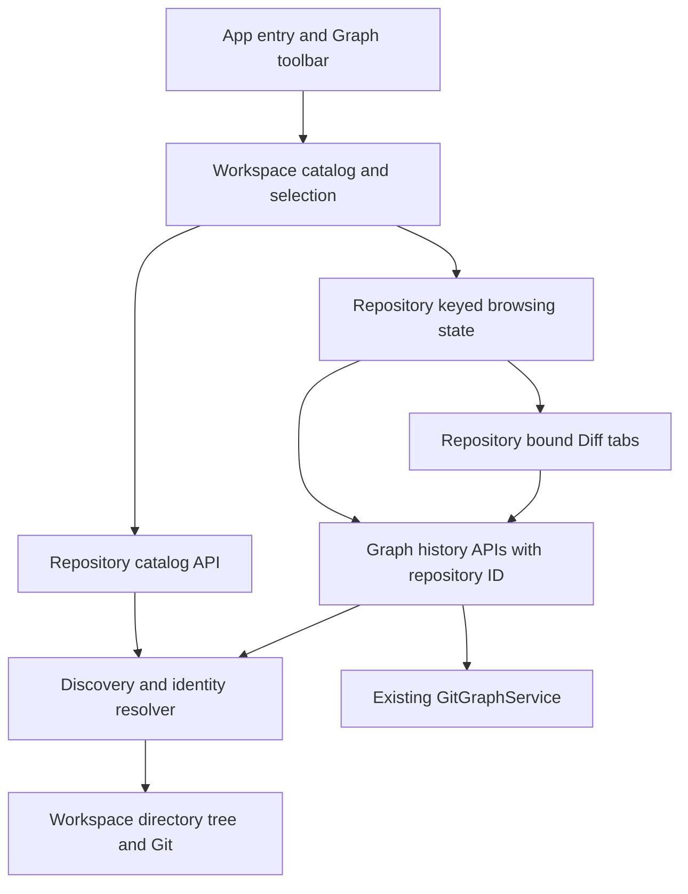
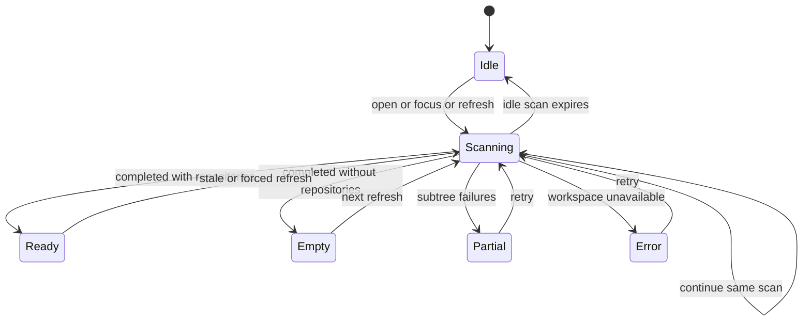
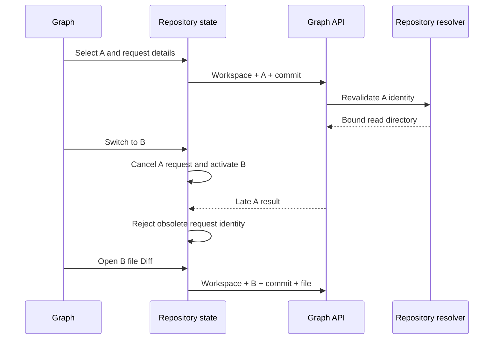

# Workspace Multi-Repository Git Graph - Plan

## Goal Capsule

- **Objective:** Comate 用户无需切换到其他 Git 工具，就能浏览同一 Workspace 内不同项目的分支历史、commit 修改范围和文件 diff。
- **Means:** 在同一个 Workspace Git Graph 页签内自动发现并切换仓库，各仓库拥有独立的浏览上下文（KTD1–KTD6）。
- **Product authority:** 本文 Product Contract 定义多仓库扩展；原 Git Graph 合同按 R14 延续，未提交 Changes 不属于本次范围。
- **Open blockers:** 无待用户决定的范围阻塞项。
- **Execution profile:** Standard；服务端与客户端配套修改，不迁移数据库。
- **Stop conditions:** 若实现需要扩大 Workspace 路径访问范围、改变 R14 的历史比较语义，或缩减已确认的递归发现范围，先回到计划处理冲突。
- **Tail ownership:** 实施者完成 Verification Contract 和 Definition of Done，清理试验代码；不包含发布、推送或合并到主分支。

---

## Product Contract

Product Contract preservation: R1–R14、F1–F2、AE1–AE6 的含义与编号保留；追加用户确认的 R15–R17 和 AE7–AE8，原技术待决问题由 KTD1–KTD6 解答。

### Summary

Git Graph 将支持在一个 Workspace 内发现多个 Git 仓库，并通过页内选择器查看各自的历史。
切换仓库保留各自的浏览上下文，已打开的历史文件 Diff 始终绑定原仓库。

### Problem Frame

用户的 Workspace 可能是多个项目的容器，而不是单一项目的仓库根目录。
这些项目通常位于第一层子目录，也可能位于更深的目录，不能把 Workspace 与一个 Git 仓库视为一一对应。
用户需要在同一任务环境中判断不同项目的分支关系并查看已提交修改。

### Key Decisions

- **新建后续扩展计划。** (session-settled: user-directed — chosen over 重写原 Git Graph 计划: 保留原功能合同，单独表达多仓库增量。) Governs R14.
- **递归自动发现。** (session-settled: user-directed — chosen over 只扫描第一层或依赖手动添加: 项目目录可能位于更深层。) Governs R1, R2.
- **方案 A：页内仓库选择器。** (session-settled: user-directed — chosen over 每仓库独立 Graph 页签或常驻仓库侧栏: 保留图谱空间，避免增加标签页或侧栏负担。) Governs R4.
- **默认直接进入仓库。** (session-settled: user-directed — chosen over 多仓库时要求用户先选再进入: 减少打开 Graph 的一步操作。) Governs R6, R7.
- **子模块属于可浏览仓库。** 用户确认纳入已初始化且可读取的子模块，不承担初始化动作。Governs R2.

<!-- ce-section: work-relationships -->
### How This Work Fits Together

本计划只负责 Git Graph 的多仓库适配。
以下关系描述当前扩展边界，不构成其他 Git 功能的路线图。

- **Depends on:** 原计划 `docs/plans/2026-08-30-2138-feat-git-graph-plan.md` 的历史浏览与文件 Diff 能力；兼容关系由 R14 定义。
- **Shares:** Workspace 级上下文页签的归属语义；仓库切换不改变 Workspace 或聊天会话。

### Requirements

**Repository discovery and availability**

- R1. 自动发现 Workspace 根目录对应的 Git 工作树及后代目录中的独立仓库，不能只识别第一层子目录。
- R2. 发现结果包含已初始化且可读取的 Git 子模块和 linked worktree，不自动初始化尚不可读取的仓库。
- R3. Workspace 内有可浏览仓库时即可打开 Git Graph，不要求 Workspace 根目录本身是仓库，也不要求存在未提交 Changes。

**Repository selection**

- R4. 每个 Workspace 使用一个 Git Graph 页签，通过图内工具栏的仓库选择器切换当前展示的仓库。
- R5. 仓库选项必须能通过名称与 Workspace 相对位置区分，同一仓库不因发现了多个普通子目录而重复列出。
- R6. 打开 Graph 时优先恢复上次仍可用的仓库选择，没有可用的历史选择时自动选中列表中的第一个仓库。
- R7. 仓库列表保持稳定顺序：根目录对应仓库优先，其余按目录深度从浅到深排列，同深度按相对路径排序。

**Repository-bound browsing and diff**

- R8. 图谱、分支筛选、搜索结果和 commit 详情只能属于当前选中的仓库，不把不同仓库的历史合并成一张图。
- R9. 在仓库间来回切换时，分别恢复各仓库的分支筛选、搜索、选中 commit 和滚动位置。
- R10. 选中 commit 后在 Graph 底部显示信息与变更文件，只有点击文件才打开独立的历史 Diff 页签。
- R11. 历史 Diff 始终绑定打开时的仓库、commit 和文件，切换 Graph 仓库不能改变已打开 Diff 的内容归属。
- R12. 不同仓库的同路径文件或相同 commit 标识不能导致 Diff 页签相互覆盖，用户应能识别 Diff 所属仓库。

**Unavailable states and compatibility**

- R13. 仓库消失或不可读取时明确呈现不可用状态，不得把其他仓库的数据冒充为原内容；没有可浏览仓库时不得留下可操作的错误历史。
- R14. 除本计划改变的仓库发现、入口和上下文选择外，继续遵守原 Git Graph Product Contract 的 R2–R13；本计划 R1–R3 替代其仅依赖当前目录的入口限制。

**Discovery boundaries and refresh**

- R15. 扫描跳过 `.git` 内部和 `node_modules`，不沿目录链接扫描 Workspace 外部；其余目录递归发现，不按 `.gitignore` 排除项目。
- R16. 打开 Graph、窗口重新获得焦点或手动刷新时更新仓库列表，不常驻监听整个目录树。
- R17. 扫描未完成时显示扫描状态，不把暂未发现仓库等同于扫描完成且没有仓库。

### Key Flows

- F1. Open a multi-repository workspace graph
  - **Trigger:** 用户在包含多个项目的 Workspace 中打开 Git Graph。
  - **Steps:** 发现仓库，按 R6、R7 选择初始仓库，展示该仓库的图谱；用户通过工具栏切换项目。
  - **Outcome:** Workspace 根目录不是仓库也能浏览其中项目的历史。
  - **Covered by:** R1, R2, R3, R4, R5, R6, R7, R8.

- F2. Inspect changes across repositories
  - **Trigger:** 用户查看仓库 A 的 commit，并点击一个变更文件。
  - **Steps:** 打开 A 的历史 Diff，返回 Graph 切换到 B 浏览历史，再切回 A。
  - **Outcome:** A 的浏览上下文恢复，先前打开的 Diff 仍显示 A 的修改。
  - **Covered by:** R8, R9, R10, R11, R12.

### Acceptance Examples

- AE1. Container directory with clean repositories
  - **Covers R1, R3, R4, R6, R7.**
  - **Given:** Workspace 根目录不是仓库，`apps/web` 和 `services/api` 是无未提交修改的仓库，且没有历史选择。
  - **When:** 用户打开 Git Graph。
  - **Then:** 两个仓库均可选择，并默认展示同深度路径排序在前的 `apps/web`。

- AE2. Root repository and nested repositories
  - **Covers R1, R2, R5, R7.**
  - **Given:** Workspace 根目录是仓库，内部还有独立仓库和已初始化子模块。
  - **When:** 发现完成。
  - **Then:** 根仓库排在第一位，内部仓库分别列出，根仓库的普通子目录不形成重复选项；未初始化子模块不会被自动初始化。

- AE3. Restore a repository choice and its context
  - **Covers R6, R8, R9.**
  - **Given:** 用户在 A 中设置筛选、搜索并选中 commit 后切换到 B。
  - **When:** 用户切回 A，随后在仍保有浏览状态时重新打开 Graph。
  - **Then:** A 的浏览上下文恢复，重新打开优先选择 A，而不是无条件跳到列表首项。

- AE4. Same file path in two repositories
  - **Covers R10, R11, R12.**
  - **Given:** A 和 B 的 commit 都修改了 `src/index.ts`。
  - **When:** 用户分别打开两个 commit 的该文件 Diff。
  - **Then:** 两个 Diff 不会互相覆盖，各自明确归属于原仓库；切换 Graph 选择不会替换其内容。

- AE5. Previously selected repository is unavailable
  - **Covers R6, R11, R13.**
  - **Given:** 上次选择 A，A 随后被移走，Workspace 内仍有 B。
  - **When:** 用户再次打开 Graph。
  - **Then:** 自动选择首个可用仓库 B，既有 A 的 Diff 不改绑到 B；无法继续读取 A 时呈现不可用状态。

- AE6. No repositories or an unreadable repository
  - **Covers R3, R13.**
  - **Given:** Workspace 内没有可浏览仓库，或此前显示的仓库变为不可读取。
  - **When:** 用户访问 Graph 入口或已有的 Graph 页签。
  - **Then:** 不提供会打开错误历史的可用入口，已有页面清楚说明不可用原因，不将陈旧内容作为当前可操作历史。

- AE7. Discovery boundaries
  - **Covers R1, R2, R15.**
  - **Given:** Workspace 内有被 `.gitignore` 忽略的项目、`node_modules`、指向外部目录的软链接和已初始化子模块。
  - **When:** 扫描仓库。
  - **Then:** 被忽略的项目和子模块仍被发现，依赖目录与外部目录链接不被递归扫描。

- AE8. Refresh without a permanent watcher
  - **Covers R6, R13, R16, R17.**
  - **Given:** 用户在外部新增仓库后返回 Comate，此时扫描需要多批完成。
  - **When:** 窗口获得焦点。
  - **Then:** 列表刷新并显示扫描状态，完成后包含新仓库；扫描中的空结果不能显示为最终“无仓库”。

### Scope Boundaries

- 不适配未提交 Changes、Workspace 其他 Git 状态表面或聊天会话的工作目录。
- 不新增 Git 写操作、自动主分支识别、合并状态判断、评论或审查记录；相关历史浏览边界继续由 R14 引用的原合同约束。
- 不增加多仓库合并图、每仓库独立 Graph 页签或常驻仓库侧栏；导航形态由 R4 定义。
- 不增加手动添加任意外部仓库、自动克隆或自动初始化子模块。
- 不新增跨应用重启的 Graph 个性化状态持久化；状态恢复以本次运行内的使用连续性为基线。

---

## Planning Contract

### Key Technical Decisions

- KTD1. **独立的 Workspace 仓库目录服务。** 新增 `git-repository-service`，不把多仓库语义塞进 `git-ref` 或 `git-changes`。服务以目录遍历找到 `.git` 目录或 gitfile 候选，再通过 Git 验证工作树。发现一个仓库后仍继续扫描其子目录，避免漏掉嵌套仓库。根目录额外执行一次工作树探测，以保持 Workspace 位于仓库子目录时的既有能力。Governs R1, R2, R3, R5, R14, R15.
  - 后代候选必须具有自己的有效 `.git`，不能让 Git 向上寻找父仓库而把每个普通目录都列成仓库。裸仓库不作为工作树选项，unborn 工作树则保留并使用原空历史状态。
  - 工作树识别遵循 [Git repository layout](https://git-scm.com/docs/gitrepository-layout) 和 [git rev-parse](https://git-scm.com/docs/git-rev-parse)，由 Git 解析 gitfile，不自行实现 Git 元数据格式。
  - R15 的目录排除规则在扫描边界执行。Workspace 自身路径先规范化；内部目录链接仅在真实目标仍位于该根内时可遍历，按真实路径去重并防环。合法 gitfile 指向外部元数据不等于扫描外部工作树，不能因此拒绝 linked worktree 或子模块。

- KTD2. **有续扫能力的按需发现。** 每个 Workspace 同时最多一个扫描代次；目录处理分批推进，返回已发现选项、代次、完成度和局部错误。客户端仅在入口探测或 Graph 可见时驱动后续批次，不能每次轮询都从根重扫。Governs R6, R7, R13, R16, R17.
  - 初始批预算为 250 个目录、最多 4 个并发 Git 探测；单次 Git 探测沿用 5 秒超时。预算结束保存遍历位置，正常完成前不设固定层数截断。后续批继续剩余位置，故深层仓库不会因单批限额永久不可达。
  - 使用单活动目录迭代器分批枚举，不一次性把整个目录树或超大目录读入内存。跨批保留当前迭代器，子目录进入服务端待扫队列；目录扫完、取消或闲置超时后释放句柄。续扫状态属于服务端，不接受客户端提供路径队列。
  - 完成的列表可缓存 30 秒；手动刷新强制重扫，打开及 focus 复用新鲜列表或启动重扫。扫描中再次收到这些触发时复用当前代次。闲置未完成扫描 60 秒后释放，恢复访问时明确重启扫描，不伪装已完成。
  - 新列表完成前，不依据“尚未重新发现”删除旧选项或认定原仓库消失。当前选项仍须通过 KTD3 的逐请求校验。所有可继续的扫描工作结束后，即使有局部错误，无历史选择时也从已验证可用仓库中自动选第一项，并保留扫描不完整提示；失败子树中未重新发现的旧选项不按缺席判定删除。扫描期间用户可主动选择已发现仓库，完成时不覆盖该选择。
  - 排序由服务端统一执行，路径分隔符统一为 `/`，同深度采用稳定的非 locale 字符串顺序。权限失败只影响该子树；局部失败显示“扫描不完整”及可重试信息，不能宣称全量为空。

- KTD3. **服务器绑定仓库身份与读取目录。** 列表返回不含绝对路径的 `repositoryId`、名称、相对位置与可用性；客户端不直接指定 Git 命令的 cwd。服务器将 ID 绑定到 Workspace、规范化读取目录和实际 Git 元数据身份。Governs R5, R8, R11, R12, R13.
  - 身份区分具体工作树，不按共享的 common Git directory 合并 linked worktree。普通仓库以根目录读取；Workspace 位于上级仓库子目录时，根选项继续以 Workspace 目录读取，不扩大原历史文件范围。
  - ID 在同一仓库的重新扫描间稳定；绑定还包含文件系统对象身份，防止目录被替换后旧 ID 指向另一个仓库。刷新 refs、commit 或文件不改变 ID；移动或替换工作树不自动迁移历史 Diff。
  - 每次图谱、详情和 Diff 读取前校验 Workspace 仍存在、真实读取路径仍满足发现边界、Git 元数据仍匹配。后代仓库的 `.git` 消失时不得退回父仓库。校验失败返回仓库不可用，不回退其他仓库。
  - 沿用现有 hash、ref、变更文件成员校验以及 `execFile` 参数数组；仓库 ID 不参与 shell 拼接。缓存键增加仓库实例身份，避免原有仅 `folderPath + hash` 缓存在仓库替换后串用。

- KTD4. **在现有 Graph API 上增加仓库维度。** 新增静态 `GET /api/workspaces/:id/git-graph/repositories`，并在现有图谱、commit 详情和 Diff GET 请求中增加 `repositoryId`。静态路由必须位于 `/:hash` 前。Governs R3, R8, R11, R13, R14.
  - 图谱、详情和 Diff 的成功响应回传绑定的仓库 ID；客户端拒绝与请求身份不一致的响应。具体字段类型由 `src/server/models/git-graph.ts` 维护，前端使用 type-only 引用，避免继续复制协议类型。
  - 新 UI 总是传 ID。缺省 ID 的旧调用只保留 Workspace 根选项语义；根不是工作树时仍不可用，不能隐式选择子仓库。这样旧调用不会随列表排序改变读取对象。
  - Workspace 不存在为 404；非法查询为 400；未知、被移除或身份不匹配的仓库为带机器可读代码的 409；单项扫描失败在目录响应内表达；真正的内部故障为 500。详情和 Diff 与 snapshot 使用一致的不可用错误映射。
  - 仓库目录缓存失效时先恢复该 Workspace 的目录解析，再决定 ID 是否仍有效；新客户端通过刷新目录重试。旧 ID 绝不按“第一项”解释。

- KTD5. **两层前端状态与独立请求身份。** `git-graph-store` 保留 Workspace 层的目录、扫描状态和当前仓库，原浏览状态整体移入该 Workspace 的 repository map。Governs R4, R6, R8, R9, R13.
  - snapshot、detail、筛选、搜索、加载量和滚动锚点均使用 Workspace + repository ID 键；动作捕获调用时的键，不在响应后读取“当前选择”作为写入目标。
  - 保留 AbortController，并校验具体 controller 身份和代次。清理 Workspace 后重新打开不能重用可被旧响应命中的代次。切换时取消旧仓库未完成请求并复位其 loading 状态，保留已加载内容。
  - Graph 内的浏览子视图按仓库键挂载，离开前保存滚动锚点；还原标记、行 DOM 引用和 HEAD 提示不得跨仓库复用。刷新后失效的选中 commit 按既有 HEAD/首项回退规则处理。
  - App 的入口探测与 Graph 共用目录状态和刷新调度，避免双重 focus 扫描。根 `git-ref` 能力不再决定 Graph 入口，仍保持其他调用方原有语义。扫描中入口展示不可点击的检查状态；已有选项可打开，完整空列表则不展示可打开的入口。

- KTD6. **历史 Diff 保存打开时的仓库描述。** `CommitDiffContextTab` 增加 repository ID、名称和相对读取根；将 ID 加入现有长度前缀编码的页签标识与请求键。Governs R10, R11, R12, R13.
  - 传给 Git API 的文件路径仍相对所选读取根；展示时在 Workspace 路径与文件路径之间加入仓库相对根，避免显示错误绝对路径。文件名与语法高亮输入保持纯文件名，仓库标识在页签 tooltip 或历史 Diff 标题中单独呈现。
  - 加载、错误、二进制和 gitlink 占位也显示所属仓库。切换 Graph 不重取、不改绑现有 Diff；关闭再打开同一 Diff 的旧响应不能复活已关闭页签。
  - 对已载入的历史 Diff，仓库不可用后保留只读内容并标明来源不可用；尚未完成读取的 Diff 显示不可用错误。恢复读取仍要求原 ID 通过 KTD3，不能回退到别的仓库。

### High-Level Technical Design

**Components and data ownership — KTD1–KTD6**

**Discovery lifecycle — KTD2 and KTD5**

**Request isolation — KTD3–KTD6**

API shapes and error branches are owned by KTD4; these diagrams show their relationships, not additional behavior.

### System-Wide Impact and Risks

- **Path boundary:** 复用 `src/server/routes/files.ts` 的规范化后包含性校验思路，不复用文件搜索的 `.gitignore` 规则。KTD3 必须覆盖仓库移除后 Git 向上寻址的回退风险。
- **Availability:** 仅更换 Graph 的能力来源，不更改 `git-status.ts`、`git-changes.ts` 或 Workspace 的 `folderPath` 模型。无需数据库迁移。
- **Resource lifecycle:** 扫描、目录缓存和请求控制器按 Workspace 清理；服务端扫描闲置回收按 KTD2。客户端 Workspace 删除与 store reset 应同时清理目录和全部仓库状态。
- **Read-only posture:** 所有新增接口位于现有认证中间件后；发现和读取不执行 init、fetch 或写 Git 配置。Git 运行环境不得被请求参数覆盖。
- **Agent access:** 本次实现可复用的受认证读取 API，不把仓库解析逻辑藏在 UI。专用 MCP/CLI 导航工具及向 Agent 注入“当前选中仓库”不属于本次范围，不能因用户切换 Graph 而改变 Agent 的工作目录。
- **Rendering:** `CodeMirrorDiffViewer` 由 Changes 和历史 Diff 共用。优先在历史 Diff 的适配层补来源信息；如需新增通用展示参数，应保持 Changes 默认行为并增加回归覆盖。
- **Filesystem races:** 路径和 Git 元数据的前后校验降低目录被替换时的误读风险，但不承诺抵御拥有同用户文件系统写权限的恶意并发替换；不因此放松正常请求的路径边界校验。

### Sources and Research

- `src/server/routes/git-graph.ts`、`src/server/services/git-graph-service.ts` — 当前请求以 Workspace 路径读取历史，commit 缓存需要跟随 KTD3 的身份改造。
- `src/client/stores/git-graph-store.ts` — 现有取消与代次模式，KTD5 扩展其键空间并修正清理后代次复用风险。
- `src/client/stores/context-tab-store.ts` — 现有页签编码和 controller 身份校验，KTD6 延续该模式。
- `src/client/components/git-graph/GitGraphPanel.tsx`、`src/client/components/ContextWorkspace.tsx` — 滚动恢复、历史 Diff 与 Workspace 路径适配边界。
- `src/server/services/file-search-fallback.ts` — 参考分批/截断与硬排除思路，不沿用其 Git ignore 策略。
- `docs/solutions/conventions/use-isolated-test-database-for-comate.md` — 服务端测试必须先导入隔离环境，不能访问真实用户数据库。
- `docs/solutions/integration-issues/sse-subscription-race-condition-2026-05-21.md` — 旧资源清理必须匹配当前身份；用于 KTD5 的请求回归场景。

### Deferred to Implementation

- 扫描批预算可通过大目录夹具调整；不得取消续扫、改变 R15 排除范围，或将超时/局部失败显示为完整空结果。
- 原生文件系统对象标识在 Windows 的可用性需由跨平台测试验证；如不足，应使用同等稳定的实例标识，不退化为只比较目录字符串。
- 最终组件拆分和 helper 命名由实现决定，保持 KTD 的归属与测试边界。

---

## Implementation Units

### U1. Discover and identify Workspace repositories

- **Goal:** 提供可续扫、可校验的 Workspace 仓库目录。
- **Requirements:** R1, R2, R5, R7, R13, R15, R17；F1；AE1, AE2, AE7.
- **Dependencies:** 无。
- **Files:** 新增 `src/server/services/git-repository-service.ts` 和 `src/server/services/git-repository-service.test.ts`；修改 `src/server/models/git-graph.ts`。
- **Approach:** 实现 KTD1–KTD3 的发现、目录排序、续扫状态及身份解析边界；遍历器与 Git runner 可注入，以便确定性测试超时和权限失败。
- **Patterns to follow:** `src/server/routes/files.ts` 的路径包含性校验；`src/server/services/git-graph-service.test.ts` 的临时 Git 仓库夹具。
- **Execution note:** 先建立真实仓库识别与失败路径的测试，再接入 UI。
- **Test scenarios:**
  1. Covers AE1, AE2. 根目录为容器、根目录为仓库、深层嵌套和同名项目分别得到正确且稳定的列表；普通子目录不重复。
  2. Covers AE7. 已初始化子模块、linked worktree、unborn 工作树可发现；裸仓库和未初始化子模块不作为可浏览工作树。
  3. Covers AE7. `.gitignore` 不隐藏仓库；硬排除目录和外部目录链接不遍历，内部链接去重，循环链接不挂起。
  4. 小批预算下连续续扫最终到达深层仓库；代次复用不重扫；超大目录分批处理，不截断其后部仓库。
  5. 一个子树 EACCES 或 Git 探测超时不阻断其他仓库，结果保持不完整标记；恢复权限后重试可发现。
  6. 删除后代仓库 `.git` 后不能解析为父仓库；替换原路径仓库后旧 ID 不匹配；共享 common directory 的两个 worktree 不合并。
  7. Workspace 位于仓库子目录时仅产生一个根选项，读取范围仍是该子目录；Workspace 自身是软链接时按规范化根处理。
- **Verification:** 真实 Git 与可控文件系统夹具共同证明发现范围、排序、失败隔离和续扫终止条件。

### U2. Bind Graph read APIs to repository identity

- **Goal:** 让图谱、commit 详情和 Diff 使用同一个服务端验证的仓库目标。
- **Requirements:** R3, R8, R11, R13, R14；F1, F2；AE5, AE6.
- **Dependencies:** U1。
- **Files:** 修改 `src/server/routes/git-graph.ts`、`src/server/routes/git-graph.test.ts`、`src/server/services/git-graph-service.ts`、`src/server/services/git-graph-service.test.ts`、`src/server/models/git-graph.ts`。
- **Approach:** 按 KTD3、KTD4 接入目录路由和统一目标解析；保持 `git-status` 和 Changes 路由合同不变。向 commit 缓存传递实例身份，保留原历史算法。
- **Patterns to follow:** 现有 route 测试的临时仓库与隔离 Workspace store；原 hash/path 验证和第一父提交比较测试。
- **Test scenarios:**
  1. 同一 Workspace 下 A、B 的历史请求、详情和 Diff 均仅返回所选仓库数据，并回传对应 ID。
  2. 静态目录路由不被 `/:hash` 捕获；缺省 ID 在原根仓库可用，在纯容器根不会静默选子仓库。
  3. Covers AE5, AE6. 未知 ID、已移除仓库、过期实例和非法路径在三类历史接口得到一致的可辨识错误。
  4. 拒绝其他 Workspace 的 ID、绝对路径、路径穿越和外部 symlink 目标，不把任何请求值当 shell 参数串执行。
  5. 在两个仓库内放置同路径文件及共享 commit 对象，验证缓存隔离；替换仓库后旧实例缓存不可命中。
  6. 根 commit、merge 第一父提交、重命名、删除、binary/gitlink 和原 Workspace 子目录范围测试保持通过。
- **Verification:** 路由与服务集成证明参数、身份、缓存和历史比较一致，且原根目录调用保持兼容。

### U3. Separate catalog state from repository browsing state

- **Goal:** 在切换和异步刷新过程中保持每个仓库的浏览上下文。
- **Requirements:** R6, R7, R8, R9, R13, R16, R17；F1, F2；AE3, AE5, AE8.
- **Dependencies:** U2。
- **Files:** 修改 `src/client/stores/git-graph-store.ts`、`src/client/stores/git-graph-store.test.ts`；类型引用 `src/server/models/git-graph.ts`。
- **Approach:** 按 KTD2、KTD4、KTD5 拆分目录和浏览状态；统一 open/focus/refresh 的扫描协调，不在组件中再建第二套目录状态。
- **Patterns to follow:** 现有 snapshot/detail 取消机制及 `context-tab-store` 的具体 controller 身份校验。
- **Test scenarios:**
  1. Covers AE3. A→B→A 恢复筛选、搜索、加载量、commit 和滚动锚点；打开优先恢复仍有效的选择。
  2. 无历史选择时，分批结果不提前固定错误首项；扫描终止后按已发现列表排序默认首项，包括局部失败但存在可用仓库的情况；用户在扫描期间主动选择不会被覆盖。
  3. A 的旧 snapshot/detail 在切换 B、clearWorkspace 后重开 A 或 reset 后返回，均不能覆盖新状态。
  4. Covers AE5. 完整刷新确认 A 消失时回退首个可用仓库；中间批尚未发现 A 时不误判消失。
  5. Covers AE8. focus 与手动刷新重叠时复用同一代次；连续批完成后停止轮询；隐藏/卸载后停止续扫并清理控制器。
  6. Covers AE6. 扫描失败、局部失败、完整空结果和仓库不可用分别有可区分状态，错误响应不会继续显示可操作的旧历史。
- **Verification:** 用可控 Promise 和计时器证明状态恢复及请求隔离，不依赖真实网络时序。

### U4. Preserve repository identity in historical Diff tabs

- **Goal:** 历史 Diff 的身份、请求和显示路径均固定在来源仓库。
- **Requirements:** R10, R11, R12, R13；F2；AE4, AE5.
- **Dependencies:** U2, U3。
- **Files:** 修改 `src/client/stores/context-tab-store.ts`、`src/client/stores/context-tab-store.test.ts`、`src/client/components/ContextWorkspace.tsx`、`src/client/components/ContextWorkspace.test.tsx`。
- **Approach:** 按 KTD6 扩展页签描述和长度前缀身份，历史 Diff 适配层合成展示路径并显示来源；不改变通用 Changes 路径及文件打开语义。
- **Patterns to follow:** `commitDiffTabId`、`commitDiffRequestKey`、已关闭页签请求清理和现有历史 Diff 适配分支。
- **Test scenarios:**
  1. Covers AE4. A、B 使用完全相同 hash、base hash、oldPath 和 path 时仍产生两个页签；同仓库重复打开复用原页签。
  2. Covers AE4. 切换 Graph 仓库不改动既有 Diff，也不触发其自动重取。
  3. 嵌套仓库文件标题和路径正确，传给服务端的路径不重复添加仓库前缀；纯文件名仍用于语法高亮。
  4. Covers AE5. 来源仓库被移除后，已加载内容带不可用提示，未完成读取显示来源错误，不展示其他仓库文件。
  5. 关闭、重新打开或清空 Workspace 后迟到的 Diff 响应不能复活旧页签；响应 repository ID 不匹配时拒绝应用。
  6. Changes、普通 File、binary/gitlink 占位及窄面板 Diff 的既有表现不回归。
- **Verification:** 页签单元测试和 ContextWorkspace 渲染测试共同验证身份、来源、路径和现有表面兼容性。

### U5. Integrate repository discovery and selection into Git Graph

- **Goal:** 提供可发现的 Graph 入口、仓库选择器和不串仓库的浏览界面。
- **Requirements:** R3, R4, R5, R6, R9, R10, R13, R16, R17；F1, F2；AE1, AE3, AE6, AE8.
- **Dependencies:** U3, U4。
- **Files:** 修改 `src/client/App.tsx`、`src/client/components/AppLayout.test.tsx`、`src/client/components/git-graph/GitGraphPanel.tsx`、`src/client/components/git-graph/GitGraphToolbar.tsx`、`src/client/components/git-graph/GitGraphPanel.test.tsx`、`src/client/i18n/en/common.json`、`src/client/i18n/zh-CN/common.json`。
- **Approach:** 按 KTD5 接入共享目录状态；工具栏保持挂载以便错误时切换仓库，浏览区按 repository ID 隔离挂载。接通 KTD6 的文件打开参数，保留详情位于 Graph 底部。
- **Patterns to follow:** 现有工具栏筛选的可访问标签、i18n、focus 处理和滚动锚点恢复。
- **Test scenarios:**
  1. Covers AE1. 根不是 Git 且子项目没有 Changes 时，仍可从右侧添加菜单打开 Graph。
  2. Covers AE6, AE8. 入口扫描中、完整无仓库、扫描错误和部分成功均有明确状态；失败可重试，不留下永远不可恢复的隐藏入口。
  3. Covers AE3. 切换仓库后恢复对应滚动位置；搜索定位、HEAD 定位和错误提示不使用上一仓库的 DOM 引用。
  4. 同名仓库以相对位置区分；长路径不撑破工具栏；键盘可选择仓库，屏幕阅读器能识别当前仓库与扫描状态。
  5. Covers F2. 选择 commit 只更新底部详情，点击文件才打开独立 Diff；返回 Graph 保持仓库和浏览上下文。
  6. 快速切换 Workspace 或 Session 不串用仓库目录；一个 Workspace 的多个 Session 仍共享一个 Graph 页签。
- **Verification:** jsdom 覆盖交互状态，真实浏览器验证宽/窄面板下的选择器、详情与 Diff 导航。

---

## Verification Contract

所有运行验证属于实现阶段；计划编写不执行测试或构建。
新增服务端测试第一条 import 必须是 `src/server/test-utils/test-env.ts` 对应导入，夹具只使用独立临时目录，不操作用户现有仓库或数据库。

| Gate | Scope | Required evidence |
| --- | --- | --- |
| `npm run test:server` | U1, U2 | 发现、路由和历史比较测试通过，包括真实子模块/linked worktree 与失败路径 |
| `npm run test:client` | U3–U5 | store 竞态、Diff 身份、入口和 Graph 交互测试通过 |
| `npm run typecheck` | U1–U5 | 协议与页签类型在客户端、服务端和 Electron 中一致 |
| `npm run lint` | U1–U5 | 测试隔离约束、hooks 和项目规范通过 |
| `npm run build` | U1–U5 | 服务端及客户端产物可构建，type-only 引用不将服务端运行时代码带入客户端 |
| Real browser acceptance | F1, F2, AE1–AE8 | 使用临时多仓库 Workspace 完成图谱→详情→Diff→切换仓库→返回流程，并记录宽/窄面板截图 |

浏览器夹具至少包含：非 Git 容器根、第一层项目、深层项目、已初始化子模块、同名/同路径文件，以及可移走的仓库。
验收应覆盖扫描中的状态、刷新新增仓库、移走仓库、键盘切换与快速 A→B→A；确认未执行 Git 写操作。
本次不涉及安装包、发布或 Electron 壳协议，发布级验收不作为完成门槛；若实施扩大到这些范围，应先更新计划。

---

## Definition of Done

- U1 的识别、路径边界和续扫结果由真实 Git 夹具与失败注入证明。
- U2 的三类历史读取及缺省 ID 兼容行为通过路由/服务测试。
- U3 的目录与浏览状态隔离通过迟到响应、清理和恢复测试。
- U4 的 Diff 身份、路径和来源状态通过跨仓库冲突测试。
- U5 的入口与选择器完成真实浏览器验收，R1–R17 及 AE1–AE8 均有对应证据。
- Verification Contract 的适用门槛全部完成，阻塞失败不得以“未验证”替代通过。
- 无未授权 Git 写操作，无数据库迁移，未提交 Changes 与聊天工作目录保持原语义。
- 移除废弃尝试、调试代码和重复协议定义；临时夹具只清理本次创建的资源，不动用户数据。
- 交付说明包含变更、验证结果及剩余限制；本计划的完成不代表已经推送、合并或发布。
