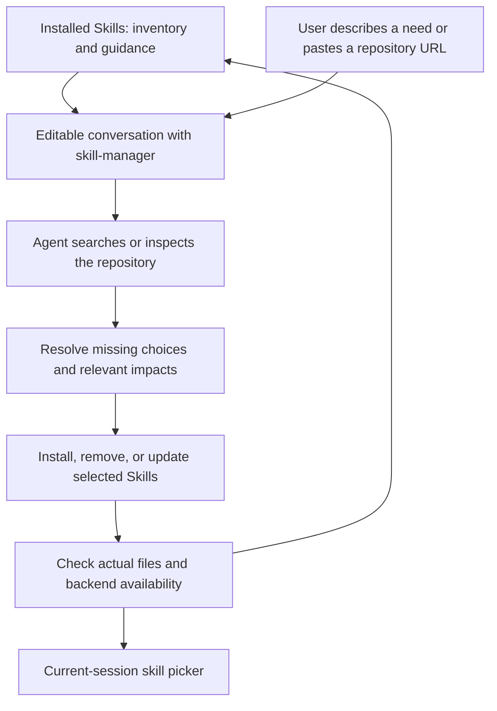
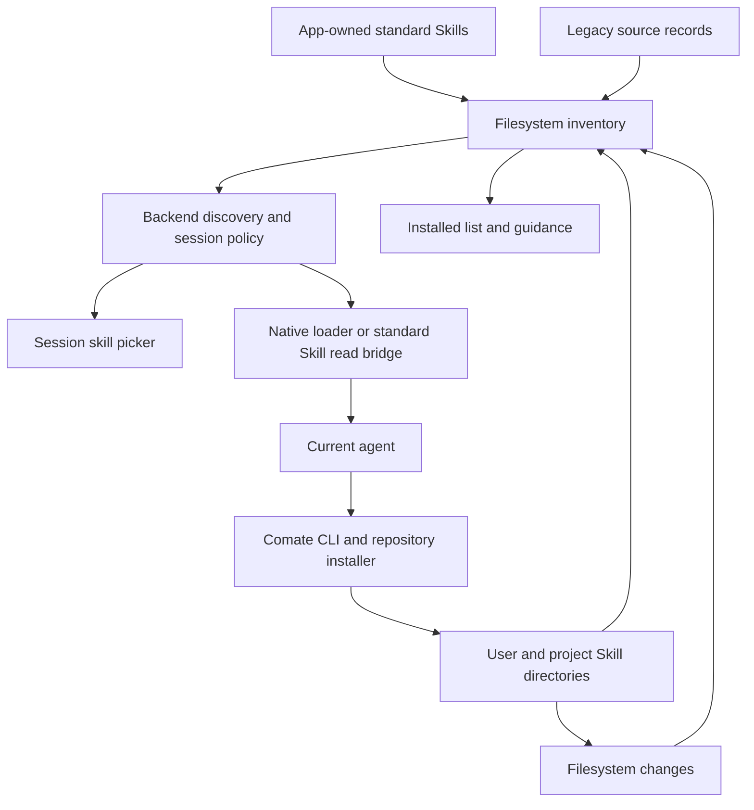
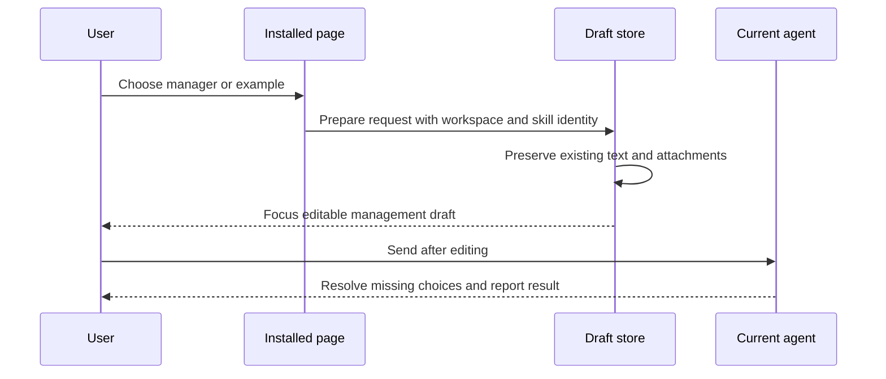
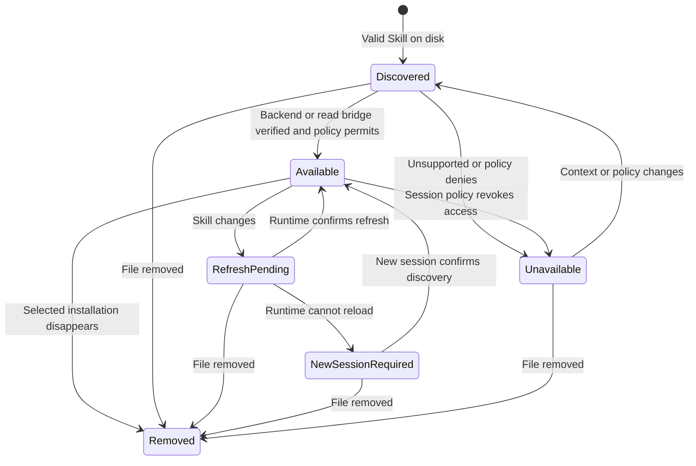
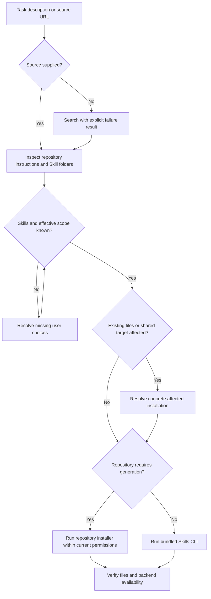

# Conversational Skill Management - Plan

## Goal Capsule

- **Objective:** 用户通过对话发现、安装和管理 Skills，并能在 Claude Code、Codex、OpenCode 会话中清楚地找到和使用实际可用的 Skills。
- **Means:** 内置 `skill-manager`，保留已安装列表和 Prompt skill picker，把原有图形化发现与安装流程交给 agent。
- **Product authority:** 本文 Product Contract 与对话中已确定的命名和边界；涉及 Skills 产品入口时，本文取代旧的安装管理、搜索、专家包和企业专区界面约定。
- **Authority:** 产品行为以 R-IDs 为准，技术机制以 KTD-IDs 为准；实施单元不能改变两者。
- **Execution profile:** 按 U1–U6 的依赖执行，优先证明加载、权限与磁盘身份，再退役旧入口。
- **Stop conditions:** 若现有后端无法在既有权限内读取标准 Skills，或迁移需要删除来源不明的用户内容，停止相关变更并报告，不扩大权限或恢复 plugin 依赖。
- **Tail ownership:** 实施者完成 Verification Contract 与 Definition of Done；发布和远程推送沿用用户授权范围。

---

## Product Contract

### Summary

Comate 提供内置 `skill-manager`，让用户通过需求描述或仓库地址完成 Skills 的发现、安装、删除和更新。
Skills 页面保留真实安装清单及对话引导，Prompt skill picker 展示当前会话可用的 Skills。
Comate 内置 Skills 跨后端加载，不再依赖 Claude Code plugin 分发。

### Problem Frame

现有 Plugin Manager 绑定 Claude Code 的配置、缓存与安装机制，而 Comate 已支持三个 Agent 后端。
Skills 页面另行维护搜索、安装弹窗、专家包和企业专区，但典型社区仓库的安装结构并不一致。
这些差异需要理解仓库说明，固定表单与内置安装分支的维护成本随之增长。
已安装列表依赖安装记录，不能完整代表 agent 或外部工具安装后的文件状态。

### Key Decisions

- **标准 Skills 作为内置能力的分发基础。** (session-settled: user-directed — chosen over per-backend plugin delivery: the user requires shared Skills rather than a plugin dependency.) Governs R1–R3.
- **管理入口命名为 `skill-manager`。** (session-settled: user-directed — chosen over `comate-skill-manager`: the user explicitly chose the shorter name.) Governs R1.
- **管理操作通过对话完成。** (session-settled: user-approved — chosen over unrestricted ad hoc agent installation and dedicated installation forms: a bundled Skill supplies consistent guidance while the agent interprets repository-specific instructions.) Governs R4–R9.
- **移除独立发现界面。** (session-settled: user-directed — chosen over retaining Search, Expert Packages, and Enterprise Zone: discovery should also happen through conversation, following the find-skills pattern.) Governs R10.
- **已安装页承担使用引导。** (session-settled: user-directed — chosen over a bare inventory page: users must be shown how to use skill-manager.) Governs R11–R13.
- **优先复用现成工具。** 安装机制以现有 Skills CLI 或仓库提供的方式为基础，具体选择留给规划，避免重建完整的多平台安装产品。Governs R7.

### Actors

- A1. **Comate 用户：** 描述需求、提供来源、选择范围并决定安装或删除。
- A2. **当前会话的 Agent：** 按 `skill-manager` 的说明调查来源、与用户确认、执行并验证。
- A3. **Comate：** 提供内置 Skills、安装清单、会话可用性和界面到对话的入口。

### Requirements

**Bundled Skills**

- R1. Comate 随应用提供名为 `skill-manager` 的标准 Skill，用户无需先自行安装即可在受支持会话中使用。
- R2. `skill-manager` 与原企业微信 plugin 中的消息、文件和文档 Skills 通过 Skills 机制供 Claude Code、Codex、OpenCode 加载。
- R3. 内置 Skills 的可用性遵守已有集成配置、会话身份和权限规则，业务执行仍使用相应 CLI、MCP 或服务。

**Conversational management**

- R4. 用户描述需求时，`skill-manager` 搜索并解释候选 Skills 的用途和来源；提供 HTTPS 或 Git 地址时直接检查该来源。
- R5. 安装前明确用户选择的 Skills、项目级或用户级 scope，以及目标 Agent 范围，已明确的信息不重复询问。
- R6. 覆盖、删除和更新必须绑定明确的实际安装对象与范围，不得因同名、目录共享或软链接误操作其他安装。
- R7. 安装必须保留所选 Skill 所需的配套文件与路径关系，并处理单 Skill、多 Skills 集合及平台生成式安装的差异。
- R8. 删除和更新通过 `skill-manager` 完成，对来源不明或有本地修改的安装先解释实际影响再执行。
- R9. 管理操作依据实际结果报告成功、失败或部分成功，并说明何时能在当前后端使用；搜索服务不可用不能报告成确定的无匹配结果。

**Product surfaces and guidance**

- R10. 移除独立 Plugin 管理与市场入口，以及 Skills 的 Search、Expert Packages、Enterprise Zone 和直接安装、删除、更新表单或动作。
- R11. 已安装页在空列表和非空列表下都说明 `skill-manager` 的作用，并提供可发现的“使用 skill-manager”对话入口。
- R12. 页面提供发现、按地址安装、删除和更新的自然语言示例，用户无需先知道命令名或安装目录。
- R13. 引导入口和示例将用户带到当前工作区的可编辑对话输入，携带 `skill-manager` 引用而不自动发送或丢失原有草稿。
- R14. 已安装页展示实际发现的 Skills、scope、安装位置及可获得的来源信息，覆盖 Comate 之外安装的 Skills。
- R15. Prompt skill picker 只把当前会话后端可发现且获准使用的 Skills 作为可选项，名称相同的不同安装不得混淆。
- R16. 文件或管理操作产生变化后，清单和 picker 能刷新到实际状态，后端尚未加载的安装明确呈现生效条件。

**Migration and ownership**

- R17. 移除管理界面及旧内置 plugin 安装流程时保留用户已有的 Skill 文件、安装来源和仍可使用的内容，不批量卸载第三方插件。
- R18. 内置 Skills 标记为由 Comate 维护，应用更新负责其版本；用户安装的 Skills 不被应用更新覆盖。
- R19. 旧专家包安装中的编排项和子 Skills 在新清单中继续可见，撤掉目录入口不等同于撤销既有安装。

### Key Flows

- F1. **从已安装页开始。** 用户打开 Skills 页面，阅读引导或点击示例，在当前工作区的会话输入中编辑请求后发送；无现有会话时沿用工作区的新会话流程。Covers R11–R13.
- F2. **按需求发现。** Agent 解释搜索结果或搜索失败；用户选择候选来源后进入安装流程，未找到合适 Skill 时仍可继续普通任务。Covers R4, R9.
- F3. **按链接安装。** Agent 检查来源、列出候选，补齐 R5 所需选择，按 R6–R7 执行，按 R9 报告并触发 R16 的展示更新。
- F4. **删除或更新。** Agent 基于实际安装清单识别对象，消除 scope 和同名歧义后执行；用户修改选择或取消时停止尚未执行的变更。Covers R6, R8–R9, R14, R16.
- F5. **切换 Agent。** 用户在另一个后端的新会话中打开 picker，看到该后端实际可用的内置和用户 Skills，而非上一后端的缓存结果。Covers R2–R3, R15–R16.

页面的信息顺序为：解释管理方式与主入口、可点击的自然语言示例、已有 Skills 清单。
空状态保留前两部分，并把空列表说明指向同一对话入口；非空状态不把引导藏到帮助菜单。

**引导文案草案（落实 R11–R13）：**

> 用对话管理你的 Skills
>
> 告诉 skill-manager 你想完成什么，或直接提供 Skill 的仓库地址。它会帮你查找、安装、删除和更新 Skills，并在需要时和你确认安装范围与具体选择。
>
> **使用 skill-manager**

可点击的示例：

- “帮我找一个适合做演示文稿的 Skill。”
- “帮我安装这个仓库里的 Skill：[粘贴 HTTPS / Git 地址]。”
- “帮我删除不再使用的 Skill。”
- “检查我安装的 Skills 是否有更新。”

空列表说明使用“还没有安装用户 Skills，从上方的 skill-manager 开始”，避免把已随应用提供的内置 Skills 描述为不存在。
示例只准备可编辑的请求；具体管理对象和范围仍由 F3、F4 的对话确定。

### Acceptance Examples

- AE1. **没有用户 Skills。** 用户首次打开已安装页，能看懂管理方式，并用“找一个适合做演示文稿的 Skill”开始对话；内置 `skill-manager` 已可用。Covers R1, R11–R13.
- AE2. **输入框已有草稿。** 用户从已安装页点击安装示例，原草稿完整保留，生成的管理请求未经发送，用户能够编辑或取消。Covers R13.
- AE3. **地址和范围已明确。** 用户要求“把这个仓库里的设计 Skill 安装到当前项目，供三个 Agent 使用”，只对未确定的具体 Skill 或实际覆盖影响提问。Covers R4–R7.
- AE4. **多 Skill 仓库。** 用户只选 Compound Engineering 的一个 Skill，安装不擅自包含其他 Skills，但所选目录下的引用文件完整保留。Covers R5, R7.
- AE5. **需要生成文件的仓库。** UI UX Pro Max 安装后，脚本和数据位于说明能够正确引用的位置，未依赖 plugin 激活。Covers R2, R7, R9.
- AE6. **外部安装与同名项。** 用户手工安装了一个 Skill；新清单能够显示它，而删除请求遇到项目级和用户级同名安装时先确定对象。Covers R6, R14–R15.
- AE7. **部分成功或后端待加载。** 安装两项时一项失败，agent 和页面不显示全部成功；需要新会话加载的项明确告知用户。Covers R9, R16.
- AE8. **旧版本升级。** 原有用户 Skills 和专家包内容仍在，用户找不到旧管理表单时，可从已安装页引导进入 `skill-manager`。Covers R10–R11, R17–R19.
- AE9. **企业微信跨后端。** 在具备相同配置与授权的测试会话中，三个后端均能发现适用的企业微信 Skills，并以各自会话身份执行测试操作。Covers R2–R3.
- AE10. **取消或搜索失败。** 用户在选择完成前取消时不安装；搜索端点不可访问时报告查询失败，保留继续按仓库地址安装的路径。Covers R4–R5, R9.

### Scope Boundaries

- 当前工作是一个完整的对话式 Skills 管理交付，包含内置 Skill 分发、旧入口退场及清单与 picker 的衔接。
- 不创建 Comate plugin 协议、跨平台 plugin 转换器或独立 Skill 市场。
- 不重建各国内与企业目录的图形化浏览，也不承诺 `find-skills` 默认搜索能覆盖这些目录；明确来源地址仍进入 R4 的安装流程。
- 不把浏览器、MCP、Bot 通道等所有执行能力重写成 Skills；R2 迁移的是内置 plugin 已承载的 Skill 内容。
- 不借此次改造扩大 Bot 用户权限、自动安装所有依赖或自动升级用户所有 Skills。
- 不实现 Skill 创建器、发布市场、账号体系或独立供应链审计产品。

### Dependencies and Assumptions

- 三个后端都有 Skills 加载能力，但搜索目录、发现刷新和手动调用语义需要分别适配；标准文件格式不代表宿主行为完全相同。
- `find-skills` 提供发现与推荐的参考流程，底层 Skills CLI 提供安装、列举、删除和更新能力；不直接照搬其全局 `-g -y` 安装示例作为产品默认值。
- 现有仓库已经 vendored Vercel Skills CLI 1.5.11，Comate 服务层另有移植实现；是否复用、升级或改为外部工具由规划验证。
- 安装陌生仓库可能需要其专用生成器或额外运行环境；R9 要求报告未完成项，不能假设目录复制能够解决所有依赖。
- R10 中旧 Plugin 产品入口退场沿用原始去 plugin 方向；R17 把退场与用户机器上已有第三方安装区分开。

### Sources and Research

- `src/server/services/plugin-settings-service.ts:60`：旧安装缓存和 scope 配置绑定 Claude Code。
- `src/server/services/builtin-plugin-service.ts:42`、`src/server/services/bot-access-policy.ts:796`：企业微信自动安装及 Bot plugin 注入。
- `claude-code-plugin/plugins/wecom/skills/`、`packages/wecom-cli/src/commands/send.ts:40`：内置 Skill 内容与 Claude 专属会话环境变量。
- `src/server/services/skills-service.ts:637`：已安装列表从项目与用户 lock 文件构建。
- `src/client/components/SkillsPage.tsx:51`：现有四个 tab；`src/client/components/SkillInstallModal.tsx`：安装确认流程。
- `src/server/services/codex-adapter.ts:221`、`src/server/services/opencode-skill-discovery.ts:8`：现有多后端 Skills 发现路径。
- `src/server/services/skills/installer.ts`、`src/server/services/skills/search.ts`：移植的安装和多源搜索逻辑。
- [find-skills](https://github.com/vercel-labs/skills/blob/main/skills/find-skills/SKILL.md)、[Skills CLI](https://github.com/vercel-labs/skills)、[搜索实现](https://github.com/vercel-labs/skills/blob/main/src/find.ts)：2026-09-03 核对的发现、安装与管理流程。
- [agent-skill-creator 安装说明](https://gitee.com/ai-dvps/agent-skill-creator/blob/f9629f60698eb7e5280f429d7346242954928fa4/docs/INSTALL.md)：根目录 Skill 与额外依赖。
- [Compound Engineering 安装策略](https://gitee.com/ai-dvps/compound-engineering-plugin/blob/d3c6f12d4b64d36ec9924bb8cf4ad6bb8e97ce5e/docs/solutions/integrations/native-plugin-install-strategy.md)：多 Skills 集合与平台入口。
- [UI UX Pro Max 模板安装](https://gitee.com/ai-dvps/ui-ux-pro-max-skill/blob/08b2e54ce063c1773ee0ff450e3f3582507248f0/cli/src/utils/template.ts)：生成目标平台文件及附属资源。
- [Claude Code Skills](https://code.claude.com/docs/en/skills)、[OpenCode Skills](https://opencode.ai/docs/skills/)、[Codex Skills](https://learn.chatgpt.com/docs/build-skills)：宿主发现与加载机制。

---

## Planning Contract

Product Contract preservation: 保留 R1–R19、A1–A3、F1–F5、AE1–AE10 的含义与编号；原待规划问题由下列技术决策和实施单元承接。

### Key Technical Decisions

- KTD1. **内置资源由应用持有，通过后端适配层加载。** 新建应用资源中的 `skills/`，迁入 `skill-manager` 和三个企业微信 Skill，保留各自脚本与引用文件。运行时解析开发、sidecar、打包后的资源路径，不写入用户的 plugin 缓存或项目配置。此机制落实 R1–R3、R18 的用户已确定方向；保留原有业务 CLI。（session-settled: user-directed — chosen over plugin-based first-party delivery: 用户要求 Comate 能力跨 Agent 且不依赖 plugin。）
- KTD2. **后端原生发现优先，隔离会话使用按需读取标准 Skill 的桥接。** 普通 Claude 会话使用受控附加目录，OpenCode 通过会话配置提供 Skills 路径，Codex 使用其 Skills 根目录与路径引用机制。Claude Bot 保持 `settingSources: []`；向其提供经既有策略筛选的名称、说明和文件路径，由获准的读取工具按需加载 `SKILL.md`。显式选择时可由 Comate 附带所选 Skill 内容及基准路径，不注入所有 Skill 正文。该桥接不模拟 plugin、hooks 或自定义 Skill 格式。原生路径与桥接路径都必须由 U1 证明可执行，不能把文件存在当成已加载。落实 R2–R3、R15。
- KTD3. **安装清单与会话可用性分别建模。** 复用现有 frontmatter 解析和 OpenCode realpath 扫描，增加统一发现服务。安装身份绑定 scope、逻辑安装路径和实际目标路径；同目标的软链接登记为别名，同名不同目标保留独立记录。后端原生发现结果、当前策略与桥接结果决定可用性，lock 文件仅补充来源、版本及旧专家包关系。磁盘已不存在的 lock 项不计为已安装。落实 R6、R14–R19。
- KTD4. **管理 Skill 使用随应用提供的工具入口。** 从已 vendored 的 Skills CLI 1.5.11 构建独立可执行资源，增加 `comate skills` 转发入口，参数以该版本实际支持项为准。CLI 负责标准仓库操作，`skill-manager` 负责理解仓库、沟通选择及生成器例外；不把现有 HTTP 安装表单原封不动变成新 API。发现阶段复用搜索工具，但必须让网络失败成为失败结果。另提供会话范围内的只读 inventory 查询，让 Agent 和页面使用同一组安装身份；查询继承 R3 的鉴权和工作区边界，只返回该调用者获准查看的安装信息。落实 R4–R9。
- KTD5. **安装工具不替代权限控制。** CLI 继承当前会话工作目录和执行权限；用户确认管理意图不授予额外文件或网络权限。工具调用前后对选定路径核对真实目标，shared-root 安装说明其实际可见范围；不能用目标 Agent 标签承诺底层目录无法实现的隔离。移除软链接时只移除被选中的链接，删除共享实体需要明确影响范围。内置资源交由应用升级维护。落实 R3、R5–R9、R18。
- KTD6. **页面通过草稿交接进入对话。** 主按钮准备通用管理请求，示例准备对应请求；携带稳定 Skill 身份而非仅插入同名 slash 文本。输入为空时填入，有文字、附件或正在提交时创建独立的新会话草稿，保留原草稿与附件；连新会话草稿也非空时先保存为可恢复的草稿，再准备管理草稿。按 R13，暂存不能放入会自动发送的队列。工作区在交接时固定，禁止异步回调写入后来切换到的工作区。落实 R11–R13。
- KTD7. **刷新以磁盘和运行时证据为准。** 为有效 Skills 根目录建立可释放的 watcher，变化合并后更新目录版本；页面进入、窗口重新聚焦和手动刷新均补做发现。缓存按工作区、后端、会话策略和目录版本区分；旧请求结果不能覆盖新上下文。原生后端未确认刷新时记录“需新会话生效”，不要显示已加载。落实 R9、R15–R16。
- KTD8. **先建立替代通路，再移除旧管理写入面。** 删除旧安装表单、目录页及其专用 mutation 路由；保留仍被运行时引用的第三方 Claude plugin 配置读取、MCP 读取和旧来源记录解析。停止企业微信 plugin 自动安装，不批量修改既有第三方设置。旧内置 plugin 仅对已确认由 Comate 管理的挂载抑制重复，原磁盘文件不删除。落实 R10、R17–R19。

### High-Level Technical Design

下图描述职责与约束，具体类名和函数拆分由实施者沿用仓库模式。

**组件与数据流（KTD1–KTD4、KTD7）：**

**会话交接协议（KTD6）：**

**会话可用状态（KTD3、KTD7）：**

**安装选择与变更边界（KTD4–KTD5）：**

**资源生命周期（KTD1、KTD8）：** 应用构建收集标准目录 → sidecar 发布自有资源 → 会话解析可用根目录 → 应用升级替换自有资源并使发现缓存失效。用户安装目录不参与应用资源替换。

### Backend and Runtime Constraints

- Claude SDK 当前 `skills` 选项是名称过滤器，不是额外发现路径，也不是文件访问沙箱。普通会话的附加目录加载与隔离 Bot 的按需读取必须分开验证，不能为加载 Skills 开启 Bot 的用户或项目 settings。
- Codex manager 的 `skills/extraRoots/set` 当前为进程级集合。只给共享进程注册各工作区可共同读取的内置根；涉及项目私有根时按工作区隔离 manager 实例或使用该线程的显式 Skill 引用，不能让累加的项目目录进入其他会话候选。
- OpenCode 当前发现器按名称去重，需调整为 KTD3 的安装身份；其后台 serve 配置与前端候选清单必须使用一致路径。用户级 XDG 配置和旧版目录以实际版本支持为准。
- 企业微信 CLI 当前依赖 `CLAUDE_SESSION_ID`。增加 Comate 会话身份入口，并保留旧变量兼容；由服务端校验身份映射，不能信任 Skill 文本声明的用户身份。Codex 的子进程环境不能简单假设等同于会话环境，需在已授权执行上下文中显式传递会话凭据或既有任务桥接信息。
- 现有 `comate` CLI 仅支持 API recipe 请求。U3 必须落实新增入口的编译、资源路径及各后端 PATH；不能在 Skill 中使用尚不存在的命令。

### Assumptions and Risks

- **规划假设：** 新能力沿用现有会话模型、草稿存储与权限体系。若草稿存储没有可无损暂存新会话草稿的入口，U4 增加最小草稿暂存能力，不以覆盖原内容代替。
- **外部仓库变动：** 用 Product Contract 中固定提交建立代表性 fixtures，在线说明变化只在执行时按实际仓库解释。仓库文档不能更改用户已确定的 scope 或覆盖授权。
- **CLI 版本差异：** vendored 1.5.11 与当前上游命令能力不完全相同。U3 先证明本版本的选项、非交互结果和构建产物；仅修补完成 R4–R9 所需缺口，不顺带升级全部工具链。
- **资源软链接：** 打包可能改写相对链接；采用自包含资源复制，并核对链接目标和引用文件。依据 `docs/solutions/build-errors/cpsync-rewrites-relative-symlinks-dangling-tauri-resources.md`。
- **搜索与安装不可用：** 网络、Git 或仓库生成器缺失时保持明确失败与下一步说明。内置 manager 本身不依赖首次联网下载。

---

## Implementation Units

### U1. Prove backend loading and session isolation

- **Goal:** 在移除旧分发路径前证明标准 Skills 能被三个后端及隔离 Bot 使用。
- **Requirements:** R1–R3、R15；F5、AE9；KTD1–KTD2。
- **Files:** `src/server/services/chat-service.ts`、`agent-backends.ts`、`codex-adapter.ts`、`codex-app-server-manager.ts`、`opencode-adapter.ts`、`bot-access-policy.ts`、`bot-skill-policy.ts`；新增后端加载集成测试。
- **Approach:** 建立最小自有 Skill 根和共用 Skill 描述；实现各后端原生路径及隔离读取桥接。沿用服务端策略提供目录读取权限和上下文。先用无外部副作用的测试 Skill 证明选择、读取引用文件和工具执行，再接入业务内容。
- **Execution note:** Smoke-first。测试失败时保留旧入口，不能以降低 Bot 隔离或全局注册项目根使测试通过。
- **Test Scenarios:** 三后端选择同一测试 Skill 都能读取其配套文件；Bot 的未授权 Skill 不进入候选且操作被原权限层拒绝；两个工作区并发时私有 Skill 不串入另一会话；不存在的根和读取失败报告不可用；同名 Skill 选择绑定实际路径。
- **Verification:** 使用当前依赖版本运行后端集成测试与本地 runtime smoke；记录原生发现和桥接分别通过的证据。

### U2. Unify installed inventory and availability

- **Goal:** 清单、picker 与管理 Agent 对同一安装达成一致。
- **Dependencies:** U1。
- **Requirements:** R6、R14–R16、R19；F4–F5、AE6–AE8；KTD3、KTD7。
- **Files:** `src/server/services/skills-service.ts`、`skills/skills-discovery.ts`、`opencode-skill-discovery.ts`、`commands-service.ts`、`src/server/routes/skills.ts`、`src/client/stores/skills-store.ts`、共享 DTO 与相邻测试；新增统一发现服务。
- **Approach:** 从有效后端根和内置资源扫描安装项，合并来源记录；提供只读 inventory，派生会话候选和加载状态。扩展现有 watcher 与缓存失效，不为每次渲染递归扫描目录。
- **Test Scenarios:** 无 lock 的外部安装出现；仅 lock 无文件不伪装安装；项目与全局同名分别显示；共享软链接不重复当成不同实体且保留别名；循环与断链不挂起；旧专家包仍显示关系；旧工作区的迟到请求不覆盖新工作区；运行时无法刷新时出现新会话提示。
- **Verification:** 临时目录 fixtures 覆盖扫描与变更；服务层测试覆盖策略过滤及只读查询；现有 CommandsService/picker 测试通过。

### U3. Bundle skill-manager and business Skills

- **Goal:** 通过已存在且可执行的工具完成对话管理，并迁移企业微信 Skill 内容。
- **Dependencies:** U1、U2。
- **Requirements:** R1–R9、R18；F2–F4、AE3–AE5、AE9–AE10；KTD1–KTD5。
- **Files:** 新增 `skills/skill-manager/SKILL.md` 与配套参考；迁入 `skills/send-wecom-msg/`、`skills/send-wecom-file/`、`skills/wecom-doc/`；`packages/comate-cli/src/index.ts`、`packages/wecom-cli/src/commands/`、`src/server/vendor/vercel-skills/`、`scripts/build-sidecar.ts` 和相邻构建/CLI 测试。
- **Approach:** 构建 vendored CLI 并提供转发和只读 inventory 入口；Skill 指导发现、源检查、范围确认、安装核验和失败说明。标准目录安装复用工具，生成式安装遵循仓库说明。企业微信调整会话身份入口和说明，保留原引用文件。三个后端都从其实际执行上下文获得可执行文件路径。
- **Test Scenarios:** 单 Skill 源、多 Skill 只选一项和生成式源分别保留脚本引用；已明确 scope 不重复询问；安装失败不能写成功结果；删除共享链接不删实体；本地修改与无来源更新先说明；内置资源不被普通删除流程移除；搜索超时有失败信号；取消后无变更；企业微信测试使用受控接收端和正确 Comate 会话身份。
- **Verification:** CLI fixture 测试、打包产物可执行性和 Agent 行为评估共同证明，单测不替代真实 Skill 调用。测试不向真实联系人发送消息。

### U4. Guide users from installed Skills into conversation

- **Goal:** 用户在已安装页知道管理方式，并能通过示例开始可编辑的管理对话。
- **Dependencies:** U2、U3。
- **Requirements:** R11–R16；F1、AE1–AE2、AE6–AE7；KTD6–KTD7。
- **Files:** `src/client/components/SkillsPage.tsx`、`SkillsPage.browser.test.tsx`、`PromptInput.tsx`、`CommandPicker.tsx`、`src/client/stores/chat-store.ts`、`skills-store.ts`、管理区导航及相关样式。
- **Approach:** 采用 Product Contract 引导文案与信息顺序。顶部展示解释、主按钮及可点击例句，下面展示安装项及来源/可用性详情。复用已有 Prompt 引用交互，新增有上下文的草稿交接动作；未知或不可用的 Skill 不能生成看似有效的引用。
- **Test Scenarios:** 空与非空列表均能找到入口；四类示例进入可编辑输入且不发送；已有文字、附件、忙碌会话及非空新会话草稿完整保留；切换工作区期间点击不会写错位置；键盘可激活例句并聚焦输入；加载错误有重试；小窗口下引导与列表均可达；后端禁止该 Skill 时解释原因并不触发无效交接。
- **Verification:** React 行为测试覆盖草稿和异步切换；浏览器验收覆盖空/非空布局、键盘流程和 picker；避免用整页快照替代流程断言。

### U5. Retire old management surfaces without deleting user installations

- **Goal:** 用户从统一引导进入管理，旧安装内容继续可用。
- **Dependencies:** U1–U4。
- **Requirements:** R10、R17–R19；AE8；KTD8。
- **Files:** `src/client/components/ManagementWorkspace.tsx`、`PluginSettingsPage.tsx`、`SkillInstallModal.tsx`、`SkillsPage.tsx`、管理导航与相关 store；`src/server/routes/plugins.ts`、`routes/skills.ts`、`server-main.ts`、`builtin-plugin-service.ts`、`bot-migration-service.ts`、`routes/bots.ts`；旧目录下载服务和 `claude-code-plugin/` 构建引用。
- **Approach:** 逐项核对调用者后删除独立管理/目录/mutation 界面与仅服务它们的代码。运行时兼容读取按 KTD8 保留；移除自动安装触发点，内置重复挂载按可信来源识别。保留 lock 元数据的读取，不把旧来源字段变成清单存在性的依据。
- **Test Scenarios:** 升级 fixture 中用户 Skill、第三方 plugin 设置和来源记录未被改写；旧专家包子项仍可见；企业微信不重复挂载；旧导航与直达入口不呈现死页；删除的 mutation 不被旧客户端意外继续执行；首次启动不再创建 Claude plugin 缓存。
- **Verification:** 引用搜索证明已删入口没有残留调用；迁移兼容测试及新建会话 smoke 通过后才移除旧内置资源。

### U6. Verify packaged workflows and document the change

- **Goal:** 开发态与发布包都能完成用户可见的管理和使用流程。
- **Dependencies:** U1–U5。
- **Requirements:** R1–R19；AE1–AE10。
- **Files:** `scripts/sidecar-new-chat-smoke.test.ts`、`scripts/electron-build-contract.test.ts`、代表性 Skills fixtures、相关用户文档与本计划；按实际影响更新 `CONCEPTS.md`。
- **Approach:** 使用临时 HOME、临时工作区和无真实外发的凭据，在三后端验证 manager、安装、目录刷新与业务 Skill 调用。对代表性 Gitee 仓库记录选定提交和所选 Skill，验证引用路径；发布包从自带工具启动，不依赖开发机全局安装。
- **Test Scenarios:** 干净机器环境可找到 manager；安装、切换后端、新会话、删除及部分失败均与清单一致；升级保留旧内容；打包资源无悬空链接；断网仍可打开已安装列表并使用内置 manager，搜索和下载报告不可用。
- **Verification:** 完成下列验证矩阵，记录环境和实际结果；未完成的外部运行时验证列为交付缺口，不能用 mock 宣称全通过。

---

## Verification Contract

以下是实施阶段门禁；规划阶段未运行测试。
服务端测试先加载仓库 `test-env`，使用隔离数据库和临时目录，遵守 `docs/solutions/conventions/use-isolated-test-database-for-comate.md`。

| Gate | Command or method | Proof |
|---|---|---|
| Static checks | `npm run lint`、`npm run typecheck` | 删除入口与新增 DTO、适配器引用完整 |
| Service and package tests | `npm run test:server`、`npm run test:packages` | 目录身份、变更边界、CLI 与会话身份正确 |
| Client behavior | `npm run test:client` | 草稿不丢失、引用稳定、缓存不串会话 |
| Browser flows | `npm run test:browser`，重点运行 Skills 页面相关用例 | AE1–AE2、AE6–AE8 的实际界面流程 |
| Packaged resources | `npm run build:sidecar`、`npm run test:electron:build` | 自带 Skills 与 CLI 存在、资源路径可达 |
| Backend compatibility | 三后端 runtime smoke，使用当前锁定依赖版本 | U1 原生/桥接加载与 U3 工具调用证据 |
| Codex protocol | 仅修改协议或 app-server 接口时运行 `npm run verify:codex-release-gates` | 使用的根目录和引用接口与已锁版本一致 |
| Final regression | `npm run check`，其子门禁已有同一最终版本结果时复用证据 | 相关服务、客户端、Electron、脚本和 packages 无回归 |

Agent 行为评估至少覆盖 AE3–AE5、AE9–AE10；给定相同明确输入，记录选择确认、实际路径、退出结果和会话可用性。
无需为静态文案写镜像测试；引导入口、草稿和真实管理行为必须有流程证据。
本次不自动运行发布命令；实际发行时再按仓库 release 流程验证签名与安装包。

---

## Definition of Done

- U1–U6 各自的验证通过；产品 AE1–AE10 有可追溯结果，三个后端的加载路径已实测。
- 已安装页在空/非空状态都提供用途说明、主入口和示例，用户进入对话时原草稿与附件无损。
- `skill-manager` 和适用的业务 Skills 随发布包可用，执行不依赖旧内置 plugin 安装流程。
- 用户文件、第三方 plugin 配置和旧安装来源保留；磁盘清单与会话 picker 对可用状态一致。
- 失败与未生效状态可辨识，Bot 权限未扩大，跨工作区的私有 Skills 和会话身份未串用。
- Verification Contract 门禁完成；移除废弃入口及试验代码，文档与最终实现一致。
