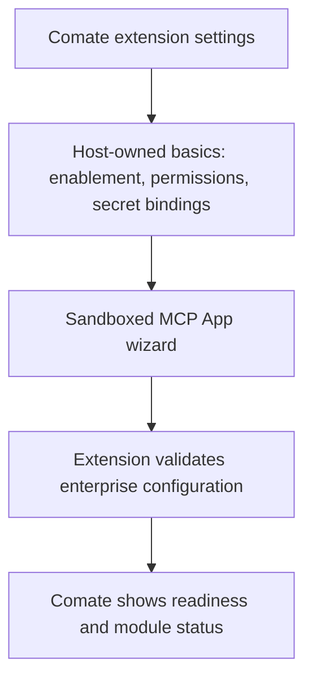

# Enterprise Capability Extension System - Plan

## Goal Capsule

- **Objective:** 企业员工可以在 Comate 中安全使用公司专属的工作流和基础设施能力，同时 Comate 保持通用产品定位。
- **Means:** 采用基于 Agent Skills、MCP、MCP Tasks 和 MCP Apps 的企业能力包，Comate 只补充宿主侧的打包、权限和生命周期 Profile。
- **Product authority:** 本计划定义独立的扩展系统主题，不改变内置 Skills 管理方案的既有范围。
- **Open blockers:** 无阻塞规划的问题；具体封装格式、进程沙箱和权限存储由规划阶段决定。

---

## Product Contract

### Summary

Comate 将支持由企业自行提供的企业能力包，使 Ultra-X 一类内部能力能够被员工安装和使用，而不进入 Comate 的通用产品代码。
扩展边界采用现有开放标准，Comate 不定义新的工具调用或配置页面通信协议。

### Problem Frame

Comate 服务于与具体企业基础设施无关的通用 Agent 工作，而 Ultra-X 包含 CI、AOMP、内部认证、定时任务、ChatOps 和管理页面等企业专属能力。
直接合并 Ultra-X 会让 Comate 的发布节奏、依赖和安全边界与某家公司的内部系统绑定。
只复制 Skills 或调用 CLI 又无法覆盖配置页面、长任务、密钥、权限和最终发布确认，因此需要一个比 Skills 更完整但仍保持解耦的承载边界。

### Key Decisions

- **扩展系统作为独立主题。** (session-settled: user-directed — chosen over 扩大内置 Skills 管理方案: 企业工作流具有独立的运行和安全边界) Governs R1, R5.
- **采用标准化企业能力包。** (session-settled: user-approved — chosen over Comate 私有扩展通信协议: 降低开发者学习成本并提高可移植性) Governs R1-R7.
- **Cordis 仅作为扩展内部可选实现。** (session-settled: user-approved — chosen over 将 Cordis 引入 Comate 宿主: Cordis 不提供跨进程安全与通用分发契约) Governs R1, R8.
- **一个企业包按需启用内部模块。** (session-settled: user-directed — chosen over 每项能力单独安装: 企业能力需要统一交付但不应全部默认启用) Governs R13, R14.
- **用户自行安装。** (session-settled: user-directed — chosen over 仅管理员集中安装: 首期面向员工自主启用能力) Governs R13.
- **扩展在隔离进程运行。** (session-settled: user-directed — chosen over 在 Comate 主进程执行任意扩展代码: 企业代码需要明确的故障和权限边界) Governs R8-R10.
- **统一基础配置加沙箱化扩展向导。** (session-settled: user-directed — chosen over 纯表单或完全自由页面: 通用配置保持一致，企业流程保留表达能力) Governs R15.
- **只在最终危险操作前确认。** (session-settled: user-directed — chosen over 每一步确认或只给操作指南: 扩展应真正完成自动化而不制造确认疲劳) Governs R11, R18.
- **CI 构建到 AOMP 发布是首个验收工作流。** (session-settled: user-directed — chosen over 先覆盖其他企业流程: 该流程同时验证配置、长任务、内部系统调用和危险操作审批) Governs R18-R20.

### Requirements

**Standards and portability**

- R1. 企业能力包必须由标准 Agent Skills、标准 MCP Server 和可选 MCP Apps 组成，Comate 不新增私有工具调用协议。
- R2. Comate 与企业扩展之间必须使用官方 MCP 能力，并通过协议能力协商处理版本差异。
- R3. 构建和发布等长时间操作必须使用 MCP Tasks 表达可跟踪任务。
- R4. 扩展提供的配置向导和状态页面必须使用 MCP Apps 接入 Comate。
- R5. 面向 Agent 的操作知识和工作流说明必须采用 Agent Skills，使同一能力包可以被不同 Agent 后端理解。
- R6. 工具参数、配置字段和结构化返回值必须使用 JSON Schema 描述。
- R7. 包元数据应兼容 MCP `server.json` 的表达方式，但首期安装不得依赖仍处于 preview 的公共 MCP Registry。

**Isolation and trust**

- R8. 企业扩展代码必须运行在 Comate 主进程之外，使扩展故障或内部依赖不会直接破坏桌面宿主。
- R9. Comate 必须依据用户可见的权限声明限制扩展访问网络、文件、本地命令和宿主能力。
- R10. Comate 必须通过逻辑密钥绑定向扩展提供凭据，配置页面和 Agent 上下文不得获得原始密钥值。
- R11. 构建等可恢复步骤无需逐步确认，但最终发布等危险操作必须在执行前获得用户确认。
- R12. MCP 工具注解只能辅助展示风险，Comate 自身的安全策略必须是审批和授权的最终权威。

**Installation, configuration, and lifecycle**

- R13. 每位员工必须能够自行安装一个企业能力包，无需把包内容合并进 Comate 发布物。
- R14. 用户必须能够按需启用或停用包内模块，未启用模块不得向 Agent 暴露工具或 Skills。
- R15. Comate 必须提供统一基础配置，并在沙箱中承载扩展提供的配置向导和状态页面。
- R16. Comate 必须显示扩展的安装、启用、运行、失败和升级状态。
- R17. 用户必须能够停用或卸载企业能力包，相关能力随后不再可用。

**CI to AOMP workflow**

- R18. 用户发起构建发布任务后，扩展必须实际调用企业 CI 和 AOMP 完成流程，而不是把用户导向相应 Web 页面手工操作。
- R19. 构建阶段必须向 Comate 返回可跟踪的进度、日志摘要以及成功或失败结果。
- R20. 构建任务仍可取消时，用户必须能够从 Comate 请求取消。

### Actors

- A1. **企业员工：** 安装和配置企业能力包，并批准最终危险操作。
- A2. **Agent：** 根据 Skills 理解用户目标并调用扩展暴露的 MCP 能力。
- A3. **Comate Host：** 管理安装、隔离、权限、密钥绑定、UI 沙箱和最终审批。
- A4. **企业能力包：** 封装 Ultra-X 的企业工作流、工具和配置体验。
- A5. **企业 CI 与 AOMP：** 执行实际构建和发布并返回任务状态。

### Configuration Surface

配置体验采用已确认的“统一基础配置 + 扩展向导”结构，覆盖 R10、R15 和 R16。

### Key Flows

- F1. Install and configure an enterprise capability pack
  - **Trigger:** 企业员工选择一个获准的内部能力包。
  - **Actors:** A1, A3, A4
  - **Steps:** Comate 展示来源和权限，用户完成安装、基础配置和扩展向导，再按需启用模块。
  - **Outcome:** Agent 只看到已启用且配置就绪的企业能力。
  - **Covered by:** R7-R10, R13-R17

- F2. Build with CI and publish through AOMP
  - **Trigger:** 企业员工要求构建并发布目标项目。
  - **Actors:** A1-A5
  - **Steps:** Agent 调用扩展，扩展启动 CI 并回传任务进度；构建成功后，Comate 在 AOMP 发布前请求一次最终确认。
  - **Outcome:** 用户确认后扩展完成发布并返回结果，用户拒绝时流程停在未发布状态。
  - **Covered by:** R10-R12, R18-R20

- F3. Disable or remove an enterprise capability pack
  - **Trigger:** 企业员工停用模块或卸载能力包。
  - **Actors:** A1, A2, A3, A4
  - **Steps:** Comate 停止向 Agent 暴露相应能力，终止受影响的扩展运行实例，并更新状态。
  - **Outcome:** 后续任务无法调用已停用能力，Comate 的其他功能继续工作。
  - **Covered by:** R8, R14, R16, R17

### Acceptance Examples

- AE1. Install without Cordis in Comate
  - **Covers R1, R8.**
  - **Given:** Ultra-X 的 MCP Server 内部选择使用 Cordis 管理模块。
  - **When:** 用户在未集成 Cordis 的 Comate 中安装该企业能力包。
  - **Then:** Comate 通过标准 MCP 边界加载和使用它，不感知其内部框架。

- AE2. Confirm only the final dangerous action
  - **Covers R11, R18-R20.**
  - **Given:** CI 构建可以自动执行，AOMP 发布会改变外部环境。
  - **When:** 用户要求构建并发布且构建成功。
  - **Then:** 构建过程不中断请求确认，Comate 只在调用最终发布动作前确认一次。

- AE3. Reject publication
  - **Covers R11, R18.**
  - **Given:** 构建已成功并等待 AOMP 发布确认。
  - **When:** 用户拒绝确认。
  - **Then:** 扩展不调用发布动作，并保留清晰的未发布结果。

- AE4. Keep secrets outside the extension UI
  - **Covers R9, R10, R15.**
  - **Given:** 配置向导需要 CI 凭据并声明企业网络访问。
  - **When:** 用户绑定已有密钥并保存配置。
  - **Then:** 向导只获得绑定状态，扩展只在获准调用中使用凭据，原始值不进入页面或 Agent 上下文。

- AE5. Disable one module
  - **Covers R14, R16, R17.**
  - **Given:** 企业能力包同时包含 CI/AOMP、ChatOps 和定时任务模块。
  - **When:** 用户只启用 CI/AOMP。
  - **Then:** Agent 可以发现 CI/AOMP 能力，但无法发现 ChatOps 和定时任务能力。

- AE6. Operate without the public registry
  - **Covers R7, R13.**
  - **Given:** 公共 MCP Registry 不可用或不允许承载企业包信息。
  - **When:** 用户从企业批准的来源安装兼容包。
  - **Then:** 安装流程仍可完成，并显示包来源和权限。

### Success Criteria

- Ultra-X 无需进入 Comate 主仓库或主进程即可交付完整的 CI 到 AOMP 工作流。
- 扩展开发者主要使用 Agent Skills、MCP、MCP Tasks、MCP Apps 和 JSON Schema，不需要学习 Comate 私有 RPC 或页面桥接协议。
- 用户可以在 Comate 内完成安装、配置、构建、进度跟踪、最终确认和发布结果查看。
- 停用、失败或卸载企业扩展不会阻断 Comate 的通用 Agent 工作。

<!-- ce-section: work-relationships -->
### How This Work Fits Together

本计划只负责企业扩展系统；以下关系是当前理解，不构成后续工作的既定路线图。

- **Shares with** 内置 Skills 管理：复用 Agent Skills 的发现和加载语义，但不扩大 `skill-manager` 的职责。
- **Enables** Ultra-X 接入：内部工作流可以迁移为企业能力包，而不改变 Comate 的产品定位。
- **Can proceed independently of** 公共扩展市场：首期可以从企业批准的来源安装。
- **Still to decide** 企业集中分发和管理员策略：这些能力可在后续独立规划。

### Scope Boundaries

**Deferred for later**

- 公共扩展市场、评分、推荐和商业分发。
- 企业管理员集中推送、强制安装和组织级配置继承。
- 将 ChatOps、定时任务和其他 Ultra-X 模块作为首期端到端验收流程。

**Outside this product's identity**

- 在 Comate 主仓库中直接维护特定公司的 CI、AOMP、认证或团队流程实现。
- 把 Cordis 或任何单一扩展框架设为 Comate 扩展的必选运行时。
- 允许扩展在 Comate 主进程中执行任意代码或绕过宿主权限检查。
- 为替代 MCP、MCP Apps 或 Agent Skills 而建立 Comate 私有协议体系。

### Dependencies and Assumptions

- Comate 支持的 Agent 后端能够消费标准 Agent Skills，并通过 Comate 使用 MCP 工具。
- 企业能够提供 CI、AOMP 和认证系统的稳定调用方式及员工访问授权。
- MCP Tasks 和 MCP Apps 的具体版本兼容策略需要随官方扩展规范演进。
- Comate 的现有浏览器审批与密钥管理能力可以作为宿主安全策略的参考，而不是直接视为扩展实现。

### Outstanding Questions

**Deferred to Planning**

- 企业包首期采用 MCPB、npm、OCI 还是企业下载包作为物理封装。
- 一个企业包运行单个 MCP Server 还是按模块启动多个 Server。
- 各操作系统上的隔离进程、资源限制和网络控制采用何种机制。
- 权限声明和 Comate 特有包元数据如何在 `server.json` 的命名空间字段中表达。
- 如何把现有 Ultra-X 配置和凭据迁移为 Comate 的逻辑密钥绑定。

### Sources and Research

- [Agent Skills specification](https://agentskills.io/specification)
- [MCP 2026-07-28 release: Extensions and Tasks](https://blog.modelcontextprotocol.io/posts/2026-07-28/)
- [MCP Apps overview](https://modelcontextprotocol.io/extensions/apps/overview)
- [MCP Registry overview](https://modelcontextprotocol.io/registry/about)
- [MCP tool annotations and trust guidance](https://blog.modelcontextprotocol.io/posts/2026-03-16-tool-annotations/)
- [JSON Schema Draft 2020-12](https://json-schema.org/draft/2020-12)
- `CONCEPTS.md`
- `docs/plans/2026-09-03-2124-refactor-conversational-skill-management-plan.md`
